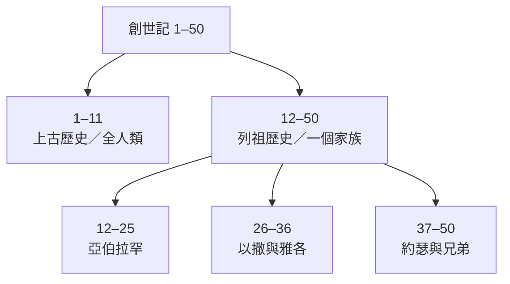
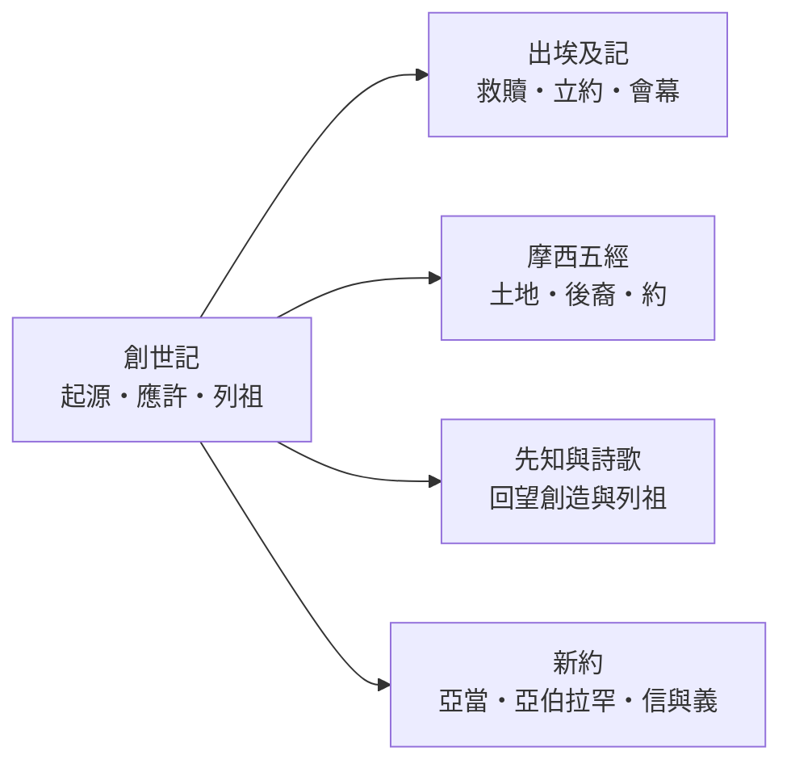

<!-- book-introduction-navigation:start -->
| [[01 創世記/全書目錄及綱要|全書目錄及綱要]] | [[01 創世記/第1章|開始讀第1章]] |
| :--- | ---: |
<!-- book-introduction-navigation:end -->

---

# 創世記

*聖經第一卷書・摩西五經的開端*

《創世記》從天地受造寫起，記述人的受造與墮落、洪水與列國的分散，之後把焦點轉向亞伯拉罕一家，再經過以撒、雅各與約瑟，直到以色列一家進入埃及。它不只交代許多「起源」，也為後面《出埃及記》以及整本聖經反覆出現的土地、後裔、祝福、約、罪與拯救等主題奠定背景。

<!-- sources: CT00, GT00, KC0, BH, BIBLEPROJECT -->

---

## 一覽

| 項目 | 資料 |
| --- | --- |
| 位置 | 摩西五經第一卷；舊約第一卷 |
| 章數 | 50 章 |
| 希伯來書名 | בְּרֵאשִׁית（Bereshith，「起初」） |
| 希臘書名 | Genesis，帶有「起源、生成」之意 |
| 傳統作者歸屬 | 摩西 |
| 傳統成書框架 | 出埃及後的摩西時期，約主前十五至十四世紀 |
| 全書大分段 | 1–11章上古史；12–50章列祖史 |

<!-- sources: CT00, BH, KC0, GT00, BIBLEPROJECT, YALE -->

---

## 書名

中文的《創世記》承接希臘文舊約的名稱 **Genesis**，意思接近「起源、生成、出生」。希伯來聖經則按照卷首第一個字 **בְּרֵאשִׁית（Bereshith）** 稱這卷書為「起初」。兩個名稱都很貼近本書內容：天地、人類、婚姻與家庭、罪與死亡、列國、以色列先祖，以及神與人立約的許多重要線索，都從這卷書開始展開。

《創世記》同時也是摩西五經的第一卷。它先交代世界與以色列先祖的故事，讓《出埃及記》到《申命記》的救贖、立約、律法與應許之地有一個歷史和神學上的前提。

> [!note] 「起初」不只指天地的開始
> 本書一直在交代「事情怎麼走到這一步」：人為什麼會面對罪與死亡、列國從何而來、亞伯拉罕一家為何被揀選，以及為什麼《出埃及記》開始時，以色列人已經住在埃及。

<!-- sources: CT00, GT00, KC0, BH -->

---

## 作者、成書與背景

猶太教與基督教傳統長期把《創世記》連同其餘四卷摩西五經與摩西聯繫在一起。CT00、KingComments 與 BibleHub 都沿用這條傳統，並把本書的寫作背景放在出埃及之後、以色列人在西奈或曠野的時期；按這種理解，成書年代大約落在主前十五至十四世紀。

近代以來，許多研究者則從重複敘事、用詞差異、家譜與編輯痕跡等現象討論五經材料的長期形成，認為《創世記》可能包含不同時期流傳、寫作與編整的材料。Enter the Bible 與 Yale 都採這類研究框架，但對不同材料究竟如何劃分、何時形成、何時完成，學界並沒有一套完全一致的模型。

這兩種討論不宜簡化成一句「誰對誰錯」。傳統作者歸屬主要回答這卷書在信仰傳統中與摩西五經的關係；現代成書研究則追問現有文本可能經過哪些傳承與編輯階段。導論需要把這些問題分開，尤其不能把故事發生的年代直接當成寫作年代。

故事本身的舞台從美索不達米亞與古代近東的世界，逐步移到迦南，最後進入埃及。族長的遷徙、牧養、婚姻、繼承、土地交易與饑荒，都應放在古代近東的社會背景中理解。尤其創世記1–11章與古代美索不達米亞的創造、洪水傳統存在可比較之處；這些平行材料有助於理解當時的思想世界，但不能僅憑相似性就簡化成「誰抄誰」。

| 要分開看的問題 | 本卷導論的處理 |
| --- | --- |
| 故事所描寫的時代 | 從創造與上古敘事，一直到族長與約瑟；這是故事世界，不等於寫作日期。 |
| 傳統作者歸屬 | 摩西；傳統成書框架多放在出埃及後的西奈／曠野時期，約主前十五至十四世紀。 |
| 現代成書研究 | 多階段傳承、寫作與編輯；對材料劃分與最終形成年代仍有不同模型。 |
| 主要故事地域 | 美索不達米亞／古代近東 → 迦南 → 埃及。 |

> [!important] 年代問題要先問「是哪一種年代？」
> 「亞伯拉罕活在什麼時代」、「摩西傳統如何理解作者」、「材料何時形成」與「今天這個文本何時完成」不是同一個問題。本專案在來源有分歧時，會把這些層次分開呈現。

<!-- sources: CT00, GT00, KC0, BH, ENTER_THE_BIBLE, YALE -->

---

## 主旨與寫作目的

《創世記》的主線從神的創造開始。世界原本被描寫為有秩序、有生命而且美好，人受造承擔神形像與治理的使命；但人的悖逆使罪、死亡、暴力與彼此疏離逐步擴大。從伊甸園、該隱與亞伯，到洪水和巴別塔，故事一次又一次顯示人的問題不是環境換了就會消失。

然而人的失敗沒有讓故事停止。創世記12章成為全書的重要轉折：神呼召亞伯蘭，應許土地、後裔與祝福，而且一開始就把「地上的萬族」放在這個應許的遠景裡。後面的族長故事不是單純記錄一個家族的興衰，而是在一群同樣會害怕、欺騙、衝突和失敗的人身上，追蹤應許如何繼續往前。

從五經的整體脈絡看，本書也在交代以色列的來歷：他們的祖先是誰、應許從何而來、為什麼會從迦南進入埃及，以及神對這個家族的揀選如何仍然指向更廣的萬族祝福。

<!-- sources: CT00, BH, BIBLEPROJECT, ENTER_THE_BIBLE -->

---

## 本書的重要性與特色

《創世記》的重要，不只是因為它排在聖經第一卷，而是因為後面許多重要觀念都在這裡第一次形成清楚的故事背景。創造、神的形像、安息、婚姻、罪與死亡、審判與憐憫、祭、約、後裔、土地、祝福與列國，之後在律法書、先知書、詩歌智慧書與新約中都會再次出現。

這卷書也有很強的敘事特色。它不是把一套教義先列成條文，而是讓讀者透過一代又一代的人物、家庭衝突、重複事件與反轉，看見人的選擇如何帶來後果，以及神的應許如何在混亂中沒有中斷。

**從全人類收束到一個家族**  
1–11章處理全人類，12章後聚焦亞伯拉罕一家；焦點雖然縮小，目標卻仍指向萬族得福。

**家譜也是故事骨架**  
反覆出現的 toledot（「這是……的後代／記略」）公式把不同世代串起來，使家譜兼具承接、分段與推進敘事的功能。

**人物並不是完美英雄**  
亞伯拉罕、雅各與約瑟家族的故事保留大量軟弱、偏愛、欺騙與衝突；經文的重點常不只是「模仿誰」，而是觀察神如何在人的失敗中推動應許。

**重複與對照非常重要**  
兄弟競爭、不孕、長幼次序、離開與歸回、饑荒與寄居等情節一再出現，邀請讀者比較不同世代的相似與變化。

<!-- sources: CT00, GT00, KC0, BH, BIBLEPROJECT, ENTER_THE_BIBLE, YALE -->

---

## 全書結構

《創世記》最容易掌握的宏觀分界，是 **1–11章與12–50章**。前一部分從創造談到全人類、洪水、列國與巴別；後一部分從亞伯拉罕蒙召開始，集中記述以色列先祖。若再往下分，族長故事可以按亞伯拉罕、以撒與雅各、約瑟幾個主要階段閱讀。

| 範圍 | 段落 | 內容重點 |
| --- | --- | --- |
| 1–11章 | 上古歷史 | 創造、人類的墮落、該隱與亞伯、洪水、挪亞之約、列國與巴別塔。 |
| 12–25章 | 亞伯拉罕 | 蒙召、土地與後裔的應許、與神立約、以撒出生，以及信心所面對的考驗。 |
| 26–36章 | 以撒與雅各 | 應許進入下一代，家族衝突、長子名分、雅各離家與歸回，並逐步形成「以色列」家族。 |
| 37–50章 | 約瑟與兄弟 | 約瑟被賣到埃及、升高、饑荒、兄弟重逢與和好；雅各一家因此進入埃及。 |

> [!tip] 家譜不要全部跳過
> 《創世記》的家譜常在轉換時代、收束支線、指出主要後裔。讀不下所有名字時，至少看清楚「從誰接到誰、焦點最後落在哪一支」。

<!-- sources: CT00, GT00, BH, BIBLEPROJECT, ENTER_THE_BIBLE, YALE -->

---

## 鑰節、鑰字與核心主題

CT00 選出的鑰節集中在幾個全書基礎問題：人按神的形像受造、人在善惡與死亡面前的選擇、亞伯拉罕蒙召，以及亞伯拉罕因信被算為義。把這些經文和全書重複出現的「祝福、後裔、土地、約」放在一起，就能看到《創世記》不是一串彼此無關的古代故事。

| 經文 | 在全書中的位置 |
| --- | --- |
| 創1:26 | 人按神的形像受造，並領受治理受造界的使命。 |
| 創2:16-17 | 人的自由、界線與死亡問題被放進伊甸園敘事的核心。 |
| 創12:1-3 | 亞伯拉罕蒙召；土地、後裔與祝福的應許開始聚焦，而且目的延伸到萬族。 |
| 創15:6 | 亞伯拉罕信耶和華，成為後來聖經討論信與義的重要經文。 |

**鑰字／重複線索：** 起初、敗壞、祝福、後裔、地、約

- **創造與神的形像**：世界屬於創造它的神，人被賦予特殊尊嚴與責任；這成為後續聖經理解人與受造界的重要起點。
- **罪、審判與憐憫**：人的悖逆不斷擴大，但審判敘事中也反覆保留神的保守、憐憫與重新開始。
- **應許與祝福**：土地、後裔與祝福從亞伯拉罕開始成為族長故事的主線，而「萬族得福」使這條線始終帶著普世方向。
- **揀選與人的不完全**：神所揀選的人物並非沒有缺點；故事的張力常在於應許如何穿過人的軟弱與錯誤繼續前進。
- **兄弟衝突與和好**：從該隱與亞伯，到以掃與雅各、約瑟與兄弟，兄弟關係一再成為人的破裂與可能和好的縮影。

<!-- sources: CT00, GT00, BH, BIBLEPROJECT, ENTER_THE_BIBLE -->

---

## 與其他書卷的關係

《創世記》和《出埃及記》幾乎是直接接續的。創世記最後，以色列一家已經住在埃及，約瑟也死在埃及；出埃及記則從幾個世代以後，以色列人在埃及受壓迫開始。因此前者交代「這群人為什麼在這裡」，後者開始回答「神要如何把他們帶出去，並使他們成為立約的百姓」。

本書建立的主題也一路向後延伸。摩西五經繼續發展土地、後裔、約與神同在；先知書與詩篇不斷回到創造、亞伯拉罕與列祖；新約則再次使用亞當、亞伯拉罕、信與義、麥基洗德等人物與主題來說明基督與救恩。因此《創世記》既是一卷完整的書，也像整本聖經許多主線的起點。

<!-- sources: CT00, KC0, BH, BIBLEPROJECT -->

---

> [!info]- 本頁來源與方法
>
> 本頁以 **CT00 的書卷提要節奏作為編排參考**；CT00、GT00、KC0、BH 是四套既有註釋來源，BibleProject、Enter the Bible、Yale 屬補強層，不加入四家共識票數。
>
> - **CT00**｜[CCBibleStudy《創世記提要》](https://www.ccbiblestudy.org/Old%20Testament/01Gen/01CT00.htm)
> - **GT00**｜[CCBibleStudy《創世記導論拾穗》](https://www.ccbiblestudy.org/Old%20Testament/01Gen/01GT00.htm)
> - **KC0**｜[KingComments — Genesis Introduction](https://www.kingcomments.com/en/bible-studies/Gen/0)
> - **BH**｜[BibleHub — Genesis Summary and Study Bible](https://biblehub.com/genesis/)
> - **BIBLEPROJECT**｜[BibleProject — Book of Genesis Guide](https://bibleproject.com/guides/book-of-genesis/)
> - **ENTER_THE_BIBLE**｜[Enter the Bible — Genesis](https://enterthebible.org/courses/genesis/)
> - **YALE**｜[Yale Bible Study — Genesis Introduction](https://yalebiblestudy.org/courses/genesis/lessons/genesis-introduction-study-guide/)
>
> GT00 是多家導論與研讀資料的合輯，使用其中個別觀點時必須保留子來源；BibleHub 即使整合多種底層資料，在本專案仍只算一個 BH 來源維度。作者、年代、文類與歷史問題若有分歧，本文按不同問題層次並列，不用單一來源替其他來源下裁決。

---

<!-- book-introduction-navigation:start -->
| [[01 創世記/全書目錄及綱要|全書目錄及綱要]] | [[01 創世記/第1章|開始讀第1章]] |
| :--- | ---: |
<!-- book-introduction-navigation:end -->
