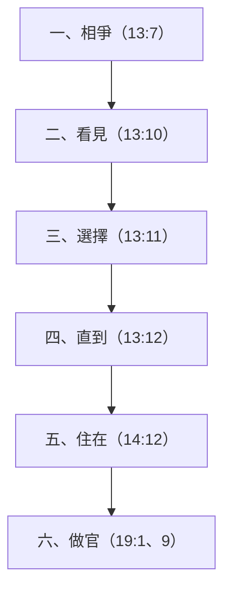

# 創世記 第13章

<!-- chapter-navigation:start -->
| [前一章](../01%20創世記/第12章.md) | [回目錄](../01%20創世記/全書目錄及綱要.md) | [下一章](../01%20創世記/第14章.md) |
| :--- | :---: | ---: |
<!-- chapter-navigation:end -->

1. [[亞伯蘭]]帶著他的妻子與[[羅得]]，並一切所有的，都從[[埃及]]上[[南地]]去。
2. [[亞伯蘭]]的金、銀、牲畜極多。
3. 他從[[南地]]漸漸往[[伯特利]]去，到了[[艾|伯特利和艾的中間]]，就是從前支搭帳棚的地方，
4. 也是他起先[[帳棚與祭壇|築壇]]的地方；他又在那裡[[求告耶和華的名]]。
5. 與[[亞伯蘭]]同行的[[羅得]]也有牛群、羊群、帳棚。
6. [[牧人水草與土地承載|那地容不下他們]]；因為他們的財物甚多，使他們不能同居。
7. 當時，[[迦南人]]與[[比利洗人]]在那地居住。[[亞伯蘭]]的牧人和[[羅得]]的牧人相爭。
8. [[謙讓|亞伯蘭就對羅得說]]：你我不可相爭，你的牧人和我的牧人也不可相爭，因為我們是[[骨肉原文作弟兄|骨肉【原文作弟兄】]]。
9. 遍地不都在你眼前嗎？請你離開我：你向左，我就向右；你向右，我就向左。
10. [[羅得]]舉目看見[[約但河]]的全平原，直到[[瑣珥]]，都是滋潤的，那地在耶和華未滅[[所多瑪]]、[[蛾摩拉]]以先如同[[耶和華的園子]]，也像[[埃及]]地。
11. 於是[[羅得的世俗選擇與後果|羅得選擇約但河的全平原]]，[[往東遷移]]；他們就彼此分離了。
12. [[亞伯蘭]]住在[[迦南地]]，[[羅得]]住在平原的城邑，漸漸挪移帳棚，直到[[所多瑪]]。
13. [[所多瑪]]人在耶和華面前罪大惡極。
14. [[羅得]]離別[[亞伯蘭]]以後，耶和華對亞伯蘭說：從你所在的地方，你舉目向東西南北觀看；
15. 凡你所看見的一切地，我都要賜給你和你的後裔，直到永遠。
16. 我也要使你的後裔如同[[後裔如地上的塵沙|地上的塵沙]]那樣多，人若能數算地上的塵沙才能數算你的後裔。
17. 你起來，[[走遍全地與土地所有權|縱橫走遍這地]]，因為我必把這地賜給你。
18. [[亞伯蘭]]就搬了帳棚，來到[[希伯崙]][[幔利]]的橡樹那裡居住，在那裡為耶和華[[帳棚與祭壇|築了一座壇]]。

---

## 本章知識節點

### 人物
- [[亞伯蘭]]
- [[迦南人]]
- [[比利洗人]]
- [[迦南人與比利洗人]]
- [[撒萊]]
- [[羅得]]

### 地點
- [[埃及]]
- [[南地]]
- [[伯特利]]
- [[艾]]
- [[迦南地]]
- [[約但河]]
- [[瑣珥]]
- [[所多瑪]]
- [[蛾摩拉]]
- [[希伯崙]]
- [[幔利]]

### 主題／神學
- [[亞伯拉罕之約]]
- [[帳棚與祭壇]]
- [[求告耶和華的名]]
- [[謙讓]]
- [[信心與世俗的對比]]
- [[羅得的世俗選擇與後果]]
- [[往東遷移]]

### 背景／原文
- [[牧人水草與土地承載]]
- [[面東定向的左右方位]]
- [[耶和華的園子]]
- [[骨肉原文作弟兄]]
- [[後裔如地上的塵沙]]
- [[走遍全地與土地所有權]]

---

## 本章整理

### 回到伯特利與祭壇（1-4節）

亞伯蘭帶著全家和財物從埃及上到南地，然後順著原路回到了[[伯特利]]與[[艾]]之間，也就是他之前搭帳棚、築壇的地方。他在那裡重新[[求告耶和華的名]]。這段經文提到的每一個地名，都是他回頭路上的清楚座標：第3節說那是「從前支搭帳棚的地方」，第4節又補上一句「也是他起先築壇的地方」；這兩句話指的都是同一個地方，刻意強調了亞伯蘭回到最初原點的這份鄭重。GT《舊約背景註釋》估計，從埃及邊界走到伯特利和艾，大約是兩百哩（約三百多公里）的路程——這絕對不是心血來潮的一日遊，而是一段需要逐水草而居、走上好長一段時間的長途跋涉。BH 補充指出，「艾」這個字原本的意思是「廢墟」，剛好跟「伯特利」（意思是「神的家」）形成了強烈的對比；把這兩個地名並列在一起，本身就像是把「跟隨神」與「面對毀滅」同時擺在讀者面前。

> [!quote] KC
> 我們若偏離了主，而主又使我們看清這一點，就必須回到最後與主同在的那個地方。跌倒之後蒙恢復的每一步，都會加深我們對神恩典的稱奇。

GT《聖經精讀本》把第4節的「求告」，解讀為亞伯蘭「痛心悔改自己在埃及的行為」，並且帶著讚美與感恩的心決定重新開始。不過我們要注意經文原本的分寸：經文表面上只說他回到了舊地方並再次求告神，至於他內心有多麼悔改，這是後來的註釋學者從他的行動推論出來的，並不是聖經作者直接寫下來的記錄。

第2節提到，他的金、銀、牲畜「極多」。CT 從原文的意思指出，「極多」這個詞帶有一種「很沉重」的感覺，並且把前一章的饑荒「甚大」（創12:10）跟這裡的財物「極多」放在一起看——因為在原文裡，這兩個詞用的是同一個字根。所以，饑荒和財富都在考驗同一種信心。CT 對此下了一個很直接的結論：「人即使能勝過饑餓，但不一定能勝過富足」。接下來的故事立刻證明了這句話：他們兩家的牲畜和帳棚實在太多了，多到那塊土地根本養不起他們，龐大的財富反而成了牧人們起衝突的導火線。

STEP 原文資料證實了 CT 觀察到的文字連結：前一章形容饑荒「甚大」用的是 כָבֵד（H3515，「沉重」），而這一章第2節形容亞伯蘭時，用的是 כָבֵד מְאֹד（非常沉重）；同一個形容詞用在牲畜和金銀上，就變成了「非常富有」。一邊是把人壓得喘不過氣的饑荒，另一邊是沉甸甸的巨額財富，這兩種「重」都成了考驗信心的真實處境。

### 水草、土地與牧人相爭（5-7節）

在巴勒斯坦的山地放牧，必須跟著季節尋找水源和草地。GT《舊約背景註釋》說明了這種游牧的節奏：每年的四月到九月非常炎熱乾旱，必須把牲畜趕到地勢比較高的地方，才找得到牧草和溪水；到了十月至隔年三月天氣比較冷、比較濕的時候，才會回到平原放牧。牧羊人如果不想長時間離開村莊，就必須過著沒有固定根基的半游牧生活，帶著全家大小跟著牛羊到處搬家。在這種生活型態下，「為了解決誰可以使用水草而引發的爭執，是導致牧人們不和睦最常見的原因」。所以，第6節說的「地容不下」，並不是指整個迦南地的面積不夠大，而是指在同一個放牧區裡，當地的資源沒有辦法同時養活兩個這麼龐大的牧群，詳細背景可以參考[[牧人水草與土地承載]]。

原文把「容不下」寫得非常有重量：逐字翻譯大約是「土地沒有承載他們」。這裡的 נָשָׂא（H5375K）就是承擔、支撐的意思；後半段又重複說他們「不能一起居住」。可見這裡的真正問題，確實是土地沒有能力同時承載兩個大型的牧場，而不是說亞伯蘭和羅得兩個人感情不好。

第7節還特別補充說，當時[[迦南人]]與[[比利洗人]]也住在那裡；這表示亞伯蘭與羅得並不能獨佔那塊土地。GT《串珠聖經註釋》註明，比利洗人是「住在迦南地的一個部落」。KC 和其他中文註釋從這句話引申出一個屬靈的教導：一家人如果在外人面前吵架，等於是讓全世界看他們這些寄居者的笑話，這會損害他們對神的見證；這是一種從當時的環境所體會出來的生活應用，而不是經文本身對他們下的評語。

### 亞伯蘭提出分地（8-9節）

亞伯蘭主動出面解決爭端，他稱呼羅得為「弟兄」。在原文裡，「弟兄」這個詞可以泛指所有的男性親屬，中文聖經為了符合他們叔姪的關係，把它翻譯成了「[[骨肉原文作弟兄|骨肉]]」。GT 李啟榮的《聖經小字解》引用古書，把「骨肉」解釋為最親密的親人——「就算住得遠也會互相往來，有病痛就互相救助，有憂愁就互相分擔，活著的時候一起歡樂，死了也會為對方哀傷」。亞伯蘭雖然是長輩，卻把選擇方向的優先權讓給了羅得，自己願意接受剩下的另一邊。

第7節先把當時的狀況稱為 רִיב（H7379，「爭吵」），到了第8節，亞伯蘭一開口就要求不可再有 מְרִיבָה（H4808，「紛爭」），他給的理由很簡單：「我們是弟兄」。原文的對話推進得非常直接：亞伯蘭沒有先去爭論誰對誰錯，而是直接用兩人共同的身分，硬生生切斷了這場爭端。

第9節亞伯蘭說的「向左、向右」，並不是一句含糊的客套話。GT 丁良才指出：「以色列人是面對著日出的方向（東方）來辨別方位的，所以他們稱東邊為前面、西邊為後面、南邊為右邊、北邊為左邊」。因此，亞伯蘭說的「你向左」，意思就是向北；「我就向右」，意思就是向南。亞伯蘭是用了當時大家通用的方位用語，把那塊土地切成了南北兩半，讓晚輩先挑；我們可以清楚看見他退讓的幅度有多大，詳細解釋可以參考面東定向的左右方位。

各家註釋書普遍把亞伯蘭的這個舉動，看作是[[謙讓]]、慷慨與信心的表現，因為他大可以堅持自己身為長輩、先選土地的權利。GT《聖經精讀本》還進一步列出了亞伯蘭這種自我犧牲所帶來的三個好處：第一，阻止了當地原住民趁他們不和的時候來搶奪財產；第二，因為跟羅得保持和平，所以沒有在外邦人面前破壞神的名聲；第三，亞伯蘭自己也因為更加仰望天上要給他的產業，而讓信心不斷增長。經文並沒有直接告訴我們亞伯蘭當時心裡在想什麼；但可以確定的是，他把維持一家人的和睦，看得比挑選好土地的權利還要重要。

### 羅得選擇約但河平原（10-13節）

羅得站在伯特利的山地上往外看，看見[[約但河]]平原的水源非常充足，一路延伸到最南端的[[瑣珥]]。聖經用了兩個讀者一聽就懂的肥沃地方，來形容那裡有多好：

| 比較的對象 | 想要強調的畫面 |
|---|---|
| 如同[[耶和華的園子]] | 水源充足、植物茂盛，就像當初的伊甸園一樣 |
| 像[[埃及]]地 | 靠著灌溉系統和穩定的水源，可以維持很好的農業和畜牧業 |

於是羅得選擇了平原，[[往東遷移]]，住進了平原的城市裡，並且漸漸把帳棚移到了[[所多瑪]]附近。GT《舊約背景註釋》從地界線的角度，指出了這個決定有多麼嚴重：在整本聖經裡，約但河一直都被當作是迦南地的東邊界線；所以，羅得搬到平原的城市去，「就很清楚地表明他離開了迦南地，把整塊應許之地完全讓給了亞伯蘭」。第12節也把「亞伯蘭住在迦南地」和「羅得住在平原的城邑」直接拿來對比；可見這不是兩個連在一起的社區，而是清清楚楚的「界線內」與「界線外」。

經文並沒有說羅得一開始就打算搬進所多瑪這座罪惡之城，也沒有詳細列出他選地的所有動機；但聖經立刻提醒我們，所多瑪人在神面前是罪大惡極的。而且在第10節，聖經還用了一句「在耶和華未滅[[所多瑪]]、[[蛾摩拉]]以先」，提早把這兩座城市的結局洩漏給了讀者。也就是說，羅得眼中所看見的那片美麗風景，其實是一片早就被神判定要毀滅的土地。到了後面的第14章和第19章，我們還會看到他被敵人抓走、搬進城裡住，最後整座城市遭到神的審判。所以，許多註釋書把這段故事整理成「因為貪圖肥沃的土地，結果一步一步走向罪惡城市」的過程，詳細分析可以參考[[羅得的世俗選擇與後果]]。

GT 丁良才把羅得的這條下坡路，整理成一個可以追蹤的順序，並且一路連到了創世記第19章：

這張圖表的重點，並不是要像警察辦案一樣去定羅得的罪，而是要讓我們看到：他墮落的每一步其實都很小。相爭的時候，他只是沒有出面阻止手下；看見的時候，他只是用眼睛在看；選擇的時候，他只是行使了亞伯蘭讓給他的權利；但是，這條路的終點，卻是他最後坐在所多瑪的城門口當起了官員。KC 也觀察到了同一個結局：羅得後來住進了城裡、買了房子（帳棚不見了），甚至還成為了那座城市議會的一員。傳統中文註釋常說羅得「眼錯、心錯、腳錯」，或者像 KC 說他只顧眼前的利益；這些其實都是從他最後悽慘的下場，反推回來對他做的道德評價，我們不能把它當成是聖經直接揭露羅得當時心裡的所有想法。CT 的說法比較中肯：「人眼睛看起來覺得美好的事物，不一定真的美麗，也不一定對人有益處」。

KC 還提出了一個很容易被大家忽略的細節：亞伯蘭之前下埃及的失敗，可能讓羅得也跟著嘗到了世俗的味道。

> [!quote] KC
> 倚靠別人信心的人，也會跌進那人的錯誤裡。亞伯蘭從偏離埃及一事學到了功課，羅得卻沒有顯出他學到什麼。……父母若偏離、有一段時間愛了世界，即使後來蒙神的恩典恢復、再次放下世界，他們的兒女卻可能已經嘗到世界的味道，並且留在其中。

GT《聖經精讀本》則是把羅得選擇的下場一路寫到底：這個決定最後導致他被敵人擄走、整座城市和他的家產都被燒光、失去了妻子和兩個女婿，而且整個家庭還陷入了創世記第19章所記錄的那種極度敗壞之中。

### 神重申土地與後裔應許（14-17節）

羅得離開之後，神吩咐亞伯蘭向東、西、南、北四面觀看，並且再次保證，要把他所看到的這片土地賜給他和他的後代；神還用地上數不清的灰塵和沙子，來形容他的後代會有多麼龐大。這個時間點非常值得注意：耶和華是在「羅得離別亞伯蘭以後」，才對他說這番話的。這段話其實是把第12章裡關於土地和成為大國的應許，作了更進一步的擴展：

第10節羅得的「舉目」和第14節亞伯蘭的「舉目」，在原文裡是刻意安排好的對比。羅得是「舉起」他自己的「眼睛」，而亞伯蘭則是聽見神的吩咐去「舉起」他的「眼睛」；這兩個地方用的主要動詞（H5375M，「舉起」）和名詞（H5869A，「眼睛」）完全一模一樣。第11節還特別強調羅得是「為自己選擇」。因此，許多註釋書說這是「憑眼見」與「憑應許」的強烈對比，這完全是有原文的用字作為根據的。

| 第12章的應許 | 第13章的擴展 |
|---|---|
| 往神所指示的地去 | 從所在的地方向四面八方觀看 |
| 把這地賜給你的後裔 | 把這地賜給亞伯蘭和他的後裔，直到永遠 |
| 讓你成為大國 | 後裔多得像地上的塵沙，無法數算 |

「[[後裔如地上的塵沙|塵沙]]」是一種用來形容數量極多的修辭手法；GT《串珠聖經註釋》直接說這是一種「修辭上的誇大語法，為了強調子孫眾多」。有些傳統的註釋書會把這裡的「塵沙」解釋為肉身上的後裔，把第15章第5節的「眾星」解釋為屬靈上的後裔；但不論是哪一種說法，這兩段經文想要表達的重點都是一樣的：後裔會多到人根本數不完。

接著，神又命令亞伯蘭要[[走遍全地與土地所有權|縱橫走遍這地]]。BH 指出，在古代中東地區，「走遍一塊土地」是宣示取得土地所有權的一種象徵性動作（可以參考約書亞記1:3）；第14節的「向東西南北觀看」，也同樣反映了當時買賣土地時要先勘查地形的習慣。勘查土地這個動作本身，就是一種擁有權力和領受祝福的記號。GT《創世記雷氏研讀本》把第18節的「搬了帳棚」，直接翻譯為「他住帳棚」或是「一直遷移他的帳棚」，並且認為亞伯蘭這種持續不斷搬家移動的動作，也是在向世人展示他對這塊應許之地的所有權。因此，這三個動作其實是一整套完整的程序——先看、再走、最後住下來——而不是三件毫不相干的事情。這也解開了這一章表面上看起來很矛盾的地方：亞伯蘭明明領受了「直到永遠」的土地應許，但他卻依然住在帳棚裡，連一寸屬於自己的產業都沒有；但在這套古代習俗的框架下，住在帳棚裡並不是應許落空的證明，這反而正是他取得土地的方法。

GT 丁良才也提醒我們，這個應許的兌現是有時間差的：亞伯蘭活著的時候，終究沒有真正得到那塊土地；後來他的子孫雖然得到了迦南地作為產業，但他們所享受到的，也只不過是神廣大應許之地的其中一部分而已（見來11:9、13、39）。CT 把它解釋為我們信心的容量——「我們的信心有多大，就能夠領受神多大的應許」；這是一種在生活應用上的推論，我們應該把它跟古代背景習俗的說明分開來看。至於有些中文註釋書把「東西南北」或是「縱橫」直接解釋為耶穌的十字架，這同樣是基督徒後來所賦予的屬靈意義，並不是這些方向詞原本的意思。

第17節的命令在原文是很清楚的：神要他「起來」、「走遍」，並且把範圍指定為「按著它的長」與「並按著它的寬」。這不是叫他只走到某一個著名的地標就算了，而是要他在整片土地上來回不斷地走動；中文聖經翻譯成「縱橫走遍」，可以說是非常精準地抓到了原文「長」與「寬」的神韻。

GT 丁良才還把亞伯蘭在整卷創世記裡的「舉目」整理成了一組對照，這讓第14節的觀看，在亞伯蘭一生的故事裡有了一個清楚的位置：

| 次序 | 他舉目看見了什麼 |
|---|---|
| 第一次 | 看見地面的土地（創13:14） |
| 第二次 | 看見天上的眾星（創15:5） |
| 第三次 | 看見神派來的使者（創18:2） |
| 第四次 | 看見代替以撒的公羊（創22:13） |

### 希伯崙幔利的祭壇（18節）

最後，亞伯蘭搬到了[[希伯崙]]地區，住在[[幔利]]的橡樹附近，並且在那裡再次築了一座壇。「幔利」這個名字既可以是一個地名，到了第14章13節，它也成了一個跟亞伯蘭結盟的亞摩利人的名字；GT 丁良才指出，幔利其實是以實各和亞乃這兩人的哥哥，他們三兄弟都跟亞伯蘭簽訂了盟約，「這裡的橡樹，就是因為這位幔利而得名的」。所以，「幔利的橡樹」可以是因為當地的一個重要人物，或是因為那片地區而得名。

希伯崙位在猶大的山地裡，當地的泉水和井水非常豐富，足夠讓人種植橄欖、葡萄，並且過著半農半牧的生活；它還剛好位在兩條古代交通要道（通往拉吉與耶路撒冷）的交會點上。至於它到底離耶路撒冷有多遠，我們參考的四份註釋資料給的數字都不太一樣，我們可以把它們並列出來，不需要硬把它們統一：

| 參考來源 | 對希伯崙位置的描述 |
|---|---|
| GT《舊約背景註釋》 | 位於猶大山地，海拔約3,300呎；在耶路撒冷西南方約十九哩（約三十公里），別是巴東北方二十三哩 |
| GT《串珠聖經註釋》 | 希伯崙與幔利指的是同一個地區，位在耶路撒冷以南三十二公里（二十哩） |
| GT《創世記雷氏研讀本》 | 位於耶路撒冷以南二十二哩（三十五公里） |
| GT 李道生《舊約聖經問題總解》 | 距離耶路撒冷南方大約六十五里 |

這些數字的差距大約在十九到二十二哩之間，這主要是因為古代的里程換算方式和測量基準點不同所造成的，但這完全不影響大家對「希伯崙位在耶路撒冷以南的猶大山地」這個地理共識。李道生還補充記錄說，希伯崙「是世界上最古老的一座城市」，它原本的名字叫基列亞巴，後來被以色列人選作逃城；大衛三十歲的時候，以色列的長老就是在這裡膏立他作王的，後來他兒子押沙龍造反，也是在這裡自立為王，所羅門的兒子羅波安也曾經把這座城修建為堅固的堡壘。GT《舊約背景註釋》還提供了一條年代線索：聖經記載希伯崙比埃及的鎖安城早七年建造，考古學家考證大約是在主前十七世紀建成的；後來包含亞伯拉罕在內的族長們都葬在這個地方，這更加強了它在政治上的重要地位。後來撒拉就葬在附近的麥比拉洞裡，希伯崙也因此成為了族長家族的一個重要中心。有些中文註釋書會把「希伯崙」這個名字原本「聯合、交通」的意思，發展成信徒要「與神交通」的屬靈教導；但回到這章經文本身，亞伯蘭對神最直接的回應，依然是他選擇住在那裡，並且為神築了一座壇。

### 信心與選擇的敘事對照

| 亞伯蘭的選擇 | 羅得的選擇 |
|---|---|
| 把選地的優先權讓給對方 | 毫不客氣地挑選了水源豐富的平原 |
| 留在神所應許的迦南地 | 越過約但河的東邊界線，住進平原的城市 |
| 聽從神的吩咐，才舉目觀看 | 自己舉目看見美麗的平原就做決定 |
| 得到了土地與後裔的偉大應許 | 帳棚漸漸往所多瑪挪移，最後走向毀滅 |
| 到幔利去，為神築了一座壇 | 整章第13章，完全沒有記錄羅得有為神築壇 |

這個強烈的對比，是聖經作者在敘事上刻意安排好的，這也是許多牧者在講道時，用來比較[[信心與世俗的對比]]最核心的材料。亞伯蘭和羅得不一樣的地方，不只是他們心裡的態度，更在於他們取得土地的方式：羅得是用自己的眼睛，挑了一塊看得見的肥沃土地，然後當場就佔有它；亞伯蘭則是被神吩咐，要用自己的腳去走遍那片一眼看不完的廣大土地，他是用不斷地行走與築壇來向世人宣告他的信仰，把應許兌現的時間表，完全交給了神。GT《啟導本》在總結亞伯蘭的態度時說，他之所以不在乎眼前這些利益，是因為「他信心的眼睛，已經看見了一個比這更美好、更永久的家鄉」（見來11章）。但我們要注意的是：把亞伯蘭所有的行動都等同於完美的信心、把羅得所有的考量都等同於貪愛世俗，這是後來的學者在看完他們一生的結局後，所歸納出來的神學結論；我們應該知道這是一種解釋和應用。

其實在原文裡，這兩個人的帳棚還有一個非常精準的對比：第12節寫羅得用 וַיֶּאֱהַל（H167，「搬動或支搭帳棚」）直到所多瑪；到了第18節，聖經也用了一模一樣的 וַיֶּאֱהַל，來寫亞伯蘭搬到了幔利。所以，他們兩人的差別並不在於誰有沒有帳棚，而在於他們把帳棚移向了哪裡，以及抵達目的地之後，他們做了什麼事。羅得的下一個目的地是罪惡的所多瑪，而亞伯蘭的下一個動作，則是在幔利為耶和華築壇。

> [!quote] KC
> 羅得想要得著一切，結果失去一切；亞伯蘭撇下一切，結果得著一切。把選擇權交給神的人，永不失望（詩22:5）。

**參考資料**
https://biblehub.com/study/genesis/13.htm
https://www.kingcomments.com/en/bible-studies/Gen/13
https://www.ccbiblestudy.org/Old%20Testament/01Gen/01CT13.htm
https://www.ccbiblestudy.org/Old%20Testament/01Gen/01GT13.htm
https://github.com/STEPBible/STEPBible-Data

<!-- appendix-links:start -->
## 附錄

### 相關地圖
- [[appendix/fhl_maps/maps/008|〈創圖三〉族長們於迦南地以外的活動]]
- [[appendix/fhl_maps/maps/009|〈創圖四〉亞伯拉罕的生平]]
- [[appendix/fhl_maps/maps/010|〈創圖五〉羅得和他的後代－摩押與亞捫]]
- [[appendix/fhl_maps/maps/017|〈創圖十二〉古埃及全圖]]
<!-- appendix-links:end -->

<!-- chapter-navigation:start -->
| [前一章](../01%20創世記/第12章.md) | [回目錄](../01%20創世記/全書目錄及綱要.md) | [下一章](../01%20創世記/第14章.md) |
| :--- | :---: | ---: |
<!-- chapter-navigation:end -->
