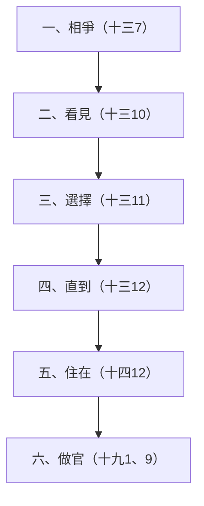

# 創世記 第13章

1. [[亞伯蘭]]帶著他的妻子與[[羅得]]，並一切所有的，都從[[埃及]]上[[南地]]去。
2. [[亞伯蘭]]的金、銀、牲畜極多。
3. 他從[[南地]]漸漸往[[伯特利]]去，到了[[艾|伯特利和艾的中間]]，就是從前支搭帳棚的地方，
4. 也是他起先[[帳棚與祭壇|築壇]]的地方；他又在那裡[[求告耶和華的名]]。
5. 與[[亞伯蘭]]同行的[[羅得]]也有牛群、羊群、帳棚。
6. [[牧人水草與土地承載|那地容不下他們]]；因為他們的財物甚多，使他們不能同居。
7. 當時，[[迦南人]]與[[比利洗人]]在那地居住。[[亞伯蘭]]的牧人和[[羅得]]的牧人相爭。
8. [[謙讓|亞伯蘭就對羅得說]]：你我不可相爭，你的牧人和我的牧人也不可相爭，因為我們是[[骨肉原文作弟兄|骨肉【原文作弟兄】]]。
9. 遍地不都在你眼前嗎？請你離開我：[[面東定向的左右方位|你向左，我就向右]]；你向右，我就向左。
10. [[羅得]]舉目看見[[約但河]]的全平原，直到[[瑣珥]]，都是滋潤的，那地在耶和華未滅[[所多瑪]]、[[蛾摩拉]]以先如同[[耶和華的園子]]，也像[[埃及]]地。
11. 於是[[羅得的世俗選擇與後果|羅得選擇約但河的全平原]]，[[往東遷移]]；他們就彼此分離了。
12. [[亞伯蘭]]住在[[迦南地]]，[[羅得]]住在平原的城邑，漸漸挪移帳棚，直到[[所多瑪]]。
13. [[所多瑪]]人在耶和華面前罪大惡極。
14. [[羅得]]離別[[亞伯蘭]]以後，耶和華對亞伯蘭說：從你所在的地方，你舉目向東西南北觀看；
15. 凡你所看見的一切地，我都要賜給你和你的後裔，直到永遠。
16. 我也要使你的後裔如同[[後裔如地上的塵沙|地上的塵沙]]那樣多，人若能數算地上的塵沙才能數算你的後裔。
17. 你起來，[[走遍全地與土地所有權|縱橫走遍這地]]，因為我必把這地賜給你。
18. [[亞伯蘭]]就搬了帳棚，來到[[希伯崙]][[幔利]]的橡樹那裡居住，在那裡為耶和華[[帳棚與祭壇|築了一座壇]]。

<!-- fhl-map-links:start -->
## 相關地圖

- [[appendix/fhl_maps/maps/008|〈創圖三〉族長們於迦南地以外的活動]]
- [[appendix/fhl_maps/maps/009|〈創圖四〉亞伯拉罕的生平]]
- [[appendix/fhl_maps/maps/010|〈創圖五〉羅得和他的後代－摩押與亞捫]]
- [[appendix/fhl_maps/maps/017|〈創圖十二〉古埃及全圖]]
<!-- fhl-map-links:end -->

---

## 本章知識節點

### 人物
- [[亞伯蘭]]
- [[迦南人]]
- [[比利洗人]]
- [[迦南人與比利洗人]]
- [[撒萊]]
- [[羅得]]

### 地點
- [[埃及]]
- [[南地]]
- [[伯特利]]
- [[艾]]
- [[迦南地]]
- [[約但河]]
- [[瑣珥]]
- [[所多瑪]]
- [[蛾摩拉]]
- [[希伯崙]]
- [[幔利]]

### 主題／神學
- [[亞伯拉罕之約]]
- [[帳棚與祭壇]]
- [[求告耶和華的名]]
- [[謙讓]]
- [[信心與世俗的對比]]
- [[羅得的世俗選擇與後果]]
- [[往東遷移]]

### 背景／原文
- [[牧人水草與土地承載]]
- [[面東定向的左右方位]]
- [[耶和華的園子]]
- [[骨肉原文作弟兄]]
- [[後裔如地上的塵沙]]
- [[走遍全地與土地所有權]]

---

## 本章整理

### 回到伯特利與祭壇（1-4節）

亞伯蘭帶全家和財物從埃及上南地，再按原路回到[[伯特利]]與[[艾]]之間，就是先前支搭帳棚、築壇的地方。他在那裡重新[[求告耶和華的名]]。這一段的每一個地名都是回頭路上的座標：第3節說那是「從前支搭帳棚的地方」，第4節再補一句「也是他起先築壇的地方」，兩句同指一地，把回歸舊址寫得極其鄭重。從埃及邊界走到伯特利和艾，GT《舊約背景註釋》估計大約是二百哩的行程——這不是一時的轉念，而是一段要按站尋找水草、走上許久的路。BH 補充艾的字義是「廢墟」，與伯特利「神的家」正好對照，兩個地名並列本身就把「跟隨神」與「面對毀滅」擺進同一句話裡。

> [!quote] KC
> 我們若偏離了主，而主又使我們看清這一點，就必須回到最後與主同在的那個地方。跌倒之後蒙恢復的每一步，都會加深我們對神恩典的稱奇。

GT《聖經精讀本──創世記註解》把第4節的求告讀作亞伯蘭「痛心悔改自己在埃及的行為」，並以讚美感恩之心決意重新開始。要留意來源的分寸：經文明說的是他回到舊址並再次求告耶和華的名，內心的悔改是註釋者由行動推得的解讀，不是敘事者的記錄。

第2節說他的金、銀、牲畜「極多」。CT 的原文字義註記指出「極多」帶有「很沉重」的意思，並把前章的饑荒「甚大」（創十二10）與本節的財物「極多」放在一起——兩處在原文是同一個字根，因此饑荒與財物都在試驗同一種信心。CT 由此下了一句很直的話：「人即使能勝過饑餓，但不一定能勝過富足」。敘事隨即證實這不是空談：兩家的牲畜與帳棚多到土地不能共同承載，財富本身成了牧人衝突的條件。

### 水草、土地與牧人相爭（5-7節）

巴勒斯坦山地的畜牧必須按季節尋找水源和草場。GT《舊約背景註釋》說明這套節奏：四月至九月炎熱乾旱，牲口要趕到較高的地區才找得到牧草與溪澗水泉；十月至三月較冷較濕，才回到平原放牧。牧人若不想長期離村，就得接受無根的半遊牧生涯，全家隨牛羊移居；而在這種生活裡，「關於水草使用權的爭執，是導致牧人不和最常見的因素」。第6節的「地容不下」因此不是整個迦南面積不足，而是同一放牧區的資源無法同時支撐兩個龐大群體，詳見[[牧人水草與土地承載]]。

第7節特別補充[[迦南人]]與[[比利洗人]]也住在當地，表示亞伯蘭與羅得並非獨占土地。GT《串珠聖經註釋》註明比利洗人是「住在迦南地的一個部落」。KC 和中文註釋由此提出屬靈應用：同族在當地居民面前相爭，等於讓世界旁觀寄居者的內鬨，會損害見證；這是由敘事環境所得的倫理閱讀，不是經文自己下的評語。

### 亞伯蘭提出分地（8-9節）

亞伯蘭主動制止爭端，稱羅得為「弟兄」。原文的弟兄可泛指男性親屬，中文依叔姪關係譯作「[[骨肉原文作弟兄|骨肉]]」；GT 李啟榮《聖經小字解》引詞書解「骨肉」為至親——「雖異處而相通，痛疾相救，憂思相感，生則相歡，死則相哀」。亞伯蘭雖是長輩，也先讓羅得選擇方向，自己接受另一方。

第9節的「左右」不是含糊的客套。GT 丁良才《創世紀註釋》指出「以色列人按著面向日出的地方定方向，他們就稱東為前邊，西為後邊，南為右邊，北為左邊」，所以「你向左」就是向北，「我就向右」就是向南——亞伯蘭是按當時通行的方位語言，把地劃成南北兩半交給晚輩先挑，讓步的幅度因此可以衡量，詳見[[面東定向的左右方位]]。

所收來源普遍把這舉動解作[[謙讓]]、慷慨與信心，因亞伯蘭沒有堅持先選的權利。GT《聖經精讀本──創世記註解》還進一步列出這種自我犧牲帶來的三重效果：「阻止了趁兩者不合之際試圖掠奪他們財物的原住民的計謀」、與羅得保持和平因而沒有在外邦人社會中玷污神的聖名、以及亞伯蘭自己因更加信靠屬天的基業而信心日增。經文沒有直接交代他的內在思想；可以確定的是，他把維持骨肉和平放在選地優先權之前。

### 羅得選擇約但河平原（10-13節）

羅得從伯特利山地舉目，看見[[約但河]]平原水源充足，一直到南端的[[瑣珥]]。敘事用兩個讀者熟悉的肥沃地區形容它：

| 比較 | 所強調的景象 |
|---|---|
| 如同[[耶和華的園子]] | 水源與植物豐盛，如伊甸園 |
| 像[[埃及]]地 | 以灌溉和穩定水源維持農牧 |

羅得選擇平原、[[往東遷移]]，住在平原城邑，並漸漸把帳棚挪到[[所多瑪]]。GT《舊約背景註釋》從界線切入指出這一步的份量：聖經每處地方都把約但河視為迦南的東界，所以羅得遷到平原的城邑，「就很清楚是離開了迦南地，把它完全讓給亞伯蘭」。第12節把「亞伯蘭住在迦南地」與「羅得住在平原的城邑」對舉，因此不是兩個相鄰地址，而是界內與界外。

經文沒有說羅得一開始便打算加入所多瑪，也沒有逐項記錄他的選地動機；但敘事立即提醒讀者，所多瑪人在耶和華面前罪大惡極——而第10節那句「在耶和華未滅[[所多瑪]]、[[蛾摩拉]]以先」更早一步把結局透露給讀者：他所看見的滋潤，是一片已被判定要毀滅的風景。後續第14、19章又記他被擄、住進城中及城市受審判，因此來源把本段整理為「由肥沃選擇逐步接近罪惡城市」的發展，詳見[[羅得的世俗選擇與後果]]。

GT 丁良才《創世紀註釋》把這條下坡路排成一個可追蹤的次序，並且一路追到創世記十九章：

這張圖的重點不在於指認羅得的罪，而在於顯示每一步都很小：相爭時他只是沒有攔阻手下，看見時他只是在看，選擇時他仍在自己權利之內，而終點卻是坐在所多瑪的城門口。KC 觀察同一條線的末端——羅得後來住在城裡、有了房子（帳棚消失了），甚至成為城中議事的一員。中文傳統註釋所說「眼錯、心錯、腳錯」及 KC 所說羅得只看眼前利益，都是根據本章後果所作的倫理評價，不應改寫成經文直接揭露羅得當時全部心理。CT 說得更概括：「人所看為美的，不一定是真正美麗且有益的」。

KC 另外提出一個容易被略過的旁枝教訓：亞伯蘭下埃及的偏離，讓羅得也嘗到了埃及的味道。

> [!quote] KC
> 倚靠別人信心的人，也會跌進那人的錯誤裡。亞伯蘭從偏離埃及一事學到了功課，羅得卻沒有顯出他學到什麼。……父母若偏離、有一段時間愛了世界，即使後來蒙神的恩典恢復、再次放下世界，他們的兒女卻可能已經嘗到世界的味道，並且留在其中。

GT《聖經精讀本──創世記註解》則把後果一路列到底：這個選擇最終帶來被擄、城市與家產被毀、失去妻子與女婿，家庭陷入創十九章所記的敗壞。

### 神重申土地與後裔應許（14-17節）

羅得離開後，神吩咐亞伯蘭向東、西、南、北觀看，重申所見之地要賜給他和後裔，又以地上的塵沙形容後裔多得不能數算。時間點值得注意：耶和華是在「羅得離別亞伯蘭以後」才說話的。這是第12章土地與大國應許的擴展：

| 第12章 | 第13章 |
|---|---|
| 往神所指示的地去 | 從所在之處向四方觀看 |
| 把這地賜給後裔 | 賜給亞伯蘭和後裔，直到永遠 |
| 成為大國 | 後裔如地上塵沙，不能數算 |

「[[後裔如地上的塵沙|塵沙]]」是表達數量極多的修辭；GT《串珠聖經註釋》直接稱之為「修辭上的誇大語法，強調子孫眾多」。部分傳統註釋把塵沙分配給屬地後裔、把十五5的眾星分配給屬天後裔；兩段經文直接使用的共同重點，都是後裔多到人無法數算。

神又命亞伯蘭[[走遍全地與土地所有權|縱橫走遍這地]]。BH 指出走遍一塊地在古代近東是取得所有權的象徵行為，並與約書亞記一3 並讀；第14節「向東西南北觀看」同樣反映當時勘查土地的慣例，而勘查本身即是所有權與祝福的記號。GT《創世記雷氏研讀本》把第18節的「搬了帳棚」直譯為「他住帳棚」或「一直遷移他的帳棚」，認為這個持續遷移的動作也在展示對應許地的所有權。三個動作因此連成一套程序——先看、再走、最後住——而不是三件無關的事。這也解開本章表面上的矛盾：亞伯蘭領受「直到永遠」的應許卻仍住帳棚、沒有一寸產業；在這套框架下，帳棚不是應許落空的證據，而是取得的方式本身。GT 丁良才也提醒兌現有時間差：亞伯蘭本人到底沒有得這地，他的後裔雖得迦南為業，所享受的仍不過是應許之地的一部分（來十一9、13、39）。CT 把它讀成信心的量度——「我們的信心有多大，便能取用神的應許有多大」；這是應用層面的推論，與背景習俗的說明應分開看待。把東西南北或縱橫直接解作十字架，同樣是中文註釋的基督教靈意，不是方向詞本身的原意。

GT 丁良才《創世紀註釋》還把亞伯蘭在創世記中的「舉目」排成一組，讓第14節在整卷書裡有了位置：

| 次序 | 所看見的 |
|---|---|
| 一 | 看地面（十三14） |
| 二 | 看天星（十五5） |
| 三 | 看神的使者（十八2） |
| 四 | 看公羊（二十二13） |

### 希伯崙幔利的祭壇（18節）

亞伯蘭搬到[[希伯崙]]地區、[[幔利]]的橡樹附近居住，並再次築壇。幔利既可指地點，也在14:13成為與亞伯蘭結盟的亞摩利人之名；GT 丁良才指出幔利是以實各和亞乃二人的哥哥，弟兄三人都與亞伯蘭有盟約，「本節的橡樹是因這幔利起名」。「幔利的橡樹」因此可按當地人物或地域得名。

希伯崙位於猶大山地，泉水與井水足以支持橄欖、葡萄和半農牧生活，並處於通往拉吉與耶路撒冷兩條古道的交會處。它究竟離耶路撒冷多遠，四份來源給的數字並不一致，值得並列而不必壓平：

| 來源 | 對希伯崙位置的描述 |
|---|---|
| GT《舊約背景註釋》 | 猶大山地，海拔約3,300呎；耶路撒冷西南約十九哩，別是巴東北二十三哩 |
| GT《串珠聖經註釋》 | 希伯侖與幔利指同一地域，位於耶路撒冷以南三十二公里（二十英里） |
| GT《創世記雷氏研讀本》 | 耶路撒冷以南二十二英里（35公里） |
| GT 李道生《舊約聖經問題總解》 | 距耶路撒冷南方約六十五裡 |

差距落在十九至二十二哩之間，屬於古代里程換算與量測基準的差異，不影響「希伯崙在耶路撒冷以南的猶大山地」這個共識。李道生並補記希伯崙「是世界最古的一座城」，原名基列亞巴，後來被立為逃城；大衛三十歲時以色列長老在此膏立他為王，押沙龍也在此自立為王，羅波安曾修築這城為保障。GT《舊約背景註釋》另提一項年代線索：聖經說希伯崙比埃及的鎖安城早七年被建造，據考證約在主前十七世紀；而族長日後葬在此地，更加強了它在政治上的重要性。後來撒拉葬於附近麥比拉洞，希伯崙也成為族長家族的重要中心。中文註釋把「希伯崙」的聯合、交通字義發展為與神交通的靈意；本章直接記錄的回應仍是居住和築壇。

### 信心與選擇的敘事對照

| 亞伯蘭 | 羅得 |
|---|---|
| 讓對方先選方向 | 選擇水源豐富的平原 |
| 留在迦南地 | 越過約但河東界，住平原城邑 |
| 由神吩咐舉目觀看 | 自己舉目看見平原 |
| 得土地與後裔應許 | 漸漸挪移帳棚直到所多瑪 |
| 到幔利築壇 | 第13章沒有記羅得築壇 |

這個對照是敘事安排清楚呈現的，也是[[信心與世俗的對比]]的核心素材。兩人分別的不只是心態，還有取得的方式：羅得用眼睛選了看得見的一塊，當場佔有；亞伯蘭被吩咐用腳走遍看不完的全地，以行走與築壇宣告，把兌現交給神的時間表。GT《啟導本聖經創世記註釋》概括亞伯蘭的態度時說，他不在乎眼前這些，因為「他的信心的眼睛已看見比這更美更永久的家鄉」（來11章）。要注意的是，把亞伯蘭的一切行動等同完全信心、把羅得的一切考量等同世俗，是來源在閱讀後續結局時形成的神學概括，應保留其解釋性質。

> [!quote] KC
> 羅得想要得著一切，結果失去一切；亞伯蘭撇下一切，結果得著一切。把選擇權交給神的人，永不失望（詩廿二5）。

**參考資料**
https://biblehub.com/study/genesis/13.htm
https://www.kingcomments.com/en/bible-studies/Gen/13
https://www.ccbiblestudy.org/Old%20Testament/01Gen/01CT13.htm
https://www.ccbiblestudy.org/Old%20Testament/01Gen/01GT13.htm
