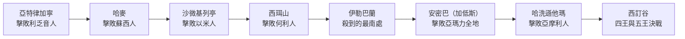

# 創世記 第14章

1. 當[[暗拉非]]作[[示拿地|示拿]]王，[[亞略]]作[[以拉撒]]王，[[基大老瑪]]作[[以攔]]王，[[提達]]作[[戈印]]王的時候，
2. 他們都攻打[[所多瑪]]王[[比拉（所多瑪王）|比拉]]、[[蛾摩拉]]王[[比沙（蛾摩拉王）|比沙]]、[[押瑪]]王[[示納（押瑪王）|示納]]、[[洗扁]]王[[善以別（洗扁王）|善以別]]，和比拉王；比拉就是[[瑣珥]]。
3. 這五王都在[[西訂谷]]會合；西訂谷就是[[鹽海]]。
4. 他們已經事奉[[基大老瑪]]十二年，到十三年就背叛了。
5. 十四年，[[基大老瑪]]和同盟的王都來在[[亞特律加寧]]，殺敗了[[利乏音人]]，在[[哈麥]]殺敗了[[蘇西人]]，在[[沙微基列亭]]殺敗了[[以米人]]，
6. 在[[何利人]]的[[西珥山]]殺敗了何利人，一直殺到靠近曠野的[[伊勒巴蘭]]。
7. 他們回到[[安密巴]]，就是[[加低斯]]，殺敗了[[亞瑪力人|亞瑪力全地的人]]，以及住在[[哈洗遜他瑪]]的[[亞摩利人]]。
8. 於是[[所多瑪]]王、[[蛾摩拉]]王、[[押瑪]]王、[[洗扁]]王，和比拉王（比拉就是[[瑣珥]]）都出來，在[[西訂谷]]擺陣，與他們交戰，
9. 就是與[[以攔]]王[[基大老瑪]]、[[戈印]]王[[提達]]、[[示拿地|示拿]]王[[暗拉非]]、[[以拉撒]]王[[亞略]]交戰；乃是四王與五王交戰。
10. [[西訂谷]]有許多石漆坑。[[所多瑪]]王和[[蛾摩拉]]王逃跑，有掉在坑裡的，其餘的人都往山上逃跑。
11. 四王就把[[所多瑪]]和[[蛾摩拉]]所有的財物，並一切的糧食都擄掠去了；
12. 又把[[亞伯蘭]]的姪兒[[羅得]]和羅得的財物擄掠去了。當時羅得正住在[[所多瑪]]。
13. 有一個逃出來的人告訴[[希伯來人]][[亞伯蘭]]；亞伯蘭正住在[[亞摩利人]][[幔利]]的橡樹那裡。幔利和[[以實各]]並[[亞乃]]都是弟兄，曾與亞伯蘭聯盟。
14. [[亞伯蘭的愛心與勇氣|亞伯蘭聽見他姪兒【原文作弟兄】被擄去]]，就率領他家裡生養的精練壯丁三百一十八人，直追到[[但]]，
15. 便在夜間，自己同僕人分隊殺敗敵人，又追到[[大馬士革|大馬色]][[面東定向的左右方位|左邊]]的[[何把]]，
16. 將被擄掠的一切財物奪回來，連他姪兒[[羅得]]和他的財物，以及婦女、人民也都奪回來。
17. [[亞伯蘭]]殺敗[[基大老瑪]]和與他同盟的王回來的時候，[[所多瑪]]王出來，在[[王谷|沙微谷]]迎接他；沙微谷就是[[王谷]]。
18. 又有[[撒冷]]王[[麥基洗德]]帶著[[麥基洗德的餅和酒是否預表聖餐|餅和酒]]出來迎接；他是[[至高的神|至高神]]的祭司。
19. 他為[[亞伯蘭]]祝福，說：願[[天地的主]]、[[至高的神]]賜福與亞伯蘭！
20. [[至高的神]]把敵人交在你手裡，是應當稱頌的！[[亞伯蘭]]就把所得的拿出[[十分之一]]來，給[[麥基洗德]]。
21. [[所多瑪]]王對[[亞伯蘭]]說：你把人口給我，財物你自己拿去吧！
22. [[亞伯蘭]]對[[所多瑪]]王說：我已經向[[天地的主|天地的主─至高的神]][[至高的神|耶和華]]起誓：
23. [[亞伯蘭拒絕所多瑪財物|凡是你的東西，就是一根線、一根鞋帶，我都不拿]]，免得你說：我使[[亞伯蘭]]富足！
24. 只有僕人所吃的，並與我同行的[[亞乃]]、[[以實各]]、[[幔利]]所應得的分，可以任憑他們拿去。

---

## 本章知識節點

### 人物
- [[亞伯蘭]]
- [[羅得]]
- [[暗拉非]]
- [[亞略]]
- [[基大老瑪]]
- [[提達]]
- [[麥基洗德]]
- [[以實各]]
- [[亞乃]]
- [[寧錄]]

### 地點與群體
- [[示拿地]]
- [[以拉撒]]
- [[以攔]]
- [[戈印]]
- [[所多瑪]]
- [[蛾摩拉]]
- [[押瑪]]
- [[洗扁]]
- [[瑣珥]]
- [[西訂谷]]
- [[鹽海]]
- [[亞特律加寧]]
- [[哈麥]]
- [[沙微基列亭]]
- [[西珥山]]
- [[伊勒巴蘭]]
- [[安密巴]]
- [[加低斯]]
- [[哈洗遜他瑪]]
- [[幔利]]
- [[但]]
- [[大馬士革]]
- [[何把]]
- [[王谷]]
- [[撒冷]]
- [[利乏音人]]
- [[蘇西人]]
- [[以米人]]
- [[何利人]]
- [[亞瑪力人]]
- [[亞摩利人]]
- [[希伯來人]]
- [[亞摩利人幔利的橡樹]]
- [[以東]]
- [[死海]]
- [[示拿]]
- [[耶路撒冷]]

### 神學／主題／原文
- [[天地的主]]
- [[至高的神]]
- [[麥基洗德與基督豫表]]
- [[十分之一]]
- [[亞伯蘭拒絕所多瑪財物]]
- [[羅得的世俗選擇與後果]]
- [[亞伯蘭的愛心與勇氣]]
- [[得勝後的試探]]
- [[「希伯來人」的意義]]
- [[「麥基洗德」名字含義]]
- [[「撒冷」名字含義]]
- [[聖經第一場戰爭]]
- [[三百一十八人]]
- [[石漆]]
- [[面東定向的左右方位]]
- [[什一奉獻的起源]]
- [[四王與五王戰爭的屬靈意義]]
- [[耶和華的得勝]]
- [[至高神的祭司]]
- [[麥基洗德的豫表]]

### 解經爭議
- [[創世記14章四王的歷史辨識]]
- [[麥基洗德的身分]]
- [[麥基洗德的餅和酒是否預表聖餐]]

---

## 本章整理

### 四王與五王的戰爭（1-12節）

[[基大老瑪]]領導的東方四王控制約但平原五城十二年；五城在第十三年背叛，四王於第十四年沿外約但與南地軍事路線征討，最後在[[西訂谷]]擊敗五王並擄掠所多瑪、蛾摩拉。這反映古代城邦以進貢維繫宗主關係、背叛後遭軍事鎮壓的政治模式。GT《聖經精讀本──創世記註解》補記背叛的來由：巴勒斯坦許多弱小國很早就被美索不達米亞地帶的強國支配，被征服國每年須上交定額朝貢，西訂谷五王迫於無奈進貢十二年，可能到第十三年感覺厭煩才聯合起來拒絕進貢；它並判斷這場叛變的動機「不是因為強大，而是出於貪欲和驕傲」。

| 四王（東方聯盟） | 五王（約但平原） |
|---|---|
| 以攔王基大老瑪（首領） | 所多瑪王比拉 |
| 示拿王暗拉非 | 蛾摩拉王比沙 |
| 以拉撒王亞略 | 押瑪王示納 |
| 戈印王提達 | 洗扁王善以別 |
| | 比拉（瑣珥）王 |

第5至7節逐一列出四王沿途的戰績，構成本章唯一一段行軍記錄：

要注意的是，經文只給地名次序，沒有交代走向，因此來源復原出的路線並不一致：GT《舊約背景註釋》認為四王順著「王道」——約但河谷東緣、外約但主要的南北大道——自北至南推進，到亞喀巴灣一帶後轉往西北攻加低斯巴尼亞；GT《串珠聖經註釋》卻說聯軍「首先北上進軍大馬色，然後轉向約但河東岸，又南下至加低斯，再北上和五王交戰」；GT《創世記雷氏研讀本》另說入侵路線是向西北面穿過南地，再折返西訂谷。三說在起點與轉折上互相衝突，共同點則是戰略邏輯：先清除約但河東與南地各族，斷絕五王的外援與退路，最後才決戰。GT《舊約背景註釋》並指出，這種依時序編排行軍路程的寫法，正是古代近東時序文獻的一貫格式。

四王與地區名稱符合古代近東語言環境，但目前不能把暗拉非可靠地等同漢摩拉比，也無法在現存王表中逐一確認四王。這一點來源本身就吵得很清楚：GT 丁良才《創世紀註釋》逕把一九○一年書珊城出土那塊高六尺、刻有二百八十五條律法的黑階石古碑當作暗拉非所定的法典，稱其內容「大半是很文明的規則」；GT 李道生《舊約聖經問題總解》記下同一塊石碑，卻指巴比倫列王中沒有暗拉非之名，許多歷史學家因而認為暗拉非就是哈慕拉比，然而這個說法「仍然沒有足夠的證據」；GT《創世記雷氏研讀本》則從年代直接否決——「不可能是罕摩拉比，因為罕摩拉比是較後期的人」。整理時應把「石碑存在」與「碑主即暗拉非」分開處理，詳見[[創世記14章四王的歷史辨識]]。

西訂谷被說明為[[鹽海]]，並有許多石漆坑。死海地區自古以瀝青聞名，BH 指這些天然瀝青礦床在古代用於防水與建築，是有價值的資源。第10節「有掉在坑裡的」怎麼讀，來源分成兩派而且分歧不小：GT《串珠聖經註釋》把石漆說成「乃是一種黏性物質，有如修補馬路的柏油」，任何人掉進去就會被黏住無法逃脫，CT 與 BH 也照落坑遇難來讀；GT《舊約背景註釋》卻從原文用字反推——譯作「坑」的字與舊約他處形容水井的字相同，一般指人工掘出的地點，因此西訂谷有很多開採瀝青的礦坑，是五王的避難之處，「他們是『自己吊下去』，不是『掉進坑裡去』」。經文本身留下的線索支持後者至少可行：第17節所多瑪王仍活著出來迎接亞伯蘭。CT 在同一節下的觀察不受這個分歧影響——五王選在西訂谷擺陣本是想借地形之險取勝，結果反而自陷，「人所依仗的，往往反成了人的陷阱」。詳見「石漆」條。

### 羅得被擄與亞伯蘭追救（12-16節）

第13章只說羅得漸漸挪移帳棚直到所多瑪，本章已說他「正住在所多瑪」。城市戰敗時，他與財物一同被擄，顯示住處選擇使他承受城市的政治風險，是[[羅得的世俗選擇與後果]]的延續。把被擄概括為神對羅得的刑罰，是來源按後續敘事所作的神學解釋，經文沒有直接如此宣告。

> [!quote] KC
> 我們若因世界的享樂吸引而選擇住在世界裏、照它的樣式生活，就不要指望能逃過它的苦楚。

亞伯蘭首次被稱為「[[希伯來人]]」。名稱可能與希伯、越過河流或從彼岸而來相關，也有人比較古代文獻中的 Habiru；GT《啟導本聖經創世記註釋》還指出這個稱呼原是非以色列人給的，含有輕蔑的意思，就像新約「基督徒」一名的由來。各說關係仍有討論，詳見[[「希伯來人」的意義]]。

亞伯蘭率領家中生養、受過訓練的三百一十八人，與幔利、以實各、亞乃的盟友追擊。這個數字在當時是什麼量級，來源給了實據：GT《串珠聖經註釋》指埃及亞瑪拿出土的主前一四○○年信集記載，當時兩國交戰的兵員只有二十至五十人；GT《舊約背景註釋》指形容這些壯丁的字眼舊約他處未再出現，卻見於主前十五世紀一封亞喀得函件，並判斷這樣一支家軍足以和當地任何一個武裝部隊匹敵。丁良才由三百一十八人反推亞伯蘭家中必有一千多人，「可見他已經是富戶，有小王的樣式」。三百一十八人只明說亞伯蘭家中的壯丁，不包括盟友人數，因此不能用它計算全部兵力，詳見「三百一十八人」條。

他夜間分隊進攻，從但追到大馬色以北的何把，奪回財物與人口。第15節和合本作「大馬色[[面東定向的左右方位|左邊]]的何把」，丁良才註明「左邊就是北邊」，並回指創十三9 的方位慣例——以色列人面向日出定方向，故左為北、右為南；呂振中譯直接譯作「大馬色北邊」，兩種譯法指同一方向。至於何把離大馬色多遠，來源相差十倍以上：GT《串珠聖經註釋》說在大馬色以北「約二百三十公里（一百五十英里）」，丁良才卻說「相離約有二三十裡路」。經文沒有給距離，兩說並陳即可。中文註釋由這一段整理出[[亞伯蘭的愛心與勇氣]]：對人有愛心、對神有信心，知道神必為他爭戰（出十四14）。KC 另指出戰術上的講究——他分兵從不同方向同時進攻，使小隊看起來像大軍，又選在夜間突襲；GT《舊約背景註釋》說夜襲戰略早在士師時代的埃及文獻與赫人典籍就找得到例證。

### 麥基洗德：撒冷王與至高神祭司（17-20節）

[[麥基洗德]]同時是撒冷王和至高神祭司。他的名字在來7:2被解作「公義王」（[[「麥基洗德」名字含義]]），[[撒冷]]則與「平安」相關（[[「撒冷」名字含義]]）。撒冷通常辨識為耶路撒冷，背景資料也保存位於示劍附近的少數看法。GT《啟導本聖經創世記註釋》指本節是聖經第一次提到耶路撒冷，並以十九世紀末埃及出土的亞馬拿泥版——主前十五世紀埃及諸王與巴勒斯坦等地諸王的通信——證實耶路撒冷在亞伯蘭時代早已存在；GT《創世記雷氏研讀本》另舉約主前2300年的特勒瑪迪克泥版，其中記載耶路撒冷和數百個其他地名與人名。

創世記把麥基洗德當作出場、說話、祝福、接受十分之一的歷史人物。後來猶太傳統有人認為他是閃，也有人視為天使或基督顯現；創世記沒有提供這些身分。GT 賈斯樂郝威《聖經難解經文詮釋手冊》在〈命題34〉裡把理由講得很清楚：把他看成天使甚至基督的顯現並不可能，因為希伯來書的作者是以麥基洗德為基督的意表，而在創世記他是以一個平凡普通的歷史人物出現、以一般平凡的舉止態度與亞伯拉罕說話應對。詩110:4與來7章是以他作基督君王祭司職分的預表（[[麥基洗德與基督豫表]]），不是說他本人就是基督；詳見[[麥基洗德的身分]]。

餅和酒的功能，來源給出四種讀法而且彼此拉扯。字面層是軍需：CT 說是「慰勞凱歸之師」，丁良才並引申二十三34、撒上十七17、尼十三2 等以食物迎接行路者的先例。第二層是政治：GT《舊約背景註釋》指同享筵宴通常表示雙方立了和平協議，赫人條約就提及打仗時供應盟友食物，因此麥基洗德是急切要與這支有戰績可誇的軍事勢力建立和好關係，而「亞伯蘭則藉送上十分之一表示降服，間接承認了麥基洗德的地位」。第三層是屬靈供應（CT 靈意註解：餅滋養加力，酒舒暢激勵）。第四層才是聖餐預表，而 KC 明確反對直接等同主餐。這些解讀應與本章的宴飲功能分開，詳見[[麥基洗德的餅和酒是否預表聖餐]]。

麥基洗德宣告至高神把敵人交在亞伯蘭手中，把勝利歸於神。他所用的聖名 El Elyon（和合本「[[至高的神]]」），GT《舊約背景註釋》指出是迦南文學中對主神伊勒的普遍稱呼，GT《啟導本聖經創世記註釋》也說「至高神」是古代迦南一帶對主神的稱呼——而亞伯蘭在第22節把這個稱號直接接上耶和華，等於在兩位王面前見證獨一真神。亞伯蘭把所得的[[十分之一]]給他；來7:4稱這是戰利品的十分之一，並由祝福與納十分之一論證麥基洗德的地位高於亞伯拉罕。GT《聖經精讀本──創世記註解》補充制度背景：十分之一原是人們為供養在聖殿或神殿服事的人而自發拿出家產或出產的十分之一上交的一種稅金，屬非條文制度，也被廣泛使用在閃族文化圈以外，日後才在摩西律法中正式成為有條文規定的法律。所以這件事早於摩西律法，不等於本章已頒布一項普遍什一律例。

### 拒絕所多瑪王的財物（21-24節）

所多瑪王要回人口，讓亞伯蘭保留財物。GT 丁良才指出這是照著當時的風俗——戰勝者取財物，原主取回人口。亞伯蘭已向「[[天地的主]]、[[至高的神]]耶和華」起誓，連一根線、一根鞋帶也不取，理由是免得所多瑪王宣稱使他富足；詳見[[亞伯蘭拒絕所多瑪財物]]。他把麥基洗德所稱的至高神明確認作耶和華，也把財富來源與所多瑪王切開。GT《創世記雷氏研讀本》從政治後果補一層：亞伯拉罕拒收是恐怕要為此負上任何義務，以免所多瑪王日後重奪霸主之權而使亞伯拉罕作他的藩屬。GT《舊約背景註釋》甚至推測這場協議「可能還包括使條款正式化的書面合同」，並認為那份文獻的編排很可能與本章相仿，甚至可能就是本章的素材。

KC 和中文註釋把兩王先後迎接亞伯蘭讀作「[[得勝後的試探]]」：先領受神的祝福，再面對財物提議。這是敘事次序的靈意應用。經文明說的拒絕理由，是避免所多瑪王取得使他富足的名聲。

| | 麥基洗德（撒冷王） | 所多瑪王 |
|---|---|---|
| 身分 | 至高神的祭司 | 罪惡之城的王 |
| 所帶來的 | 餅和酒與祝福 | 「人口給我，財物你拿去」的提議 |
| 亞伯蘭的回應 | 獻上十分之一 | 一根線、一根鞋帶都不拿 |

亞伯蘭只替自己放棄戰利品，沒有剝奪盟友亞乃、以實各、幔利應得的分，也承認僕人已吃的供應。這區分個人誓願與他人權利。GT《聖經精讀本──創世記註解》把這一節讀成一則警告：信徒最容易犯的錯誤就是以自己的信仰為標準去判斷或定別人的罪，真正的信徒當像亞伯蘭一樣保證別人正當的自由和權利。丁良才則把全章的亞伯蘭歸納成八項，讓分散在各節的行動一次看清：

| 品格 | 出處 |
|---|---|
| 忠心 | 13、24節 |
| 愛心 | 14節 |
| 膽量 | 14節 |
| 聰明 | 15節 |
| 寬宏 | 16節 |
| 虔誠 | 18-20節 |
| 樂施 | 20節末句 |
| 節制 | 21-23節 |

GT《啟導本聖經創世記註釋》用一句話概括這一章在整卷書裡的位置：聖經歷史的主流發展與外邦的歷史從這裡開始交錯，而「亞伯蘭雖在這世界卻不屬這世界，他戰鬥殺敵，外交結盟，但時刻以神的交托為念」。KC 的提醒則更貼身：得勝的時刻常是危險的時刻——亞伯蘭因沒有與世界聯合，就能勝過世界（約壹五4）。

**參考資料**
https://biblehub.com/study/genesis/14.htm
https://www.kingcomments.com/en/bible-studies/Gen/14
https://www.ccbiblestudy.org/Old%20Testament/01Gen/01CT14.htm
https://www.ccbiblestudy.org/Old%20Testament/01Gen/01GT14.htm

<!-- appendix-links:start -->
## 附錄

### 相關地圖
- [[appendix/fhl_maps/maps/008|〈創圖三〉族長們於迦南地以外的活動]]
- [[appendix/fhl_maps/maps/009|〈創圖四〉亞伯拉罕的生平]]
- [[appendix/fhl_maps/maps/010|〈創圖五〉羅得和他的後代－摩押與亞捫]]
- [[appendix/fhl_maps/maps/011|〈創圖六〉北方四王攻打南方五王]]
<!-- appendix-links:end -->
