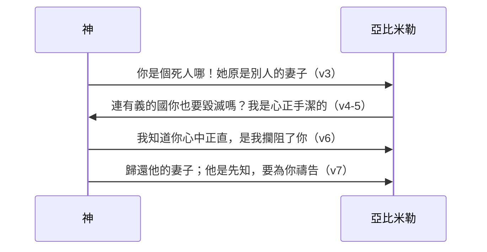

# 創世記 第20章

<!-- chapter-navigation:start -->
| [前一章](../01%20創世記/第19章.md) | [回目錄](../01%20創世記/全書目錄及綱要.md) | [下一章](../01%20創世記/第21章.md) |
| :--- | :---: | ---: |
<!-- chapter-navigation:end -->

1. [[亞伯拉罕]]從那裡向[[南地]]遷去，寄居在[[加低斯]]和[[書珥]]中間的[[基拉耳]]。
2. [[亞伯拉罕]]稱他的妻[[撒拉]]為妹子，[[基拉耳]]王[[亞比米勒]]差人把撒拉取了去。
3. 但夜間，神來，在夢中對[[亞比米勒]]說：你是個死人哪！因為你取了那女人來；他原是別人的妻子。
4. [[亞比米勒]]卻還沒有親近[[撒拉]]；他說：主啊，連有義的國，你也要毀滅嗎？
5. 那人豈不是自己對我說他是我的妹子嗎？就是女人也自己說：他是我的哥哥。我做這事是[[心正手潔]]的。
6. 神在夢中對他說：我知道你做這事是心中正直；[[神攔阻人犯罪|我也攔阻了你，免得你得罪我]]，所以我不容你沾著他。
7. 現在你把這人的妻子歸還他；因為他是[[先知]]，他要為你禱告，使你存活。你若不歸還他，你當知道，你和你所有的人都必要死。
8. [[亞比米勒]]清早起來，召了眾臣僕來，將這些事都說給他們聽，他們都甚懼怕。
9. [[亞比米勒]]召了[[亞伯拉罕]]來，對他說：你怎麼向我這樣行呢？我在什麼事上得罪了你，你竟使我和我國裡的人陷在大罪裡？你向我行不當行的事了！
10. [[亞比米勒]]又對[[亞伯拉罕]]說：你見了什麼才作這事呢？
11. [[亞伯拉罕]]說：[[我以為這地方的人總不懼怕神]]，必為我妻子的緣故殺我。
12. 況且他也實在是我的妹子；他與我是同父異母，後來作了我的妻子。
13. 當神叫我離開父家、飄流在外的時候，我對他說：我們無論走到什麼地方，你可以對人說：他是我的哥哥；這就是你待我的恩典了。
14. [[亞比米勒]]把牛、羊、僕婢賜給[[亞伯拉罕]]，又把他的妻子[[撒拉]]歸還他。
15. [[亞比米勒]]又說：看哪，我的地都在你面前，你可以隨意居住；
16. 又對[[撒拉]]說：我給你哥哥[[一千銀子與遮羞的含義|一千銀子，作為你在閤家人面前遮羞]]【原文作眼】的，你就在眾人面前沒有不是了。
17. [[亞伯拉罕]]禱告神，神就醫好了[[亞比米勒]]和他的妻子，並他的眾女僕，他們便能生育。
18. 因耶和華為[[亞伯拉罕]]的妻子[[撒拉]]的緣故，已經使[[亞比米勒]]家中的婦人不能生育。

---

## 本章知識節點

### 人物與地點
- [[亞伯拉罕]]
- [[撒拉]]
- [[亞比米勒]]
- [[基拉耳]]
- [[南地]]
- [[加低斯]]
- [[書珥]]
- [[亞伯蘭]]

### 神學／主題
- [[先知]]
- [[心正手潔]]
- [[遮羞]]
- [[我以為這地方的人總不懼怕神]]
- [[神在夢中顯現與引導]]
- [[神是生育的源頭]]
- [[神攔阻人犯罪]]

### 背景／原文
- [[古代近東同父異母婚姻]]
- [[亞比米勒名字與王號]]

### 解經爭議
- [[亞伯蘭稱撒萊為妹子的性質]]
- [[亞比米勒為何取撒拉]]
- [[一千銀子與遮羞的含義]]

---

## 本章整理

### 遷往基拉耳，再稱妻為妹（1-2節）

亞伯拉罕從前一地點向南遷移到南地（הַנֶּגֶב，H5045G），定居在加低斯（קָדֵשׁ，H6946G）和書珥（שׁוּר，H7793）之間，又寄居在基拉耳（בִּגְרָר，H1642）。經文沒有說明他為何離開先前居住的幔利，也沒有暗示這次遷移本身出於不信。基拉耳的確切位置未定，背景與地理資料多推定在尼革西部，可能是城邑或周邊地區；部分註釋將其解為「位於埃及與迦南之間，豫表良知世界」，這屬於特定靈意解讀，並非聖經地理資料。「亞比米勒」（אֲבִימֶלֶךְ，H40G）字面可理解為「我父是王／父為王」；這名稱在創世記中反覆出現在基拉耳的統治者身上，因此有註釋將它理解為王室稱號或世襲性的名號（[[亞比米勒名字與王號]]）。

GT《舊約背景註釋》補充了相關歷史背景：[[加低斯]]是西乃半島東北部的一處綠洲，位於別是巴以南約46哩；[[書珥]]字面原義為「城牆／壁壘」，可能指埃及在尼羅河三角洲東部要塞的防禦邊牆；而關於[[基拉耳]]的位置，有考古學家提出哈羅珥遺址（阿拉伯語稱阿布胡雷勒遺址）可能是古基拉耳的一個候選地點。中文註釋對距離的記載各有側重：《啟導本》與雷氏研讀本指基拉耳在迦薩以南約16公里（10英里），《串珠聖經註釋》則記「離開迦薩約4公里」；經文本身並未給出精確里程。丁良才《創世紀註釋》指出本節亦可譯作「住在加低斯和書珥中間，寄居在基拉耳」，說明亞伯拉罕先在兩地之間放牧，隨後才進入基拉耳境內。

到達基拉耳後，亞伯拉罕再次稱妻子撒拉為「妹子」（אֲחֹתִי，H269），基拉耳王亞比米勒便派人將撒拉取去。這項舉動與創世記第12章在埃及的策略高度相似（詳見[[亞伯蘭稱撒萊為妹子的性質]]）：

| 比較項目 | 創12章（埃及法老） | 創20章（基拉耳王亞比米勒） |
|---|---|---|
| 事件對象 | 埃及法老 | 基拉耳王亞比米勒 |
| 神的介入 | 降大災於法老與全家 | 夜間夢中警告、使全家婦女暫時不育 |
| 國王處置 | 質問後送走 | 質問後賠償千銀，並准許隨意居住 |
| 亞伯拉罕回應 | 經文未記其答辯 | 說明動機，之後按吩咐代求 |

第12節後文說明，撒拉確實是亞伯拉罕同父異母的妹子，因此這句話在字面上並非完全虛假；問題在於他們刻意省略夫妻關係，使亞比米勒按未婚女子理解她。部分真實仍可因溝通目的和關鍵隱瞞而構成實質欺騙。《啟導本》指出，面臨生命威脅時人容易重施故技，第13節也證明「兄妹相稱」是離開父家時早已約定的自保策略；丁良才指出了亞伯拉罕在此事上的四個錯處（不依靠神、太過怕人、卑賤自己、玷辱主名），《聖經精讀本》亦提醒這反映了人性容易重犯昔日的軟弱。KC 從救贖歷史的角度指出：非利士人預表徒有信仰名義卻不真正順服神的人，亞伯拉罕此時否認撒拉的妻子身分，顯明信心的嚴重跌落。

至於亞比米勒取撒拉的動機，經文並未記載。有來源推測他被撒拉吸引，另有來源考慮撒拉當時已約九十歲，認為亞比米勒可能看中亞伯拉罕龐大的畜牧財富，希望藉由聯姻締結政治盟約；兩者都屬於註釋推論，不能當作經文明說（詳見[[亞比米勒為何取撒拉]]）。

### 神在夢中攔阻亞比米勒（3-7節）

夜間，神在夢中警告亞比米勒，撒拉是有夫之婦（בְּעֻלַת בָּעַל，H1166、H1167），若不歸還便有死亡後果。古代近東普遍將夢視為神明傳達意志的媒介，聖經亦多次記載神藉夢向非以色列君王說話（[[神在夢中顯現與引導]]）；本章直接將夢的來源認定為神。

GT《舊約背景註釋》指出：在古代馬里文獻的五十多份泥板中，神明多藉夢向平民或非神職人員啟示；而在聖經記載外邦君王做夢時（如法老、尼布甲尼撒），通常僅看見異象，本章則記載神在夢中直接對亞比米勒說話。丁良才指出本節是舊約中第一個明文記錄的夢境，神當時可能藉某種病痛攔阻亞比米勒侵犯撒拉。

亞比米勒尚未親近撒拉，他向神陳明自己是在不知情下行事，並申明自己「心正手潔」（בְּתָם、לְבָבִי，H8537、H3824；בְּנִקְיֹן כַּפַּי，H5356、H3709，指動機純正、行為清潔；[[心正手潔]]）。神在夢中承認他在此事上的內心正直，但也明確指出：「我也知道你做這事是心中正直，我也攔阻了你（וָאֶחְשֹׂךְ，H2820），免得你得罪我，所以我不容你碰她（[[神攔阻人犯罪]]）。」

這段對話同時釐清了兩件事：亞比米勒雖非明知故犯，但無知不能把佔有他人妻子的行為變為合法，他仍須停止錯誤狀態、歸還別人的妻子。經文特別說明亞比米勒「還沒有親近」撒拉，也排除了日後對以撒父系身分產生疑問的可能。

> [!quote] KC
> 有些罪在人心裡已經計劃、已經定意，卻始終沒有犯成——因為神攔阻了人去犯那罪。

### 失敗者仍被稱為先知（7-13節）

神在第7節對亞比米勒說：「現在你要把這人的妻子歸還他；因為他是先知（נָבִיא，H5030），他要為你禱告（וְיִתְפַּלֵּל，H6419），使你存活。」

這是聖經全書第一次出現「[[先知]]」（נָבִיא，H5030）一詞。GT《創世記雷氏研讀本》指出，nabi 基本意義是指「受託發言的中間人／代言人」（比較出7:1）。GT《舊約背景註釋》進一步說明：古代近東文獻記載的先知多半負責宣達神諭，而本章特別突出了先知為人代求的一面。丁良才歸納亞伯拉罕一生具備了君王（創14:14-16）、祭司（創18:23-33）與先知（創20:7）的三重尊榮職分。

神稱亞伯拉罕為先知時，他剛因欺騙使別人陷入危險。這並非認可欺騙，而是顯示他的職分與神的恩約並未因一次失敗而被抹除；同時，他必須面對亞比米勒的公開質問。

次日清晨，亞比米勒召集臣僕，並親自當面責問亞伯拉罕何以做出這等事。亞伯拉罕提出三點辯解：
1. 「我以為這地方的人總不懼怕神（יִרְאַת אֱלֹהִים，H3374、H430），必為我妻子的緣故殺我（[[我以為這地方的人總不懼怕神]]）」——然而亞比米勒及其臣僕聽聞神言後甚懼怕，形成敘事反差；
2. 撒拉確實是他同父異母的妹妹（[[古代近東同父異母婚姻]]）；
3. 這是早年蒙召離開父家時便約定好的自保策略。

背景資料顯示，在族長時代的某些古代近東社會中，這類同父異母的婚姻並非不可見；摩西律法後來則明文禁止這類近親婚姻（利18:9）。GT 賈斯樂郝威在《聖經難解經文詮釋手冊》中指出，聖經誠實記錄了亞伯拉罕在此事上的妥協，但並未判定其婚姻本身有罪。第13節「神叫我……飄流」，有註釋批評他把責任推給神，但句子也可只是回述蒙召後的漂泊生活，不宜單憑措辭斷定他在責怪神。

### 歸還、賠償與公開昭雪（14-16節）

亞比米勒歸還撒拉，把牛、羊、僕婢贈予亞伯拉罕，並給予居住自由。此外，他特別贈送「一千銀子」（אֶלֶף כֶּסֶף，H505、H3701），對撒拉說：「我給你哥哥一千銀子，作為你在闔家人面前遮羞的（כְּסוּת עֵינַיִם，H3682、H5869I，字面為『遮眼／遮蔽眼睛』），你就在眾人面前沒有不是了。」

原文在本節沒有明說重量單位，許多譯本補作一千舍客勒（若按此推算約重25磅，對比古代普通奴僕價格約20至30舍客勒，是一筆極為龐大的賠償款項），現代重量與價值換算只能約估。「遮羞【原文作眼】」是難譯句（詳見[[一千銀子與遮羞的含義]]）。GT 李道生《舊約聖經問題總解》歸納了三種主要理解：
1. **面帕說**：近東婦女在男子面前常蒙臉（如創24:64-65），這筆錢被視為購買遮蔽面容之面帕的費用；
2. **聘奩賠償說**：作為正式妝奩賠償，恢復夫妻名分與尊嚴；
3. **解恨與昭雪說**：此詞在創32:20 帶有平息怨恨之意，現代中文譯本作「用來證明你是清白的」，表明這筆賠償公開證明撒拉未被玷污、洗清嫌疑。

亞比米勒稱亞伯拉罕為「你哥哥」，也可能帶有反諷，提醒二人當初造成危機的說法。無論細節如何，句末重點是撒拉在眾人面前得到公開昭雪。

### 先知代求與生育恢復（17-18節）

亞伯拉罕隨後照著神所說向神禱告（וַיִּתְפַּלֵּל אַבְרָהָם，H6419、H85；אֱלֹהִים，H430），神就醫治了亞比米勒和他妻子，並他的眾女僕，使她們恢復生育（וַיֵּלֵדוּ，H3205）。

第18節解釋先前不能生育是因撒拉之故，原文把動詞「閉塞」連說了兩次（עָצֹר עָצַר יְהוָה，H6113 搭配 H3068；字面為「耶和華徹底閉塞了所有的子宮」；[[神是生育的源頭]]），顯示神既保護撒拉，也使亞比米勒全家明白事件並非普通宮廷變故。GT《舊約背景註釋》指出此事的敘事對稱：亞比米勒令亞伯拉罕暫時失去妻子，他自己全家便暫時失去生育能力。

敘事帶有明顯反差：自己的妻子撒拉長年不育、正等候應許之子降生的亞伯拉罕，先為另一個家庭恢復生育禱告。經文沒有說這項代求是他配得赦免的代價；它是神在第7節指定的恢復途徑，也實際顯明亞伯拉罕作先知的角色。CT 整理亞比米勒的行事，列出〈認識屬世的良知〉六大特徵（以公義自許、行事心正手潔、對神心存懼怕、對人不敢輕易得罪、肯為他人著想賠償；然而單憑屬世良知仍不能免除罪責與死亡，唯藉先知代求與神的生命救贖才能存活），並提醒信徒先放下自己、顧念別人需要的屬靈功課。

**參考資料**
https://biblehub.com/study/genesis/20.htm
https://www.kingcomments.com/en/bible-studies/Gen/20
https://www.ccbiblestudy.org/Old%20Testament/01Gen/01CT20.htm
https://www.ccbiblestudy.org/Old%20Testament/01Gen/01GT20.htm
https://github.com/STEPBible/STEPBible-Data

<!-- appendix-links:start -->
## 附錄

### 相關地圖
- [[appendix/fhl_maps/maps/009|〈創圖四〉亞伯拉罕的生平]]
<!-- appendix-links:end -->

<!-- chapter-navigation:start -->
| [前一章](../01%20創世記/第19章.md) | [回目錄](../01%20創世記/全書目錄及綱要.md) | [下一章](../01%20創世記/第21章.md) |
| :--- | :---: | ---: |
<!-- chapter-navigation:end -->
