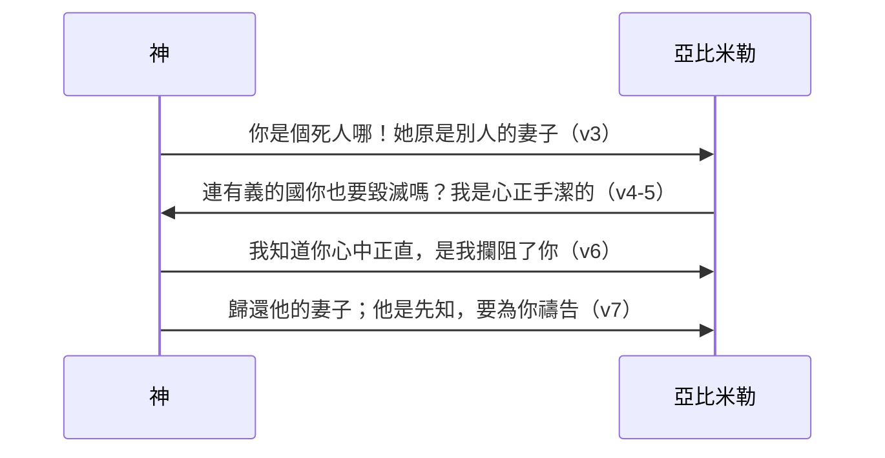

# 創世記 第20章

<!-- chapter-navigation:start -->
| [前一章](../01%20創世記/第19章.md) | [回目錄](../01%20創世記/全書目錄及綱要.md) | [下一章](../01%20創世記/第21章.md) |
| :--- | :---: | ---: |
<!-- chapter-navigation:end -->

1. [[亞伯拉罕]]從那裡向[[南地]]遷去，寄居在[[加低斯]]和[[書珥]]中間的[[基拉耳]]。
2. [[亞伯拉罕]]稱他的妻[[撒拉]]為妹子，[[基拉耳]]王[[亞比米勒]]差人把撒拉取了去。
3. 但夜間，神來，在夢中對[[亞比米勒]]說：你是個死人哪！因為你取了那女人來；他原是別人的妻子。
4. [[亞比米勒]]卻還沒有親近[[撒拉]]；他說：主啊，連有義的國，你也要毀滅嗎？
5. 那人豈不是自己對我說他是我的妹子嗎？就是女人也自己說：他是我的哥哥。我做這事是[[心正手潔]]的。
6. 神在夢中對他說：我知道你做這事是心中正直；[[神攔阻人犯罪|我也攔阻了你，免得你得罪我]]，所以我不容你沾著他。
7. 現在你把這人的妻子歸還他；因為他是[[先知]]，他要為你禱告，使你存活。你若不歸還他，你當知道，你和你所有的人都必要死。
8. [[亞比米勒]]清早起來，召了眾臣僕來，將這些事都說給他們聽，他們都甚懼怕。
9. [[亞比米勒]]召了[[亞伯拉罕]]來，對他說：你怎麼向我這樣行呢？我在什麼事上得罪了你，你竟使我和我國裡的人陷在大罪裡？你向我行不當行的事了！
10. [[亞比米勒]]又對[[亞伯拉罕]]說：你見了什麼才作這事呢？
11. [[亞伯拉罕]]說：[[我以為這地方的人總不懼怕神]]，必為我妻子的緣故殺我。
12. 況且他也實在是我的妹子；他與我是同父異母，後來作了我的妻子。
13. 當神叫我離開父家、飄流在外的時候，我對他說：我們無論走到什麼地方，你可以對人說：他是我的哥哥；這就是你待我的恩典了。
14. [[亞比米勒]]把牛、羊、僕婢賜給[[亞伯拉罕]]，又把他的妻子[[撒拉]]歸還他。
15. [[亞比米勒]]又說：看哪，我的地都在你面前，你可以隨意居住；
16. 又對[[撒拉]]說：我給你哥哥[[一千銀子與遮羞的含義|一千銀子，作為你在閤家人面前遮羞]]【原文作眼】的，你就在眾人面前沒有不是了。
17. [[亞伯拉罕]]禱告神，神就醫好了[[亞比米勒]]和他的妻子，並他的眾女僕，他們便能生育。
18. 因耶和華為[[亞伯拉罕]]的妻子[[撒拉]]的緣故，已經使[[亞比米勒]]家中的婦人不能生育。

---

## 本章知識節點

### 人物與地點
- [[亞伯拉罕]]
- [[撒拉]]
- [[亞比米勒]]
- [[基拉耳]]
- [[南地]]
- [[加低斯]]
- [[書珥]]
- [[亞伯蘭]]

### 神學／主題
- [[先知]]
- [[心正手潔]]
- [[遮羞]]
- [[我以為這地方的人總不懼怕神]]
- [[神在夢中顯現與引導]]
- [[神是生育的源頭]]
- [[神攔阻人犯罪]]

### 背景／原文
- [[古代近東同父異母婚姻]]
- [[亞比米勒名字與王號]]

### 解經爭議
- [[亞伯蘭稱撒萊為妹子的性質]]
- [[亞比米勒為何取撒拉]]
- [[一千銀子與遮羞的含義]]

---

## 本章整理

### 遷往基拉耳，再稱妻為妹（1-2節）

亞伯拉罕從前一地點向南遷移，住在加低斯和書珥之間，又寄居基拉耳。經文沒有說明他為何離開幔利，也沒有說這次遷移本身出於不信。基拉耳確切位置未定，背景資料多放在尼革西部，可能是城邑或地區；「位於埃及與迦南之間，所以豫表良知世界」是特定靈意解讀，不是地理資料。「亞比米勒」是基拉耳王的稱銜，如同法老、凱撒（[[亞比米勒名字與王號]]）。
三個地名都值得補上細節。GT《舊約背景註釋》指[[加低斯]]是西乃半島東北部的一個綠洲，在別是巴以南46哩；[[書珥]]則可能指尼羅河三角洲東部地區埃及要塞的「城牆」——這正是 shur 一語的原義，而埃及《辛奴亥的故事》就提到過一道防止亞洲人入侵的「統治者之牆」。至於[[基拉耳]]的位置，背景註釋承認無法肯定，只知在尼革西部（創十19），甚至可能是地區而非城邑的名字，而大部分考古學家因主前一五五○至一二○○年間該地區極受埃及影響，指出別是巴西北十五哩的哈羅珥遺址（阿拉伯語稱阿布胡雷勒遺址）可能就是基拉耳。

中文來源給的距離則互相矛盾，值得並陳：GT《啟導本聖經創世記註釋》說基拉耳在迦薩南十六公里，GT《創世記雷氏研讀本》說在迦薩以南約十英里（十六公里），而 GT《串珠聖經註釋》卻說「離開非利士人的迦薩只有四公里（三英里）」。前兩者一致，串珠差了四倍；經文本身沒有給距離。丁良才另提供一個譯讀選項：本節或作「住在加低斯和書珥中間，寄居在基拉耳」，也就是先住前者、後寄居後者，而不是說基拉耳就在兩地之間。

亞伯拉罕再次稱撒拉為妹子，與創12章在埃及的策略相似（詳見[[亞伯蘭稱撒萊為妹子的性質]]）：

| | 創12章（埃及） | 創20章（基拉耳） |
|---|---|---|
| 對象 | 法老 | 亞比米勒 |
| 神的介入 | 降大災與法老全家 | 夢中警告、使婦人不能生育 |
| 對亞伯拉罕 | 質問後送走 | 質問後賠償並准居住 |
| 亞伯拉罕的回應 | 敘事未記答辯 | 解釋動機，之後代求 |

第12節說撒拉確是他同父異母的妹子，因此這不是每個字都虛假；問題在於他們刻意省略夫妻關係，使亞比米勒按未婚女子理解她。部分真實仍可因溝通目的和關鍵隱瞞而構成欺騙。
這一章與創12章是否根本是同一件事的重複，來源有正面回應。GT《啟導本聖經創世記註釋》記下文獻說學者的理由——「人不會重蹈覆轍」——並直接反駁：一個人面臨被殺的危險，不會為了動聽的理由而不重施故技；何況從第13節看，兄妹相稱本就是夫妻間早已協議妥當的長期方案。GT《聖經精讀本──創世記註解》也否定重複說，並把兩次事件的共同教訓歸成兩條：無論什麼理由，亞伯拉罕只要離開應許之地就有誘惑跟隨；人很容易再犯已往的罪。它另指出稱妻為妹並非臨時的拙劣藉口，而是族長成長之地哈蘭的風俗與法律——問題不在這個說法本身，而在他們用世俗的處世方法取代了信靠。

丁良才則把亞伯拉罕這次的失誤拆成四個錯處：不依靠神、太過怕人、卑賤自己、玷辱主名。

KC 對亞伯拉罕停在基拉耳這件事本身有一層解讀：基拉耳在非利士人之地，而埃及是世界的圖像，非利士人則是掛名基督徒的圖像——他們自稱是基督徒卻不把神算在內（提後三5上）。他們確實住在神應許給祂子民的地上，甚至宣稱擁有它，卻沒有權利。KC 的話是：從屬靈的意義上說，亞伯拉罕這次落到了他們中間。他並指出這次的失敗比創12 更重，因為亞伯拉罕在這裡否認的是他與那位**應許後嗣之母**的關係。

亞比米勒把撒拉取去的動機未載。有來源推測他被撒拉吸引，另有來源考慮撒拉年齡，認為可能想與富有的亞伯拉罕締結政治或家族聯盟；兩者都不能當作經文明說（詳見[[亞比米勒為何取撒拉]]）。

### 神在夢中攔阻亞比米勒（3-7節）

神夜間在夢中警告亞比米勒，撒拉是有夫之婦，若不歸還便有死亡後果。古代近東普遍把夢視為神明傳訊媒介，聖經也多次記神以夢向非以色列君王說話（[[神在夢中顯現與引導]]）；本章直接把夢的來源認定為神。這場對答本身構成本章的樞紐：
GT《舊約背景註釋》為這種傳訊方式補了一層對照：耶和華在夢中對以色列人說話的案例只有寥寥幾個，但當時人普遍認為這是神向「未受訓練之人」啟示最普通的方式之一——在馬里文獻中，在夢中得到信息的通常正是廟宇專業人員以外的人。它並注意到一個差別：聖經記神將具有特殊意義之夢賜給個人時（如法老、尼布甲尼撒），經文大都沒有說明神是在夢中對這人說話，而本章卻明說「神來，在夢中對亞比米勒說」。丁良才另順手清點：聖經一共記了二十一個夢，其中舊約十五個，本節是第一個。

亞比米勒尚未親近撒拉，自辯是因亞伯拉罕和撒拉共同提供錯誤印象，自己「[[心正手潔]]」。神承認他此事的內心正直，又說是神親自攔阻他，沒有容許他碰撒拉（[[神攔阻人犯罪]]）。這同時保存兩件事：亞比米勒不是明知故犯，卻仍須停止錯誤狀態、歸還別人的妻子。無知能影響責任判斷，不能把有夫之婦變成合法所得。
「還沒有親近」這四個字為何要特別寫出來，GT《聖經精讀本──創世記註解》給了敘事上的理由：這是為保證立約之子以撒的誕生所作的必要措施——按時間推算，若沒有這一句，日後有可能謠傳撒拉所生的以撒是非利士王的兒子。丁良才則推想神攔阻的具體方式：大概神使他生病，免得玷辱撒拉（參6、18節）。

聖經精讀本另對亞比米勒的自辯下了一個雙面的判語：「她是我的妹子」這套說法在當時的法律或許能容許，「但在神的法律面前分明是錯誤的」——這正是本章反覆出現的張力，風俗與律法的容許不等於神面前的無虧。

> [!quote] KC
> 有些罪在人心裏已經計劃、已經定意，卻始終沒有犯成——因為神攔阻了人去犯那罪。

「我攔阻了你，免得你得罪我」把未發生的罪歸因於神的保守，也沒有抹去亞比米勒接下來必須順服的責任。來源常把這與撒拉將生以撒相連：神的介入防止其母系身分和婚姻完整受到破壞。

### 失敗者仍被稱為先知（7-13節）

這是《創世記》第一次使用「[[先知]]」一詞。此處先知的功能與代求直接相連：亞伯拉罕要為亞比米勒禱告，使他存活。先知不只預告未來，也代表神說話，並在神面前為人求情。

神稱亞伯拉罕為先知時，他剛因欺騙使別人陷入危險。這不是認可欺騙，而是顯示他的職分和神的應許沒有因一次失敗被抹除；同時，他必須面對亞比米勒公開質問。
GT《創世記雷氏研讀本》註明這是聖經第一次出現希伯來文 nabi 一字，意思是「宣佈，以中間人的身分發言」，通常指代表上級宣佈信息的人（比較出七1）。GT《舊約背景註釋》則指出本章用法的特別之處：古代近東的人很明白先知的角色——馬里鎮遺址就挖掘到五十多個記載不同先知所傳信息的文獻——但先知通常是傳達神明的信息，而亞伯拉罕在此卻是為人得醫治代禱。背景註釋認為這反映的是對先知比較廣義的看法，把他視為「與神明關係有力，能夠咒詛，也能把它除去的人」（類似角色見王上十三6）；而在古代近東，這個角色主要是由施咒的祭司所扮演的。

丁良才由此把亞伯拉罕的身分歸成三重尊榮：為君王（創十四14-16）、為祭司（創十八23-33）、為先知（本章7節）。GT《聖經精讀本──創世記註解》則反過來看這一幕的難堪：當這位既是神的朋友（代下20:7）又是神代言人的亞伯拉罕，被一個沒受割禮的外邦人責備時，那份羞愧是真實的——它並把亞伯拉罕的罪點成兩條：不信神，以及讓鄰舍失足。

亞伯拉罕解釋自己以為當地不懼怕神，會為撒拉殺他（[[我以為這地方的人總不懼怕神]]）；但亞比米勒和臣僕聽見神的警告後甚懼怕，形成敘事反差。他又說兄妹稱呼是離開父家時早已約定的策略，證明這不是臨時口誤；同父異母的婚姻在族長時代仍被容許，後來才被律法禁止（[[古代近東同父異母婚姻]]）。第13節「神叫我……飄流」有註釋批評他把責任推給神，但句子也可只是回述蒙召後的漂泊生活，不宜僅憑措辭斷定他在責怪神。
GT《舊約背景註釋》為這樁婚姻補上社會功能：同父異母的婚姻在族長時代不被視為亂倫，也是保證再婚所生的女兒能夠受本家照顧的方法。GT 賈斯樂郝威《聖經難解經文詮釋手冊》在〈命題39〉正面處理「亞伯拉罕娶妹是否犯亂倫」，給了兩條理由：其一，禁止亂倫的律法是在亞伯拉罕五百年後才由摩西頒佈的，他不能為尚未公佈的律法負責；其二，聖經中「妹子」「弟兄」等稱呼常用在較寬廣的意義上（如亞伯拉罕的姪兒羅得也被稱為 brother，創十四12、16），因此撒拉未必是今日理解的那種親近關係。賈斯樂郝威並補一句方法上的話：若他真犯了罪，聖經會確實記述他的過錯——本章記下的過錯是欺騙，不是婚姻。

GT《創世記雷氏研讀本》把亞伯拉罕的三段自辯直接稱為「三個脆弱的藉口」：以為當地人不懼怕神、聲稱認撒拉為妹並沒有說謊、以及這是早有協議的安排。

### 歸還、賠償與公開昭雪（14-16節）

亞比米勒歸還撒拉，又給亞伯拉罕牛、羊、僕婢和居住自由。他另給「一千銀子」，數量很大；原文沒有在本節明說重量單位，許多譯本補作一千舍客勒，現代重量與價值換算只能約估。

「作為你在闔家人面前[[遮羞]]【原文作眼】」是難譯句。主要解釋包括：這筆錢公開證明撒拉未被玷污、恢復她的名譽；或作補償，使相關人不再以指責眼光看她（詳見[[一千銀子與遮羞的含義]]）。亞比米勒稱亞伯拉罕為「你哥哥」也可能帶有反諷，提醒二人造成危機的說法。無論細節如何，句末重點是撒拉在眾人面前得到昭雪。
GT 李道生《舊約聖經問題總解》把這句難譯句拆成三種可能的詮釋，一併列出比擇一清楚：其一是面帕說——當時婦女在男子面前多用面帕蒙臉（如利百加見以撒時急忙拿帕子蒙上臉，創二十四64-65），撒拉當時沒有帕子，因此王給錢去買面帕；其二是聘奩說——亞伯拉罕既認撒拉為妹，王便將她歸還「哥哥」並贈一千銀子，作為包含面紗在內的妝奩費，好叫二人恢復夫妻關係；其三是解恨說——同一個希伯來詞在創三十二20 譯作「解……恨的」，因此這筆禮物是要平息亞伯拉罕與其親友的怨恨，不再記念他曾有霸佔撒拉的企圖。李道生並引兩種譯法佐證：文理本作「我以千金賜爾兄，可蔽爾容，勿今眾見，言此蓋以責之」，現代中文譯法則作「用來證明你是清白的」。GT《聖經精讀本──創世記註解》另提直譯「蒙住你的眼」，並給兩個方向：不讓撒拉看見亞比米勒冒犯自己的過犯，或不讓別人用情慾的眼目看她。

GT《聖經精讀本──創世記註解》把亞比米勒的回應數成四樣禮物——家畜、奴僕、土地、錢財——並指這是表示贖罪和解的意思；它並評道，亞比米勒的好意超乎想像，反過來顯明亞伯拉罕的懼怕和缺乏信心是很大的錯誤。KC 注意到這場對話的收尾：亞比米勒是在教訓亞伯拉罕，而第16節末在另一種譯法中作「並要受教」。

一千銀子有多重，來源之間也不一致。GT《舊約背景註釋》說一千舍客勒按重量約是二十五磅銀子，僱工人一生也賺不到這麼多，並指在烏加列文學中這正是神明之間女子聘禮的數目；它推測亞比米勒手筆這麼大，可能既要保證撒拉毫髮無損，也要安撫使他全家不育的神祇。至於對照的奴僕身價，啟導本說當時一個奴僕只值三十塊銀子（出二十一32；利二十七3-5），雷氏卻說是二十舍客勒（創三十七28）——兩說相差三分之一，但無論採哪一個，一千銀子都是極重的賠償。

### 先知代求與生育恢復（17-18節）

亞伯拉罕照神所說為亞比米勒禱告，神醫好亞比米勒、妻子和女僕，使婦人恢復生育。第18節解釋先前不能生育是因撒拉之故，顯示神既保護撒拉，也使亞比米勒家明白事件並非普通宮廷安排（[[神是生育的源頭]]）。

敘事帶有明顯反差：自己的妻子仍等待應許之子出生的亞伯拉罕，先為另一家恢復生育禱告。經文沒有說這項代求是他配得赦免的代價；它是神在第7節指定的恢復途徑，也實際顯明亞伯拉罕作先知的角色。KC 由此提醒：信徒對付了虧欠之後，才能再次成為周圍人的祝福。
CT 從時序推出一項容易略過的安排：亞伯拉罕居留基拉耳的時間應不多於一年（參創十八14、廿一2），因此亞比米勒家婦人不能生育這件事是神早已安排好的，而且是「為撒拉的緣故」。CT 由此讀出神給亞伯拉罕的功課——**把自己生育的難處放在一邊，先為別人的生育禱告**；並補三句應用：放下自己先顧別人的需要，神成全別人時也成全你；人能不能生育不在乎自己乃在乎神；信徒不一定要自己先有經歷，才能為別人禱告。

CT 另把本章關於亞比米勒的材料整理成一份〈認識屬世的良知〉清單，六項並列：以公義自許（4節）、作事心正手潔（5節）、對神心存懼怕（8節）、對人不敢隨便得罪（9節）、肯為別人著想（14-16節）、卻缺乏生命（18節）。前五項都是這位外邦王勝過亞伯拉罕之處，最後一項才是分界線。

GT《舊約背景註釋》還指出這場災病本身的對稱設計：不育或生育機能的災病臨到亞比米勒家，直到他把撒拉歸還為止——「其中諷刺之處，是亞比米勒令亞伯拉罕多久沒有妻子，他自己就多久沒有兒子」。刑罰的形式與過犯的形式互相對應，而解除的方式則是那位受虧負者的代求。

**參考資料**
https://biblehub.com/study/genesis/20.htm
https://www.kingcomments.com/en/bible-studies/Gen/20
https://www.ccbiblestudy.org/Old%20Testament/01Gen/01CT20.htm
https://www.ccbiblestudy.org/Old%20Testament/01Gen/01GT20.htm

<!-- appendix-links:start -->
## 附錄

### 相關地圖
- [[appendix/fhl_maps/maps/009|〈創圖四〉亞伯拉罕的生平]]
<!-- appendix-links:end -->

<!-- chapter-navigation:start -->
| [前一章](../01%20創世記/第19章.md) | [回目錄](../01%20創世記/全書目錄及綱要.md) | [下一章](../01%20創世記/第21章.md) |
| :--- | :---: | ---: |
<!-- chapter-navigation:end -->
