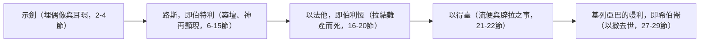
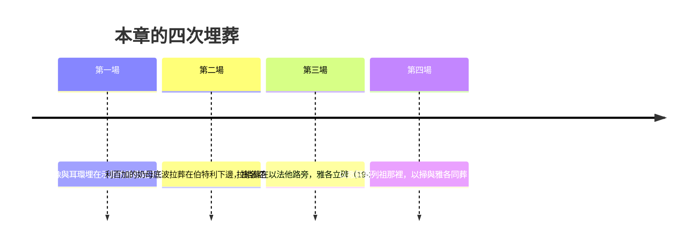

# 創世記 第35章

<!-- chapter-navigation:start -->
| [前一章](../01%20創世記/第34章.md) | [回目錄](../01%20創世記/全書目錄及綱要.md) | [下一章](../01%20創世記/第36章.md) |
| :--- | :---: | ---: |
<!-- chapter-navigation:end -->

1. 神對[[雅各]]說：起來！上[[伯特利]]去，住在那裡；要在那裡[[祭壇敬拜|築一座壇]]給神，就是你逃避你哥哥[[以掃]]的時候向你顯現的那位。
2. [[雅各]]就對他家中的人並一切與他同在的人說：你們要[[除掉外邦神|除掉你們中間的外邦神]]，也要[[自潔與更換衣裳|自潔，更換衣裳]]。
3. 我們要起來，上[[伯特利]]去，在那裡我要[[祭壇敬拜|築一座壇]]給神，就是在我遭難的日子應允我的禱告、在我行的路上[[神的同在與保護|保佑我的那位]]。
4. 他們就把[[除掉外邦神|外邦人的神像]]和他們[[耳環作異教護身符|耳朵上的環子]]交給[[雅各]]；雅各都藏在[[示劍（城）|示劍]]那裡的橡樹底下。
5. 他們便起行前往。[[神的同在與保護|神使那周圍城邑的人都甚驚懼]]，就不追趕[[雅各]]的眾子了。
6. 於是[[雅各]]和一切與他同在的人到了[[迦南地]]的[[路斯]]，就是[[伯特利]]。
7. 他在那裡築了一座壇，就給那地方起名叫[[伊勒伯特利]]【就是[[伯特利的神|伯特利之神]]的意思】；因為他逃避他哥哥的時候，神在那裡向他顯現。
8. [[利百加]]的奶母[[乳母底波拉|底波拉]]死了，就葬在[[伯特利]]下邊橡樹底下；那棵樹名叫[[亞倫巴古]]。
9. [[雅各]]從[[巴旦亞蘭]]回來，神又向他顯現，賜福與他，
10. 且對他說：你的名原是[[雅各]]，從今以後不要再叫雅各，要叫以色列。這樣，他就[[雅各改名以色列|改名叫以色列]]。
11. 神又對他說：我是[[全能的神（El Shaddai）|全能的神]]；你要生養眾多，將來有一族和多國的民從你而生，又有君王從你而出。
12. 我所賜給[[亞伯拉罕]]和[[以撒]]的地，我要賜給你與你的後裔。
13. 神就從那與[[雅各]]說話的地方升上去了。
14. [[雅各]]便在那裡[[立石柱與澆油|立了一根石柱]]，在柱子上[[奠酒]]，[[立石柱與澆油|澆油]]。
15. [[雅各]]就給那地方起名叫[[伯特利]]。
16. 他們從[[伯特利]]起行，離[[以法他]]還有一段路程，[[拉結]]臨產甚是艱難。
17. 正在艱難的時候，[[古代收生婆|收生婆]]對他說：不要怕，你又要得一個兒子了。
18. 他將近於死，靈魂要走的時候，就給他兒子起名叫[[便俄尼名字含義|便俄尼]]；他父親卻給他起名叫[[便雅憫]]。
19. [[拉結]]死了，葬在[[以法他]]的路旁；以法他就是[[伯利恆]]。
20. [[雅各]]在他的墳上立了一統碑，就是[[拉結之墓|拉結的墓碑]]，到今日還在。
21. 以色列起行前往，在[[以得臺]]那邊支搭帳棚。
22. 以色列住在那地的時候，[[流便]]去與他父親的妾[[辟拉]]同寢，以色列也聽見了。[[雅各]]共有十二個兒子。
23. [[利亞]]所生的是[[雅各]]的長子[[流便]]，還有[[西緬]]、[[利未]]、[[猶大（雅各之子）|猶大]]、[[以薩迦（價值）|以薩迦]]、[[西布倫（同住）|西布倫]]。
24. [[拉結]]所生的是[[約瑟]]、[[便雅憫]]。
25. [[拉結]]的使女[[辟拉]]所生的是[[但（審判）|但]]、[[拿弗他利]]。
26. [[利亞]]的使女[[悉帕]]所生的是[[迦得（萬幸）|迦得]]、[[亞設（有福）|亞設]]。這是[[雅各]]在[[巴旦亞蘭]]所生的兒子。
27. [[雅各]]來到他父親[[以撒]]那裡，到了[[基列亞巴]]的[[幔利]]，乃是[[亞伯拉罕]]和以撒寄居的地方；基列亞巴就是[[希伯崙]]。
28. [[以撒]]共活了一百八十歲。
29. [[以撒]]年紀老邁，日子滿足，氣絕而死，歸到他列祖【原文作本民】那裡。他兩個兒子[[以掃]]、[[雅各]]把他埋葬了。

---

## 本章知識節點

### 人物
- [[雅各]]
- [[以掃]]
- [[以撒]]
- [[亞伯拉罕]]
- [[利百加]]
- [[乳母底波拉]]
- [[拉結]]
- [[便雅憫]]
- [[流便]]
- [[辟拉]]
- [[利亞]]
- [[西緬]]
- [[利未]]
- [[猶大（雅各之子）]]
- [[以薩迦（價值）]]
- [[西布倫（同住）]]
- [[約瑟]]
- [[但（審判）]]
- [[拿弗他利]]
- [[悉帕]]
- [[迦得（萬幸）]]
- [[亞設（有福）]]

### 地點
- [[伯特利]]
- [[路斯]]
- [[示劍（城）]]
- [[迦南地]]
- [[巴旦亞蘭]]
- [[以法他]]
- [[伯利恆]]
- [[以得臺]]
- [[基列亞巴]]
- [[幔利]]
- [[希伯崙]]

### 神學
- [[伯特利的神]]
- [[回到伯特利的屬靈復興]]
- [[除掉外邦神]]
- [[自潔與更換衣裳]]
- [[祭壇敬拜]]
- [[神的同在與保護]]
- [[神的應許應驗]]
- [[全能的神（El Shaddai）]]
- [[雅各改名以色列]]
- [[十二支派起源]]
- [[流便失去長子名分]]

### 歷史
- [[家神像_特拉芬]]
- [[耳環作異教護身符]]
- [[古代收生婆]]
- [[古代近東妾與繼承權]]
- [[拉結之墓]]
- [[立石柱與澆油]]
- [[奠酒]]

### 原文
- [[伊勒伯特利]]
- [[亞倫巴古]]
- [[便俄尼名字含義]]
- [[便雅憫名字含義]]

### 互文
- [[伯特利之約 (創28)|伯特利之約 (創28) 天梯異象與雅各所許的願]]
- [[雅博渡口經歷 (創32)|雅博渡口經歷 (創32) 摔跤得名以色列]]
- [[何西阿書12章雅各摔跤]]
- [[創世記49章流便受責]]
- [[歷代志上5章流便失去長子名分]]
- [[馬太福音2章拉結哭泣]]
- [[彌迦書5章伯利恆與彌賽亞]]

### 解經爭議
- [[拉結之死與雅各咒詛是否相關]]
- [[流便與辟拉同寢的性質]]

### 背景
- [[摩利橡樹]]
- [[古代生產的危險]]

---

## 本章整理

第34章的污穢事件中，神的名字完全沒有出現；到了本章第一節，「神對[[雅各]]說」——CT 敏銳地指出這個對比。神先興起環境迫使雅各服下來，然後才開口說話。本章是聖經中第一次完整的屬靈復興記錄（GT／啟導本），也是一章「復興與埋葬」並行的經文：四次埋葬（偶像、底波拉、拉結、以撒）交織在祝福之中。

### 經文大綱

1. **神命雅各回[[伯特利]]，全家除偶像、自潔、更換衣裳**（1-5節）
2. **雅各在伯特利築壇，底波拉死，神重申改名與應許**（6-15節）
3. **拉結難產生便雅憫而死，葬在以法他路旁**（16-20節）
4. **流便與辟拉同寢，雅各十二子名單完整列出**（21-26節）
5. **雅各回到幔利見以撒，以撒去世，以掃與雅各同葬**（27-29節）

### 一路向南，一路埋葬（v1-29）

本章有兩個形狀疊在一起。一是路線：從示劍往南，經伯特利、以法他、以得臺，最後回到父家幔利；
二是時間軸：四次埋葬沿著這條路線一一發生，KC 數過——埋偶像是「本章的第一場埋葬，
後面還有三場（8、19、29節）」。復興與埋葬在同一段路上並行。

### 一、回伯特利：神的召回與提醒

神說「起來！上伯特利去……[[祭壇敬拜|築一座壇]]給神」——CT 譯出神的心意：「當初你向我要的，我都給你了；那麼，你也應當還你當初向我所許的願」（創28:20-22）。丁良才更直白：「人在難中往往向神許願；到了平安的時候，卻忘了所許的願——吃了果子忘了樹。神卻不忘記」（傳5:4-5）。

> [!note] 聖經中第一次的復興運動
> GT／啟導本歸納這場復興的九個特色：①復興前人有罪惡、不義和懼怕（創34:30-31）；②復興始於神的一句話——「神對雅各說」；③丟棄神不喜悅的一切；④回到順服神旨意的路上（上伯特利築壇）；⑤記念神過去的賜福；⑥真誠尋求神的必得保護（5節）；⑦帶來關於神性情的新啟示（11節）；⑧神重賜應許，叫人過更高的屬靈生活；⑨復興的經歷是為預備迎接試煉（16-20節）。

### 二、親近神以前：全家的清理

雅各吩咐家人[[除掉外邦神]]、[[自潔與更換衣裳|自潔、更換衣裳]]——敬拜不是換個地點，而是全家屬靈秩序的重整。來源指出這些偶像可能包括拉結從拉班家帶來的特拉芬（創31:19），以及示劍事件後擄掠來的異教物品（創34:27-29）；[[耳環作異教護身符|耳朵上的環子]]也非尋常妝飾，而是異教護身符，上面可能刻有神像（CT／GT）。雅各把這一切埋在[[示劍（城）|示劍]]的橡樹底下——這正是亞伯拉罕進迦南後第一次築壇之地（創12:6-7），象徵回到純潔的信仰。

| 三個吩咐 | 屬靈含義（CT） |
|---|---|
| 除掉外邦神 | 除去一切在心中取代神地位的人、事、物 |
| 自潔 | 對付罪污與天然的舊人 |
| 更換衣裳 | 行為與生活方式的改變（西3:9-10） |
GT 華爾頓《創世記背景註釋》對「除掉外邦神」這道命令的性質下了一個節制的判斷：這個呼籲同時是呼籲他們惟獨委身於耶和華，但「這話並不顯示他們在理論上明白或接受一神信仰」，而是表示他們接受了耶和華作為他們一家的守護神——接受一位有位格的神保護供給自己一家，是主前第二千年紀初期美索不達米亞常見的信念，人們並不以這類神祇取代宇宙性大神的地位，只是把祂作為個人崇拜與奉行宗教的主要對象。這個分辨提醒我們：第2節是全家歸屬的轉向，而完整的一神信仰是後來逐步啟示的。

至於為何埋在示劍那棵橡樹底下，華爾頓指出這棵樹可能就是[[摩利橡樹|創十二6]]、書二十四23-27、士九6、37 所提及的同一棵；在當時的通俗宗教中聖木扮演重要角色，因為人把石頭和樹木視作神明的居所，而迦南宗教相信它是豐饒崇拜的象徵（申十二2；耶三9；何四13）。他同時坦承一個限制：「足以澄清聖木在迦南作用的考古和文學遺跡，卻少之又少。」把偶像與耳環埋在這樣一棵樹下，動作本身就帶著把舊信仰交還原處的意味。

結果是[[神的同在與保護|神使那周圍城邑的人都甚驚懼]]，不追趕雅各的眾子（5節）——原文作「神的驚懼」臨到他們。CT：「人走在神的道路上，神就負人一切的責任。」

### 三、伯特利：從個人的神到神家的神

雅各在示劍稱神為「以色列的神」（創33:20），如今在伯特利稱祂為[[伯特利的神|伊勒伯特利]]（[[伊勒伯特利|伯特利之神]]，7節）——CT 指出這是觀念的擴大：從個人進入團體，神不只是我個人的神，更是「神的家」的神。

神向他再次顯現（距第一次伯特利顯現約三十年），重申[[雅各改名以色列|以色列之名]]（毘努伊勒已改，如今付諸實施），並以[[全能的神（El Shaddai）|全能的神]]（El Shaddai）宣告生養眾多、一族與多國、君王從你而出、賜地的應許——這把雅各接回亞伯拉罕、以撒之約的歷史線。雅各回應：[[立石柱與澆油|立石柱、澆油]]，並首次[[奠酒]]。

> [!quote] 從懼怕到喜樂
GT 華爾頓《創世記背景註釋》為這兩次立柱作了一個簡單的澄清：創二十八18 雅各已在伯特利立石澆油，如今他又另立一柱，並且奠酒紀念神的顯現——「在同一地區立有幾根石柱並無異常之處」，不必當作前後矛盾或重複記載。他並在第1節下對「築壇」的功用提出保留：亞伯蘭周遊時到處築壇，其目的不是獻祭而是求告耶和華的名，而雅各的情況似乎也是一樣，因為經文沒有提過在壇上獻祭；有人提出壇的作用是作為神明領土的標記，另一個可能是作為耶和華之名的紀念碑。

> CT：前次雅各遇見神之後，覺得害怕（創28:16-18）；現在他遇見神，不再是懼怕，而是喜樂（「奠酒」）。奠酒在聖經中表明獻身給神（提後4:6）與從中所得的喜樂（腓2:17）。何西阿12章後來回顧「神在伯特利與**我們**說話」——顯示這不是私人靈修插曲，而是以色列全族的根源記憶（何西阿書12章雅各摔跤）。

### 四、祝福中交織的死亡
GT 華爾頓《創世記背景註釋》為這幾件事各補了一層當時的實況。關於**收生婆**：她們通常是年紀比較大的婦女，責任包括教授年輕女子婚姻之事、在分娩時施以援手，並有分參與命名儀式，可能還教導初為人母者怎樣哺乳和照顧嬰兒——第17節收生婆對拉結說的那句「不要怕，你又要得一個兒子了」，正是這個角色的職責之一。關於[[古代生產的危險|**難產**]]：難產而死在古時並不罕見，巴比倫的咒語文學中就包括好幾個在生產時用作保佑母嬰平安的咒語，尤其針對他們相信專門攻擊女子和兒童的邪靈拉馬什圖。GT《聖經精讀本》另在第17節下列出拉結艱難的三個可能原因：距生約瑟已隔近十六、七年、年齡接近五十歲、且在旅程中生產。

關於**起名**：華爾頓說拉結臨死時給孩子起名反映自己的痛苦，而按嬰兒出生時的情景起名是很常見的作法；雅各在此另起新名，「也是為父者的權利」。他並列出「便雅憫」的兩種解法：可能是「右（手）之子」，表示受保護之處；也可能是「南方之子」——因為以色列人面朝東方時，右手就在南面。這正好與本卷反覆出現的面東定向慣例相合。

關於**拉結之墓**：華爾頓指難產之地在伯利恆以北以法他的路上，後來成為便雅憫與猶大支派屬地的交界（撒上十2），伯利恆北面約十二哩之處；撒下十八18 記載了另一個為死人豎立紀念碑的例子，而耶利米書三十一章很久之後仍提到拉結的墳墓，顯示直至王國時代末期此地仍是有名的朝聖地點——他並提醒近期傳統中「一個拉結墓在伯利恆，另一個則在耶路撒冷以北，二者發生了混淆的情況」。至於第21節的**以得臺**，這地名意為「牧羊塔臺」，是牧人用來保護羊群不受野獸侵害的地方；按雅各的行程，埋葬拉結後他往南前進，以得臺應該很接近耶路撒冷（彌四8「羊群的高臺」一語也支持這個考證），儘管後世傳統認為它比較接近伯利恆。

底波拉、拉結、以撒三場死亡，使本章成為埋葬之章。[[拉結]]在生[[便雅憫]]時死去，將「[[便俄尼名字含義|便俄尼]]」（我憂患之子）轉為「便雅憫」（右手之子）：

- CT：「天然的人憑現實判斷事物，屬靈的人憑信心判斷事物。」經過苦難（便俄尼）而進入榮耀（便雅憫）——十字架的原則。
- KC：這兩個名字屬於同一位，正提醒主耶穌的受苦與榮耀不可分割（彼前1:11）。
- 拉結死在[[伯利恆]]（[[以法他]]），日後基督降生之地（彌5:2）；耶利米與馬太都以「拉結哭泣」指向那地的哀傷（耶31:15；太2:18）。[[拉結之墓|拉結的墓碑]]至王國時代末期仍是有名的地標（華爾頓）。

### 五、十二子名單完成，罪性仍未消失

便雅憫出生後，雅各十二子名單首次完整列出。然而[[流便]]與父妾[[辟拉]]同寢——這不是近親通婚而是亂倫（利18:8；林前5:1），在古代近東更被視為僭奪族長權威的舉動（華爾頓）。他因此永遠失去長子名分（創49:3-4；代上5:1）。

KC 有一個細膩的觀察：底拿受辱時經文說「**雅各**聽見了」（創34:5），他沉默被動；流便犯罪時經文說「**以色列**也聽見了」（22節）——用的是新名。雅各的屬靈生命確實長進了。CT 則提醒：外表的沐浴自潔（2節）無濟於事，要緊的是內心的潔淨更新。

末了以撒去世，[[以掃]]與雅各一同埋葬父親——如同當年以撒與以實瑪利同葬亞伯拉罕。KC：兩個人生道路截然不同的兒子站在同一個墳前，信心使一切不同：沒有信心的只能往墳裡看，有信心的卻能越過墳墓觀看。

### 應用反思

- 屬靈復興不是更換地點，而是回到神曾說話、自己曾許願的地方。
- 家庭敬拜需要具體清理偶像與生活方式，不能只停在情緒或口號。
- 神的應許可以在喪失、痛苦與死亡中繼續推進——便雅憫正是生在拉結的死裡。
- 屬靈里程碑之後仍要警醒：流便事件提醒人不能以家族身分代替聖潔生活。

GT 華爾頓《創世記背景註釋》為第22節流便的行為說明了它在當時的雙重性質：妾是沒有妝奩陪嫁的女子，職務包括為家庭生兒育女，而在古代世界生產是十分重要的功用，因為家庭甚至個人的存亡往往是無定之數；由於妾同時是性伴侶，「占用父親的妾不單要負亂倫之名，更被視為試圖僭奪族長的權威」。這正解釋了創四十九3-4 雅各臨終時為何以「不得居首位」作為對流便的判詞——那不只是道德上的責備，也是對一次未遂奪權的裁決。

**參考資料**
https://biblehub.com/study/genesis/35.htm
https://www.kingcomments.com/en/bible-studies/Gen/35
https://www.ccbiblestudy.org/Old%20Testament/01Gen/01CT35.htm
https://www.ccbiblestudy.org/Old%20Testament/01Gen/01GT35.htm
https://github.com/STEPBible/STEPBible-Data

<!-- appendix-links:start -->
## 附錄

### 相關地圖
- [[appendix/fhl_maps/maps/013|〈創圖八〉以撒的生平]]
- [[appendix/fhl_maps/maps/014|〈創圖九〉以掃的生平，以東、西珥、亞瑪力人和米甸人]]
- [[appendix/fhl_maps/maps/015|〈創圖十〉雅各的生平]]
- [[appendix/fhl_maps/maps/032|〈書圖五〉約但河東兩個半支派的領土]]
<!-- appendix-links:end -->

<!-- chapter-navigation:start -->
| [前一章](../01%20創世記/第34章.md) | [回目錄](../01%20創世記/全書目錄及綱要.md) | [下一章](../01%20創世記/第36章.md) |
| :--- | :---: | ---: |
<!-- chapter-navigation:end -->
