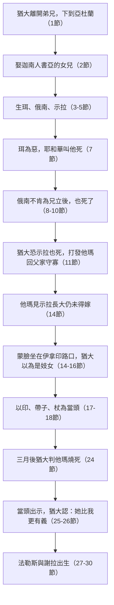

# 創世記 第38章

<!-- chapter-navigation:start -->
| [前一章](../01%20創世記/第37章.md) | [回目錄](../01%20創世記/全書目錄及綱要.md) | [下一章](../01%20創世記/第39章.md) |
| :--- | :---: | ---: |
<!-- chapter-navigation:end -->

1. 那時，[[猶大（雅各之子）|猶大]]離開他弟兄下去，到一個[[亞杜蘭]]人名叫[[希拉]]的家裡去。
2. [[猶大（雅各之子）|猶大]]在那裡看見一個[[迦南人]]名叫[[書亞（迦南人）|書亞]]的[[書亞的女兒|女兒]]，就娶他為妻，與他同房，
3. 他就懷孕生了兒子，[[猶大（雅各之子）|猶大]]給他起名叫[[珥]]。
4. 他又懷孕生了兒子，母親給他起名叫[[俄南]]。
5. 他復又生了兒子，給他起名叫[[示拉]]。他生示拉的時候，[[猶大（雅各之子）|猶大]]正在[[基悉]]。
6. [[猶大（雅各之子）|猶大]]為長子[[珥]]娶妻，名叫[[他瑪（創38）|他瑪]]。
7. [[猶大（雅各之子）|猶大]]的長子[[珥]]在耶和華眼中看為惡，耶和華就叫他死了。
8. [[猶大（雅各之子）|猶大]]對[[俄南]]說：你當與你哥哥的妻子同房，向他盡你為弟的本分，為你哥哥[[弟續兄孀制度|生子立後]]。
9. [[俄南]]知道生子不歸自己，所以同房的時候便遺在地，免得給他哥哥留後。
10. [[俄南]]所做的在耶和華眼中看為惡，耶和華也就叫他死了。
11. [[猶大（雅各之子）|猶大]]心裡說：恐怕[[示拉]]也死，像他兩個哥哥一樣，就對他兒婦[[他瑪（創38）|他瑪]]說：你去，在你父親家裡守寡，等我兒子示拉長大。他瑪就回去，住在他父親家裡。
12. 過了許久，[[猶大（雅各之子）|猶大]]的妻子[[書亞的女兒]]死了。猶大得了安慰，就和他朋友[[亞杜蘭]]人[[希拉]]上[[亭拿（猶大）|亭拿]]去，到他[[婚宴與剪羊毛風俗|剪羊毛]]的人那裡。
13. 有人告訴[[他瑪（創38）|他瑪]]說：你的公公上[[亭拿（猶大）|亭拿]][[婚宴與剪羊毛風俗|剪羊毛]]去了。
14. [[他瑪（創38）|他瑪]]見[[示拉]]已經長大，還沒有娶他為妻，就脫了他作[[寡婦衣裳|寡婦的衣裳]]，用帕子蒙著臉，又遮住身體，坐在[[亭拿（猶大）|亭拿]]路上的[[伊拿印]]城門口。
15. [[猶大（雅各之子）|猶大]]看見他，以為是妓女，因為他蒙著臉。
16. [[猶大（雅各之子）|猶大]]就轉到他那裡去，說：來吧！讓我與你同寢。他原不知道是他的兒婦。[[他瑪（創38）|他瑪]]說：你要與我同寢，把什麼給我呢？
17. [[猶大（雅各之子）|猶大]]說：我從羊群裡取一隻山羊羔，打發人送來給你。[[他瑪（創38）|他瑪]]說：在未送以先，你願意給我一個當頭嗎？
18. 他說：我給你什麼當頭呢？[[他瑪（創38）|他瑪]]說：你的[[印帶杖身份憑據|印、你的帶子，和你手裡的杖]]。[[猶大（雅各之子）|猶大]]就給了他，與他同寢，他就從猶大懷了孕。
19. [[他瑪（創38）|他瑪]]起來走了，除去帕子，仍舊穿上作[[寡婦衣裳|寡婦的衣裳]]。
20. [[猶大（雅各之子）|猶大]]託他朋友[[亞杜蘭]]人送一隻山羊羔去，要從那女人手裡取回[[印帶杖身份憑據|當頭]]來，卻找不著他，
21. 就問那地方的人說：[[伊拿印]]路旁的[[迦南廟妓風俗|妓女]]在哪裡？他們說：這裡並沒有妓女。
22. 他回去見[[猶大（雅各之子）|猶大]]說：我沒有找著他，並且那地方的人說：這裡沒有妓女。
23. [[猶大（雅各之子）|猶大]]說：我把這山羊羔送去了，你竟找不著他。任憑他拿去吧，免得我們被羞辱。
24. 約過了三個月，有人告訴[[猶大（雅各之子）|猶大]]說：你的兒婦[[他瑪（創38）|他瑪]]作了妓女，且因行淫有了身孕。猶大說：拉出他來，把他燒了！
25. [[他瑪（創38）|他瑪]]被拉出來的時候便打發人去見他公公，對他說：這些東西是誰的，我就是從誰懷的孕。請你認一認，這[[印帶杖身份憑據|印和帶子並杖]]都是誰的？
26. [[猶大（雅各之子）|猶大]]承認說：[[他瑪比猶大更有義|他比我更有義]]，因為我沒有將他給我的兒子[[示拉]]。從此猶大不再與他同寢了。
27. [[他瑪（創38）|他瑪]]將要生產，不料他腹裡是一對雙生。
28. 到生產的時候，一個孩子伸出一隻手來；收生婆拿[[紅線與長子標記|紅線]]拴在他手上，說：這是頭生的。
29. 隨後這孩子把手收回去，他哥哥生出來了；收生婆說：你為什麼搶著來呢？因此給他起名叫[[法勒斯]]。
30. 後來，他兄弟那手上有[[紅線與長子標記|紅線]]的也生出來，就給他起名叫[[謝拉]]。

---

## 本章知識節點

### 人物
- [[猶大（雅各之子）]]
- [[希拉]]
- [[書亞（迦南人）]]
- [[書亞的女兒]]
- [[珥]]
- [[俄南]]
- [[示拉]]
- [[他瑪（創38）]]
- [[法勒斯]]
- [[謝拉]]
- [[迦南人]]

### 地點
- [[亞杜蘭]]
- [[基悉]]
- [[亭拿（猶大）]]
- [[伊拿印]]

### 歷史
- [[猶大與他瑪事件]]
- [[雅各家下埃及的必要性]]
- [[猶大支派三族來源]]

### 神學
- [[猶大的認罪與悔改]]
- [[他瑪比猶大更有義]]
- [[彌賽亞家譜中的恩典]]
- [[神的主權]]
- [[聖約子民與世界的界限]]
- [[寬以律己嚴以待人]]

### 文化
- [[弟續兄孀制度]]
- [[寡婦衣裳]]
- [[婚宴與剪羊毛風俗]]
- [[印帶杖身份憑據]]
- [[迦南廟妓風俗]]
- [[紅線與長子標記]]

### 互文
- [[申命記7_3-4 禁止與迦南人通婚]]
- [[申命記25章弟續兄孀律法]]
- [[馬太福音1章他瑪進入基督家譜]]
- [[路得記4章法勒斯家譜]]
- [[創世記37章山羊與衣服欺騙雅各]]
- [[法勒斯出生與雅各以掃出生對照]]

### 解經爭議
- [[創世記38章插入約瑟敘事的原因]]
- [[創世記38章時間順序問題]]
- [[俄南之罪是否等於自瀆]]
- [[他瑪行動是否可稱義]]
- [[亭拿地點辨識]]

---

## 本章整理

第37章[[猶大（雅各之子）|猶大]]提議把約瑟賣掉，第39章約瑟在埃及拒絕誘惑——本章夾在中間，是刻意的對照。GT／丁良才列出這段「注段」列入聖經的三個緣故：①顯明以色列人如何漸漸變壞，並神使他們下埃及受試煉的緣故；②叫我們越發注意約瑟的清潔（創39:1-10）；③使我們知道猶大支派分三族的來歷（民26:19-20），並明白太1:3——**主耶穌降世為人是何等的虛己**。

這是一章滿了罪的經文。KC 說得直白：**聖靈毫不遮掩地展示人性的深度敗壞；彷彿在這裡，主耶穌之死的必要性被說明白了**。

### 一條下坡路，與一面照回自己的鏡子（v1-30）

本章的材料有兩個形狀。一是一條連續的下坡因果鏈：每一步都由前一步的後果推動，
而猶大在鏈子中段做的那個決定（不把示拉給他瑪）正是後段一切的起點。
二是一組鏡像：猶大在上一章用山羊的血與一件衣服欺騙父親，本章他自己被一件衣服
與一隻山羊羔的承諾反制——GT 丁良才在第31節下已點出這個對稱：「早先雅各宰羊羔
以哄以撒，當時眾子宰羊羔以哄雅各；父子同出一轍，前後相照（加六7）。」

| 上一章猶大做的 | 本章猶大遇到的 |
|---|---|
| 宰公山羊，把約瑟的彩衣染血（創37:31） | 承諾送一隻山羊羔作代價（17節） |
| 打發人把血衣送去，說「請你認一認」（創37:32） | 他瑪打發人送當頭來，說「請你認一認」（25節） |
| 父親認得，說「這是我兒子的外衣」（創37:33） | 猶大認得，說「她比我更有義」（26節） |

兩章在此形成極為精準的跨章原文互文：創37:32 哥哥們叫雅各認血衣、與創38:25 他瑪叫猶大認當頭，使用的完全是同一個希伯來命令詞組（動詞 נָכַר，H5234，Hiphil 祈使形態，加上祈願質詞 נָא，意為「請你認一認／請察驗」）；其後創37:33 雅各認得與創38:26 猶大認得（字根皆為 נָכַר）亦使用同一動詞。丁良才在第24節另指出這面鏡子還照到後世：
「猶大和大衛同樣地定了自己的罪」（撒下十二5-7；羅二1）——判別人死刑的那句話，
說的正是自己。

### 經文大綱

1. **猶大離開弟兄並娶迦南女子**（1-5節）
2. **珥與俄南相繼死亡，他瑪被送回父家**（6-11節）
3. **他瑪在亭拿路上取得猶大的憑據**（12-23節）
4. **猶大承認「他比我更有義」**（24-26節）
5. **法勒斯與謝拉出生**（27-30節）

### 一、下坡路的三步：離開、看見、聯合

CT 抓住經文的動詞順序，勾出一條清楚的墮落路徑：

| 步驟 | 經文 | 屬靈含義（CT） |
|---|---|---|
| **離開**他弟兄「**下去**」 | 1節 | 信徒一離開弟兄，定規走屬靈的下坡路 |
| 結交亞杜蘭人朋友[[希拉]] | 1節 | 先與世俗為友 |
| 「**看見**」[[書亞（迦南人）]]的女兒就娶她 | 2節 | 憑眼見而非憑信心（林後5:7） |
| 與[[迦南人]]聯姻 | 2節 | 聖約子民與世界的界限：信與不信同負一軛（林後6:14；申命記7_3-4 禁止與迦南人通婚） |

([[亞杜蘭]]海拔低於希伯崙，經文說「下」去，地理上也準確——華爾頓。)

GT《舊約背景註釋》把位置說得更確切：亞杜蘭位於薩非拉（猶大山地與平原之間的谷地），學者考證為希伯崙西北的瑪德庫爾酋長遺址（撒上二十二1；彌一15），而它的高度當比希伯崙（海拔3,040呎）為低——因此第1節說猶大「下」到亞杜蘭「很是恰當」。經文的動詞同時是地理描述與敘事評價。

> [!note] 為何必須下埃及
> GT／《聖經精讀本》一致指出這一章交代了雅各家下埃及的必要性：**雅各的兒子們若都像猶大一樣與迦南女子通婚同化，聖約族群將面臨滅亡的危險**。以色列人若繼續留在迦南，無法與異教分開；到了埃及被視為奴，反而能自成一族、保住血統與信仰的純潔。神要在埃及試煉他們，直到所定之日。

### 二、弟續兄孀：責任揭出的自私

[[弟續兄孀制度]]（兄死無後，弟當為兄留後，所生長子歸兄名下）是古代近東的產業繼承機制，後被摩西制定為律法（申25:5-6）。

STEP 原文資料顯示，第8節「向他盡你為弟的本分」原文使用專門動詞 יָבַם（H2992，Piel 形態，意為盡弟兄娶嫂留後之本分／be brother-in-law）。

GT《舊約背景註釋》進一步說明這種安排在古代近東的家族與產業制度中所承擔的法律責任：英年早逝的人如果無後，就會在產業的繼承上構成疑難，而兄終弟及是解決方法之一——死者的弟兄有責任使寡嫂懷孕，好使兄弟的名字以及當得的遺產可以傳給所生的嬰孩；類似規例可見於赫人法律第193條，路得記四章所記的可能是另一個形式，而申二十五5-10 所詳述的律法容許死者的兄弟拒絕承擔這責任，條件是他要在公開儀式中受寡嫂侮辱。背景註釋並指出俄南的動機正在這套制度裡：「貪財的弟弟拒絕使他瑪懷孕，因為這樣做會分薄了他至終要得的產業。」

至於他瑪被送回父家的處境，背景註釋也說明了寡婦在當時的位置：在經常有疾病和戰亂的社會中寡婦十分常見，以色列應付這問題的方法就是兄終弟及婚姻，以及容許年輕寡婦在服喪期後從速再婚；寡婦有特別的衣著來表明身分，而由於她們沒有分受遺產的權利，律法特准她們在已收割的田中拾取遺穗（得二），又保護她們不受壓迫（申十四29；詩九十四1-7）——惟有祭司的女兒才有權利光榮回歸父家（利二十二13）。猶大把他瑪送回父家並要她「守寡」，等於既不履行責任、又不放她自由；她在第14節脫下寡婦的衣裳，正是脫下那套把她固定在懸置狀態的法定身分。
華爾頓指出：**猶大在本段的遭遇，正解釋了這條律法為何有制定的必要**。

- [[俄南]]之罪：KC 特別澄清——「俄南之罪」（onanism）被誤用來指自瀆，是不正確的。經文的重點不在生理行為，而在**他明知後裔不歸自己，就故意拒絕為哥哥留後**——是貪戀家業、缺乏兄弟之情、無視神所命定的家庭義務。
- [[猶大（雅各之子）|猶大]]之過：他因怕[[示拉]]也死（暗中認定[[他瑪（創38）|他瑪]]「剋夫」），就把她送回父家長期懸置。CT 說得沉重：「兒子死，怪媳婦帶來厄運，叫她返家——這好比推人入阱，遂種下了禍根。」

### 三、他瑪的行動：不可稱義，也不可簡化

來源沒有一份為他瑪的手段辯護。KC 說得清楚：**他瑪的罪不能被合理化**；她要爭取自己的權利，卻找不到別的路。但同一段接著說：**猶大才是那個絆倒她的人**——她之所以能設下這個局，正因為她太清楚猶大是什麼樣的人。KC 由此問了一個扎心的問題：**「我是以什麼樣的人被人認識的？」**

他瑪的計謀在[[婚宴與剪羊毛風俗|剪羊毛]]的節慶時發動（那是歡樂、也是試探最容易臨到的時候）。STEP 語言資料顯示，第17-18節他瑪索要的[[印帶杖身份憑據|「當頭」]]為 עֵרָבוֹן（H6162，抵押品/擔保物），三樣身分憑證分別為印（חֹתָם，H2368）、帶子（פָּתִיל，H6616，佩掛印章的繩帶）與杖（מַטֶּה，H4294）。在詞彙使用上，STEP 顯示第15節猶大眼中看為「妓女」使用的是普通字 זָנָה（H2181），而第21節希拉向當地人詢問時使用的是 קְדֵשָׁה（H6948，字面指「聖潔的／奉獻的女子」，古代近東背景多理解為神廟娼妓）；STEP 提供詞形與字根差異，相關文化制度則由背景註釋進一步探討。

> [!quote] 一個人犯罪時所交出的
> KC 讀出這三樣憑據的象徵：**印**是忠信與所有權的記號——他丟棄了；**帶子（繩）**代表產業（詩16:6）——他失去了產業的享用；**杖**是支撐他行走的——他也交給了一個陌生女子。「猶大交出了一切：他的忠信、他所有的、他的位格、他的世界，最後連使他能行走的力量也交了出去。」他瑪之所以索取當頭，正因她知道猶大的話靠不住——**婚姻中的不忠與其他關係（如生意）中的不忠，總是結伴而行**。

猶大託朋友送山羊羔去贖回當頭卻找不著人，就說「任憑他拿去吧，**免得我們被羞辱**」（23節）——丁良才一針見血：「往往有人保守自己的**聲譽**，卻不保守自己的**良心**。」KC：這種「朋友」是罪人之間的友誼，只會遮蓋罪；真朋友會指出錯處。

### 四、猶大的認罪：他人物轉折的起點

聽說他瑪懷孕，猶大立刻定罪：「拉出他來，把他燒了！」——注意這判決對他極其「方便」：他瑪一死，他就再不必把示拉給她。

> [!quote] 寬以律己，嚴以待人
> CT：「犯罪的人外表總是假冒為善，裝作嫉惡如仇似的。猶大只有『三個月』，就把自己的罪都忘光了。」人對罪惡的看法常具雙重標準——「你在什麼事上論斷人，就在什麼事上定自己的罪」（羅2:1）。KC：**輕易犯下重罪而毫無悔意的人，往往在論斷別人的罪上格外嚴厲；他們這樣做，正是定了自己的罪。**丁良才更把猶大與大衛並列（撒下12:5-7）——都是先為別人的罪義憤填膺，再發現說的就是自己。

當印、帶子、杖被拿出來，猶大再無法否認。STEP 可確認猶大的原話為 צָֽדְקָ֣ה מִמֶּ֔נִּי（字根 צָדַק，H6663，完成式「她是正當的／她是義的」，加上介系詞片語 מִמֶּנִּי H4480「比我／勝於我」）；猶大說「[[他瑪比猶大更有義|他比我更有義]]」——這句話**不是說他瑪無罪**，而是承認：在承諾、責任與判斷上，**我更虧欠**（因為我沒有將他給我的兒子示拉）。

CT 歸納猶大在此的三個可取之處：①認罪；②倒空隱藏的罪；③**與罪斷絕，不再去犯**（「從此猶大不再與他同寢了」）——「凡只認罪而不斷絕惡行的，並不是真正的悔改認罪。」這正是日後神仍揀選猶大（創49:10）的轉機。

### 五、恩典勝過罪：進入彌賽亞的家譜

雙生子出生時[[紅線與長子標記|紅線]]標記的一幕，與雅各、以掃出生的爭先如出一轍（法勒斯出生與雅各以掃出生對照）：人所定規的頭生（[[謝拉]]）不是神所揀選的，神揀選了搶著衝破而出的[[法勒斯]]。STEP 顯示收生婆驚呼「你怎麼搶著來呢」，原文動詞為 פָּרַץ（H6555，衝破／破開），隨後為孩子起名叫「法勒斯」（פֶּרֶץ，H6557，意為「破口／衝破」），形成明確的字根呼應；手繫紅線的「謝拉」（זֶרַח，H2226，字面義為「光芒／初升」）則隨後出生。CT：**人所定規的，並非神所揀選的；神所揀選的，是人所棄絕的**（彼前2:4）。

> [!note] 罪在哪裡顯多，恩典就更顯多
> [[法勒斯]]日後成為大衛與基督的先祖（得4:18-22；太1:3），[[他瑪（創38）|他瑪]]也與喇合、路得、拔示巴、馬利亞一同列在彌賽亞的家譜上。KC：**神的恩典勝過了猶大的罪，也勝過了出自受咒詛的迦南族、且犯了淫行的他瑪。**《聖經精讀本》：「在這人間最敗壞的事件背後，卻有神最高貴的應許」——正是羅5:20「罪在哪裡顯多，恩典就更顯多了」。

這不是粉飾罪，而是神的主權的宣告：**神的主權不減輕人的罪責，卻使悔改的人仍可被帶進恩典與應許**。

### 應用反思

- 離開屬靈群體、按眼見選擇道路，常使人更容易與世界的價值聯合。
- 人若長期逃避責任（猶大不給示拉），最後常以更複雜、更羞辱的方式被迫面對真相。
- 定罪別人以前，需要先被神光照自己的罪；猶大的嚴厲判斷很快回到自己身上。
- 認罪若沒有「不再去犯」，就不是真的悔改；猶大的轉機正在於此。

### 背景補充：地名、憑據與刑罰

GT《舊約背景註釋》為本章幾個具體事物各補一條。**亭拿**的確實地點無法肯定，這地名在分地名單與參孫的事件中多次出現（書十五10、57；士十四1-2；代下二十八18），與猶大支派在山地南部的屬地有關。**伊拿印**在第14、21節兩次出現，背景註釋認為這支持它是地名，而非比較傳統的翻譯如「空曠地方」或「岔路口」；它或許就是書十五34 的以楠，名字可能來自當地的水泉——但除了確定在猶大支派屬地之外，位置無法肯定。

**猶大交出的憑據**是什麼，背景註釋也作了說明：初銅器時代之後幾乎每個時期，都有主要以寶石或準寶石雕製的圓筒印章被挖掘出來，印章通常用皮繩穿起掛在印主頸項上，而巴勒斯坦比較常見的是只在一個平面上有刻紋的印章；至於杖，那是可以幫助走路、驅趕牲口、又能充當武器的私人物件，「所以很可能經過雕刻打磨，能夠顯示物主的身分」。換句話說，猶大交出去的不是隨手可換的東西，而是三件都能指認到他本人的憑證——這正是第25節他無從抵賴的原因。

[[他瑪被判燒死的刑罰問題|**刑罰的異常**]]值得特別記下。背景註釋指娼妓和淫婦的刑罰通常是用石頭打死（申二十二23-24），而「他瑪被判燒死很是罕見」——在其他地方，只有祭司女兒行淫和亂倫（利二十14）才規定判處這刑。猶大一句「拉出她來，把她燒了」，量刑遠重於常規；這使第26節他改口說「她比我更有義」的轉折更加沉重：他先以最重的刑罰對待她，再在憑據面前承認自己才是理虧的一方。

**參考資料**
https://biblehub.com/study/genesis/38.htm
https://www.kingcomments.com/en/bible-studies/Gen/38
https://www.ccbiblestudy.org/Old%20Testament/01Gen/01CT38.htm
https://www.ccbiblestudy.org/Old%20Testament/01Gen/01GT38.htm
https://github.com/STEPBible/STEPBible-Data

<!-- appendix-links:start -->
## 附錄

### 相關地圖
- [[appendix/fhl_maps/maps/016|〈創圖十一〉猶大和約瑟的生平]]
<!-- appendix-links:end -->

<!-- chapter-navigation:start -->
| [前一章](../01%20創世記/第37章.md) | [回目錄](../01%20創世記/全書目錄及綱要.md) | [下一章](../01%20創世記/第39章.md) |
| :--- | :---: | ---: |
<!-- chapter-navigation:end -->
