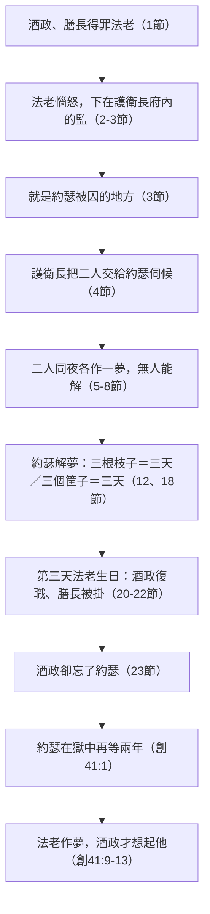

# 創世記 第40章

<!-- chapter-navigation:start -->
| [前一章](../01%20創世記/第39章.md) | [回目錄](../01%20創世記/全書目錄及綱要.md) | [下一章](../01%20創世記/第41章.md) |
| :--- | :---: | ---: |
<!-- chapter-navigation:end -->

1. 這事以後，[[酒政|埃及王的酒政]]和[[膳長]][[酒政和膳長得罪法老的具體原因|得罪]]了他們的主─埃及王，
2. [[法老]]就惱怒[[酒政]]和[[膳長]]這二臣，
3. 把他們下在[[護衛長波提乏|護衛長]]府內的[[監_監牢_坑|監]]裡，就是[[約瑟]]被囚的地方。
4. [[護衛長波提乏|護衛長]]把他們交給[[約瑟]]，約瑟便伺候他們；他們有些日子在監裡。
5. 被囚在監之[[酒政|埃及王的酒政]]和[[膳長]]二人同夜各做一夢，各夢都有講解。
6. 到了早晨，[[約瑟]]進到他們那裡，見他們有愁悶的樣子。
7. 他便問[[法老]]的二臣，就是與他同囚在他主人府裡的，說：你們今日為什麼面帶愁容呢？
8. 他們對他說：我們各人做了一夢，沒有人能解。[[約瑟]]說：[[解夢出於神|解夢不是出於神嗎？]]請你們將夢告訴我。
9. [[酒政]]便將他的夢告訴[[約瑟]]說：我夢見在我面前有一棵[[葡萄樹_葡萄_杯|葡萄樹]]，
10. 樹上有[[三根枝子]]，好像發了芽，開了花，上頭的[[葡萄樹_葡萄_杯|葡萄]]都成熟了。
11. [[法老]]的[[葡萄樹_葡萄_杯|杯]]在我手中，我就拿[[葡萄樹_葡萄_杯|葡萄]]擠在法老的杯裡，將杯遞在他手中。
12. [[約瑟]]對他說：你所做的夢是這樣解：[[三根枝子]]就是[[三天]]；
13. [[三天]]之內，[[法老]]必[[提你出監_抬起頭|提你出監]]，叫你官復原職，你仍要遞杯在法老的手中，和先前作他的[[酒政]]一樣。
14. 但你得好處的時候，求你記念我，施恩與我，在[[法老]]面前提說我，救我出這[[監_監牢_坑|監牢]]。
15. 我實在是從[[希伯來人之地]]被拐來的；我在這裡也沒有做過什麼，叫他們把我下在[[監_監牢_坑|監]]裡。
16. [[膳長]]見夢解得好，就對[[約瑟]]說：我在夢中見我頭上頂著[[三筐白餅]]；
17. 極上的筐子裡有為[[法老]]烤的各樣食物，有[[飛鳥吃食物_吃肉|飛鳥]]來吃我頭上筐子裡的食物。
18. [[約瑟]]說：你的夢是這樣解：[[三筐白餅|三個筐子]]就是[[三天]]；
19. [[三天]]之內，[[法老]]必[[斬斷你的頭_從你將你的頭抬起來|斬斷你的頭]]，把你掛在[[掛在木頭上_懸屍示眾|木頭]]上，必有[[飛鳥吃食物_吃肉|飛鳥]]來吃你身上的肉。
20. 到了第[[三天]]，是[[法老]]的[[生日筵席|生日]]，他為眾臣僕設擺筵席，把[[酒政]]和[[膳長]]提出監來，
21. 使[[酒政]]官復原職，他仍舊遞杯在[[法老]]手中；
22. 但把[[膳長]]掛起來，正如[[約瑟]]向他們所解的話。
23. [[酒政]]卻不記念[[約瑟]]，竟忘了他。

---

## 本章知識節點

### 主題
- [[解夢出於神]]
- [[神的主權與安排]]
- [[神的主權與人的責任]]
- [[試煉中的忠心事奉]]
- [[蒙恩與被遺忘]]
- [[救贖歷史的進程]]

### 歷史
- [[埃及宮廷職制_酒政_膳長]]
- [[埃及人的生日習俗_大赦]]
- [[古代近東解夢文學_夢經]]
- [[掛在木頭上_懸屍示眾]]
- [[生日筵席]]
- [[埃及監獄制度]]

### 原文
- [[酒政_cupbearer]]
- [[膳長_baker]]
- [[提你出監_抬起頭]]
- [[斬斷你的頭_從你將你的頭抬起來]]
- [[希伯來人_過河的人]]
- [[監_坑_地牢_dungeon]]
- [[三天]]
- [[三根枝子]]
- [[三筐白餅]]

### 互文
- [[酒政與主餐的杯]]
- [[葡萄樹與真葡萄樹_約15_1]]
- [[兩個囚犯與十字架上兩個強盜_路23_32_39-43]]
- [[被掛在木頭上與基督被掛在樹上_徒5_30_加3_13]]
- [[約瑟被遺忘與神不忘記_賽49_15-16]]
- [[約瑟受苦後高升與基督受苦後得榮耀_腓2_8-9]]
- [[膳長被掛木架預表基督受咒詛]]

### 解經爭議
- [[酒政和膳長得罪法老的具體原因]]
- [[護衛長是否仍為波提乏]]
- [[酒政忘記約瑟是人性還是神的安排]]
- [[司獄是否即護衛長]]

### 人物
- [[司獄]]
- [[王的囚犯]]

### 地點
- [[監獄（王的囚犯被囚之處）]]
- [[護衛長府_監]]

### 文化
- [[埃及人搬運物件頂在頭上]]

---

## 本章整理

約瑟因**自己的夢**被賣到埃及（創37），如今又因**別人的夢**走向新的局面——GT《聖經精讀本》正是這樣總結本章的位置。看似偶然的相遇（二臣入監、同夜作夢、法老生日大赦），實則是精密的安排：酒政的遺忘「正好成為約瑟謁見法老的背景」（參創41:9-13）。精讀本並推算：這時約瑟大概27歲，被賣到埃及已約10年（參創37:2）。

### 經文大綱

1. **酒政和膳長下監，約瑟伺候他們**（1-4節）
2. **二人同夜各作一夢，約瑟察知有異**（5-8節）
3. **約瑟為酒政解夢，並求他記念**（9-15節）
4. **約瑟為膳長解夢**（16-19節）
5. **二夢全然應驗，但酒政忘了約瑟**（20-23節）

### 一、在監中的忠心事奉（1-8節）

[[酒政]]（掌王的飲料，須先嘗以防下毒）與[[膳長]]（主理王的膳食）都是王的親信、宮廷高官（尼1:11可為旁證）。他們如何[[酒政和膳長得罪法老的具體原因|「得罪」法老]]，來源說法不一：GT 丁良才轉述「猶太的注釋家說」二人同謀要毒死法老，GT《靈修版聖經註釋》也說「也許他們二人同謀要殺害法老王」；CT 另記一種說法：「有謂膳長圖謀害王，酒政無辜被連累」，但「古時帝王喜怒無常，所謂『得罪』，不一定指他們作了不利於王的事」；GT《舊約背景註釋》最保留——謀反還是失職「已經無從得知」，「他們可能只是在控罪未曾調查清楚之前遭受軟禁而已」。

他們在監裡待了多久，來源也只能給範圍：CT 說「大約一個月以上，可能多達一年」，GT 丁良才則記下「猶太人以為是一年」。而護衛長把二人交給約瑟伺候這件事，GT《聖經精讀本》給了一個很實際的動機：他「可能考慮到如果不久之後他們官復原職，會對自己有利」——CT 另指出，二臣「由於他們是高官，故在獄中仍受人伺候」。

> [!quote] 人能囚禁約瑟的身體，卻不能囚禁他的服事
> KC：**約瑟沒有自怨自艾、沒有為自己所受的不公而苦毒，也沒有悖逆。**他「藉著照亮別人的命運來照亮自己的命運」——與其終日想著自己，不如服事那些與他同處困境的人（何況他是冤枉的，那兩人卻是罪有應得）。**這是不被苦境吞滅、不變苦毒的最好方法。**CT：「人能囚禁約瑟的身體，卻不能囚禁約瑟的服事。」

約瑟「進到他們那裡，**見他們有愁悶的樣子**」——CT 指出服事者的三個功課：①要先放下自己的愁苦，才能關心別人的愁苦；②要觀顏察色，設法瞭解別人內心的疾苦；③要對人表露關懷與同情。KC 反問：**我們是否也有一雙能讀出別人臉上需要的眼睛？別人會願意把他的憂慮告訴我們嗎？**GT《聖經精讀本》補上他們愁悶的緣由：因謀殺王的嫌疑被關進牢房，夜裡又作了不尋常的夢，「肯定令他們極為不安」。

他們說「沒有人能解」——GT《聖經精讀本》說明：當時埃及本有專門傳達神諭和解夢的術士、博士（參創41:8），兩位大臣「苦於在牢裡，無法見到他們」。第5節「各夢都有講解」一句，GT《串珠聖經註釋》認為應作「各夢都有不同的意思」——不是兩個夢共用一套解法，而是各有各的指向。

> [!note] 約瑟不查「夢經」，他直接求問神
> GT《舊約背景註釋》指出：古代埃及與巴比倫都編有「夢經」，解夢者須查考累積的經驗資料。**但約瑟持不同的立場——他沒有查考「科學」的文學，反而直接求問神。**「[[解夢出於神|解夢不是出於神嗎？]]」（8節）——STEP 語言資料顯示，「解夢／解釋」為 פִּתְרוֹן（H6623，名詞，源自動詞 פָּתַר H6622）；約瑟在此將解夢的主權直接歸於神，CT 解此句「意即只有神才能合宜並正確地解夢，暗示埃及的術士並不足信賴」，而約瑟藉此「自薦是與神親近的人，足可作神的代言人」。CT：**我們對人最大的幫助，乃是帶領人認識神。**丁良才更留意到：約瑟並沒有說「我因作夢吃了許多苦，夢是不可信的」，也沒有埋怨他的哥哥們、波提乏和他的妻子。

### 二、兩個夢，兩種結局（9-19節）

兩夢同夜、同數（[[三根枝子]]／[[三筐白餅]]，都是[[三天]]），結局卻截然相反：

|  | 酒政的夢 | 膳長的夢 |
|---|---|---|
| 夢境 | 葡萄樹三根枝子發芽、開花、結果，擠汁遞杯 | 頭頂三筐白餅，極上的筐子裡有為法老烤的食物 |
| 夢中情節 | 親手把葡萄汁擠在杯中、遞在法老手中 | 頭頂三筐食物，飛鳥來吃極上筐子裡的烤食 |
| 解 | 三天之內「法老必**提你出監**」 | 三天之內「法老必**斬斷你的頭**」 |
| 結局 | 官復原職 | 掛在木頭上，飛鳥吃他的肉 |

兩個夢都牢牢扣住作夢者每天在做的事。酒政夢見的是葡萄樹——GT《聖經精讀本》提醒這不是憑空的意象：「根據當年紀念碑的圖像和聖經的記載，當時埃及人種植葡萄並釀葡萄酒」（民20:5；詩78:47）。CT 更注意到第10節的一個細節：發芽、開花、結成葡萄、成熟這四個階段，「彼此之間在原文並沒有連接詞，表示這個發展是沒有停留的，瞬息完成轉變」——三天之內要發生的事，在夢中就是這樣一瞬間走完。膳長夢見的則是頭頂餅筐：CT 的背景註解說「古埃及人搬運物件，多頂在頭上；膳長大概也是頭頂餅筐，運送膳食給法老」，精讀本再補一層——「當時埃及男人用頭頂東西，女人會扛在肩上」（參創21:14）。

原文的巧妙正在解夢的用語上：STEP 原文資料顯示，約瑟對二臣的判語均使用動詞 נָשָׂא（H5375，抬起）加上「你的頭」（H7218）的相同片語；但第13節對酒政為「法老必抬起你的頭」（[[提你出監_抬起頭|提你出監]]／使你官復原職），第19節對膳長則多了一個介系詞片語（字面「從你身上」），形成「從你身上抬起你的頭」（[[斬斷你的頭_從你將你的頭抬起來|斬首示眾]]）的強烈雙關。GT《創世記雷氏研讀本》說得最直接：「這句話可有相反的意思。」精讀本則指出「提你」是希伯來人常用的表達方式，表示赦免和恢復職權（王下25:27；耶52:31）。CT 另留意到第11節與13節連介系詞都不同：酒政複述夢境時說「將杯遞在他手上」（on his hand），是埃及人的習慣說法；約瑟解夢時說「遞杯在法老的手中」（in his hand），則是希伯來人的說法。

[[葡萄樹_葡萄_杯|酒政夢中的葡萄樹與法老的杯]]、[[飛鳥吃食物_吃肉|膳長筐中被飛鳥吃盡的食物]]、[[掛在木頭上_懸屍示眾|掛屍木頭上的極刑]]，都各自預告了結局。KC 讀出更深的一層：**酒的夢說到死（葡萄被擠壓）**，使人想起主餐的杯——那杯說到主耶穌為信祂之人所流的血（林前11:23-26）；**餅的夢說到人的努力**（一個餅在烤成之前需要許多工序），而這努力被[[飛鳥吃食物_吃肉|飛鳥]]（惡者的象徵，啟18:2；參創15:11）吃盡了。**憑恩典懇求的得救，想靠自己的義站立的滅亡。**CT 則從被擠壓的葡萄看向讀者：「我們的天然必須被破碎、壓榨，才能流出生命，成為神和人的享受。」

> [!note] 兩個囚犯，一生一死
> CT 在第22節的靈意註解說：「兩個囚犯作夢三天之後，一個官復原職，另一個被處死，豫表和基督同釘在十字架上的兩個囚犯，在死牢中三日三夜之後，其中一個得救，另一個滅亡」（參路廿三32、39-43）；KC 也說十字架上兩個犯人的差別，「可以在與約瑟同囚的那兩個人身上看見」。

約瑟仍照實解說膳長的凶夢，並不隱瞞——CT：**傳道人須誠實講道，神的旨意不可有一樣是避諱不傳的**（徒20:27）。至於膳長的刑罰，精讀本說明那是一種極刑：死囚的屍體不能埋葬，而是掛在樹上，「增加對他的恥辱」（申21:21-22；書10:26）。

### 三、[[神的主權與人的責任|為什麼一個蒙恩，一個受審]]（20-22節）

KC 沒有繞開本章最硬的那個問題：酒政和膳長**同樣**得罪了法老（1節），為什麼一個被接納、一個被審判？他的回答不是給一個答案，而是拒絕把兩件事壓成一件：

> [!quote] 真理的兩面，只有神能連起來
> KC：「這裡我們碰到神主權的作為，是我們無法測透的……我們能看見這奧祕的唯一方法，就是記得這裡有真理的兩面：一面是神的揀選，另一面是人的責任。這兩面我們無法連起來，只有神能。我們必須讓兩面並排放著，不要試圖把它們接起來；我們若硬要接，就會落入異端。**我們不該狂妄到想在每一件事上都明白神。**我們若真信靠祂，就知道祂決不行不義。」

KC 隨即補上一句同樣要緊的限定，免得這段話被讀成宿命：**神並沒有預定那些人沉淪**；滅亡的人是因為自己不肯照著神的呼召悔改（參太23:37；徒17:30）。而在祂憐憫中被揀選的人，所該有的反應是感謝與希奇——「因為就我們自己而言，我們並不比別人好」。

### 四、「求你記念我」（14-15節）

約瑟求酒政「記念我……救我出這[[監_監牢_坑|監牢]]」。STEP 可確認第14節約瑟求酒政「記念我」使用動詞字根 זָכַר（H2142，Qal 完成式帶祈願義）；「施恩」使用 חֶסֶד（H2617A，本節 context gloss 為「loyalty」、基本義域包含 kindness）；BH 再進一步從其聖經語義指出，約瑟所求的不只是一個順手的人情，而是盟約中忠實不變的愛與守信到底的相待。他自述「我實在是從[[希伯來人之地]]被拐來的」：STEP 形態學顯示「被拐來」原文為 גֻנֹּב גֻּנַּבְתִּי（字根 גָּנַב，H1589，Pual 絕對不定詞加上 Pual 完成式疊用），是典型的強調結構，意為「我的確是被拐來的／確確實實被偷來的」；GT《串珠聖經註釋》說第15節的「拐」原作「綁架」，正指哥哥們出賣他一事；精讀本則說明「希伯來人」字面意思是「過來的人」，以色列人向別族介紹自己時用它（創43:32；拿1:9），別族稱呼以色列人時也用它（出2:6）——約瑟這樣自報身分，是因他沒有忘記自己是亞伯拉罕的後裔、立約的百姓。丁良才另提一種讀法：約瑟不說迦南地，「大概因為他輕看那些拜偶像的迦南人，不願意被人看作迦南人」。

CT 有三點細膩的觀察：

- 約瑟在14-15節連用七個「我」字——**表明他此時還沒有學好向己死的功課，所以他還不能出監，仍須等候。**
- 但他只陳述自己的景況，**並未明指被弟兄們出賣、被主母誣告之事**——「當我們為自己表白時，要儘可能避免提到別人的壞處。」
- 他所求的只是「救我出這監牢」——**只求能過正常的生活，不求地位、不求報復伸冤**；正是這樣存心正確的人，神才為他成就超過所求所想的（創41:39-45；弗3:20）。

### 五、酒政忘了他——但神沒有忘記（20-23節）

第三天是[[生日筵席|法老的生日]]。CT 說明這是古代帝王的慣例：「常會舉行盛大宴會，並施行大赦，釋放囚犯」；精讀本則點出這一天的兩面——囚犯「或得到王的赦免、或被斬首」；BH 另注意到一個小事實：聖經提到法老的生日，僅此一處。一切全如約瑟所解。**「酒政卻不記念約瑟，竟忘了他。」**

STEP 可確認第14節與第23節都使用動詞字根 זָכַר（H2142），第23節另接 שָׁכַח（H7911，「忘記」），形成明顯的詞彙對照。結合本章結尾與後續敘事，CT／丁良才等註釋進一步從中看見「人雖忘記約瑟，神的安排卻沒有停止」。

> [!quote] 人忘記，神不忘記
> 丁良才：「這正是『吃了果子忘了樹』，把約瑟當作敲門磚。」但他隨即指出另一面：**假若酒政為約瑟求情、使他早已出監，當法老作夢的時候，或者就尋不著約瑟了。**CT 同樣說，酒政此時倘若沒忘記約瑟而設法為他求情，「後來恐就沒有為法老解夢的機會」，並收在一句話上：「人的記念或不記念，都是出於神。」KC 在此節沒有討論這一面，他把問題轉向讀者。
>
> 「婦人焉能忘記她吃奶的嬰孩……即或有忘記的，我卻不忘記你」（賽49:15-16）。

約瑟又在獄中多留了兩年（創41:1）——GT《創世記雷氏研讀本》：「兩年以來，酒政一直把約瑟忘記，但神卻沒有忘記他」；精讀本則稱這是「神對心愛的孩子進行最後的試煉」（詩27:10；賽49:14-16）。GT《串珠聖經註釋》在思想問題中另記下一種讀法：宗教改革家加爾文認為，神遲遲不讓約瑟回復自由，目的是要考驗他的耐性。

KC 把這根刺轉向讀者：**約瑟說「求你記念我」，酒政卻忘了他。我們的生命中豈不常是如此？我們多少次沒有想起主耶穌？**祂也曾說「你們應當如此行，為的是記念我」（林前11:23-26）——**當我們擘餅、喝杯、傳揚祂的死時，心思是否真的在祂身上？**

### 本章的因果鏈：一場看似意外的相遇

把本章的環節排成一條線，就看得出精讀本所說的「神在人類歷史中等待預定的場所和境況」是什麼意思——每一步單獨看都是意外，連起來卻只通向一個出口：

丁良才把這條鏈收成一句要訓：「萬事都是與愛神的人有益處（羅八28）——約瑟在監內服侍膳長和酒政，正是一個機會，得以略知法老的性情和宮裡的事」；CT 也說：「凡臨到我們身上的事情，無論大小禍福，都與我們有益處。」精讀本則把應用留給讀者：**聖徒決不要因所願遲遲不成而灰心**（詩37:7；路21:19；羅12:12；來10:36）。

### 互文豫表

- 酒政擠葡萄汁遞杯 → 主餐的杯，基督的寶血（KC、BH）
- 葡萄樹與枝子 → 真葡萄樹（約15:1），常住結果子（CT、BH）
- 兩囚犯一生一死 → 十字架上的兩個犯人（路23:32、39-43）（CT、KC）
- 膳長被掛木頭 → 基督被掛在木頭上（徒5:30；加3:13）（BH）
- 約瑟被遺忘 → 神不忘記祂的兒女（賽49:15-16）（CT、GT）
- 約瑟受苦後高升 → 基督受苦後得榮耀（腓2:8-9）（BH）

### 背景補充：解夢是一門專業，而約瑟不用它

GT《舊約背景註釋》在第5至18節下的說明，是理解本章最要緊的一段背景。當時解夢「通常是由受過當代解夢文學訓練的專家執行」，埃及人和巴比倫人都編纂了所謂的「夢經」，經中記載夢的範例與圓解的關鍵；由於夢通常以象徵表達，解夢者必須能夠查考以往累積的經驗數據。而背景註釋點出當時人一個關鍵的信念：他們相信神明透過夢與人溝通，「但卻不相信他們會啟示夢的含義」——因為若神有意直接啟示含義，「哪裡還用得著夢」。

約瑟的立場正好相反。背景註釋說得明白：「他沒有查考『科學』的文學，反而直接求問神。」第8節那句「解夢不是出於神嗎」因此不是謙辭——CT 說它「暗示埃及的術士並不足信賴」，也就是把整個行業的前提整個翻過來。

但背景註釋同時作了一個誠實的補充：約瑟「詮釋的方向依然與某些解夢文學所建議的相同」——和美索不達米亞的文學一樣，他也利用夢中出現的數字來斷定時間的指標，而夢中的象徵亦與夢書中的部分例子相似（例如杯滿表示得到名譽和後裔，在頭上攜帶水果表示哀痛）。換句話說，約瑟用的是當時人共通的象徵語言，來源卻不是那套典籍——方法上相似，根據上不同。

### 背景補充：兩位囚犯、罪名與刑罰

**得罪法老的緣由**：背景註釋坦承無從得知——這兩人究竟有謀反之嫌，還是在日常職務的執行上冒犯了法老，都已無法查證；「他們可能只是在控罪未曾調查清楚之前遭受軟禁而已」。第1節只說「得罪了他們的主」，經文刻意沒有給罪名。精讀本對這份沉默另有解釋：聖經對大臣的罪狀、被囚的經過都沒有記載，「因聖經只記錄與神的應許及救贖有關的人物和事件」。

**酒政的地位**：背景註釋指酒政是[[埃及]]王室中地位很高的一員（尼一11），而這人「應當備受信任，因為他的主要責任是親嚐君主的飲食，免得君主受人毒害」。這既說明他為何有機會在日後直接向法老進言（創四十一9），也說明他被下監這件事本身有多嚴重——法老最貼身的防毒關卡出了問題。串珠註釋則從另一頭看同一件事：正因為美酒佳餚可以被人下毒謀害法老，這兩個職位「必定由法老自己的親信出任，他們在政治上具有莫大的影響力」。

**膳長的刑罰**：背景註釋說明第22節的處置在當時的作法：人被處死後，使其屍體蒙羞的法子之一是將之懸掛（書八29；撒下四12），「可能是綁著頸項吊起來，也可能是刺在杆子上」，而處死的方法若非用石頭打死，就是砍頭。經文的「掛在木頭上」是死後示眾，不是處決方式本身——這一點在讀第19節「把你掛在木頭上，必有飛鳥來吃你身上的肉」時尤其要緊。BH 補充：在古代近東，不得安葬本身就是奇恥大辱（撒上17:44；啟19:17-18）。

**參考資料**
https://biblehub.com/study/genesis/40.htm
https://www.kingcomments.com/en/bible-studies/Gen/40
https://www.ccbiblestudy.org/Old%20Testament/01Gen/01CT40.htm
https://www.ccbiblestudy.org/Old%20Testament/01Gen/01GT40.htm
https://github.com/STEPBible/STEPBible-Data

<!-- appendix-links:start -->
## 附錄

### 相關地圖
- [[appendix/fhl_maps/maps/008|〈創圖三〉族長們於迦南地以外的活動]]
- [[appendix/fhl_maps/maps/015|〈創圖十〉雅各的生平]]
- [[appendix/fhl_maps/maps/016|〈創圖十一〉猶大和約瑟的生平]]
<!-- appendix-links:end -->

<!-- chapter-navigation:start -->
| [前一章](../01%20創世記/第39章.md) | [回目錄](../01%20創世記/全書目錄及綱要.md) | [下一章](../01%20創世記/第41章.md) |
| :--- | :---: | ---: |
<!-- chapter-navigation:end -->
