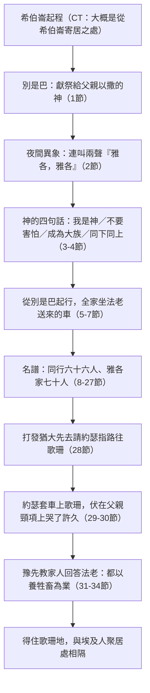

# 創世記 第46章

<!-- chapter-navigation:start -->
| [前一章](第45章.md) | [回目錄](全書目錄及綱要.md) | [下一章](第47章.md) |
| :--- | :---: | ---: |
<!-- chapter-navigation:end -->

1. [[雅各|以色列]]帶著一切所有的，起身來到[[別是巴]]，就獻祭給[[亞伯拉罕之約|他父親以撒的神]]。
2. 夜間，神在異象中對[[雅各|以色列]]說：[[雅各]]！雅各！他說：我在這裡。
3. 神說：我是神，就是你父親的神。你下[[埃及]]去不要害怕，因為我必使你在那裡[[亞伯拉罕之約|成為大族]]。
4. [[神的護理|我要和你同下埃及去，也必定帶你上來]]；[[約瑟]]必給你送終【原文作將手按在你的眼睛上】。
5. [[雅各]]就從[[別是巴]]起行。[[雅各|以色列]]的兒子們使他們的父親雅各和他們的妻子、兒女都坐在[[埃及車輛與遷徙|法老為雅各送來的車上]]。
6. 他們又帶著[[迦南地]]所得的牲畜、貨財來到[[埃及]]。[[雅各]]和他的一切子孫都一同來了，
7. [[雅各]]把他的兒子、孫子、女兒、孫女，並他的子子孫孫，一同帶到[[埃及]]。
8. [[十二支派起源|來到埃及的以色列人]]名字記在下面。[[雅各]]和他的兒孫：雅各的長子是流便。
9. 流便的兒子是哈諾、法路、希斯倫、迦米。
10. 西緬的兒子是耶母利、雅憫、阿轄、雅斤、瑣轄，還有迦南女子所生的掃羅。
11. 利未的兒子是革順、哥轄、米拉利。
12. 猶大的兒子是珥，俄南、示拉、法勒斯、謝拉；惟有珥與俄南死在[[迦南地]]。法勒斯的兒子是希斯倫、哈母勒。
13. 以薩迦的兒子是陀拉、普瓦、約伯、伸崙。
14. 西布倫的兒子是西烈、以倫、雅利。
15. 這是利亞在巴旦亞蘭給[[雅各]]所生的兒子，還有女兒底拿。兒孫共三十三人。
16. 迦得的兒子是洗非芸、哈基、書尼、以斯本、以利、亞羅底、亞列利。
17. 亞設的兒子是音拿、亦施瓦、亦施韋、比利亞，還有他們的妹子西拉。比利亞的兒子是希別、瑪結。
18. 這是拉班給他女兒利亞的婢女悉帕從[[雅各]]所生的兒孫，共有十六人。
19. [[雅各]]之妻拉結的兒子是[[約瑟]]和便雅憫。
20. [[約瑟]]在[[埃及]]地生了瑪拿西和以法蓮，就是安城的祭司波提非拉的女兒亞西納給約瑟生的。
21. 便雅憫的兒子是比拉、比結、亞實別、基拉、乃幔、以希、羅實、母平、戶平、亞勒。
22. 這是拉結給[[雅各]]所生的兒孫，共有十四人。
23. 但的兒子是戶伸。
24. 拿弗他利的兒子是雅薛、沽尼、耶色、示冷。
25. 這是拉班給他女兒拉結的婢女辟拉從[[雅各]]所生的兒孫，共有七人。
26. 那與[[雅各]]同到[[埃及]]的，除了他兒婦之外，凡從他所生的，共有[[雅各家七十人與七十五人|六十六人]]。
27. 還有[[約瑟]]在[[埃及]]所生的兩個兒子。[[雅各]]家來到埃及的共有[[雅各家七十人與七十五人|七十人]]。
28. [[雅各]]打發[[猶大（雅各之子）|猶大]]先去見[[約瑟]]，請派人引路往[[歌珊地|歌珊]]去；於是他們來到[[歌珊地]]。
29. [[約瑟]]套車往[[歌珊地|歌珊]]去，迎接他父親[[雅各|以色列]]，及至見了面，就伏在父親的頸項，哭了許久。
30. [[雅各|以色列]]對[[約瑟]]說：我既得見你的面，知道你還在，就是死我也甘心。
31. [[約瑟]]對他的弟兄和他父的全家說：我要上去告訴[[法老]]，對他說：我的弟兄和我父的全家從前在[[迦南地]]，現今都到我這裡來了。
32. 他們本是[[埃及人厭惡牧羊人|牧羊的人]]，以養牲畜為業；他們把羊群牛群和一切所有的都帶來了。
33. 等[[法老]]召你們的時候，問你們說：你們以何事為業？
34. 你們要說：你的僕人，從幼年直到如今，都以養牲畜為業，連我們的祖宗也都以此為業。這樣，你們可以住在[[歌珊地]]，因為[[埃及人厭惡牧羊人|凡牧羊的都被埃及人所厭惡]]。

---

## 本章知識節點

### 人物
- [[雅各]]
- [[約瑟]]
- [[猶大（雅各之子）]]
- [[法老]]

### 地點
- [[別是巴]]
- [[埃及]]
- [[迦南地]]
- [[歌珊地]]

### 神學
- [[神的護理]]
- [[亞伯拉罕之約]]
- [[十二支派起源]]

### 歷史
- [[埃及車輛與遷徙]]
- [[雅各家七十人與七十五人]]
- [[埃及人厭惡牧羊人]]
- [[埃及人視希伯來人為不潔淨]]
- [[喜克索王朝（Hyksos）背景]]

---

## 本章整理

雅各終於動身了。但他走到迦南的南界[[別是巴]]就停下來獻祭。要離開應許之地的人，先回到自己信仰的起點求問——第1節的地點選擇本身就是全章的樞紐。

### 經文大綱

1. **別是巴獻祭，神在夜間異象中應許**（1-4節）
2. **全家帶著牲畜貨財下埃及**（5-7節）
3. **隨雅各下埃及的名譜**（8-27節）
4. **父子在歌珊重逢**（28-30節）
5. **約瑟豫先策劃，使家人得住歌珊**（31-34節）

### 一、他為什麼要在別是巴獻祭？（1-4節）

「別是巴」意為「**盟誓之井**」——**這名字本身就叫人想起神的應許**（KC）。這裡是亞伯拉罕求告耶和華永生神之處（21:33），也是以撒築壇之處（26:25）。

> [!note] 雅各的躊躇是有理由的
> GT 丁良才列出他猶疑的五個緣故：①**亞伯拉罕下埃及曾冒大險**（12:10）；②**神曾明明禁止以撒下埃及**（26:2）；③**神應許把迦南地賜給他們和他們的後裔**；④**埃及是一個熱心拜偶像的國度**；⑤或許他也想起創15:13 那個「你的後裔必寄居別人的地」的預言。
>
> CT 注意到原文：**本節的「獻祭」是複數詞，表示他這個獻祭並不簡單，而是持續的獻上祭物，直到使神滿足為止**；並判斷「**或許雅各怕自己下埃及會錯，所以他藉此向神求問**」。KC：**在離開這地以前，他要先尊榮神；他彷彿是說：若沒有神與他同去的確據，他就不肯再往前一步。**

神在夜間的異象中回答他，並且連叫兩聲「雅各！雅各！」（如同「亞伯拉罕！亞伯拉罕！」創22:11、「摩西！摩西！」出3:4——**每一次都在極重大的時刻**，BH）。神說了四件事：

| 神的話 | 意義 |
|---|---|
| 「我是神，就是你父親的神」 | CT：**「我是神」表明祂負一切的責任；「你父親的神」表明祂必成就向以撒所作的應許** |
| 「你下埃及去**不要害怕**」 | CT：**這證明雅各那時心中躕躇、畏懼** |
| 「我必使你在那裡**成為大族**」 | GT《創世記雷氏研讀本》：耶和華要在埃及使他們從一個支派氏族擴展至一個大國（比較出1:7） |
| 「**我要和你同下埃及去，也必定帶你上來**」 | 見下 |

> [!quote] 「也必定帶你上來」——這個「你」指誰？
> 各家給的答案並不相同。CT 說得最斬釘截鐵：此處「你」字**乃集合代名詞，並非指雅各個人，乃指他的全體後裔**；GT《串珠聖經註釋》同樣說「你」指雅各的後代，雅各乃是他們的代表。GT《聖經精讀本》則把兩面都算進去：**神從兩個方面成就了這約——雅各的骸骨將送回迦南地埋葬（50:13），以及雅各的後裔出埃及、征服迦南地。**
>
> GT 賈斯樂郝威《聖經難解經文詮釋手冊》把「雅各終究死在埃及」列為一道難題（命題57），並給三種解答：①這個應許是針對雅各的後裔說的；②雅各可能經由約瑟而被帶出埃及，雖然他那時不是活著的（50:25；出13:19）；③雅各復活後將會回到應許之地（太8:11）。
>
> 而「約瑟必給你送終」原文直譯是「**將手按在你的眼睛上**」——**為你闔上雙眼**；CT 說這裡的「你」是個人代名詞，暗示**雅各將至死和約瑟相離不遠**（50:1）。
>
> KC 另注意到神在此自稱「**你父親以撒的神**」：**這叫我們想起祂是復活的神。雅各是站在復活的根基、新生命的地位上往前走的。**

這段話不是一次孤立的顯現。GT《聖經精讀本》把它接回[[亞伯拉罕之約|神與族長所立的約]]：本章的移居**成就了火把之約（15:13-17）「要成了外邦人」的預言，也是出埃及事件的前奏**，並列出雅各家族移居埃及的四重意義——**在迦南各族中保持純潔性；從雅各家族轉變成以色列「國家」；選民經歷許多的苦難和試煉；通過將來的出埃及事件，體現救贖的意義。**精讀本並把時間標了出來：這是**亞伯拉罕蒙召215年之後，雅各130歲**。

GT 丁良才則從地理與目的兩面解釋神為何要他們下去：**埃及是最合式以色列人居住的國度，因為那裡有許多草地足供他們作牧場**；而神的用意有四——**要使雅各的後裔聯合為一；要使以色列人和拜偶像的人少有來往；要使他們多吸收埃及的文化；要使他們因受磨煉而越發親近神。**

### 二、名譜與那些數目（8-27節）

名單按**四位母親**分四組：

| 母親 | 節 | 人數 |
|---|---|---|
| 利亞（並女兒底拿） | 8-15 | 三十三人 |
| 悉帕（利亞的婢女） | 16-18 | 十六人 |
| 拉結 | 19-22 | 十四人 |
| 辟拉（拉結的婢女） | 23-25 | 七人 |
| **合計** | | **七十人** |

第26節說「那與雅各同到埃及的，除了他兒婦之外，凡從他所生的，共有[[雅各家七十人與七十五人|六十六人]]」；第27節說「雅各家來到埃及的共有**七十人**」。CT 與 GT 丁良才的算法一致：

- 四組合計七十人；
- 減去**已死在迦南的珥與俄南**、以及**已經在埃及的約瑟、瑪拿西、以法蓮**，再加上未計入 15 節的**女兒底拿**——恰好**六十六人**（同行者）；
- 六十六人再加上**雅各本人、約瑟、瑪拿西、以法蓮**——恰好**七十人**（雅各家）。

> [!note] 那麼徒7:14 的「七十五人」呢？
> KC 說得直接：**兩個數字都對。**司提反（或路加）**根據的是七十士譯本（LXX）**；七十士譯本在第20節之後**增列了五個名字**——瑪拿西的一子一孫、以法蓮的二子一孫（參民26:28-37；代上7:14-20）。GT 李道生《舊約聖經問題總解》數的方式略有出入：他記為瑪拿西的一個兒子瑪姬和一個孫子基列，並以法蓮的三個兒子書提拉、比結、他罕。GT《聖經精讀本》則不從名單增列著眼，說七十五人是「**七十人加上日後形成獨立家業的約瑟五個後代**」（50:23）。倪柝聲另提一解：徒7:14 的「全家」原文是「親族」，範圍較廣。
>
> 同一個「七十」，三家讀出三種意思：CT 說「七十」在聖經裡是「**今世完全**」的數目（但9:24；太18:22）；GT《聖經精讀本》拆成兩個因數——「**7**」有關神的救贖、「**10**」有關人類完全發展；KC 則從六十六那一頭看：**六是人的數字，人總是不及格，永遠達不到七所說的完全；當約瑟（主耶穌的圖畫）與他的兒子被加進來，六十六的不完全就變成了七十的完全。**

名單中兩個女性的出現（**女兒底拿**、**孫女西拉**）並不尋常——CT 的背景註解說，猶太人一般都只計算男丁人數（太14:21；15:38），但遇有特殊含意的事例時也往往提到女性（太1:3、5-6；徒1:13-14）。CT 坦承這個算法有矛盾：15節不算底拿，18節卻算西拉；而雅各有那麼多男孫，不可能只有一個女孫——聖經本身未作解釋，只能猜測是為27節的「七十人」豫作安排。GT 丁良才的推測不同：**底拿和西拉被提名，或者是因為她們沒有出嫁而且出名，雅各其餘的女兒和孫女大概都出了嫁。**

這份名單也是[[十二支派起源|十二支派名單]]的起點。GT 賈斯樂郝威在命題58 把本章、民數記26章與啟示錄7章三份名單並排，處理「以色列到底是十二支族還是十四支族」：雅各只有十二個兒子，但約瑟得了雙分（48:22），民26 以瑪拿西和以法蓮取代約瑟支派；利未因職事是祭司、不得分地，散住在各支派的四十八座利未城裡；啟7 的名單則除去但支派、列入利未——每一份名單的作者都設法保住「十二」這個數目。

### 三、二十二年後的重逢（28-30節）

雅各**打發[[猶大（雅各之子）|猶大]]先去**引路。CT：**由此可見猶大在雅各和約瑟心目中的地位**；GT《聖經精讀本》把原因說得更具體：**看來猶大借著第二次埃及之行的言行（44:18-34），得到雅各的信任。猶大作為家族的全權代表，這件事意味深長，日後猶大家族成為以色列支派中繼承王權的家族（49:10）。**BH 由此讀到更遠：這一幕預告了猶大支派的地位，大衛與「猶大支派中的獅子」（啟5:5）都由他而出。

「[[約瑟]]套車往[[歌珊地|歌珊]]去，迎接他父親以色列；及至見了面，就伏在父親的頸項上，**哭了許久**」——CT 數過，**這是約瑟第四次哭，而且一次比一次久**（42:24；43:30；45:2、14-15）。GT《聖經精讀本》把時間補上：這是**父子在希伯崙分手後，過了二十二年又相逢**的場面，「不需更多的言語，只有深沉長久的哭聲才能傳達相逢的喜樂」。KC：**雅各渴望再見約瑟，約瑟也渴望再見父親——他上去迎接他。當我們往主那裡去的時候，我們會發現：祂也正在路上迎向我們。**

> [!quote] 「就是死我也甘心」
> KC：**雅各所說的，叫我們想起西面抱著嬰孩耶穌時所說的話**（路2:25-30）。CT：**世人是「朝聞道，夕死可也」；我們信徒是「若得親眼看見救恩，也可安然去世」。**GT《聖經精讀本》讀出這句話的背面：**看來在見到約瑟之前，雅各內心肯定深藏約瑟之死留下的遺恨。**
>
> KC 也提醒我們看約瑟的舉止：**他作為兒子，如何尊榮他的父親。兒女孝敬父母是本分（弗6:1-3），即使兒女的社會地位遠高於父母，這本分也不改變。**——不過雅各實際上還要在埃及活十七年（47:28）。

### 四、為什麼是歌珊？（31-34節）

[[法老]]會問一個問題：「你們以何事為業？」KC 注意到，**這似乎是法老慣常會問來見他之人的問題**，所以約瑟豫先教家人怎麼回答：「你的僕人，從幼年直到如今，都以**養牲畜**為業。」CT 說這是他**為父家的將來，豫先策劃應對之道**。

歌珊地的好處，GT 丁良才數了五樣：**①地土肥美；②草地很多（他們多牧羊）；③離迦南地近（後來出埃及的時候就便當）；④離埃及人略遠（不惹埃及人的怒）；⑤離約瑟的住處近。**CT 的背景註解則說明它的位置：歌珊「位於尼羅河出海的三角洲地帶，土地肥沃，是全埃及最好的畜牧用地」，且「該地自處一隅，易於和埃及人隔離；且距迦南地不遠，可謂是由埃及進入迦南地的大門口」。

而那句「[[埃及人厭惡牧羊人|因為凡牧羊的都被埃及人所厭惡]]」，各家提出的原因不一：

| 提出者 | 原因 |
|---|---|
| GT《聖經精讀本》 | 傳統上以農業為主，對其他行業有排斥心理；認為牧人沒有教養、非常野蠻；曾被遊牧民攻擊過的被害意識；對牧人殺害他們認為神聖的動物產生輕蔑感 |
| GT《啟導本聖經創世記註釋》 | 埃及以農立國，法老時代已有高度文明，看不起粗陋的遊牧生活 |
| BH | 埃及主要是農耕社會，其宗教實踐又常涉及對動物的崇拜，這可能助長了對飼養牲畜者的反感 |
| GT《舊約背景註釋》 | 提出限定：埃及**本地**的牧羊人大概不會被其他埃及人恨惡；約瑟的忠告另有外交作用 |

精讀本並記下一個具體的線索：**「從埃及發掘的石碑上，牧羊人又瘦又高、飽經風霜，像病人一樣憔悴，甚至有的像幽靈。可能因這些緣故，埃及人厭惡牧羊人。」**經文本身只陳述「厭惡」這個事實，沒有指定單一原因。

> [!note] 為什麼這個策略行得通
> CT 的背景註解指出當時[[喜克索王朝（Hyksos）背景|治理埃及的王朝]]的來歷：「**當時治理埃及的喜克索王朝，乃外來的牧羊民族，人稱其王為『牧羊王』。**」GT《靈修版聖經註釋》據此把約瑟的算計說明白：「**因為法老的祖先很可能是許克所斯人的遊牧民族，所以他或許會同情牧人，而埃及人絕不歡迎牧人住在他們中間。約瑟的策略奏效，雅各一家從法老的慷慨乃至埃及人所抱的成見中受益。**」

> [!note] 被世界厭惡，反而成了保護
> CT：**約瑟如此安排父家的住處，除了為日後全族出埃及豫作打算，用意更在使他們避免和埃及人混雜來往，不至於隨從埃及人的惡俗。**GT《聖經精讀本》說得更直接：**神甚至可以利用埃及人的這種風俗，提供環境，使自己的百姓活出分別為聖的生活。**KC 說得更透：**因著埃及人的厭惡，雅各家被分派到埃及地的一隅——這就攔阻了他們與埃及人混合。若與埃及人相混，他們就會失去自己的身分；如今他們仍分別出來，保住了民族與信仰的獨立。**
>
> 而 KC 把它翻轉成一句刺人的話：**埃及人是世界的圖畫。對世界上的人來說，一個為神的榮耀而活的基督徒，正是「可厭惡的」。**

### 關鍵神學點

1. **[[神的護理]]**：「我要和你同下埃及去，也必定帶你上來」——這是全章的軸心；下[[埃及]]不是離棄應許，而是應許的一段路（創15:13）。
2. **[[雅各家七十人與七十五人]]**：六十六／七十／七十五三個數字各有其計算範圍與文本傳統。
3. **[[埃及人厭惡牧羊人]]**：一個看似不利的偏見，反而成了選民保持分別的屏障。
4. **獻祭與求問**：[[雅各]]在動身以前先停下來獻祭求問——**信心的行動，是從祭壇開始的。**

### 背景補充：別是巴的獻祭、馬車與牧羊人的處境

GT《舊約背景註釋》為本章三處各補一條。

**在別是巴獻祭有多罕見**：背景註釋指出「眾族長雖然多次築壇，聖經卻很少有他們獻祭的記錄」——在此以前唯一提過的一次，是雅各和拉班立約之時（創31:54）；以撒曾經在別是巴築壇（創26:25），但沒有在此獻祭的記錄。它並說明雅各為何選在這裡停下：他是乘南行之便到此朝聖，因為「這是他長大之處，也是他父親崇拜之聖所的所在地」。

**約瑟乘的馬車**：背景註釋指這個時代的埃及馬車是輕型的，材料是木和皮革，車輪只有兩輻；而法老所乘坐的華麗馬車（高官大臣無疑也有分）要到稍後的新王國時代才一再在藝術中出現。第29節「約瑟套車往歌珊去」用的是當時實際存在的輕便車制。至於第5節載雅各與婦孺下埃及的[[埃及車輛與遷徙|那批車輛]]，BH 指出車輛在當時是一種奢侈品，法老送車既反映約瑟在埃及的地位，也是給雅各的尊榮。

**牧羊人為何被厭惡**：背景註釋提出一個重要的修正——「埃及本地的牧羊人大概不會被其他埃及人恨惡」。因此約瑟給父親的忠告（第34節要他們自稱是牧養牲畜的人）另有作用：一方面警告他埃及人有排外態度，另一方面表示自己一家能夠獨立自足（羊群足以供應所需），並且顯出他們「沒有野心要擺脫放牧生涯以從事其他行業」——背景註釋稱這「也是外交上的手段」。

**參考資料**
https://biblehub.com/study/genesis/46.htm
https://www.kingcomments.com/en/bible-studies/Gen/46
https://www.ccbiblestudy.org/Old%20Testament/01Gen/01CT46.htm
https://www.ccbiblestudy.org/Old%20Testament/01Gen/01GT46.htm

<!-- appendix-links:start -->
## 附錄

### 相關地圖
- [[appendix/fhl_maps/maps/008|〈創圖三〉族長們於迦南地以外的活動]]
- [[appendix/fhl_maps/maps/015|〈創圖十〉雅各的生平]]
- [[appendix/fhl_maps/maps/016|〈創圖十一〉猶大和約瑟的生平]]
- [[appendix/fhl_maps/maps/017|〈創圖十二〉古埃及全圖]]
<!-- appendix-links:end -->

<!-- chapter-navigation:start -->
| [前一章](第45章.md) | [回目錄](全書目錄及綱要.md) | [下一章](第47章.md) |
| :--- | :---: | ---: |
<!-- chapter-navigation:end -->
