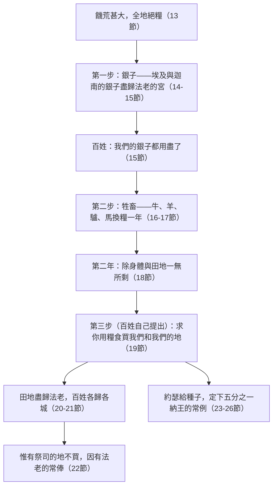

# 創世記 第47章

<!-- chapter-navigation:start -->
| [前一章](第46章.md) | [回目錄](全書目錄及綱要.md) | [下一章](第48章.md) |
| :--- | :---: | ---: |
<!-- chapter-navigation:end -->

1. [[約瑟]]進去告訴[[法老]]說：我的父親和我的弟兄帶著羊群牛群，並一切所有的，從[[迦南地]]來了，如今在[[歌珊地]]。
2. [[約瑟]]從他弟兄中挑出五個人來，引他們去見[[法老]]。
3. [[法老]]問[[約瑟]]的弟兄說：你們以何事為業？他們對法老說：你僕人是牧羊的，連我們的祖宗也是牧羊的。
4. 他們又對[[法老]]說：[[迦南地]]的饑荒甚大，僕人的羊群沒有草吃，所以我們來到這地[[寄居身分|寄居]]。現在求你容僕人住在[[歌珊地]]。
5. [[法老]]對[[約瑟]]說：你父親和你弟兄到你這裡來了，
6. [[埃及]]地都在你面前，只管叫你父親和你弟兄住在國中最好的地；他們可以住在[[歌珊地]]。你若知道他們中間有什麼能人，就派他們看管我的牲畜。
7. [[約瑟]]領他父親[[雅各]]進到[[法老]]面前，雅各就給法老祝福。
8. [[法老]]問[[雅各]]說：你平生的年日是多少呢？
9. [[雅各]]對[[法老]]說：我[[寄居身分|寄居在世]]的年日是一百三十歲，我平生的年日又少又苦，不及我列祖在世寄居的年日。
10. [[雅各]]又給[[法老]]祝福，就從法老面前出去了。
11. [[約瑟]]遵著[[法老]]的命，把[[埃及]]國最好的地，就是[[蘭塞|蘭塞境內的地]]，給他父親和弟兄居住，作為產業。
12. [[約瑟]]用糧食奉養他父親和他弟兄，並他父親全家的眷屬，都是照各家的人口奉養他們。
13. 饑荒甚大，全地都絕了糧，甚至[[埃及]]地和[[迦南地]]的人因那饑荒的緣故都餓昏了。
14. [[約瑟]]收聚了[[埃及]]地和[[迦南地]]所有的銀子，就是眾人糴糧的銀子，約瑟就把那銀子帶到[[法老]]的宮裡。
15. [[埃及]]地和[[迦南地]]的銀子都花盡了，埃及眾人都來見[[約瑟]]，說：我們的銀子都用盡了，求你給我們糧食，我們為什麼死在你面前呢？
16. [[約瑟]]說：若是銀子用盡了，可以把你們的牲畜給我，我就為你們的牲畜給你們糧食。
17. 於是他們把牲畜趕到[[約瑟]]那裡，約瑟就拿糧食換了他們的牛、羊、驢、馬；那一年因換他們一切的牲畜，就用糧食養活他們。
18. 那一年過去，第二年他們又來見[[約瑟]]，說：我們不瞞我主，我們的銀子都花盡了，牲畜也都歸了我主。我們在我主眼前，除了我們的身體和田地之外，一無所剩。
19. 你何忍見我們人死地荒呢？求你用糧食買我們和我們的地，我們和我們的地就要給[[法老]]效力。又求你給我們種子，使我們得以存活，不致死亡，地土也不致荒涼。
20. 於是，[[約瑟的饑荒土地政策|約瑟為法老買了埃及所有的地]]，埃及人因被饑荒所迫，各都賣了自己的田地；那地就都歸了法老。
21. 至於百姓，[[約瑟]]叫他們，從[[埃及]]這邊直到埃及那邊，[[各歸各城或使民為奴|都各歸各城]]。
22. 惟有祭司的地，[[約瑟]]沒有買，因為祭司有從[[法老]]所得的常俸。他們吃法老所給的常俸，所以他們不賣自己的地。
23. [[約瑟]]對百姓說：我今日為[[法老]]買了你們和你們的地，看哪，這裡有種子給你們，你們可以種地。
24. 後來打糧食的時候，你們要把[[約瑟的饑荒土地政策|五分之一納給法老]]，四分可以歸你們做地裡的種子，也做你們和你們家口孩童的食物。
25. 他們說：你救了我們的性命。但願我們在我主眼前蒙恩，我們就作[[法老]]的僕人。
26. 於是[[約瑟]]為[[埃及]]地定下常例，直到今日：[[法老]]必得五分之一，惟獨祭司的地不歸法老。
27. 以色列人住在[[埃及]]的[[歌珊地]]。他們在那裡置了產業，並且[[亞伯拉罕之約|生育甚多]]。
28. [[雅各]]住在[[埃及]]地十七年，雅各平生的年日是一百四十七歲。
29. [[雅各|以色列]]的死期臨近了，他就叫了他兒子[[約瑟]]來，說：我若在你眼前蒙恩，請你[[大腿底下起誓|把手放在我大腿底下]]，用慈愛和誠實待我，請你不要將我葬在[[埃及]]。
30. 我與我祖我父同睡的時候，你要將我帶出[[埃及]]，葬在他們所葬的地方。[[約瑟]]說：我必遵著你的命而行。
31. [[雅各]]說：你要向我起誓。[[約瑟]]就向他起了誓，於是[[雅各|以色列]]在[[床頭或杖頭|床頭上【或作扶著杖頭】]]敬拜神。

---

## 本章知識節點

### 人物
- [[雅各]]
- [[約瑟]]
- [[法老]]

### 地點
- [[埃及]]
- [[迦南地]]
- [[歌珊地]]
- [[蘭塞]]
- [[麥比拉洞]]

### 神學
- [[神的護理]]
- [[寄居身分]]
- [[亞伯拉罕之約]]

### 歷史
- [[約瑟的饑荒土地政策]]

### 主題
- [[大腿底下起誓]]

### 解經爭議
- [[床頭或杖頭]]
- [[各歸各城或使民為奴]]

---

## 本章整理

本章有兩條線交織：**一邊是雅各一家在埃及安頓、生養眾多；一邊是埃及全國在饑荒中把一切交在法老手裡。**而全章收在一個老人扶著杖頭（或伏在床頭）敬拜的畫面上。

### 經文大綱

1. **五個弟兄見法老，得住歌珊**（1-6節）
2. **雅各見法老，兩次為他祝福**（7-10節）
3. **約瑟按人口奉養父家**（11-12節）
4. **饑荒政策：銀子、牲畜、田地**（13-26節）
5. **雅各的十七年與臨終的囑咐**（27-31節）

### 一、「你們以何事為業？」（1-6節）

約瑟「**從他弟兄中挑出五個人來**」。為什麼是五個？各家的答案不同：CT 說他選的是外表體面且具有口才者，並補一句靈意——「五」這數字在聖經裏象徵「負責」；GT《聖經精讀本》從埃及那一頭看——**埃及人認為「五」在數字中最有意義，所以最喜歡這個數字**（參43:34；45:22）；KC 說**「五」是責任的數字，是人所當作的**；BH 則說五在聖經數字象徵中可能表示恩典或恩寵。

他們照約瑟先前的教導誠實回答：「**你僕人是牧羊的，連我們的祖宗也是牧羊的**」，並且說明「我們來到這地[[寄居身分|寄居]]」。

> [!note] 「寄居」這兩個字，是他們的護照，也是他們的身分
> GT 丁良才：**「寄居」顯明以色列人遲早要回到迦南；他們在埃及只不過是客旅。**KC：**他們無意在那裡定居，因為他們真正的居所在迦南；他們只想在饑荒持續期間留在埃及。**GT《聖經精讀本》指出希伯來語「寄居」一詞就是「暫時居住」的意思（12:10；20:1；35:27），並說這種意識**成了日後出埃及事件的背景**。BH 則把它連到來11:13 與詩39:12 的客旅主題。
>
> 精讀本另記下這段「暫住」實際上有多長：儘管約瑟的兄弟們希望只住到饑荒結束（4節），神卻按照創15:13-16 的預言，把居住期限延長到四百三十年（出12:40；加3:17），直到迦南地罪惡滿盈為止。

法老不但准了，還說：「你若知道他們中間有什麼**能人**，就派他們看管我的牲畜。」CT 與 GT《串珠聖經註釋》都指「能人」是善於牧養牲畜的人，串珠並指出法老願意委派他們出任官職。KC 由此看見一個屬靈的次序：**弟兄們所求的（住歌珊），正是法老已經應許給約瑟的。神也是這樣——藉著我們的禱告，把祂在旨意中早已定意要給我們的，賜給我們。**GT《聖經精讀本》則從政治面讀：**法老爽快地把如此重要的邊境要地讓給異國人，可以看出他對約瑟的絕對信任，以及約瑟不可忽略的影響力。**

### 二、逃荒的老人，為天下最有權勢的人祝福（7-10節）

「約瑟領他父親雅各進到法老面前，**雅各就給法老祝福**。」——而且**一見面就祝福，離開前再祝福**（7、10節）。

> [!quote] 從來位分大的給位分小的祝福
> CT：**「雅各雖然是宰相的父親，總比法老小一點。並且雅各又是一個逃荒的人，他到法老的地方來，還得靠法老得糧食……但是在這裡我們看見，雅各在法老面前並不失去他的地位；他知道在屬世方面法老的位分是大的，但在屬靈方面法老的位分卻是小的，所以他能替法老祝福。這是他站住屬靈的地位。」**（來7:7：「從來位分大的給位分小的祝福。」）
>
> KC：**約瑟並不以他年老、跛腳的父親為恥。這是給所有社會地位高過父母的年輕人的功課——雅各也許是個貧窮的白髮老人，但他在神裡面是富足的。**KC 又補一個新約的對照：**保羅這個囚犯站在非斯都面前，向亞基帕王說話時，也是這樣**（徒26:29）。
>
> GT《聖經精讀本》說明雅各憑什麼能祝福：**舊約時期，族長的祝福權是根據神和亞伯拉罕之間的生死之約（12:3）；族長也肩負家庭的祭司，能以神的祭司身份為他人祝福。**它並指出雅各所祝的內容——對法老的善意充滿感恩，祝福他個人的平安與繁榮。丁良才則說得樸素：雅各年紀老邁，又是神的僕人，所以為法老禱告。
>
> CT 還看出雅各一生的翻轉：**「雅各從前想盡辦法求取別人的祝福（27:19），如今卻是為別人祝福。靈命幼稚的人，只想從別人有所得；靈命成熟的人，卻想讓別人有所得。」**

「我[[寄居身分|寄居在世]]的年日是一百三十歲，我平生的年日**又少又苦**，不及我列祖在世寄居的年日。」

| | 年歲 |
|---|---|
| 亞伯拉罕 | 175 歲 |
| 以撒 | 180 歲 |
| 雅各 | 147 歲（見法老時 130 歲） |

「又苦」——GT 丁良才數了九樣：**以掃的怨恨、拉班的欺哄、底拿被辱、拉結去世、流便不孝、約瑟被害、猶大行淫、西緬被囚、幼子（便雅憫）離家。**KC 指出另一面：**他的年日之所以「又少又苦」，是因為他沒有接受耶和華的引導，總是走自己的路；他不信靠神，以為必須自己想辦法去得著神所應許的。**GT《聖經精讀本》的讀法又不同：這些歲月在神的護理下**成為養育子女、試煉、成聖的過程，為使他單單信靠神**，他終於活出得勝的生命，平安歸到列祖那裡（49:33）。

### 三、銀子、牲畜、田地（13-26節）

饑荒政策是分三步、跨兩年的。GT《聖經精讀本》先澄清一個容易讀錯的地方：第18節的「第二年」不是指饑荒的第二年，而是**用牲畜交換糧食的第二年，即饑荒的最後一年（第七年）**；連種子都找不到，可見當時饑荒的嚴重性。

| 階段 | 百姓交出 | 經文 |
|---|---|---|
| 一 | **銀子**（糴糧的銀子盡歸法老的宮） | 14-15節 |
| 二 | **牲畜**（牛、羊、驢、馬） | 16-17節 |
| 三 | **身體與田地**（並求種子） | 18-20節 |

**第三步是百姓自己提出來的**——CT：**「注意這種出賣土地和勞力的辦法，並非出於約瑟的要求，而是出於埃及百姓自動的提議。」**GT《聖經精讀本》補上動機：歷盡饑荒苦難的百姓，除了維持生命，根本顧不得考慮身體和田地，他們**自願成為法老的僕人——佃農**。

約瑟隨即：**[[約瑟的饑荒土地政策|為法老買了埃及所有的地]]**、叫百姓[[各歸各城或使民為奴|都各歸各城]]、給他們種子，並定下**收成[[約瑟的饑荒土地政策|五分之一納給法老]]、四分歸自己**的常例。

> [!note] 第21節到底說了什麼
> 「都各歸各城」這句話另有一種讀法。CT 記下：**「根據《七十士譯本》，『都各歸各城』這句話另譯成『使各人都成為奴隸』」**；呂振中譯本正文即作「約瑟就叫他們做奴隸」。
>
> 讀成遷徙的一方講行政效率：CT 說這是把人民從鄉下乾旱的田園遷徙到鄰近囤糧的城市、候命分配田地為法老耕種，「不失為明智的辦法」；GT 丁良才說「大概是預備領糧」（41:35、45）；GT《聖經精讀本》指「各城」就是當年大豐收時儲存糧食的地方（41:48），並直接判定七十士譯本與武加大譯本的理解**「是不正確的」**。
>
> 讀成為奴的一方從上下文推：GT《啟導本聖經創世記註釋》說「也有人考證『各歸各城』應譯為『成為農奴』，因為田地與牲畜都賣給了法老，後來連身體也賣了（23節），百姓都成為奴隸，故25節法老的『僕人』應作『奴僕』」；GT《串珠聖經註釋》兩讀並列。BH 所據的英文譯本正文採後者，但限定程度：這是契約性的僕役而非奴隸制，百姓仍保有若干權利，並且能夠耕種土地。

> [!note] 這是善政還是暴政？
> 來源多半持正面評價：GT《串珠聖經註釋》：**「五分之一是極低的稅收；上古中東的人借錢時通常要付出百分之五十的利息。」**GT《聖經精讀本》：**「應該說約瑟施行的制度是善政、決不是暴政」**——理由是與各國稅制相比交納五分之一決非殘酷，且古時經濟上無自立能力的人往往自願為僕，這種主僕關係「不是剝削者和被剝削者的關係，而是以順從為條件的保護者和被保護者的關係」。GT《舊約背景註釋》的口氣比較保留：**「百分之二十的稅額在古代世界並不反常。然而現時有關埃及稅收的資料，並不足以為約瑟所提出的賦稅，作出更具體的描繪。」**經文自己給的評價，是從百姓口中說出來的：「你救了我們的性命。」
>
> 經文同時記載了另一面：土地與勞役由此集中在王權之下（20-21、23、25節）。BH 就第14 節指出，這種財富與權力向法老集中的趨勢，日後將成為以色列人受奴役的背景。
>
> KC 從中讀出一個豫表：**約瑟用他為主的地位，把一切完全歸服法老——先是銀子，再是牲畜，最後是人和地。主耶穌也要照樣使萬有服在神以下**（林前15:24-28）；**而祂是用重價買了這一切**（啟5:9）。

**惟有祭司的地，約瑟沒有買**——因為祭司有從法老所得的常俸。GT《聖經精讀本》說明「常俸」指從國庫中支付的一定數量的物品，在古埃及祭政一致的社會中，這是給予統治階層祭司的特權；在嚴酷的饑荒中，負責供奉太陽神「銳」（Ra）和其他神的祭司們**是唯一能安逸生活的階層**。GT《舊約背景註釋》並提出一個對照：埃及祭司「往往集中了頗大的政治勢力……不少法老都覺得有逢迎他們的必要」，**「反觀以色列的制度，則不容許利未支派擁有地業。」**KC 也在這裡看見一幅圖畫：**有一班人不在這被買的範圍之內——祭司。這叫我們想起今日的信徒：我們是祭司**（彼前2:5）；**當萬有都服在主之下時，教會卻不在其中——教會是要與祂一同作王的**（弗1:22-23）。

### 四、十七年（27-31節）

「以色列人住在埃及的歌珊地，他們在那裡**置了產業，並且[[亞伯拉罕之約|生育甚多]]**」——GT 丁良才指這正應驗了46:3 的話（並見出1:7）；GT《聖經精讀本》把兩個應許一起算進來：這**既成就了十七年前雅各移居埃及時的應許（46:3），也成就了二百五十多年前亞伯拉罕移居迦南時的應許（12:2）**。（CT 也留下一句警語：**以色列人樂不思蜀，在埃及置產落戶，以致後來被埃及人忌恨**，出1:8-10。）

「雅各住在埃及地**十七年**」——CT 注意到一個對稱：**「十七年」正是約瑟被賣時的歲數**（37:2）。

> [!quote] 他的結局比他的祖宗更美
> KC 的觀察是：**在信心的道路上，雅各不及亞伯拉罕和以撒；但他的結局卻更美。我們沒有亞伯拉罕或以撒臨終的記載，卻讀到雅各臨終極其詳盡的記載——這正是要顯明：神的恩典最終如何在這個人身上得勝。這是神那忍耐的管教工作的高峰。**

臨終時他叫約瑟「[[大腿底下起誓|把手放在我大腿底下]]」起誓——這是亞伯拉罕當年叫老僕人起誓的方式（24:2），CT 說**手所觸近生殖之處，意味著若違背誓言，就要遭受絕後的報應**；GT《聖經精讀本》說這是古代常用的作法，**象徵誓約的嚴肅和神聖**。

> [!note] 他不在乎吃什麼穿什麼，卻極在乎葬在哪裡
> CT：**「雅各在埃及地沒有注意吃什麼、穿什麼……但是，他對於自己死後該葬在什麼地方這一個問題並沒有放鬆，因為這一個問題與神應許的地和國發生關係。」**GT 丁良才數出兩個理由：**①他相信他的後裔必得迦南地為業；②他要使他的子孫知道——埃及不是他們常住的地方。**KC 更把它連到復活：**他要葬在那地，是著眼於復活，以及神就那應許之地所起的一切誓**（參太22:31-32：「神不是死人的神，乃是活人的神」）。
>
> 「[[麥比拉洞|葬在他們所葬的地方]]」指的是迦南地希伯崙的麥比拉洞（23:19；25:8-9；35:27-29）。GT《舊約背景註釋》說明這種安排的社會意義：**家塚一旦設立，就有了每個人都要與全體家人同葬的傳統；這樣做不但構成代與代之間的聯繫，更進一步加強家族對墳墓所在地所有權的證據。**

末了一句：「於是以色列在[[床頭或杖頭|床頭上【或作扶著杖頭】]]敬拜神。」

> [!quote] 床頭，還是杖頭？
> GT 李道生《舊約聖經問題總解》把來由說得最細：**古代的希伯來文還沒有今日作母音的標點，「床」字音是 Mittah，「杖」字音是 Matteh，都是同一個字根，因此七十士譯本就譯為「杖」字。**馬所拉文本讀作「床」；希伯來書11:21 引用的正是七十士譯本的「杖」。GT《串珠聖經註釋》：**「在床頭」描寫這個體弱的老人家不能從床上起來跪地敬拜，只有伏在床頭禱告神。**GT《聖經精讀本》認為兩者**意義相同**。
>
> KC 從「杖」讀出雅各一生的縮影：**在毘努伊勒，神摸了他的大腿窩，從此他瘸腿而行（32:25、31）；那根杖，是他起初不肯接受、後來卻不可或缺的扶持。如今他承認：神一直是他的扶持——於是他敬拜。**CT 同聲：**「杖」的含意：一生在地上奔波，乃是作客旅；一生受神的帶領，是蒙神憐憫的記號（32:10）。所以這句話的意思乃是對神說：你在我身上和我一生的路上所作的，沒有一件不是最好的，所以我要敬拜你。**
>
> KC 的結語：**他的死，以敬拜神、並把祝福分給後裔為標記。還能想像比這更好的結局嗎？**

### 關鍵神學點

1. **[[寄居身分]]**：「寄居」是雅各家在法老面前的自我介紹，也是雅各對自己一生的總結——他們在埃及蒙保全，盼望卻始終連於應許之地。
2. **神的護理**：饑荒之中，全地餓昏，雅各全家卻按人口得奉養；同一場饑荒，成了選民保全與繁衍的搖籃。
3. **[[約瑟的饑荒土地政策]]**：百姓說「你救了我們的性命」，經文同時記下土地與勞役集中於王權。
4. **[[大腿底下起誓]]／[[床頭或杖頭]]**：老雅各最在意的不是餘生，而是歸葬何處；他的最後一個動作，是敬拜。

### 背景補充：蘭塞境內、以貨易貨與債奴制

GT《舊約背景註釋》為本章的埃及土地政策提供了完整的制度框架。

**[[蘭塞|蘭塞境內的地]]**：背景註釋說本節表示「蘭塞境內的地」就是歌珊地；這個位於尼羅河三角洲東北部的地區據悉其居民是閃族人，並且在主前十八至十六世紀是許克所斯活動的中心，此地又稱泰尼斯地區，希伯來奴隸日後在此建築積貨城比東和蘭塞（出1:11）。至於名字本身，CT 說「蘭塞」乃摩西時代的歌珊地名，係因數百年後統治埃及的法老蘭塞二世（主前1290-1224）而得名；GT《創世記雷氏研讀本》說這名字出現在這裏「目的是讓讀者知道所談及的是那個地區」；背景註釋則稱它「可能是今名古用的案例」。GT《啟導本聖經創世記註釋》另記蘭塞又叫「瑣安田」（詩78:12）。

**以貨易貨**：貨物貿易遠古之時已經存在，互惠地交換財產、貨物、製品「是古代非貨幣經濟的基礎」；本段所述的正是饑荒時以牲口換取穀糧。第16至17節不是約瑟的發明，而是既有經濟形態在極端情況下的運作。

**土地充公與債奴**：背景註釋說明政府本就可以因欠債不還、未能繳稅，或家庭沒有後嗣而將土地充公；饑荒時埃及人無力購買糧食，只得將土地售與政府、成為法老的佃農。它並把這件事放進更大的制度裡：債奴在古代近東到處都很常見，失去土地的農人賣身為短期奴隸來供養一家，為奴的期限可以是一日（出22:26-27），也可以是幾年；「在以色列，債奴最多只能為奴六年」（出21:2），然而本章的埃及例證顯示他們是終身作為法老佃農，以收成的五分之一作為田賦。

GT《聖經精讀本》另記下這套制度在後世的痕跡：約瑟制定的埃及土地法，**後被兩位歷史學家希羅多德（B.C.484-425）和提歐多路斯（B.C.1世紀末）證明**，其架構是除祭司擁有的土地外全歸國家管理，佃農身份的百姓在耕種國家土地時須交納所產的五分之一作為稅金；雖然後代有許多補充，主體未變。第27節平靜地並記兩件事：埃及人賣了地作佃農，而以色列人在歌珊地「置了產業，並且生育甚多」。

**參考資料**
https://biblehub.com/study/genesis/47.htm
https://www.kingcomments.com/en/bible-studies/Gen/47
https://www.ccbiblestudy.org/Old%20Testament/01Gen/01CT47.htm
https://www.ccbiblestudy.org/Old%20Testament/01Gen/01GT47.htm

<!-- appendix-links:start -->
## 附錄

### 相關地圖
- [[appendix/fhl_maps/maps/008|〈創圖三〉族長們於迦南地以外的活動]]
- [[appendix/fhl_maps/maps/015|〈創圖十〉雅各的生平]]
- [[appendix/fhl_maps/maps/016|〈創圖十一〉猶大和約瑟的生平]]
- [[appendix/fhl_maps/maps/017|〈創圖十二〉古埃及全圖]]
<!-- appendix-links:end -->

<!-- chapter-navigation:start -->
| [前一章](第46章.md) | [回目錄](全書目錄及綱要.md) | [下一章](第48章.md) |
| :--- | :---: | ---: |
<!-- chapter-navigation:end -->
