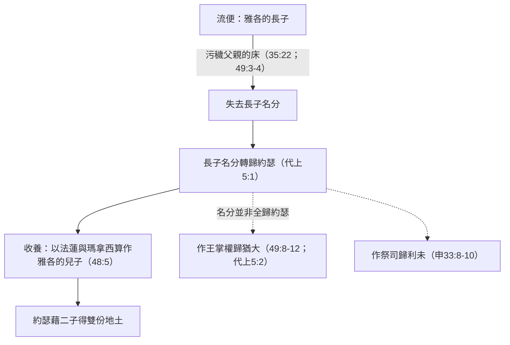

# 創世記 第48章

<!-- chapter-navigation:start -->
| [前一章](第47章.md) | [回目錄](全書目錄及綱要.md) | [下一章](第49章.md) |
| :--- | :---: | ---: |
<!-- chapter-navigation:end -->

1. 這事以後，有人告訴[[約瑟]]說：你的父親病了。他就帶著兩個兒子[[瑪拿西]]和[[以法蓮]]同去。
2. 有人告訴[[雅各]]說：請看，你兒子[[約瑟]]到你這裡來了。[[雅各|以色列]]就勉強在床上坐起來。
3. [[雅各]]對[[約瑟]]說：[[全能的神（El Shaddai）|全能的神]]曾在[[迦南地]]的[[路斯]]向我顯現，賜福與我，
4. 對我說：我必使你生養眾多，成為多民，又要把這地賜給你的後裔，永遠為業。
5. 我未到[[埃及]]見你之先，你在埃及地所生的[[收納以法蓮與瑪拿西|以法蓮和瑪拿西這兩個兒子是我的]]，正如流便和西緬是我的一樣。
6. 你在他們以後所生的就是你的，他們可以歸於他們弟兄的名下得產業。
7. 至於我，我從巴旦來的時候，[[拉結]]死在我眼前，在[[迦南地]]的路上，離以法他還有一段路程，我就把他葬在以法他的路上（以法他就是[[伯利恆]]）。
8. [[雅各|以色列]]看見[[約瑟]]的兩個兒子，就說：這是誰？
9. [[約瑟]]對他父親說：這是神在這裡賜給我的兒子。[[雅各|以色列]]說：請你領他們到我跟前，我要給他們祝福。
10. [[雅各|以色列]]年紀老邁，眼睛昏花，不能看見。[[約瑟]]領他們到他跟前，他就和他們親嘴，抱著他們。
11. [[雅各|以色列]]對[[約瑟]]說：我想不到得見你的面，不料，[[神的護理|神又使我得見你的兒子]]。
12. [[約瑟]]把兩個兒子從[[雅各|以色列]]兩膝中領出來，自己就臉伏於地下拜。
13. 隨後，[[約瑟]]又拉著他們兩個，[[以法蓮]]在他的右手裡，對著[[雅各|以色列]]的左手，[[瑪拿西]]在他的左手裡，對著以色列的右手，領他們到以色列的跟前。
14. [[雅各|以色列]]伸出右手來，按在[[以法蓮]]的頭上（以法蓮乃是次子），又剪搭過左手來，按在[[瑪拿西]]的頭上（瑪拿西原是長子）。
15. 他就給[[約瑟]]祝福說：願我祖亞伯拉罕和我父以撒所事奉的神，就是[[神的護理|一生牧養我直到今日的神]]，
16. 救贖我脫離一切患難的那使者，賜福與這兩個童子。願他們歸在我的名下和我祖亞伯拉罕、我父以撒的名下。又願他們在世界中生養眾多。
17. [[約瑟]]見他父親把右手按在[[以法蓮]]的頭上，就不喜悅，便提起他父親的手，要從以法蓮頭上挪到[[瑪拿西]]的頭上。
18. [[約瑟]]對他父親說：我父，不是這樣。這本是長子，求你把右手按在他的頭上。
19. 他父親不從，說：我知道，我兒，我知道。他也必成為一族，也必昌大。只是[[以法蓮在瑪拿西以上|他的兄弟將來比他還大]]；他兄弟的後裔要成為多族。
20. 當日就給他們祝福說：以色列人要指著你們祝福說：願神使你如[[以法蓮]]、[[瑪拿西]]一樣。於是[[以法蓮在瑪拿西以上|立以法蓮在瑪拿西以上]]。
21. [[雅各|以色列]]又對[[約瑟]]說：我要死了，但神必與你們同在，領你們回到你們列祖之地。
22. 並且我從前用弓用刀從[[亞摩利人]]手下奪的[[約瑟多得的一分地|那塊地]]，我都賜給你，使你比眾弟兄多得一分。

---

## 本章知識節點

### 人物
- [[雅各]]
- [[約瑟]]
- [[以法蓮]]
- [[瑪拿西]]
- [[拉結]]
- [[亞摩利人]]

### 地點
- [[路斯]]
- [[伯利恆]]
- [[迦南地]]
- [[埃及]]

### 神學
- [[全能的神（El Shaddai）]]
- [[神的護理]]
- [[以法蓮在瑪拿西以上]]
- [[流便失去長子名分]]

### 歷史
- [[收納以法蓮與瑪拿西]]
- [[約瑟骸骨葬於示劍]]

### 主題
- [[長子名分]]

### 解經爭議
- [[約瑟多得的一分地]]

---

## 本章整理

「以色列就**勉強**在床上坐起來」——GT《聖經精讀本》注意到這裡的用名：**臥病在床的是「雅各」，勉力坐著的卻是「以色列」**——他是以立約傳授者的身份，盡力完成最後的使命。KC：**一聽見約瑟的名字，就給了他力氣。**

來11:21 特別記下這一幕：「雅各**因著信**，臨死的時候，給約瑟的兩個兒子各自祝福。」KC 引一句流傳的話：**「雅各從來沒有像他病臥床上時走得這樣有力；也從來沒有像他眼睛昏花時看得這樣清楚。」**

### 經文大綱

1. **約瑟帶二子見病中的父親**（1-2節）
2. **雅各重提伯特利之約，收納二子為己子**（3-7節）
3. **雅各要給二子祝福**（8-12節）
4. **交叉雙手：立以法蓮在瑪拿西以上**（13-20節）
5. **應許歸回，並使約瑟多得一分**（21-22節）

### 一、從伯特利的應許說起（3-7節）

雅各開口不是談病，是**作見證**：「[[全能的神（El Shaddai）|全能的神]]曾在[[迦南地]]的[[路斯]]（伯特利的古名，28:19）向我顯現，賜福與我。」——CT：**雅各在病中並不自憐，反而對探病的人作自己蒙恩的見證；生命成熟的人，他所關心的不是自己，而是別人。**GT 丁良才：**他重提神的應許，是為要堅固約瑟的信心。**（果然，約瑟臨終時也照樣對弟兄們提起，50:24。）GT《聖經精讀本》指出他傳下去的是什麼：**雅各把在伯特利得到的（28:12-15；35:9-13）關於土地和後裔的應許傳給約瑟**——而土地、後裔與統治權，正是構成神國的三大要素。

然後是本章的法律行動：「[[收納以法蓮與瑪拿西|以法蓮和瑪拿西這兩個兒子是我的]]，**正如流便和西緬是我的一樣**。」

> [!note] 這是一次正式的收養
> GT《舊約背景註釋》：**這個收養的習俗和方式，與漢摩拉比法典中的例證相似。此外烏加列文獻中，也有祖父收養孫兒的例子。**其效果是：**約瑟得到了長子所當得的雙分產業，因為他兩個兒子都分受了雅各的遺產**（代上5:1-2）。BH 同樣說這是一次合法而正式的收養，是古代近東文化中公認的作法。
>
> KC 提醒這件事的分量：**雅各把長子名分的祝福從流便和西緬手中挪去，給了約瑟的兒子——而這兩個孩子是外邦女子所生的。**GT 丁良才說明前因：[[流便失去長子名分|流便本來是長子，但因為他污穢了父親的床，就失了長子的名分]]（49:3-4）；他並補上一個法律上的注記——**「這是特別的辦法；後來在神的法律中明明地禁止為父親的存偏心，奪去長子的名分」**（申21:15-17）。
>
> 第6節則界定範圍：**約瑟日後若還有兒子，就歸在以法蓮和瑪拿西的名下得產業，不另立支派。**GT《啟導本聖經創世記註釋》從支派總數解釋這個安排：約瑟應得的土地將來分給二子，但利未不給土地（書14:4），因此分土地的支派仍是十二。

第7節忽然轉到[[拉結]]之死——「[[拉結]]死在我眼前……我就把她葬在[[伯利恆|以法他]]的路上」。來源把這段回憶與收納拉結之孫直接相連：CT 說**拉結之死歷歷在目，這或許是促使雅各收納約瑟二子為子嗣的主要原因**；GT《串珠聖經註釋》說**雅各這樣做，乃是紀念他的愛妻拉結**；GT《聖經精讀本》說**雅各特別強調拉結的死亡，是想說明他分給約瑟兩份基業的理由，表明他深愛著拉結和迦南地**；GT 丁良才則只說一句：**雅各如此追憶已死的妻子，足以顯明他有恆愛之心。**

> [!quote] 伯利恆——雅各生命的轉捩點，也是以色列歷史的轉捩點
> KC：**在拉結的死上，雅各學到（以圖畫的方式）：凡肉體所倚靠的，都必須被奪去。神取去了他不惜代價要保全的拉結；神也取去了約瑟和便雅憫——然後又把約瑟和便雅憫還給他，甚至叫他看見約瑟的兒子。**
>
> **而埋葬也說到新生命：拉結的死，伴隨著便雅憫的生。伯利恆是雅各生命的轉捩點，也是以色列歷史的轉捩點——因為他們的彌賽亞要生在那裡**（彌5:2；太2:1）。**他們現在還看不見，但他們必要看見。**

### 二、三個名字，一位神（8-16節）

「[[神的護理|我想不到得見你的面，不料，神又使我得見你的兒子]]」——CT：**神為愛祂的人所豫備的，是眼睛未曾看見、耳朵未曾聽見、人心也未曾想到的**（林前2:9）。GT《聖經精讀本》讀出這句話的位置：**經過所有的試煉，雅各認識到神深奧的主權性護理和豐盛的恩典，以感謝和喜樂的心發出感慨**——如同約伯經過試煉後，加倍的祝福臨到了他（伯42:10、12）。

雅各的祝福詞裡，用了**三個稱呼**來稱神（KC）：

| 稱呼 | 意義 |
|---|---|
| 「我祖亞伯拉罕和我父以撒**所事奉的神**」 | 立約的神——他認識神，是從祖父與父親而來 |
| 「**一生牧養我直到今日的神**」 | 一生的看顧——CT：從「客觀的認識」轉為「主觀的經歷」 |
| 「**救贖我脫離一切患難的那使者**」 | 保護與拯救——即毘努伊勒的那位（32:24、30）；BH 指這位使者常被理解為神的顯現，即基督道成肉身以前的顯現 |

> [!note] 聖經第一次稱神為「牧者」
> GT《啟導本聖經創世記註釋》：**本書只在這裡和給約瑟祝福時稱神為牧者，是聖經第一次這樣稱呼神。**——**而說這話的雅各，自己一生就是牧羊人**（CT：所以他能深深體會神給他照顧和餧養的恩惠）。
>
> 「救贖」（**goel**）一詞在此**首次出現於聖經**（GT《創世記雷氏研讀本》）——CT 指出原文與「贖業至親」同字：**當一個人陷入困境，那位至親就義不容辭地代贖產業並提供保護**（利25:25、47-49）。GT《聖經精讀本》說這是**雅各第一次告白耶和華是自己的救贖者**。
>
> 而 CT 指出一個關鍵的文法細節：**第16節的「賜福」在原文是單數動詞**——表示這三個稱呼**實際上乃是一位**。GT 丁良才亦然：**「這祝福的話有三層，且指三位……『賜福』是單數的動詞，顯明以上的三位仍是一位。」**

### 三、剪搭過來的手（13-20節）

約瑟仔細地把長子[[瑪拿西]]放在父親右手邊、次子[[以法蓮]]放在左手邊。GT《聖經精讀本》說明為什麼：**在古代社會，尤其對希伯來人來說，右手象徵能力和權能**（出15:6-12；申33:2；伯40:14），**右邊是蒙福的人**（出29:20；太25:33）**和貴人**（王上2:19）**所占的位置**；CT 的背景註解同說猶太人視右手邊為大（詩110:1）。

「以色列伸出右手來，按在以法蓮的頭上……又**剪搭**過左手來，按在瑪拿西的頭上」——CT 注意原文：**「剪搭」指一種有意識（understood）的動作，可譯作「故意把左手交叉過來」**；GT《聖經精讀本》同說這是**有意地交叉雙臂**，雅各**正確履行了神的旨意**。

> [!example]- GT 丁良才：按手禮在聖經中的六個意思
> | | 用途 | 經文 |
> |---|---|---|
> | 一 | 祝福 | 太19:13、15 |
> | 二 | 治病 | 可5:23；7:32；徒28:8 |
> | 三 | 賜恩 | 徒8:17；19:6 |
> | 四 | 封職 | 民27:18-23；徒6:1-6；13:3；提前4:14 |
> | 五 | 除罪 | 出29:10；利1:4；3:2；4:15；16:21 |
> | 六 | 定罪 | 利24:14 |
>
> GT《聖經精讀本》另指出這是**聖經第一次出現按手祝福的形式**；此後按手儀式成為託付責任或將屬靈恩賜傳給他人的形式，新舊約普遍使用。CT 則說按手的屬靈意義至少有二：**聯合**（按手者和被按手者聯合為一）與**傳遞**（將按手者的福分、恩賜和能力傳給被按手者）。

約瑟「就不喜悅」，伸手要挪回來。

> [!quote] 「我知道，我兒，我知道」
> CT：**這句話表明他外面的眼睛雖然昏花了（10節），但他裡面的眼睛並沒有昏花。**GT《聖經精讀本》：**可以看出當時雅各身體非常衰弱，但靈性卻很警醒；這是多年試煉的結果。**
>
> KC 說得更直：**約瑟以為他父親弄錯了。這是聖經中我們讀到約瑟唯一的不完全——顯明他也是一個會犯錯的人。惟有主耶穌從來完全，毫無瑕疵。**而**雅各是憑信心祝福的：他信心的眼睛看見神的心意——正如神在他和以掃身上所行的一樣，在這裡也要立小的在大的以上。**
>
> CT 進一步：**約瑟能知道神有關七個豐年和七個荒年的旨意（41:25-36），卻不知道神有關以法蓮和瑪拿西的旨意。人無論怎樣屬靈，所知的仍然有限**（林前13:12）。**把右手按在長子頭上，這才合乎常規；但屬靈的事並不一定照常規而行，神的旨意也不能依照常規來推斷**（羅11:6-7）。GT《聖經精讀本》另指出雅各為何不會弄錯：**他對長子權有著慘痛的教訓，因此沒有重蹈父親以撒的覆轍——以撒曾因偏愛和大意，差點破壞神的旨意**（25:23；27:33）。
>
> GT《舊約背景註釋》把這放進整卷創世記的主題裡：**在族長敘述中，每代都是幼子得到優待——得產業的是以撒不是以實瑪利，是雅各不是以掃；得寵的是約瑟而非眾兄長；如今以法蓮又比瑪拿西更得眷愛。**CT 則注意到雅各自己一生的三重反轉：**他身為弟弟，卻與哥哥以掃爭[[長子名分|長子的名分]]和祝福（27:36）；他又愛妹妹拉結過於姊姊利亞（29:30）；如今又將約瑟次子立在長子之上。**

「[[以法蓮在瑪拿西以上|於是立以法蓮在瑪拿西以上]]」——這是祝福次序的反轉，不表示瑪拿西沒有祝福（19節明說：「他也必成為一族，也必昌大」）。

歷史應驗了這預言：CT 指出**分國之後（主前930-722），以法蓮支派成為北國以色列最強大的支派，「以法蓮」甚至成了以色列國的別稱**（賽7:2、5、8-9；何9:13；12:1、8）。GT《聖經精讀本》從更早算起：**經士師時代到王國分裂時代，從數量及指揮能力方面，以法蓮支派超越瑪拿西支派的預言如實成就。**KC 補一筆：**瑪拿西沒有像以法蓮那樣強大，並且被分成兩半——半個支派住在河西，另半個住在約旦河東。**

而「願神使你如以法蓮、瑪拿西一樣」這句話，CT 的背景註解說**後來成為以色列人的諺語**；GT《聖經精讀本》說**今天在希伯來社會，這句話成為表示「祝福」的格言**；BH 說得最具體：**這句話成了猶太父母為兒子祝福的傳統用語**，象徵對昌盛、合一與神恩眷的盼望——而以法蓮和瑪拿西的特別之處在於，他們生在埃及，卻仍保住了屬以色列子民的身分。

### 四、那「多得的一分」（21-22節）

「我要死了，但**神必與你們同在**，領你們回到你們列祖之地」——CT：**「我要死了，但神必與你們同在」——地上的父雖然會過去，天上的父卻永遠長存**；「雅各身在埃及，心卻牽掛著迦南地。」GT《聖經精讀本》指出這句話的後續份量：**日後希伯來人在外邦受難時，「恢復迦南」的思想成為他們的精神支柱，也是他們成為一個共同體的基礎，更是出埃及事件的決定性動機。**

「並且我從前**用弓用刀**從[[亞摩利人]]手下奪的[[約瑟多得的一分地|那塊地]]，我都賜給你，使你比眾弟兄**多得一分**。」

> [!note] 這塊地是哪裡？經文沒有直說
> **聖經並未記載雅各曾用弓用刀與亞摩利人爭地**，因此各家提出不同解法：
> - **示劍說**：CT 指出「分」字的希伯來原文與「示劍」同字，很可能是指他兒子們用刀劍所掠奪的示劍城（34:25-29）；不過 CT 同時說明，那種殺戮掠奪的行為是雅各所拒斥的，他的意思可能是指他後來不得不用弓用刀來防備鄰近迦南人的擊殺報復（34:30）。
> - **失而復得說**：GT 丁良才說雅各在示劍所買的地（33:18-19）大概被亞摩利人霸佔了，後來雅各又奪回這地，「聖書裡卻沒有記載」。KC 同：他先買了那地，離開往埃及之後被亞摩利人佔去。
> - **預言性表述說**：GT《聖經精讀本》：**雅各是用「將來進行時」說到約四百五十年後後裔征服迦南的壯舉，把後裔與自己同等看待。**KC 與 BH 同列這一種可能。
> - **尚未取得說**：GT《靈修版聖經註釋》：**雅各賜給約瑟的那塊地，當時仍被非利士人和迦南人佔據著，直到以法蓮和瑪拿西攻佔了約旦河兩岸（書16章），他們才真正得到這份禮物。**
>
> 至於「[[亞摩利人]]」指誰，GT《舊約背景註釋》說這用法「似乎是泛指迦南地全體的原居民（15:19-21），尤其是示劍一帶的人，雅各曾向他們買地」；GT《聖經精讀本》同說是「通指居住迦南地的所有民族」。至於這塊地後來歸誰，CT 說[[約瑟骸骨葬於示劍|約瑟的骸骨後來被葬在示劍]]，該地也作了約瑟子孫的產業（書24:32；約4:5）；GT 丁良才與《串珠聖經註釋》說示劍城後來歸以法蓮支派為業（書21:20-21），GT《啟導本聖經創世記註釋》則說此地後來屬瑪拿西支派。
>
> KC 從「弓」與「刀」讀出一層意思：**刀是仇敵近時所用的，弓是仇敵遠時所用的。刀是神的話——我們憑信心用它勝過仇敵；弓是盼望——藉著它，我們如今就支取那將來纔有的。**

### 關鍵神學點

1. **[[收納以法蓮與瑪拿西]]**：孫子被立為兒子，與流便、西緬同等——約瑟因此得雙份產業（代上5:1-2），但王權歸猶大、祭司歸利未。
2. **[[以法蓮在瑪拿西以上]]**：交叉的手是有意的；神的揀選一再越過長子的常規（以撒、雅各、約瑟、以法蓮）。
3. **[[神的護理]]**：雅各回望一生的總結——祂是**立約的神、牧養我一生的神、救贖我脫離一切患難的那使者**；三個稱呼，一位神（「賜福」是單數動詞）。
4. **[[約瑟多得的一分地]]**：經文未保存雅各以弓刀取地的事件，來源分成示劍、失而復得、預言性表述、尚未取得四種解法。

**參考資料**
https://biblehub.com/study/genesis/48.htm
https://www.kingcomments.com/en/bible-studies/Gen/48
https://www.ccbiblestudy.org/Old%20Testament/01Gen/01CT48.htm
https://www.ccbiblestudy.org/Old%20Testament/01Gen/01GT48.htm

<!-- appendix-links:start -->
## 附錄

### 相關地圖
- [[appendix/fhl_maps/maps/015|〈創圖十〉雅各的生平]]
- [[appendix/fhl_maps/maps/016|〈創圖十一〉猶大和約瑟的生平]]
- [[appendix/fhl_maps/maps/032|〈書圖五〉約但河東兩個半支派的領土]]
- [[appendix/fhl_maps/maps/034|〈書圖七〉以法蓮和瑪拿西（西）半支派最初的地業]]
<!-- appendix-links:end -->

<!-- chapter-navigation:start -->
| [前一章](第47章.md) | [回目錄](全書目錄及綱要.md) | [下一章](第49章.md) |
| :--- | :---: | ---: |
<!-- chapter-navigation:end -->
