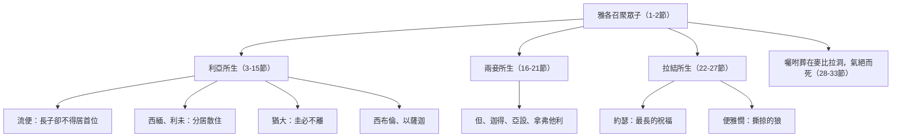

# 創世記 第49章

1. [[雅各]]叫了他的兒子們來，說：你們都來聚集，我好把你們日後必遇的事告訴你們。
2. [[雅各]]的兒子們，你們要聚集而聽，要聽你們父親以色列的話。
3. [[流便]]哪，你是我的長子，是我力量強壯的時候生的，本當大有尊榮，權力超眾。
4. 但你放縱情慾，滾沸如水，必不得居首位；因為你上了你父親的床，污穢了我的榻。
5. [[西緬]]和[[利未]]是弟兄；他們的刀劍是殘忍的器具。
6. 我的靈啊，不要與他們同謀；我的心哪，不要與他們聯絡；因為他們趁怒殺害人命，任意砍斷牛腿大筋。
7. 他們的怒氣暴烈可咒；他們的忿恨殘忍可詛。我要使他們分居在[[雅各]]家裡，散住在以色列地中。
8. [[猶大（雅各之子）|猶大]]啊，你弟兄們必讚美你；你手必掐住仇敵的頸項；你父親的兒子們必向你下拜。
9. [[猶大（雅各之子）|猶大]]是個小獅子；我兒啊，你抓了食便上去。你屈下身去，臥如公獅，蹲如母獅，誰敢惹你？
10. 圭必不離[[猶大（雅各之子）|猶大]]，杖必不離他兩腳之間，直等[[細羅 (創49_10)|細羅【就是賜平安者】]]來到，萬民都必歸順。
11. [[猶大（雅各之子）|猶大]]把小驢拴在葡萄樹上，把驢駒拴在美好的葡萄樹上。他在葡萄酒中洗了衣服，在葡萄汁中洗了袍褂。
12. 他的眼睛必因酒紅潤；他的牙齒必因奶白亮。
13. [[西布倫（同住）|西布倫]]必住在海口，必成為停船的海口；他的境界必延到西頓。
14. [[以薩迦（價值）|以薩迦]]是個強壯的驢，臥在羊圈之中。
15. 他以安靜為佳，以肥地為美，便低肩背重，成為服苦的僕人。
16. [[但（審判）|但]]必判斷他的民，作以色列支派之一。
17. [[但（審判）|但]]必作道上的蛇，路中的虺，咬傷馬蹄，使騎馬的墜落於後。
18. 耶和華啊，我向來等候你的救恩。
19. [[迦得（萬幸）|迦得]]必被敵軍追逼，他卻要追逼他們的腳跟。
20. [[亞設（有福）|亞設]]之地必出肥美的糧食，且出君王的美味。
21. [[拿弗他利]]是被釋放的母鹿；他出嘉美的言語。
22. [[約瑟]]是多結果子的樹枝，是泉旁多結果的枝子；他的枝條探出牆外。
23. 弓箭手將他苦害，向他射箭，逼迫他。
24. 但他的弓仍舊堅硬；他的手健壯敏捷。這是因[[神的護理|以色列的牧者，以色列的磐石─就是雅各的大能者]]。
25. 你父親的神必幫助你；那[[全能的神（El Shaddai）|全能者]]必將天上所有的福，地裡所藏的福，以及生產乳養的福，都賜給你。
26. 你父親所祝的福，勝過我祖先所祝的福，如永世的山嶺，至極的邊界；這些福必降在[[約瑟]]的頭上，臨到那與弟兄迥別之人的頂上。
27. [[便雅憫]]是個撕掠的狼，早晨要吃他所抓的，晚上要分他所奪的。
28. 這一切是[[十二支派起源|以色列的十二支派]]；這也是他們的父親對他們所說的話，為他們所祝的福，都是按著各人的福分為他們祝福。
29. 他又囑咐他們說：我將要歸到我列祖【原文作本民】那裡，你們要將我葬在赫人以弗崙田間的洞裡，與我祖我父在一處，
30. 就是在[[迦南地]]幔利前、[[麥比拉洞|麥比拉田間的洞]]；那洞和田是亞伯拉罕向赫人以弗崙買來為業，作墳地的。
31. 他們在那裡葬了亞伯拉罕和他妻撒拉，又在那裡葬了以撒和他的妻子利百加；我也在那裡葬了利亞。
32. 那塊田和田間的洞原是向赫人買的。
33. [[雅各]]囑咐眾子已畢，就把腳收在床上，氣絕而死，歸他列祖【原文作本民】那裡去了。

---

## 本章知識節點

### 人物
- [[雅各]]
- [[流便]]
- [[西緬]]
- [[利未]]
- [[猶大（雅各之子）]]
- [[約瑟]]
- [[便雅憫]]
- [[猶大支派]]
- [[西布倫（同住）]]
- [[以薩迦（價值）]]
- [[但（審判）]]
- [[迦得（萬幸）]]
- [[亞設（有福）]]
- [[拿弗他利]]

### 地點
- [[麥比拉洞]]
- [[迦南地]]

### 神學
- [[十二支派起源]]
- [[細羅 (創49_10)]]
- [[全能的神（El Shaddai）]]
- [[神的護理]]
- [[彌賽亞]]

### 互文
- [[西緬利未受咒詛 (創49_5-7)]]

---

## 本章整理

「我好把你們**日後必遇的事**告訴你們」——KC 直譯作「**在末後的日子必臨到你們的事**」：**這一章的性質是預言。**《啟導本》：從第2節到27節是**全卷創世記最長的一篇詩歌**。

第28節則把兩者合在一起：這既是**豫言**，也是**祝福**——「都是按著各人的福分為他們祝福」。

> [!note] 「按著各人的福分」——連責備也算作祝福
> CT：**「他們之中有些人，按表面看，似乎不是祝福，而是責備，但聖經仍認為這是他們的福分。」**KC 同聲：**「這也適用於流便、西緬和利未。說他們也得了祝福，聽起來似乎奇怪；然而，被指出自己的失敗，本身就是一種祝福——我們可以因此認罪，然後繼續與主同行，得祂的賜福。」**
>
>
> GT《舊約背景註釋》為這一整套宣告定了性：**在聖經材料中，族長的宣告大體上是關乎子孫的土地是否肥沃，子孫是否繁茂，家庭中關係各方面，將來的命運；族長所宣告的無論是祝福還是咒詛，雖然不當作是神所賜下的預言，依然備受重視，其約束力亦得承認。**

> [!example]- 兩種讀本章結構的方式
> GT《聖經精讀本》按**母系**分：利亞所生（3-15節）、兩個妾所生（16-21節）、拉結所生（22-27節）。倪柝聲則按**主題**分四段，每三支派為一段：「流便、西緬和利未，說到人的天然光景；西布倫、以薩迦和但說到神雖祝福，然尚有吸力離棄神；迦得、亞設和拿弗他利，說到救恩的效力；猶大、約瑟和便雅憫，說到基督。」

GT《聖經精讀本》另列出這段預言的幾個特徵：**它證明日後展開的選民歷史是神的救贖史，包含在神的主權計畫內**；**它是從挪亞（9:25-27）開始所有族長預言中最發展的一段救贖史預言**；**這重大的預言，在雅各臨終前肉身最虛弱時宣佈，表明神啟用弱者來完成奇事**（林前1:27-29；林後12:9-10）；**它坦誠指出每個兒子的善惡，並對此進行祝福或咒詛。**

### 一、失去的：流便、西緬、利未（3-7節）

| 兒子 | 本當如何 | 卻因何失去 | 應驗 |
|---|---|---|---|
| **流便** | 「我的長子……本當大有尊榮，權力超眾」 | 「你上了你父親的床」（35:22） | **流便支派沒有出過任何著名的士師、先知或官長** |
| **西緬** | — | 「他們的刀劍是殘忍的器具」（示劍屠城，創34） | **地業落在猶大境內**（書19:1-9），摩西的祝福（申33）甚至沒有提他 |
| **利未** | — | 同上 | **散住在以色列各支派的四十八座城**（書21） |

「放縱情慾，**滾沸如水**」——《串珠》：**描寫流便放任，像洪流不受管制。**

雅各說「**我的靈啊，不要與他們同謀；我的心哪，不要與他們聯絡**」——CT 提醒注意兩件事：**①雅各不是咒詛他們的「人」，而是咒詛他們的「性情和行為」（怒氣、忿恨）；②雅各從前所注意的，是他個人和全家的利害得失（34:30）；他現在所看見的，卻是罪惡的問題。**

> [!quote] 咒詛怎麼變成祝福？
> 這是本章最動人的一個轉折。**西緬與利未同受「分散」的宣告；但利未的分散，被神的恩典變成了祝福**——KC：**因著分散，他們得以進到全民中間，把神的律法教訓全民。**（申33:8-11 摩西反倒祝福利未：「他們要將你的典章教訓雅各，將你的律法教訓以色列。」）
>
> 賈斯樂《聖經難解經文詮釋手冊》處理了這個表面矛盾：**「這兩個宣告（咒詛和祝福）之間並沒有矛盾。利未的後裔就如雅各所言分散在以色列各地，卻成為神命定的祭司支派。」**——**咒詛的形式沒有改變，內容卻被神翻轉了。**

### 二、猶大：圭必不離（8-12節）

「猶大」的字義就是「**讚美**」——「你弟兄們必讚美你」。長子流便放縱、二三子殘忍，**家族領導的地位遂歸了第四子猶大**；日後大衛從此支派而出（撒下5:4-5）。

KC 注意到語氣的驟變：**雅各論到猶大，只說可稱讚的事——與前三個兒子成了極大的對比。這是因為猶大的將來與那位要從他而出的彌賽亞緊密相連。**

「猶大是個**小獅子**……臥如公獅，蹲如母獅，誰敢惹你？」——**啟5:5 稱基督為「猶大支派中的獅子」。**

> [!quote] 「直等細羅來到」——本章最著名的難題
> 「圭」與「杖」都是王權的象徵；「他兩腳之間」指從他所出的後代。全句是說：**猶大的後裔必要長久掌王權**——**直等[[細羅 (創49_10)|細羅]]來到。**
>
> 各家讀法：
> - **「賜平安者」**（傳統中譯、和合本小字）——多數華人註釋（丁良才、CT、李道生）視為**彌賽亞的名字**；
> - **「那應得的人／屬他的那位」**——賈斯樂指出：**大多數學者採用另一種母音標點，譯作 "to whom it belongs"；此讀法有七十士譯本與敘利亞譯本支持，並可由結21:27「直等到那應得的人來到」印證**（《串珠》同）；
> - **地名「示羅」**（以法蓮境內、會幕所在，書18:1）——少數學者的讀法；
> - **「貢物」**（希伯來語 *shay*）——《舊約背景註釋》認為**最合理**：「直等向他進貢者來到」。
>
> **各譯法共同保留的主軸是：猶大的王權延續，並有一位使萬民歸順者要來到。**大衛王朝與新約對「猶大支派之基督」的理解，由此相連（太1:1-3；來7:14；啟5:5）。

11-12節的葡萄意象——**驢可以拴在葡萄樹上、酒多得可以洗衣服**：《舊約背景註釋》：**用滿足的豐盛，作為支派將要富庶的表記。**KC 則看見更遠的一幕：**驢駒使人想起主耶穌騎驢進耶路撒冷**（亞9:9；太21:5），**而酒是千年國度喜樂的圖畫**（賽25:6）。

### 三、中間六子：西布倫、以薩迦、但、迦得、亞設、拿弗他利（13-21節）

| 支派 | 意象 | 後來的對照 |
|---|---|---|
| [[西布倫（同住）]] | 住在海口，境界延到西頓 | 靠近地中海與商路；CT 指其地將成為福音的起源地（太4:15-16）；GT《串珠》指西頓是腓尼基人的首府 |
| [[以薩迦（價值）]] | 強壯的驢，臥在羊圈；以安靜為佳，便低肩背重 | CT：其地在約但河谷西北部，土地肥美，卻可能沒有設法趕出境內的迦南人而安於現狀；GT《精讀本》連到王上9:21 的苦役 |
| [[但（審判）]] | 判斷他的民；卻作「道上的蛇，路中的虺」 | 出了士師參孫（士16:31）；GT《精讀本》指但支派是拜偶像的發起人（士18:18；王上12:29-30） |
| [[迦得（萬幸）]] | 被敵軍追逼，他卻要追逼他們的腳跟 | 住約旦河東，屢受侵擾而終能反擊（代上5:18-22）；GT 丁良才指常受亞拉伯敵軍追逼 |
| [[亞設（有福）]] | 出肥美的糧食，且出君王的美味 | 得迦密山以北的沃土（書19:24-31）；GT《精讀本》：所羅門時代以此供給王（王上5:11） |
| [[拿弗他利]] | 被釋放的母鹿，出嘉美的言語 | CT：步履靈活矯捷（詩18:33）；GT《精讀本》連到底波拉與巴拉之歌（士5章）；BH 所據譯本把後半讀作「生養美麗的小鹿」 |

BH 為其中三段補了不同角度的觀察：**西布倫在書19:10-16 所分到的地其實並不直接臨地中海**，這段預言指向的是它鄰近商路（古代連接埃及與美索不達米亞的沿海大道）而得的海運之利；**以薩迦的「臥在羊圈之中」也可以正面讀**——代上12:32 說以薩迦人「通達時務，知道以色列人所當行的」，BH 認為這段意象同時含著洞察與智慧，與 CT、丁良才「好逸惡勞」的讀法並不相同；**迦得「追逼他們的腳跟」則帶著彌賽亞的餘音**，令人想起創3:15 女人的後裔要傷蛇的頭。至於拿弗他利所在的加利利，BH 指出那正是日後主耶穌大部分事奉的所在。

> [!note] KC 把這六段當成一條連續的預言線來讀
> 前三子失敗之後，彌賽亞在猶大出現、國權歸給祂；但祂來的時候被棄絕，以色列就分散在列國中——KC 說**這正是西布倫那幅圖畫的內容：海是列國的圖畫**（啟17:15）；**以色列分散在列國中與他們通商，就是那些「船隻」，而「境界延到西頓」說的是以色列以列國為念**。事情沒有停在那裡：**以薩迦說的是以色列在棄絕主之後變成列國的重擔——他們成了馱重的牲口，作了列國的奴僕**（尼9:36），**而神原本的心意是列國作他們的僕人**（申28:1、13）。
>
> 接著是轉機。**但這裡要起來一位審判者、一位領袖，把百姓從列國的軛下救出來，他要用陰險的手段**——KC 認為這位將來的猶太人的王受撒但（那古蛇，啟12:9）所激動，就是敵基督；**因此雅各不指望從但得拯救，乃指望從耶和華自己得拯救**（18節）。**迦得代表以色列餘民的勇敢**——他們在敵基督的恐怖底下受苦極重，而當主耶穌來施行拯救時，祂要用這餘民追趕並擊敗那些「追逼者」。**亞設身上只連著祝福**：主耶穌顯現、除滅仇敵之後的千年國度裡，將有豐盛的祝福、肥美的食物（詩72:16），**以色列也要把那祝福分給別人**。**拿弗他利的主題是自由**——與走進奴軛的以薩迦成了強烈的對比；**被釋放的母鹿在牠疾行時毫無攔阻，這自由是爭戰得來的，而自由的結果就是「嘉美的言語」。**
>
> KC 讀出的是同一條線的六個段落，不是六段互不相干的支派史。

GT《串珠聖經註釋》對第21節另提一種讀法：**「不少學者建議把21節加上不同的響音而譯作『拿弗他利是一棵高大的松樹，生髮出美麗的嫩芽』。」**CT 的呂振中譯注同列這一讀。

GT 艾基斯《舊約聖經難題彙編》把本章與申33 逐支派對照，並指出兩者的性質不同：**創49 是雅各晚年時神向他啟示的，預言的時期較長；申33 是四百多年後摩西所寫，「主要是帶出他自己的期望，真正預言的份量則較少」。**以薩迦是最清楚的一例——他指出創49:14-15 的應驗，是在主前732年提革拉毘列色三世併吞以薩迦地業、納入亞述版圖的時候（王下15:29；賽9:1）。

> [!note] 第18節：預言中間的一聲歎息
> 「**耶和華啊，我向來等候你的救恩。**」——這一句突然插進但的預言中間。CT：**「這意思是說，我對於前面17節的情況無能為力，所以只好等候神的救恩。」**倪柝聲：**「雅各豫言但的將來是不好的……說到這裡，他立刻說：『耶和華啊，我向來等候你的救恩。』」**丁良才則推想：**雅各既提到「蛇」，大概想起了創3:15 的應許，因此發出這樣的歎息。**
>
> KC 更把但連到末世：**他不指望從但得拯救（因為但是詭詐的），乃指望從耶和華自己得拯救。**（初期教父愛任紐、奧古斯丁、安波羅修都曾據此推想敵基督或出於但支派——**這是推論，不是經文明言**；經文可考的線索只是：啟7:4-8 的受印名單中沒有但支派。）

### 四、約瑟：最長的祝福（22-26節）

「約瑟是**多結果子的樹枝**，是**泉旁**多結果的枝子；他的枝條**探出牆外**。」

> [!quote] 泉、牆、與果子
> KC 讀出三個要素：**他多結果子，是因為他長在泉旁——他從神這泉源汲取，知道自己全然仰賴祂。**（耶17:8；詩1:3）**而果子結在「泉」（交通）與「牆」（分別）之間——枝條卻探出牆外：主耶穌不只在以色列的牆內結果子，祂的果子也歸給牆外一切信祂的人**（可7:24-30；約4:39-42）。
>
> 「弓箭手將他苦害」——**指哥哥們的出賣、波提乏之妻的誣告。**「但他的弓仍舊堅硬」——**這是因[[神的護理|以色列的牧者，以色列的磐石──就是雅各的大能者]]。**KC 用一個比喻：**像小孩要提起父親沉重的箱子，他自己提不動；但父親的大手包著他的手一同提起來——他就提起來了。**

「那[[全能的神（El Shaddai）|全能者]]必將**天上所有的福**、**地裡所藏的福**、以及**生產乳養的福**都賜給你」——三重的福：**天（雨露）、地（泉源礦藏）、人（母腹與胸奶）。**

「那**與弟兄迥別**之人」——CT 指出：**「迥別」的原文與「拿細耳人」同字**，故有兩義：①**他的成就高過弟兄們**；②**他分別為聖，歸給神**。KC：**主耶穌是那真正的拿細耳人。**

### 五、便雅憫、十二支派、與麥比拉洞（27-33節）

「便雅憫是個**撕掠的狼**」——**讚許該支派的戰鬥精神**（士3:15-30；20:21,25；代上12:2）。KC 則把約瑟與便雅憫合起來讀：**約瑟是基督受苦與高升的圖畫，便雅憫是基督帶著權能榮耀再來、在地上掌權的圖畫。**

「這一切是[[十二支派起源|以色列的十二支派]]」——**雅各臨死的時候，十二個支派已經擺明在那裡了。**

最後他再一次囑咐葬事：「將我葬在……[[迦南地]]幔利前、[[麥比拉洞|麥比拉田間的洞]]」——**那洞和田是亞伯拉罕向赫人以弗崙買來為業的**（創23）。他細數：**亞伯拉罕與撒拉、以撒與利百加、還有利亞，都葬在那裡。**

> [!note] 他要與列祖同葬——這是復活的信心
> KC：**雅各重述他先前所說的（47:30）。這清楚顯明他對復活的信心，也顯明神是復活的神。他的心不在他所留下的，乃在復活裡等著他的。死亡不能廢掉生命的應許。**
>
> **這塊合法購得的迦南墳地，是族長當時實際持有的唯一應許地產業。**——**列祖在應許地所擁有的，只有一座墳墓；而他們卻憑信心指著它說：這地是我們的。**（來11:13,16）

「雅各囑咐眾子已畢，就把腳收在床上，**氣絕而死**（原文只是一個字：**交出靈魂**），**歸他列祖那裡去了**。」——「歸他列祖（原文作『本民』）」把死亡描述為**與本民團聚**，不只是交代身體的安葬。KC：**若神的百姓就是我們的百姓，我們死時也必被收聚歸與他們。**

### 關鍵神學點

1. **[[十二支派起源]]**：豫言與祝福合一；連責備也是「按著各人的福分」的祝福。
2. **[[細羅 (創49_10)]]**：譯法多歧（賜平安者／那應得的人／示羅／貢物），但共同的主軸是**猶大王權的延續與萬民歸順者的來到**。
3. **咒詛被翻轉**：利未的「分散」因蒙召事奉，成了全國的祝福——**神的恩典能翻轉刑罰的形式，卻不取消刑罰本身。**
4. **[[神的護理]]**：約瑟能站立，不在乎他的弓，而在乎那位牧者、磐石、雅各的大能者。
5. **[[麥比拉洞]]**：列祖在應許地惟一實際持有的，是一座墳墓——**這正是他們信心的憑據。**

**參考資料**
https://biblehub.com/study/genesis/49.htm
https://www.kingcomments.com/en/bible-studies/Gen/49
https://www.ccbiblestudy.org/Old%20Testament/01Gen/01CT49.htm
https://www.ccbiblestudy.org/Old%20Testament/01Gen/01GT49.htm

<!-- appendix-links:start -->
## 附錄

### 相關地圖
- [[appendix/fhl_maps/maps/015|〈創圖十〉雅各的生平]]
- [[appendix/fhl_maps/maps/016|〈創圖十一〉猶大和約瑟的生平]]
- [[appendix/fhl_maps/maps/032|〈書圖五〉約但河東兩個半支派的領土]]
- [[appendix/fhl_maps/maps/036|〈書圖九〉西緬和猶大支派的地業]]
- [[appendix/fhl_maps/maps/037|〈書圖十〉西布倫、以薩迦、亞設、拿弗他利和但等支派的地業]]
<!-- appendix-links:end -->
