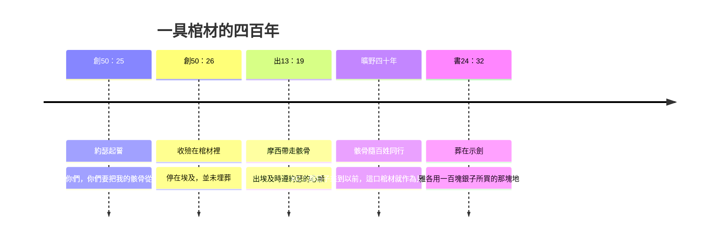

# 創世記 第50章

<!-- chapter-navigation:start -->
| [前一章](第49章.md) | [回目錄](全書目錄及綱要.md) |  |
| :--- | :---: | ---: |
<!-- chapter-navigation:end -->

1. [[約瑟]]伏在他父親的面上哀哭，與他親嘴。
2. [[約瑟]]吩咐伺候他的醫生用[[古埃及薰屍與哀悼|香料薰他父親]]，醫生就用香料薰了[[雅各|以色列]]。
3. [[古埃及薰屍與哀悼|薰屍的常例是四十天]]；那四十天滿了，[[古埃及薰屍與哀悼|埃及人為他哀哭了七十天]]。
4. 為他哀哭的日子過了，[[約瑟]]對[[法老]]家中的人說：我若在你們眼前蒙恩，請你們報告法老說：
5. 我父親要死的時候叫我起誓說：你要將我葬在[[迦南地]]，在我為自己所掘的墳墓裡。現在求你讓我上去葬我父親，以後我必回來。
6. [[法老]]說：你可以上去，照著你父親叫你起的誓，將他葬埋。
7. 於是[[約瑟]]上去葬他父親。與他一同上去的，有[[法老]]的臣僕和法老家中的長老，並[[埃及]]國的長老，
8. 還有[[約瑟]]的全家和他的弟兄們，並他父親的眷屬；只有他們的婦人孩子，和羊群牛群，都留在[[歌珊地]]。
9. 又有車輛馬兵，和他一同上去；那一幫人甚多。
10. 他們到了約但河外、[[亞達禾場與亞伯麥西|亞達的禾場]]，就在那裡大大地號咷痛哭。[[約瑟]]為他父親哀哭了七天。
11. [[迦南地|迦南]]的居民見[[亞達禾場與亞伯麥西|亞達禾場上的哀哭]]，就說：這是[[埃及]]人一場極大的哀哭。因此那地方名叫[[亞達禾場與亞伯麥西|亞伯麥西]]，是在約但河東。
12. [[雅各]]的兒子們就遵著他父親所吩咐的辦了，
13. 把他搬到[[迦南地]]，葬在幔利前、[[麥比拉洞|麥比拉田間的洞]]裡；那洞和田是亞伯拉罕向赫人以弗崙買來為業，作墳地的。
14. [[約瑟]]葬了他父親以後，就和眾弟兄，並一切同他上去葬他父親的人，都回[[埃及]]去了。
15. [[約瑟]]的哥哥們見父親死了，就說：[[悔改與良心的覺醒|或者約瑟懷恨我們]]，照著我們從前待他一切的惡足足地報復我們。
16. 他們就打發人去見[[約瑟]]，說：你父親未死以先吩咐說：
17. 你們要對[[約瑟]]這樣說：從前你哥哥們惡待你，求你饒恕他們的過犯和罪惡。如今求你饒恕你父親神之僕人的過犯。他們對約瑟說這話，約瑟就哭了。
18. 他的哥哥們又來俯伏在他面前，說：我們是你的僕人。
19. [[約瑟]]對他們說：不要害怕，我豈能代替神呢？
20. 從前[[神的主權與人的責任|你們的意思是要害我，但神的意思原是好的]]，要[[神的護理|保全許多人的性命]]，成就今日的光景。
21. 現在你們不要害怕，[[饒恕與和好|我必養活你們和你們的婦人孩子]]。於是[[約瑟]]用親愛的話安慰他們。
22. [[約瑟]]和他父親的眷屬都住在[[埃及]]。約瑟活了一百一十歲。
23. [[約瑟]]得見[[以法蓮]]第三代的子孫。[[瑪拿西]]的孫子、瑪吉的兒子也養在約瑟的膝上。
24. [[約瑟]]對他弟兄們說：我要死了，但[[神的護理|神必定看顧你們]]，領你們從這地上去，到[[亞伯拉罕之約|他起誓所應許給亞伯拉罕、以撒、雅各之地]]。
25. [[約瑟]]叫以色列的子孫起誓說：神必定看顧你們；你們要把我的[[約瑟骸骨葬於示劍|骸骨從這裡搬上去]]。
26. [[約瑟]]死了，正一百一十歲。人用[[古埃及薰屍與哀悼|香料將他薰了]]，把他收殮在棺材裡，停在[[埃及]]。

---

## 本章知識節點

### 人物
- [[約瑟]]
- [[雅各]]
- [[法老]]
- [[以法蓮]]
- [[瑪拿西]]

### 地點
- [[埃及]]
- [[迦南地]]
- [[歌珊地]]
- [[麥比拉洞]]
- [[亞達禾場與亞伯麥西]]

### 神學
- [[神的護理]]
- [[神的主權與人的責任]]
- [[饒恕與和好]]
- [[亞伯拉罕之約]]
- [[悔改與良心的覺醒]]

### 歷史
- [[約瑟骸骨葬於示劍]]

### 文化
- [[古埃及薰屍與哀悼]]

---

## 本章整理

KC 為這最後一章下的引言：**「在這一章裡，我們看見的不是約瑟的地位和尊榮，而是他的品格與美德。」**——**創世記以「起初神創造」開始，以「收殮在棺材裡，停在埃及」結束**（CT：**這正說出人因墮落犯罪的結局，也說出人為何需要神的救贖**）。**但這具棺材裡，藏著一個出埃及的盼望。**

### 經文大綱

1. **約瑟哀哭、薰屍、埃及舉國哀悼**（1-3節）
2. **求法老准他歸葬迦南**（4-6節）
3. **浩大的送葬行列；亞達禾場哀哭七日**（7-11節）
4. **葬於麥比拉洞，眾人回埃及**（12-14節）
5. **哥哥們懼怕，約瑟饒恕**（15-21節）
6. **約瑟之死與骸骨的遺命**（22-26節）

### 一、薰屍：一個實際的用途（1-3節）

「約瑟伏在他父親的面上哀哭」——**這是約瑟第六次哭**（KC）。CT 注意到：**這正應驗了神在別是巴對雅各的應許——「約瑟必給你送終」（46:4，原文「將手按在你的眼睛上」）。**

> [!note] 約瑟為什麼用埃及人的方法薰屍？
> 各家一致給出**同一個實際理由**：**從埃及運屍到迦南需要相當時日，若不防腐，就無法履行他向父親所起的誓**（47:29-31）。CT 特別澄清：**約瑟的用意不是學埃及人的迷信**（埃及人相信肉身若不腐爛，靈魂就仍存留）。**經文沒有說他接受埃及關於死後生命的宗教觀。**
>
> GT《啟導本聖經創世記註釋》另注意一個細節：**約瑟殮葬父親沒有用專業薰屍的人，他用的是伺候雅各的醫生**——「可能由醫生做不但更在行，**也可以避免薰屍人採用異教的禮儀**」。GT《舊約背景註釋》則指出這件事在聖經裡的位置：**薰屍是埃及人的常例，負擔得起的人都不會不做，「然而本段是以色列人薰屍惟一的例子」**；它並說明手續：由一組受過特別訓練的殯喪祭司執行，內臟全部取出，屍體浸在特別的防腐藥水中四十天。GT 李道生《舊約聖經問題總解》把最上等的一種薰屍法描述得最細——先從鼻孔鉤出腦髓、剖腹取出五臟，用藥水洗淨後以玉桂、沉香、藥物、香料填滿縫好，浸於炭酸蘇打內，取出後用浸透亞拉伯樹膠的細麻布纏裹全身，裝殮在如人形的無花果木棺材內，「須費三千銀元纔能完成，而屍體可以存留三四千年而不朽」。
>
> [[古埃及薰屍與哀悼|薰屍四十天、哀哭七十天]]——《啟導本》：**埃及定例，為法老舉哀才七十二天；雅各竟得七十天，可見其備極哀榮。**CT 指出原文的意思是**「七十天」包含薰屍的「四十天」在內**（另有註釋家認為薰屍期間不舉哀，故兩段分開）。GT《舊約背景註釋》給的拆法又不同：**「這裡所述的日數可能包括了薰屍所需的四十日，再加上傳統的三十日哀悼期」**（申34:8）。至於這個數字有多長，GT 丁良才與《串珠聖經註釋》給了同一個對照：**以色列人為亞倫和摩西哀哭，也只有三十天**（民20:29；申34:8）。

### 二、送葬（4-14節）

約瑟不直接見法老，而託[[法老]]家中的人轉稟——**因他正在守喪，不剃頭刮臉，不合朝見之儀**（丁良才／《串珠》／《精讀本》一致）。

法老一口答應：「你可以上去，**照著你父親叫你起的誓**。」——CT：**這乃是約瑟多年來言行合一所得來的信用。**

於是有了古代近東罕見的一幕：**法老的臣僕、宮廷貴戚、埃及國的長老、車輛馬兵**，浩浩蕩蕩護送一個希伯來老人的靈柩回迦南。

> [!note] 這場葬禮的規格，與雅各自己的取捨
> KC 從薰屍的隆重讀出他的地位：**雅各被視為埃及的顯貴之一；照他名字的意思，他是以神的王子的身分死去，得的是王室的葬禮——若他或約瑟開口，必定會為他造一座金字塔。但雅各不求任何為自己立名的地方。**（GT《啟導本》從天數印證：埃及定例，為法老舉哀才七十二天。）
>
> BH 另指出第10節那個地點的性質：**禾場通常設在高處以借風力揚穀**，在那裡舉哀，本身就帶著「分別、潔淨」的意味；而**第10節的七日之哀，正是猶太人後來守喪的傳統天數（shiva），至今仍然遵行。**

> [!quote] 亞達的禾場——荊棘與打穀場
> 「[[亞達禾場與亞伯麥西|亞達的禾場]]」的**確切位置未能確定**：經文說在「約但河外」（原文可指河東或河西）；CT 甚至提出**「約但」可能是一個古城名**（約瑟夫曾提及），位於迦南南地。**《舊約背景註釋》坦言：至今未能確定。**
>
> CT 的原文字義給「亞達」兩個意思：**平原、荊棘叢**；GT《聖經精讀本》另提一種可能：**原名「亞達」可能取自禾場主人的名字。**GT《啟導本聖經創世記註釋》說明「禾場」是什麼：**與中國的打穀場類似，多在城郊當風處，為用泥或石築成的圓形或方形平地**；GT《舊約背景註釋》則說在禾場上哀哭七天沒有不合理之處——**禾場與商業、法律、生命有關，用來紀念部族的首領很是合適。**
>
> 但 KC 從這名字讀出深意：**「亞達」意為「荊棘叢」——荊棘是墮落之後地所長出來的（創3:18），說到罪的後果；雅各一生確實嘗夠了自己所種的**（加6:7-8）。**然而荊棘旁邊連著的是「禾場」——在禾場上，麥子與糠秕分開。禾場說到神在雅各生命中的管教：祂把糠秕除去了，剩下的是給神的麥子。而這果子，正在雅各的死上顯明出來。**
>
> 迦南居民說：「這是埃及人一場極大的哀哭」——**因此那地方名叫[[亞達禾場與亞伯麥西|亞伯麥西]]**（「埃及人的哀哭」；《舊約背景註釋》指出這是諧音：希伯來語「哀哭」*'ebel* 與「亞伯」*'abel* 音近）。

「雅各的兒子們就遵著他父親所吩咐的辦了」——**把他葬在[[麥比拉洞|麥比拉田間的洞]]裡。**KC：**雅各拒絕了埋葬在埃及所帶來的尊榮，選擇了迦南的一個洞穴。埃及和迦南的居民都不明白這是為什麼。**——**埃及給予的尊榮，沒有取代應許地的意義。**

「約瑟葬了他父親以後，就……**都回埃及去了**」——**歸葬尚不是整個家族的出埃及。**

### 三、「我豈能代替神呢？」（15-21節）

父親一死，哥哥們就慌了：「**[[悔改與良心的覺醒|或者約瑟懷恨我們]]**……」GT《聖經精讀本》把這一幕讀成收尾：**雅各死後，兄弟們對多坍事件（37:18-28）有了真實的悔改，而約瑟給了安慰和寬恕**——「這是對和解（45:15）的重新確認，也是以色列共同凝聚力的體現」。丁良才一針見血：**他們是按著自己的心來忖度約瑟，以為約瑟和他們的性情一樣。**KC 說得更痛：**他們以為約瑟這十七年待他們好，只是為了父親的緣故。他們何等不認識約瑟！他們彷彿在說：「我們知道他為我們作了什麼，卻不知道他對我們是什麼感覺。」**

他們轉述「父親未死以先吩咐說……求你饒恕」——

> [!note] 這句「父親的吩咐」是真的嗎？
>「你父親未死以先，吩咐說……」——經文沒有記載雅各先前說過這話。GT《啟導本聖經創世記註釋》從動機判斷：「從約瑟的哥哥們說話的動機看，所謂『你父親未死以先的吩咐』很可能是捏造的。」GT 丁良才則不談真偽，只指出時間差：早十七年，約瑟已經饒恕了哥哥們的錯（45:1-15）。
>
> 可以確定的是：**約瑟哭了。**丁良才：**約瑟心中憂傷，因為他們還疑惑他。**（**這是約瑟第七次、也是最後一次哭。**）KC 把它轉向讀者：**我們有時也像約瑟的哥哥們。我們知道主耶穌在十字架上為我們擔當了神的審判，也經歷過祂的看顧；然而一遇難處，就忽然顯出我們何等不真信靠祂。**

約瑟的回答，是全卷創世記的神學高峰：

| 約瑟說的 | 意思 |
|---|---|
| 「不要害怕，**我豈能代替神呢？**」 | 伸冤在神，不在我（羅12:19）；**他完全服在神的旨意之下**（KC） |
| 「從前**你們的意思是要害我**」 | **人的惡意仍被稱為惡，責任沒有取消** |
| 「**但神的意思原是好的**，要保全許多人的性命」 | 神把同一件事導向行惡者未曾打算的結果 |
| 「我必**養活**你們和你們的婦人孩子」 | 不但饒恕，還以善報惡（路6:27） |

> [!quote] 「你們的意思……神的意思」
> 這句話延續了45:5「神差我在你們以先來」的解釋，**成為創世記中神護理主題的高潮**（[[神的主權與人的責任]]）。**兩面必須並存：**人的惡意是真的惡，人要負責；神的護理卻真能使用人的惡行，成就行惡者原未打算的善。（參徒2:23——主耶穌一面「按著神的定旨先見被交與人」，一面「被無法之人的手釘在十字架上」。）
>
> CT：**「人的意思無論是怎樣的壞，我們若能從神的角度來看整個事物，就會因著神的美意而得享安息。」**

### 四、一具棺材，一個盼望（22-26節）

約瑟活了**一百一十歲**——GT《舊約背景註釋》：**對埃及人來說，一百一十歲正是理想的年齡**；它並補一個對照：**對木乃伊所作的檢驗，證明埃及人的平均壽命是四十至五十歲**，而製作木乃伊時使用棺材或石棺，「是埃及人而非以色列人的慣例」。BH 同說在古代近東的脈絡裡，一百一十歲被視為理想的年歲，象徵完滿而蒙福的一生。GT 丁良才另把時間定位：**約瑟死時正是雅各下埃及以後第七十年，即雅各去世以後第五十四年。**他「得見[[以法蓮]]第三代的子孫」，[[瑪拿西]]的孫子也「養在他的膝上」（**收養／承歡膝下的表達**）。

然而他臨終所說的，**一句也不關乎埃及的地位**：

> [!quote] 「神必定看顧你們」
> 「我要死了，但**[[神的護理|神必定看顧你們]]**，領你們從這地上去，到他起誓所應許給亞伯拉罕、以撒、雅各之地。」——**他說了兩次**（24、25節）。
>
> KC：**約瑟死了，神卻長存。他把弟兄們交託給祂。他死的時候，埃及一切的榮耀彷彿都與他一同放進了棺材裡。約瑟的信心，是望著那應許之地的。**——來11:22：**「約瑟因著信，臨終的時候提到以色列族將來要出埃及，並為自己的骸骨留下遺命。」**
>
> **而他沒有要求把骸骨立刻運回迦南。**KC 讀出用意：**他要他的骸骨留在百姓中間。他知道百姓有一天必上去。在那日子來到以前，這口棺材就作為一個見證與百姓同在——當他們受欺壓的日子來到（那日子必要來到），這位死了的約瑟，仍要提醒他們他所說的話：神必定看顧你們。**
>
> 這誓言後來由**摩西**成全（出13:19）；KC 說**百姓在曠野把約瑟的身體抬了四十年**，最後**葬在示劍**（[[約瑟骸骨葬於示劍|書24:32]]），「在那裡他仍然等候著神成就祂應許的那一刻」。而他所指的那地，正是[[亞伯拉罕之約|神向亞伯拉罕、以撒、雅各起誓所應許之地]]（24節）——GT《聖經精讀本》指出以色列三大族長在此代表選民與神立約，日後百姓正是根據這份應許祈求神的憐憫（出32:13；申9:27），神也因著這份應許保守他們（利26:42）。

「約瑟死了，正一百一十歲；人用香料將他薰了，把他**收殮在棺材裡，停在埃及**。」——CT：**「停」字表示人們把約瑟的屍體暫時擱置，並未埋葬**；GT《創世記雷氏研讀本》說明那「棺材」是什麼：**一個盛載木乃伊的箱子。**GT《聖經精讀本》把時間補完：**過了四百年，照他的遺願葬在迦南的示劍地**（書24:32）。

KC 注意到他說這話時的處境：**他的弟兄住在全地最好的地方，蒙王完全的恩寵，而他們的兄弟約瑟是全國第二號的統治者——沒有任何跡象顯示這個極其優越的地位會改變。**約瑟自己也是喜樂的，他看見自己的子孫到第三代；**然而他說的卻是「神必定看顧你們」——他預見了以色列受患難的日子，也預見神必拯救他們、領他們進入應許之地。**而他死後不下葬、留在百姓中間這件事，KC 連到林後4:10：**「身上常帶著耶穌的死，使耶穌的生也顯明在我們身上。」**

> [!example]- GT 丁良才：約瑟與主耶穌的對照表（節選）
> 丁良才在本章末尾按創世記的次序，列出約瑟與耶穌相似之處近五十項，分「卑微之時」與「高舉之時」兩段。節選如下：
>
> | | 約瑟 | 主耶穌 |
> |---|---|---|
> | 卑微 | 父之愛子（37:3） | 太3:17 |
> | 卑微 | 弟兄恨惡（37:4） | 路4:28-29 |
> | 卑微 | 弟兄不信（37:5） | 約7:5 |
> | 卑微 | 被父差遣（37:13） | 路20:13 |
> | 卑微 | 剝脫衣服（37:23） | 太27:28 |
> | 卑微 | 猶大設計（37:26-27） | 太26:14-15 |
> | 卑微 | 帶往埃及（37:36） | 太2:14-15 |
> | 卑微 | 成為奴僕（39:1） | 腓2:7 |
> | 卑微 | 被人誣告（39:17） | 路23:1-15 |
> | 卑微 | 犯人同處（40:23） | 路23:32 |
> | 高舉 | 得以釋放（41:14） | 徒2:24 |
> | 高舉 | 升為至高（41:40） | 腓2:9 |
> | 高舉 | 萬人跪拜（41:43） | 腓2:10 |
> | 高舉 | 開倉糶糧（41:56） | 約6:51 |
> | 高舉 | 兄長不認（42:8） | 約1:10-11 |
> | 高舉 | 哭了一場（42:24） | 路19:41 |
> | 高舉 | 弟兄相認（45:1-4） | 路24:31；啟1:7 |
> | 高舉 | 天父差我（45:5-8） | 約3:16-17；徒2:23 |
> | 高舉 | 約瑟還在（45:26-28） | 來7:25；啟1:18 |
>
> 丁良才自己先聲明了分寸：**「聖書沒有明記約瑟為耶穌的預表；但細察創世記，就可知道他有許多與耶穌相似的地方。」**

> [!note] 創世記的最後一個字
> 全卷始於「起初神創造天地」，終於「一具停在埃及的棺材」。**看似一個絕望的結尾**——CT 甚至用它作世人一生的寫照：**沒有救贖的人生，就是「收殮在棺材裡，停在埃及」的人生。**
>
> **但這棺材是一個路標，不是一個句點。**《啟導本》：**「神所揀選的亞伯拉罕一族，始於迦南而終於埃及；但約瑟像他的列祖一樣，囑咐把骸骨運回去，信他的民族必有一天能回到神所應許的迦南。他的信心的旅程不過剛剛開始。」**
>
> **死亡和暫居仍在；但出埃及與回歸應許地的盼望，已經清楚地交給了下一代。**

### 關鍵神學點

1. **[[神的主權與人的責任]]**：「你們的意思是要害我，但神的意思原是好的」——人的惡不被洗白，神的護理卻高過人的惡意。這是創世記護理主題的頂點。
2. **[[饒恕與和好]]**：約瑟不但饒恕，還「用親愛的話安慰他們」、應許養活他們——**以善報惡。**
3. **[[神的護理]]**：「神必定看顧你們」——約瑟臨終兩次宣告的，不是他的功業，而是神的信實。
4. **[[約瑟骸骨葬於示劍]]**：棺材停在埃及，卻指向迦南；來11:22 稱這是「因著信」。
5. **[[古埃及薰屍與哀悼]]**：薰屍有明確的實際用途（保存遺體以完成歸葬的誓言）；經文沒有說約瑟接受埃及的來世觀。

**參考資料**
https://biblehub.com/study/genesis/50.htm
https://www.kingcomments.com/en/bible-studies/Gen/50
https://www.ccbiblestudy.org/Old%20Testament/01Gen/01CT50.htm
https://www.ccbiblestudy.org/Old%20Testament/01Gen/01GT50.htm

<!-- appendix-links:start -->
## 附錄

### 相關地圖
- [[appendix/fhl_maps/maps/008|〈創圖三〉族長們於迦南地以外的活動]]
- [[appendix/fhl_maps/maps/015|〈創圖十〉雅各的生平]]
- [[appendix/fhl_maps/maps/016|〈創圖十一〉猶大和約瑟的生平]]
<!-- appendix-links:end -->

<!-- chapter-navigation:start -->
| [前一章](第49章.md) | [回目錄](全書目錄及綱要.md) |  |
| :--- | :---: | ---: |
<!-- chapter-navigation:end -->
