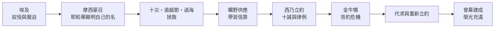
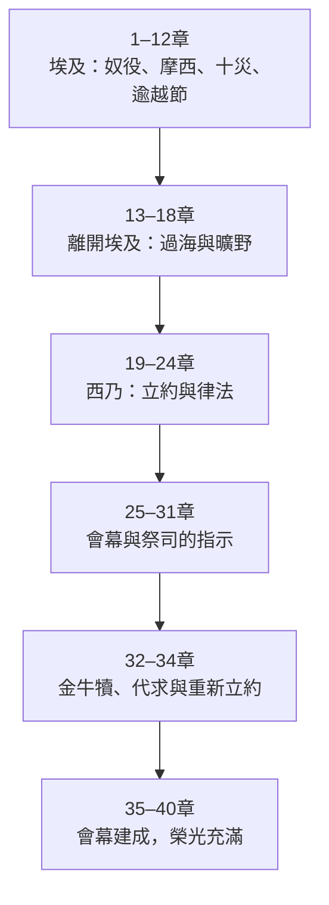
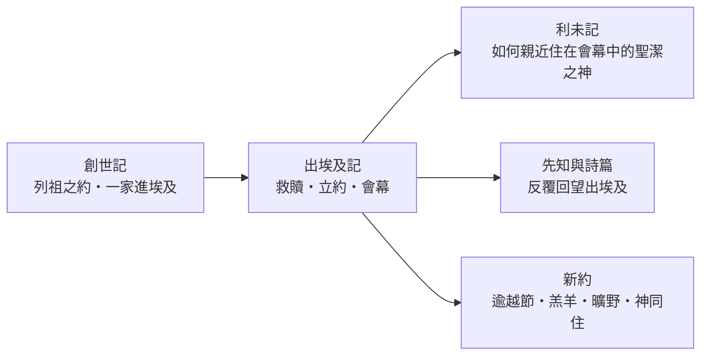

<!-- book-introduction-navigation:start -->
| [[02 出埃及記/全書目錄及綱要|全書目錄及綱要]] | [[02 出埃及記/第1章|開始讀第1章]] |
| :--- | ---: |
<!-- book-introduction-navigation:end -->

---

# 出埃及記

*從奴役到立約・從埃及到神住在百姓中間*

《出埃及記》接續《創世記》末尾以色列一家住在埃及的故事。數百年後，這個家族已成為受壓迫的族群；神呼召摩西，把百姓從法老權下領出來，帶到西乃山與祂立約。全書卻沒有停在「離開埃及」：後半部大量篇幅談律法、會幕與祭司，最後以耶和華的榮光充滿會幕收束。出埃及不是終點，而是為了讓一群被救贖的人學習成為神的百姓。

<!-- sources: CT00, GT00, KC0, BH, BIBLEPROJECT -->

---

## 一覽

| 項目 | 資料 |
| --- | --- |
| 位置 | 摩西五經第二卷；承接《創世記》，銜接《利未記》 |
| 章數 | 40 章 |
| 希伯來書名 | שְׁמוֹת（Shemot，「名字」），取自卷首「這些名字」 |
| 希臘／通行書名 | Exodus（「出去、離開」），指向以色列離開埃及 |
| 傳統作者歸屬 | 摩西 |
| 傳統成書框架 | 出埃及後的西乃／曠野時期；常置於主前十五至十四世紀 |
| 故事主要場景 | 埃及 → 曠野 → 西乃山 |
| 全書大主線 | 奴役 → 拯救 → 立約 → 會幕 → 神同住 |

<!-- sources: CT00, GT00, KC0, BH, BIBLEPROJECT, YALE -->

---

## 書名與位置

希伯來聖經以卷首的 **שְׁמוֹת（Shemot，「名字」）** 稱這卷書，因為開頭再次列出隨雅各下埃及的以色列眾子。這個名稱把《出埃及記》牢牢接在《創世記》後面：故事不是重新開始，而是繼續追蹤那個承受亞伯拉罕之約的家族。

希臘文名稱 **Exodus** 把焦點放在全書最著名的事件——「出去、離開」。但若只把本書理解成「逃離埃及」，會漏掉後半部。以色列被領出來，是為了進入與神的約、接受祂的教導，並在祂的同在中生活。

> [!note] 《出埃及記》真正的方向不是只有「離開」
> 全書的動線可以概括為：**離開法老的奴役 → 歸屬耶和華 → 與神立約 → 建造會幕 → 神住在百姓中間。**

<!-- sources: CT00, GT00, KC0, BH, BIBLEPROJECT -->

---

## 作者、年代與歷史背景

猶太教與基督教傳統把《出埃及記》列入摩西五經，並把摩西視為本書的主要作者。CT00、KingComments 與 BibleHub 都沿用這個傳統框架；書內也多次出現摩西奉命記錄事件或律法的敘述。按傳統年代理解，寫作背景放在出埃及後的西乃／曠野時期，常約定於主前十五至十四世紀。

現代五經研究則通常把《出埃及記》看成經過較長傳承與編整的文本。Enter the Bible 與 Yale 都提醒，敘事、律法、祭司與聖所材料可能反映不同時期的傳統；對這些材料的來源、組合方式與最終成書年代，學界沒有完全一致的重建。

另一個要分開的問題，是「出埃及事件若有歷史核心，應放在哪個年代」與「今天這卷文本何時形成」。學界對事件年代、規模、路線與考古證據都有持續討論；因此本導論不把某一個法老名字或單一年代寫成已確定的歷史事實。

故事本身從尼羅河流域的埃及開始，經過曠野到西乃。前半部呈現埃及帝國、奴役、災害與逃離；後半部則進入古代近東盟約、法律、祭祀與移動式聖所的世界。

| 要分開看的問題 | 本卷導論的處理 |
| --- | --- |
| 故事所描寫的年代 | 以色列在埃及受壓迫、離開埃及並抵達西乃；這是故事世界，不等同於文本成書年代。 |
| 傳統作者歸屬 | 摩西；傳統寫作背景多置於出埃及後的西乃／曠野時期。 |
| 現代成書研究 | 多階段傳承與編整；來源模型、歷史核心與最終成書年代仍有不同意見。 |
| 主要地理舞台 | 埃及 → 海邊／曠野 → 西乃山。 |

> [!important] 不要把三種年代混成一個問題
> 「摩西所處的年代」、「出埃及事件的歷史年代」與「現有文本最後形成的年代」可以彼此相關，卻不是同一件事。本專案分層呈現傳統作者歸屬、歷史背景研究與文本形成研究。

<!-- sources: CT00, GT00, KC0, BH, ENTER_THE_BIBLE, YALE -->

---

## 主旨：被救贖，為要成為神的百姓

《出埃及記》的前半部回答「神如何把百姓從奴役中救出來」。法老不只是一位政治統治者，也代表一個把人當工具、甚至以殺害嬰孩維持權力的秩序。神聽見百姓的哀聲，記念與亞伯拉罕、以撒、雅各所立的約，呼召摩西，藉十災、逾越節與過海把以色列帶出埃及。

拯救之後立刻出現第二個問題：「被救出來的人，要成為怎樣的群體？」因此故事在西乃進入立約、十誡與各樣律例。出埃及不是從一切約束中獲得自由，而是從法老的奴役轉入與耶和華的約，學習公義、敬拜與聖潔。

全書最後一大段把焦點放在會幕。金牛犢事件顯示，百姓即使已經蒙拯救，仍可能背叛；摩西代求、約得更新，會幕最終建成。第40章以神的榮光充滿會幕收束，將「神如何住在祂的百姓中間」推到下一卷《利未記》。

> [!summary] 一條線讀完整卷
> **拯救 → 立約 → 同住。** 神把百姓「從哪裡救出來」很重要，但祂要把百姓「帶到自己面前」同樣重要。

<!-- sources: CT00, GT00, BH, BIBLEPROJECT, ENTER_THE_BIBLE -->

---

## 本書的重要性與特色

《出埃及記》提供了聖經最重要的救贖語彙之一。之後先知、詩篇與新約反覆把「出埃及」當成理解神拯救工作的基本圖像；逾越節、過海、曠野、嗎哪、西乃、十誡、會幕，也成為後續聖經持續回看的核心記憶。

它同時把「神是誰」與「神做了什麼」連在一起。燃燒荊棘中神向摩西顯明自己的名；十災與過海顯明祂不是埃及權力的一部分；西乃之約則把神的拯救與百姓的倫理生活連在一起。

**敘事與律法互相解釋**  
1–18章回答「誰把你救出來」；19章以後回答「既然屬於這位神，你要如何生活與敬拜」。

**法老與耶和華形成強烈對照**  
法老以恐懼、奴役與死亡維持秩序；耶和華聽見哀聲、施行拯救、供應百姓並與他們立約。

**會幕篇幅非常大**  
25–31章是建造指示，35–40章是實際建造；中間插入金牛犢與重新立約，使「神能否住在這群百姓中間」成為後半卷真正張力。

**拯救記憶成為倫理理由**  
律法常以「你也曾在埃及作奴僕」提醒以色列：蒙過拯救的人，不能把同樣的壓迫複製到弱勢者身上。

<!-- sources: CT00, GT00, BH, BIBLEPROJECT, ENTER_THE_BIBLE, YALE -->

---

## 全書結構

《出埃及記》可以先用兩大場景掌握：**1–18章從埃及走到西乃；19–40章停留在西乃。** 前半卷以拯救與旅程為主，後半卷以立約、律法、背約危機與會幕為主。若要細讀，可再分成六段。

| 範圍 | 段落 | 內容重點 |
| --- | --- | --- |
| 1–12章 | 在埃及 | 受壓迫、摩西蒙召、十災與逾越節；神把百姓從法老權下帶出。 |
| 13–18章 | 從埃及到西乃 | 過海、曠野供應與試驗，百姓抵達神的山。 |
| 19–24章 | 西乃立約 | 十誡、約書與立約禮；以色列被呼召成為祭司的國度、聖潔的國民。 |
| 25–31章 | 會幕指示 | 會幕、器具、祭司與安息日等指示，焦點轉向神的同在。 |
| 32–34章 | 金牛犢與約的更新 | 百姓背約、摩西代求，神重新宣告自己的性情並更新約。 |
| 35–40章 | 會幕建造 | 百姓照吩咐完成會幕；榮光充滿，為《利未記》開場預備舞台。 |

<!-- sources: CT00, GT00, BH, BIBLEPROJECT, ENTER_THE_BIBLE, YALE -->

---

## 鑰節、鑰字與核心主題

若要抓住《出埃及記》，幾段經文特別像全書的樞紐：神在荊棘中宣告祂看見、聽見並要下來拯救；逾越節把拯救變成代代記念；第19章說明神救百姓出來的身份目的；第20章把律法建立在「我曾把你從埃及領出來」之上；第40章則以神的榮光住進會幕收束。

| 經文 | 在全書中的位置 |
| --- | --- |
| 出3:7–15 | 神聽見哀聲、呼召摩西並顯明自己的名；救贖行動從神的主動開始。 |
| 出12:1–14 | 逾越節把出埃及事件變成群體長久記念的救贖節期。 |
| 出19:4–6 | 說明被救出來的目的：歸屬神，成為祭司的國度、聖潔的國民。 |
| 出20:1–17 | 十誡；命令以前先宣告「我曾把你從埃及地領出來」。 |
| 出34:6–7 | 金牛犢危機後，神宣告自己的憐憫、公義與守約性情。 |
| 出40:34–38 | 榮光充滿會幕；整卷由奴役走到神同住。 |

**鑰字／重複線索：** 出來／領出、耶和華、記念、約、事奉／敬拜、聖潔、同在／榮光

- **救贖**：神聽見受苦者的呼求，把百姓從死亡與奴役中領出。
- **神的名與身份**：「耶和華是誰？」是法老與以色列都必須面對的問題；十災與西乃讓答案逐步展開。
- **立約與律法**：律法不是先於拯救的入場條件，而是蒙拯救的百姓在約中生活的方式。
- **同在**：從荊棘、雲柱火柱、西乃到會幕，神的同在一路推動故事。

<!-- sources: CT00, GT00, KC0, BH, BIBLEPROJECT -->

---

## 與前後書卷及整本聖經的關係

《出埃及記》直接承接《創世記》。創世記最後把雅各一家帶到埃及；出埃及記則把這個家族從埃及帶到西乃。神在第3章自稱是亞伯拉罕、以撒、雅各的神，使出埃及的拯救明確連回列祖之約。

本卷也直接把讀者送進《利未記》。出埃及記40章最醒目的問題是：神的榮光充滿會幕，連摩西都不能進去；利未記一開始，神便從會幕呼叫摩西，教導百姓如何藉祭祀、祭司、潔淨與聖潔生活親近祂。

往後整本聖經不斷重新使用出埃及圖像。先知會盼望新的拯救，詩篇會歌唱過海與曠野供應，新約以逾越節、羔羊、曠野、嗎哪與神住在人間等語言重新述說耶穌與救恩。

<!-- sources: CT00, GT00, KC0, BH, BIBLEPROJECT, YALE -->

---

> [!info]- 本頁來源與方法
>
> 本頁以 **CT00 的書卷提要節奏作為編排參考**；CT00、GT00、KC0、BH 是四套既有註釋來源，BibleProject、Enter the Bible、Yale 屬補強層，不加入四家共識票數。
>
> - **CT00**｜[CCBibleStudy 出埃及記提要](https://www.ccbiblestudy.org/Old%20Testament/02Exo/02CT00.htm)
> - **GT00**｜[CCBibleStudy 出埃及記導論拾穗](https://www.ccbiblestudy.org/Old%20Testament/02Exo/02GT00.htm)
> - **KC0**｜[KingComments — Exodus Introduction](https://www.kingcomments.com/en/bible-studies/Exo/0)
> - **BH**｜[BibleHub — Exodus Summary and Study Bible](https://biblehub.com/exodus/)
> - **BIBLEPROJECT**｜[BibleProject — Book of Exodus Guide](https://bibleproject.com/guides/book-of-exodus/)
> - **ENTER_THE_BIBLE**｜[Enter the Bible — Exodus](https://enterthebible.org/courses/exodus/)
> - **YALE**｜[Yale Bible Study — Exodus Introduction](https://yalebiblestudy.org/courses/exodus/lessons/introduction-study-guide/)
>
> GT00 是多家導論與研讀資料的合輯，使用其中個別觀點時必須保留子來源；BibleHub 即使整合多種底層資料，在本專案仍只算一個 BH 來源維度。作者、出埃及事件年代與文本成書問題若有分歧，本文按不同問題層次並列。

---

<!-- book-introduction-navigation:start -->
| [[02 出埃及記/全書目錄及綱要|全書目錄及綱要]] | [[02 出埃及記/第1章|開始讀第1章]] |
| :--- | ---: |
<!-- book-introduction-navigation:end -->
