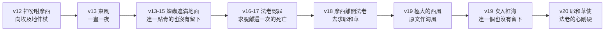
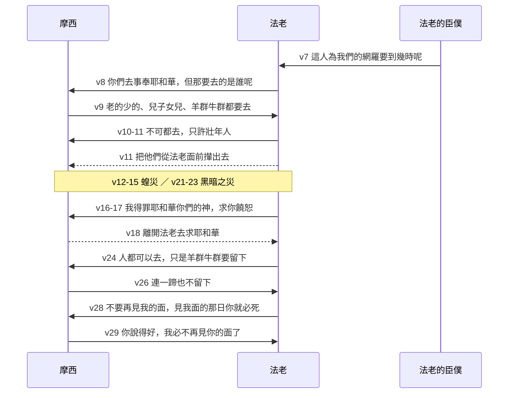

# 出埃及記 第10章

<!-- chapter-navigation:start -->
| [前一章](../02%20出埃及記/第9章.md) | [回目錄](../02%20出埃及記/全書目錄及綱要.md) | [下一章](../02%20出埃及記/第11章.md) |
| :--- | :---: | ---: |
<!-- chapter-navigation:end -->

1. [[耶和華的話臨到|耶和華對摩西說]]：你進去見[[法老]]。我使他和他臣僕的心[[法老心剛硬|剛硬]]，為要在他們中間顯我這些[[神蹟（miraculous signs）|神蹟]]，
2. 並要叫你將我向[[埃及]]人所做的事，和在他們中間所行的[[神蹟（miraculous signs）|神蹟]]，[[傳於後代|傳於你兒子和你孫子的耳中]]，[[耶和華聖名的啟示|好叫你們知道我是耶和華]]。
3. [[摩西]]、[[亞倫]]就進去見[[法老]]，對他說：[[希伯來人的神|耶和華─希伯來人的神]]這樣說：[[不肯自卑|你在我面前不肯自卑要到幾時呢]]？[[出埃及為要事奉神|容我的百姓去，好事奉我]]。
4. 你若不肯容我的百姓去，明天我要使[[蝗災|蝗蟲]]進入你的境內，
5. [[蝗災|遮滿地面]]，甚至看不見地，並且吃那冰雹所剩的和田間所長的一切樹木。
6. 你的宮殿和你眾臣僕的房屋，並一切[[埃及]]人的房屋，都要被[[蝗災|蝗蟲]]佔滿了；自從你祖宗和你祖宗的祖宗在世以來，直到今日，沒有見過這樣的災。[[摩西]]就轉身離開[[法老]]出去。
7. [[法老]]的臣僕對法老說：這人為我們的[[網羅]]要到幾時呢？容這些人去[[出埃及為要事奉神|事奉耶和華─他們的神]]吧！[[神的手段|埃及已經敗壞了]]，你還不知道嗎？
8. 於是[[摩西]]、[[亞倫]]被召回來見[[法老]]；法老對他們說：你們去[[出埃及為要事奉神|事奉耶和華─你們的神]]；但那要去的是誰呢？
9. [[摩西]]說：我們要和我們老的少的、兒子女兒同去，且把羊群牛群一同帶去，因為我們務要[[在曠野向神守節|向耶和華守節]]。
10. [[法老]]對他們說：我容你們和你們婦人孩子去的時候，耶和華與你們同在吧！你們要謹慎；因為有禍在你們眼前（或作：你們存著惡意），
11. 不可都去！你們這壯年人去[[出埃及為要事奉神|事奉耶和華]]吧，因為這是你們所求的。於是把他們從[[法老]]面前攆出去。
12. [[耶和華的話臨到|耶和華對摩西說]]：你向[[埃及]]地伸杖，使[[蝗災|蝗蟲]]到埃及地上來，吃地上一切的菜蔬，就是冰雹所剩的。
13. [[摩西]]就向[[埃及]]地伸杖，那一晝一夜，[[耶和華]]使[[東風與西風|東風]]颳在埃及地上；到了早晨，東風把[[蝗災|蝗蟲]]颳了來。
14. [[蝗災|蝗蟲]]上來，落在[[埃及]]的四境，甚是厲害；以前沒有這樣的，以後也必沒有。
15. 因為這[[蝗災|蝗蟲]]遮滿地面，甚至地都[[摸得著的黑暗|黑暗了]]，又吃地上一切的菜蔬和冰雹所剩樹上的果子。[[埃及]]遍地，無論是樹木，是田間的菜蔬，[[連一蹄也不留下|連一點青的也沒有留下]]。
16. 於是[[法老]]急忙召了[[摩西]]、[[亞倫]]來，說：我得罪[[耶和華]]─你們的神，又得罪了你們。
17. 現在求你，只這一次，饒恕我的罪，求[[耶和華]]─你們的神使我脫離這一次的死亡。
18. [[摩西]]就離開[[法老]]去求[[耶和華]]。
19. [[耶和華]]轉了極大的[[東風與西風|西風]]，把[[蝗災|蝗蟲]][[東風與西風|颳起]]，吹入[[海（紅海）|紅海]]；在[[埃及]]的四境連一個也沒有留下。
20. 但[[耶和華]]使[[法老]]的心[[法老心剛硬|剛硬]]，不容[[以色列|以色列人]]去。
21. [[耶和華的話臨到|耶和華對摩西說]]：你向天伸杖，使[[埃及]]地[[黑暗之災|黑暗]]；這[[摸得著的黑暗|黑暗似乎摸得著]]。
22. [[摩西]]向天伸杖，[[埃及]]遍地就烏黑了三天。
23. 三天之久，人不能相見，誰也不敢起來離開本處；惟有[[分別百姓|以色列人家中都有亮光]]。
24. [[法老]]就召[[摩西]]來，說：你們去[[出埃及為要事奉神|事奉耶和華]]；只是你們的羊群牛群要留下；你們的婦人孩子可以和你們同去。
25. [[摩西]]說：你總要把祭物和燔祭牲交給我們，使我們可以祭祀[[耶和華]]─我們的神。
26. 我們的牲畜也要帶去，[[連一蹄也不留下]]；因為我們要從其中取出來，[[出埃及為要事奉神|事奉耶和華]]─我們的神。我們未到那裡，還不知道用什麼事奉耶和華。
27. 但[[耶和華]]使[[法老]]的心[[法老心剛硬|剛硬]]，不肯容他們去。
28. [[法老]]對[[摩西]]說：你離開我去吧，你要小心，[[再見面必死|不要再見我的面]]！因為你見我面的那日你就必死！
29. [[摩西]]說：[[再見面必死|你說得好]]！我必不再見你的面了。

---

## 本章知識節點

### 人物
- [[摩西]]
- [[亞倫]]
- [[法老]]

### 地點
- [[埃及]]
- [[歌珊地]]
- [[海（紅海）]]

### 歷史
- [[十災]]
- [[蝗災]]
- [[黑暗之災]]
- [[法老四次妥協]]
- [[再見面必死]]
- [[東風（西洛可、卡姆辛）]]

### 神學
- [[耶和華]]
- [[希伯來人的神]]
- [[耶和華的話臨到]]
- [[出埃及為要事奉神]]
- [[神蹟（miraculous signs）]]
- [[法老心剛硬]]
- [[分別百姓]]
- [[代求]]
- [[神的手段]]
- [[耶和華聖名的啟示]]
- [[在曠野向神守節]]
- [[傳於後代]]
- [[連一蹄也不留下]]
- [[不肯自卑]]

### 原文
- [[以色列]]
- [[網羅]]
- [[摸得著的黑暗]]
- [[東風與西風]]

### 文化
- [[太陽神Ra（Amon-Re）]]

---

## 本章整理

本章記第八、第九兩災，也是摩西與[[法老]]正面交涉的最後一章——第29節之後兩人再見面時，法老的長子已經死了。全章的重心不在災本身，而在兩輪討價還價：法老先要扣住兒女，再要扣住牲畜，而摩西一次也沒有讓。

### 一、降災的目的：傳給下一代（v1-2）

第1節神差摩西再去，並先把理由說了出來：「我使他和他臣僕的心剛硬，為要在他們中間顯我這些神蹟。」CT 注意到這句話在原文前面還有一個「因為」，「說明摩西需要繼續與法老辦交涉的原因」；GT 丁良才則從第9章34節接上來——「法老的臣僕也先硬了自己的心」，次序沒有變，並歸納出一條規律：「法老和他的臣僕越固執，神所顯的神跡越多。」

真正新的東西在第2節。神說這一切要「[[傳於後代|傳於你兒子和你孫子的耳中]]」——[[神蹟（miraculous signs）|「神蹟」的原文是「記號」]]（CT），而記號是給人看、也是給人講的。GT《丁道爾》為這種做法命了名：「聖經對於這種『敘述式神學』很是看重」，並指出數算神勝利的作為「有激發信心的作用」。GT《啟導本》說得最短：「神顯奇事，還有教育下一代認識神的作用。」

> [!note] 「我向埃及人所做的事」原文是什麼意思
> GT《串珠聖經註釋》指出原意是「我戲弄埃及人的事」，「這表示神完全戰勝埃及，法老根本無法抵抗」。但 GT《丁道爾》立刻加上一個節制：「其中『戲侮』之概念，所著重的不是感受而是其結果。這是擬人法，用人的字眼來描述神的作為。就如詩篇中對神嗤笑的描寫一樣（詩2:4），不應該過分堅持其神學意義。」

KC 注意到一個呼應：先知約珥描寫蝗災時，也同樣吩咐要把這事傳下去——「你們要將這事傳與子，子傳與孫，孫傳與後代」（珥1:3）；他並提醒這不是單純的知識傳遞，「更要向他們指出：神在作工」（參詩78:3-4）。GT 丁良才則列出以色列人後來確實這樣做了：詩78、105、106篇，以及66:5-6、77:14-20、81:5-6、114:1-3、135:8-9、136:10-15。

### 二、蝗災的預告與臣僕的進諫（v3-7）

第3節的開場多了一問：「你在我面前[[不肯自卑|不肯自卑要到幾時呢]]？」GT《中文聖經註釋》指出這是要求的升級：「原文自卑是低頭，並可作敬拜的含義。這是對法老的一個進一步的要求。不單是要他認識、知道神是誰，現在甚至要他低頭了。」而「要到幾時」也不是修辭——GT 丁良才由此列出神忍耐罪人直到的四件事：「直到罪人悔改的機會完畢，直到罪人的惡貫滿盈，直到罪人的希望盡了（賽5:4），直到神的旨意成就」，並下結論：「由此可知神向罪人的忍耐也是有限的。」

接著是[[蝗災|蝗蟲]]的預告。GT《舊約聖經背景註釋》給的數字最能說明它為何可怕：「蝗蟲每日食量與本身體重相等。蝗群有時大得可以覆蓋四百平方哩，而每平方哩的蝗蟲更可以多達一億」——「無論有什麼逃脫了冰雹大難的，此時無疑都不能倖免。」GT《聖經精讀本》從原文補上規模：這個字的意思就是「成群」、「無數的大群」。KC 的觀察則從反面切入：「一隻蝗蟲微不足道，毫無威嚇，一腳就可以踩死。十二個探子中的十個，在不信中就是這樣看迦南的巨人（民13:33）。但成群的蝗蟲卻是壓倒性的、毀滅性的」——而神稱這一群為「祂的軍隊」（珥2:11、25）。GT《丁道爾》把它放進先知書的脈絡：「從阿摩司（摩7:1-3）而至約珥（珥1:1-7），可怖的蝗蟲都是眾先知末世預言中毀滅的象徵，又是神審判的描繪。」

宣告完，摩西「就轉身離開法老出去」。GT 丁良才解釋原因：「摩西知道法老仍是不懼怕神（9:30），所以沒有等候，看法老回答什麼。」KC 說得更短：他不等答覆。

第7節是全卷的一個政治轉折——法老的臣僕第一次開口。GT《中文聖經註釋》：「這是法老手下的人，首次開口勸法老低頭。這些人中，有的早已存敬畏的心聆聽神藉摩西所說的話了（9:20）。」他們稱摩西為[[網羅]]——CT 指出這個字「原用來抓捕鳥獸」——而《中文聖經註釋》讀出他們措辭的謹慎：「不敢直接說法老頑固，而說摩西是埃及人的網羅。」最後一句最重：「[[神的手段|埃及已經敗壞了]]，你還不知道嗎？」GT《串珠聖經註釋》一句話點破：「好像暗示所有埃及都知道了，惟獨法老仍茫然不知。」不過 GT《聖經精讀本》給了他們一個誠實的評價：「這種行為絕不是認可以色列的解救宣言，只不過是擔心埃及滅亡。」

> [!example]- 丁良才藉這件事講的四條進諫要理
> 「假若法老的臣僕起初就犯顏強諫，或者能免埃及所遭的災難，也未可知。凡能趁機以善策輔助上位者，應當留心以下四條要理：務須趁早，免得遲了無濟於事；言行必須前後相符；須知袖手旁觀與堅持中立都含危險；既盡忠告，仍當繼續催請免得在上者置之不理。」

### 三、第三次妥協：只准壯年人去（v8-11）

法老被臣僕說服，把摩西亞倫召了回來，開口第一句就是條件：「但那要去的是誰呢？」CT 指出這就是[[法老四次妥協|法老第三次的妥協]]——「允許成年男子離開，但老弱婦孺必須留下」，而用意很清楚：「這樣，以色列人就會自動的再回來，因為他們離不開自己的家人。」

這個提議的危險在於它並非全無道理。GT《丁道爾》把法老的立場攤開來說：從私人的角度看，他相信自己的建議合理；從實際的角度看，他有婦孺牲畜為質；從宗教的角度看，「只有成年男子才能全面參與古代的崇拜」——連後世的以色列也只有男丁須一年三次朝見耶和華（23:17）；從國家的角度看，這樣召集的男丁就是兵源。GT《串珠聖經註釋》分析出同樣的三層理由，《丁道爾》並補一句：「當時是男人的世界，但那是有其理由的。」

摩西的答覆一步不讓：「我們要和我們老的少的、兒子女兒同去，且把羊群牛群一同帶去，因為我們務要[[在曠野向神守節|向耶和華守節]]。」GT《中文聖經註釋》說明為什麼非全家不可：「這裏所說的守節，是一種朝聖的崇拜（13:6；利23:39；士21:19等），是全家大小可去的（撒上1:1-4）。在這朝聖的崇拜中，他們也要獻祭，因此就必須帶他們的牛群、羊群一同出去。」

> [!important] KC：撒但要的，是把孩子留下
> 「法老這第三個詭計，與父母和兒女的關係有關。他要讓男人去，卻要把兒女留在埃及作人質。父母在曠野守完了節，就會為著兒女的緣故回到埃及。他的提議，等於是在父母和兒女之間打進一根楔子。」
>
> 「撒但今天也照樣行。牠願意讓父母去忙主的事、讀主的話、去有神話語的聚會——但兒女不准參與。若撒但成功地抓住了兒女，父母很可能就回到世界、回到追求屬世事物的路上去……若撒但抓住了青年人，神的見證就失去了。然而，若事奉神和聚會真是像摩西在這裡所說的『一個節期』，那麼我們就會樂意帶著兒女同去，他們也會樂意在那裡。」
>
> GT 收錄的趙世光《聖經寶藏》講得更直接：撒但「既看見一家之中有某人信了主，牠便要竭力阻止他（她）的全家歸主……所以我們不但自己要信主，也要領導全家來歸主」（徒16:31）。

法老的回話是譏諷。「耶和華與你們同在吧！」——GT《中文聖經註釋》：「這並不是法老對以色列人的祝願，乃是潑辣的譏諷，甚至是恐嚇」；GT《串珠聖經註釋》譯出弦外之音：「意思是即使他准許他們去，也不會有神保護他們的。」接著的「你們要謹慎；因為有禍在你們眼前」是警告，==而談判以「把他們從法老面前攆出去」告終==。

### 四、第八災：蝗災（v12-20）

災的進與出都靠風，而且是相反方向的兩種風。

[[東風與西風|東風從哪裡來、西風往哪裡去]]，各家交代得很細。CT：「埃及的東邊是紅海和亞拉伯曠野」；GT《啟導本》：「埃及地三、四月間普遍吹東風，風帶來大群仍在發育期的蝗蟲幼蟲。蝗蟲多數在埃及以東的阿拉伯和西奈沙漠中繁殖，然後飛入埃及。」至於西風，GT《中文聖經註釋》先校正一個容易誤讀的地方：「原文的西風是『海風』。在以色列說『海』即地中海，是在西面，故通常譯為西」；GT《舊約聖經背景註釋》再從埃及的方位補正：「對埃及來說，這風應該來自北或西北，將蝗蟲吹回海中。」

GT《丁道爾》從這裡引出一個更長的觀察：「本節說明了創造萬物的神怎樣使用自然世界，普通的蝗蟲被視作神之鞭笞。東風將之從阿拉伯大草原吹來；最後西風又將牠們吹入海中。渡過紅海是神使用風浪的另一個案例（出14）」——而希伯來文的「風」字既可作「氣息」也可作「靈」，「日後『風』即是神『使者』的意念，大概便是從此而出」。至於蝗蟲被吹進的那片[[海（紅海）|「紅海」]]，GT《中文聖經註釋》指出「原文的紅海是『蘆葦海』，而不是紅海」，GT《啟導本》也記下原文作 yam sup。CT 的話中之光收在同一個「連一個也沒有」上：「神手的工作總是澈澈底底的，沒有留下一樣需要我們替祂補足的。」

第15節說蝗蟲多到「地都黑暗了」——GT《聖經精讀本》解釋這句話的畫面：「展開翅膀的蝗蟲群如同天上的雲，把陽光都遮住了，或者無數的蝗蟲在地上，弄得地面漆黑一片。」而牠們吃掉的，正是[[連一蹄也不留下|冰雹所剩的]]小麥和粗麥（9:32）——GT《中文聖經註釋》、《串珠》與丁良才都指出，9:31-32 那個括號寫的就是為了這一刻。

第16節法老第二次認罪（第一次在9:27）：「我得罪耶和華你們的神，又得罪了你們。」GT 丁良才注意到「你們的」三個字：「法老不認神為自己的神」，而且「法老求摩西替他祈求，自己卻不禱告」。他並列出法老得罪摩西亞倫的兩件事：屢次食言，以及第11節把他們攆出去。至於法老說的「這一次的死亡」是什麼，CT 與丁良才的答案一致：莊稼沒有了，必有大饑荒——他意識到蝗災會餓死許多埃及百姓。

> [!quote] 兩份材料對這次認罪的判語
> GT《串珠聖經註釋》：「法老再一次降服認罪，但他的悔改顯然仍是膚淺的，他只向災禍低頭而不是真心向耶和華悔改。」
>
> GT《丁道爾》給的定位更冷靜，也更扎人：「這一切記述並沒有將法老描繪為徹底墮落的怪物，他不過和以掃一樣，是個『屬世的』人；我們當引為鑑戒」——這種膚淺的悔改「不過是為逃避惡果」（來12:17）。
>
> KC 則指出時候已經過了：「他甚至求赦免。他看見死亡已經進了他的國土。但悔改的時候已經過去了……他已經讓他所定的時候過去了（耶46:17）。他不知道自己蒙眷顧的時候」（路19:44）。

摩西仍然[[代求|去求耶和華]]。CT 注意到一個細節：「這次摩西並沒有等到『出城』才求神（參9:29、33），表示蝗災極其嚴重」；丁良才則稱讚他的度量：「法老這一次雖沒有應許釋放以色列人，摩西仍是為他求耶和華……這樣足可顯出摩西忍耐的宏量，不靠法老的應許，也不諫責他，反倒准法老所求的，使災消去。」

### 五、第九災：黑暗之災（v21-23）

[[黑暗之災|這一災]]和第三、第六災一樣沒有預告。KC 指出它打的是誰：「這裡，那主要的神——太陽（Ra），光、熱和生命的源頭——被神的能力完全壓倒，籠罩在黑暗裡。」GT《舊約聖經背景註釋》從經文的重心得到同樣的結論：「經文將重點放在黑暗而非塵暴，可能表示這災所針對的，是埃及的國神、法老之父，太陽神亞孟─銳（Amon~Re）。」GT《每日研經叢書》把兩個大神連起來看：十災開頭打的是尼羅，「如今是另外一個，太陽，它顯得無力抵抗耶威和祂的代表的大能。這也是對法老最大的侮辱」，因為法老被視為太陽神亞曼拉的化身。GT《啟導本》則說明這在民間造成的恐慌：「古代埃及人視黑暗為惡神的天地，是大禍和死亡的預兆……[[太陽神Ra（Amon-Re）|埃及人信奉的太陽神『銳』（Ra）]]現在一點用處也沒有。」GT《聖經精讀本》另記下一條儀式細節：「埃及宮中每天早晨向著初升的太陽，擊鼓讚美，舉行盛大的敬拜儀式……但是連續三天的黑暗意味著埃及最高的太陽神沒有了。」

[[摸得著的黑暗|「這黑暗似乎摸得著」]]是什麼，各家的分歧就在「是不是自然現象」上，值得並陳。

| 立場 | 主張 | 主要理由 |
|---|---|---|
| 塵暴說 | 是喀新風（Khamsin，阿拉伯文「五十」之意）帶來的塵暴（見 [[東風（西洛可、卡姆辛）]]）——《啟導本》《舊約背景註釋》《丁道爾》《串珠》《每日研經叢書》《精讀本》 | 《舊約背景註釋》：「『這黑暗似乎摸得著』一語，表示黑暗是由浮在空氣中的東西造成的。尼羅河沖來沉積在岸邊的紅土，加上冰雹蝗蟲留下來的荒地，構成塵沙過剩……三日合乎一般的長度」 |
| 保留態度 | 《啟導本》雖列出喀新風說，卻自己保留 | 「記載中只提到黑暗，而且是『似乎摸得到』的烏黑，因此不能肯定就是這種『五十天風』」 |
| 反對自然解釋 | 《中文聖經註釋》 | 「經文全段都沒有一點與風沙或熱氣蒸人有關。因此我們相信此乃神大能的作為，而不是為摩西所利用的自然現象」 |

CT 也把兩種常見的猜測排除掉：「有人胡亂猜測將要發生日蝕，也有人猜是神使日月星辰暫時不發光，這些都是不符科學的想法。」經文自己只說了兩件事：黑暗「似乎摸得著」，並且持續三天；而「烏黑」二字，GT《串珠》與《丁道爾》都指出「在原文由兩個都解作黑暗之字組成」，是最強的語氣。

至於埃及人為何「誰也不敢起來離開本處」，GT《中文聖經註釋》給了兩層理由：一是燃料短缺，古代的黑夜本就任由黑暗；「更重要的是，埃及的宗教素有精靈之說，精靈是在黑暗中活動的」。丁良才則注意到另一件事：「當時以色列人若要逃走就有好機會，但神要叫法老親自釋放他們」（11:8）。

而[[分別百姓|「惟有以色列人家中都有亮光」]]。GT《啟導本》注意到光的範圍：「可見有亮光的不只是[[歌珊地]]，凡有以色列人住的房屋，都可以見到亮光。」GT《丁道爾》提出自然的可能：「以色列有『亮光』，可能是因為他們在沙暴範圍以外」；GT《中文聖經註釋》則堅持這是神蹟：「乃是神將他們和埃及人分別出來的緣故。」KC 從這裡讀出一個預表：在那三天黑暗中，[[以色列|以色列人]]家裡有一隻羊羔（12:3），這使人想起新耶路撒冷「城內的燈就是羔羊」（啟21:23）；主耶穌是「世界的光」（約8:12），信祂的人「必不住在黑暗裡」（約12:46）。GT《聖經精讀本》一句話收束：「埃及的黑暗象徵了神的震怒（啟16:10），而以色列的亮光則象徵了神的恩典」（弗5:8）。

### 六、第四次妥協與最後決裂（v24-29）

黑暗一過，法老立刻召摩西來，開出最後一個條件：人可以都去，「只是你們的羊群牛群要留下」。GT《串珠聖經註釋》指出這是抵押品，「迫使以色列人獻祭後返回埃及」；丁良才另提一個現實的動機：「埃及人的牲畜既然死了，以色列人的牲畜就越發值錢。」GT《丁道爾》則公允地保留：聖經沒有說明法老究竟是要人質，還是自己牲口損失慘重而想收回一些。

摩西的兩句回話都很重。第一句是「[[連一蹄也不留下]]」——CT：「表示凡屬以色列人的，法老無權剝奪」；丁良才讀出兩層：這些牲畜完全是以色列人的、不是法老的，而且這些牲畜也是神的。KC 把它拉到新約：「基督救贖了我們，因此祂對我們的所是和所有都有權利……我們不可把其中任何一樣留在世界裡」，並指出撒但退而求其次的策略——「若沒有別的路，撒但也願意讓我們去事奉神」，只要頌讚與感謝的靈祭沒有獻上（來13:15-16）。第二句是「我們未到那裡，還不知道用什麼[[出埃及為要事奉神|事奉耶和華]]」——CT 指出這句話有個很實際的原因：「此時神尚未頒布律法，連摩西自己也不知道獻祭的條例」；GT《聖經精讀本》把它提到原則的高度：「不像外邦宗教似的自己任選祭物，而是一切靠神的啟示，根據他的指示獻祭。」CT 的話中之光由此得出走路的原則：「神的帶領和啟示乃是漸進的，我們到了甚麼地步，就當照著甚麼地步行」（腓3:16）。

丁良才把法老一路的退讓排成五格，本章佔了最後兩格：

| # | 法老的話 | 出處 | 實質 |
|---|---|---|---|
| 一 | 我不釋放你們 | 5:2 | 全然拒絕 |
| 二 | 在這裡祭祀吧 | 8:25 | 不准出境 |
| 三 | 不要走得很遠 | 8:28 | 不准走遠 |
| 四 | 只許壯年人去 | 10:11 | 留下家眷 |
| 五 | 留下羊群牛群 | 10:24 | 留下產業 |

丁良才稱這五格為「魔鬼所用的詭計」（林後2:11）——每一格都比前一格讓得多，卻每一格都還扣著一樣東西。

談判在第28節破裂。法老說「[[再見面必死|你見我面的那日你就必死]]」，CT 的觀察很冷：「法老完全沒有想到，當他們彼此再見面時，死的不是摩西，而是他自己的長子」（12:29-31）。摩西答「你說得好」——GT《中文聖經註釋》讀出它的分量：「一向是摩西來見法老，向法老作要求。摩西的這話，是回敬法老：從今以後，我不再來求你了；但你來求我卻是例外。」至於第29節與12:31 表面上的矛盾，GT《丁道爾》處理得很誠實：「摩西和法老在盛怒之時所說的話，要斤斤計較是不公平的。摩西不過從法老所說的話中，看出他心中的剛愎，因而接受了最後審判是無可避免的事實。」而 GT《聖經精讀本》指出本章結尾少了一樣東西：「在以往的災難中都有過為法老的代禱（8:29；9:29；10:18），但是這一次連代禱都沒有了。當摩西停止代禱的時候，留給法老的只有滅亡。」

### 兩輪交涉的往返

本章的結構其實是兩場同型的談判：災前一輪、災後一輪，而每一輪都以法老加一個條件、摩西拒絕、關係更惡化收場。

### 本章兩災對付的埃及神明

CT 的靈訓要義為這兩災各定了一個對手：

| 災 | CT 定的對手 | 逆轉 |
|---|---|---|
| 八、蝗災（v1-20） | 埃及的莊稼之神 | 東風颳來蝗蟲，吃盡一切青綠的樹木、果子、菜蔬——剝奪人們所賴以存活的食物 |
| 九、黑暗之災（v21-29） | 埃及的太陽神 | 黑暗籠罩埃及遍地達三天之久，唯獨以色列所在之地有亮光 |

而本章最後留下的，是一個沒有得到答案的問題。神在第3節問「你在我面前不肯自卑要到幾時呢」，法老在第7節被臣僕勸、第16節認了罪、第24節讓到只剩牛羊，卻在第27節仍舊剛硬，第28節以死威脅[[摩西]]。丁良才所列神忍耐的四個界限——悔改的機會完畢、惡貫滿盈、希望盡了、旨意成就——在本章一一逼近；[[亞倫]]全章沒有一句話，[[耶和華的話臨到|神的話]]也從三次宣告轉為兩次施行的命令。談判結束了，剩下的只有[[耶和華]]自己的行動。

**參考資料**
https://www.ccbiblestudy.org/Old%20Testament/02Exo/02CT10.htm
https://www.ccbiblestudy.org/Old%20Testament/02Exo/02GT10.htm
https://www.kingcomments.com/en/bible-studies/Exo/10
https://biblehub.com/study/exodus/10.htm

<!-- chapter-navigation:start -->
| [前一章](../02%20出埃及記/第9章.md) | [回目錄](../02%20出埃及記/全書目錄及綱要.md) | [下一章](../02%20出埃及記/第11章.md) |
| :--- | :---: | ---: |
<!-- chapter-navigation:end -->
