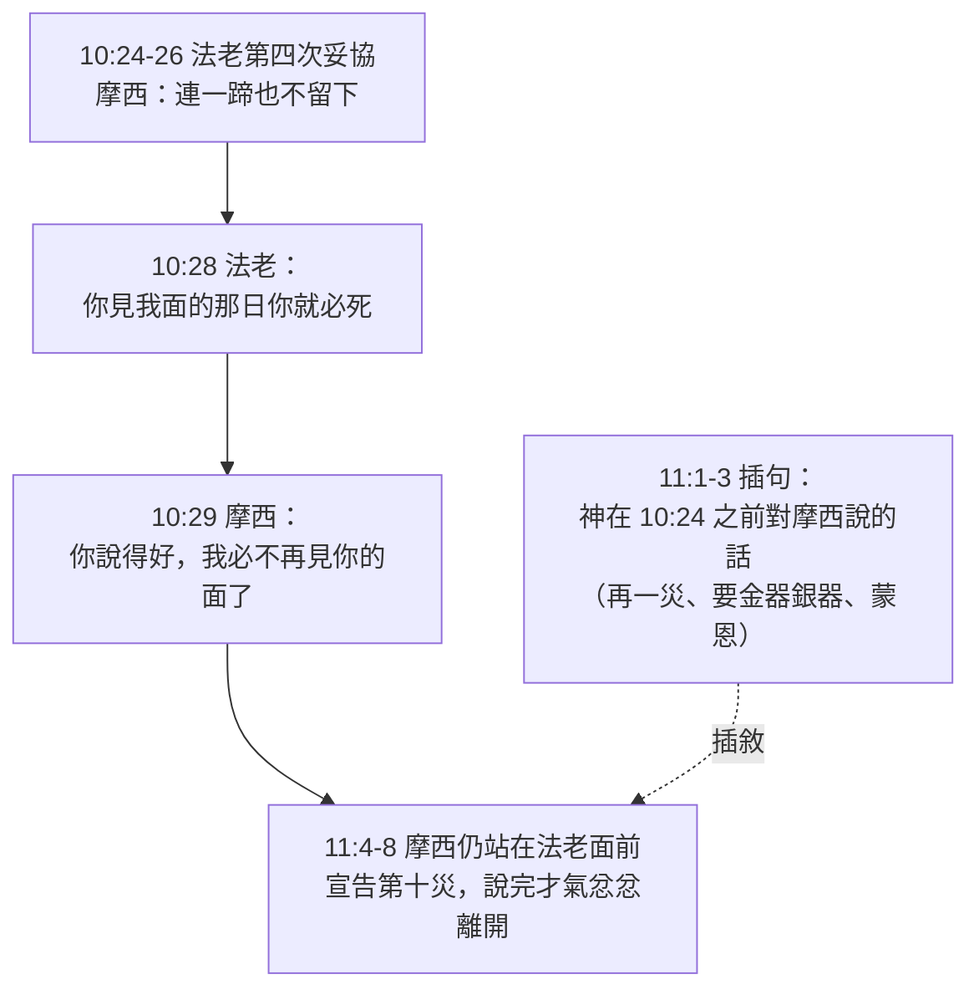
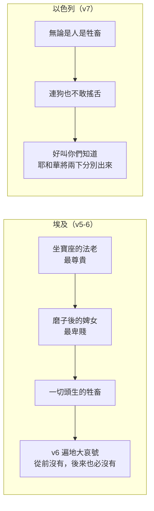

# 出埃及記 第11章

1. [[耶和華的話臨到|耶和華對摩西說]]：我再使一樣的[[災殃]]臨到[[法老]]和[[埃及]]，然後他必容你們離開這地。他容你們去的時候，總要[[催逼]]你們都從這地出去。
2. 你要[[傳於後代|傳於百姓的耳中]]，叫他們男女各人[[埃及人給以色列人財物|向鄰舍要金器銀器]]。
3. [[耶和華]]叫百姓在[[埃及]]人眼前蒙恩，並且[[摩西]]在埃及地、[[法老]]臣僕，和百姓的眼中[[摩西看為極大|看為極大]]。
4. [[摩西]]說：[[耶和華]]這樣說：[[約到半夜]]，我必出去巡行[[埃及]]遍地。
5. 凡在[[埃及]]地，從坐寶座的[[法老]]直到[[磨子後的婢女]]所有的長子，以及一切頭生的牲畜，都必死。
6. [[埃及]]遍地必有大哀號；從前沒有這樣的，後來也必沒有。
7. 至於以色列中，無論是人是牲畜，[[狗不敢搖舌|連狗也不敢向他們搖舌]]，好叫你們[[知道我是耶和華|知道耶和華是將埃及人和以色列人分別出來]]。
8. 你這一切臣僕都要俯伏來見我，說：求你和跟從你的百姓都出去，然後我要出去。於是，[[摩西]][[氣忿忿]]地離開[[法老]]，出去了。
9. [[耶和華的話臨到|耶和華對摩西說]]：[[法老]]必不聽你們，使我的[[神蹟（miraculous signs）|奇事]]在[[埃及]]地多起來。
10. [[摩西]]、[[亞倫]]在[[法老]]面前行了這一切奇事；[[耶和華]]使[[法老心剛硬|法老的心剛硬]]，不容[[出埃及為要事奉神|以色列人出離他的地]]。

---

## 本章知識節點

### 人物
- [[摩西]]
- [[亞倫]]
- [[法老]]
- [[摩西看為極大]]

### 地點
- [[埃及]]

### 歷史
- [[第十災（殺長子之災）]]
- [[長子之死]]
- [[催逼離開]]
- [[埃及人給以色列人財物]]
- [[摩西氣忿忿離開法老]]

### 神學
- [[耶和華]]
- [[耶和華的話臨到]]
- [[法老心剛硬]]
- [[分別百姓]]
- [[神蹟（miraculous signs）]]
- [[傳於後代]]
- [[出埃及為要事奉神]]
- [[知道我是耶和華]]

### 原文
- [[災殃]]
- [[催逼]]
- [[磨子後的婢女]]
- [[狗不敢搖舌]]
- [[氣忿忿]]
- [[約到半夜]]

### 解經爭議
- [[第11章的敘事次序]]

### 互文
- [[創十五14 亞伯拉罕之約的財物應驗|創15:14 帶著許多財物出來的應許]]
- [[詩七八51、一三六10 擊殺長子|詩78:51、136:10 詩篇回顧擊殺長子之夜]]

---

## 本章整理

本章是十災的最後通牒。前九災都是神藉[[摩西]]、[[亞倫]]的手施行，第十災卻不同——神說「我必出去」，祂要親自下來。全章只有十節，卻同時放了三樣東西：一段插敘的背景（v1-3）、一段對[[法老]]的最後宣告（v4-8），以及一段回望九災的總結（v9-10）。

### 一、這一章的時序是倒敘（v1-3）

讀本章第一個要處理的是次序問題。第10章29節摩西才說「我必不再見你的面了」，第4節他卻又開口對法老說話——[[第11章的敘事次序|六份材料給了同一個答案]]：第1-3節是插進來的，第4-8節接的是10:29，摩西根本沒有離開過。

CT 說得最明白：「按照4~8節的內容，這些話應當接續在十29的後面，而本章1~3節則是插進來的話。」GT《串珠聖經註釋》從編排原則解釋：「本章的編排是按課題內容而不是按時間的先後次序。」GT《聖經精讀本》給了一個目的性的評價：「如此超越時間，根據救贖史的目的來協調內容，是記錄聖經的又一特徵。」KC 把它讀成一個括號：「在一種括號裡，我們讀到神在摩西最後一次去見法老以前對他說的話。」認出這一點之後，第8節的怒氣才有著落——它接的是10:28 的死亡威脅。

「我再使一樣的[[災殃]]臨到法老和埃及」——GT《中文聖經註釋》注意到一個原文細節：「這裏的災殃，原文和九14的災殃，並不是同一個字」；GT《串珠聖經註釋》說它「在原文可直譯為『打擊』」。而災的結果，經文用的是另一個很重的字：[[催逼|「總要催逼你們都從這地出去」]]。GT《中文聖經註釋》：「原文的催逼，是含有無法容忍而以暴力驅趕的意思」；GT《啟導本》另給一個生動的譯法：「原文也可作『他要像打發不要了的新婦一樣，給她厚禮送她走』」，並說明動機——「法老巴不得把以色列人一齊趕掉，以絕後患」。CT 的話中之光把這個轉折讀成一則警語：「從『不容』到『催逼』，全因受不了神的懲罰，被迫轉變態度……不見棺材不流淚，不到最後關頭不醒悟。」

> [!note] [[埃及人給以色列人財物|「向鄰舍要金器銀器」是搶奪嗎]]
> 四份材料給了三層理由，彼此互補。
>
> **未付的工資。** KC：「這是他們和他們祖先在埃及作奴僕、多年勞苦所未曾支領的工錢。」丁良才也說神這樣吩咐「有兩個緣故：作他們的工價、後來要造會幕」。
>
> **會幕的材料。** CT：「一方面許可以色列人取回長時期奴工的工資，另一方面為後來所要建造的會幕材料預先準備」（25:3；35:24）。
>
> **埃及人是願意給的。** GT《丁道爾》：「討論這樣做是否欺詐是失當的，因為埃及樂於付出任何代價來使他們離開」（12:33）；GT《舊約聖經背景註釋》從節期的角度補上一層：「以色列要慶祝他們神的節期。在這種場合穿著華麗是理所當然的事，以色列人是奴隸，沒有這種奢侈品也不足為奇。埃及人此時必然已經因這些災禍瀕臨絕望，想到或能藉此平息以色列神的怒氣，因此十分願意合作。」
>
> CT 另劃了一條界線：「神容許以色列人向埃及人索取金銀財物，並不是表示神容讓祂的兒女平時可以貪圖和搶奪別人的財物」（20:17；提前6:10）。而 BH 指出這一幕本身就是[[創十五14 亞伯拉罕之約的財物應驗|創15:14 的應驗]]：曾是奴隸的人，如今有資格向主人開口。

第3節下半是全卷唯一一次從埃及人的角度給摩西下的定位：「[[摩西看為極大|摩西在埃及地、法老臣僕，和百姓的眼中看為極大]]。」GT《串珠聖經註釋》讀出的是懼怕，GT《啟導本》兩者兼取——「對摩西又敬又怕」。至於他為何被看為極大，GT《丁道爾》列出兩個可能：神蹟，或是民眾記得他在王室長成；而 GT《中文聖經註釋》給的理由完全不同，是品格——「他沒有因法老的固執而求神降瘟疫，一次就把全埃及人滅掉。乃是逐步的緊迫法老就範，以致法老的臣僕對其國王的作為也看不過眼而加勸諫（10:7）」。至於這句話算不算自誇，GT 收錄的賈斯樂郝威〈命題16〉正面問了這一題，而丁良才的回答很簡單：「摩西並沒有說他自己是極大，只說埃及人看他為極大。」

### 二、長子之死的宣告（v4-8）

「[[約到半夜]]，我必出去巡行埃及遍地。」這一句同時定了時間與施行者，而兩者都是本章獨有的。

時間上，GT《丁道爾》指出中文與英文譯本都譯得太鬆：「『約在』似乎表示在時間上頗為模糊。但希伯來文卻沒有模糊的意思，『正在半夜』才是正確的翻譯」，並補一句——「逾越節是以色列惟一在夜間慶祝的節期」。至於是哪一夜，GT《中文聖經註釋》說「12:25-27 告訴我們，就是逾越節那晚」；GT《聖經精讀本》從預備時間推算，指出不會是宣告後的第二夜，「因為逾越節的小羊羔至少要提前4天準備」。丁良才則從法老的角度看這個模糊：「摩西也沒有說明是哪一天的半夜，無非是叫埃及人越發心驚膽寒，寢食不安。」

施行者上，CT 一句話點明：「『我』指耶和華神自己；『巡行』意指親臨。」GT《聖經精讀本》說明差別：「現在為止的災難卻是通過摩西和亞倫施行的，而第10次災難神要親自下到埃及。」而 GT《舊約聖經背景註釋》從埃及人自己的節期習俗讀出一層反諷：「埃及主要節期中最重大、最是眾所期待的一件事，是神明出來到百姓中間。然而以色列的神巡行埃及遍地，卻是為審判而來。」

[[長子之死|為什麼打的是長子]]，各家給了四條理由，方向各不相同。

| 角度 | 說法 | 出處 |
|---|---|---|
| 報應 | 「法老既然除滅了神的長子，神也要除滅法老的長子（4:22-23）。人種的是什麼，收的也必是什麼（加6:7）」 | GT 丁良才 |
| 家族的盼望 | 「長子是力量的象徵……屬血氣之人的一切指望都集中在長子身上，所以神藉著擊打他們的長子，把他們一切的指望都打碎了」 | KC |
| 神性與王位 | 「他的『父』太陽神在第九災被擊敗，如今他的兒子──可能甚至是繼位的太子──更被宰殺。這對於法老本人、王位、神性，都是打擊」 | GT《舊約聖經背景註釋》 |
| 救恩的預表 | 「長子預表出於亞當的己生命，本該死於罪中，但因基督在十字架上代替我們擔罪而死，才得免去滅亡」（羅8:29；來2:10） | CT |

而災的範圍，經文用了兩個極端來標示：「從坐寶座的法老直到[[磨子後的婢女]]所有的長子。」GT《舊約聖經背景註釋》介紹了那個工具：「本節中的手磨又稱鞍磨（saddle-quern），是由兩塊磨石製成」，而推磨的婢女「被視為社會最低下的階層」；GT《聖經精讀本》補上它為何最卑賤：「轉石磨是最累的重勞動之一，是僕人、俘虜（賽47:2）和囚犯（士16:21）所做的工作。」至於連牲畜的頭生也算在內，GT《中文聖經註釋》給了三個理由：法老曾想把以色列人的牛群羊群留下作抵押品、要使埃及人在財物上有所損失、「更因為埃及人把有些牲畜看作神靈」。

> [!question] 這一災在生理上是什麼
> 只有 GT《丁道爾》認真討論了這個問題，而且態度很誠實。它先問「一切」該怎麼讀：「究竟本節的『一切』真是指所有人，還是和九章6節等經文一樣，不過是個概括性的詞彙呢？」再提出一個推測：「神這時所用的，可能是祂日後懲罰大衛的那種疫病（撒下24章）……鼠疫和小兒痲痺症（後者專門侵襲兒童），都有人提出可能是當時發生的疾病。」但它同時承認經文的重點不在這裡：「埃及突然失去最優秀的青年，其中包括了將要繼位的太子（法老的長子），是很大的打擊。只有這樣大的災禍，才能解釋法老的反應。」
>
> GT《每日研經叢書》則從埃及人的死亡觀給了一個更深的說明：「古代民族中，可能沒有比埃及人更為迷於死亡。祭司身份的實際權力，乃在被視為確有能力，保證死者平安到達阿西利斯神所仁慈統治的西天。這可怕的災殃蔑視一切理性的解釋，顯示出耶威不只是自然力之主，也是生死之主。」

第6節說「埃及遍地必有大哀號」——GT《丁道爾》把這個字串成全卷的一條線：「大哀號，是本書的另一主題。以色列向耶和華『哀求』拯救（出2:23），後來他們又在極度痛苦中向法老『哀求』，卻得不應允（出5:15）。如今卻輪到了埃及人在神審判的痛苦中『哀求』。」而第7節是它的反面：以色列那邊安靜到「連[[狗不敢搖舌|狗也不敢向他們搖舌]]」。

GT《舊約聖經背景註釋》說明這句話為何有力：「當時的狗無人飼養，且被視為不受歡迎之物，大概和今日的老鼠差不多。狗也不吠表示非常的平靖，因為這些流浪惡犬的脾氣是一觸即發的。」GT《聖經精讀本》的對照最貼近生活：「如果養狗的人家發生什麼事情，那麼第一個有反應的肯定是那家的狗。但是與埃及震天的哭聲相反，以色列的家庭由於有神同在，所以連狗都會安然入睡。」這是十災中[[分別百姓|「分別」]]的最後一次宣告——「好叫你們[[知道我是耶和華|知道耶和華是將埃及人和以色列人分別出來]]」；不過丁良才立刻加了一句要緊的話：==以色列人平安出埃及「不是因他們的善良，乃是出於神的恩典，又因著羊羔的血」==（12:7、13、21、23）。

第8節摩西說完最後一句就走了。CT 的原文字義指出「[[氣忿忿]]」的字義是「鼻孔，怒氣」；[[摩西氣忿忿離開法老|這一次是他自己走的]]——KC：「這一次法老沒有機會把摩西趕走，而是摩西自己離去。他對法老再沒有半點膽怯或懼怕。他與神相交，因此對法老的罪充滿了聖潔的憤慨。」丁良才數出三個緣由：法老藐視神、虐待以色列人、得罪摩西；他並為這種怒氣作了一個平衡的辯護：「保羅雖說信徒當除掉一切的忿怒（弗4:31；西3:8），但也說信徒生氣卻不要犯罪（弗4:26）」，而「摩西與法老說話還是制服了自己的心」（箴16:32）。GT《中文聖經註釋》讀出這一幕的權柄逆轉：法老下令不准他再來見面，「摩西卻回敬以『你這一切臣僕都要俯伏來見我』」——「意思是，到時不是你法老作主，也不是你法老說話了」。而 GT《聖經精讀本》給這一幕下了一個很沉的註腳：「這意味著，能與神聯繫的唯一的中保之路被斷絕，對於法老來說剩下的只有死亡。」

### 三、回望九災的總結（v9-10）

最後兩節退開一步看整件事。GT《啟導本》把兩節的用詞分得很細：第9節「『我的奇事』指就要施行的第十災和以色列人的獲得自由。這是耶和華神直接行的奇事」；第10節「『這一切奇事』指摩西與亞倫參與過的先前的九災」。GT《串珠聖經註釋》所作的區分與此相同，兩者都把第九節歸給神親自要行的那一件。至於這兩節在全章的功能，GT 丁良才一句話收束：「這兩節總論以上的九災。」

KC 從第9節讀出神的用意：「神告訴摩西，為什麼法老不會聽他，儘管他和亞倫在法老面前行了這一切神蹟。神要賜下豐盛的神蹟，作祂能力的見證。至於法老，這一切都是徒然——人若不肯聽，神就能用他的不肯，向每一個願意看的人顯明祂的能力，作一個警告的見證。」而[[法老心剛硬|「耶和華使法老的心剛硬」]]這句話，GT 收錄的《靈修版》守住了一貫的界線：「神真的使法老的心剛硬，強迫他做錯事嗎？……法老不肯回心轉意，神就任憑他作驕傲的抉擇，使他嘗到自己行為的苦果。神並沒有強迫法老棄絕祂，反而一再留有餘地，使他回轉。神說：『我斷不喜悅惡人死亡』」（結33:11）。

本章因此停在一個很奇特的位置上：宣告已經說完，中保已經離席，而[[第十災（殺長子之災）|那一災]]還沒有發生。GT《中文聖經註釋》為它下的定位最準：「這一章是最後災禍臨到之前的囑咐（囑咐以色列人應做的）和警告（警告法老和埃及人將要殺其頭生的）。」下一章開始的，不再是交涉，而是預備。

**參考資料**
https://www.ccbiblestudy.org/Old%20Testament/02Exo/02CT11.htm
https://www.ccbiblestudy.org/Old%20Testament/02Exo/02GT11.htm
https://www.kingcomments.com/en/bible-studies/Exo/11
https://biblehub.com/study/exodus/11.htm
