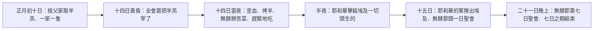
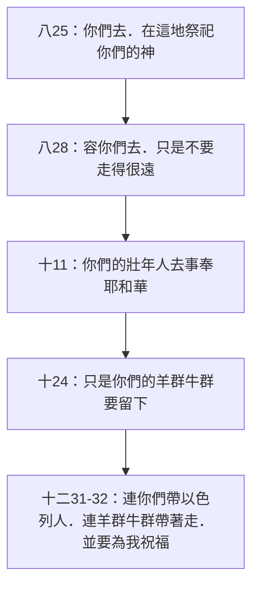

# 出埃及記 第12章

<!-- chapter-navigation:start -->
| [前一章](../02%20出埃及記/第11章.md) | [回目錄](../02%20出埃及記/全書目錄及綱要.md) | [下一章](../02%20出埃及記/第13章.md) |
| :--- | :---: | ---: |
<!-- chapter-navigation:end -->

1. [[耶和華的話臨到|耶和華在埃及地曉諭]][[摩西]]、[[亞倫]]說：
2. 你們要[[以本月為正月]]，[[以本月為正月|為一年之首]]。
3. 你們吩咐以色列全會眾說：本月初十日，各人要[[一家一隻|按著父家取羊羔]]，[[一家一隻]]。
4. 若是一家的人太少，吃不了一隻羊羔，本人就要和他隔壁的鄰舍共取一隻。你們預備羊羔，要按著人數和飯量計算。
5. 要無殘疾、一歲的公羊羔，你們或從綿羊裡取，或從山羊裡取，都可以。
6. 要留到本月十四日，[[在黃昏的時候]]，以色列全會眾把[[逾越節羔羊|羊羔]]宰了。
7. 各家要取點[[逾越節血記|血]]，塗在吃羊羔的房屋左右的門框上和門楣上。
8. 當夜要吃羊羔的肉；用火烤了，與[[無酵餅]]和[[苦菜]]同吃。
9. 不可吃生的，斷不可吃水煮的，要帶著頭、腿、五臟，用火烤了吃。
10. 不可剩下一點留到早晨；若留到早晨，要用火燒了。
11. 你們吃羊羔當[[逾越節的吃法|腰間束帶，腳上穿鞋，手中拿杖，趕緊地吃]]；這是[[逾越（Pesach）|耶和華的逾越節]]。
12. 因為那夜我要巡行[[埃及]]地，把埃及地一切頭生的，無論是人是牲畜，都擊殺了，又要[[耶和華敗壞埃及一切神|敗壞埃及一切的神]]。[[知道我是耶和華|我是耶和華]]。
13. 這血要在你們所住的房屋上作記號；我一見這血，就[[逾越（Pesach）|越過你們]]去。我擊殺埃及地頭生的時候，[[災殃]]必不臨到你們身上滅你們。
14. 你們要記念這日，守為[[逾越節定為永遠定例|耶和華的節]]，作為你們世世代代[[傳於後代|永遠的定例]]。
15. 你們要吃[[無酵餅]]七日。頭一日要把酵從你們各家中除去；因為從頭一日起，到第七日為止，凡吃有酵之餅的，必[[從以色列中剪除]]。
16. 頭一日你們當有[[聖會]]，第七日也當有聖會。這兩日之內，除了預備各人所要吃的以外，無論何工都不可做。
17. 你們要守[[無酵節]]，因為我正當這日把你們的[[以色列人的軍隊|軍隊]]從[[埃及]]地領出來。所以，你們要守這日，作為世世代代[[傳於後代|永遠的定例]]。
18. 從[[亞筆月|正月]]十四日晚上，直到二十一日晚上，你們要吃[[無酵餅]]。
19. 在你們各家中，七日之內不可有酵；因為凡吃有酵之物的，無論是[[寄居的|寄居的]]，是本地的，必[[從以色列中剪除|從以色列的會中剪除]]。
20. 有酵的物，你們都不可吃；在你們一切住處要吃[[無酵餅]]。
21. 於是，[[摩西]]召了以色列的眾長老來，對他們說：你們要按著家口取出[[逾越節羔羊|羊羔]]，把這[[逾越節]]的羊羔宰了。
22. 拿一把[[牛膝草]]，蘸盆裡的血，打在門楣上和左右的門框上。你們[[誰也不可出自己的房門]]，[[誰也不可出自己的房門|直到早晨]]。
23. 因為[[耶和華]]要巡行擊殺埃及人，他看見血在門楣上和左右的門框上，就必[[逾越（Pesach）|越過]]那門，不容[[滅命的]]進你們的房屋，擊殺你們。
24. 這例，你們要守著，作為你們和你們子孫[[傳於後代|永遠的定例]]。
25. 日後，你們到了[[耶和華]]按著所應許賜給你們的那地，就要守這禮。
26. 你們的兒女問你們說：行這禮是什麼意思？
27. 你們就說：這是獻給耶和華[[逾越節|逾越節的祭]]。當以色列人在[[埃及]]的時候，他擊殺埃及人，越過以色列人的房屋，[[救贖|救了我們各家]]。於是百姓低頭下拜。
28. [[耶和華]]怎樣吩咐[[摩西]]、[[亞倫]]，以色列人就怎樣行。
29. 到了半夜，[[耶和華]]把[[埃及]]地所有的[[長子之死|長子]]，就是從坐寶座的[[法老]]，直到被擄囚在監裡之人的長子，以及一切頭生的牲畜，[[神為何擊殺埃及眾長子|盡都殺了]]。
30. [[法老]]和一切臣僕，並[[埃及]]眾人，夜間都起來了。在埃及有大哀號，[[第十災（殺長子之災）|無一家不死一個人的]]。
31. 夜間，[[法老]]召了[[摩西]]、[[亞倫]]來，說：[[法老召摩西|起來！連你們帶以色列人，從我民中出去]]，依你們所說的，[[出埃及為要事奉神|去事奉耶和華]]吧！
32. 也依你們所說的，連羊群牛群帶著走吧！並要為我祝福。
33. [[埃及]]人[[催逼離開|催促]]百姓，打發他們快快出離那地，因為埃及人說：我們都要死了。
34. 百姓就拿著沒有酵的生麵，把[[爐灶和摶麵盆|摶麵盆]]包在衣服中，扛在肩頭上。
35. 以色列人照著[[摩西]]的話行，[[埃及人給以色列人財物|向埃及人要金器、銀器]]，和衣裳。
36. [[耶和華]]叫百姓在埃及人眼前[[分別百姓|蒙恩]]，以致埃及人給他們所要的。他們就把[[埃及人給以色列人財物|埃及人的財物奪去了]]。
37. 以色列人從[[蘭塞]]起行，往[[疏割]]去；除了婦人孩子，[[六十萬人的數目|步行的男人約有六十萬]]。
38. 又有許多[[閒雜人]]，並有羊群牛群，和他們一同上去。
39. 他們用[[埃及]]帶出來的生麵烤成[[無酵餅]]。這生麵原沒有發起；因為他們被[[催逼離開|催逼離開埃及]]，不能耽延，也沒有為自己預備什麼食物。
40. 以色列人住在[[埃及]]共有[[四百三十年]]。
41. 正滿了[[四百三十年]]的那一天，[[神的主權與預定|耶和華的軍隊都從埃及地出來了]]。
42. 這夜是[[耶和華]]的夜；因耶和華領他們出了[[出埃及|埃及地]]，所以當向耶和華謹守，是以色列眾人世世代代該謹守的。
43. [[耶和華的話臨到|耶和華對摩西、亞倫說]]：[[逾越節條例（外邦人與寄居者）|逾越節的例是這樣]]：外邦人都不可吃這羊羔。
44. 但各人用銀子買的奴僕，既受了[[割禮作為立約記號|割禮]]就可以吃。
45. [[寄居的|寄居的和雇工人]]都不可吃。
46. 應當在一個房子裡吃；不可把一點肉從房子裡帶到外頭去。[[基督預表（逾越節羔羊）|羊羔的骨頭一根也不可折斷]]。
47. 以色列全會眾都要守這禮。
48. 若有外人寄居在你們中間，願向[[耶和華]][[逾越節|守逾越節]]，他所有的男子務要受[[割禮作為立約記號|割禮]]，然後才容他前來遵守，他也就像本地人一樣；但未受割禮的，都不可吃這羊羔。
49. 本地人和寄居在你們中間的外人同歸一例。
50. [[耶和華]]怎樣吩咐[[摩西]]、[[亞倫]]，以色列眾人就怎樣行了。
51. 正當那日，[[耶和華]]將以色列人按著他們的[[以色列人的軍隊|軍隊]]，從[[埃及]]地領出來。

---

## 本章知識節點

### 主題
- [[以本月為正月]]
- [[一家一隻]]
- [[誰也不可出自己的房門]]
- [[割禮作為立約記號]]

### 歷史
- [[逾越節]]
- [[逾越節羔羊]]
- [[逾越節血記]]
- [[逾越節的吃法]]
- [[無酵節]]
- [[逾越節定為永遠定例]]
- [[逾越節條例（外邦人與寄居者）]]
- [[第十災（殺長子之災）]]
- [[長子之死]]
- [[法老召摩西]]
- [[催逼離開]]
- [[埃及人給以色列人財物]]
- [[出埃及]]
- [[耶和華敗壞埃及一切神]]
- [[法老長子之死的埃及旁證]]

### 原文
- [[亞筆月]]
- [[逾越（Pesach）]]
- [[無酵餅]]
- [[苦菜]]
- [[牛膝草]]
- [[災殃]]
- [[四百三十年]]
- [[在黃昏的時候]]
- [[從以色列中剪除]]
- [[寄居的]]

### 神學
- [[耶和華]]
- [[耶和華的話臨到]]
- [[知道我是耶和華]]
- [[救贖]]
- [[分別百姓]]
- [[滅命的]]
- [[基督預表（逾越節羔羊）]]
- [[以色列人的軍隊]]
- [[出埃及為要事奉神]]
- [[傳於後代]]
- [[神的主權與預定]]
- [[神蹟（miraculous signs）]]
- [[法老心剛硬]]

### 人物
- [[摩西]]
- [[亞倫]]
- [[法老]]
- [[閒雜人]]

### 地點
- [[埃及]]
- [[蘭塞]]
- [[疏割]]

### 文化
- [[聖會]]
- [[爐灶和摶麵盆]]

### 解經爭議
- [[神為何擊殺埃及眾長子]]
- [[六十萬人的數目]]
- [[閒雜人是誰（出12：38）]]

### 互文
- [[創十五13 四百年寄居預言]]
- [[創十五14 亞伯拉罕之約的財物應驗]]
- [[詩七八51、一三六10 擊殺長子]]
- [[約翰福音十九36 羔羊骨頭不折]]

---

## 本章整理

CT 給本章的標題只有四個字：**【神的救贖】**。GT《串珠聖經註釋》把它放進更大的框裡：「12-14章 耶和華彰顯祂救贖的能力：在逾越節之夜，祂擊殺埃及的長子，並帶領以色列人離開埃及。」十災到此收束，而以色列的曆法、身分與敬拜，都從這一夜重新起算。

CT 的分段是三大塊：逾越節的預備（1-28節）、逾越節那夜的光景（29-42節）、申明逾越節的條例（43-51節）。值得先留意的是，本章有兩次神的說話（第1節與第43節），也有兩次同樣的收尾（第28節與第50節「耶和華怎樣吩咐摩西、亞倫，以色列人就怎樣行」）——整章是由「神說」與「人行」交替搭起來的。

### 年從救贖那天起算（v1-14）

全章第一條命令動的不是禮儀，是曆法。[[以本月為正月]]——CT 說「這是以色列人宗教曆法，以他們出埃及的那月為一年之首」。GT《啟導本聖經腳註》指出以色列人自此有兩套曆法並行：宗教曆從春天的[[亞筆月]]起算，農曆則自秋季九、十月間開始；GT《中文聖經註釋》補上後者的來歷——主前六○五年受巴比倫壓力，約雅敬王改跟巴比倫人實行陰曆，新年移到巴比倫曆的七月一日，「從此以後，秋曆是以色列人的國曆，春曆卻仍是以色列人的宗教曆」。GT《丁道爾聖經註釋》擋掉了把逾越節讀成農業新年慶典的說法：「按照聖經，逾越節所以是春季節期，不過因為以色列人確然是在春天逃離埃及。因此它純粹是紀念歷史事蹟。」

接下來的規矩，全都掛在家戶上。[[一家一隻]]——GT《中文聖經註釋》指出「按父家」有兩層含義，一是衡量羊羔大小的準則，二是「這節期乃家庭節期，而不像申命記所說的為聖殿節期」。GT《丁道爾》正是從這裡讀出這節期起源甚早的證據：「聖殿、會幕、祭壇、祭司，都沒有提及。」祭牲的條件在第5節：[[逾越節羔羊]]要無殘疾、一歲的公羊羔。丁良才給了兩個緣故——「神只能悅納上好的祭物」，以及「這羊羔預表基督完全的聖潔」。而初十到十四這四天不是空等：GT 趙世光說這四天「每家要仔細查看，如果查出這公羊羔有損傷，或是缺欠，就當掉換」。

宰的時刻用的是一個成語。[[在黃昏的時候]]直譯是「在兩個黃昏之間」，丁道爾說「這句話的確實意義，猶太學者並無定論」；GT《啟導本》列出三種讀法，並指出法利賽人與猶太史家約瑟夫都取最後一說——白天的炎熱開始消退（約下午三時）到太陽下山。GT《舊約聖經背景註釋》則把它放回月相裡：逾越節「必定是春分之後的第一個滿月」，宰羊在黃昏進行，「正值以色列每年第一個滿月初升之時」。

第12-13節是全章的樞紐。神說那夜要巡行埃及地、擊殺一切頭生的，[[耶和華敗壞埃及一切神|又要敗壞埃及一切的神]]，然後只加四個字：「我是耶和華。」丁良才給這句話的比方是「君王的印璽」。GT《中文聖經註釋》把整件事的目的說了出來：「要懲罰埃及人的神和擊打埃及人和其牲畜的原因，就是要他們認識，[[知道我是耶和華|知道神才是神，才是主]]。」而人這一邊要做的只有一件：[[逾越節血記|把血塗在門框和門楣上]]。丁良才把這條界線劃得極清楚：「人若相信血抹在門上就有平安，但叫他得救的不是他的信心，乃是他所信的真理，假若門上無血，就是人實信有血，也不能得救，若門上有了血，他雖恐懼不安，卻還要得救。」

### 七日的無酵（v15-20）

[[無酵節]]與逾越節同時頒下，卻是另一種節期：七日，從十四日晚上到二十一日晚上，各家中不可有酵。GT《中文聖經註釋》認為它原是農耕的節期：「為免舊酵長年累積下來而成有毒害情況，農耕的人在此新年就斷酵七日，使舊酵完全斷絕。」丁道爾則堅持重心不在農事：「對以色列來說，這個節期和所有其他節期一樣，都是記念神拯救的作為，其重要性是在歷史之上，而非農業之上。」

酵是怎麼一回事，GT《舊約聖經背景註釋》說得最實在：每次在麵團中留下少許，發酵後加在下次的麵團中，「如果沒有留下這種『引酵劑』，整個過程就得從頭開始」。至於[[無酵餅]]的象徵意義，GT《每日研經叢書》提醒不要讀得太死：酵在後來的猶太教與新約通常有一種壞的意思，「但是利未記七章十四節；廿三章十七節所論，卻表明並非一定如此」。

這一段是全章唯一帶罰則的條文：吃有酵之物的必[[從以色列中剪除]]。它有多重，各家並不一致。CT 讀得最重：「指凡違反無酵節的條例者，必須處予死刑。」GT《串珠聖經註釋》則明白說不是：「雖非死刑，卻是極厲害的責罰。」丁道爾把兩者接了起來：這是從神子民的社群中驅逐，而「這人若在沙漠被逐出以色列的營外，可能導致死亡」。而第19節特別聲明這條例對寄居的和本地的一樣有效，丁道爾稱之為「一條重要的神學原則」。

### 摩西轉達：血、牛膝草、關上的門（v21-28）

第21節起，同一套規矩由摩西再說一次，對象是眾長老。GT《聖經精讀本》指出這一段裡有兩件前面沒出現過的新東西：蘸血用的[[牛膝草]]，和「直到早晨」禁止外出的命令。前者 CT 描述為「一種生長在牆上石縫中的草本植物，枝葉有毛，能吸水」；GT《舊約聖經背景註釋》說它「質地極宜製造刷子和掃帚」。

後者更要緊。[[誰也不可出自己的房門]]——丁道爾以逃城作比：「正如逃亡者不可離開逃城，以色列人在天亮之前，也不可以離開血的保護範圍之內。」而那一夜屋裡並不是枯坐：GT《中文聖經註釋》說「這習俗像中國人的守除夕夜一樣。所不同的是，他們在這夜，家長要將先祖的傳統事跡，認真的教育兒孫」。

第23節出現了本章唯一一次的[[滅命的]]，也帶出一處張力：第12、29節說擊殺的是耶和華自己，這一節卻另有一位執行者。GT《中文聖經註釋》把問題挑明：「按前後文，應當是指神……但在這裏卻是神不容滅命的進那門上有血者的房屋去擊殺他們，就明顯的是指另有天使、神靈或惡魔。」丁良才的處理是把兩邊接起來——這使者「不過是服役的靈。因此滅命者所行的就是神行的」；丁道爾則把界線劃死：「以色列不信二元論，這位滅命使者並非什麼不受神操縱的鬼魔。」

第26-27節給了這節期[[逾越節定為永遠定例|世世代代傳下去]]的具體形式：兒女發問，父母回答。丁道爾指出這件事延續至今——「時至今日，孩童發問已經特意編在逾越節的儀式之中」——並否掉一種倒果為因的說法：「孩童只會詢問已經存在之禮儀的用意，儀式不存在，便無話可問了。」而答案的內容，GT《串珠聖經註釋》說「其實是一項信條，表明神曾在埃及施行[[救贖]]，但現在仍然照樣施行救贖」。KC 則提醒答得對還不夠：「我們的答案在教義上可以完全正確。然而，若我們的答覆聽不出對神恩典的驚嘆……那意義就傳不過去。」

### 半夜：埃及的哀號與法老的反轉（v29-36）

[[第十災（殺長子之災）|第十災]]在半夜臨到。GT《啟導本》指出它與前九災在解釋上的分別：「不少人曾用常理來解釋以前九災，但迄今無一人能圓滿解釋這最後一災，因為這是神自己施行的奇事。」[[長子之死|範圍是從坐寶座的法老直到被擄囚在監裡之人]]，GT《中文聖經註釋》指出「監裡」原文直譯應作「泥坑」、「擄囚的」直譯卻是「坐在」，因此這是一種文藝的表達：無論是坐寶座的，或坐在泥坑的，長子盡都給殺了。至於第30節「無一家不死一個人的」，丁良才下了一個很細的註：「這是囫圇話，有些家頭生的是女兒，有些家的長子早先已經去世，也有些長子或者不在家。」

這一擊為什麼落在全埃及每一家，本章的來源在這一節下並排收了兩篇專門的討論——見[[神為何擊殺埃及眾長子]]。而法老那一邊的長子究竟有沒有留下埃及自己的痕跡，也有一條旁證的路：見[[法老長子之死的埃及旁證]]。

然後是[[法老]]的反轉。他曾說「你再見我的面，你就必死」（10:28），此時卻連夜召人。丁良才只用了一句：「此句顯明法老自食前言。」GT《中文聖經註釋》把這一刻的分量寫了出來：「現在他自己卻顧不得這面子了，連夜把摩西召來……這是摩西和其人民運動的大勝利──更是神對那自以為神的獨裁者的大勝利。」他一路的討價還價到此結清：

GT《聖經精讀本》正是這樣算的：法老曾連續四次提出方案要把以色列人留下，「但在第十次災難死亡之夜面前完全被屈服。這是無條件的投降」。而 KC 提醒這不是回轉：「這裡沒有任何悔改可言。」他求祝福的那一句，丁良才推測是因為「埃及的祭司常為法老祝福，法老因著十災就知道摩西的祝福很靈驗」；KC 則注意到接下來的沉默——[[摩西]]和[[亞倫]]沒有回應。

接著連埃及百姓也[[催逼離開|催促以色列人快快出離那地]]。GT《中文聖經註釋》按災的次序解釋這個轉變：「前面六災，對埃及百姓來說，可能只是皮肉之災；跟著的三災，卻有了死亡的陰影和威脅。現在，每家都死了一人，就不容只是王帝說話算數了。」他們走得太急，[[爐灶和摶麵盆|沒有發起的生麵連摶麵盆一起包在衣服中扛在肩頭上]]，而這正好造出了第一批無酵餅（第39節）。臨行前[[埃及人給以色列人財物|向埃及人要金器、銀器和衣裳]]，丁道爾說這句子的畫面是「帶戰利品離開埃及，像得勝的大軍隊一般滿載而歸」。

### 起行：兩個統計數字（v37-42）

以色列人從[[蘭塞]]起行，往[[疏割]]去。GT《舊約聖經背景註釋》說這是「往東離開埃及的正常路徑」，兩地相距約一日腳程；KC 則把兩個地名讀成一句話——蘭塞是「他們嘗過奴役的地方」，疏割的意思是「棚」，「表示這百姓是寄居的客旅」。同行的還有[[閒雜人|許多閒雜人]]，丁道爾指出原文是「混雜群」，字根和第8章形容蠅災的字一樣。

這一段給了兩個數字，兩個都有爭論。第一個是[[六十萬人的數目]]——CT 說這是約數，連婦孺約二百萬以上；GT《舊約聖經背景註釋》則從糧食、軍隊規模、行軍長度、考古痕跡四方面提出質疑，並認為最可行的解法是希伯來語的「千」字還可以譯作「部隊」。丁道爾提到同一條路，也留下一句把爭論放回原位的話：「人口不論是六千還是六十萬，他們得拯救總是神蹟。」

第二個是[[四百三十年]]。這是本章材料最密集的一處爭論，光是 GT 一份來源就收了八家的意見：

| | 甲說：從立約／進迦南起算 | 乙說：從雅各下埃及起算 | CT 自己的算法 |
|---|---|---|---|
| 主張者 | 丁良才所列第一說、李道生 | 丁良才所列第二說、啟導本、聖經精讀本 | CT |
| 在埃及的年數 | 二一五年 | 四三○年 | 二二五年 |
| 主要憑據 | 加三17；七十士譯本與撒瑪利亞五經作「住在埃及和迦南」；出六族譜容納不下四三○年 | 「以色列人」單指雅各的後裔；族譜是簡略的，未必只有四代 | 從創十五立約起算：立約到生以撒十五年、以撒生雅各六十歲、雅各下埃及一百三十歲，共二○五年 |
| 創十五13「四百年」 | 不是囫圇數 | 是囫圇數 | 是約數 |

倪柝聲另給第三種調和：「以色列人『住在』埃及是有四百三十年；但是，首三十年是很平安的。他們在四百三十年中，只受『苦待』四百年。」GT《串珠聖經註釋》乾脆不選邊：「其實作者只是強調：在日期滿足之後，神要將百姓拯救出來。」丁道爾的態度最鬆：「時間長短是無關重要的；重要的是神在這段時間結束之時，拯救了以色列。」

第42節收在一句雙關語上：「這夜是耶和華的夜。」GT《啟導本》指出它也可譯作「耶和華親自守夜」，原文兼有保守、看顧、看察的意思。丁良才為這一夜列了四件事：耶和華的預言應驗、耶和華的威嚴顯現、耶和華的仇敵敗壞、耶和華的百姓得救。

### 誰可以吃這羊羔（v43-51）

最後一段回頭補條例，而它出現的時機不是偶然。GT《串珠聖經註釋》說得直接：「因為有這麽多閒雜人加入以色列民族，這問題必要弄清楚。」——第38節才剛提過閒雜人，第43節就開始界定資格。

| 身分 | 可否吃 | 依據與條件 |
|---|---|---|
| 本地的以色列人 | 可 | 47節：以色列全會眾都要守這禮 |
| 外邦人（未受割禮） | 不可 | 43節 |
| 用銀子買的奴僕 | 可 | 44節：既受了割禮 |
| 寄居的（短暫寄居者） | 不可 | 45節 |
| 雇工人 | 不可 | 45節 |
| 外人寄居（長居者） | 可 | 48節：他所有的男子務要受割禮，出於自願且全家 |

GT《中文聖經註釋》辨析第45節與第48節的[[寄居的|「寄居的」在原文不是同一個字]]：前者「含有短暫的寄居，如今日的遊客之類的人」，後者則是長居甚至終生的寄居。而整段條例的界線在哪裡，它給了本章最清楚的一句話：不可吃羊羔的人，「並不是血統的問題，也不是住地的問題，而是被認可與否的問題。被認可的條件，是[[割禮作為立約記號|割禮]]」——因此「『以色列』實質上是一個宗教的結合體，而不是一個血緣和地緣的結合體」。

第46節的三條規例——在一個房子裡吃、肉不可帶出屋外、[[基督預表（逾越節羔羊）|骨頭一根也不可折斷]]——丁道爾引德萊維指出它們強調的是同一件事：逾越節的統一性。而最後一條，KC 說它在十字架上應驗了（[[約翰福音十九36 羔羊骨頭不折|約19:32-33、36]]）。

全章以第51節收尾：耶和華將以色列人按著他們的[[以色列人的軍隊|軍隊]]從埃及地領出來。KC 注意到這詞出現的位置本身就有話說——逾越節是按家庭守的，離開埃及卻是按軍隊：「這表示他們踏進的是戰場，曠野的行程就要開始了。」

**參考資料**
https://www.ccbiblestudy.org/Old%20Testament/02Exo/02CT12.htm
https://www.ccbiblestudy.org/Old%20Testament/02Exo/02GT12.htm
https://www.kingcomments.com/en/bible-studies/Exo/12
https://biblehub.com/study/exodus/12.htm

<!-- appendix-links:start -->
## 附錄

### 相關地圖
- [[appendix/fhl_maps/maps/018|〈出圖一〉摩西的早年]]
- [[appendix/fhl_maps/maps/019|〈出圖二〉以色列人出埃及到西乃山]]
- [[appendix/fhl_maps/maps/024|〈民圖五〉出埃及和進迦南的旅程]]
<!-- appendix-links:end -->

<!-- chapter-navigation:start -->
| [前一章](../02%20出埃及記/第11章.md) | [回目錄](../02%20出埃及記/全書目錄及綱要.md) | [下一章](../02%20出埃及記/第13章.md) |
| :--- | :---: | ---: |
<!-- chapter-navigation:end -->
