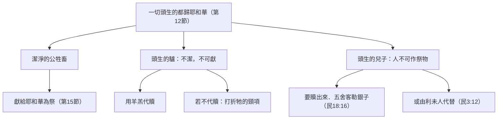

# 出埃及記 第13章

<!-- chapter-navigation:start -->
| [前一章](../02%20出埃及記/第12章.md) | [回目錄](../02%20出埃及記/全書目錄及綱要.md) | [下一章](../02%20出埃及記/第14章.md) |
| :--- | :---: | ---: |
<!-- chapter-navigation:end -->

1. [[耶和華的話臨到|耶和華曉諭]][[摩西]]說：
2. [[頭生歸神為聖|以色列中凡頭生的]]，無論是人是牲畜，都是我的，[[分別為聖|要分別為聖歸我]]。
3. [[摩西]]對百姓說：你們要記念[[為奴之家|從埃及為奴之家出來]]的這日，因為[[耶和華]]用[[大能的手]]將你們從這地方領出來。有酵的餅都不可吃。
4. [[亞筆月]]間的這日是你們出來的日子。
5. 將來[[耶和華]]領你進[[迦南地|迦南人、赫人、亞摩利人、希未人、耶布斯人之地]]，就是他[[進迦南應許|向你的祖宗起誓應許給你]]那[[流奶與蜜之地]]，那時你要在這月間守這禮。
6. 你要吃[[無酵餅]]七日，[[第七日向耶和華守節|到第七日要向耶和華守節]]。
7. 這七日之久，要吃[[無酵餅]]；在你四境之內不可見有酵的餅，也不可見發酵的物。
8. 當那日，你要告訴你的兒子說：這是因[[耶和華]]在[[出埃及|我出埃及的時候]]為我所行的事。
9. 這要在你[[記號與經文|手上作記號]]，在你額上作記念，使[[耶和華]]的律法常在你口中，因為耶和華曾用[[大能的手]]將你從[[埃及]]領出來。
10. 所以你[[無酵節重申|每年要按著日期守這例]]。
11. 將來，[[耶和華]]照他向你和你祖宗所起的誓將你領進[[迦南地|迦南人之地]]，把這地賜給你，
12. 那時你要將[[頭生歸神為聖|一切頭生的]]，並牲畜中頭生的，[[歸給耶和華]]；[[歸給耶和華|公的都要屬耶和華]]。
13. 凡[[驢用羊羔代贖|頭生的驢]]，你要[[驢用羊羔代贖|用羊羔代贖]]；若不代贖，就要打折他的頸項。[[利未人代替長子|凡你兒子中頭生的都要贖出來]]。
14. 日後，你的兒子問你說：這是什麼意思？你就說：[[耶和華]]用[[大能的手]]將我們從[[為奴之家|埃及為奴之家]]領出來。
15. 那時[[法老]]幾乎不容我們去，[[耶和華]]就把[[埃及]]地[[長子之死|所有頭生的]]，無論是人是牲畜，都殺了。因此，我把一切頭生的公牲畜獻給耶和華為祭，但將頭生的兒子都贖出來。
16. 這要在你[[記號與經文|手上作記號]]，在你[[記號與經文|額上作經文]]，因為[[耶和華]]用[[大能的手]]將我們從[[埃及]]領出來。
17. [[法老]]容百姓去的時候，[[沿海大道（Via Maris）|非利士地的道路]]雖近，[[神的主權與預定|神卻不領他們從那裡走]]；因為神說：恐怕百姓遇見打仗後悔，就回[[埃及]]去。
18. 所以[[繞道而行|神領百姓繞道而行]]，走[[紅海曠野|紅海曠野的路]]。[[以色列人的軍隊|以色列人出埃及地]]，[[以色列人帶兵器|都帶著兵器上去]]。
19. [[摩西]]把[[約瑟]]的[[約瑟骸骨|骸骨]]一同帶去；因為約瑟曾叫以色列人嚴嚴地起誓，對他們說：神必眷顧你們，你們要把我的骸骨從這裡一同帶上去。
20. 他們從[[疏割]]起行，在[[以倘|曠野邊的以倘]]安營。
21. 日間，[[耶和華]]在[[雲柱火柱|雲柱]]中領他們的路；夜間，在[[雲柱火柱|火柱]]中光照他們，使他們日夜都可以行走。
22. 日間[[雲柱火柱|雲柱]]，夜間[[雲柱火柱|火柱]]，總不離開百姓的面前。

---

## 本章知識節點

### 主題
- [[為奴之家]]

### 歷史
- [[頭生歸神為聖]]
- [[無酵節重申]]
- [[第七日向耶和華守節]]
- [[進迦南應許]]
- [[出埃及]]
- [[長子之死]]
- [[繞道而行]]
- [[以色列人帶兵器]]
- [[約瑟骸骨]]
- [[雲柱火柱]]

### 原文
- [[亞筆月]]
- [[無酵餅]]
- [[記號與經文]]
- [[驢用羊羔代贖]]
- [[歸給耶和華]]

### 神學
- [[耶和華]]
- [[耶和華的話臨到]]
- [[分別為聖]]
- [[大能的手]]
- [[流奶與蜜之地]]
- [[利未人代替長子]]
- [[神的主權與預定]]
- [[以色列人的軍隊]]
- [[傳於後代]]
- [[出埃及為要事奉神]]

### 人物
- [[摩西]]
- [[法老]]
- [[約瑟]]

### 地點
- [[埃及]]
- [[迦南地]]
- [[非利士地]]
- [[紅海曠野]]
- [[疏割]]
- [[以倘]]
- [[沿海大道（Via Maris）]]

### 解經爭議
- [[出埃及的年代]]

### 互文
- [[創五十25 約瑟骸骨應許]]
- [[創十五13-16 迦南應許]]

---

## 本章整理

CT 給本章的標題是**【得救之初】**，分成兩塊：神重申命令（1-16節）與神的引導（17-22節）。前一塊看似是兩件不相干的事夾在一起——頭生歸神（1-2、11-16節）中間插進了無酵節（3-10節）——後一塊則是一段路線與一副骸骨。

GT《中文聖經註釋》把前一塊的結構拆得很清楚：第1-2節是神對摩西的說話，第3-10節是摩西對百姓吩咐守無酵餅節的說話，第11-16節「再接回第2節」。它並指出這一整段擺在出埃及事件之後的用意：「聖靈引領聖經寫作者將這兩段經文放在出埃及事件之後，有如附錄般的，目的卻不是附錄，乃為主要的教育資料。」

### 頭生的都是我的（v1-2）

全章第一條命令沒有解釋，只有宣告：[[頭生歸神為聖|以色列中凡頭生的，無論是人是牲畜，都是我的]]。CT 指出這是代表的原則：「神是用第一個人亞當代表所有人；神也用以色列人頭生的代表全部以色列人。」[[分別為聖]]這個動作要求的是什麼，GT《串珠聖經註釋》給了兩種解法：「可解作『獻上』，或『將它當作屬神的』兩個意思。」

這條例的根據不是創造，是救贖。GT《中文聖經註釋》說得最明白：神的要求「並不是全體都歸回給祂，乃是因祂在埃及藉擊殺他們頭生的而將選民救贖出來」。而 GT《舊約聖經背景註釋》提醒這個觀念本身並不是以色列獨有的：「任何母親的第一個男胎都被視為是神明所有的。這概念在古代近東有時導致以孩童為祭，來保證豐饒。」以色列所走的是另一條路——長子被撥給神事奉，而且可以贖回。

### 七日無酵，和一場父子問答（v3-10）

第3節換了說話的人：摩西對百姓說，你們要紀念從[[為奴之家|埃及為奴之家]]出來的這日。GT《聖經精讀本》指出這四個字後來成了埃及的別稱（出20:2；申5:6），「其目的在於讓以色列百姓紀念在埃及悲慘的生活，並感謝神的救贖之恩」。

這一段的[[無酵節重申|無酵節條例]]比第12章鬆。GT《中文聖經註釋》逐條比對過：本段沒有提頭一日和第七日當有聖會、不可作工，也不提吃者必從以色列的會中剪除；第6節的「七日」在七十士譯本和撒瑪利亞抄本作「六日」。多出來的是別的東西——第8節「當那日，你要告訴你的兒子說」。同一份註釋說：「這段記述明顯是為教育之用──要告訴你的兒子，而不是為律例之用。」

第6節[[第七日向耶和華守節|到第七日要向耶和華守節]]，KC 指出這是聖經第一次稱它為「向耶和華守的節」。而丁良才在這一節下另記了一件別處沒提的事：猶太人守尼散月第二十一日，為過紅海的紀念日。

### 進了那地以後（v11-16）

第11節再一次用「將來」開頭，把條例推到[[進迦南應許|進迦南之後]]。第12節的動詞值得停一下：[[歸給耶和華]]這個字，GT《串珠聖經註釋》說「按原文直譯是『使之越過某些事物』」，而且「這字常常形容異教徒把自己的兒女獻上為祭歸給外邦神（王下16:3; 23:10）」。GT《丁道爾聖經註釋》主張應譯作「使之經（火）」，並劃出界線：迦南人或會如此對待長子，「但對以色列來說，他們只能將頭生的牲畜獻給耶和華」。

於是第13節開了兩個例外——不潔的牲畜不能獻，人也不能獻：

丁良才把這條界線寫成一句話：「聖潔的牲畜必歸於神作犧牲，不潔的被贖或被宰殺。」[[驢用羊羔代贖|為什麼單挑驢]]，GT《串珠聖經註釋》給的理由很實際：驢「是很有用但屬不潔的動物……這裡特別提到驢，因它是從埃及帶出來唯一荷負重載的動物」。KC 則把這個對照讀成人的寫照：「驢是人在罪的軛下的圖畫……凡不肯屈頸的，這人的頸項就必被折斷。」至於長子怎麼贖，本章沒說；[[利未人代替長子|贖價五舍客勒與利未人代替]]都是民數記才給的。

這一段的結尾（第16節）與無酵節那一段的結尾（第9節）是同一句話：[[記號與經文|在你手上作記號，在你額上作經文]]。GT《串珠聖經註釋》把兩段互相呼應的地方一併列了出來——都提及進應許地、都著重兒子的發問與家長的答覆、都強調手上的紀念記號、都引用同一救贖的公式作答。而那句公式就是[[大能的手|耶和華用大能的手將你從埃及領出來]]，全章出現四次（第3、9、14、16節）。

至於這句話要不要照字面做，各家不同。丁良才認為摩西是「借埃及人所用的佩戴為喻」；GT《丁道爾聖經註釋》給的理由最有力：「然而這種文字竟可用在除酵節上，就證明了它純粹是喻象。過分拘泥字義不但是猶太人的毛病，也是基督徒常犯的危機。」

### 不走近路（v17-18）

法老一放人，神做的第一個決定是不走那條最近的路。

| | [[沿海大道（Via Maris）]]（非利士地的道路） | [[紅海曠野]]的路 |
|---|---|---|
| 走法 | 沿地中海岸北上，經非利士屬地 | 往東南繞入曠野 |
| 路程 | 《聖經精讀本》：大概四天 | 《聖經精讀本》：比那條路遠六倍 |
| 沿途 | 埃及重兵駐守，埃及人稱之為賀如司之道 | 蘆葦沼澤與草原邊緣 |
| 風險 | 遇見打仗，後悔回埃及 | 曠野的路長，但神親自引路 |

CT 為神不領他們走近路列出四個緣故：沿路設有埃及重兵駐守；須經過好戰的非利士人領土；以色列人雖號稱耶和華的軍隊，實際還沒受過軍事訓練；恐怕他們遇難而退。丁良才另列一組，角度不同：選民還無膽量、神要在曠野訓練他們、神要向摩西成就所應許的證據、神要在埃及人身上施展大能。KC 則把兩段路要學的功課分開講：「在埃及他們學到的是神與他們為敵，但他們藉羔羊的血得蒙保護；在紅海他們要學到神是幫助他們的。」

有意思的是第18節下半：[[以色列人帶兵器|以色列人出埃及地，都帶著兵器上去]]。CT 給這句話的原文字義只有兩個字——「列陣」。GT《每日研經叢書》說這是要強調「他們不是一些散兵游勇之逃命」，而 GT《啟導本聖經腳註》同時指出這枝毫無訓練的隊伍「決非裝備精良的埃及軍隊的對手。他們能夠勝利，因為有耶和華神為他們爭戰」。

順帶一提，這一段也是全卷年代之爭的落點之一：見[[出埃及的年代]]。

### 一副三百多年前託付的骸骨（v19-20）

第19節插進一件與路線無關的事：[[約瑟骸骨|摩西把約瑟的骸骨一同帶去]]。KC 注意到它出現的時機——「就在神說到祂要祂百姓走的道路之時，注意力卻轉到約瑟的骸骨上。」GT《聖經精讀本》把時間跨度算了出來：這是三百五十多年前約瑟臨終的遺言。

GT《丁道爾聖經註釋》說這願望「並非感情用事，而是最後一次向神的應許表示信心」，並補了一個中文讀者一看就懂的對照：「正如上一代的南洋華僑，依然不願葬在中國以外的地方。」GT《每日研經叢書》則把第18與19節合起來看：他們以戰鬥的陣容前進，又抬著一副用香料裹好的身體，「雖然他們離去匆促，但一切卻是依次序行。凡是神掌管之處，急速不會變成恐慌。」

接著是兩個地名：從[[疏割]]起行，在曠野邊的[[以倘]]安營。CT 的靈訓要義把這兩個名字的字義並排來讀——離開「貨攤」，住宿在「神的同在」裡。

### 日間雲柱，夜間火柱（v21-22）

全章最後出場的是引路的那一位。[[雲柱火柱]]是不是兩根柱子？GT《聖經精讀本》說得很明白：「不是不同的兩根柱子，而是同一個柱子表現為兩種現象。」GT《舊約聖經背景註釋》也是這樣讀：白晝時看見煙雲，包在裡面的火光晚間照亮出來。

它的實用價值，是要走過那片曠野的人才知道。GT《中文聖經註釋》寫得最切身：「西乃沙漠日間的熱度有時在攝氏四十五度或以上，無樹蔭無房舍，炙熱的沙粒，實在令人乾渴頭昏，但在雲柱的蔭下，卻使人稍能喘氣清醒。沙漠區因無濕氣保住溫熱，夜晚由清涼而降至寒冷，火柱的溫熱可使發抖的人稍能鎮定。」

至於它是怎麼造成的，丁道爾坦承只能臆測——可能是神在人腦海中造成的異象，也可能是某種沙漠旋風或壇上的煙柱反映火光——但它立刻補上一句：「臆測雖然可能有錯，對信心的解釋卻沒有影響。」GT《舊約聖經背景註釋》另否掉兩個常見的說法：火山活動（時間太早，也解釋不了柱子如何前行）與商隊的火盆（「聖經每次都是描述柱子是主動（降下、移動）而非被動的」）。

最後一節只講一件事：總不離開。CT 指出此後以色列人在曠野四十年間一直都有神的同在，「就在快要渡約但河，摩西臨死前仍有雲柱的記載」。KC 把它接到今日：「今日神藉聖靈引導祂的百姓，而祂也不將聖靈取去。」

**參考資料**
https://www.ccbiblestudy.org/Old%20Testament/02Exo/02CT13.htm
https://www.ccbiblestudy.org/Old%20Testament/02Exo/02GT13.htm
https://www.kingcomments.com/en/bible-studies/Exo/13
https://biblehub.com/study/exodus/13.htm

<!-- appendix-links:start -->
## 附錄

### 相關地圖
- [[appendix/fhl_maps/maps/001|〈總圖一〉迦南的地理位置和古代對外交通]]
- [[appendix/fhl_maps/maps/016|〈創圖十一〉猶大和約瑟的生平]]
- [[appendix/fhl_maps/maps/019|〈出圖二〉以色列人出埃及到西乃山]]
- [[appendix/fhl_maps/maps/024|〈民圖五〉出埃及和進迦南的旅程]]
- [[appendix/fhl_maps/maps/038|〈書圖十一〉利未人的城和十二個支派的地業]]
<!-- appendix-links:end -->

<!-- chapter-navigation:start -->
| [前一章](../02%20出埃及記/第12章.md) | [回目錄](../02%20出埃及記/全書目錄及綱要.md) | [下一章](../02%20出埃及記/第14章.md) |
| :--- | :---: | ---: |
<!-- chapter-navigation:end -->
