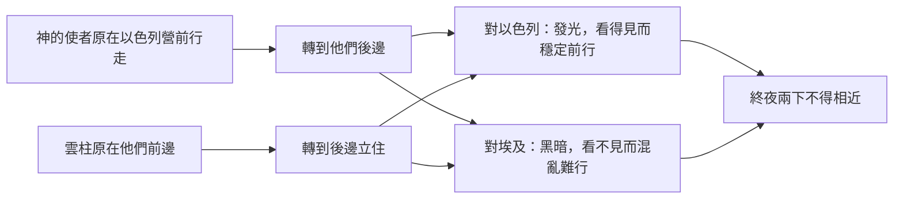
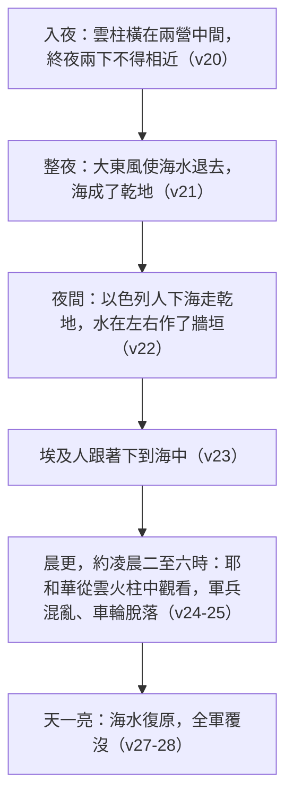

# 出埃及記 第14章

1. [[耶和華的話臨到|耶和華曉諭]][[摩西]]說：
2. 你吩咐以色列人轉回，安營在[[比哈希錄]]前，[[密奪]]和[[海（紅海）|海的中間]]，對著[[巴力洗分]]，[[海邊|靠近海邊安營]]。
3. [[法老]]必說：以色列人在地中繞迷了，曠野把他們困住了。
4. 我要使[[法老的心剛硬]]，他要追趕他們，我便在法老和他全軍身上[[神的榮耀|得榮耀]]；[[埃及]]人就知道我是[[耶和華]]。於是以色列人這樣行了。
5. 有人告訴[[埃及]]王說：百姓逃跑。[[法老]]和他的臣僕就向百姓變心，說：我們容以色列人去，不再服事我們，這做的是什麼事呢？
6. [[法老]]就預備他的車輛，帶領軍兵同去，
7. 並帶著六百輛特選的車和[[埃及]]所有的車，每輛都有車兵長。
8. [[耶和華]]使[[埃及]]王[[法老的心剛硬]]，他就追趕以色列人，因為以色列人是[[昂然無懼]]地出埃及。
9. [[埃及]]人追趕他們，[[法老]]一切的馬匹、車輛、馬兵，與軍兵就在[[海邊]]上，靠近[[比哈希錄]]，對著[[巴力洗分]]，在他們安營的地方追上了。
10. [[法老]]臨近的時候，以色列人[[信心與眼見|舉目看見]][[埃及]]人趕來，就甚懼怕，向[[耶和華]]哀求。
11. 他們對[[摩西]]說：難道在[[埃及]][[以色列人的怨言|沒有墳地]]，你把我們帶來死在曠野嗎？你為什麼這樣待我們，將我們從埃及領出來呢？
12. 我們在[[埃及]]豈沒有對你說過，不要攪擾我們，容我們服事埃及人嗎？因為服事埃及人[[以色列人的怨言|比死在曠野還好]]。
13. [[摩西]]對百姓說：不要懼怕，只管站住！看[[耶和華]]今天向你們所要施行的[[救恩]]。因為，你們今天所看見的[[埃及]]人必永遠不再看見了。
14. [[耶和華的爭戰|耶和華必為你們爭戰]]；你們只管靜默，不要作聲。
15. [[耶和華]]對[[摩西]]說：你為什麼向我哀求呢？你吩咐以色列人往前走。
16. [[摩西伸杖|你舉手向海伸杖]]，把水分開。以色列人要下海中走乾地。
17. 我要使[[埃及]]人的[[法老的心剛硬|心剛硬]]，他們就跟著下去。我要在[[法老]]和他的全軍、車輛、馬兵上[[神的榮耀|得榮耀]]。
18. 我在[[法老]]和他的車輛、馬兵上[[神的榮耀|得榮耀]]的時候，[[埃及]]人就知道我是[[耶和華]]了。
19. 在以色列營前行走[[神的使者]]，轉到他們後邊去；[[雲柱火柱|雲柱]]也從他們前邊轉到他們後邊立住。
20. 在[[埃及]]營和以色列營中間有[[雲柱火柱|雲柱]]，一邊黑暗，一邊發光，終夜兩下不得相近。
21. [[摩西伸杖|摩西向海伸杖]]，[[耶和華]]便用[[大東風]]，使海水一夜退去，[[紅海分開|水便分開]]，[[海（紅海）|海就成了乾地]]。
22. [[過紅海|以色列人下海中走乾地]]，水在他們的左右作了[[牆垣]]。
23. [[埃及]]人追趕他們，[[法老]]一切的馬匹、車輛，和馬兵都跟著下到[[海（紅海）|海]]中。
24. 到了[[晨更]]的時候，[[耶和華]]從[[雲柱火柱|雲火柱]]中向[[埃及]]的軍兵觀看，使埃及的軍兵混亂了；
25. 又使他們的車輪脫落，難以行走，以致[[埃及]]人說：我們從以色列人面前逃跑吧！因[[耶和華]][[耶和華的爭戰|為他們攻擊我們了]]。
26. [[耶和華]]對[[摩西]]說：你[[摩西伸杖|向海伸杖]]，叫水仍合在[[埃及]]人並他們的車輛、馬兵身上。
27. [[摩西]]就[[摩西伸杖|向海伸杖]]，到了天一亮，海水仍舊復原。[[埃及]]人避水逃跑的時候，[[耶和華]][[審判|把他們推翻在海中]]，
28. 水就回流，淹沒了車輛和馬兵。那些跟著以色列人下[[海（紅海）|海]][[法老]]的全軍，[[審判|連一個也沒有剩下]]。
29. [[過紅海|以色列人卻在海中走乾地]]；水在他們的左右作了[[牆垣]]。
30. 當日，[[耶和華]]這樣拯救以色列人脫離[[埃及]]人的手，以色列人看見埃及人的[[神必審判仇敵|死屍都在海邊了]]。
31. 以色列人看見[[耶和華]]向[[埃及]]人[[大能的手|所行的大事]]，就[[敬畏與信服|敬畏耶和華]]，又[[敬畏與信服|信服]]他和他的僕人[[摩西]]。

---

## 本章知識節點

### 神學
- [[耶和華的爭戰]]
- [[神的榮耀]]
- [[救恩]]
- [[神的引導與護理]]
- [[信心與眼見]]
- [[敬畏與信服]]
- [[審判]]
- [[神必審判仇敵]]
- [[摩西伸杖]]
- [[受浸（洗禮）預表]]
- [[法老的心剛硬]]
- [[神的主權與預定]]
- [[大能的手]]
- [[分別為聖]]
- [[出埃及為要事奉神]]
- [[傳於後代]]
- [[耶和華的話臨到]]

### 歷史
- [[過紅海]]
- [[紅海分開]]
- [[六百輛特選的車]]
- [[以色列人出埃及的軍隊]]
- [[以色列人的怨言]]
- [[繞道而行]]
- [[以色列人帶兵器]]
- [[雲柱火柱]]

### 地點
- [[埃及]]
- [[比哈希錄]]
- [[密奪]]
- [[巴力洗分]]
- [[海（紅海）]]
- [[海邊]]
- [[迦南地]]
- [[以倘]]
- [[疏割]]
- [[紅海曠野]]

### 原文
- [[以色列]]
- [[晨更]]
- [[大東風]]
- [[昂然無懼]]
- [[牆垣]]
- [[車兵長]]

### 人物
- [[摩西]]
- [[法老]]
- [[耶和華]]
- [[神的使者]]

### 文化
- [[哈妥爾（Hathor）]]

### 解經爭議
- [[紅海指的是哪個海]]
- [[車輪脫落]]
- [[六十萬人的數目]]
- [[出埃及的年代]]

### 互文
- [[林前十1-2 受浸歸入摩西]]
- [[羅馬書七-八章對應]]
- [[來十一29 因信過紅海]]
- [[賽五十八8 耶和華作後盾]]
- [[賽四十三1-3 水中行走不漫過]]
- [[詩七十七16-20 紅海記念]]
- [[詩一零六9 紅海乾地]]
- [[伯二十六12 攪動大海]]
- [[詩一三六15 法老軍兵推翻]]
- [[民三十三7-8 行程記錄]]
- [[創十五13-16 迦南應許]]

---

## 本章整理

CT 給本章的內容綱要標題是【神以大能拯救以色列人[[過紅海]]】，GT《串珠聖經註釋》用一句話概括：「神帶領以色列人經過蘆葦海走在乾地上，並毀滅一切追趕他們的埃及軍隊。」GT《丁道爾聖經註釋》把它的份量說到了頂：「對以色列來說，這場戰役是神集救恩、救贖、審判的大成，其重要性怎麼說都不算高估，於我們來說，也應當是這樣。」

### 一、安營在死路上是一道命令（v1-4）

第13章說神不領百姓走非利士地的近路，而是繞道走紅海曠野的路；本章講明繞道要達成什麼。神吩咐以色列人「轉回」，安營在[[比哈希錄]]、[[密奪]]和[[海（紅海）|海]]之間，對著[[巴力洗分]]，[[海邊|靠近海邊安營]]。

這個「轉回」是往哪裡轉，各家並不一致。CT 說「意思不是轉回原出發地，而是轉變方向，朝紅海行進」；GT《聖經精讀本──出埃及記註解》給兩個可能——「後退」或「轉到一邊」；GT《丁道爾聖經註釋》讀成「逆轉方向……不直接東行，反而突然轉南」；GT《串珠聖經註釋》則從結果反推：「是指他們沒有從疏割及以倘繼續順序向東行，反而轉向北面，靠近紅海邊安營，難怪法老以為他們走迷了。」方向的分歧不影響結論：新的位置把百姓放進了埃及邊防的視野裡。CT 的〔話中之光〕點明用意：「以色列人所『安營』之處，竟在埃及防營的監視範圍之內，顯然含有誘敵之意。」

KC 把這道命令的性質直接說破：主吩咐他們在海邊安營，看起來是一道愚拙的命令，百姓就是這樣被困住的——前面是海，後面是法老；**但在理性看為愚拙的，在信心卻是正路**（來十一29）。GT《聖經精讀本》從神那一邊列出兩個目的：「①引誘法老的軍隊繼續追趕以色列百姓；②在毫無希望的緊迫時刻，用分開紅海的神跡給百姓增加信心，籍著審判法老要讓列邦看到神的權能。」

三個地名如今都無法確考，各家給的字義與地望如下：

| 地名 | 字義 | 地望諸說 |
| --- | --- | --- |
| 比哈希錄 | CT：「雜草生長之處」；《丁道爾》：純正埃及語的「鹽澤區」；BH：「峽谷之口」 | 《中文聖經註釋》：可能是埃及文「女神 Hathor 的殿」被錯讀成 Pi-hairoth，七十士譯本作 epaulis；《舊約背景註釋》：名字意為「開掘之口」，可能指薛提一世時代開建的南北運河 |
| 密奪 | 「高塔」「守望塔」「防堡」 | CT：埃及東界邊牆上的一座保障；《舊約背景註釋》：埃及語中是從閃族語引入的字眼，這時期有一個在疏割附近；《啟導本》：聖經中有若干個叫密奪的城，是否同一城無法證明 |
| 巴力洗分 | CT：「北方之主」；《啟導本》：「北山之主」 | 《中文聖經註釋》：主前六世紀蒲草紙作「洗分的巴力和一切在他分赫斯的神」，即德夫內市；《舊約背景註釋》：即耶利米書的答比匿、達法納遺址，最近的湖泊是巴拉湖；《啟導本》：或在曼薩拉湖附近 |

[[哈妥爾（Hathor）|女神 Hathor]] 與[[巴力洗分|巴力]]兩個名字同時出現在這三個地名裡並非偶然。GT《丁道爾聖經註釋》指出「巴力洗分，『北方的巴力』顯然是個迦南神祇的廟宇，證實了迦南宗教對埃及的影響」；BH 進一步說巴力被認為掌管海洋與風暴——**神選在掌管海洋的神明廟宇的正對面，把海分開**。

「我要使[[法老的心剛硬]]，他要追趕他們，我便在法老和他全軍身上[[神的榮耀|得榮耀]]」是全章的主旋律，v4、17、18 三次重複。GT《聖經精讀本》把「得榮耀」的兩面說得很清楚：「神不僅通過順從的百姓得榮耀，有時也通過悖逆的大敵得榮耀。因為前者可以體現神的慈愛，後者則能體現神的公義。」CT 的〔話中之光〕同：神得榮耀有兩面，一面藉仇敵的失敗，一面藉神兒女的得勝。

### 二、[[六百輛特選的車]]（v5-9）

「有人告訴埃及王說：百姓逃跑。」CT 抓住了一個尖銳的對比：本來是埃及人「催促」百姓快快出離埃及（十二33），現在變成百姓「逃跑」——「一面說出人們容易健忘，另一面也表明人們的心意和言語完全不可靠」。GT《丁道爾聖經註釋》從原文緩和了這個矛盾：「『逃跑』譯作『甩掉了他』更佳。法老較早時容許以色列離開和本節並沒有牴觸，法老只是到如今才恍然大悟自己核准了什麼。」KC 的比喻很傳神：法老自己給了許可，卻像在沉醉中、在迷霧裡，對自己話語的內容毫無真正的意識；他從來沒有真的打算讓他們走，聽見消息就像是醒了過來。

變心的原因是經濟。GT《丁道爾聖經註釋》：「對於完全倚賴某一階層或團體擔任勞工的制度來說，失去這些勞工便會陷於癱瘓。」GT《聖經精讀本》算得更具體：「瞬間失去60多萬壯丁的勞動力，對埃及經濟來說不能不是一件極大的損失。」丁良才列出全景：「叫埃及地面多處空虛荒蕪，國家舉行的大工完全甘休，商務閉塞，交易停止。」

法老動員的是精銳。CT 說「特選的車」指特殊裝備的戰車、是埃及的精英部隊；GT《舊約聖經背景註釋》給出量級：「在這時期的戰車單位每隊有十至一百五十輛不等，六百已經是很大的集結數目，而這只是法老的單位。蘭塞二世在加低斯之役與赫人作戰時，敵方號稱有二千五百輛戰車。」GT《丁道爾聖經註釋》另提兩個讀法：六百輛追一群奴隸未免勞師動眾，或可視為象徵、與十二章37節的[[六十萬人的數目|「六十萬」以色列人]]相對；也可能「六百」代表一個「支隊」（撒下十五18）。至於[[車兵長]]，GT《啟導本》與《串珠》都指出原文本作「第三人」——《串珠》說是「在戰車上除了駕駛者和戰士外，第三個拿盾牌、協助保護戰士的人」，而 GT《靈修版聖經註釋》給的是兩人編制。

「因為以色列人是[[昂然無懼]]地出埃及」是法老心有不甘的原因。CT 給的原文字義是「昂然」升起、升高，「無懼地」手，並解釋成「得勝者高昂的姿態」（民三十三3）；丁良才說得更直接：「以色列人出埃及的狀態，不是像逃命的奴僕，乃是像神自由的百姓。」

### 三、[[信心與眼見]]：[[以色列人的怨言]]（v10-12）

GT《中文聖經註釋》指出這一段有一個特徵字：「這整段經文（10～14節）的特徵字詞之一，就是懼怕。在經過首次逾越節的整夜無眠，又經過勞累的跋涉之後，現在看見龐大的埃及軍兵，以色列人認為甚麼機會都沒有了。因為他們所看見的，是環境、是現實。」它對那場哀求也毫不客氣：「大概是正如中國人所說的『呼天搶地』而已，並不是鎮定地依靠主作信心的禱告。」不過 GT《聖經精讀本》很公道地列出他們客觀上該怕的三個理由：百姓雖多卻「多是婦女兒童和老人」、既無戰術也無武器、又是長期為奴的人乍見昔日主人披甲執矛而來。KC 說出路確實不在他們能看見的方向：四圍沒有，裡面也沒有——但憑信心，出路終究是有的，向上（林後四8）。

「難道在[[埃及]]沒有墳地」是一句狠話。丁良才點破：「這是譏刺摩西的話，在埃及墳地本來很多。」GT《丁道爾聖經註釋》講得更完整，卻立刻補上一個保留：「鑑於當時情勢緊張，以色列人可能也不是故意語出譏諷。」至於 v12「我們在埃及豈沒有對你說過」，GT《中文聖經註釋》查證後說「在整部出埃及記中，我們沒有查到有關這句話的記載」，CT 直指言過其實，《丁道爾》則從語言學上化解：「在希伯來語中，『說』很多時候有『想』的意思。」

本段最扎心的觀察來自 GT《串珠聖經註釋》：「最叫人驚訝的就是百姓發怨言所用的字彙，竟與埃及人知道以色列人逃跑時所說的話（5下）極為相似；兩種人都作同一反應，皆因未能體會神的計畫。」法老說「我們容以色列人去……這做的是什麼事呢」，以色列人說「你為什麼這樣待我們，將我們從埃及領出來呢」——==壓迫者與被壓迫者，在不認識神的計畫這件事上說著同一種語言==。KC 由此接到[[羅馬書七-八章對應|羅馬書第7章]]：他們在懼怕中所用的語言，是一個已經藏身在羔羊血後面、良心對仇敵的權勢卻仍沒有平安的人的語言。

### 四、站住、靜默、往前走（v13-16）

「不要懼怕，只管站住！看耶和華今天向你們所要施行的[[救恩]]」——GT《中文聖經註釋》的原文分析是本章最好的一段：「站住的原文，並不是普通所說的企立，有站穩崗位，守住立場，堅定位置等含義。因此，只管站住的原意，就不單指身體姿態的問題，也是指內心境界和心靈狀態的問題。」它接著寫出一段關於屬靈領袖的話：有信心的領袖只仰望神而不看環境的惡劣，能任勞任怨——不去對付埋怨他的人，而去解決那些人所埋怨的問題。

「[[耶和華的爭戰|耶和華必為你們爭戰]]；你們只管靜默，不要作聲」把本章的神學定住了。GT《中文聖經註釋》：「祂是戰神，祂施行聖戰以拯救其子民，完全出於祂聖善的鴻恩，人只有旁觀而無參與的份兒。」CT 的〔話中之光〕語氣一致：祂不需我們助陣，也不需我們加油。至於「救恩」一詞，GT《丁道爾聖經註釋》給了一個誠實的限定：「在本節只含救命或戰勝的意思（參撒上十四45）。『救恩』的屬靈意義隨舊約啟示而漸進，其屬物質的意義逐步消減——然而二者對希伯來人卻沒有鮮明的分別。」

到了 v15，鏡頭轉向摩西自己。GT《中文聖經註釋》看得極準：「前段給我們看到的，是摩西在眾人面前滿具信心的態度……這裏卻給我們看到他在神面前的軟弱，他在哀求。摩西也是人。」而神的回答是一道不講理的命令：「前面是甚麼？大海！神要摩西吩咐以色列人向海走。這不是理性的，也不是理性可以理解的。」GT 趙世光《聖經寶藏》把這一點推到底：「神的吩咐是『往前走』。神從來沒有吩咐說『往後退』。**神為信徒預備的是『護心鏡』，沒有『護背鏡』。**」

[[摩西伸杖]]的責任歸屬，CT 講得很準：「『把水分開』意指『使』海水劈開兩半，摩西自己並沒有『把』海水劈開兩半的能力，他只憑信心伸杖，神就作事。」

### 五、[[雲柱火柱]]從前導變後衛（v19-20）

KC 這一段是本章最動人的神學：[[神的使者]]換了一個位置，祂總是為著祂百姓的益處取那在當下最需要的位置——祂從領隊變成護衛，那作他們前鋒的，也作他們的後衛（[[賽五十八8 耶和華作後盾|賽58:8b]]）。祂接著點出這件事的兩面：當神審判祂百姓的仇敵時，祂用祂的榮耀保護祂的百姓；**對祂百姓是保護的，對祂仇敵就意味著審判**——福音本身也有這兩面，在得救的人身上作活的香氣，在滅亡的人身上作死的香氣（林後二15-16a）。

「神的使者」是誰，各家不一致。CT 說「應不是指天使，而是指神自己，或是指在舊約經常以人形向人顯現的子神基督」；GT《聖經精讀本》更直接，說是道成肉身之前的基督；丁良才只說「就是耶和華」。但 GT《丁道爾聖經註釋》持保留：本節稱呼神用的不是「耶和華」而是較概括的「神」，「所以我們或當視之為神『一般性』的使者，即雲柱、火柱」。GT《中文聖經註釋》另注意到這兩節完全不提火柱，「因其目的是使埃及人完全看不見前路，只能矇目般的盡力追趕」。

### 六、那一夜：分開的海（v21-25）

[[大東風]]是什麼樣的風？CT 說是「從東邊吹來強烈的熱風」；GT《啟導本聖經腳註》說「這種來自沙漠的風既烈且熱，力足把湖中或海灣裡的水堆起成壘；吹幹海床」；GT《舊約聖經背景註釋》做了氣象上的區辨——它不同於第九災的喀新風，「本節所指的東風是由美索不達米亞的高氣壓所驅動……有氣壓劇升的特徵」；丁良才另猜是東南風，因為「古時候的希伯來人，只用東西南北四面定方向」。伸杖與東風並不衝突，GT《丁道爾聖經註釋》正面回答過：「摩西必須伸手，來證明這次『退潮』並非偶然，而是神施展大能拯救祂子民的作為。」

「水在他們的左右作了[[牆垣]]」是本章解經分歧最大的一句：

| 讀法 | 出處 | 說法 |
| --- | --- | --- |
| 字面：神蹟中的神蹟 | CT | 「水往低處流，但此時水竟然豎起立成牆垣，這個現象無法給予合理的解釋，所以這是神蹟中的神蹟。」 |
| 喻象，不該照字面解 | GT《丁道爾聖經註釋》 | 「和以斯拉記九章9節描述神使他們在以色列『有牆垣』一樣（原文是同一個字），兩者都不該照字面解釋。」 |
| 信仰表白，非史事敘述 | GT（v29 註） | 「這節話是信仰的表白，而不是傳統史事的敘述……雖然與人的理性所知相違，卻是信心的一門重要的功課。」 |

三家都同意它的功用：兩邊的水成了保護，使埃及戰車不能繞道從側翼攻擊。而這片水域到底在哪裡、有多深，就是[[紅海指的是哪個海]]這個爭論的核心——各家分別推曼薩拉湖、蘇彝士灣以北、巴拉湖，但都同意它不會只是淺沼澤：賈斯樂郝威指出，若只是沼澤，水立不成牆垣，也淹不死法老的全軍。

到了[[晨更]]（GT《丁道爾聖經註釋》說這是三更中的最後一更，「日出之前天色最黑，人的警覺性最是低落，發動突擊慣常都在此刻」），神「觀看」埃及軍兵。CT 指出這個字原文意思是俯視，「用來形容神發動攻擊」。至於[[車輪脫落]]，各家譯法分作三路：和合本與 CT 的「脫落」、《串珠》的「纏住」（湖裡的蘆葦）、《精讀本》的「懲罰、指責」。《丁道爾》給了一個調和：泥濘先讓重型戰車膠著，受驚的馬匹再把輪軸拉斷。CT 早在 v22 就埋下伏筆——那片乾地「大概僅適合輕裝行走其上，而不適合承受埃及的重軸車輛」。

### 七、海水復原與[[審判]]（v26-28）

摩西第二次伸杖，效果相反。CT 指出這次是「吩咐兩邊的水合攏起來，淹沒埃及的軍兵和車馬」，並在〔話中之光〕補一句：「本節再一次證明，神作事有時需要人的配搭合作。」GT《丁道爾聖經註釋》在「推翻」這個字上挖出一條深線：它直譯是「抖掉」（[[詩一三六15 法老軍兵推翻|詩136:15]]、尼五13 同字），而「後世希伯來解經家認為這動詞遙指創世記十一章1～9節，建築巴別塔的人被神『推翻』的情景」——法老被神推翻，不但間接和巴別塔相連，更和洪水的史蹟有關，因為神在挪亞時也是以水作為審判的工具。

法老本人有沒有死，各家未定。CT 說「法老本人可能留在海邊的岸上督軍」，並附備註：「有許多解經家認為法老和他所有的軍兵，都一齊追下海中，全部覆滅。因史冊沒有明文記載，兩種情形都有可能。」丁良才傾向法老也在其中。GT《丁道爾聖經註釋》則提醒不要拿這件事做年代學的文章：「若有人試圖在歷史尋找木乃伊沒得適當保全的法老，從而斷定[[出埃及的年代|出埃及的日期]]，只會白費工夫。」KC 把兩面的對稱收在這裡：那審判是全然的，正如救恩是全然的——沒有一個仇敵存留，也沒有一個百姓死亡。

CT 的〔話中之光〕點出埃及人失敗的關鍵：「『跟著下去』，這是模仿的行為，外表看似和以色列人所作的一模一樣，其實他們並沒有神的話可供信靠，所以結局悲慘。」KC 引[[來十一29 因信過紅海|來11:29]] 說同一件事：以色列人因著信過紅海如行乾地，埃及人試著要過去，就被吞滅了。

### 八、看見、敬畏、信服（v29-31）

「以色列人看見埃及人的死屍都在海邊了」——GT《丁道爾聖經註釋》說這是「目擊者的生動記述」：「淹死的埃及軍兵代表他們昔日為奴的生涯，如今一去不返。」CT 的說法是：「被迫害者活著看見加害者的軍兵死屍，這是一幅得著完全釋放的最佳寫照。」丁良才另指出這件事的外溢效應：以色列人在曠野再不必怕埃及人，「這事的風聲也傳到鄰近的國度，使他們驚恐」。

全章的結論落在三個原文的雙關上。「所行的大事」原文是「巨大的手」（CT），與13章四次[[大能的手]]是同一條線；「[[敬畏與信服|敬畏]]」原文就是「懼怕」——v10 他們甚懼怕埃及人，v31 他們懼怕耶和華，==同一個字換了對象，就從恐慌變成了敬畏==；而 GT《中文聖經註釋》早在 v13 就注意到「原文的懼怕和看見這兩詞，字母極為相近」。至於「僕人」，GT《串珠聖經註釋》指出「這裡是摩西五經內[[摩西]]第一次稱為『神的僕人』」，GT《啟導本聖經腳註》補上譜系：這個詞在五經中只有此處和民十二7、申三十四5 用於摩西，後也用於約書亞、撒母耳和大衛。

### [[受浸（洗禮）預表]]：過紅海的救贖意義

CT 的靈訓要義以【過紅海──受浸與主同死同復活】為全章的框架，把敘事逐項讀成預表：海水預表墳墓，專為埋葬已死的人（v16）；以色列人下海走乾地，預表信徒藉受浸與基督同死（羅六3、5）；埃及人跟著下去，預表神要藉受浸的水對付撒但的軍兵（v17）；雲柱轉到後邊立住，預表聖靈保守信徒（v19）；水作牆垣，預表受浸的水並不加害信徒（v22）；水回流淹沒車馬，預表受浸的水使撒但全軍覆沒（v28）；而以色列人平安走過紅海、從彼岸上來，預表信徒藉受浸與基督同復活（v30；羅六4-5）。

KC 用[[林前十1-2 受浸歸入摩西|林前10:1-2]] 把這件事定住：正如以色列人藉著過海與摩西聯合，照樣信徒藉著受浸與基督的死聯合；而祂區分的兩重工作值得記住——**祂的血洗淨罪，祂的死救人脫離罪的權勢**。趙世光另給了一個精細的分別：紅海表明主「代替死」（林前十五3 的「罪」是複數，指本罪），過約但河才是「代表死」（羅六10 的「罪」是單數，指原罪）；主替我們死，叫我們脫離罪刑，主代表我們死，使我們脫離罪的權勢。GT《丁道爾聖經註釋》從史學角度補上一句：這個蘆海的神蹟之所以成為舊約最主要的救恩表徵（賽五十一9-11），「無疑就是始於本節這種木已成舟的態勢」。

至於埃及自己的史料為什麼查不到這件事，GT《靈修版聖經註釋》給的解釋是體例問題：「埃及歷代法老的慣例都是報喜不報憂。他們甚至從現有記錄之中，把奸臣與政敵的名字除去。法老一定處心積慮地不去記載他的大軍追逐逃亡的奴隸而全軍覆沒的一頁。」

**參考資料**
https://www.ccbiblestudy.org/Old%20Testament/02Exo/02CT14.htm
https://www.ccbiblestudy.org/Old%20Testament/02Exo/02GT14.htm
https://www.kingcomments.com/en/bible-studies/Exo/14
https://biblehub.com/study/exodus/14.htm
