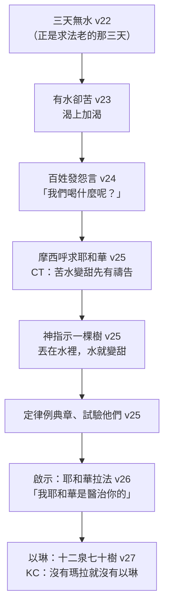

# 出埃及記 第15章

1. 那時，[[摩西]]和以色列人向[[耶和華]][[摩西之歌|唱歌說]]：我要向耶和華歌唱，因他大大戰勝，將馬和騎馬的[[海（紅海）|投在海中]]。
2. [[耶和華是我的力量我的詩歌我的拯救|耶和華是我的力量，我的詩歌，也成了我的拯救]]。這是我的神，我要讚美他，是我父親的神，我要尊崇他。
3. [[耶和華是戰士]]；他的名是耶和華。
4. [[法老]]的車輛、軍兵，[[耶和華]]已拋在[[海（紅海）|海]]中；他特選的軍長都[[海（紅海）|沉於紅海]]。
5. 深水淹沒他們；他們如同石頭墜到深處。
6. [[耶和華]]啊，[[神的右手|你的右手]]施展能力，顯出榮耀；耶和華啊，你的右手摔碎仇敵。
7. 你大發威嚴，[[審判|推翻那些起來攻擊你的]]；你發出[[來12：29 我們的神乃是烈火|烈怒如火]]，燒滅他們像燒碎秸一樣。
8. 你發鼻中的氣，水便聚起成堆，大水直立如壘，[[海（紅海）|海中的深水凝結]]。
9. 仇敵說：我要追趕，我要追上；我要分擄物，我要在他們身上稱我的心願。我要拔出刀來，親手殺滅他們。
10. 你叫風一吹，[[海（紅海）|海就把他們淹沒]]；他們[[審判|如鉛沉在大水之中]]。
11. [[耶和華]]啊，眾神之中，誰能像你？誰能像你─至聖至榮，可頌可畏，施行奇事？
12. [[神的右手|你伸出右手]]，[[審判|地便吞滅他們]]。
13. [[神的慈愛引領|你憑慈愛領了你所贖的百姓]]；你憑能力引他們到了[[神的聖所|你的聖所]]。
14. 外邦人聽見就發顫；疼痛抓住[[非利士地|非利士]]的居民。
15. 那時，[[以東]]的族長驚惶，[[摩押]]的英雄被戰兢抓住，[[迦南]]的居民心都消化了。
16. 驚駭恐懼臨到他們。[[耶和華]]啊，因你膀臂的大能，他們如石頭寂然不動，等候你的百姓過去，等候你所贖的百姓過去。
17. 你要將他們領進去，栽於你產業的山上─[[耶和華]]啊，就是你為自己所造的住處；主啊，就是[[神的聖所|你手所建立的聖所]]。
18. [[耶和華作王|耶和華必作王，直到永永遠遠]]！
19. [[法老]]的馬匹、車輛，和馬兵下到[[海（紅海）|海]]中，[[耶和華]]使海水回流，淹沒他們；[[過紅海|惟有以色列人在海中走乾地]]。
20. [[亞倫]]的姊姊，[[米利暗之歌|女先知]][[米利暗]]，手裡拿著鼓；眾婦女也跟他出去拿鼓跳舞。
21. [[米利暗]]應聲說：[[米利暗之歌|你們要歌頌耶和華]]，因他大大戰勝，將馬和騎馬的[[海（紅海）|投在海中]]。
22. [[摩西]]領以色列人[[海（紅海）|從紅海往前行]]，到了[[書珥的曠野]]，[[書珥曠野三天無水|在曠野走了三天，找不著水]]。
23. [[瑪拉|到了瑪拉]]，不能喝那裡的水；因為水苦，所以[[瑪拉（ bitterness ）|那地名叫瑪拉]]。
24. 百姓就向[[摩西]][[以色列人的怨言|發怨言]]，說：我們喝什麼呢？
25. [[摩西]]呼求[[耶和華]]，[[瑪拉苦水變甜|耶和華指示他一棵樹]]。他把樹丟在水裡，[[瑪拉苦水變甜|水就變甜了]]。耶和華在那裡為他們定了律例、典章，[[神的試驗|在那裡試驗他們]]；
26. 又說：[[聽命順從蒙醫治|你若留意聽耶和華]]─你神的話，又行我眼中看為正的事，留心聽我的誡命，守我一切的律例，我就不將所加與埃及人的疾病加在你身上，因為我─[[耶和華拉法|耶和華是醫治你的]]。
27. [[以琳|他們到了以琳]]，在那裡有[[以琳十二股水泉七十棵棕樹|十二股水泉，七十棵棕樹]]；他們就[[以琳綠洲|在那裡的水邊安營]]。

<!-- fhl-map-links:start -->
## 相關地圖

- [[appendix/fhl_maps/maps/019|〈出圖二〉以色列人出埃及到西乃山]]
- [[appendix/fhl_maps/maps/024|〈民圖五〉出埃及和進迦南的旅程]]
<!-- fhl-map-links:end -->

---

## 本章知識節點

### 主題／神學
- [[摩西之歌]]
- [[米利暗之歌]]
- [[耶和華是戰士]]
- [[耶和華是我的力量我的詩歌我的拯救]]
- [[耶和華作王]]
- [[神的右手]]
- [[耶和華拉法]]
- [[神的聖所]]
- [[神的慈愛引領]]
- [[聽命順從蒙醫治]]
- [[神的試驗]]
- [[救恩]]
- [[審判]]

### 歷史／事件
- [[過紅海]]
- [[瑪拉苦水變甜]]
- [[以琳綠洲]]
- [[以色列人的怨言]]

### 地點
- [[海（紅海）]]
- [[書珥的曠野]]
- [[書珥]]
- [[瑪拉]]
- [[以琳]]
- [[非利士地]]
- [[以東]]
- [[摩押]]
- [[迦南]]

### 原文／名字
- [[瑪拉（ bitterness ）]]
- [[以琳（ trees ）]]
- [[書珥（ wall ）]]

### 人物
- [[摩西]]
- [[米利暗]]
- [[亞倫]]
- [[法老]]
- [[耶和華]]

### 互文
- [[啟15：2-4 羔羊之歌]]
- [[賽12：2 耶和華是我的力量我的詩歌]]
- [[詩118：14 耶和華是我的力量我的詩歌]]
- [[來12：29 我們的神乃是烈火]]
- [[林前10：10 不要發怨言]]

### 背景
- [[書珥曠野三天無水]]
- [[瑪拉苦水]]
- [[以琳十二股水泉七十棵棕樹]]

---

## 本章整理

CT 給本章的標題只有六個字，卻把全章的落差說盡了：**【從歌頌神到埋怨神】**。**第14章結束在「敬畏耶和華，又信服他和他的僕人摩西」；第15章開頭是聖經第一首歌；而三天之後，同一批口在發怨言。**

### 經文大綱

1. **唱歌跳舞讚美神的救恩**（1-21節）——[[摩西之歌]]（1-18）、[[米利暗之歌]]（19-21）
2. **眾民為水埋怨**（22-27節）——書珥曠野三天無水（22）、[[瑪拉苦水變甜]]（23-26）、到[[以琳]]遇十二水泉（27）

> [!important] 這是聖經的第一首歌——也牽著最後一首
> **KC 一開頭就把這件事放在正典的兩端**：**「聖經中我們第一次聽見歌。這是一群從埃及被贖出來、平安到了紅海彼岸、仇敵權勢已被折斷的百姓所唱的。**——**這歌在末世也要被唱。那時它從得勝那獸的人口中發出**（啟15:2-3）。**這是聖經最後一次談到歌。」**
>
> **CT 的〔話中之光〕同樣讀出這條線**：**「將來必看見許多從世俗中，從今世苦海中得了釋放、得了救、得了勝的信徒，站在玻璃海上『唱神僕人摩西的歌，和羔羊的歌』。」**《精讀本》：**「這首摩西之歌還具有預言性的性質，它將與[[啟15：2-4 羔羊之歌|羔羊之歌]]一同，在最後審判的那天被勝利者高唱。」**
>
> **丁良才數出聖經共記十首歌，本歌居首**：**「除了詩篇、雅歌，並耶利米哀歌以外，聖經上共記十歌如下：（一）出十五1至18；（二）民二十一17-18；（三）申三十二1至43；（四）士五1至31；（五）撒上二1至10；（六）撒下二十二1至51；（七）路一46至55；（八）路一68至79；（九）路二29至32；（十）啟十四3。」**
>
> **為什麼以色列人到現在才唱歌？**丁良才：**「以色列人蒙了神的拯救以後，才有歌唱，他們在埃及時不過歎息唉哼就是了。」**CT 同讀：**「以色列人在埃及地時盡是嘆息哀哼（參二23~24），如今卻開口歌唱。」**
>
> **CT 另有一個很細膩的觀察**：**「以色列人並未在行經紅海的路上讚美歌頌神，而是到達紅海彼岸之後才發覺他們剛經歷了大神蹟，因此唱歌。**——**我們信徒也常常等到回頭看所經歷過的事，才發覺自己身歷一個神蹟。」**

### 一、[[摩西之歌]]（v1-18）

**這首歌怎麼分段？各家不一，但都同意 1-12 講出埃及、13-18 講將來進迦南。**

| 分法 | 出處 |
| --- | --- |
| 三段：1-5 / 6-10 / 11-18 | 丁良才 |
| 兩段：1-12 神救以色列（每節起頭提耶和華、末了提埃及人被吞滅）／ 13-18 救的結果 | 丁良才引註釋家 |
| 四小段：1下-2 個人感恩 / 3-12 團體歌頌 / 13-16 團體歌頌神大能 / 17-18 進佔迦南、禱頌神永遠作王 | 《中文聖經註釋》 |
| 兩段：1-12 以出埃及為主旨 / 13-18 討論將來入侵迦南 | 《丁道爾》、《串珠》 |

**《啟導本》給了這首詩一個文學上的定位**：**「（海之歌）又名（摩西的凱歌）或（蘆葦海之歌），為摩西五經中最出色的一首史詩，生動、技巧熟練。」**《串珠》點出一個極要緊的特徵：**「詩歌將救贖之功全歸給耶和華，以色列人在這次救贖中並不是神的夥伴，連最微小的角色也沒有擔當，**——**甚至摩西在歌中也完全未被提及**，可見神是獨力完成這海中神跡的。」

**這首詩到底是什麼體裁？《中文聖經註釋》把學界的各種主張列了出來**：**「有些認為是得勝的詩歌……有些卻認為是感恩詩……另有些人卻認為這是君王的登基詩，或頌讚神為王的詩歌，因為18節提到『耶和華必作王，直到永永遠遠』。又有些人則把這段經文當作祈禱詞，因為第6、11和16節都有重疊的語句，正如應答的祈禱（Litany）一樣。」**它自己的結論很有份量：**「按現有的詩章來看……其重點已放在神的聖所，其他只是藉歷史的敘述，來顯明神的權能和力量，因此百姓要以神產業的山，祂為自己所造的住處──聖所，為一切思想和行動的中心。」**

> [!quote] v1「因祂大大戰勝」——這個字其實是「湧起」
> **《丁道爾》給了原文的畫面**：**「大大戰勝，譯作『湧起』（如波濤）更佳。這字可以用來形容驕傲（不良的），本節則用以形容勝利（好的）。以西結書四十七章5節，則用這動詞形容河水氾濫。」**——**神像波濤一樣湧起，把馬和騎馬的投在海中。**
>
> **《中文聖經註釋》**：**「原文是因他傲然而起，或是因他榮耀的崛起。」**並指出「我要向耶和華歌唱」的語氣：**「原文是第一人稱單數的『命令式』（cohortative），是表示個人決心定志要向神歌唱的意思。」**
>
> **《丁道爾》另指出一個關鍵字**：**「戴維斯指出『因』字在本節至為重要，因為在以色列詩歌之中，這字通常點出讚美神的理由。」**——**讚美是有理由的，不是情緒。**
>
> **這首詩的古老，各家從語言上判斷**：《丁道爾》：**「強而有力的韻律，簡潔而深奧的思想，富有古風的語言，都顯示這歌是早期的作品。」**

「[[耶和華是我的力量我的詩歌我的拯救|耶和華是我的力量，我的詩歌，也成了我的拯救]]」——

> [!note] 「我的詩歌」可能不是詩歌
> **這是本節最有意思的異文問題。**《串珠》：**「『詩歌』：在七十士譯本譯『防護』，與上下文吻合。」**《中文聖經註釋》講得更完整：**「原文所用的詩歌一詞，是含有以崇拜的心讚美神之創造的樂歌的意義……但是，七十士譯本和現代有些學者，則認為這詞應譯成『保護』。所以現代中文譯本將上一句和這一句相連，而譯成『神是堅強的保護者』。」**
>
> **《丁道爾》支持這個讀法，並推到底**：**「柯費二氏不將原文的 zimrat 譯作『詩歌』，而譯成『保護』或『保衛者』。基於阿拉伯語的同源字，這樣比較合乎上文下理，又得到七十士譯本的支持。**——**若然，[[詩118：14 耶和華是我的力量我的詩歌|詩篇一一八篇14節]]等經文也當如此翻譯。」**
>
> **CT 則兩義並收**：**「『詩歌』含有保護之意，因得平安而能唱歌歡樂。」**
>
> **另一個原文細節：這裡的神名是簡稱。**《精讀本》：**「字面意思是『我的力量和詩歌是 Jah』……這裡的『Jah』是耶和華（Jehovah）一詞的縮寫，使用於詩的韻律上。」**《丁道爾》：**「希伯來原文在此使用簡稱 YH，不像第1和3節一般，使用全名 YHWH。不少人名以及『哈利路亞』（halelu-Yah，即『你們要讚美 YH』），皆包含了這個聖名的簡稱。」**
>
> **「我要讚美祂」這個字更奇特。**《丁道爾》：**「這字在希伯來文獻中沒有再出現過。現有的翻譯不過是基於本節的對偶，以及其他閃族語文中之類似字彙所作出的臆測。**——**這是這首詩歌包含古代語法的例子之一。」**（CT 另提供一個譯法：**「英文另譯：I will prepare Him an habitation」**——我要為祂預備居所。）
>
> **「是我父親的神」**——《精讀本》：**「讚美那位沒有忘記與祖先的約，終於讓他們渡過紅海的信實的神。」**KC 讀出另一層：**「不只是活著的人，連已經睡了的列祖，也要有分於神拯救作為的結果。」**

「[[耶和華是戰士]]；祂的名是耶和華」——

> [!info] 「戰士」這個稱號的份量
> **原文直譯是「戰爭的人」。**《中文聖經註釋》列出各譯本：**「撒瑪利亞抄本和敘利亞文譯本均作『大能的英雄』；七十士譯本則繙為『神是粉碎戰爭的』。」**《丁道爾》把它接到後來的稱號：**「參照神 YHWH sebaot 的稱號，其意思是『眾軍旅的耶和華』或『萬軍之耶和華』。」**
>
> **《舊約背景註釋》給了一段極重要的比較宗教學說明，這是本章最好的一段背景**：**「神明作戰在古代神話中經常出現，但這些描述往往都只限於控制和組織宇宙。瑪爾杜克（巴比倫）和巴力（迦南）二神，都制服了海洋──他們仇敵的化身。**——**反之，本詩讚揚耶和華利用自然的海洋（不是超自然神祇的化身），擊敗在歷史中與祂為敵的人類。」**
>
> ——**差別在這裡：別的神在神話裡打敗混沌；耶和華在歷史裡打敗埃及。**
>
> **CT 從「耶和華」這個名讀出供應**：**「『耶和華』原文字義是『自有永有的』……又可譯作『我就是那我是』，意指我所需要的是甚麼，祂就是甚麼，暗示祂是全備的供應者。」**它的〔話中之光〕收得很好：**「神是『戰士』，足以勝過一切消極的人事物；『祂的名是耶和華』，足以滿足一切積極的需要。」**

**v4-10 紅海勝利的詩歌描繪**——同一件事，用一連串意象反覆詠唱：

| 意象 | 註釋 |
| --- | --- |
| 「如同石頭墜到深處」(5) | 丁良才：「埃及人如石頭如鉛，因為他們身上多穿帶軍裝。」《精讀本》：「由於身穿厚厚的銅鐵製品，所以沉入海底應該比石頭更快。」《丁道爾》：耶51:63-64 以此明喻巴比倫「有如大石一般下沉不起」 |
| 「深水淹沒他們」(5) | 《中文聖經註釋》：「原文的用字可譯為遠古的深淵……古迦南人和兩河流域的人，認這背後的力量為海怪或神明，以色列人卻直認是從神而來的。」《丁道爾》：「或許是個擬聲詞，形容急潮回流之時造成的汨汨漩渦聲」 |
| 「你的右手」(6) | 《中文聖經註釋》：「不單指一般人用右手拿兵器……也象徵坐在帝王右邊的宰相為掌權之發號施令者。」丁良才：「聖書裡在本處頭一次用這說法」（見 [[神的右手]]） |
| 「烈怒如火」(7) | 《精讀本》：「『烈怒』一詞原文是『火燒』之意。」CT：「神乃是烈火（來十二29），祂的怒氣是祂公義的表彰」（見 [[來12：29 我們的神乃是烈火]]） |
| 「你發鼻中的氣」(8) | 《串珠》：「是從神學觀點解釋那大東風來源。」《丁道爾》：「擬人法是任何詩詞都不可或缺的成分；這段經文本質上是詩歌，因此我們萬不能將『水便聚起成堆』按字面的意思解釋」 |
| 「如鉛沉在大水之中」(10) | 《丁道爾》：「鉛是重量的自然象徵，本節以之取代上面用過的『石頭』」 |

> [!quote] v9：五個「我要」，對上一口氣
> **這是全詩最有戲劇性的對比。**《中文聖經註釋》把仇敵的話排成一列：
>
> **「我要追趕／我要追上／我要分擄物／我要在他們身上稱我的心願／我要拔出刀來／親手殺滅他們」**——**「可是，他們一切的妄想都會成空（見第10節）。」**
>
> **然後 v10 只有一句：「你叫風一吹。」**KC 把這個落差寫成一句極好的話：**「消滅仇敵在神不過是呼出一口氣的代價」**（參帖後2:8）。
>
> **《丁道爾》注意到節奏**：**「本節沉重的三拍子不但令人印象深刻，而且簡單古拙。參照士師記五章底波拉之歌。」**《精讀本》：**「中間連續加入了幾段毫無聯繫的詩句，是為了生動地描寫法老對出埃及的以色列百姓的強烈憎恨之心。」**
>
> **「拔出刀來」不是拔刀出鞘。**《中文聖經註釋》：**「原文並不指拔刀出鞘，乃是從已刺入的部位拔出來，意思是殺了又殺的含義。」**CT 同讀：**「刺而又刺，手段殘忍。」**
>
> **《丁道爾》發現一個詩意的反諷**：**「殺滅他們……嚴格一點可譯作『剝奪他們』。後來以色列驅逐迦南人，得他們的土地，也經常用這字形容。**——**這話出自埃及人口中，對以色列來說充滿了詩意的反諷。」**

「耶和華啊，眾神之中，誰能像你？」——**這是全詩的讚美高峰。**

> [!important] 這句話是一神論嗎？——各家的分寸很值得看
> **丁良才指出神超過眾神的三件事**：**「（一）祂為至聖；（二）祂的尊榮；（三）祂所行的奇事。」**並注意到：**「『至聖』——這是人在聖經上頭一次稱神為聖。」**
>
> **《丁道爾》給了最精細的神學分寸**：**「這種早期的『一神崇拜』（monolatry，即堅持單單事奉耶和華），後來在教義上發展成為全面性的『一神信仰』（monotheism，即否定耶和華以外有其他神的存在）；以賽亞書四十五章5節就是一例。**——**本節基於實用理由，只是漠視這些神祇，對其存在與否既不肯定、也不否定。」**
>
> **《每日研經叢書》讀法相近**：**「勝利的問話：『耶和華阿，眾神之中誰能像你？』表示出以色列人拒絕多神的存在，達致一神信仰長途的第一階段。」**
>
> **《中文聖經註釋》則把「眾神」定位在天庭**：**「這裏的眾神，並不是像詩八十二1的諸神；乃是天庭中『神的眾子』的含義。」**
>
> **KC 從埃及的角度回答這個問句**：**「埃及有許多神。這些偶像背後是鬼魔。牠們能作什麼來抵擋祂？**——**牠們連影子也沒見著。」**
>
> **CT 指出這節的形式**：這節與第6、16節都有重疊句——《中文聖經註釋》：**「像禮拜中的應答祈禱文般的。因此，好些學者就據此而認這篇詩為崇拜之用的祈禱詩歌。」**

**v12「你伸出右手，地便吞滅他們」——這裡的「地」可能不是地。**《串珠》：**「根據烏迦列文的字義，可譯作地下陰間。」**《中文聖經註釋》：**「這裏的地字，不是指地面的地，乃是地下的地，即陰間。」**《舊約背景註釋》另補一條埃及背景：**「值得一提的，還有埃及人對於來生的信念，是惡人死後若不能說服判官自己是好人，就會被『吞吃者』所食。」**

### 二、[[神的慈愛引領]]與[[神的聖所]]（v13-18）

**從 v13 起，這首歌從歷史轉向未來。**

> [!example]- 這是預言，還是後人的加筆？——本章最大的爭論
> **《丁道爾》主張「先知式完成時態」**：**「好幾位學者覺得摩西之歌中描繪進侵迦南的下半部，必然是在侵占迦南之後完成。部分更認為13和17節是指錫安山和所羅門王的聖殿；**——**但這看法是沒有必要的。這兩句話都是古語的形式，更遠古的拉斯珊拉泥版已經有類似的語言。貫徹全段的過去式大概是『先知式完成時態』，即是將未曾發生的事件，當作既成的事實描述。」**
>
> **《每日研經叢書》把文法解釋得最清楚**：**「它以希伯來文的『完成式』開始，但是這本身卻沒有意義，因為在預言的經文中，我們經常踫到文法上所謂『預言完成式』，那就是，雖然立意說未來，卻用完成式來表示它將會發生。最熟悉的例子乃是以賽亞書九章二至七節。」**
>
> **CT 站同一邊，並且用它解決了 v13「聖所」的難題**：它先列出三種解釋都有問題——**「(1)指神的居所，就是聖殿，但此時以色列人連會幕也還未建造；(2)指神在天上的聖所，但以色列人在肉身中不可能被引到天上的聖所；(3)神所應許給以色列人之地，就是迦南美地，但以色列人進入迦南美地乃是四十年後的事。」**——**「因此，比較合理的看法應當把13~16節視為『完成式預言』，而17~18節則視為『未來式預言』。」**
>
> **《中文聖經註釋》則明確主張後期加筆**：**「由這節起至18節，明顯的與出埃及和過紅海的歷史事件無關……較早的註釋家多用『預言』來解釋這幾節經文。其實，這首詩歌卻是在迦南地，聖殿建立後，在節慶崇拜儀式中使用此詩歌時，逐漸加上去的。」**它在 v14 給出最強的理由：**「事實上，以色列人出埃及過紅海時，非利士人還居住在海島上，尚未進佔其後稱為非利士地的地方。故此，這節經文絕不可能是摩西時代所寫的。」**
>
> **《丁道爾》承認同一個難處，但留了辯駁的餘地**：**「[[非利士地|『非利士的居民』]]主前一一八八年非利士人抵達迦南以前，這地不可能有此名稱，因此這句話起碼當來自入侵迦南以後。」**——但它另指出：**「這裡所列的國名，大致依照從埃及朝東北方前進所經過的次序。」**
>
> **v18「耶和華必作王」也被捲入這場爭論。**《丁道爾》的回應很有力：**「部分學者視之為本段屬後期作品的證據。然而五經起碼也有兩處地方，提到耶和華在以色列中為王（民二十三21；申三十三5）。**——**以色列若非一開始就相信耶和華是以色列的王，我們就很難解釋一個世紀後，思想保守的以色列人，為什麼會極力反對將這尊號冠於凡人身上」**（士8:23 的基甸；撒上8:6 的撒母耳）。

「你憑[[神的慈愛引領|慈愛]]領了你所贖的百姓」——

> [!quote] hesed：舊約最偉大的盟約用辭之一
> **《丁道爾》**：**「慈愛，這個經常譯作『不變的愛』或『憐憫』的字眼（hesed），形容神對祂子民堅定不渝的愛（出三十四7），是舊約最偉大的盟約用辭之一。**——**而神對祂子民的要求，也是同樣的愛」**（何6:6）。
>
> **CT 指出這慈愛的代價**：**「『所贖的』表示以色列人是神出了代價所贖回的，而這個代價乃是祂自己的『長子』，是逾越節的羊羔所表徵的。」**它的〔話中之光〕很動人：**「感謝神，祂用『慈愛』帶領我們，而不是用『公義』；否則，照我們的本相，恐怕早就倒斃在曠野中了。」**
>
> **丁良才數出神選民所憑的三樣**：**「（一）是憑著恩惠救贖的；（二）是憑著慈愛領出的；（三）是憑著能力引導的。」**
>
> **KC 讀出救贖的目的**：**「神救贖祂的百姓，不是要把他們丟下不管。祂救贖祂的百姓，然後把他們帶到祂的居所——曠野的會幕。這正是本書後半的內容。**——**罪人的救贖與拯救本身並不是目的。它們是使人成為神居所的必要手段。」**

**v13 與 v17 的「聖所」不是同一個字。**《中文聖經註釋》：**「17節的聖所，是指錫安山的。但本節的用字，源於牧人或羊群所居之所，然後加上一個聖字……因此，這聖所可能是指在西乃某地的神的山。」**《丁道爾》給了字源：**「希伯來文 naweh 一字原意是『牧草』，引伸作『牧場』，然後較概括和詩意地，再引伸為任何『居所』的意思。這字在此可以是指以色列將要遷至的整個迦南地。」**《串珠》同：**「原意是牧羊之地，廣義上可泛指整塊應許之地。」**

**KC 把 v13 與 v17 的兩個居所分開，講得極清楚**：**「在第13節摩西說到神在曠野的居所。如今是神在應許之地的居所……聖殿屬於在那地的百姓，是永久的居所。會幕屬於在曠野的百姓，是可移動的居所。**——**這兩面在教會裡都有。」**

**v14-16 各族的驚惶。**《舊約背景註釋》給了一個歷史上的對照：**「百姓恐懼是征服記載中一再重現的主題。迦南人從前雖然懼怕埃及（同時代之亞馬拿書函證明當時確然有人如此），**——**如今對他們構成威脅的已非法老的膀臂，而是已經打敗法老之耶和華的膀臂。」**《精讀本》從古代宗教觀解釋為什麼列邦會怕：**「古人把鄰國間的戰爭，當成其國的守護神之間的戰爭。所以耶和華擊敗大國埃及的眾神，把以色列人救出火坑的消息，使所有的列邦為之恐懼」**（書2:9-11）。

**但丁良才與《中文聖經註釋》都誠實地指出：[[以東]]那一句與後來的史實有出入。**丁良才：**「等到以色列人再過三十八年出了曠野的時候，以東國已經有了君王，以東人懼怕以色列人的心就沒有了」**（民20:14-21）。《中文聖經註釋》：**「以色列人出埃及後，想假道以東進入迦南，以東的族長並未驚惶，乃是強硬的不准他們通過。」**——**它因此推論這是後期歷史的反映**：**「在以色列國勢強盛時，以東的族長驚惶是歷史的事實。因此，本節的這句詩，很可能是後期的歷史，給詩人反映在此的。」**

**v16「你所贖的百姓」用的是另一個「贖」字。**《中文聖經註釋》：**「原文所用的贖字，和13節的贖字為不同。13節的字源出於救贖，這節的字根可當作買贖之用。但更正確的用法，卻正如民十一12所述的『懷胎』──新造出來的。**——**因此，以色列人固然是神自己買贖的百姓，也是祂新造出來的子民。」**《丁道爾》甚至主張譯作「你所創造的百姓」。

「[[耶和華作王|耶和華必作王，直到永永遠遠]]」——**《中文聖經註釋》：「這是這首詩歌極佳的結語。」****《舊約背景註釋》把這句話與古代近東神話最後劃清界線**：**「本節不是將耶和華描繪為制服了宇宙，統管屬下眾神的神話性君王。反之，祂是在歷史現實中統治祂藉自己所操縱的自然力量，拯救出來的子民。**——**這詩所稱頌的，不是祂打敗了其他神明或宇宙中混沌的勢力，而是祂的能力勝過在歷史中存在的人類。」**KC 把它接到讀者：**「沒有一件事在神的手之外。祂在萬事上都有祂的目的，並且祂也成就它。沒有仇敵能攔阻祂。**——**相反，祂知道怎樣使用仇敵來成全祂的計畫！」**

### 三、[[米利暗之歌]]（v19-21）

**[[米利暗]]是聖經第一位女先知。**丁良才：**「這是聖書中所提的頭一個女先知，後來以色列人中有好些女先知，如底波拉（士四4），戶勒大（王下二十二14），以賽亞的妻（賽八3），亞拿（路二36）。」**《中文聖經註釋》從這件事讀出一個文化判斷：**「她被稱為女先知，是聖經頭一個被稱為女先知的，**——**可見以色列在傳統上，並不歧視女性在宗教上的地位。」**它在 19-21 段又說了一次：**「以色列的傳統，並不像後期成為猶太教以後，那樣的歧視女性，特別是女性在宗教活動上的地位。」**

> [!note] 為什麼是「亞倫的姊姊」，不是「摩西的姊姊」？
> **這個稱法各家都注意到了，答案卻分成三種：**
>
> **①這證明本書是摩西寫的。**丁良才：**「這一句顯明這書是摩西寫的，若是別人寫的，就必稱米利暗為摩西的姐姐，因為摩西比亞倫更出名。」**
>
> **②這反映地位的差序。**《精讀本》：**「原因是，她作為百姓的領袖在以色列內部具有與亞倫同等地位，但與摩西是不可能平起的**（民12章）。**在當時，作為神與百姓之間唯一的中保，摩西對亞倫和米利暗來說是如同神一般的存在」**（4:16）。
>
> **③這可能暗示血緣關係。**《丁道爾》很謹慎地提出並自我限制：**「有人便推論摩西不過是她同父異母（或同母異父）的弟弟。除了摩西出生的記載有反面的證據以外，聖經再無其他的資料；但該段經文也沒有說明摩西的『姐姐』就是米利暗。」**

**KC 把米利暗的角色定義得很準**：**「我們沒有讀到米利暗主導過任何行動。摩西和亞倫是主所設立的元帥、領袖。**——**在米利暗身上我們看見的是預言的靈。她帶領百姓唱一首歌，是對摩西和以色列人之歌的回應。」**它接著點出兩首歌的關係：**「摩西說，我要向耶和華歌唱。米利暗帶著所有的婦女呼召人向耶和華歌唱。她用了與摩西相同的話（第1節），重複他所唱的。**——**她這樣作，等於是對摩西的歌說『阿們』。」**

**兩首歌的差別只在一個動詞。**《丁道爾》：**「米利暗簡短的詩歌除了將動詞自陳述式（indicative）改作祈使式（imperative）以外，和摩西之歌的第一句完全一樣。」**——**從「我要歌唱」到「你們要歌頌」。****《中文聖經註釋》從這個差別推出年代**：**「1節下的首句是個人的認信。這在以色列的宗教史上，是屬於後期的。21節卻是第二人稱複數的命令式──你們要歌頌耶和華，這種向集體的團體要求，在以色列的宗教史上，是屬於較早期的。」**——因此有學者主張**「1下～18節是從21節發展而成的」**。

**CT 則指出米利暗之歌雖短，骨架俱全**：**「麻雀雖小，五臟俱全；『米利暗之歌』雖短少，但『摩西之歌』的重要骨架，一應俱全：(1)歌頌神的所是；(2)讚美神的所作；(3)將埃及軍兵投在海中；(4)感謝神保守以色列人。」**

> [!info] 鼓與跳舞：一個年代學的線索
> **《中文聖經註釋》從這兩件事推斷這是後期加筆**：**「第一個是鼓。這種樂器的使用，沒有早於晚銅器時代的……第二個是認婦女也從家中出來，拿鼓跳舞出來迎接得勝的英雄壯士。這是在住定迦南之後才有的習慣」**（士11:34；撒上18:6-8）。
>
> **《丁道爾》的觀察比較中性**：**「婦女經常在戰爭勝利之時，而不在宗教儀式中跳舞唱歌……本節所描述的音樂似乎是有感而發，不是事先安排的；然而早期的音樂，相信大多如此。」**它最後一句話很值得記住：**「這些歌唱者當然不是全部擔任聖事，但聖俗之分起碼在以色列初期並不存在。」**
>
> **音樂與預言的關係**：《靈修版》：**「米利暗被稱為女先知，不僅因為她領受神的啟示，也因為她的音樂才華。在聖經中音樂和預言，常是息息相關的」**（撒上10:5；代上25:1）。《舊約背景註釋》：**「音樂有時可以驅使人進入受感說話的昏睡狀態」**（撒上10:5；王下3:15），並補上一條性別史的觀察：**「女子扮演這種角色不必覺得意外。事實上在馬里的先知文獻中，女人出現的次數與男人相等。」**

### 四、[[書珥曠野三天無水|三天無水]]：從讚美到怨言（v22-24）

**《精讀本》在本章末尾把出埃及至今的完整路線列了出來，正好標出本章在旅程中的位置：**

**紅海（E）是本章前半歌頌的內容；書珥、瑪拉、以琳（F-H）是本章後半的行程。**《中文聖經註釋》指出這一段的位置：**「這是經歷三天無水歷程到瑪拉遇苦水後，和進入更深的曠野遭遇更多的苦難前，稍得愉快暢息的安營地方。」**《精讀本》另指出瑪拉的身分：**「瑪拉是渡過紅海之後第一次搭建帳棚之地」**（民33:8）。

> [!important] 三天——這個數字不是巧合
> **《中文聖經註釋》發現了一個極漂亮的呼應**：**「這裏之所以提到在曠野走了三天找不著水，大概也和他們原來向法老要求『走三天的路程，為要祭祀耶和華』（三18，五3等）遙相呼應。**——**為要證明這事奉神的事，原是一項艱苦難行的工作。」**
>
> **KC 讀出同一個諷刺**：**「歌唱完了。旅程開始了。進曠野三天，然後為耶和華守節，這是神的目的（出7:16；8:27-28）。**——**但事情不是這樣走的。它沒有成為節期，它成了試驗。」**
>
> **三天無水有多嚴重？**《中文聖經註釋》寫出了沙漠的實況：**「曠野和沙漠地極其乾旱，人縱不出汗，身體上的水份也被乾旱的空氣吸收蒸發，而極易產生脫水症，以致頭疼後，逐漸昏迷不知人事而死去。**——**所以，在曠野三天找不著水，是件非常重大的危險情事。」**

**到了[[瑪拉]]，找到水卻不能喝。**CT 把這個雙重打擊寫得很好：**「那裡有水卻又不能喝，正如人在大海中卻不能喝海水一樣，可以眼見，但不能享受，渴上加渴。」**《中文聖經註釋》同：**「三天找不著水，已可顯出以色列人每一分鐘前行時焦灼的心態，等到找著了水，又不能喝那裏的水，就更令歷經苦難的旅途上的人，情躁心焦。」**

**[[瑪拉（ bitterness ）|瑪拉]]是什麼意思？**《丁道爾》：**「舊約不少名稱的解釋都是基於諧音，這名卻不是。『瑪拉』如果是個來自閃族語言的字根，便真有『苦』的意思。**——**英語『沒藥』（myrrh）一字，可能也是基於這字根。」**《串珠》接到路得記：**「日後拿俄米的丈夫和兒子喪生後，她也自稱『瑪拉』，意為『苦命人』。」**《中文聖經註釋》另補一層：**「後期因以色列人在此曾作埋怨，故又有『叛逆了』的含意。」**

> [!quote] 三天前才唱歌的口，現在在發怨言
> **CT 的〔話中之光〕最扎人**：**「前不幾日在海邊大聲讚美神的口，竟然因為稍遇艱苦，即發怨言。**——**信徒歌唱的聲音，常是因為罪過止息了！因水口苦，固然難過，因罪心苦，更是難過。」**又說：**「缺少水固然可憐；缺乏信心，尤其可憐。寧肯缺乏水，不要缺乏信心。」**
>
> **KC 卻先把鏡子轉向讀者，這一段極誠實**：**「也許我們會問，以色列怎麼可能在這麼大的拯救之後這麼快就發怨言。**——**若是這樣，我們大概是不認識自己。難道我們從未有過這樣的事：前一刻深深被神的良善所感動，下一刻卻以為神撇棄了我們？」**
>
> **《中文聖經註釋》給了一個極好的對照**：**「正如耶穌在約但河受洗，有天上來的父神的聲音……可是，跟著而來的，卻是聖靈引他到曠野去受魔鬼的試探。同樣，以色列人在經歷了……神奇的過紅海得蒙拯救……之後，聖靈也引領五經的編輯者，使我們看到以色列人走了三天的路程，找不著水喝，現在有水卻不得喝！**——**以色列人與耶穌的受試探之最大不同處，是主耶穌使用神的道得勝試探，而以色列人卻向摩西發怨言。」**
>
> **這是第幾次怨言？**丁良才數出至少還有七次：**「（一）十六2；（二）十七2-3；（三）民十一1、4、33-34；（四）十四2；（五）十六41；（六）二十一5；（七）書九18，參[[林前10：10 不要發怨言|林前十10]]。」**《丁道爾》：**「類似的『發怨言』，五經記載了十幾個之多；這是以色列的本性。」**——並點出這行為的性質：**「直接埋怨神指派的領袖摩西，就是間接埋怨神」**（出16:8）。
>
> **KC 指出怨言在保羅名單上的位置**：**「在保羅林前10章的勸誡中，它是以色列在曠野路程中五樣嚴重偏差的最後一項：『你們也不要發怨言，像他們有發怨言的，就被滅命的所滅』」**（林前10:10）。

### 五、[[瑪拉苦水變甜]]與[[耶和華拉法]]（v25-26）

「[[瑪拉苦水變甜|耶和華指示他一棵樹]]。他把樹丟在水裡，[[瑪拉苦水變甜|水就變甜了]]」——

> [!example]- 這棵樹：是化學，還是神蹟？
> **各家的立場分佈很有意思。**
>
> **CT 完全歸於神蹟，並注意到一個文法細節**：**「『一棵樹』注意，不是一種樹，乃是一棵樹，表示它是獨一無二的解決方法，具有象徵性的意義。」**——**「並不是那棵『樹』所含的某種化學元素使水變甜，因為『一棵樹』的質與量不足以改變那樣大量水的質素，只能歸因於神蹟。」**《精讀本》同：**「不是這棵樹本身含有某種成份。這棵樹不過是體現神大能的一種工具而已。」**
>
> **《中文聖經註釋》把這場爭論本身判為多餘，理由很有力**：**「十九世紀起，一些註釋聖經的人就因受科學理論的影響，而爭論究竟這是神所行的一件神蹟，抑或是那棵樹有些甚麼化學元素改變了水質而使之變甜？**——**其實，這爭論是多餘的，就算是因那棵樹含有某些化學元素，改變了水質而使之變甜，從現有的經文敘述看來，五經的編輯者明顯的確信，這乃是一件神蹟，因為是耶和華指示摩西，摩西才會把那樹丟在水裏。」**
>
> **《丁道爾》與《舊約背景註釋》則報告了自然解釋的資料，但都沒有背書**：《丁道爾》：**「德萊維引述德萊塞普斯，提到有一種小檗屬的灌木，現代的阿拉伯人拿來作同樣的用途。」**《舊約背景註釋》很誠實：**「不少解經家都提到按照本地的傳統，當地出產一種能夠吸收鹽分的荊棘叢。**——**然而沒有一個科學研究，能夠確定這種灌木的品種，或肯定它確實存在。」**
>
> **《中文聖經註釋》另指出這件事的一個副作用**：**「首先是影響了今日的人無法找到原來瑪拉這地方，因為水已變甜了。」**
>
> **《丁道爾》發現「指示」這個字有個漂亮的字根關係**：**「動詞『指示』的字根，和『妥拉』（即『教訓』）的字根相同。希伯來文『妥拉』的概念，如何比中譯的『律法』或英譯的『law』豐富，從這字本身就可見一斑。**——**在本節中帶來福氣和拯救的知識，就稱為『妥拉』。」**

> [!important] 這棵樹是什麼？各家一致：十字架
> **CT 的〔話中之光〕**：**「究竟這一棵樹是什麼？無非是神用人所看為愚拙的救法——十字架（十字架原是一棵樹）（加三13）。**——**唯有主的十字架，能令人心中一切苦味變甜。」**又說：**「你幾時遇見苦水，就把十字架這一棵樹放在其中，讓它變苦為甜罷！」**
>
> **丁良才**：**「這棵樹預表基督並祂的十字架（亞三8，六12，加三13）。基督能把我們的苦變為甜。」**《啟導本》：**「早期教父將這『樹』比作耶穌的十字架。」**
>
> **KC 分得更細，把樹讀成兩層**：**「1. 基督自己（參路23:31）；2. 基督在樹上的工作，即十字架（加3:13；彼前2:24a）。」**它接著把這件事推向一個原則：**「基督的位格和祂在各各他十字架上完成的工作，是對付每一種病痛、每一種災殃的良藥。**——**基督並祂釘十字架，正是哥林多人所處的壞光景的解藥，也是加拉太人所投降的錯誤的解藥。」**
>
> **趙世光給了一個很實際的應用**：**「在受苦的時候，只要想到主在十字架上為我們受苦，好像樹丟在水裡……如此，我們不但不覺得苦，反而覺得我們配為基督受苦，這是何等的權利！」**
>
> **KC 把這個原則濃縮成一句話**：**「基督被引進試煉的地方，試煉就成了祝福。水就變甜了。」**
>
> **CT 另注意到一個常被忽略的前提**：**「瑪拉苦水變甜，也是因先有摩西禱告，可見禱告，或為他人代禱，皆是令苦水變甜的最大原因。」**

**瑪拉這一段不是單一事件，是一條完整的因果鏈——各家的註解正好落在鏈上的每一環：**

**注意這條鏈的形狀：神沒有拿走試煉（水還是那些水），祂把一棵樹丟進去。**KC 正是這樣讀的：**「祂沒有挪去試煉，而是要在圖畫中把基督引進試煉裡。」**——**而鏈的終點不是「水變甜」，是一個新的名字：耶和華拉法。**

「耶和華在那裡為他們定了律例、典章，在那裡[[神的試驗|試驗他們]]」——**CT 對「試驗」的解釋很深**：**「表面上，好像是要試驗出他們是否遵行律法，但實際上是要顯明他們根本無法遵守律法的要求，世人不能靠律法稱義，只好尋求因信基督而稱義」**（加3:13；5:2-6）。

**KC 則從神的立場讀這個試驗，角度不同也很好**：**「這正是神為什麼讓祂的百姓經過曠野：他們在那裡認識自己，知道自己心裡有什麼，並且他們在那裡認識神」**（申8:2）。它另注意到神在此的處置與民數記不同：**「在民數記，神要懲罰這發怨言的惡。那是因為那時百姓站在律法的地位上。**——**這裡神沒有懲罰，而是以恩典行事。」**

「[[聽命順從蒙醫治|你若留意聽耶和華——你神的話]]……因為我——[[耶和華拉法|耶和華是醫治你的]]」——

> [!quote] 這個「醫治」是什麼意思？——CT 的一個重要警告
> **CT 對「埃及人的疾病」下了一個很嚴謹的界定，並且直接點名一種誤用**：**「『加與埃及人的疾病』在此宜指埃及人因硬心不肯順服摩西所傳達神的話，才染患了十災所引起的特殊疾病，而不是指一般世人『生、老、病、死』所必經歷的疾病。**——**有些靈恩派的神醫信仰者，錯誤地應用此處經文，而把信徒所生的一切疾病，歸咎於不聽神的話，因此自食其果。」**
>
> **《中文聖經註釋》把「疾病」擴到信仰層面**：**「這裏所指的埃及人的疾病，卻不單在肉身上的，也是信仰上的。因埃及人心裏剛硬，所以遭受了神所降的十項大災。」**——**「這裏既與律例、典章的遵守相關聯，則其醫治就不單指屬身體上的疾病了。」**
>
> **《丁道爾》給了一個更精準的指向**：**「『加在』埃及人身上的，廣義來說大抵是十災，更準確一點則是變水為血，使之不能飲用之災。**——**神所供應的水，以色列永不會喝不入口，因為祂是耶和華，他們的醫治者。」**（——**這個讀法把 v26 直接接回 v25 的苦水：埃及的水變血不能喝，以色列的水變甜可以喝。**）
>
> **「醫治」的原文。**《精讀本》：**「這裡『醫治』一詞的希伯來語是指『醫生』。即我們的醫生耶和華不僅能醫治我們的痛苦，而且能夠解決死亡和罪」**（太9:12）。
>
> **CT 的〔話中之光〕從條件句讀出一個很溫柔的結論**：**「『你若願意…我就願意…』（原文直譯）。『我耶和華是醫治你的』，此言表明我們若不得醫治，苦水未變甜水，乃因我們不願意，並非神不願意。」**
>
> **KC 把這個條件說得很平衡**：**「但神的祝福絕不能沒有百姓那一邊的順服……主把祂作醫治者的名，連於他們的順服。」**

### 六、[[以琳綠洲]]（v27）

**[[以琳十二股水泉七十棵棕樹|十二股水泉，七十棵棕樹]]。**

> [!note] 這兩個數字是實數還是象徵？
> **象徵派**：CT〔靈意註解〕：**「『十二』和『七十』在聖經裡象徵『完全』。」**又：**「有人認為十二是代表以色列的十二支派，七十代表七十位長老。」**《啟導本》同。《中文聖經註釋》講得最完整：**「十二股水泉是象徵十二支派之如水長流，富有生命力。七十棵棕樹則象徵七十位長老（出廿四1、9，民十一16等），是管理以色列人，給他們以蔭庇者。」**
>
> **KC 把這兩個數字接到教會**：**「正如以色列有十二位先祖，教會也有十二位使徒。他們立了教會的根基（弗2:20）……以色列有七十位長老佔據顯要的地位（出24:1）。比較後來的公會，由七十人加上大祭司組成。新約中我們不只找到主耶穌差出的十二使徒，後來也有七十人的差遣」**（路10:1）。
>
> **實數派／保留派**：**《丁道爾》的態度最節制**：**「十二股水泉和七十棵棕樹，並沒有靈意解釋的必要，這兩個可能都是實數，又可能是個概約數。因為對希伯來人來說，兩個數字都代表了完美。」**
>
> **《舊約背景註釋》提供了一個很有說服力的地理候選**：**「比較接近瑪拉的還有位於蘇彝士灣北端以南只有幾哩的阿榮穆薩（Ayun Musa『摩西泉』）。此地除了有檉柳和棕樹林以外，尚有水泉十二股，**——**因此可能性更高。」**

> [!important] 沒有瑪拉，就沒有以琳
> **KC 一句話定調**：**「沒有瑪拉就沒有以琳。」**它把以琳的三樣祝福列出來：**「1. 十二股水泉可喝，每支派一股；2. 七十棵棕樹的蔭庇，抵擋炎熱；3. 水邊安全的營。」**——**「以琳——曠野中的這片綠洲——彷彿是應許之地、天上安息的預嘗。」**
>
> **丁良才把這個次序讀成一條定理，並列出四個平行**：**「以色列人先到瑪拉，後到以琳，顯明神教訓選民先苦後樂的定理。【比方】（一）先經曠野，後到迦南；（二）先上苦架，後戴冠冕；（三）先有次的，後得好的（約二10）；（四）先受苦難，後享榮耀。**——**俗語說，苦盡甘來。」**
>
> **CT 的〔話中之光〕**：**「在信徒的靈程中，須先有瑪拉的試煉和苦難，後才有以琳的祝福和甘甜。」**又：**「以琳實是迦南的先影，叫他們經過試驗後，略嘗到迦南的味道。」**並對兩樣事物各給一個象徵：**「水泉是靈恩的表明；十二股水泉，是表明靈泉之豐富，且是表明足夠以色列人十二支派用的，每支派一股水泉。」**——**「棕樹是得勝的表號（約十二12-13；啟七9,14），又是榮盛的象徵」**（詩92:12-14）。
>
> **《中文聖經註釋》給以琳一個很平實的定位**：**「這是經歷三天無水歷程到瑪拉遇苦水後，和進入更深的曠野遭遇更多的苦難前，稍得愉快暢息的安營地方。」**

### 關鍵神學點

1. **[[摩西之歌]]是聖經第一首歌，[[啟15：2-4 羔羊之歌|羔羊之歌]]是最後一首**——KC：**「這是聖經最後一次談到歌。」**首尾之間，是同一位救贖主。
2. **[[耶和華是戰士]]的獨特處**：《舊約背景註釋》——**巴力與瑪爾杜克在神話裡打敗混沌的海；耶和華用真實的海，在歷史裡打敗真實的人。**
3. **這首詩把功勞全歸給神**：《串珠》——**「以色列人在這次救贖中並不是神的夥伴，連最微小的角色也沒有擔當，甚至摩西在歌中也完全未被提及。」**
4. **五個「我要」，對上一口氣**：仇敵誇口六句（v9），神的回應只有「你叫風一吹」（v10）。KC：**「消滅仇敵在神不過是呼出一口氣的代價。」**
5. **[[神的慈愛引領|hesed]] 是舊約最偉大的盟約用辭之一**——而 KC 提醒：**救贖不是目的，「它們是使人成為神居所的必要手段」。**
6. **三天無水，正是他們原先向法老求的那三天**（3:18）——《中文聖經註釋》：**「為要證明這事奉神的事，原是一項艱苦難行的工作。」**
7. **[[瑪拉苦水變甜|那一棵樹]]是十字架**：各家一致。KC 分兩層——**基督自己，以及基督在樹上的工作。「基督被引進試煉的地方，試煉就成了祝福。」**
8. **[[耶和華拉法]]的界線要守住**：CT 明確警告，**「埃及人的疾病」指的是十災所引起的特殊疾病，不是一般人生老病死的疾病**——不可據此把信徒的一切疾病歸咎於不聽神的話。
9. **沒有瑪拉，就沒有[[以琳綠洲|以琳]]**：丁良才的四個平行——**先經曠野後到迦南，先上苦架後戴冠冕。**

**參考資料**
https://www.ccbiblestudy.org/Old%20Testament/02Exo/02CT15.htm
https://www.ccbiblestudy.org/Old%20Testament/02Exo/02GT15.htm
https://www.kingcomments.com/en/bible-studies/Exo/15
https://biblehub.com/study/exodus/15.htm
