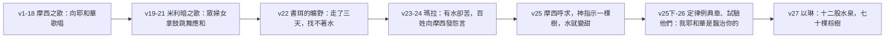

# 出埃及記 第15章

<!-- chapter-navigation:start -->
| [前一章](../02%20出埃及記/第14章.md) | [回目錄](../02%20出埃及記/全書目錄及綱要.md) | [下一章](../02%20出埃及記/第16章.md) |
| :--- | :---: | ---: |
<!-- chapter-navigation:end -->

1. 那時，[[摩西]]和以色列人向[[耶和華]][[摩西之歌|唱歌說]]：我要向耶和華歌唱，因他大大戰勝，將馬和騎馬的[[海（紅海）|投在海中]]。
2. [[耶和華是我的力量我的詩歌我的拯救|耶和華是我的力量，我的詩歌，也成了我的拯救]]。這是我的神，我要讚美他，是我父親的神，我要尊崇他。
3. [[耶和華是戰士]]；他的名是耶和華。
4. [[法老]]的車輛、軍兵，[[耶和華]]已拋在[[海（紅海）|海]]中；他特選的軍長都[[海（紅海）|沉於紅海]]。
5. 深水淹沒他們；他們如同石頭墜到深處。
6. [[耶和華]]啊，[[神的右手|你的右手]]施展能力，顯出榮耀；耶和華啊，你的右手摔碎仇敵。
7. 你大發威嚴，[[審判|推翻那些起來攻擊你的]]；你發出[[來12：29 我們的神乃是烈火|烈怒如火]]，燒滅他們像燒碎秸一樣。
8. 你發鼻中的氣，水便聚起成堆，大水直立如壘，[[海（紅海）|海中的深水凝結]]。
9. 仇敵說：我要追趕，我要追上；我要分擄物，我要在他們身上稱我的心願。我要拔出刀來，親手殺滅他們。
10. 你叫風一吹，[[海（紅海）|海就把他們淹沒]]；他們[[審判|如鉛沉在大水之中]]。
11. [[耶和華]]啊，眾神之中，誰能像你？誰能像你─至聖至榮，可頌可畏，施行奇事？
12. [[神的右手|你伸出右手]]，[[審判|地便吞滅他們]]。
13. [[神的慈愛引領|你憑慈愛領了你所贖的百姓]]；你憑能力引他們到了[[神的聖所|你的聖所]]。
14. 外邦人聽見就發顫；疼痛抓住[[非利士地|非利士]]的居民。
15. 那時，[[以東]]的族長驚惶，[[摩押]]的英雄被戰兢抓住，[[迦南]]的居民心都消化了。
16. 驚駭恐懼臨到他們。[[耶和華]]啊，因你膀臂的大能，他們如石頭寂然不動，等候你的百姓過去，等候你所贖的百姓過去。
17. 你要將他們領進去，栽於你產業的山上─[[耶和華]]啊，就是你為自己所造的住處；主啊，就是[[神的聖所|你手所建立的聖所]]。
18. [[耶和華作王|耶和華必作王，直到永永遠遠]]！
19. [[法老]]的馬匹、車輛，和馬兵下到[[海（紅海）|海]]中，[[耶和華]]使海水回流，淹沒他們；[[過紅海|惟有以色列人在海中走乾地]]。
20. [[亞倫]]的姊姊，女先知[[米利暗]]，手裡拿著鼓；眾婦女也跟他出去拿鼓跳舞。
21. [[米利暗]]應聲說：[[米利暗之歌|你們要歌頌耶和華]]，因他大大戰勝，將馬和騎馬的[[海（紅海）|投在海中]]。
22. [[摩西]]領以色列人[[海（紅海）|從紅海往前行]]，到了[[書珥的曠野]]，在曠野走了三天，找不著水。
23. [[瑪拉|到了瑪拉]]，不能喝那裡的水；因為水苦，所以那地名叫瑪拉。
24. 百姓就向[[摩西]][[以色列人的怨言|發怨言]]，說：我們喝什麼呢？
25. [[摩西]]呼求[[耶和華]]，[[瑪拉苦水變甜|耶和華指示他一棵樹]]。他把樹丟在水裡，[[瑪拉苦水變甜|水就變甜了]]。耶和華在那裡為他們定了律例、典章，[[神的試驗|在那裡試驗他們]]；
26. 又說：[[聽命順從蒙醫治|你若留意聽耶和華]]─你神的話，又行我眼中看為正的事，留心聽我的誡命，守我一切的律例，我就不將所加與埃及人的疾病加在你身上，因為我─[[耶和華拉法|耶和華是醫治你的]]。
27. [[以琳|他們到了以琳]]，在那裡有十二股水泉，七十棵棕樹；他們就在那裡的水邊安營。

---

## 本章知識節點

### 神學
- [[摩西之歌]]
- [[米利暗之歌]]
- [[耶和華是戰士]]
- [[耶和華是我的力量我的詩歌我的拯救]]
- [[耶和華作王]]
- [[神的右手]]
- [[耶和華拉法]]
- [[神的聖所]]
- [[神的慈愛引領]]
- [[救恩]]
- [[審判]]
- [[神的試驗]]

### 主題
- [[聽命順從蒙醫治]]

### 事件
- [[瑪拉苦水變甜]]

### 歷史
- [[過紅海]]
- [[以色列人的怨言]]

### 地點
- [[海（紅海）]]
- [[書珥的曠野]]
- [[書珥]]
- [[瑪拉]]
- [[以琳]]
- [[非利士地]]
- [[以東]]
- [[摩押]]
- [[迦南]]

### 原文
- [[一棵樹]]

### 文化
- [[女先知]]

### 人物
- [[摩西]]
- [[米利暗]]
- [[亞倫]]
- [[法老]]
- [[耶和華]]

### 解經爭議
- [[摩西之歌的分段與年代]]
- [[十二與七十是否有象徵意義]]
- [[出埃及的年代]]
- [[紅海指的是哪個海]]

### 互文
- [[啟15：2-4 羔羊之歌]]
- [[賽12：2 耶和華是我的力量我的詩歌]]
- [[詩118：14 耶和華是我的力量我的詩歌]]
- [[來12：29 我們的神乃是烈火]]
- [[林前10：10 不要發怨言]]

---

## 本章整理

CT 給本章的標題只有六個字，卻把全章的落差說盡了：【從歌頌神到埋怨神】。第14章結束在「敬畏耶和華，又信服他和他的僕人摩西」，第15章開頭是聖經第一首歌，而三天之後，同一批口在發怨言。

```mermaid
flowchart LR
  A["v1-18 摩西之歌：向耶和華歌唱"] --> B["v19-21 米利暗之歌：眾婦女拿鼓跳舞應和"]
  B --> C["v22 書珥的曠野：走了三天，找不著水"]
  C --> D["v23-24 瑪拉：有水卻苦，百姓向摩西發怨言"]
  D --> E["v25 摩西呼求，神指示一棵樹，水就變甜"]
  E --> F["v25下-26 定律例典章、試驗他們：我耶和華是醫治你的"]
  F --> G["v27 以琳：十二股水泉，七十棵棕樹"]
```

### 一、聖經裡的第一首歌（v1）

KC 一開口就把這件事的份量點出來：這是聖經第一次出現歌唱，唱的是一群從埃及被贖出來、已經安然到了紅海彼岸、仇敵權勢已被打破的百姓。BH 也說這是聖經第一首有記載的詩歌，是紅海拯救之後自發的讚美。CT 從對比看同一件事：「以色列人在埃及地時盡是嘆息哀哼（參二23~24），如今卻開口歌唱。」GT 丁良才《出埃及記註釋》補上一句次序：「以色列人蒙了神的拯救以後，才有歌唱。」

CT 的〔話中之光〕另注意到唱歌的時機：「以色列人並未在行經紅海的路上讚美歌頌神，而是到達紅海彼岸之後才發覺他們剛經歷了大神蹟，因此唱歌。我們信徒也常常等到回頭看所經歷過的事，才發覺自己身歷一個神蹟。」

這首歌還會再唱一次。KC 指出末後的日子，勝過獸的人要站在玻璃海上，唱摩西的歌與羔羊的歌（[[啟15：2-4 羔羊之歌|啟15:2-3]]）——他並指出這是聖經最後一次提到歌唱。CT 的〔話中之光〕用的是中文和合本的說法：將來必看見許多從世俗中、從今世苦海中得了釋放、得了救、得了勝的信徒，站在玻璃海上「唱神僕人摩西的歌，和羔羊的歌」。GT《聖經精讀本──出埃及記註解》說法相同：這首歌「還具有預言性的性質」，將與羔羊之歌一同「在最後審判的那天被勝利者高唱」。

### 二、[[摩西之歌]]唱的是誰（v2-12）

「[[耶和華是我的力量我的詩歌我的拯救|耶和華是我的力量，我的詩歌，也成了我的拯救]]」——這一句後來被詩篇118:14 與以賽亞書12:2 直接引用（GT 丁良才）。「詩歌」這個詞怎麼譯，各家分歧：CT 說它「含有保護之意」，GT《中文聖經註釋》把兩條線並列——撒瑪利亞抄本和武加大譯本作「我讚美的歌」，七十士譯本和現代有些學者則認為應譯成「保護」；GT《丁道爾聖經註釋》傾向後者，因為「基於阿拉伯語的同源字，這樣比較合乎上文下理」。它另提醒「我要讚美祂」這個字「在希伯來文獻中沒有再出現過」，現有的翻譯不過是臆測。這裡稱呼神用的是簡稱 YH 而非全名 YHWH（《丁道爾》）；GT《聖經精讀本》說字面意思是「我的力量和詩歌是 Jah」。

「[[耶和華是戰士]]，祂的名是耶和華」是全詩最短也最重的一句。GT《中文聖經註釋》列出各譯本的差異：原文直譯是「戰爭的人」，撒瑪利亞抄本和敘利亞文譯本作「大能的英雄」，七十士譯本則繙為「神是粉碎戰爭的」。GT《舊約聖經背景註釋》在這裡做了一個關鍵區辨：

| 對照 | 古代近東神話 | 摩西之歌 |
| --- | --- | --- |
| 對手是誰 | 瑪爾杜克（巴比倫）與巴力（迦南）制服的是海洋——他們仇敵的化身 | 耶和華「利用自然的海洋（不是超自然神祇的化身），擊敗在歷史中與祂為敵的人類」 |
| 共通處 | 在爭戰中建立秩序、被高舉為王、設立居所 | 同樣具備這三個母題 |

「你的[[神的右手|右手]]施展能力」（v6、v12）是全詩的另一條主線。GT《中文聖經註釋》說右手「不單指一般人用右手拿兵器……也象徵坐在帝王右邊的宰相為掌權之發號施令者」；GT《聖經精讀本》點出它的兩面：「這手對選民來說象徵著保護和指引，但是對敵人來說則是恐懼的審判之手。」v12 的「地便吞滅他們」可能不是指地面——GT《舊約聖經背景註釋》說「希伯來語中的『地』字有時可解作『冥界』」，GT《串珠聖經註釋》說「根據烏迦列文的字義，可譯作地下陰間」，CT 則按字面讀成「形容直墜地府陰間」。

v9 是全詩節奏最急的一段。GT《中文聖經註釋》把仇敵的六句誇口逐行排開——我要追趕、我要追上、我要分擄物、我要在他們身上稱我的心願、我要拔出刀來、親手殺滅他們——然後接上 v10 的一句「你叫風一吹」。KC 把這個對比說得最省字：消滅仇敵在神不過是呼出一口氣的代價。GT《丁道爾聖經註釋》另指出「拔出刀來」原文並不是拔刀出鞘，而是從已刺入的部位拔出來，「意思是殺了又殺」；而「殺滅他們」這個有力的動詞後來也用在以色列驅逐迦南人、得他們的土地上——「這話出自埃及人口中，對以色列來說充滿了詩意的反諷」。

至於神「發鼻中的氣」，GT《串珠聖經註釋》說這是「從神學觀點解釋那大東風來源」；GT《丁道爾聖經註釋》提醒「這段經文本質上是詩歌，因此我們萬不能將『水便聚起成堆』按字面的意思解釋」。

### 三、[[神的慈愛引領]]與[[神的聖所]]（v13-18）

前半唱過去，後半唱將來。「你憑[[神的慈愛引領|慈愛]]領了你所贖的百姓」——GT《丁道爾聖經註釋》給「慈愛」下的定義是「形容神對祂子民堅定不渝的愛，是舊約最偉大的盟約用辭之一」；GT 丁良才把這一節讀成三個「憑」：憑恩惠救贖、憑慈愛領出、憑能力引導。CT 的〔話中之光〕從人這一面說：「感謝神，祂用『慈愛』帶領我們，而不是用『公義』；否則，照我們的本相，恐怕早就倒斃在曠野中了。」

外邦各族的反應（v14-16）在原文裡全用過去式，但事情還沒發生。這就帶出[[摩西之歌的分段與年代|本章最大的解經分歧]]：

| 主張 | 代表 | 說法 |
| --- | --- | --- |
| 完成式預言 | CT | 13-16 節是「完成式預言」，17-18 節是「未來式預言」；並在 v14、15、16 各附備註申明 |
| 先知式完成時態 | GT《丁道爾聖經註釋》 | 「將未曾發生的事件，當作既成的事實描述。這做法從前十分常見，舊約先知書中尤其普遍」 |
| 聖殿建成後的加筆 | GT《中文聖經註釋》 | 「這首詩歌卻是在迦南地，聖殿建立後，在節慶崇拜儀式中使用此詩歌時，逐漸加上去的」 |

兩派各有硬證據。主張後期的一方指向 v14 的「[[非利士地|非利士的居民]]」——GT《丁道爾聖經註釋》說「主前一一八八年非利士人抵達迦南以前，這地不可能有此名稱」——以及 v17 的「你手所建立的聖所」。主張早期的一方則指出，同一份《丁道爾》也認為 v17 的平行語句「未必直指錫安山或所羅門的聖殿」，更遠古的拉斯珊拉泥版已有類似語言，而全詩「強而有力的韻律，簡潔而深奧的思想，富有古風的語言，都顯示這歌是早期的作品」。

「聖所」這個詞本身在 v13 與 v17 用的不是同一個字（GT《中文聖經註釋》）：v13 的字源出於牧人或羊群所居之所加上一個「聖」字，v17 的才指錫安山。CT 在 v13 逐一否掉聖殿、天上聖所、迦南美地三種解釋，主張以 v17 的「產業的山上」「住處」「聖所」回頭解釋 v13。KC 讀出的則是兩種居所的分別：聖殿屬於在地上的百姓、是固定的居所，會幕屬於在曠野的百姓、是可移動的居所——而教會同時具備這兩面。

全詩收在「[[耶和華作王]]，直到永永遠遠」。GT《中文聖經註釋》說這是「這首詩歌極佳的結語」；GT《舊約聖經背景註釋》特別區辨：這一節「不是將耶和華描繪為制服了宇宙，統管屬下眾神的神話性君王。反之，祂是在歷史現實中統治祂藉自己所操縱的自然力量，拯救出來的子民」。

### 四、[[米利暗之歌]]與[[女先知]]（v19-21）

v19 是散文，把鏡頭從詩歌拉回事件；v20-21 是[[米利暗]]和眾婦女的應和。CT 說「麻雀雖小，五臟俱全」——米利暗之歌雖短，摩西之歌的骨架一應俱全：歌頌神的所是、讚美神的所作、將埃及軍兵投在海中、感謝神保守以色列人。

「[[女先知]]」這個稱號在此第一次出現。CT 說它「指為神說話的女人，可見神並不輕看女性」；GT《中文聖經註釋》說米利暗「是聖經頭一個被稱為女先知的，可見以色列在傳統上，並不歧視女性在宗教上的地位」。GT 丁良才與《啟導本聖經腳註》各列了一份名單（底波拉、戶勒大、以賽亞的妻、挪亞底、亞拿、腓利的四個女兒）。GT《舊約聖經背景註釋》從外證補一句：「在馬里的先知文獻中，女人出現的次數與男人相等。」

「[[亞倫]]的姐姐」這個稱呼引出各家的推敲。GT 丁良才認為「這一句顯明這書是摩西寫的，若是別人寫的，就必稱米利暗為摩西的姊姊，因為摩西比亞倫更出名」；GT《聖經精讀本》則說米利暗「作為百姓的領袖在以色列內部具有與亞倫同等地位，但與摩西是不可能平起的」。KC 引彌迦書6:4 指出耶和華差在百姓前面的不只摩西和亞倫，也包括她；而在她身上看見的是預言的靈——她帶領百姓唱出的，是對摩西之歌的「阿們」。

至於鼓與跳舞，GT《中文聖經註釋》認為這是後期加筆的兩個線索：這種樂器的使用「沒有早於晚銅器時代的」，而婦女出來拿鼓跳舞迎接得勝者「是在住定迦南之後才有的習慣」。GT《丁道爾聖經註釋》也說「婦女經常在戰爭勝利之時，而不在宗教儀式中跳舞唱歌」，但補上：後世的女歌手在喪禮中唱歌、在聖殿唱歌的人也包括女性，「聖俗之分起碼在以色列初期並不存在」。

### 五、三天無水：[[書珥的曠野]]（v22）

歌唱之後緊接的不是節期，而是試煉。KC 把這個落差說得很直接：三天的路程進到曠野，然後為耶和華守節，這原是神的目的（出7:16；8:27-28）——但事情沒有這樣發展，那不成了節期，成了試驗。他接著問：以色列人怎麼可能在那麼大的拯救之後這麼快就發怨言？若我們覺得不可思議，大概是還不認識自己。

「[[書珥的曠野|書珥]]」的名字有兩個來源。GT《中文聖經註釋》說它在埃及文有「牆」或「堡壘」的意思，埃及人自主前第二十世紀中葉起就在這區域建造軍事堡壘；在希伯來文則有「旅行」的含義。GT《舊約聖經背景註釋》把這道防線指名為「統治者之牆」，並指民數記三十三8 稱這裡為「伊坦的曠野」（「伊坦」即「碉堡」）也支持這個解釋。GT《中文聖經註釋》另指出，三天無水的敘述「大概也和他們原來向法老要求『走三天的路程，為要祭祀耶和華』（三18，五3等）遙相呼應」——為要證明事奉神原是一項艱苦難行的工作。

三天在曠野找不到水有多嚴重？同一份註釋說：曠野和沙漠極其乾旱，「人縱不出汗，身體上的水份也被乾旱的空氣吸收蒸發，而極易產生脫水症，以致頭疼後，逐漸昏迷不知人事而死去」。

### 六、[[瑪拉苦水變甜|瑪拉]]：有水，卻是苦的（v23-26）

「[[瑪拉]]」意為「苦」，正是路得記一20 拿俄米自稱的那個字（CT）。水為什麼苦，來源給的是礦物質：GT《串珠聖經註釋》說「那裡的水含有礦鹽，所以呈苦澀味」，GT《舊約聖經背景註釋》說「當地的水是鹽水，含有很高的礦物質成分」。GT《中文聖經註釋》形容當時的心境：三天找不到水，「已可顯出以色列人每一分鐘前行時焦灼的心態，等到找了水，又不能喝那裏的水，就更令歷經苦難的旅途上的人，情躁心焦」。

[[以色列人的怨言|百姓就向摩西發怨言]]。GT 丁良才把整條線列了出來：「以色列人所發的怨言至少還有七次：（一）十六2；（二）十七23；（三）民十一1、4、33-34；（四）十四2；（五）十六41；（六）二十一5；（七）書九18，參[[林前10：10 不要發怨言|林前十10]]。」GT《丁道爾聖經註釋》說直接埋怨神指派的領袖，就是間接埋怨神（出十六8）。CT 的〔話中之光〕最不留情：「前不幾日在海邊大聲讚美神的口，竟然因為稍遇艱苦，即發怨言……因水口苦，固然難過，因罪心苦，更是難過。」

摩西沒有反擊百姓，他呼求耶和華。神指示他[[一棵樹]]——CT 特別強調量詞：「不是一種樹，乃是一棵樹，表示它是獨一無二的解決方法。」它並排除化學解釋：一棵樹的質與量不足以改變那樣大量水的質素，「只能歸因於神蹟」。GT 丁良才直接說「這棵樹預表基督並祂的十字架」；KC 把預表分兩層：一是基督自己，二是基督在木頭上所成就的工作。GT《丁道爾聖經註釋》則從動詞下手：「『指示』的字根，和『妥拉』（即『教訓』）的字根相同」——這一節下半正好接著「耶和華在那裡為他們定了律例、典章」。

神在這裡[[神的試驗|試驗他們]]，並自報一個新名號：「因為我耶和華是醫治你的」（[[耶和華拉法]]）。BH 指出這裡引入的名字是 Jehovah-Rapha，意思是「醫治的主」；GT《聖經精讀本》從原文補一層：「這裡『醫治』一詞的希伯來語是指『醫生』。」這醫治的範圍有多大，各家收放不同——GT《丁道爾聖經註釋》收得最窄，認為「加在」埃及人身上的更準確一點是變水為血、使之不能飲用之災；GT《中文聖經註釋》放得最寬，認為既與律例典章相連，「其醫治就不單指屬身體上的疾病了」。CT 則在這裡下了一句很重的警告：「有些靈恩派的神醫信仰者，錯誤地應用此處經文，而把信徒所生的一切疾病，歸咎於不聽神的話，因此自食其果。」

KC 注意到神在這裡的作法：祂沒有挪去試煉，而是把基督引進試煉裡；而在民數記，同樣的怨言神會刑罰，因為那時百姓已站在律法的基礎上——這裡祂還是以恩典行事。

### 七、[[以琳]]：十二股水泉，七十棵棕樹（v27）

CT 形容以琳是「沙漠中的綠洲，乾渴中的滋潤，炎熱中的陰涼處」。名字的字義各家略有出入：GT《中文聖經註釋》說可解作「大樹」，也可意譯為「眾神」；GT《丁道爾聖經註釋》說是「篤耨樹」；KC 說是「樹」，可能指橡樹或棕樹。

[[十二與七十是否有象徵意義|那兩個數字要不要作象徵解]]，來源分成兩派。CT〔靈意註解〕說「『十二』和『七十』在聖經裡象徵『完全』」，並記十二支派／七十長老一說；GT《中文聖經註釋》從祭典善用象徵數字立論；KC 把它接到教會——以色列有十二先祖，教會有十二使徒；以色列有七十長老，主也差派過七十個人（路10:1）。GT《丁道爾聖經註釋》則反對：「並沒有靈意解釋的必要，這兩個可能都是實數，又可能是個概約數」，因為「對希伯來人來說，兩個數字都代表了完美」。GT《舊約聖經背景註釋》走實地路線，並指阿榮穆薩（「摩西泉」）「尚有水泉十二股，因此可能性更高」。

不論數字是否有象徵，兩地的次序沒有爭議。CT：「在信徒的靈程中，須先有瑪拉的試煉和苦難，後才有以琳的祝福和甘甜」；GT 丁良才：「以色列人先到瑪拉，後到以琳，顯明神教訓選民先苦後樂的定理」；KC 說得最短：==沒有瑪拉就沒有以琳==。

**參考資料**
https://www.ccbiblestudy.org/Old%20Testament/02Exo/02CT15.htm
https://www.ccbiblestudy.org/Old%20Testament/02Exo/02GT15.htm
https://www.kingcomments.com/en/bible-studies/Exo/15
https://biblehub.com/study/exodus/15.htm

<!-- appendix-links:start -->
## 附錄

### 相關地圖
- [[appendix/fhl_maps/maps/019|〈出圖二〉以色列人出埃及到西乃山]]
- [[appendix/fhl_maps/maps/024|〈民圖五〉出埃及和進迦南的旅程]]
<!-- appendix-links:end -->

<!-- chapter-navigation:start -->
| [前一章](../02%20出埃及記/第14章.md) | [回目錄](../02%20出埃及記/全書目錄及綱要.md) | [下一章](../02%20出埃及記/第16章.md) |
| :--- | :---: | ---: |
<!-- chapter-navigation:end -->
