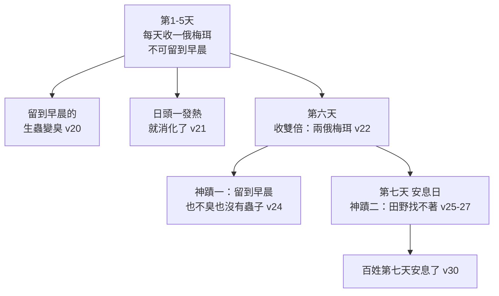
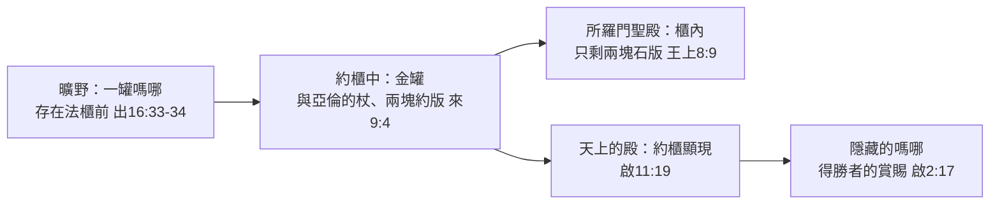
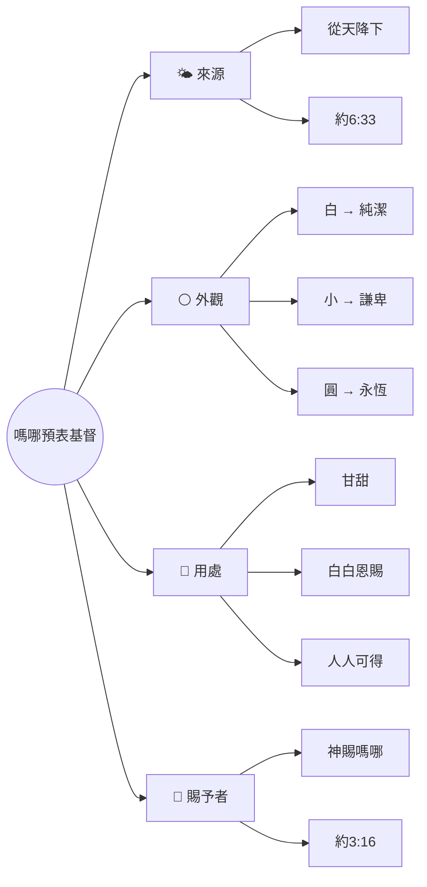

# 出埃及記 第16章

1. [[以色列]]全會眾從[[以琳]]起行，在出[[埃及]]後第二個月十五日到了以琳和[[西乃]]中間、[[汛的曠野]]。
2. [[以色列]]全會眾在曠野向[[摩西]]、[[亞倫]][[以色列人的怨言|發怨言]]，
3. 說：巴不得我們早死在[[埃及]]地、[[耶和華]]的手下；那時我們坐在肉鍋旁邊，吃得飽足。你們將我們領出來，到這曠野，是要叫這全會眾都餓死啊！
4. [[耶和華]]對[[摩西]]說：我要將[[嗎哪|糧食從天降給你們]]。百姓可以出去，每天收每天的分，我[[神的試驗|好試驗他們遵不遵我的法度]]。
5. 到第六天，他們要把所收進來的預備好了，[[安息日的前身|比每天所收的多一倍]]。
6. [[摩西]]、[[亞倫]]對[[以色列]]眾人說：到了晚上，你們要知道是[[耶和華]]將你們從[[埃及]]地領出來的。
7. 早晨，你們要看見[[耶和華的榮光|耶和華的榮耀]]，因為耶和華聽見你們向他所發的怨言了。我們算什麼，你們竟向我們發怨言呢？
8. [[摩西]]又說：[[耶和華]]晚上必給你們肉吃，早晨必給你們食物得飽；因為你們向耶和華發的怨言，他都聽見了。我們算什麼，[[以色列人的怨言|你們的怨言不是向我們發的，乃是向耶和華發的]]。
9. [[摩西]]對[[亞倫]]說：你告訴[[以色列]]全會眾說：你們就近[[耶和華]]面前，因為他已經聽見你們的怨言了。
10. [[亞倫]]正對[[以色列]]全會眾說話的時候，他們向曠野觀看，不料，[[耶和華的榮光|耶和華的榮光在雲中顯現]]。
11. [[耶和華]]曉諭[[摩西]]說：
12. 我已經聽見[[以色列人的怨言]]。你告訴他們說：到黃昏的時候，你們要吃肉，早晨必有食物得飽，你們就知道我是[[耶和華]]─你們的神。
13. 到了晚上，有[[鵪鶉遮營|鵪鶉飛來，遮滿了營]]；[[鵪鶉遷徙|早晨在營四圍的地上有露水]]。
14. 露水上升之後，不料，野地面上有如白霜的[[嗎哪的物理特性|小圓物]]。
15. [[以色列|以色列人]]看見，不知道是什麼，就彼此對問說：[[嗎哪（ What is it ）|這是什麼呢]]？[[摩西]]對他們說：[[天降嗎哪|這就是耶和華給你們吃的食物]]。
16. [[耶和華]]所吩咐的是這樣：你們要按著各人的飯量，為帳棚裡的人，按著人數收起來，各拿一[[俄梅珥（ omer ）|俄梅珥]]。
17. [[以色列|以色列人]]就這樣行；有多收的，有少收的。
18. 及至用[[俄梅珥（ omer ）|俄梅珥]]量一量，[[林後8：13-15 多收的沒有餘少收的沒有缺|多收的也沒有餘，少收的也沒有缺]]；各人按著自己的飯量收取。
19. [[摩西]]對他們說：[[神的供應|所收的，不許什麼人留到早晨]]。
20. 然而他們不聽[[摩西]]的話，內中有留到早晨的，就生蟲變臭了；摩西便向他們發怒。
21. 他們每日早晨，按著各人的飯量收取，[[神的供應|日頭一發熱，就消化了]]。
22. 到第六天，[[安息日收取規定|他們收了雙倍的食物]]，每人兩[[俄梅珥（ omer ）|俄梅珥]]。會眾的官長來告訴[[摩西]]；
23. [[摩西]]對他們說：[[耶和華]]這樣說：[[安息日的設立|明天是聖安息日]]，是向耶和華守的聖安息日。你們要烤的就烤了，要煮的就煮了，所剩下的都留到早晨。
24. 他們就照[[摩西]]的吩咐留到早晨，[[安息日收取規定|也不臭，裡頭也沒有蟲子]]。
25. [[摩西]]說：你們今天吃這個吧！因為今天是向[[耶和華]]守的[[安息日]]；你們在田野必找不著了。
26. 六天可以收取，第七天乃是[[安息日]]，那一天必沒有了。
27. 第七天，百姓中有人出去收，什麼也找不著。
28. [[耶和華]]對[[摩西]]說：你們不肯守我的誡命和律法，要到幾時呢？
29. 你們看！[[安息日的前身|耶和華既將安息日賜給你們]]，所以第六天他賜給你們兩天的食物，第七天各人要住在自己的地方，不許什麼人出去。
30. 於是百姓第七天[[安息日收取規定|安息]]了。
31. 這食物，[[以色列]]家叫[[嗎哪]]；[[嗎哪的物理特性|樣子像芫荽子，顏色是白的，滋味如同攙蜜的薄餅]]。
32. [[摩西]]說：[[耶和華]]所吩咐的是這樣：要將一滿[[俄梅珥（ omer ）|俄梅珥]]（俄梅珥就是伊法十分之一）[[嗎哪]]留到世世代代，使後人可以看見我當日將你們領出[[埃及]]地，在曠野所給你們吃的食物。
33. [[摩西]]對[[亞倫]]說：[[保存一俄梅珥嗎哪|你拿一個罐子，盛一滿俄梅珥嗎哪]]，存在[[耶和華]]面前，要留到世世代代。
34. [[耶和華]]怎麼吩咐[[摩西]]，[[亞倫]]就怎麼行，把[[嗎哪]][[保存一俄梅珥嗎哪|放在法櫃前存留]]。
35. [[以色列|以色列人]]吃[[嗎哪]]共四十年，直到進了有人居住之地，就是[[迦南]]的境界。
36. （[[俄梅珥（ omer ）|俄梅珥]]就是伊法十分之一。）

<!-- fhl-map-links:start -->
## 相關地圖

- [[appendix/fhl_maps/maps/019|〈出圖二〉以色列人出埃及到西乃山]]
- [[appendix/fhl_maps/maps/024|〈民圖五〉出埃及和進迦南的旅程]]
<!-- fhl-map-links:end -->

---

## 本章知識節點

### 主題
- [[嗎哪]]
- [[神的供應]]

### 神學
- [[嗎哪預表基督]]
- [[安息日的設立]]
- [[耶和華的榮光]]
- [[神的試驗]]
- [[聽命順從蒙醫治]]

### 原文／名字
- [[嗎哪（ What is it ）]]
- [[俄梅珥（ omer ）]]
- [[汛（ Sin thorn ）]]

### 地點
- [[汛的曠野]]
- [[西乃]]
- [[以琳]]
- [[迦南]]

### 人物
- [[摩西]]
- [[亞倫]]
- [[耶和華]]

### 互文
- [[約6：31-35 耶穌是生命的糧]]
- [[約6：51 我是從天上降下來的活糧]]
- [[林後8：13-15 多收的沒有餘少收的沒有缺]]
- [[啟2：17 隱藏的嗎哪]]
- [[來9：4 盛嗎哪的金罐]]
- [[詩78：24-25 天上的糧食]]
- [[申8：3 人活著不是單靠食物]]
- [[腓2：14 不發怨言]]

### 背景
- [[汛的曠野地理]]
- [[鵪鶉遷徙]]
- [[嗎哪的物理特性]]
- [[安息日的前身]]

### 事件
- [[天降嗎哪]]
- [[鵪鶉遮營]]
- [[安息日收取規定]]
- [[保存一俄梅珥嗎哪]]

### 歷史
- [[以色列人的怨言]]

---

## 本章整理

CT 給本章的標題是**【天降嗎哪】**。**第15章結束在以琳的十二股水泉；第16章一開頭，以色列人就得離開它。**KC 一句話點出這個結構：**「百姓不能留在以琳，不管那裡多麼令人愉快。他們必須起行，進入曠野。**——**在救贖、詩歌、瑪拉的試煉和以琳的安息之後，真正的曠野生活如今開始了。」**

### 經文大綱

1. **在[[汛的曠野]]為缺食物發怨言**（1-3節）
2. **神應許黃昏必吃肉，早晨必有食物得飽**（4-12節）
3. **晚上有鵪鶉飛來，早晨降[[嗎哪]]**（13-15節）
4. **收取嗎哪的規定**（16-30節）
5. **盛滿一罐嗎哪作為紀念**（31-36節）

### 一、[[以色列人的怨言|汛的曠野怨言]]（v1-3）

**「[[以色列|以色列全會眾]]」——這個詞在五經是第一次出現。**《中文聖經註釋》與 CT 都注意到了。CT 從中讀出目的：**「以色列人蒙神拯救出埃及，最主要的目的是為著事奉神，因此，他們必須聚集在一起，『全會眾』同工配搭，才能達成這個目的，**——**而這個『全會眾』也就成了新約時代『教會』的模型。」**

**時間點是關鍵。**《中文聖經註釋》：**「目的不單在記年月日，也在表明從正月十四日喫逾越節羊羔後，以色列人於翌日離開埃及，至今已有一個月了。**——**他們所帶的食物早就用光了。」**KC 同讀：**「他們從埃及帶出來的全部存糧，這時可能已經耗盡了。」**

> [!info] [[汛的曠野]]不是尋的曠野
> **這是一個容易混淆、各家都特別澄清的點。**《中文聖經註釋》：**「汛的曠野（Wilderness of Sin）和尋的曠野（Wilderness of Zin），並不是同一個地區。尋的曠野是在猶大的南方，汛的曠野按傳統的說法，則在西乃半島的西隅。」**《丁道爾》從子音上區分：**「此地又有別於尋的曠野（sin，希伯來文子音不同），尋的曠野在汛以北二百英哩。」**
>
> **[[汛（ Sin thorn ）|「汛」與「西乃」有關係嗎？]]**《丁道爾》：**「汛（sin）和聖山西乃（sinay）兩個名字在語言學上可能有關係，但本段清楚顯示並非同一處地方。」**《中文聖經註釋》指出它的字義：**「意義為『荊棘』。」**CT 據此解釋為什麼怨言在這裡爆發：**「是一片長滿荊棘的曠野，難於找到食物。」**
>
> **BH 特別澄清一個中文讀者不會有、但英文讀者會有的誤解**：**「『汛』（Sin）之名與英文表示過犯的那個字無關，而可能源自一個閃族字根。」**

> [!quote] 「那時我們坐在肉鍋旁邊，吃得飽足」——記憶是會撒謊的
> **這是本章最被各家集中火力的一句話。**
>
> **《中文聖經註釋》**：**「這是在忍饑捱餓中的人，幻想過往生活的誇大話。這誇大的目的，是彰顯今日的艱難和加深與增強其埋怨的氣勢。」**
>
> **《精讀本》說得最不留情**：**「這是以色列人把在埃及所受的悲慘的奴僕生活（2:23;5:9）浪漫化了的場面。雖然在別人的監督下，也完全有可能煮粥煎餅，但即使是這樣，也不能把那段歲月說得如此浪漫，誇張成『吃得飽足』。**——**這充分體現了奴隸的本性。」**
>
> **《丁道爾》把它歸給人性，語氣反而溫和**：**「他們忘了在埃及是奴隸，反將其優點理想化，這也是人性。奴隸沒有多少肉吃，印象中的卻是巨形的肉鍋。**——**在聖經別處，他們又懷念尼羅河三角洲辛辣的蒜頭和香甜的西瓜」**（民11:5）。《舊約背景註釋》：**「他們美化了記憶中的埃及，形容大鍋中裝滿了『一桶一桶的』肉。」**
>
> **KC 則把鏡子轉向自己，這是本章最誠實的一句註解**：**「神的百姓竟是如此愚昧——我也是如此愚昧——當他們忘記救恩，當他們不再想起在瑪拉和以琳所有過的經歷。」**
>
> **他們真的快餓死了嗎？**丁良才查了帳：**「以色列人雖受試煉，當時卻未到了餓死的地步，因為他們還有許多的牲畜（十七3）。」**《丁道爾》補上原因：**「他們和其他牧人一樣，不願宰殺自己的牲口。」**《串珠》一句話：**「百姓其實不是真的快要餓死，只是懷戀在埃及所吃的美肉。」**
>
> **《中文聖經註釋》注意到這次怨言的性質升級了**：**「這些話卻不單是埋怨，而是指責了。這指責，並且是刑事的罪狀，而且指責他們有預謀陷害的嫌疑。**——**這是聽話的當事人，極難忍受的！」**《丁道爾》同：**「留意他們如何敏於指摘摩西居心不良，說他這樣做是故意的。」**

**這是第幾次怨言？**《中文聖經註釋》把兩次的差別分得很清楚：**「第一次的埋怨（十四11～12），是因敵人的臨近，面對死亡的威脅……這一次的埋怨，卻是為肚腹，而且埋怨到神了。第一次的埋怨，僅可能是百姓中的一些原為埃及人做工，作以色列人之領班的；**——**這一次的埋怨，卻是以色列的全會眾。」**

> [!example]- 丁良才：怨言的五層要理
> **這是本章對「怨言」最有系統的分析，值得完整收錄：**
>
> **「（一）出於不信**（不信神的應許和能力）**；（二）因忘主恩**（十五25，詩七十八13，一百零六13）**；（三）使人不安**（五21-22，十五24-25）**；（四）論理不公**：
>
> **（1）以過去的好處為大（十六3）；（2）以過去的苦難為小（一14、16、22，二23，三7）；（3）以當時的好處為小（十五1-2、25）；（4）以當時的苦難為大（十六3末句——以色列卻還有許多的牲畜）**
>
> **；（五）被主聽見**（十六7-9、12，參民十一10）。」
>
> ——**第四點的四個小項排在一起，正好是怨言的內在機制：把過去放大、把現在放大，只是方向相反。**

### 二、[[天降嗎哪|神的應許]]與[[耶和華的榮光]]（v4-12）

「我要將[[嗎哪|糧食從天降給你們]]」——**《中文聖經註釋》點出這句話的神蹟性質**：**「通常的糧食是地的出產，但神要從天降給。這是神蹟。」**CT 把這個對比讀成兩種需求：**「『從天降給』與『從地長出』相對，前者重在滿足精神心靈的需求，後者重在滿足肉身物質的需求。」**

**面對怨言，神沒有懲罰。**KC：**「正如在瑪拉，神沒有因他們的怨言懲罰他們。在祂的恩典裡祂迎向他們。」**

「我好[[神的試驗|試驗他們遵不遵我的法度]]」——**丁良才指出試驗有兩層**：**「（一）看他們肯不肯靠神（因為神一天只給他們夠一天所用的）；（二）看他們肯不肯遵神的法度」**（27-28節；申8:2）。CT 從「每天收每天的分」讀出信靠的性質：**「本句表示信靠神並不是一勞永逸的事，乃是一天過一天的信靠。」**

**《丁道爾》注意到一個新約的迴響**：**「神每日供應以色列的需要，可能是主禱文中『日用的飲食』之懇求的出處」**（太6:11）。

「你們的怨言不是向我們發的，乃是向[[耶和華]]發的」——

> [!important] 摩西的自辯，其實是歸榮耀給神
> **《中文聖經註釋》讀出這句話的雙重性**：**「『我們算甚麼』——這是摩西亞倫的自辯。但這自辯並不在解脫自身的責任，乃將榮耀歸給神。」**
>
> **《串珠》看得更深一層**：**「百姓企圖隱藏他們對神的不信，將責任推到摩西身上，**——**摩西卻將他們對神的不信一語道出。」**
>
> **丁良才把這個原則普遍化**：**「我們向神的僕人發怨言，就是向神發怨言」**（撒上8:7；路10:16；羅13:2）。CT 的〔話中之光〕：**「連偉大的摩西竟然也說『我們算什麼』，我們一般基督徒和傳道人更不可看自己過於所當看的」**（羅12:3）。
>
> **《中文聖經註釋》從「神都聽見了」讀出兩面**：**「神知道人的思念和言語，積極方面是鼓勵人要祈禱，消極方面乃要人去除怨言。**——**但是，出埃及記和民數記所記述的每一怨言，接必有神的作為……因為神聽見怨言後，固然在慈愛中為人解決問題，也在祂的公義中，對不信賴祂的行動作為施行應得的懲罰。」**

「[[耶和華的榮光|耶和華的榮光在雲中顯現]]」——**這是神首次向以色列全會眾顯現。**KC 講得最好：**「因此祂親自在雲中向百姓顯現。這是祂第一次向他們顯現。**——**祂顯現不是要滅絕他們，而是要用祂是誰來使他們折服。」**《舊約背景註釋》給了古代近東的對照：**「不是只有以色列的神學，才有神明以這種方式顯現的概念，美索不達米亞的神祇也是用其神性光輝梅嵐穆，來彰顯他們的能力。」**

**KC 指出神行動的目的**：**「神的行動是要提醒祂的百姓：是祂，耶和華，領他們出了埃及。他們把這事忘了。**——**當我們路上有試煉時，我們必須常常想到這事」**（羅8:32）。CT 也點出「知道」的性質：**「『知道』指經驗中的體認，而非僅道理上的知道。」**

### 三、[[鵪鶉遮營]]與嗎哪（v13-15）

> [!info] [[鵪鶉遷徙]]：一個自然現象，一個超自然的時機
> **各家對鵪鶉的自然史高度一致。**《中文聖經註釋》：**「鵪鶉是一種季候鳥，每年秋季由歐洲飛越地中海到西乃半島作短停……在他們經過長飛後，便很為疲累，而只離地面約三尺的大批集中飛行，極易為人捕捉。」**《丁道爾》：**「這是一種能夠持久但卻低飛的圓頭小鳥……牠們疲倦時連遊牧民族的黑色矮帳都不能越過，落地之後亦無法再度起飛。身手靈活的孩子，很容易便能捉到在地上奔跑的鵪鶉。」**
>
> **《舊約背景註釋》給了一個令人印象深刻的數字**：**「覓地棲息的鵪鶉，曾經有壓沉小舟的記錄。在西乃半島著陸時，鳥隻的密度可以擁擠到得降落在其他鵪鶉上面的地步。」**
>
> **但《啟導本》指出自然解釋的極限**：**「但此說不足解釋何以以色列人一年到頭都可捉到大量鵪鶉當肉來吃。**——**我們必須相信，掌管大自然的神可以要飛鳥聽命，完成祂的計畫。」**
>
> **一個時間上的巧合，《丁道爾》抓得很準**：**「鵪鶉約在三四月間，即逾越節後不久往北遷徙，這事實和民數記提到鵪鶉隨東風而至，在時間之上也很吻合。」**
>
> **鵪鶉只有這一次。**《中文聖經註釋》：**「繼續讀下去，一直到本章的完結，都沒有再出現鵪鶉，而只有嗎哪。這是顯明嗎哪為每天都有，鵪鶉卻不是。」**《丁道爾》指出第二次的結局完全不同：**「鵪鶉在民數記十一章，變為神用作懲罰以色列的『災殃』。」**《啟導本》：**「後來百姓厭惡嗎哪、貪吃鵪鶉、以致招禍」**（民11:13-34）。

**KC 從鵪鶉與嗎哪的次序讀出一個很深的次序**：**「百姓先在晚上得鵪鶉，然後次日早晨得嗎哪。在鵪鶉裡我們可以看見一幅圖畫：我們以另一位的死餵養自己……嗎哪代表基督在地上的降卑、在地上的生命。**——**我們只有先以祂的死餵養了自己、先與那位為我們死的主聯合了，才能夠來思想祂的生命。」**（CT 的靈意註解也有同一層：**「吃鵪鶉需流血，表示需接受主的救贖才得有分於靈糧。」**）

「[[嗎哪（ What is it ）|這是什麼呢]]？」——**這句話就是「嗎哪」這個名字。**

> [!note] 「嗎哪」的語源：一個至今仍在辯論的細節
> **《中文聖經註釋》把這件事講得最完整**：**「按原有的希伯來文 man hu 的正譯，應作『這是嗎哪』。但 man 的音譯並不是『嗎哪』。中文的這音譯，是根據七十士譯本的音譯而來的……晚期的亞蘭文，正和亞拉伯文一樣，將 man 的後面加一長 a 音（manna），便成了 what。**——**所以，嗎哪的原義，就成了『這是甚麼？』」**
>
> **《丁道爾》處理了「這是亞蘭文而非希伯來文」的反對意見**：**「經常有學者認為這個諧音或通俗語源的解釋所根據的是亞蘭文，因為依照正式的希伯來語，這句話應該是 mah-hu。**——**然而以色列人卻正是如此理解這句話。本節所用的大概是通俗語源的解法，亦即用希伯來語解釋來自外文的名字。」**（它以「摩西」一名的諧音解釋為對照。）

### 四、收取嗎哪的規定（v16-21）

**[[俄梅珥（ omer ）]]是多少？**CT：**「固體容量單位，為一伊法的十分之一，折合約2.2公升，相當於一個人三餐的份量。」**《精讀本》給字源：**「原來指『一把麥』，後成為指『一捆麥草的收穫量』。」**《丁道爾》則對份量存疑：**「後世的俄梅珥幾乎有一加侖之多……作為每日配給的糧食而言，一加侖分量太多了。」**

**《中文聖經註釋》解決了一個表面的矛盾**：「按各人的飯量」與「各拿一俄梅珥」看似衝突——**「因此，在平均食量之下，按各人的飯量各拿一俄梅珥，就不致成為矛盾了」**（即每人一俄梅珥正是全家每日食量的平均數）。

「[[林後8：13-15 多收的沒有餘少收的沒有缺|多收的也沒有餘，少收的也沒有缺]]」——

> [!question] 這是神蹟，還是分配？
> **這是本章各家分歧最明確的一處。**
>
> **神蹟派**：CT：**「這是另一個神蹟，表示神知道每一個人的需要。」**丁良才：**「若有人起了貪心，或因遇著好機會比別人多收一些，用俄梅珥量的時候，他也沒有餘，這無非是神蹟。」**《中文聖經註釋》同：**「這是另一個神蹟。不但是教訓他們不可貪心，也要有信心。」**
>
> **分配派**：**《丁道爾》提出了一個完全不同的讀法，並且拿保羅作證**：**「本節描述的可能不是神蹟，他們不過是一致同意每人一俄梅珥，將收集起來的嗎哪集中分配而已。**——**保羅在哥林多後書八章14、15節顯然是這樣解釋。」**
>
> **KC 也是從教會生活的角度應用**：**「保羅把第18節應用在教會的日常生活上……他從收取嗎哪學了一個功課，並說了幾件關於我們基督徒如何在物質上彼此照顧的事。」**
>
> **《中文聖經註釋》另注意到 v17「有多收的，有少收的」洩漏的心態**：**「多收的，顯明是貪心；少收的，可能信心不夠，只是收一點來嘗試嘗試其滋味而已。」**

**[[神的供應|「所收的，不許什麼人留到早晨」]]——為什麼？各家給了三個不同層次的理由：**

| 理由 | 出處 |
| --- | --- |
| 訓練不為明天憂慮，天天信靠神 | CT：「目的是要訓練神的百姓『不要為明天憂慮』（太六34）」；丁良才：「這也是要除掉人為己的心」 |
| 防止偷懶 | CT：「推其原因，不外是防備百姓偷懶」 |
| 衛生的實際考量 | 《中文聖經註釋》：「在曠野酷熱的天氣之下，食物留到第二天的，多數會變味腐壞，以致使食用的人產生疾病」 |

> [!important] KC：你不能靠昨天讀的東西活著
> **這是 KC 本章最有力的應用**：**「你不能靠你昨天所讀的活著。你若這樣作，就是靠陳舊的食物過活。**——**那時就有極大的危險：只會反覆講說舊的經歷，這對聽的人也是無聊的。它不再新鮮了。它成了叫人自高自大的知識。驕傲被餵養了，它屬於人，而那是發臭的。」**
>
> **為什麼要早晨收？**KC：**「最好在清早作，趁一日的忙亂還沒有來、還有機會的時候。**——**最大的榜樣就是主耶穌自己」**（賽50:4）。CT 的〔話中之光〕同：**「他們要趁早去取，因日頭一出就熔去，信徒讀聖經，也是清早較好，早晨是咱靈修的好時光。」**
>
> **CT 另一句話很值得記住**：**「基督徒不能靠過去的屬靈經歷，來維持現在靈性上的長進。」**
>
> **摩西為什麼發怒？**《中文聖經註釋》給了一個組織上的理由：**「為人極其謙和（民十二3）的摩西，之所以會向以色列人發怒，是因為他們在受試驗上失敗了。這是對神的不忠不信，也是對組織上和日後的駕馭上，極其不利的。**——**一個大團體，必須每個人對每個共同要遵守的條例都加以遵守，才能有組織上的效果和團體上的力量。」**

### 五、[[安息日的設立]]（v22-30）

**這是聖經中「安息日」一詞第一次出現。**《丁道爾》：**「雖然創世記二章2、3節已有設立的觀念，安息日一詞在聖經中出現，這卻是第一次。」**它另注意到原文的加強：**「本節在常用的 shabbat『安息日』一詞以外，又加插了一個更有力的字眼 shabbaton。」**《啟導本》：**「這是聖經中第一次正式提到安息日，也是以色列人最早守安息日的記載。」**

**嗎哪的一週節奏，本身就是一套教學設計——本章的三個神蹟全都掛在這條節奏上：**

**注意這條節奏的形狀**：**平日留到早晨會壞（v20），安息日留到早晨卻不壞（v24）——同一個東西，同一個動作，結果相反。**《中文聖經註釋》稱後者為神蹟，CT 引解經家的稱呼更傳神：**「有解經家稱它為『安息日的神蹟』，因為其他日子裡所剩下的嗎哪都會發臭生蟲，只有在安息日不會。」**而第七天的「找不著」也是神蹟——CT：**「降嗎哪是神蹟，唯獨在安息日，偏偏不降嗎哪也是神蹟，因此找也必找不著。」**

> [!question] [[安息日的前身]]：以色列人本來就知道安息日嗎？
> **這是本章一個尚未有定論的問題，各家立場如下：**
>
> **①本來就知道。**丁良才：**「本節顯明沒有傳律法以先，以色列人已經知道安息日的理」**（v5；創2:1-3）。又：**「以色列人大概知道哪一天是安息日，摩西不過提醒他們，以色列人在埃及為奴的時候，或者把安息日忽略了。」**他在 v29 進一步說：**「耶和華未必在23節才將安息日賜給以色列人」**（創2:1-3）。
>
> **②《丁道爾》給了一個很平衡的處理**：**「基於這句話以及違犯安息日的記載，有人提出安息日是個新奇的習俗，以色列人在埃及時並不遵守。**——**可能他們身為奴隸，才是不能遵守的原因；列祖對類似（起碼在胚始階段的）習俗大概已有認識。」**
>
> **③《中文聖經註釋》報告了學界的另一種來源說**：**「學者對安息日的起源，有頗多的推測，但大部分都認為可能源自古巴比倫。按字源上說，希伯來文的安息日是 Sabbath，亦可能來自亞喀得語的『清除節』（Sabattu）……古巴比倫則在每月的初七，十四，廿一和廿八或其接近的日子為『不祥日』或『忌日』。」**——**但它立刻指出決定性的差別**：**「但是，以色列人的安息日卻是以每六日之後的第七日……因為是聖的，是向神守的，所以嚴定甚麼工都不可作。」**（**巴比倫的是忌日，以色列的是聖日。**）
>
> **④《精讀本》從神學上定位**：**「這句話是為了試驗以色列百姓的順從與否，根據創造的秩序，暗示（創2:1-3）把具有神性起源的安息日律法化。」**

> [!important] KC：安息是特權，不是義務
> **這是本章對安息日最精準的一句話**：**「百姓那時可以有分於神的安息（創2:2-3）。安息不是義務，而是特權。**——**只有在西乃、律法賜下的時候，它才成為義務。」**
>
> **《精讀本》指出神為什麼在此只責備、不刑罰**：**「對那些犯了安息日規定的人只進行指責的原因是，當時還沒有律法出現，而且當時的以色列人猶如嬰兒一般（耶2:2），還處於吃奶的階段（林前3:2）。**——**但是律法出現之後，對那些犯安息日規定的人，處以死刑」**（民15:32-36）。
>
> **KC 把安息接到福音書**：**「在福音書中，安息與接受主耶穌相連（太11:28）。祂是安息日的主。凡有祂的，就有真安息，並能真正享受祂。」**
>
> **收與不收，KC 讀出兩面**：**「在其他日子，百姓必須出去收取食物。安息日卻不許可。這指出我們與主耶穌交往的兩個方面。第一，關於祂的知識不會憑空而來，我們必須勞苦於神的話。**——**第二，這只有在我們認識到一切都必須從主而來時才會作得好。」**
>
> **「你們不肯守我的誡命和律法，要到幾時呢？」**——CT 從這句責備讀出三層：**「少數人的悖逆，竟然會連累到整個民族被神責備；**……**只在一條誡命上沒有遵守，就被視為不遵守全部的律法（參雅二10）；**——**『要到幾時呢？』可見神仍滿有恩慈、寬容、忍耐，等待著祂的子民能夠悔改」**（羅2:4）。
>
> **「不許什麼人出去」是什麼意思？**丁良才作了很要緊的界定：**「就是出去收取嗎哪，辦他自己的私事，但他們可以去聚會敬拜神（利23:3；徒15:21）。也可行憐憫人的事」**（太12:1-13；可2:23-28）。

### 六、[[嗎哪的物理特性]]（v31）

> [!example]- 嗎哪是檉柳樹的分泌物嗎？——丁良才的六點反證
> **這是本章最激烈的一場爭論，而丁良才把兩者的差別列成了六點，極其完整：**
>
> **「神為以色列人所降的嗎哪與這樹汁不同處有六：（一）這樹汁，人只可在樹上或樹底下得著，嗎哪卻在全地上都能收取；（二）現在每年所產的樹汁，總共不過六七百斤，那時每天所降的嗎哪卻有幾百萬斤；（三）這樹汁在安息日也能收取，嗎哪在安息日卻不降；（四）這樹汁是一種藥料，嗎哪卻如糧食，能磨面，能烤，能煮；（五）這樹汁每年只流幾個禮拜，嗎哪卻四十年沒有間斷；（六）這樹汁現在還有，嗎哪卻到以色列人一進迦南就停止了。」**
>
> **CT 引賈玉銘，語氣更重**：**「今日教中之科學解經家，每以嗎哪不過為該處曠野之出產……殊不知今日於該處雖仍產與此類似之物，但煮之為糖水，烤之如糖醬，並不能磨為粉，作為餅，且僅產少許，合四十年所產，也不足以色列會眾一餐之用。」**
>
> **《精讀本》從三方面證實其超自然性**：**「①不分季節，40多年來只要以色列百姓行進的地方都有此物；②在特定的時間，在特定的場所，足夠使200多萬人食用；③特別是一周只供給6天，而且安息日的前一天供給2倍的數量。」**
>
> **《舊約背景註釋》是最傾向自然解釋的一家，但它自己也給出了數據上的難處**：**「嗎哪最常被學者認為是吸食檉柳樹汁之小蚜蟲的分泌物……問題是這種物質只於某個季節（公曆五至七月），在有檉柳之處出產。並且全季節的產量也不過是五百磅左右，相對而言，聖經記載每人每日的收集量是半磅。」**——**它的結論很誠實**：**「這現象和十災一樣，它的發生也不一定是其反常之處，超乎自然的是它發生的時間和幅度。**——**無論如何，基於自然現象的解釋似乎全都遠不及聖經的描寫。」**
>
> **《丁道爾》是各家中最傾向自然物的**：**「本節的形容加上它在日光之下消失（被螞蟻收集）的特點，幾乎可以確證嗎哪就是阿拉伯人稱為『曼』（man）的物質。」**——**但它立刻補上一句立場**：**「然而嗎哪不論是何種物質，神子民在曠野流浪期間，總是得到神不斷的供應。」**
>
> **《中文聖經註釋》的作者是唯一實地去過的**：**「筆者曾三次到西乃半島……但卻沒有找到過這種地衣。另一方面，檉柳樹上的小昆蟲排泄物，今日亦仍可找到。顏色和味道亦正如31節所言。**——**不過，縱令這嗎哪是當地的正常產物，要一時產量如此之大，能供飽如許多人，並如許長的時間，亦非有神的大能作為是不可能成就的。」**
>
> **一個技術性的旁證，《舊約背景註釋》**：**「然而昆蟲的分泌物是不會變臭的。」**（——v20 的生蟲變臭，自然解釋交代不了。）
>
> **「芫荽子」也有疑問。**《舊約背景註釋》：**「其種籽用來與嗎哪外貌相比的植物，大部分譯本都作芫荽。但芫荽在沙漠極少出現，這字較有可能是泛指有白色種籽的沙漠植物。」**《丁道爾》對「小圓物」同樣存疑：**「早期的猶大解經家將這字解作『小丸』，即球狀物體（故和合本譯『小圓物』）；但早期譯本及《盎克羅之他爾根》卻取『鱗片』的意思……同族語言卻支持『鱗片』的解釋。」**

### 七、[[保存一俄梅珥嗎哪]]（v32-36）

**這一罐嗎哪走過的路，是全本聖經最長的一條線之一：**

**KC 把這條線的神學說得極好**：**「屬靈地應用，這意思是神在全永遠裡回顧主耶穌在地上對祂是什麼。**……**在曠野裡一天也保存不住的，卻被保存到永遠。」**——**「只要神在地上與祂的百姓同行，祂就記念祂兒子在地上完全的生命。」**

**它接著把 v33 的「法櫃前」與來9:4 的「約櫃中」連起來**：**「這罐子必須放『在法櫃前』——那後來成為約櫃——就是神寶座所在之處。」**《舊約背景註釋》從敘事上解釋了這個時間差：**「第34節的『見證』只可能是指在記載之中，至此仍未製造的約櫃。第31～36節的附記來自曠野流浪時期的末尾（見35節），**——**可見嗎哪的樣本是在曠野歷程較後的時期，才放到約櫃之中的。」**

**這罐嗎哪後來去哪了？**CT：**「可惜後來在《士師記》時代因約櫃曾被非利士人擄去（參撒上四11），那個盛嗎哪的罐子隨之失傳。」**丁良才同：**「非利士人擄掠約櫃的時候，或者將盛嗎哪的罐子和亞倫的杖從約櫃取出失去了。」**CT 另註：**「到了所羅門時代聖殿至聖所裡的約櫃，僅存放兩塊石版，其餘兩樣都不知所終」**（王上8:9）。

**《串珠》從這一節讀出一個很漂亮的神學要點**：**「作者超越了時間的次序去敘述這事，為要帶出一個神學重點：**——**嗎哪（代表恩典）與法版（代表律法）都同是屬於神的。」**

**[[啟2：17 隱藏的嗎哪]]**——KC：**「在天上，嗎哪作為賞賜要成為得勝者特別的食物。主耶穌自己要賜給他們『隱藏的嗎哪』。**——**得勝者要在天上以特別的方式，與那位曾在地上降卑的、得榮的主交通。」**

**四十年是整數嗎？**丁良才：**「這是囫圇數，本來是三十九年零十一個月。」**《精讀本》算得更細：**「以色列百姓第一次吃嗎哪的日子是出埃及第2月15日。因此，他們整整吃了39年11個月的嗎哪。」**丁良才另澄清一個常見誤解：**「這不是說，他們光吃嗎哪，乃是說，四十年之久，嗎哪沒有斷了。他們還有牛群羊群和許多牲畜……所以他們在曠野不但有嗎哪，也有肉有奶。」**CT 同讀。

**KC 從四十這個數字讀出試煉**：**「四十是試煉的數字。百姓經過曠野的旅程持續了這麼多年。在那整個試煉的時期裡，都有嗎哪：神看顧不斷的憑據。**——**我們天天看見它嗎？還是我們習慣了，再也看不出其中的神蹟，像以色列那樣？」**

**v36 的[[俄梅珥（ omer ）|俄梅珥]]附註，KC 讀出兩層意思**：**「對每一個人都有合適的量，適合個人的需要和責任，這是數字十所說的。另一個意思是，每個人都是更大整體的一部分：它是更大單位『一伊法』的『十分之一』。**——**我們該記得，我們不是獨自走這條路的。」**

### 八、[[嗎哪預表基督]]

**KC 與丁良才各自系統性地列出了嗎哪預表基督的層面。把 KC 的清單攤開，正好是一個由「來源」往下展開的階層：**

**KC 對「圓」與「小」的解釋，是這張圖裡最值得停下來的兩點**：**「小＝微小、謙卑：『他在耶和華面前生長如嫩芽，像根出於乾地。他無佳形美容；我們看見他的時候，也無美貌使我們羨慕他』**（賽53:2；腓2:5-8）；**圓＝無始無終、永恆存在且完全：『太初有道，道與神同在，道就是神』」**（約1:1）。**「人人可得」那一項它給的理由很動人——「因為它躺在地上」**（啟22:17）。

**丁良才則列出十一層，其中幾點是 KC 沒有的**：**「（三）極其奧妙（15，申八16，提前三16）；（八）每日早取（21；太六11——主恩日新，不能積蓄）；（九）各人宜食（15，林前十3，約六51——男女老幼，不吃就弱）；（十）直到迦南（35，書五12；太二十八20）；**——**（十一）有人藐視（民十一6，二十一5；賽五十三3；林前二14-16）。」**（**最後一點是全清單裡最沉的：嗎哪預表基督，而嗎哪是會被藐視的。**）

**趙世光另給了兩個很細的觀察**：**「嗎哪是當天還黑的時候由天降下，這表明主降生時正是地上以色列國黑暗籠罩的時候。**——**嗎哪本是大塊的，將近地面時牠卻變為小圓形，那是預表主耶穌本與父神是同等的，但為了世人，祂寧可將自己降卑，道成肉身，並且虛己」**（腓2:5-8）。

**CT 的路線稍有不同——它把嗎哪讀成「神的話」，逐項對應**：**「『有如白霜』：神的話清新、殺菌去腐；『小圓物』：卑微細小，卻又完滿無缺；『樣子像芫荽子』：神的話中滿有生命的子粒；『顏色是白的』：神的話純潔無污；『滋味如同攙蜜的薄餅』：神的話滋味甘美，且容易吸收消化。」**它對 v23「要烤的就烤了，要煮的就煮了」也有一解：**「烤和煮表示經過火的處裡，亦即神的話要融入實際生活中，經過考驗。」**

### 關鍵神學點

1. **[[以色列人的怨言|記憶會撒謊]]**：《精讀本》——**他們把奴役「浪漫化」成了肉鍋旁的飽足。**而 KC 的反應才是本章最誠實的一句：**「我也是如此愚昧。」**
2. **怨言的對象**：**「你們的怨言不是向我們發的，乃是向耶和華發的」**——《串珠》：**百姓企圖把對神的不信藏在對摩西的指責後面，摩西一語道破。**
3. **[[耶和華的榮光]]首次向全會眾顯現**：KC——**「祂顯現不是要滅絕他們，而是要用祂是誰來使他們折服。」**
4. **[[神的供應|每日倚靠]]**：KC——**「你不能靠你昨天所讀的活著……它成了叫人自高自大的知識。驕傲被餵養了，它屬於人，而那是發臭的。」**
5. **[[安息日的設立]]是特權，不是義務**：KC——**「只有在西乃、律法賜下的時候，它才成為義務。」**而本章的兩個神蹟正好夾住這一天：**平日留到早晨會壞，安息日留到早晨不壞；平日有嗎哪，安息日沒有。**
6. **[[林後8：13-15 多收的沒有餘少收的沒有缺|「多收的沒有餘」]]是神蹟還是分配？**各家分歧——CT、丁良才、《中文聖經註釋》讀為神蹟；**《丁道爾》讀為集中分配，並指保羅在林後8:14-15 顯然是這樣解釋。**
7. **[[嗎哪的物理特性|嗎哪是不是檉柳分泌物]]**：丁良才的六點反證最完整；而連最傾向自然解釋的《舊約背景註釋》也承認——**「基於自然現象的解釋似乎全都遠不及聖經的描寫」**，且**「昆蟲的分泌物是不會變臭的」**。
8. **[[保存一俄梅珥嗎哪|那一罐嗎哪]]走到了永恆**：從法櫃前 → [[來9：4 盛嗎哪的金罐|約櫃中]] → 天上的殿（啟11:19）→ [[啟2：17 隱藏的嗎哪|得勝者的賞賜]]。KC：**「在曠野裡一天也保存不住的，卻被保存到永遠。」**

**參考資料**
https://www.ccbiblestudy.org/Old%20Testament/02Exo/02CT16.htm
https://www.ccbiblestudy.org/Old%20Testament/02Exo/02GT16.htm
https://www.kingcomments.com/en/bible-studies/Exo/16
https://biblehub.com/study/exodus/16.htm
