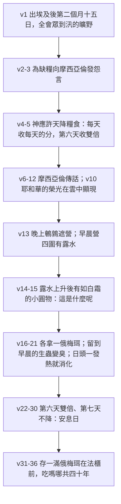

# 出埃及記 第16章

<!-- chapter-navigation:start -->
| [前一章](../02%20出埃及記/第15章.md) | [回目錄](../02%20出埃及記/全書目錄及綱要.md) | [下一章](../02%20出埃及記/第17章.md) |
| :--- | :---: | ---: |
<!-- chapter-navigation:end -->

1. [[以色列]]全會眾從[[以琳]]起行，在出[[埃及]]後第二個月十五日到了以琳和[[西乃]]中間、[[汛的曠野]]。
2. [[以色列]]全會眾在曠野向[[摩西]]、[[亞倫]][[以色列人的怨言|發怨言]]，
3. 說：巴不得我們早死在[[埃及]]地、[[耶和華]]的手下；那時我們坐在肉鍋旁邊，吃得飽足。你們將我們領出來，到這曠野，是要叫這全會眾都餓死啊！
4. [[耶和華]]對[[摩西]]說：我要將[[嗎哪|糧食從天降給你們]]。百姓可以出去，每天收每天的分，我[[神的試驗|好試驗他們遵不遵我的法度]]。
5. 到第六天，他們要把所收進來的預備好了，比每天所收的多一倍。
6. [[摩西]]、[[亞倫]]對[[以色列]]眾人說：到了晚上，你們要知道是[[耶和華]]將你們從[[埃及]]地領出來的。
7. 早晨，你們要看見[[耶和華的榮光|耶和華的榮耀]]，因為耶和華聽見你們向他所發的怨言了。我們算什麼，你們竟向我們發怨言呢？
8. [[摩西]]又說：[[耶和華]]晚上必給你們肉吃，早晨必給你們食物得飽；因為你們向耶和華發的怨言，他都聽見了。我們算什麼，[[以色列人的怨言|你們的怨言不是向我們發的，乃是向耶和華發的]]。
9. [[摩西]]對[[亞倫]]說：你告訴[[以色列]]全會眾說：你們就近[[耶和華]]面前，因為他已經聽見你們的怨言了。
10. [[亞倫]]正對[[以色列]]全會眾說話的時候，他們向曠野觀看，不料，[[耶和華的榮光|耶和華的榮光在雲中顯現]]。
11. [[耶和華]]曉諭[[摩西]]說：
12. 我已經聽見[[以色列人的怨言]]。你告訴他們說：到黃昏的時候，你們要吃肉，早晨必有食物得飽，你們就知道我是[[耶和華]]─你們的神。
13. 到了晚上，有[[鵪鶉遮營|鵪鶉飛來，遮滿了營]]；[[鵪鶉遷徙|早晨在營四圍的地上有露水]]。
14. 露水上升之後，不料，野地面上有如白霜的[[嗎哪的物理特性|小圓物]]。
15. [[以色列|以色列人]]看見，不知道是什麼，就彼此對問說：這是什麼呢？[[摩西]]對他們說：[[天降嗎哪|這就是耶和華給你們吃的食物]]。
16. [[耶和華]]所吩咐的是這樣：你們要按著各人的飯量，為帳棚裡的人，按著人數收起來，各拿一[[俄梅珥]]。
17. [[以色列|以色列人]]就這樣行；有多收的，有少收的。
18. 及至用[[俄梅珥]]量一量，[[林後8：13-15 多收的沒有餘少收的沒有缺|多收的也沒有餘，少收的也沒有缺]]；各人按著自己的飯量收取。
19. [[摩西]]對他們說：[[神的供應|所收的，不許什麼人留到早晨]]。
20. 然而他們不聽[[摩西]]的話，內中有留到早晨的，就生蟲變臭了；摩西便向他們發怒。
21. 他們每日早晨，按著各人的飯量收取，[[神的供應|日頭一發熱，就消化了]]。
22. 到第六天，[[安息日收取規定|他們收了雙倍的食物]]，每人兩[[俄梅珥]]。會眾的官長來告訴[[摩西]]；
23. [[摩西]]對他們說：[[耶和華]]這樣說：[[安息日的設立|明天是聖安息日]]，是向耶和華守的聖安息日。你們要烤的就烤了，要煮的就煮了，所剩下的都留到早晨。
24. 他們就照[[摩西]]的吩咐留到早晨，[[安息日收取規定|也不臭，裡頭也沒有蟲子]]。
25. [[摩西]]說：你們今天吃這個吧！因為今天是向[[耶和華]]守的[[安息日]]；你們在田野必找不著了。
26. 六天可以收取，第七天乃是[[安息日]]，那一天必沒有了。
27. 第七天，百姓中有人出去收，什麼也找不著。
28. [[耶和華]]對[[摩西]]說：你們不肯守我的誡命和律法，要到幾時呢？
29. 你們看！[[耶和華]]既將[[安息日]]賜給你們，所以第六天他賜給你們兩天的食物，第七天各人要住在自己的地方，不許什麼人出去。
30. 於是百姓第七天[[安息日收取規定|安息]]了。
31. 這食物，[[以色列]]家叫[[嗎哪]]；[[嗎哪的物理特性|樣子像芫荽子，顏色是白的，滋味如同攙蜜的薄餅]]。
32. [[摩西]]說：[[耶和華]]所吩咐的是這樣：要將一滿[[俄梅珥]]（俄梅珥就是伊法十分之一）[[嗎哪]]留到世世代代，使後人可以看見我當日將你們領出[[埃及]]地，在曠野所給你們吃的食物。
33. [[摩西]]對[[亞倫]]說：[[保存一俄梅珥嗎哪|你拿一個罐子，盛一滿俄梅珥嗎哪]]，存在[[耶和華]]面前，要留到世世代代。
34. [[耶和華]]怎麼吩咐[[摩西]]，[[亞倫]]就怎麼行，把[[嗎哪]][[保存一俄梅珥嗎哪|放在法櫃前存留]]。
35. [[以色列|以色列人]]吃[[嗎哪]]共四十年，直到進了有人居住之地，就是[[迦南]]的境界。
36. （[[俄梅珥]]就是伊法十分之一。）

---

## 本章知識節點

### 主題
- [[嗎哪]]
- [[神的供應]]
- [[聽命順從蒙醫治]]

### 神學
- [[嗎哪預表基督]]
- [[安息日的設立]]
- [[安息日]]
- [[耶和華的榮光]]
- [[神的試驗]]

### 原文
- [[俄梅珥]]

### 地點
- [[汛的曠野]]
- [[西乃]]
- [[以琳]]
- [[迦南]]
- [[埃及]]

### 人物
- [[摩西]]
- [[亞倫]]
- [[耶和華]]
- [[以色列]]

### 事件
- [[天降嗎哪]]
- [[鵪鶉遮營]]
- [[安息日收取規定]]
- [[保存一俄梅珥嗎哪]]

### 歷史
- [[以色列人的怨言]]

### 背景
- [[鵪鶉遷徙]]
- [[嗎哪的物理特性]]

### 解經爭議
- [[嗎哪是不是自然產物]]

### 互文
- [[約6：31-35 耶穌是生命的糧]]
- [[約6：51 我是從天上降下來的活糧]]
- [[林後8：13-15 多收的沒有餘少收的沒有缺]]
- [[啟2：17 隱藏的嗎哪]]
- [[來9：4 盛嗎哪的金罐]]
- [[詩78：24-25 天上的糧食]]
- [[申8：3 人活著不是單靠食物]]
- [[腓2：14 不發怨言]]

---

## 本章整理

CT 給本章的標題是【天降嗎哪】。KC 把它放在旅程裡看：以琳再好也不能久留，經過救贖、詩歌、瑪拉的試煉與以琳的安歇之後，真正的曠野生活從這裡才開始。

```mermaid
flowchart TD
  A["v1 出埃及後第二個月十五日，全會眾到汛的曠野"] --> B["v2-3 為缺糧向摩西亞倫發怨言"]
  B --> C["v4-5 神應許天降糧食：每天收每天的分，第六天收雙倍"]
  C --> D["v6-12 摩西亞倫傳話；v10 耶和華的榮光在雲中顯現"]
  D --> E["v13 晚上鵪鶉遮營；早晨營四圍有露水"]
  E --> F["v14-15 露水上升後有如白霜的小圓物：這是什麼呢"]
  F --> G["v16-21 各拿一俄梅珥；留到早晨的生蟲變臭；日頭一發熱就消化"]
  G --> H["v22-30 第六天雙倍、第七天不降：安息日"]
  H --> I["v31-36 存一滿俄梅珥在法櫃前，吃嗎哪共四十年"]
```

### 一、離開以琳，走進真正的曠野（v1）

「[[以色列|以色列全會眾]]」這個詞在這裡第一次出現。CT 指出「這是在摩西五經中首次提到這個詞」，並讀出它的用意：以色列人出埃及最主要的目的是事奉神，「因此，他們必須聚集在一起，『全會眾』同工配搭，才能達成這個目的，而這個『全會眾』也就成了新約時代『教會』的模型」。GT《中文聖經註釋》也記「這是五經首次使用這詞句」；BH 說原文帶有「聚集的會眾」之意，強調的是群體身分。

日子算得很清楚。GT《中文聖經註釋》指出這個日期不單在記年月日，也在表明從正月十四日吃逾越節羊羔、翌日離開埃及算起，「至今已有一個月了。他們所帶的食物早就用光了」。KC 說得更直接：離開埃及一個半月，他們從埃及帶出來的存糧大概已經吃盡。

[[汛的曠野]]在哪裡，來源並不一致：GT《啟導本聖經腳註》說在西奈半島西南、今德伯特蘭勒（Debbeter-Ramleh）區，GT《串珠聖經註釋》卻說在西乃半島東北部。名字倒是有共識——CT 給的原文字義是「刺，黏土」，並說這是「一片長滿荊棘的曠野，難於找到食物」。GT《中文聖經註釋》特別提醒兩個容易混淆的名字：「汛的曠野（Wilderness of Sin）和尋的曠野（Wilderness of Zin），並不是同一個地區。」GT《丁道爾聖經註釋》補充，汛和[[西乃]]兩個名字「在語言學上可能有關係，但本段清楚顯示並非同一處地方」；BH 則註明「Sin」與英文的「罪」無關，很可能出自一個閃族語字根。

### 二、第二次[[以色列人的怨言|怨言]]（v2-3）

GT《中文聖經註釋》把這次和上一次作了對照：第一次的埋怨（十四11-12）是因敵人臨近、面對死亡的威脅，「僅可能是百姓中的一些原為埃及人做工，作以色列人之領班的」；這一次卻是為肚腹，而且是以色列的全會眾，「埋怨到神了」。

「巴不得我們早死在埃及地」這句話說到什麼程度？GT《中文聖經註釋》讀為：「這些話並不表示說話的人真想死，乃是在埋怨現在活似乎比死了還不如。」至於「坐在肉鍋旁邊，吃得飽足」，同一份註釋說這是「在忍饑捱餓中的人，幻想過往生活的誇大話」；GT《丁道爾聖經註釋》講得更貼近人性：「他們忘了在埃及是奴隸，反將其優點理想化……奴隸沒有多少肉吃，印象中的卻是巨形的肉鍋。」KC 則把鏡子轉向讀者：神的百姓竟這麼愚昧——我也一樣愚昧——一遇逆境就忘了救恩，忘了瑪拉與以琳的經歷，反倒眷戀世界過去的享樂。

GT 丁良才另指出一個事實上的破綻：以色列人當時並未到餓死的地步，「因為他們還有許多的牲畜」，甚至幾個月後在西乃山，全百姓沒有一家不能吃逾越節的羊羔。而 CT 注意到指控的性質已經升級——「是要叫這全會眾都餓死啊」在 GT《中文聖經註釋》看來「不單是埋怨，而是指責了……而且指責他們有預謀陷害的嫌疑」。

摩西的回答把責任歸屬講清楚：「[[耶和華|你們的怨言不是向我們發的，乃是向耶和華發的]]」（v8）。CT 說這是因為「帶領以色列人出埃及的不是他們……以色列人找錯對象了」；BH 也指出摩西亞倫在此把焦點從自己移開，承認他們只是神的僕人。

### 三、[[天降嗎哪|從天降下的糧食]]與[[神的試驗|試驗]]（v4-12）

神的回應不是責罰，而是供應。KC 指出這與瑪拉一樣：神沒有因為怨言刑罰百姓，在祂的恩典裡祂迎向他們。而供應本身帶著一個條件——「每天收每天的分，我好試驗他們遵不遵我的法度」。STEP 顯示這裡的「試驗」原文是 אֲנַסֶּנּוּ（動詞 נָסָה，H5254）；有趣的是，到了下一章（十七2）百姓反過來試探神，用的也是同一個動詞（תְּנַסּוּן）——上一章是神「試驗」百姓，下一章卻變成百姓「試探／試驗」神，方向完全倒轉了。GT 丁良才把這個試驗拆成兩層：「（一）看他們肯不肯靠神（因為神一天只給他們夠一天所用的）；（二）看他們肯不肯遵神的法度。」CT 則指出「每天收每天的分」的意思是「信靠神並不是一勞永逸的事，乃是一天過一天的信靠」。GT《丁道爾聖經註釋》另提一個接續：「神每日供應以色列的需要，可能是主禱文中『日用的飲食』之懇求的出處。」

「糧食」一詞的範圍也有分歧。GT《串珠聖經註釋》說原文廣義可指任何食物（包括肉），狹義則單指麵包，「從下文來看，這狹義的解釋較為適合」；GT《中文聖經註釋》同讀，並說這神蹟「不單不指普通的糧食，連鵪鶉也不包括在內，乃獨指嗎哪」。但 GT《丁道爾聖經註釋》主張若照古義譯作「糧食」，「鵪鶉和嗎哪便都可以包括在這應許之內」。

到了 v10，[[耶和華的榮光]]在雲中顯現。CT 描述那是「雲中出現神榮耀的光輝，耀眼刺目」；GT《丁道爾聖經註釋》認為這裡「可能不過是指雲柱」；GT《舊約聖經背景註釋》給了一條文化平行：「不是只有以色列的神學，才有神明以這種方式顯現的概念，美索不達米亞的神祇也是用其神性光輝梅嵐穆，來彰顯他們的能力。」KC 指出這是神第一次向全會眾顯現，「祂顯現不是要滅絕他們，而是要他們因祂是誰而心生敬畏」。

### 四、[[鵪鶉遮營|鵪鶉]]與[[嗎哪]]（v13-15）

[[鵪鶉遷徙|鵪鶉]]為什麼會來，各家給的是同一套自然史。GT《中文聖經註釋》說牠是季候鳥，秋季由歐洲飛越地中海到西乃半島短停，春天再北飛，長飛之後極為疲累，「只離地面約三尺的大批集中飛行，極易為人捕捉」；GT《丁道爾聖經註釋》補上細節——牠們疲倦時「連遊牧民族的黑色矮帳都不能越過，落地之後亦無法再度起飛」；GT《舊約聖經背景註釋》說覓地棲息的鵪鶉「曾經有壓沉小舟的記錄」。但 GT《中文聖經註釋》也提醒，按詩篇七十八27-28 的誦述，「這鵪鶉亦如嗎哪從天而降」。鵪鶉只出現在這一晚——同一份註釋指出，本章接下去到結尾都只有嗎哪，「這是顯明嗎哪為每天都有，鵪鶉卻不是」。

「這是什麼呢？」成了這食物的名字。第15節百姓說「這是什麼？」，原文的 מָן（H4478）在這裡真的是疑問詞「什麼？」；到了第31節，同樣的聲音才正式成了這食物的名稱「嗎哪」。相關註釋再進一步討論這個名字的語源：GT《中文聖經註釋》梳理語源流變，指「嗎哪」音譯經七十士譯本流傳，背後反映當時亞蘭文「這是甚麼」的口語；GT《丁道爾聖經註釋》把它歸為「通俗語源」的解法，並拿「摩西」一名的諧音解釋相比。

[[嗎哪的物理特性|嗎哪長什麼樣]]，原文作 דַּק מְחֻסְפָּס（daq mechuspas，H1851、H2636），STEP 顯示前者意為「細小／精細」，後者作「如鱗片的／薄片狀的」。CT 給的原文字義對照為「白霜」白色的霜、「小圓物」鱗狀的東西。GT《丁道爾聖經註釋》指出後一個字有兩種解法：早期猶太解經家作「小丸」，早期譯本及《盎克羅之他爾根》作「鱗片」——「由於這個希伯來字沒有再出現於他處，要確定其意義是不可能的」。GT《舊約聖經背景註釋》連「芫荽子」這個對譯都存疑：「芫荽在沙漠極少出現，這字較有可能是泛指有白色種籽的沙漠植物。」

[[嗎哪是不是自然產物|它是不是當地的天然產物]]，是本章最大的爭論：

| 立場 | 代表 | 要點 |
| --- | --- | --- |
| 反對自然解釋 | CT〔問題改正〕、GT 丁良才、《啟導本》、李道生 | 丁良才列六點差異（產地、產量、安息日照產、藥料非糧食、季節、進迦南即止）；《啟導本》另列四點（可久儲 vs 生蟲、產量、不受地區限制、存放法櫃前） |
| 主張自然解釋 | GT《丁道爾聖經註釋》 | 「幾乎可以確證嗎哪就是阿拉伯人稱為『曼』（man）的物質」——兩種介殼蟲在檉柳樹枝間的分泌，出產最多的是六月 |
| 自然解釋但自陳難處 | GT《舊約聖經背景註釋》 | 蚜蟲說；但「全季節的產量也不過是五百磅左右，相對而言，聖經記載每人每日的收集量是半磅」，結論是「基於自然現象的解釋似乎全都遠不及聖經的描寫」 |
| 兩說並存、歸於神能 | GT《中文聖經註釋》 | 「縱令這嗎哪是當地的正常產物，要一時產量如此之大，能供飽如許多人，並如許長的時間，亦非有神的大能作為是不可能成就的」 |

### 五、[[俄梅珥]]與收取的規矩（v16-21）

「多收的也沒有餘，少收的也沒有缺」是不是神蹟，也有兩讀。GT 丁良才說「這無非是神跡」；GT《中文聖經註釋》同。但 GT《丁道爾聖經註釋》給了另一個解釋：「本節描述的可能不是神蹟，他們不過是一致同意每人一俄梅珥，將收集起來的嗎哪集中分配而已。保羅在哥林多後書八章14、15節顯然是這樣解釋。」——保羅正是引這一句勸信徒[[林後8：13-15 多收的沒有餘少收的沒有缺|彼此均平]]。

「不許什麼人留到早晨」是另一道試驗。CT 說目的是要訓練神的百姓「不要為明天憂慮」；GT《中文聖經註釋》另給一個生活層面的理由：「在曠野酷熱的天氣之下，食物留到第二天的，多數會變味腐壞，以致使食用的人產生疾病。」KC 把這句話講得最好記：==放在神的食櫃裡，比放在以色列人的帳棚裡更安全==。他並把它接到讀經：不能靠昨天所讀的活著，否則吃的是舊糧，「那只會餵養驕傲，而驕傲是發臭的」。

CT 注意到違例的後果本身也是神蹟：「內中有留到早晨的，就生蟲變臭了……但安息日的嗎哪卻是例外，這又是另一個神蹟。」GT《中文聖經註釋》說得更細：食物在第二天變臭是常有的，「忽然在第二天生蟲了，卻是罕見的」。

### 六、[[安息日的設立|安息日]]第一次出現（v22-30）

GT《啟導本聖經腳註》一句話定位：「這是聖經中第一次正式提到安息日，也是以色列人最早守安息日的記載。」GT《丁道爾聖經註釋》說法相同——雖然創世記二章2、3節已有設立的觀念，「安息日一詞在聖經中出現，這卻是第一次」，並指出本節在常用的「安息日」一詞以外還加插了一個更有力的字眼。第23節除了 שַׁבָּת「安息日」之外，還用了 שַׁבָּתוֹן（H7677）；STEP 本節作「安息日的遵守／休止」。丁道爾等註釋進一步注意到這個詞帶有更強的休止意味，因此理解為完全停工、專一安息的一天。GT 丁良才則從 v5 反推：「本節顯明沒有傳律法以先，以色列人已經知道安息日的理。」

CT 把第六天的雙倍讀成恩典：「安息日是為人設立的（可二27），神既願意讓人身心休息，就多方體貼、憐憫人，于前一日為人預備好糧食，既可休息又不必挨餓。」而 CT 在 v25 點出一個對稱：降嗎哪是神蹟，「唯獨在安息日，偏偏不降嗎哪也是神蹟」。KC 補上一個時序上的分別：在律法頒布之前，安息是特權而不是義務，「只有到了西乃，律法賜下的時候，它才成為義務」。

v28 神的責備把範圍拉得更寬。CT 指出「少數人的悖逆，竟然會連累到整個民族被神責備」，並說「只在一條誡命上沒有遵守，就被視為不遵守全部的律法」；GT《中文聖經註釋》也讀出同一件事：這句話把守安息日的律例「提前到在西乃山頒布律法以前就必須遵守，且不單指安息日，甚至包含了其他的誡命和律法了」。

### 七、[[保存一俄梅珥嗎哪|存在法櫃前的那一罐]]（v31-36）

嗎哪「樣子像芫荽子，顏色是白的，滋味如同攙蜜的薄餅」。[[嗎哪預表基督|它預表什麼]]，GT 丁良才在這裡列了十一條——真神所賜、自天降下、極其奧妙、微小之物、圓如芫荽、白如珍珠、甘甜可口、每日早取、各人宜食、直到迦南、有人藐視——每一條都附上新約的對應經文。KC 列的是另一組七項，並補了一層次序：百姓是先在晚上得鵪鶉、次日早晨才得嗎哪，「鵪鶉是我們以另一位的死來餵養自己的圖畫」，[[約6：51 我是從天上降下來的活糧|而嗎哪代表基督在地上降卑的一生]]。

那一罐嗎哪放在哪裡，CT 給了一個很小心的說明：「最初是放在約櫃的前面……何時改放在約櫃的裡面，聖經並無明文記載」，並指有解經家認為原文並無「櫃」字，只有「法」字，因此推論嗎哪是放在櫃裡的法版前。GT《舊約聖經背景註釋》也說 v34 的「見證」只可能是指當時仍未製造的約櫃，「可見嗎哪的樣本是在曠野歷程較後的時期，才放到約櫃之中的」。這罐後來失傳——CT 與 GT《中文聖經註釋》都推在士師時代約櫃被非利士人擄去時（參[[來9：4 盛嗎哪的金罐|來9:4]]；王上八9 記所羅門時代櫃內只剩兩塊石版）。KC 讀出的是另一面：在曠野連一天都留不住的，卻被存留到永遠。

「共四十年」是概數。GT 丁良才說「這是囫圇數，本來是三十九年零十一個月」；GT《聖經精讀本──出埃及記註解》算得更細：第一次吃嗎哪是出埃及第二個月十五日，停止是四十一年一月十六日。CT 也提醒「吃嗎哪」不是說他們只吃嗎哪，「乃是指他們吃嗎哪作為取代麵包的主食」，副食仍有鵪鶉肉與牛羊肉。KC 則把四十這個數字讀成試驗的年數：在整段試驗的年日裡，嗎哪是神看顧不間斷的憑據——問題只在我們每天還看不看得見。

**參考資料**
https://www.ccbiblestudy.org/Old%20Testament/02Exo/02CT16.htm
https://www.ccbiblestudy.org/Old%20Testament/02Exo/02GT16.htm
https://www.kingcomments.com/en/bible-studies/Exo/16
https://biblehub.com/study/exodus/16.htm

<!-- appendix-links:start -->
## 附錄

### 相關地圖
- [[appendix/fhl_maps/maps/019|〈出圖二〉以色列人出埃及到西乃山]]
- [[appendix/fhl_maps/maps/024|〈民圖五〉出埃及和進迦南的旅程]]
<!-- appendix-links:end -->

<!-- chapter-navigation:start -->
| [前一章](../02%20出埃及記/第15章.md) | [回目錄](../02%20出埃及記/全書目錄及綱要.md) | [下一章](../02%20出埃及記/第17章.md) |
| :--- | :---: | ---: |
<!-- chapter-navigation:end -->
