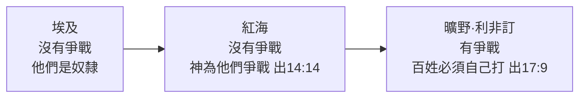
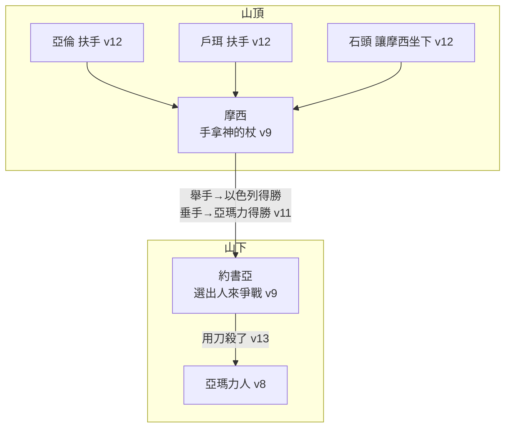

# 出埃及記 第17章

1. [[以色列]]全會眾都遵[[耶和華]]的吩咐，按著站口從[[汛的曠野]]往前行，在[[利非訂]]安營。百姓沒有水喝，
2. 所以與[[摩西]][[米利巴（ strife ）|爭鬧]]，說：給我們水喝吧！摩西對他們說：你們為什麼與我爭鬧？為什麼[[神的試驗|試探耶和華]]呢？
3. 百姓在那裡甚渴，要喝水，就向[[摩西]][[以色列人的怨言|發怨言]]，說：你為什麼將我們從[[埃及]]領出來，使我們和我們的兒女並牲畜都渴死呢？
4. [[摩西]]就呼求[[耶和華]]說：我向這百姓怎樣行呢？他們幾乎要拿石頭打死我。
5. [[耶和華]]對[[摩西]]說：你手裡拿著你先前擊打河水的杖，帶領[[以色列]]的幾個長老，從百姓面前走過去。
6. 我必在[[何烈]]的[[磐石出活水|磐石]]那裡，站在你面前。[[磐石預表基督|你要擊打磐石]]，[[磐石出水|從磐石裡必有水流出來]]，使百姓可以喝。[[摩西]]就在[[以色列]]的長老眼前這樣行了。
7. 他給那地方起名叫[[瑪撒（ temptation ）|瑪撒]]（就是[[瑪撒（ temptation ）|試探]]的意思），又叫[[米利巴（ strife ）|米利巴]]（就是爭鬧的意思）；因[[以色列|以色列人]]爭鬧，又因他們試探[[耶和華]]，說：耶和華是在我們中間不是？
8. 那時，[[亞瑪力人]]來在[[利非訂]]，和[[以色列|以色列人]]爭戰。
9. [[摩西]]對[[約書亞]]說：你為我們選出人來，出去和[[亞瑪力人]]爭戰。明天我手裡要拿著神的杖，站在山頂上。
10. 於是[[約書亞]]照著[[摩西]]對他所說的話行，和[[亞瑪力人]]爭戰。摩西、[[亞倫]]，與[[戶珥]]都上了山頂。
11. [[摩西舉手得勝|摩西何時舉手，以色列人就得勝，何時垂手，亞瑪力人就得勝]]。
12. 但[[摩西]]的手發沉，他們就搬石頭來，放在他以下，他就坐在上面。[[亞倫]]與[[戶珥]]扶著他的手，一個在這邊，一個在那邊，他的手就穩住，直到日落的時候。
13. [[約書亞]]用刀殺了[[亞瑪力]]王和他的百姓。
14. [[耶和華]]對[[摩西]]說：我要將[[亞瑪力]]的名號從天下全然塗抹了；你要將這話寫在書上作紀念，又念給[[約書亞]]聽。
15. [[摩西]][[築壇耶和華尼西|築了一座壇，起名叫耶和華尼西]]（就是[[耶和華尼西|耶和華是我旌旗]]的意思），
16. 又說：[[耶和華]]已經起了誓，必世世代代和[[亞瑪力人]]爭戰。

<!-- fhl-map-links:start -->
## 相關地圖

- [[appendix/fhl_maps/maps/019|〈出圖二〉以色列人出埃及到西乃山]]
- [[appendix/fhl_maps/maps/024|〈民圖五〉出埃及和進迦南的旅程]]
<!-- fhl-map-links:end -->

---

## 本章知識節點

### 人物
- [[摩西]]
- [[亞倫]]
- [[約書亞]]
- [[戶珥]]
- [[亞瑪力]]

### 地點
- [[利非訂]]
- [[何烈]]
- [[汛的曠野]]

### 原文／名字
- [[瑪撒（ temptation ）]]
- [[米利巴（ strife ）]]
- [[利非訂（ repose ）]]
- [[耶和華尼西（ Jehovah Nissi ）]]

### 神學
- [[磐石出活水]]
- [[磐石預表基督]]
- [[耶和華尼西]]
- [[神的試驗]]

### 互文
- [[林前10：4 靈磐石就是基督]]
- [[詩78：15-16 磐石出水]]
- [[來3：8-9 硬著心不可像瑪撒]]
- [[申25：17-19 記念亞瑪力]]
- [[約4：14 活水]]
- [[約7：38-39 活水的江河]]
- [[賽53：4-5 磐石被擊打]]

### 背景
- [[利非訂地理]]
- [[何烈與西乃的關係]]

### 事件
- [[磐石出水]]
- [[戰勝亞瑪力人]]
- [[摩西舉手得勝]]
- [[築壇耶和華尼西]]

### 歷史
- [[以色列人的怨言]]

---

## 本章整理

CT 給本章的標題是**【磐石出活水與戰勝亞瑪力人】**。《串珠》一句話：**「在[[利非訂]]發生的兩件事：磐石出水，與亞瑪力人爭戰。」**

**《丁道爾》引納皮爾點出了本章在全卷中的位置，這個觀察極好**：**「納皮爾指出前面記述的三個片斷，主題都是以色列的基本需要：在沙漠供應飲食。如今的第四個片斷，主題是最後一個存活的必要條件：從仇敵手中得拯救。**——**神既勝過每個問題，便自證足以拯救自己子民而有餘。」**

### 經文大綱

1. **百姓在利非訂因沒水喝與摩西爭鬧**（1-3節）
2. **神指示摩西擊打磐石，流出活水**（4-7節）
3. **[[亞瑪力|亞瑪力人]]來爭戰**（8節）
4. **摩西命[[約書亞]]領軍迎戰**（9-10節）
5. **[[摩西舉手得勝|摩西在山上舉手]]，擊敗亞瑪力人**（11-13節）
6. **神命將亞瑪力的名號全然塗抹**（14-16節）

### 一、[[利非訂（ repose ）|安息之地，得不著安息]]（v1-3）

> [!important] 一個諷刺：「利非訂」的意思是「休息之地」
> **CT 抓住了這個反諷**：**「『利非訂』原文意思是休息、安息之所，但是因著缺乏水的緣故，該安息之處卻得不著安息。」**
>
> **而 KC 指出更值得注意的一點——他們是照著命令走到這裡的**：**「百姓往前行。他們這樣作不是因為說得通，也不是因為他們看見這樣作的意義，而是因為主吩咐他們這樣作。他們就這樣到了利非訂。那裡似乎沒有水。**——**這是聽從主命令的結果嗎？」**
>
> **它的結論是本章最重要的一句話**：**「這教導我們：即使我們走順服的路，也不能免去難處和試煉。**——**神使用這些難處來試驗、潔淨我們的信心，並藉著把我們從其中拯救出來而榮耀祂自己。」**
>
> **CT 的〔話中之光〕同讀**：**「當記得，以色列全會眾的行止，是遵照神的吩咐。可見他們的遭遇都在神的安排中，因此，神是他們問題的答案。」**丁良才更簡潔：**「我們在主指示我們的路上，有時也能遭遇患難。」**

**「[[米利巴（ strife ）|爭鬧]]」不是普通的抱怨。**《每日研經叢書》：**「這裏的動詞含有正式責難之意。」**《串珠》：**「原文的字根與7節的『米利巴』相同，帶有『尋找過失』及『爭辯』（在法庭內外）之意。」**《中文聖經註釋》：**「原文這字是與訴訟有關，不論在法庭內或法庭外解決爭端，都可使用這詞。」**BH 同：**「希伯來文的『爭鬧』暗示一場法律訴訟，顯示他們控訴的嚴重性。」**

> [!quote] 丁良才：以色列人的錯有四層
> **「（一）他們口出無理的妄言；（二）他們不是請求，乃是強要；（三）他們全無謝恩之意；（四）他們沒有靠主之心。」**
>
> ——**第二點最扎人：他們不是求，是要。**CT 把這個語氣譯了出來：**「『給我們水』意指是你帶領我們到這無水之地，你應當負責找到水。」**

**《啟導本》發現了一個漂亮的對稱**：**「神規定每日可收取的嗎哪量，試驗以色列人是不是遵守神的法度。他們沒有經得住這考驗（十六4,20）。**——**現在以色列人反要試驗神，向祂討水喝。」**

**一個只有牧人才寫得出的細節，《丁道爾》注意到了**：v3「並牲畜」——**「除了證明摩西的居心經常受無理挑剔之外，本節也顯示出這些人的本性。除了牧人以外，還有誰會在自身難保之餘，擔心牲畜會否渴死？**——**這是以色列牧人的寫照。」**

**「他們幾乎要拿石頭打死我」——《丁道爾》把這句話放進一條很長的名單**：**「這是以色列領袖遭受拒絕的極點……基督（約十31）、司提反（徒七58）、保羅（徒十四19）都曾面臨這同樣的事；**——**要用石頭打他們的人，正是他們受差服事的對象。」**

**摩西的反應才是關鍵。**《中文聖經註釋》：**「這是有信心的領導人的表現之一──自己無法解決，呼求神去解決……任勞任怨，尋求神的解決，是任何時代任何屬靈的領袖所當效法的。」**CT 的〔話中之光〕：**「教會中無論是領袖人物或是會眾，應當以向神禱告來代替彼此埋怨。彼此埋怨只會加深難處，向神禱告才是正途。」**

### 二、[[磐石出活水]]（v4-7）

「你手裡拿著你**先前擊打河水的杖**」——

> [!note] 為什麼是「擊打河水的杖」，不是「神的杖」？
> **CT 從這個稱呼讀出一層警告**：**「神的話是說『先前擊打河水的杖』，而不是說『神的杖』；這樣的稱呼提醒以色列人，埃及地的水變成血，屬世的享受和快樂，都在神的審判之下。」**
>
> **《精讀本》讀出的則是保證**：**「這句話意味著，讓那條美麗的尼羅河變成死亡之血的耶和華，完全有能力讓沙漠中的磐石出水。」**
>
> ——**同一根杖，同一個動作：在埃及擊水，水變成血（死）；在何烈擊石，石流出水（生）。**
>
> **《中文聖經註釋》：「神要摩西手裏拿杖，是要他記得神的應許與同在，並提醒他神所已賜予的權能。」**
>
> **為什麼只帶幾個長老？**丁良才：**「因為百姓悖逆主，所以只叫幾個長老為這神跡作見證。正如使徒為耶穌復活作見證一樣（徒一21-22）。」**又補一個很實際的猜測：**「這一次從百姓面前走過去，或者因為他們要拿石頭打死他。」**《丁道爾》注意到一個限制：**「雖然所有人都能喝到湧出的水，有權利目睹這神蹟者似乎只有他們。」**

> [!important] [[磐石預表基督|磐石就是基督]]——本章最重的一節
> **丁良才把磐石預表基督分成三層，極其精準**：
>
> **「（一）只打一次**（賽53:4；亞13:7）**；（二）被打才出水**（詩78:20；約7:38-39；約12:24）**；（三）水比聖靈」**（約4:10, 13-14；約7:38-39）。
>
> **KC 把這三層接成一條時間線**：**「磐石代表基督。祂在神加於祂的審判中，在十字架上被擊打。在祂死、復活、升天之後，聖靈就降臨了。**——**聖靈被比作『活水的江河』」**（約7:38-39）。
>
> **CT 的〔靈意註解〕加了約19:34 這一層**：**「『何烈的磐石』象徵基督，祂在十字架上被羅馬兵丁用槍刺他的肋旁，就有血和水流出來；**——**血為贖罪，水為賜人生命。」**
>
> **趙世光給了一個很銳利的角度**：**「摩西代表律法，磐石預表基督。磐石被擊打，預表基督代替不遵守律法的人受咒詛——釘死在十字架上，因為凡掛在木頭上的，都是被咒詛的」**（加3:10, 13）。
>
> **CT 的〔話中之光〕把它推到一個很沉的原則**：**「基督為我們被神擊打，結果流出活水的江河來。**——**屬靈供應的原則，誰越多受十字架的擊打和剝奪，誰就越有可以給人。」**
>
> **KC 另指出一個時序上的要點**：**「五旬節聖靈的澆灌是一次性的事件，但其結果卻持續下去。這是藉著主耶穌的代求」**（約14:16-17）。

> [!example]- 「隨著他們的磐石」：保羅引的是猶太傳統嗎？
> **《中文聖經註釋》給了這個背景，很值得知道**：**「這個摩西所擊打的何烈的磐石……在猶太人的口述傳統上，更為傳奇地傳流下來，認這磐石是一路隨以色列人其後的旅程，並如嗎哪的供養一樣，每天都流出水來供養以色列人的需要的。**——**因此，當保羅提到……『所喝的是出於隨他們的靈磐石，那磐石就是基督』（[[林前10：4 靈磐石就是基督|林前十1～4]]）時，保羅也是跟這種傳統而說的。」**
>
> **KC 讀出同一個持續性，但接到聖靈**：**「正如嗎哪天天降下，這水的江河也繼續跟著百姓，走過整個曠野的旅程（林前10:4）。**……**只要教會還在地上，聖靈就與信徒同在、在信徒裡面，直到永遠。」**

> [!question] 磐石出水是幾次？出17 與民20 是同一件事嗎？
> **這是本章最大的一個爭議，各家立場不同：**
>
> **李道生把兩次的差別列得最清楚**：**「第一次——是在出埃及後一個月……摩西沒有發怒，在利非訂擊打磐石一次，未受神的責罰……第二次——是經過了卅八年之久的曠野飄流生活。於正月間，摩西向以色列民發怒，在加低斯擊打磐石兩次，受到神的責罰」**（民20:1, 10, 12）。
>
> **《啟導本》補上關鍵差別**：**「第一次擊磐石，神命摩西用杖，使水流出；**——**第二次神命摩西『吩咐』（民二十8）磐石出水，但摩西卻用了杖『擊打』，沒有順服神的命令，因而受罰。」**（——**這正是丁良才「只打一次」那一層預表的重量所在。**）
>
> **《丁道爾》正面處理了「是否同一件事」的難題，並且答得很細**：它先指出反常之處——**「同一處地方起了兩個這樣的別名來紀念同一件事，不是絕不可能，可是很反常。而且眼前經文也沒有暗示摩西的行為，有何值得批評之處。」**——**但它的結論是不必合併**：**「這個假設是不必要的，我們也可以接受發生頭一次事件的地方只是叫瑪撒，第二個地方則只叫米利巴的看法。沙漠時常會遇上缺水的問題，相類的事件實在沒理由不會發生兩次。**……**話又說回來，如果一件事可以發生兩次，同一個名字也沒有理由不能用兩次。」**
>
> **《中文聖經註釋》則傾向傳統混雜說**：**「米利巴……實際地點是在西乃半島北部尋的曠野之加低斯附近……所以這故事大概不是發生在汛的曠野，也可能是後期的人混雜前人的口傳傳統而混淆了地名之故。」**——它並據此主張神的山在西乃半島北部。**《舊約背景註釋》則簡潔地反對**：**「瑪撒和米利巴不是別處地方的名字，而是指利非訂一地。」**
>
> **《丁道爾》另提醒詩95:8 的用法**：**「詩篇九十五篇8節將瑪撒和米利巴相提並論，作為以色列不信和拒絕神的例子，**——**但這不過是對句，並非將兩件不同的事件認同為一。」**

> [!important] KC：不是神試驗百姓，是百姓試驗神
> **這是 KC 讀本章最深的一段**：**「這試驗特別之處，不在於神試驗祂的百姓，反倒相反——是以色列在試驗神！他們挑戰祂，向祂索求祂同在的憑據。**——**他們這樣作，就顯出對祂的愛、祂的信實、祂在他們中間的同在，甚至可能對祂的存在的懷疑。」**
>
> **它接著把這句話搬到今天**：**「這是同樣悖逆不信的語言，在我們今天聽起來並不陌生：**——**若有神，祂就該作這個或那個。好像神還沒有多次證明過祂自己一樣。」**
>
> **KC 對這罪的分層很值得記住**：**「百姓的罪不只是不信神的能力，更是懷疑祂的同在和祂的旨意。你可以懷疑祂在某件事上是否能作工，那是把神想得太小，或把祂想得太壞。**——**但更糟的是，當我們以為祂對我們沒有美好的旨意，或祂根本不在乎我們，或祂不與我們同在。」**
>
> **CT 從命名讀出百姓的疑惑內容**：**「原來以色列人不信任神的話，認為神並沒有真正與他們同在，而僅是差遣天使來帶領他們。」**
>
> **KC 另注意到命名的反常，這個觀察極好**：**「值得注意的是，這兩個名字不是提醒人神恩典的作為、磐石被擊打，而是提醒人百姓悖逆的作為。**——**他們需要被提醒：磐石為什麼被擊打。」**
>
> **一個譯名上的提醒，《丁道爾》**：**「這字在希伯來語無善無惡，現代英語將它譯作 tempt 和 temptation，雖然在字源學上無可厚非，卻有誤導讀者之虞（和合本譯『試探』也是同樣危險，翻作『測試』或許較為安全）。」**《串珠》同：**「這字在原文不一定含惡意的成分。」**

### 三、[[戰勝亞瑪力人]]（v8-13）

> [!info] 亞瑪力人為什麼來打？各家給了三個理由
> **①爭水草。**《丁道爾》：**「西奈半島牧草有限，不能同時供給以色列人和亞瑪力人，他們發動攻擊不過是遲早問題。」**它另指出[[利非訂地理|利非訂的價值]]：**「附近費蘭河的綠洲十分富庶，是全半島最好的土地，他們要將以色列逐離這一帶。」**《串珠》同：**「可能是為了爭用水源或綠洲。」**
>
> **②世仇。**丁良才：**「他們與以色列人結仇的原因，或者是因以色列人的先祖雅各奪了他們祖宗以掃的福分。」**CT：**「『亞瑪力人』是以掃的子孫，是以色列人的世仇。」**
>
> **③《中文聖經註釋》給了一個少見卻很誠實的角度**：**「兩個不同來源的遊牧民族，以色列人是『入侵』者，亞瑪力人為保護其既得權益來和以色列人爭戰，**——**以色列人因屬侵犯他人土地而不說出亞瑪力人來爭戰的原因，都是順理成章的事。」**
>
> **他們的戰術是什麼？**《丁道爾》：**「他們的戰術可能也和人數不多有關：他們在以色列的側翼和後方出沒，暗算脫隊的人（這種做法令[[申25：17-19 記念亞瑪力|申二十五18]]甚為激憤）。**——**後世以色列人對亞瑪力人的怨恨，大抵緣起於此。」**BH：**「這次攻擊是無故的，而且針對軟弱的人……這種侵略行為被視為懦弱而奸詐。」**
>
> **CT 的〔靈意註解〕從字根讀出肉體的特徵**：**「原來肉體的特徵就是驕傲。亞瑪力人 Amalek 一字乃從 Malek 之字根而來，乃有『王』、『首領』、『No.1』的意思……就是一種自我中心之態：『我是王』、『我是No.1』。」**

> [!important] KC：三個階段，三種爭戰
> **這是理解本章位置的鑰匙。**KC：**「在埃及他們沒有爭戰。在那裡他們是奴隸。在紅海也沒有爭戰。在那裡是神爭戰。**——**在曠野卻有一場必須由百姓自己去打的仗。」**

**KC 進一步指出這場仗的性質**：**「亞瑪力是撒但藉信徒有罪之肉體的軟弱來攻擊他的圖畫。彼得勸勉信徒要『禁戒肉體的私慾，這私慾是與靈魂爭戰的』（彼前2:11）。**——**這場仗是攻擊我們魂的。這是一場我們必須交給住在我們裡面的聖靈去打的仗」**（加5:17）。CT 的〔靈意註解〕完全同調：**「『亞瑪力人』預表信徒的死敵──肉體；『和以色列人爭戰』：肉體和靈相爭」**（加5:17）。

**[[約書亞]]在此首次出場。**丁良才給了完整履歷：**「這名字在此是聖書中頭一次記載的，原名是何西阿（民十三16）……他是以法蓮支派的人，是約瑟第十一代的後裔，嫩的兒子。自幼服侍摩西。當時約有四十餘歲。」**《丁道爾》補了一個時序細節：**「嚴格來說，這時他仍然使用舊名何西阿。包含耶和華名字的『約書亞』，顯然是到了加低斯才給他起的」**（民13:16）。

**KC 指出約書亞的預表**：**「約書亞要領百姓過約但進入應許之地。他是基督的圖畫，基督使我們能藉著聖靈得著那地。**——**是主耶穌藉著聖靈與肉體爭戰。『約書亞』是希伯來名，對應希臘名『耶穌』。」**

**這場仗的結構，是本章最值得畫出來的東西——勝負不在山下，在山上：**

> [!note] 「舉手」是什麼意思？——三種讀法
> **①禱告（最常見）。**丁良才：**「『舉手』就是祈禱的標記（利九22，詩二十八2，六十三4，提前二8）。他長久舉手，表明恒心祈禱。」**《丁道爾》：**「然而最常見的解釋（祈禱），很可能才是對的。如此垂手就表示停止禱告，亦即不再倚賴神的幫助。」**
>
> **②作戰信號。**《丁道爾》：**「舉手，通常是軍隊開戰或前進的手號，『垂手』大概表示撤退。」**《舊約背景註釋》發展了這個讀法：**「主帥統軍時可以用信號來調動部隊作戰。摩西的杖可能就有這個功用。他無法藉這些信號來傳達神的指示時，以色列軍就不能得勝。」**——它另提一個埃及的平行：**「埃及文獻提到法老兩臂高舉除了是進攻信號以外，更是提供佑護。」**
>
> **③起誓。**《丁道爾》：**「另一解釋認為舉手代表起誓，將亞瑪力宣判為『當滅』或『受咒』之物，要徹底消滅」**（參創14:22 及本章16節）。
>
> **《串珠》則保留**：**「『舉手』在此不一定等於禱告，因經文沒有提及禱告；古人相信神的能力能透過舉手而生效。」**
>
> **CT 的〔靈意註解〕給了本章最重的一層**：**「摩西預表我們屬天的大祭司，站在山頂上──預表在高天之上；舉手預表為我們祈求」**（來7:25）。

> [!quote] 山頂上的三個人，都是基督
> **KC 的這個讀法是本章的高峰**：**「山上的這三個人也都代表基督：摩西拯救了百姓，他代表救贖者；亞倫代表主耶穌作那位能『體恤我們的軟弱』的大祭司（來4:15）；**——**戶珥的意思是白、純潔，這顯出那位代求者的完全。」**
>
> **然後它立刻補上一個必要的更正**：**「當然，主耶穌從不疲倦（來7:25）。**——**這顯出一切何等在乎祂：祂在天上的代求，決定地上爭戰的結局。」**
>
> **「摩西的手發沉」——各家從這裡讀出的是同工。**《中文聖經註釋》：**「這可見，任何偉大的領袖，甚至有神的同在，並藉神能力行事的人，都必須有得力的『助手』！」**CT 的〔話中之光〕更形象：**「一棵樹是容易被風吹倒的，一個樹林就不容易被風吹倒。屬靈的爭戰不是一個人可以單槍匹馬去衝的；屬靈的爭戰是大家聯合的爭戰。」**又：**「我們也應當『扶起』屬靈領袖的手。分擔責任，說安慰鼓勵的話，或為他禱告，都會使屬靈領袖重新得力。」**
>
> **CT 另把亞倫與戶珥讀成同心禱告**：**「表徵兩三個人同心合意的禱告」**（太18:19）。
>
> **《中文聖經註釋》把功勞的歸屬層層追到底，這段話很好**：**「這不能說是約書亞一人殺了這麼多人……但這結果，也不是約書亞和他的戰士的成功，乃是在山頂上有摩西的舉手，以及亞倫和戶珥作支持之功。**——**可是，摩西舉手使以色列人得勝的能源，乃在神。因此，不論是爭戰是工作，有任何的成就的話，都要追問那能源是出自何方。」**

**「用刀殺了」——KC 把刀讀成聖靈的劍**：**「這場仗由約書亞用刀的鋒刃了結。神的話被比作『聖靈的寶劍』（弗6:17b）。**——**在我們裡面的聖靈應用神的話，使我們能抵擋肉體和它的私慾。」**（《丁道爾》另指出這個希伯來字很罕見：**「最好的譯法是『使之俯伏』或『使之失去戰鬥能力』。」**）

### 四、[[築壇耶和華尼西]]（v14-16）

> [!important] 亞瑪力被打敗了，但沒有被消滅
> **KC 把這一點說得最清楚，而且它就是本章的結論**：**「亞瑪力被打敗了，但沒有被消滅。肉體不能被根除。這勝利對以色列並沒有什麼好處，只是他們如今可以繼續前行而不受損害。**——**他們必須繼續對這仇敵存戒心。這正是為什麼這場仗被寫下來，好叫他們有一個長久的警告。」**
>
> **歷史證實了這一點。**《中文聖經註釋》列出整條線：**「事實上，亞瑪力人在以色列人漂流曠野時，仍然是他們的威脅的一族（民13:29，14:25）；在士師時代，亞瑪力人協助亞捫人、米甸人來攻擊以色列人；到掃羅時代才給消滅了（撒上15章），但大衛在躲避掃羅時代，亦曾侵奪和擊殺他們。」**CT：**「亞瑪力人從此一蹶不振，日後雖曾經間斷地騷擾過以色列人，但到希西家王時代便完全被消滅了」**（代上4:43）。丁良才把應驗列成五段：**「（一）掃羅；（二）撒母耳；（三）大衛；（四）西緬人；（五）末底改」**（斯3:1-6；9:7-10）。
>
> **CT 從 v16 讀出 v14 尚未完成**：**「本句證明14節的『全然塗抹』尚未完成，仍須世世代代持續和亞瑪力人爭戰，直到最終達成目標。」**它的〔靈意註解〕：**「『必世世代代和亞瑪力人爭戰』：表示信徒不可與肉體妥協。」**

**「你要將這話寫在書上」——這是聖經中最早的書寫記錄之一。**《丁道爾》指出一個可圈可點的細節：**「值得留意的是本節將筆錄和口傳相提並論，無疑是相對於書面傳統及口述傳統兩個主流。**——**此外本節將口頭傳述視為書面記載的從屬，更是可圈可點。」**《串珠》同：**「反映出當時的口傳與筆錄同等重要。」**《丁道爾》另猜測這書的身分：**「這書可能是其他地方提到，今已佚失的『耶和華戰記』」**（民21:14）。

> [!quote] 摩西打了勝仗，去築了一座壇
> **CT 的〔話中之光〕把這一節寫得極好**：**「世界上的領袖，打了勝仗，是建銅像，立紀功碑，稱頌自己的偉大，好永垂後世，以為紀念。**——**摩西打了勝仗，卻去築了一座壇，向神獻祭，紀念神的能力和恩典。」**它接著說：**「摩西知道，得勝的關鍵，不在於將士用命，不在於人運籌帷幄，而全在於神的能力。因此，沒有人爭功，沒有人邀賞。」**
>
> **KC 讀出同一件事，並且把它變成一個問題**：**「摩西的反應是奇妙的。他築了一座壇。壇表明敬拜……摩西的反應是我們的榜樣。我們怎樣回應主為我們所作的？**——**那意識到我們裡面沒有能力、而是祂掌管我們生命的覺悟，會引導我們敬拜祂。」**
>
> **[[耶和華尼西（ Jehovah Nissi ）|「尼西」是什麼意思？]]**《中文聖經註釋》給了最完整的字義與文化背景：**「希伯來文尼西有很廣泛的意義，可作船篷、旗號、信號、軍旗、徽章、標誌、國旗。」**——它並列出古代旗幟的三個功用：**「其一是作為記號，因此旗幟上必有徽誌，像在曠野掛在杆上的銅蛇（民21:8-9）……其二是做為集合的標誌……其三是傳揚某一種信息。」**——**然後它指出一個很要緊的差別**：**「在這裏的壇，相信不會有任何的徽誌（參看出二十4），而只是一個高出地面的石壇。」**
>
> **《舊約背景註釋》給了一個極貼切的埃及對照**：**「『耶和華是我旌旗』一名，反映了耶和華統領以色列大軍的神學觀。埃及的軍旅以神祇為名（如：亞孟旅、色特旅等），**——**其旌旗就是用代表這些神祇的事物作為識別。」**
>
> **《丁道爾》對壇名有個保留**：**「祭壇名為耶和華是我旌旗，當然不是沒有可能。但更合宜的看法是將之視作神的尊號，祭壇是向祂的奉獻。」**

**v16 的原文有異文。**和合本作「耶和華已經起了誓」，《丁道爾》主張修正：**「向耶和華的旌旗舉手，如此修正比馬索拉經文的『向耶和華的寶座舉手』為佳。此處的觀念，大概是將右手按在代表耶和華臨在的祭壇或支派旌旗上，立誓永為其爭戰。**——**若讀『寶座』，所指的便是約櫃，但約櫃當時似乎仍未造成。」**BH 則按「寶座」讀：**「這可能暗示亞瑪力人的行動被視為對神統治權的直接挑戰。」**《精讀本》同：**「由於亞瑪力人攻擊了神的子民以色列人，所以他們也就是敵對神的人。」**

### 五、[[磐石出活水|磐石]]與嗎哪：曠野的三重功課

**出16-17 兩章合起來，正好是曠野生活的完整圖畫。**保羅在林前10:3-4 把它們並列為「靈食」與「靈水」。

| 供應 | 出處 | 領受方式 | 預表 |
| --- | --- | --- | --- |
| 嗎哪（糧） | 出16 | 每天收取，不可積存 | KC：基督在地上降卑的生命——白、小、圓、甘甜 |
| 磐石出的水 | 出17:1-7 | 一次擊打，江河隨行 | KC：基督被神在十字架上的審判擊打，死而復活升天後，聖靈降臨 |
| 爭戰 | 出17:8-16 | 山下用刀，山上舉手 | KC：與肉體（亞瑪力）爭戰，靠聖靈的劍與基督的代求 |

**KC 把嗎哪與鵪鶉的次序（出16）接到這裡，說明為什麼水在糧之後**：**「嗎哪代表基督在地上的降卑、在地上的生命。我們只有先以祂的死餵養了自己……才能夠來思想祂的生命。」**——**而在糧與水之後，還有第三樣：仗。**《丁道爾》引納皮爾的話正好收在這裡：**「如今的第四個片斷，主題是最後一個存活的必要條件：從仇敵手中得拯救。」**

### 關鍵神學點

1. **[[利非訂（ repose ）|「安息之地」得不著安息]]**：而他們是照著命令走到這裡的。KC——**「即使我們走順服的路，也不能免去難處和試煉。」**
2. **[[神的試驗|是百姓在試驗神]]**：KC——**「他們挑戰祂，向祂索求祂同在的憑據」**；而這正是今天的語言：**「若有神，祂就該作這個或那個。」**
3. **[[磐石預表基督|磐石只能被打一次]]**：丁良才三層——**只打一次、被打才出水、水比聖靈**。而民20 摩西第二次「擊打」（神只吩咐「吩咐」）就受了罰——**預表的重量正在這裡。**
4. **命名紀念的是百姓的悖逆，不是神的恩典**：KC 的觀察——**「他們需要被提醒：磐石為什麼被擊打。」**
5. **[[摩西舉手得勝|勝負不在山下，在山上]]**：《中文聖經註釋》把功勞追到底——**約書亞 → 摩西的手 → 亞倫戶珥的扶持 → 而能源在神。**
6. **山頂三人都是基督**：KC——**摩西是救贖者、亞倫是大祭司、戶珥（意「白」）是那位代求者的純潔。**但**「主耶穌從不疲倦」**。
7. **[[戰勝亞瑪力人|亞瑪力被打敗，卻沒有被消滅]]**：KC——**「肉體不能被根除……他們必須繼續對這仇敵存戒心。」**這就是 v16「世世代代爭戰」的意思。
8. **[[築壇耶和華尼西]]**：CT——**「世界上的領袖打了勝仗是建銅像、立紀功碑；摩西打了勝仗，卻去築了一座壇。」**

**參考資料**
https://www.ccbiblestudy.org/Old%20Testament/02Exo/02CT17.htm
https://www.ccbiblestudy.org/Old%20Testament/02Exo/02GT17.htm
https://www.kingcomments.com/en/bible-studies/Exo/17
https://biblehub.com/study/exodus/17.htm
