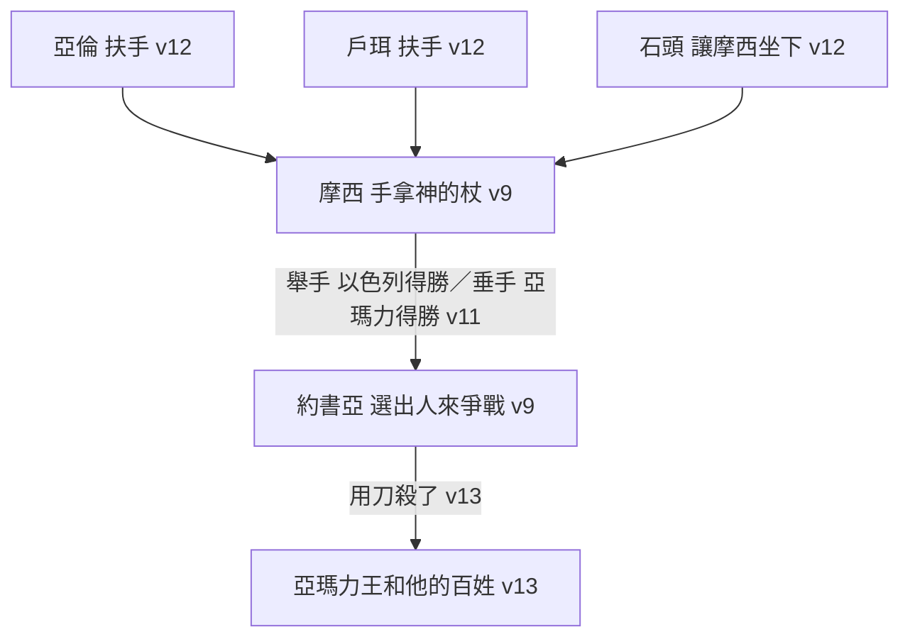

# 出埃及記 第17章

<!-- chapter-navigation:start -->
| [前一章](../02%20出埃及記/第16章.md) | [回目錄](../02%20出埃及記/全書目錄及綱要.md) | [下一章](../02%20出埃及記/第18章.md) |
| :--- | :---: | ---: |
<!-- chapter-navigation:end -->

1. [[以色列]]全會眾都遵[[耶和華]]的吩咐，按著站口從[[汛的曠野]]往前行，在[[利非訂]]安營。百姓沒有水喝，
2. 所以與[[摩西]][[米利巴（Meribah）|爭鬧]]，說：給我們水喝吧！摩西對他們說：你們為什麼與我爭鬧？為什麼[[神的試驗|試探耶和華]]呢？
3. 百姓在那裡甚渴，要喝水，就向[[摩西]][[以色列人的怨言|發怨言]]，說：你為什麼將我們從[[埃及]]領出來，使我們和我們的兒女並牲畜都渴死呢？
4. [[摩西]]就呼求[[耶和華]]說：我向這百姓怎樣行呢？他們幾乎要拿石頭打死我。
5. [[耶和華]]對[[摩西]]說：你手裡拿著你先前擊打河水的杖，帶領[[以色列]]的幾個長老，從百姓面前走過去。
6. 我必在[[何烈]]的[[磐石出水|磐石]]那裡，站在你面前。[[磐石預表基督|你要擊打磐石]]，[[磐石出水|從磐石裡必有水流出來]]，使百姓可以喝。[[摩西]]就在[[以色列]]的長老眼前這樣行了。
7. 他給那地方起名叫[[瑪撒（Massah）|瑪撒]]（就是試探的意思），又叫[[米利巴（Meribah）|米利巴]]（就是爭鬧的意思）；因[[以色列|以色列人]]爭鬧，又因他們試探[[耶和華]]，說：耶和華是在我們中間不是？
8. 那時，[[亞瑪力人]]來在[[利非訂]]，和[[以色列|以色列人]]爭戰。
9. [[摩西]]對[[約書亞]]說：你為我們選出人來，出去和[[亞瑪力人]]爭戰。明天我手裡要拿著神的杖，站在山頂上。
10. 於是[[約書亞]]照著[[摩西]]對他所說的話行，和[[亞瑪力人]]爭戰。摩西、[[亞倫]]，與[[戶珥]]都上了山頂。
11. [[摩西舉手得勝|摩西何時舉手，以色列人就得勝，何時垂手，亞瑪力人就得勝]]。
12. 但[[摩西]]的手發沉，他們就搬石頭來，放在他以下，他就坐在上面。[[亞倫]]與[[戶珥]]扶著他的手，一個在這邊，一個在那邊，他的手就穩住，直到日落的時候。
13. [[約書亞]]用刀殺了[[亞瑪力]]王和他的百姓。
14. [[耶和華]]對[[摩西]]說：我要將[[亞瑪力]]的名號從天下全然塗抹了；你要將這話寫在書上作紀念，又念給[[約書亞]]聽。
15. [[摩西]][[築壇耶和華尼西|築了一座壇，起名叫耶和華尼西]]（就是[[耶和華尼西|耶和華是我旌旗]]的意思），
16. 又說：[[耶和華]]已經起了誓，必世世代代和[[亞瑪力人]]爭戰。

---

## 本章知識節點

### 人物
- [[摩西]]
- [[亞倫]]
- [[約書亞]]
- [[戶珥]]
- [[亞瑪力]]
- [[亞瑪力人]]

### 地點
- [[利非訂]]
- [[何烈]]
- [[汛的曠野]]
- [[埃及]]

### 原文
- [[以色列]]
- [[瑪撒（Massah）]]
- [[米利巴（Meribah）]]

### 神學
- [[耶和華]]
- [[磐石預表基督]]
- [[耶和華尼西]]
- [[神的試驗]]

### 事件
- [[磐石出水]]
- [[戰勝亞瑪力人]]
- [[摩西舉手得勝]]
- [[築壇耶和華尼西]]

### 歷史
- [[以色列人的怨言]]

### 背景
- [[西乃山的地理]]
- [[摩西寫在書上]]

### 解經爭議
- [[瑪撒米利巴是一次還是兩次]]
- [[摩西舉手的意思]]
- [[出17：16「寶座」還是「旌旗」]]
- [[何西阿與約書亞改名時機與字意之解經爭議]]

### 互文
- [[林前10：4 靈磐石就是基督]]
- [[詩78：15-16 磐石出水]]
- [[來3：8-9 硬著心不可像瑪撒]]
- [[申25：17-19 記念亞瑪力]]
- [[約4：14 活水]]
- [[約7：38-39 活水的江河]]
- [[賽53：4-5 磐石被擊打]]

---

## 本章整理

CT 給本章的標題是「磐石出活水與戰勝亞瑪力人」，《串珠聖經註釋》一句話就說完了結構：「在[[利非訂]]發生的兩件事：磐石出水，與亞瑪力人爭戰。」《丁道爾聖經註釋》引納皮爾把它放進更大的框架裡：「前面記述的三個片斷，主題都是以色列的基本需要：在沙漠供應飲食。如今的第四個片斷，主題是最後一個存活的必要條件：從仇敵手中得拯救。神既勝過每個問題，便自證足以拯救自己子民而有餘。」

### 一、安息之地卻得不著安息（v1-3）

利非訂的名字本身就是這一段的反諷。CT 給的原文字義是「休息，停留，休息的地方」，然後補上一句：「因著缺乏水的緣故，該安息之處卻得不著安息。」BH 讀出同一層意思。但更值得注意的是他們怎麼走到這裡的——KC 提醒，百姓往前行「不是因為說得通，也不是因為他們看見這樣作的意義，而是因為主吩咐他們這樣作」，然後那裡沒有水。它把這件事的教訓寫得毫不迂迴：「即使我們走順服的路，也不能免去難處和試煉。」丁良才的話更短：「我們在主指示我們的路上，有時也能遭遇患難。」

百姓的反應不是抱怨而是追究。[[米利巴（Meribah）|「爭鬧」]]這個字，《每日研經叢書》說「含有正式責難之意」，《串珠聖經註釋》說它「帶有『尋找過失』及『爭辯』（在法庭內外）之意」，《中文聖經註釋》指出這字「是與訴訟有關，不論在法庭內或法庭外解決爭端，都可使用」，BH 說的是「希伯來文的『爭鬧』暗示一場法律訴訟，顯示他們控訴的嚴重性」。CT 把語氣譯了出來：「『給我們水』意指是你帶領我們到這無水之地，你應當負責找到水。」丁良才把[[以色列人的怨言|這場爭鬧]]的問題分成四層：「他們口出無理的妄言；他們不是請求，乃是強要；他們全無謝恩之意；他們沒有靠主之心。」《啟導本聖經腳註》另指出一個對稱：上一章神用嗎哪的收取量試驗百姓遵不遵法度，他們沒有經得住，「現在以色列人反要試驗神，向祂討水喝」。

這一段還藏著一個只有牧人寫得出的細節。《丁道爾聖經註釋》注意到 v3 的「並牲畜」：「除了牧人以外，還有誰會在自身難保之餘，擔心牲畜會否渴死？這是以色列牧人的寫照。」至於 v4「他們幾乎要拿石頭打死我」，《丁道爾聖經註釋》把它放進一條很長的名單：「這是以色列領袖遭受拒絕的極點……基督、司提反、保羅都曾面臨這同樣的事；要用石頭打他們的人，正是他們受差服事的對象。」摩西的回應才是這一段的轉折——《中文聖經註釋》說這是「有信心的領導人的表現之一──自己無法解決，呼求神去解決」。

### 二、擊打磐石與兩個地名（v4-7）

神吩咐摩西拿的不是「神的杖」，而是「你先前擊打河水的杖」，兩份來源從這個稱呼讀出相反卻互補的東西。CT 讀出警告：「這樣的稱呼提醒以色列人，埃及地的水變成血，屬世的享受和快樂，都在神的審判之下。」《聖經精讀本》讀出保證：「讓那條美麗的尼羅河變成死亡之血的耶和華，完全有能力讓沙漠中的磐石出水。」同一根杖，同一個動作，在[[埃及]]擊水使水變血，在[[何烈]]擊石使石出水。神又要他帶幾個長老同去；丁良才解釋原因：「因為百姓悖逆主，所以只叫幾個長老為這神跡作見證」，並補一句很實際的猜測：「這一次從百姓面前走過去，或者因為他們要拿石頭打死他。」

[[磐石出水]]這件事該怎麼理解，CT 兩種可能都留著：「神可以使乾而硬的磐石流出水來；不過，神也可以利用自然環境，使乾河床下面豐富的水源經過中空的巨石而湧流出來。」《舊約聖經背景註釋》給了自然解釋的機制，卻同時指出它的死角：「沉積岩在石面底下，有時有可以聚水的囊穴……擊打石面就能放出裡面積存的水。但和上述的事件一樣，水量之多是這種理論無法解釋的。」而 [[詩78：15-16 磐石出水|詩篇的回顧]]強調的正是水量：「多多地給他們水喝，如從深淵而出。」

至於這件事的屬靈意義，[[林前10：4 靈磐石就是基督|保羅在林前10:4]]說「那磐石就是基督」，是各家共同的立足點。丁良才把[[磐石預表基督|磐石預表基督]]分成三層，是本章最完整的一份整理：只打一次（[[賽53：4-5 磐石被擊打|賽53:4]]；亞13:7）、被打才出水（詩78:20；[[約7：38-39 活水的江河|約7:38-39]]；約12:24）、水比聖靈（[[約4：14 活水|約4:10、13-14]]）。KC 把這三層接成一條時間線：磐石代表基督，「祂在神加於祂的審判中，在十字架上被擊打。在祂死、復活、升天之後，聖靈就降臨了」。CT 另加一層：基督在十字架上被槍刺肋旁，「就有血和水流出來；血為贖罪，水為賜人生命」。趙世光則把角色分派清楚：「摩西代表律法，磐石預表基督。磐石被擊打，預表基督代替不遵守律法的人受咒詛。」《中文聖經註釋》提醒保羅那句「隨著他們」有其背景——猶太口述傳統認為這磐石一路隨行、每天出水。

v7 給那地方起了[[瑪撒（Massah）|瑪撒]]和米利巴兩個名字。KC 注意到命名的反常，這個觀察值得記住：「這兩個名字不是提醒人神恩典的作為、磐石被擊打，而是提醒人百姓悖逆的作為——他們需要被提醒：磐石為什麼被擊打。」它並指出[[神的試驗|這場試驗]]的方向是顛倒的：「不在於神試驗祂的百姓，反倒相反——是以色列在試驗神！他們挑戰祂，向祂索求祂同在的憑據。」而這是今天仍在說的語言：「若有神，祂就該作這個或那個。」CT 讀出百姓疑惑的具體內容：他們「認為神並沒有真正與他們同在，而僅是差遣天使來帶領他們」。至於這件事與民20的關係，各家立場分歧不小，詳見 [[瑪撒米利巴是一次還是兩次]]。

### 三、亞瑪力人來爭戰（v8-13）

[[亞瑪力人]]為什麼來，經文沒說，來源補了三個理由，而且三個都站得住。

| 說法 | 出處 | 依據 |
| --- | --- | --- |
| 爭水草與綠洲 | 《丁道爾聖經註釋》、《串珠聖經註釋》 | 「西奈半島牧草有限，不能同時供給以色列人和亞瑪力人，他們發動攻擊不過是遲早問題」 |
| 以掃與雅各的世仇 | 丁良才 | 「或者是因以色列人的先祖雅各奪了他們祖宗以掃的福分」；CT 同說亞瑪力人「是以掃的子孫，是以色列人的世仇」 |
| 以色列才是入侵者 | 《中文聖經註釋》 | 「亞瑪力人為保護其既得權益來和以色列人爭戰，以色列人因屬侵犯他人土地而不說出亞瑪力人來爭戰的原因」 |

他們怎麼打，本章沒有交代，《丁道爾聖經註釋》從[[申25：17-19 記念亞瑪力|申25:18]]補上：「他們在以色列的側翼和後方出沒，暗算脫隊的人」，並估算規模——現代住在這地區的貝度英人「頂多只能召集幾千男丁」。BH 說這次攻擊「是無故的，而且針對軟弱的人……這種侵略行為被視為懦弱而奸詐」。

KC 指出這場仗在全書中是新的：「在埃及他們沒有爭戰。在那裡他們是奴隸。在紅海也沒有爭戰。在那裡是神爭戰。在曠野卻有一場必須由百姓自己去打的仗。」[[約書亞]]在此首次出場，丁良才給了完整履歷：以法蓮支派，嫩的兒子，自幼服侍摩西，當時約四十餘歲。《丁道爾聖經註釋》在此提出一個時序上的保留：「嚴格來說，這時他仍然使用舊名何西阿」，改名顯然要到加低斯才發生（見 [[何西阿與約書亞改名時機與字意之解經爭議]]）。

這場仗最值得畫出來的，是勝負的所在地與作戰的所在地並不相同。

```mermaid
flowchart TD
  M["摩西 手拿神的杖 v9"]
  A["亞倫 扶手 v12"] --> M
  H["戶珥 扶手 v12"] --> M
  S["石頭 讓摩西坐下 v12"] --> M
  J["約書亞 選出人來爭戰 v9"]
  K["亞瑪力王和他的百姓 v13"]
  M -->|"舉手 以色列得勝／垂手 亞瑪力得勝 v11"| J
  J -->|"用刀殺了 v13"| K
```

[[摩西舉手得勝|舉手]]到底是什麼意思，四份來源給了三種讀法：禱告（丁良才、《丁道爾聖經註釋》、BH、CT）、作戰信號（《丁道爾聖經註釋》、《舊約聖經背景註釋》）、起誓（《丁道爾聖經註釋》），《串珠聖經註釋》則保留「經文沒有提及禱告」——各家的理由見 [[摩西舉手的意思]]。《中文聖經註釋》提醒一個常被略過的細節：「這裏並未說及摩西舉杖，乃是舉手，而且是舉雙手。」

手發沉之後的那一幕，各家讀出的都是同工。CT 說：「一棵樹是容易被風吹倒的，一個樹林就不容易被風吹倒。屬靈的爭戰不是一個人可以單槍匹馬去衝的。」《中文聖經註釋》說：「任何偉大的領袖，甚至有神的同在，並藉神能力行事的人，都必須有得力的『助手』。」KC 把山上的三個人都讀成基督：「摩西拯救了百姓，他代表救贖者；[[亞倫]]代表主耶穌作那位能『體恤我們的軟弱』的大祭司；[[戶珥]]的意思是白、純潔，這顯出那位代求者的完全。」但它立刻補上一句必要的更正：「當然，主耶穌從不疲倦——這顯出一切何等在乎祂：祂在天上的代求，決定地上爭戰的結局。」《中文聖經註釋》把功勞層層追到底：不是約書亞一人，也不是他和戰士，而是山頂上的手，以及扶手的人；「可是，摩西舉手使以色列人得勝的能源，乃在神」。

### 四、寫下來、築壇、起名（v14-16）

[[戰勝亞瑪力人|得勝]]之後，摩西作了三件事，三件都是為了讓這一天繼續起作用。第一件是[[摩西寫在書上|寫下來]]。《丁道爾聖經註釋》指出這是出埃及記中少數清楚提到當時有材料付諸文字的段落之一，並注意到一個可圈可點的安排：「本節將筆錄和口傳相提並論……此外本節將口頭傳述視為書面記載的從屬。」《串珠聖經註釋》讀法略異，認為兩者「同等重要」。它另猜測「這書」可能是今已佚失的「耶和華戰記」。KC 說明寫下來的用意：「這正是為什麼這場仗被寫下來，好叫他們有一個長久的警告。」

第二件是[[築壇耶和華尼西|築壇]]。CT 把這一節與世上的做法對照，是本章最鮮明的一段：「世界上的領袖，打了勝仗，是建銅像，立紀功碑，稱頌自己的偉大……摩西打了勝仗，卻去築了一座壇，向神獻祭，紀念神的能力和恩典。」它接著說出原因：「得勝的關鍵，不在於將士用命，不在於人運籌帷幄，而全在於神的能力。因此，沒有人爭功，沒有人邀賞。」KC 把它變成一個問題：「我們怎樣回應主為我們所作的？」

第三件是起名。[[耶和華尼西]]的「尼西」，《中文聖經註釋》說在希伯來文中意義很廣——船篷、旗號、信號、軍旗、徽章、標誌、國旗，並列出古代旗幟的三個功用：作記號、作集合的標誌、傳揚信息；然後它指出一個要緊的差別：「在這裏的壇，相信不會有任何的徽誌，而只是一個高出地面的石壇。」也就是說這面「旗」只有後兩個功用。《舊約聖經背景註釋》給了一個貼切的埃及對照：「埃及的軍旅以神祇為名，其旌旗就是用代表這些神祇的事物作為識別。」《丁道爾聖經註釋》則對壇名提出保留：「更合宜的看法是將之視作神的尊號，祭壇是向祂的奉獻。」

至於最後一節，原文有異文，和合本作「耶和華已經起了誓」，《丁道爾聖經註釋》主張改讀成「向耶和華的旌旗舉手」，BH 與《聖經精讀本》則按「寶座」讀——兩種讀法會讓本章收在不同的語氣上，見 [[出17：16「寶座」還是「旌旗」]]。可以確定的是，[[亞瑪力]]被打敗了卻沒有被消滅。KC 說：「肉體不能被根除……他們必須繼續對這仇敵存戒心。」CT 從 v16 讀出 v14 尚未完成：「仍須世世代代持續和亞瑪力人爭戰，直到最終達成目標。」丁良才把應驗列成五段：掃羅、撒母耳、大衛、西緬人、末底改。

### 五、糧、水、仗：曠野的三件必需

[[以色列]]從[[汛的曠野]]起行到利非訂，只走了一站，卻換了三個難題。把出16與出17連起來看，《丁道爾聖經註釋》所引納皮爾的四個片斷就完整了。

| 供應 | 出處 | 領受的方式 | KC 的讀法 |
| --- | --- | --- | --- |
| 糧（嗎哪） | 出16 | 每天收取 | 基督在地上降卑的生命 |
| 水（磐石出的水） | 出17:1-7 | 一次擊打，江河隨行 | 基督被擊打，死而復活升天後聖靈降臨 |
| 仗（亞瑪力） | 出17:8-16 | 山下用刀，山上舉手 | 與肉體爭戰，靠聖靈的劍與基督的代求 |

KC 指出這個次序不能顛倒：先有嗎哪，才有活水；先有供應，才談得上爭戰——百姓正是靠著神所賜的糧與水，才有力氣打這場仗。而[[來3：8-9 硬著心不可像瑪撒|新約回頭引用這一章]]時，記的既不是水也不是勝仗，是瑪撒——KC 的話仍然是最準的：他們需要被提醒，磐石為什麼被擊打。

**參考資料**
https://www.ccbiblestudy.org/Old%20Testament/02Exo/02CT17.htm
https://www.ccbiblestudy.org/Old%20Testament/02Exo/02GT17.htm
https://www.kingcomments.com/en/bible-studies/Exo/17
https://biblehub.com/study/exodus/17.htm

<!-- chapter-navigation:start -->
| [前一章](../02%20出埃及記/第16章.md) | [回目錄](../02%20出埃及記/全書目錄及綱要.md) | [下一章](../02%20出埃及記/第18章.md) |
| :--- | :---: | ---: |
<!-- chapter-navigation:end -->
