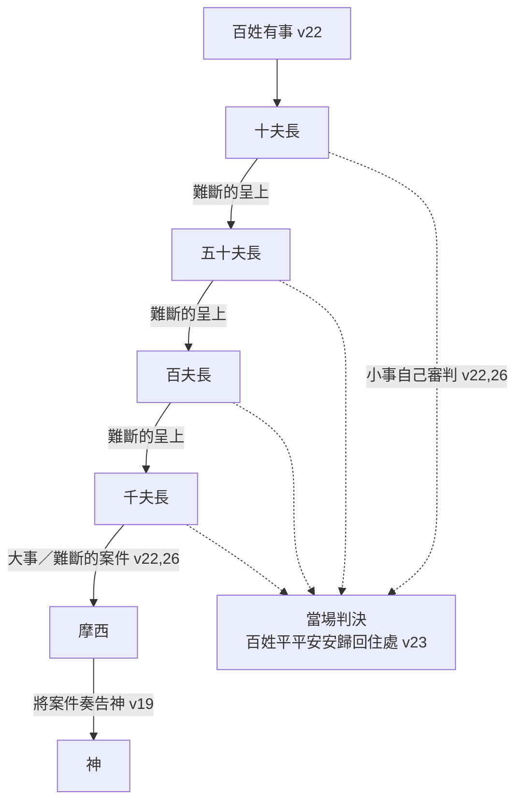

# 出埃及記 第18章

1. [[摩西]]的岳父，[[米甸祭司]][[葉忒羅]]，聽見神為摩西和神的百姓[[以色列]]所行的一切事，就是[[耶和華]]將以色列從[[埃及]]領出來的事，
2. 便帶著[[摩西]]的妻子[[西坡拉]]，就是摩西從前打發回去的，
3. 又帶著[[西坡拉]]的兩個兒子，一個名叫[[革舜]]，因為[[摩西]]說：[[革舜（ sojourner ）|我在外邦作了寄居的]]；
4. 一個名叫[[以利以謝]]，因為他說：[[以利以謝（ God is help ）|我父親的神幫助了我]]，救我脫離[[法老]]的刀。
5. [[摩西]]的岳父[[葉忒羅]]帶著摩西的妻子和兩個兒子來到[[神的山]]，就是摩西在曠野安營的地方。
6. 他對[[摩西]]說：我是你岳父[[葉忒羅]]，帶著你的妻子和兩個兒子來到你這裡。
7. [[摩西]]迎接他的岳父，[[古代近東岳父禮儀|向他下拜，與他親嘴，彼此問安]]，都進了帳棚。
8. [[摩西]]將[[耶和華]]為[[以色列]]的緣故向[[法老]]和[[埃及]]人所行的一切事，以及路上所遭遇的一切艱難，並耶和華怎樣[[神的拯救|搭救]]他們，都述說與他岳父聽。
9. [[葉忒羅]]因[[耶和華]]待[[以色列]]的一切好處，就是[[神的拯救|拯救]]他們脫離[[埃及]]人的手，便甚歡喜。
10. [[葉忒羅]]說：[[耶和華]]是應當[[稱頌耶和華|稱頌]]的；他救了你們脫離[[埃及]]人和[[法老]]的手，將這百姓從埃及人的手下救出來。
11. 我現今在[[埃及]]人向這百姓發狂傲的事上得知，[[耶和華]]比萬神都大。
12. [[摩西]]的岳父[[葉忒羅]]把[[獻祭敬拜|燔祭和平安祭]]獻給神。[[亞倫]]和[[以色列的眾長老]]都來了，與摩西的岳父在神面前吃飯。
13. 第二天，[[摩西]]坐著[[審判與治理|審判]]百姓，[[曠野審判制度|百姓從早到晚都站在摩西的左右]]。
14. [[摩西]]的岳父看見他向百姓所做的一切事，就說：你向百姓做的是什麼事呢？你為什麼獨自坐著，眾百姓從早到晚都站在你的左右呢？
15. [[摩西]]對岳父說：這是因百姓到我這裡來求問神。
16. 他們有事的時候就到我這裡來，我便在兩造之間[[審判與治理|施行審判]]；我又叫他們知道神的律例和法度。
17. [[摩西]]的岳父說：你這做的不好。
18. 你和這些百姓必都疲憊；因為這事太重，[[分層授權|你獨自一人辦理不了]]。
19. 現在你要聽我的話。我為你出個主意，願神與你同在。你要替百姓到神面前，將案件奏告神；
20. 又要將律例和法度教訓他們，指示他們當行的道，當做的事；
21. 並要從百姓中揀選有才能的人，就是[[敬畏神、誠實、恨不義之財|敬畏神、誠實無妄、恨不義之財]]的人，派他們作千夫長、百夫長、五十夫長、十夫長，管理百姓，
22. 叫他們隨時[[審判與治理|審判]]百姓，大事都要呈到你這裡，小事他們自己可以審判。這樣，你就輕省些，[[分層授權|他們也可以同當此任]]。
23. 你若這樣行，神也這樣吩咐你，你就能受得住，這百姓也都平平安安歸回他們的住處。
24. 於是，[[摩西]]聽從他岳父的話，按著他所說的去行。
25. [[摩西]]從[[以色列|以色列人]]中揀選了有才能的人，[[摩西立首領|立他們為百姓的首領]]，作千夫長、百夫長、五十夫長、十夫長。
26. 他們隨時[[審判與治理|審判]]百姓，有難斷的案件就呈到[[摩西]]那裡，但各樣小事他們自己審判。
27. 此後，[[摩西]]讓他的岳父去，他就往本地去了。

<!-- fhl-map-links:start -->
## 相關地圖

- [[appendix/fhl_maps/maps/018|〈出圖一〉摩西的早年]]
- [[appendix/fhl_maps/maps/019|〈出圖二〉以色列人出埃及到西乃山]]
- [[appendix/fhl_maps/maps/024|〈民圖五〉出埃及和進迦南的旅程]]
<!-- fhl-map-links:end -->

---

## 本章知識節點

### 人物
- [[摩西]]
- [[葉忒羅]]
- [[西坡拉]]
- [[革舜]]
- [[以利以謝]]
- [[亞倫]]
- [[以色列的眾長老]]

### 地點
- [[神的山]]
- [[西乃山]]
- [[何烈山]]
- [[米甸地]]

### 原文／名字
- [[葉忒羅（ his abundance ）]]
- [[革舜（ sojourner ）]]
- [[以利以謝（ God is help ）]]
- [[西坡拉（ bird ）]]

### 神學
- [[神的拯救]]
- [[稱頌耶和華]]
- [[獻祭敬拜]]
- [[審判與治理]]
- [[分層授權]]
- [[敬畏神、誠實、恨不義之財]]

### 互文
- [[來7：1-3 麥基洗德]]
- [[徒6：1-7 選立執事]]
- [[提前3：1-7 監督資格]]
- [[多1：5-9 長老資格]]
- [[彼前5：1-4 牧養群羊]]
- [[林前12：18 肢體安排]]

### 背景
- [[米甸祭司]]
- [[古代近東岳父禮儀]]
- [[曠野審判制度]]

### 事件
- [[葉忒羅來訪]]
- [[葉忒羅獻祭]]
- [[摩西審判百姓]]
- [[葉忒羅建議分層治理]]
- [[摩西立首領]]
- [[葉忒羅返回本地]]

---

## 本章整理

CT 給本章的標題是**【摩西岳父葉忒羅到訪】**。《串珠》指出本章在全卷中的特別之處：**「摩西自從重返埃及以來，一直以先知或領袖的姿態出現；**——**本章內，作者卻強調摩西也是人，有對家庭的感情，也會在工作上遭遇困難。」**

**KC 更指出這是全卷第一部分的結束**：**「這次會面標誌著本書第一部分的結束。」**

### 經文大綱

1. **[[葉忒羅來訪|葉忒羅攜摩西妻兒到訪]]**（1-7節）
2. **葉忒羅向神[[稱頌耶和華|稱頌]]並[[葉忒羅獻祭|獻祭]]**（8-12節）
3. **葉忒羅因見[[摩西審判百姓|摩西獨自審案]]而[[葉忒羅建議分層治理|建議分層負責]]**（13-26節）
4. **[[葉忒羅返回本地|葉忒羅返回他本地]]**（27節）

### 一、[[葉忒羅來訪]]（v1-7）

> [!question] [[米甸祭司|葉忒羅是哪位神的祭司？]]——本章最大的爭論
> **這個問題決定了整章的讀法，而各家立場分歧明顯。**
>
> **①他本來就事奉真神。**CT 給了四條理由，最完整：**「(1)他所說祝福的話『平平安安』是以色列人慣用的 Shalom；(2)他的女兒西坡拉懂得替她兒子行割禮（4:24-26）；(3)他稱頌耶和華，並獻燔祭和平安祭給神；**——**(4)聖經也稱無族譜的[[來7：1-3 麥基洗德|麥基洗德]]為至高神的祭司」**（來7:1-3）。**《中文聖經註釋》立場最堅定**：**「米甸祭司葉特羅所事奉的神就是亞伯拉罕所敬拜的神，是他祖宗的神……葉特羅和摩西所敬拜的，就是他們共同的祖宗亞伯拉罕的神。**——**所以，在這裏並沒有轉信另一位神，也沒有基尼說的可能。」**
>
> **②他是「初信者」。**《丁道爾》：**「葉忒羅這時所說的話，似乎支持耶和華對他來說是新神的觀點。」**《精讀本》同：**「模模糊糊地聽說過古代閃族的神，與摩西相遇之後，在他的見證下才真正認識了耶和華神。」**
>
> **③《舊約背景註釋》給了一個完全不同的角度，也最冷靜**：**「葉忒羅被稱為米甸，而非某一神明的祭司……祭司未必只限於事奉一位神祇，因此葉忒羅承認耶和華為大，並不表示他是耶和華的祭司或信徒。**——**祭司在哪位神的廟宇中事奉，通常就被視為哪位神的僕人。但這些人並沒有一神信仰，所以其他神明彰顯能力時，他們也不會否認。」**
>
> **《丁道爾》另提到「米甸說」（基尼說）這個學術主張，並且拒絕了它**：**「他們認為摩西不但從這些米甸遠親學會了神的名字，更沿襲了敬拜祂的方式……**——**但這解釋是沒有必要的，葉忒羅祭司的身分，以及他是摩西尊長的事實，似乎已能提供充分理由。」**
>
> **[[葉忒羅（ his abundance ）|三個名字]]。**CT 整理得最清楚：**「(1)流珥（2:18）是他的本名；(2)葉忒羅（3:1）可能是他擔任祭司時的職稱；(3)何巴（士4:11）可能是指摩西的內兄」**——並指出關鍵：**「按希伯來原文，此字（岳父）可作岳父和內兄兩種解釋。」**

**摩西為什麼打發妻兒回去？聖經沒說，各家推測一致。**CT 給了兩層：**「(1)當時神要殺摩西，西坡拉立刻為她的兩個兒子行割禮（4:24-26），因此讓摩西意識到帶妻兒同行回埃及地，恐會節外生枝；(2)摩西在見到亞倫後，被亞倫告知，此次埃及之行，乃身入險境，為著安全，不宜攜眷同行。」**《丁道爾》指出這句話在敘事上是必要的：**「加插這句話是有必要的。因為按照四章20節，他們已經跟隨摩西回到埃及去了。」**

> [!note] 兩個兒子的名字，是摩西的信仰履歷
> **KC 把兩個名字讀成一組對照**：**「革舜的意思是『寄居的』。他的名字提醒我們，基督像摩西一樣，在地上是一位客旅，正如教會現在也是。**——**但在這艱難的地位上，摩西一直確知神的幫助，這就是以利以謝這名字所指出的——就是『神是我的幫助』。」**
>
> **《丁道爾》從這個對照讀出摩西的轉變**：**「他的名字（『我神是幫助』）和革舜所代表的絕望相比，可以看出摩西信心重燃。」**
>
> **《丁道爾》另從以利以謝身上做了一個很精彩的史學論證**：**「他在傳統之中沒有扮演任何角色，所以即使是最吹毛求疵的聖經批判學家，也不能說他是捏造出來的人物。**——**他的存在和他在這時來見摩西所構成的疑難，本身已經是最好的證據，證明這是可靠的傳統，虛構的傳統當然不會有疑難。」**
>
> **它還注意到一個容易被忽略的細節**：**「名字的形式也值得注意，即使是摩西兩個兒子的名字，也沒有耶和華聖名的成分。**——**這證據支持摩西未曾經歷西乃山異象之前，以色列對耶和華其名一無所知的看法。」**
>
> **「外邦」指哪裡？**《中文聖經註釋》答得很準：**「原指摩西在埃及作客旅，而不是指他在米甸作了寄居的。因為埃及才是他的外邦。」**

**v7 的問安是一幕典型的近東禮儀。**《舊約背景註釋》指出它的獨特：**「摩西照規矩向葉忒羅問安。下拜表示尊敬，是向社會地位較高之人問安的方式。親吻面頰表示友誼。**——**本節是兩者一併做出來的惟一案例。」**《丁道爾》讀出兩人的身分：**「兩人皆是大酋長的身分，言行舉止自有一番氣度。摩西對岳父的尊重，從他虛懷接受葉忒羅關乎司法程序的建議可見一斑。」**

**一個有趣的抄本問題，《中文聖經註釋》記下了**：v7「向他下拜」原文看不出誰向誰下拜——**「撒瑪利亞抄本因為高抬摩西的地位，並為避免以色列人的領袖向一個外邦人的祭司下拜之『失威』，所以改成『葉特羅就向摩西下拜』。**——**若看上下文，以及以親屬尊卑的常理來說，撒瑪利亞抄本的更改是不合理的。」**

### 二、見證、[[稱頌耶和華|稱頌]]與[[葉忒羅獻祭|獻祭]]（v8-12）

**摩西述說的內容有多長？**CT 把它列了出來：**「『怎樣搭救』包括：(1)埃及追兵；(2)瑪拉苦水；(3)以琳水泉；(4)降鵪鶉和嗎哪；(5)擊打磐石出水；(6)打敗亞瑪力人等。」**——**這正是出14-17 的目錄。**

> [!important] KC：這才是造就人的談話
> **KC 對這一段的應用是本章最溫暖的一段**：**「他們彼此問好。這常是我們問的第一個問題，然而我們可能連答案都不等，或很快地回答『還好』。當這問題得到較長、較實在的回答時，我們有時反而覺得吃不消。**——**彼此表現真實的興趣、並且花時間這樣作，是重要的。」**
>
> **它接著點出這場談話的內容與果效**：**「奇妙的是，談話的主題是主待以色列的良善，而其果效是祂得著尊榮。這才是真正造就人的談話。**——**我們的談話也該是這樣，也該有那樣的果效。」**
>
> **CT 同讀，但角度在見證**：**「雖然葉忒羅早已聽見神拯救以色列人的事蹟，但摩西仍詳細向他述說親身所經歷的見證。**——**可見，信徒向人做得救的見證，乃是一件美好且必要的事。」**丁良才數出述說的三種益處：**「（一）勉勵自己；（二）幫助別人；（三）榮耀真神。」**

> [!example]- 「便甚歡喜」可能是誤譯
> **《中文聖經註釋》在這裡做了一段很細的原文考證**：**「原文歡喜這字，在經文抄本和印刷本上都顯明是無法讀得出來的字……七十士譯本的譯者則認為是中間漏了其他字母，即其字根應是 harad，就是說，中間漏了 r 這字母。Harad 是『震驚』或『大大驚奇』的意思。」**
>
> **它的結論**：**「葉特羅雖然終生事奉了他所敬拜的神……卻沒有想到，也還沒有體驗過神是有如此的大能……**——**所以他大大的驚奇，而不是便甚歡喜，如同現有大多數譯本所繙譯的。」**
>
> **《串珠》折衷**：**「『歡喜』：包含訝異和震驚的意思。」**CT 同：**「『便甚歡喜』含有震驚之餘、大感歡欣之意。」**

> [!question] 「耶和華比萬神都大」——這是一神論嗎？
> **CT 明確否認多神論**：**「這話並不表示葉忒羅是泛神論的信仰者，因為這是一種修辭法，表示萬神之中只有一位真神……譬如使徒保羅也曾說過：『雖有稱為神的，或在天，或在地……然而我們只有一位神』」**（林前8:5-6）。
>
> **《丁道爾》分得更精細，用的正是它在出15:11 用過的那組術語**：**「雖然未算一神信仰（monotheism，相信只有一神），一神崇拜（monolatry，諸神之中只崇拜一神）卻是理所當然的結果。**——**非以色列人作出類似宣言的另一例子，還有約拿書一章16節。」**
>
> **《舊約背景註釋》最冷靜，但它的結論很有力**：**「初民的多神信仰，給予他們神明能力各有高下的觀念，在神明顯然是彰顯作為或能力時，他們可以用極度渲染的話來讚美。**——**但無論葉忒羅本人的宗教信仰是什麼，耶和華已經達到了自己的目的：藉大能作為使普天下都『知道我是耶和華』。」**
>
> **《精讀本》則坦承這句話的字面**：**「這句話體現了葉忒羅的多神論思想，即承認眾神的存在，但耶和華比這些都大。但是，這只是一種修辭手法。」**

> [!important] v12 的飯，是家宴還是立約？
> **這是本章第二個大分歧。**
>
> **《中文聖經註釋》主張這是立約，理由很強**：**「舊約聖經於記述在神面前喫飯時，所表達的乃是立約（創26:26-33，31:44-54；出24:1-11等）。**——**摩西的岳父來見摩西，送他的家小回來，只是一件附帶的父職；因龐大數目的以色列人臨境，與葉特羅的族人之安危，和其牧地是否受侵奪（像亞瑪力人所遭遇的），是他關心的要點。」**——它並解釋為何由亞倫和長老出面：**「因摩西是葉特羅的女婿，所以就由亞倫和以色列的眾長老為代表了。」**
>
> **《啟導本》給了一個極有力的後續旁證**：**「後來掃羅向亞瑪力人進攻，曾要基尼人離開亞瑪力人，免遭消滅，理由是『因為以色列人出埃及的時候，你們曾恩待他們』（撒上十五6）。**——**基尼人屬米甸族，葉忒羅是米甸族的基尼人」**（士1:16）。
>
> **《舊約背景註釋》則傾向感謝祭**：**「古代的祭祀同時亦為人提供了分享筵席的機會。這種筵席可以作為使協議正式化的場合，但也可以是感謝祭的一部分。**——**本段比較合乎後者，耶和華是筵席的上賓。」**
>
> **為什麼由葉忒羅主祭？**《中文聖經註釋》答得很好：**「原因是亞倫此時尚未是祭司，葉特羅是祭司……但是，既然葉特羅是他的長輩，而彼此所信的又同是一位神。」**《丁道爾》同：**「以色列當時仍然未有祭司制度，獻祭是族中『長老』的職責。」**
>
> **這一幕的預表意義。**CT：**「以色列眾長老與葉忒羅一同坐席吃飯，是將來以色列全家得救（羅11:26），在千年國度時期，以色列民與外邦信徒一同蒙福的預影」**（賽2:2-3）。**KC 說得更完整**：**「許多解經家在這一幕中看見一個預言性的指向：基督（摩西）在國度開始時，與列國（葉忒羅）和以色列百姓（亞倫和以色列眾長老）一同分享的喜樂。」**
>
> **KC 另從西坡拉的缺席讀出教會論**：**「我們也在摩西妻子於以色列得釋放期間的缺席上，看見這預言性的應用。照樣，教會在那將臨到以色列的大災難時期，也不會在地上。**——**而正如教會要有分於以色列得拯救的喜樂，西坡拉如今也再次登場。」**

### 三、[[摩西審判百姓|摩西獨自審判]]（v13-16）

**「坐」與「站」是術語。**《丁道爾》：**「坐……站，是閃族律法的術語，分別指『法官』和『當事人』。」**《中文聖經註釋》澄清一個常見誤解：**「這並不表示許多人在伺候摩西，乃表明求審判或求斷案的人多，摩西從早到晚都處理不完。」**

**[[曠野審判制度|摩西坐在哪裡？]]**《中文聖經註釋》：**「摩西坐審判百姓的地方，大概是一個特設為求問神的會幕（參33:7）。」**《舊約背景註釋》給了古代近東的通則：**「審判官的『法院』『開庭』時，其座位是權柄的所在。這座位通常設置在城門口。」**

**葉忒羅的問話是教學法。**CT：**「這句問話應當是在私下的場合問的，不一定表示他根本不知道情況，也許他為了引起對話而故意這樣問。**——**現代良好的教學方式，也是以教師的問話開始的。」**《中文聖經註釋》同：**「乃是良好教師的一個模範問句，要對方作反省後給予答案。」**

> [!quote] 《丁道爾》：不少基督徒領袖都犯上了同樣毛病
> **「這是一位年老酋長智慧的詰問，授權下屬是他早已學會的重要課題。大小責任摩西都想一手包辦，無端令得自己心疲力絀（18節），不少基督徒領袖都犯上了同樣毛病。**——**這種行為未必是野心的表現，有時過分的關心和盡責都會使人如此。」**
>
> **它接著指出一個常被忽略的受害者**：**「常被忽略的另一點，是百姓也因此疲憊不堪（18節）。**——**類似因素所造成的執法延滯，是後世押沙龍所以成功發動政變的因素之一」**（撒下15:1-6）。

**摩西當時在做幾件事？**《串珠》分成三項：**「1 他替百姓求問神的旨意；2 解決他們中間任何紛爭訴訟；3 又把神的律例和法度教導他們。」**《中文聖經註釋》從這裡讀出問題的根源：**「從摩西的答話中，葉特羅已讓摩西自覺自己角色的混淆，聖俗的不分，**——**不但自陷己苦，百姓也苦不堪言。」**

**「律例」與「法度」的分別，各家略有不同：**

| 來源 | 律例 | 法度 |
| --- | --- | --- |
| CT | 偏重於成文律法條規 | 偏重於不成文判例及其應用 |
| 《啟導本》 | 五經中摩西制訂的規例和律法 | 原文 torot，似指遇有難題向神求問後得出的決定 |
| 《串珠》 | 百姓在生活中所要守的原則和規條 | 接近「決定」的意思，即神對某事的指示 |
| 《精讀本》 | 宗教法 | 妥拉，指有關百姓生活的一般法律 |

**丁良才提醒一個重要的時序**：**「當時神還沒有頒律法，所以摩西藉著斷案的要理，教訓百姓。」**《丁道爾》據此推測律法的成形過程：**「摩西律法可能就是如此形成的；這律法一部分是神啟示的偉大原則，一部分則是前述原則在沙漠中的日常應用。」**

### 四、[[葉忒羅建議分層治理]]（v17-23）

**葉忒羅的建議分四項。**CT 列得最清楚：**「(1)摩西將百姓重大案件奏告神（19節下）；(2)教導百姓使他們知道律例和法度（20節）；(3)選賢與能，使他們分層負責審理不同程度的案件（21-22節）；(4)將重大案件呈報摩西，由他審理」**（22節中）。

**這套制度的結構，正是本章最值得畫出來的東西：**

**丁良才把逐級上呈的機制說得最明白**：**「十夫長有難斷的案件，就呈到五十夫長，五十夫長有難斷的案件，就呈到百夫長，百夫長有難斷的案件，就呈到千夫長，**——**這樣，千夫長有難斷的案件，才呈到摩西那裡。」**

> [!important] 分的不是聖俗，是難易
> **《丁道爾》在這裡糾正了一個很常見的誤解，這是本章最重要的一段解經**：**「以為本段是將摩西和長老的職責加以區分，一方負責『聖』事，一方負責『民』事，是個誤解；**——**以色列一切司法都是聖事。法律不論怎樣執行，都不會越出獻祭和聖筵的範疇之內。**——**所以本段所劃分的不是聖俗，而是難易：將傳統和啟示已經討論過的，從需要神新鮮話語處理的事務分別開來。」**
>
> **《串珠》從另一個方向說了同一件事**：**「可算是葉忒羅勸告的中心：摩西衡量做事的標準應是按事情的重要性，而不是視乎事情屬宗教事宜抑民事。」**
>
> **《舊約背景註釋》則指出這套制度在埃及早有先例**：**「上述制度和埃及沒有很大的分別；法老保證會伸張正義，但仍設立以一位大臣為首的系統，這大臣坐在審判座上，稱為『瑪阿特之先知』（瑪阿特是真實和正義的女神）。」**——它並指出這件事的政治意義：**「這制度的設立，使摩西在社會甚至政治中所扮演的角色變得正式化，**——**以色列從此不復是純部落的社會，半中央政府開始形成。」**

> [!note] 為什麼用軍隊的編制？
> **千夫長、百夫長、五十夫長、十夫長——這是軍隊的名稱。**《中文聖經註釋》給了最實際的理由：**「這裏所用的名稱，似乎是軍隊的組織，而不像民事的官長，但這卻正是漂流曠野中以色列人的實境。**——**因為還未進入迦南，不能以地區分派官長，而只能以人數多寡分派職責。」**它並指出這套原則的彈性：**「在行政管理的原則上，甚至於官名與職責，都必須有伸縮性」**（申1:9-18 的分配法就與此稍有不同）。
>
> **CT 讀出的則是身分**：**「以色列民是『耶和華的軍隊』（12:42），至此，神的百姓正式組成軍；**——**平時用於治理，戰時立刻總動員開赴前線。」**《丁道爾》同：**「以色列和所有古代國家一樣，主要被視為作戰力量，其組織也反映了這一點。」**

**[[敬畏神、誠實、恨不義之財|揀選的四項資格]]——KC 逐項解釋得最清楚：**

| 資格 | KC 的解釋 |
| --- | --- |
| 有才能 | 有健全而堅定判斷力的人 |
| 敬畏神 | 出於對神的敬畏而行事，在他們的審判權上最終要向祂交帳 |
| 可靠（誠實無妄） | 說真理的人 |
| 恨不義之財 | 不能被賄賂的人 |

**《丁道爾》指出這份清單的重點所在**：**「德萊維指出，這個職分注重的是道德上，而非智力上的條件。**——**新約對於參與事奉之基督徒的要求，也大同小異」**（[[徒6：1-7 選立執事|徒6:3]]；[[提前3：1-7 監督資格|提前3:1-3]]）。CT 的〔話中之光〕同：**「這話說出，信徒最大的才幹，不在於聰明智慧，乃在於品格端正。」**

**丁良才指出「敬畏神」這一項最常被輕看**：**「第二三種，各國各時的人無不極端贊成，唯第一種，人多以為無關緊要，**——**其實敬畏神，乃是品行中的根源，因此是最要緊的。」**《中文聖經註釋》解釋了為什麼：**「敬畏神的人，他才會有真正的良心，因為知道有一位無所不知、無所不在和無所不能者，常在鑑察他一切的思念、言語和行為。」**

**丁良才另指出一個諷刺的後續**：**「後來以色列人的官長往往不是這樣的人。【比方】撒母耳的兒子（撒上8:3），和眾先知連次所諫責的人」**（賽1:23；耶5:28；結22:27；彌3:11）。

**「有才能的人」原文是什麼？**《丁道爾》：**「希伯來文原意可能是『有軍人風範』的人，後來引伸作『正直真誠』之義。**——**箴言十二章4節用相同字眼形容理想的家庭主婦（和合本譯『才德』），可供參考。」**

**「當行的道」有一層很美的字源關係，《丁道爾》抓到了**：**「這字可能故意響應上面譯作『法度』之字（tora，『妥拉』）的原意，後者甚至可以譯成『路標』。**——**從這角度看，希伯來人對於律法的概念，便完全沒有難解或令人望而卻步之處了：它是神在生命路途上為人安設的路標。」**

### 五、[[摩西立首領]]與[[葉忒羅返回本地]]（v24-27）

> [!question] 摩西該不該聽？——本章尚未有定論的問題
> **這是本章最有意思的一個張力，而各家的答案分成三邊。**
>
> **KC 把疑問正面提出來，並且問得很尖銳**：**「有人問過，摩西是否該接受葉忒羅的建議。照葉忒羅的判斷，這擔子對摩西太重了……**——**難道神自己不能把這事向摩西講明嗎？葉忒羅不是這百姓中的人。他也沒有與百姓同去」**（v27）。它並指出一個文本上的事實：**「雖然葉忒羅在第23節說摩西只有在『神這樣吩咐你』時才照他的建議行，下一節卻只說摩西照他岳父所勸的去行。**——**我們沒有讀到神有這樣的命令。」**
>
> **但 KC 自己給了一個很平衡的結論**：**「也有可能神使用葉忒羅，把秩序引進以色列的治理中……**——**沒有提到神的命令，並不一定表示神沒有給祂的許可。摩西是一個活在與神交通中的人。」**
>
> **CT 的〔靈意註解〕站在懷疑的一邊，而且很直接**：**「13-23節葉忒羅的建議代表肉體的辦法和幫助，與神的安排（參民11:16-25）有別。」**它的〔話中之光〕更點名了問題：**「葉忒羅的建議雖好，但是在此卻沒有記載摩西把它帶到神面前去求問，並等候神的指示……**——**主耶穌在決定挑選十二使徒以前，『整夜禱告』（路6:12）尋求神的旨意。今日教會中服事最忌諱的是，獨斷偏行而不求問神，或是根據多數人的意見而不尋求神的旨意。」**——**「我們何等容易接受別人肉體的幫助和辦法，而不仰望神的引導。」**
>
> **但 CT 在 v24 又說了相反的話**：**「葉忒羅的建議能夠記錄在聖經裡，表示不但被摩西採納，並且很可能也得到神的同意。」**
>
> **《中文聖經註釋》則以 v23 那句話作為本章確為史實的證據**：**「因為後期以色列人與米甸人仇恨，且鄙視外教和外邦，**——**不可能把『神也這樣吩咐你』的話放在米甸祭司葉特羅的口中。」**它並指出葉忒羅說這話的底氣：**「葉特羅把他的建議當作是神的命令，是在強制摩西要如此遵行的，因為是他確知神的旨意就是如此的。」**
>
> **《串珠》的結論最簡潔**：**「摩西聽從岳父忠告，也就是等於順從神的旨意。**——**顯然，神的意思是可透過別人間接表達出來。」**
>
> **《丁道爾》則注意到葉忒羅的分寸**：**「葉忒羅是個有教養的近東人，雖然是明智的意見也不會強人所難，逼女婿接受。」**BH 同：**「他不強迫摩西接受，而是將決定權交給神。」**

**CT 的〔話中之光〕在 v19 對「不必效法葉忒羅」的極端立場提出了很重的反駁，值得完整讀**：**「今日教會中，仍有些極端的領袖人物，認為葉忒羅的建議，是不懂得屬靈原則的外邦人看法，不足效法。難怪他們在教會中，說好聽一點，凡事躬親而為；說不好聽，凡事獨斷獨行，將自己拱上寶座。**——**筆者曾經聽見一位教會領袖說，我已經將聖經解得詳盡周到，你們只要照著宣講，不須加上自己的話。」**它接著給出一個很好的分辨：**「就著摩西預表耶穌基督的救贖事工而言，無人可以取代或幫助他；但就著預表耶穌基督的建造教會事工而言，主耶穌親自說，信我的人要做比這更大的事（約14:12）。**——**可見，本章的事記錄在聖經中，並不是多餘的。」**

**「摩西聽從」——《丁道爾》從這個動詞讀出摩西的品格**：**「『聽從』正是這詞直譯的意思。摩西甚為謙遜（又具智慧），願意從岳父學習。**——**謙卑（以及盡忠，參來3:2）是摩西其人最主要的品德」**（民12:3）。《中文聖經註釋》：**「這是智慧人接受智慧勸告的良範。庸碌的人，只顧集權於一身，而成為獨裁者和獨夫。」**

**丁良才數出摩西的五種過人之處，很值得記住**：**「（一）忠心（雖有貴戚，從遠方來看望他，他也不以私廢公）；（二）殷勤（他雖已經八十多歲，還是終日勞碌）；（三）謙卑（他雖極其尊貴，還是與百姓親近）；（四）良善（百姓雖惡待他（17:4），他還是為他們勞動不止）；**——**（五）納諫（他雖具有大智慧（徒7:22），還是服從岳父的良謀）。」**

**v27 證明葉忒羅與何巴不是同一人。**CT：**「摩西一面允許他的岳父葉忒羅一個人離去，另一面卻請求何巴同往迦南美地（民10:29-32），由此可見，葉忒羅和何巴並非同一人，前者是岳父，後者是內兄。」**《丁道爾》另注意到一個字義上的旁證：**「第2節描述摩西打發妻子回到米甸，所用字根與此相同。**——**本節證明了這個動詞在該節並無不良含義（摩西沒有休妻）。」**

**[[葉忒羅返回本地|葉忒羅為什麼要走？]]**《中文聖經註釋》：**「大概在12節所述的盟約，只是聯盟和互不侵犯，而不是聯合的立約，所以他的岳父必須回本地去。**——**否則，他對曠野遊牧的經驗，是剛出埃及不久的以色列人不可或缺的（參民10:29-32），摩西當然喜歡留他住下。」**

### 六、[[分層授權]]：從曠野到新約教會

**葉忒羅的原則在聖經中一路回響：**

| 段落 | 內容 |
| --- | --- |
| 民11:16-25 | 神親自吩咐摩西選立七十個長老分擔治理——這是神印證的分層原則 |
| 申1:9-18 | 摩西回顧：「你們的麻煩，和管理你們的重任，並你們的爭訟，我獨自擔當不了」 |
| [[徒6：1-7 選立執事]] | 選立七執事處理日常事務，使使徒能專心祈禱傳道 |
| [[提前3：1-7 監督資格]]／[[多1：5-9 長老資格]] | 監督與長老的資格，與葉忒羅的四項條件相符 |
| [[彼前5：1-4 牧養群羊]] | KC 指葉忒羅所要求的品格可應用於教會牧者的事奉 |
| [[林前12：18 肢體安排]] | 「神隨自己的意思把肢體俱各安排在身上」 |

**KC 把這條線收在一個很實際的提醒上**：**「在更廣的應用上我們看見，神自己已經在教會中賜下不同的任務或恩賜。祂『隨自己的意思把肢體俱各安排在身上』（林前12:18）。祂這樣作，是要叫『肢體彼此相顧』（林前12:25）。**——**要緊的是彼此指出這一點，好叫一切事不是只由少數幾個人去作。」**

**KC 另指出這套制度的預表**：**「這預言性的應用是：主耶穌在國度的治理中，讓別人有分於祂的治理。**——**按著信徒忠心的程度，他們得著管理若干城的權柄」**（路19:16-19）。

### 關鍵神學點

1. **[[米甸祭司|葉忒羅的身分]]是本章最大的爭論**：他本來就事奉真神（CT、《中文聖經註釋》），還是「初信者」（《丁道爾》、《精讀本》）？——**《舊約背景註釋》的話最冷靜：無論葉忒羅本人信什麼，「耶和華已經達到了自己的目的：藉大能作為使普天下都『知道我是耶和華』」。**
2. **兩個名字，一段履歷**：KC——**革舜（寄居的）記下客旅的身分，以利以謝（神是我的幫助）記下信心的重燃。**
3. **[[葉忒羅獻祭|v12 的飯]]可能是立約**：《中文聖經註釋》——**「舊約於記述在神面前喫飯時，所表達的乃是立約」**；而《啟導本》給了旁證：撒上15:6 掃羅因「以色列人出埃及的時候，你們曾恩待他們」而放過基尼人。
4. **分的不是聖俗，是難易**：《丁道爾》最重要的一句解經——**「以色列一切司法都是聖事……本段所劃分的不是聖俗，而是難易。」**
5. **[[敬畏神、誠實、恨不義之財|四項資格]]全是品格，不是才智**：《丁道爾》——**「這個職分注重的是道德上，而非智力上的條件。」**而丁良才提醒：**「敬畏神」那一項最常被人輕看，卻是品行的根源。**
6. **摩西該不該聽？各家未有定論**：CT 的〔靈意註解〕視之為「肉體的辦法」，且指出摩西沒有求問神；**但 KC 的平衡最好——「沒有提到神的命令，並不一定表示神沒有給祂的許可。摩西是一個活在與神交通中的人。」**
7. **摩西的品德是「聽從」**：《丁道爾》——**「謙卑（以及盡忠）是摩西其人最主要的品德。」**丁良才的第五項說得最好：**他雖具有大智慧，還是服從岳父的良謀。**

**參考資料**
https://www.ccbiblestudy.org/Old%20Testament/02Exo/02CT18.htm
https://www.ccbiblestudy.org/Old%20Testament/02Exo/02GT18.htm
https://www.kingcomments.com/en/bible-studies/Exo/18
https://biblehub.com/study/exodus/18.htm
