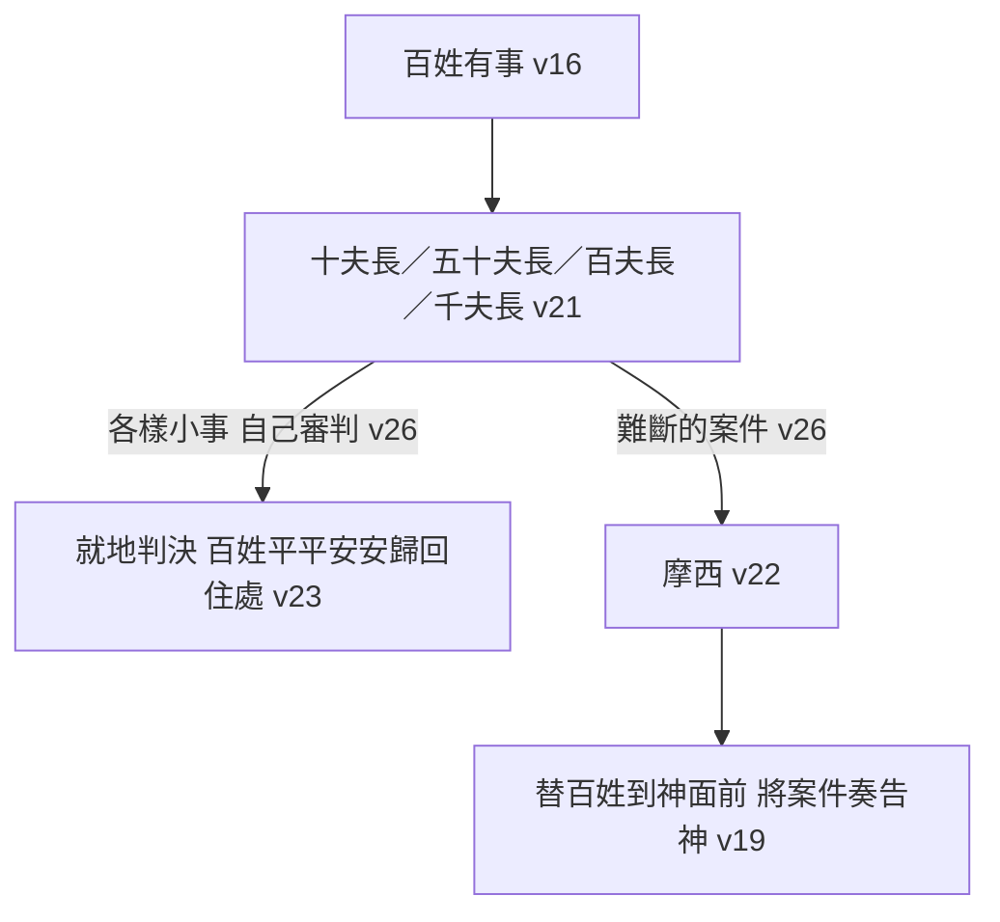

# 出埃及記 第18章

<!-- chapter-navigation:start -->
| [前一章](../02%20出埃及記/第17章.md) | [回目錄](../02%20出埃及記/全書目錄及綱要.md) | [下一章](../02%20出埃及記/第19章.md) |
| :--- | :---: | ---: |
<!-- chapter-navigation:end -->

1. [[摩西]]的岳父，[[米甸祭司]][[葉忒羅]]，聽見神為摩西和神的百姓[[以色列]]所行的一切事，就是[[耶和華]]將以色列從[[埃及]]領出來的事，
2. 便帶著[[摩西]]的妻子[[西坡拉]]，就是摩西從前打發回去的，
3. 又帶著[[西坡拉]]的兩個兒子，一個名叫[[革舜（摩西之子）|革舜]]，因為[[摩西]]說：[[革舜名字的由來|我在外邦作了寄居的]]；
4. 一個名叫[[以利以謝（摩西之子）|以利以謝]]，因為他說：[[以利以謝（摩西之子）|我父親的神幫助了我]]，救我脫離[[法老]]的刀。
5. [[摩西]]的岳父[[葉忒羅]]帶著摩西的妻子和兩個兒子來到[[神的山]]，就是摩西在曠野安營的地方。
6. 他對[[摩西]]說：我是你岳父[[葉忒羅]]，帶著你的妻子和兩個兒子來到你這裡。
7. [[摩西]]迎接他的岳父，[[古代近東岳父禮儀|向他下拜，與他親嘴，彼此問安]]，都進了帳棚。
8. [[摩西]]將[[耶和華]]為[[以色列]]的緣故向[[法老]]和[[埃及]]人所行的一切事，以及路上所遭遇的一切艱難，並耶和華怎樣[[神的拯救|搭救]]他們，都述說與他岳父聽。
9. [[葉忒羅]]因[[耶和華]]待[[以色列]]的一切好處，就是[[神的拯救|拯救]]他們脫離[[埃及]]人的手，便甚歡喜。
10. [[葉忒羅]]說：[[耶和華]]是應當稱頌的；他救了你們脫離[[埃及]]人和[[法老]]的手，將這百姓從埃及人的手下救出來。
11. 我現今在[[埃及]]人向這百姓發狂傲的事上得知，[[耶和華]]比萬神都大。
12. [[摩西]]的岳父[[葉忒羅]]把[[葉忒羅獻祭|燔祭和平安祭]]獻給神。[[亞倫]]和[[以色列的眾長老]]都來了，與摩西的岳父在神面前吃飯。
13. 第二天，[[摩西]]坐著審判百姓，[[曠野審判制度|百姓從早到晚都站在摩西的左右]]。
14. [[摩西]]的岳父看見他向百姓所做的一切事，就說：你向百姓做的是什麼事呢？你為什麼獨自坐著，眾百姓從早到晚都站在你的左右呢？
15. [[摩西]]對岳父說：這是因百姓到我這裡來求問神。
16. 他們有事的時候就到我這裡來，我便在兩造之間[[摩西審判百姓|施行審判]]；我又叫他們知道神的律例和法度。
17. [[摩西]]的岳父說：你這做的不好。
18. 你和這些百姓必都疲憊；因為這事太重，你獨自一人辦理不了。
19. 現在你要聽我的話。我為你出個主意，願神與你同在。你要替百姓到神面前，將案件奏告神；
20. 又要將律例和法度教訓他們，指示他們當行的道，當做的事；
21. 並要從百姓中揀選有才能的人，就是[[敬畏神、誠實、恨不義之財|敬畏神、誠實無妄、恨不義之財]]的人，派他們作千夫長、百夫長、五十夫長、十夫長，管理百姓，
22. 叫他們隨時審判百姓，大事都要呈到你這裡，小事他們自己可以審判。這樣，你就輕省些，他們也可以同當此任。
23. 你若這樣行，神也這樣吩咐你，你就能受得住，這百姓也都平平安安歸回他們的住處。
24. 於是，[[摩西]]聽從他岳父的話，按著他所說的去行。
25. [[摩西]]從[[以色列|以色列人]]中揀選了有才能的人，[[摩西立首領|立他們為百姓的首領]]，作千夫長、百夫長、五十夫長、十夫長。
26. 他們隨時審判百姓，有難斷的案件就呈到[[摩西]]那裡，但各樣小事他們自己審判。
27. 此後，[[摩西]]讓他的岳父去，他就往本地去了。

---

## 本章知識節點

### 人物
- [[摩西]]
- [[葉忒羅]]
- [[西坡拉]]
- [[革舜（摩西之子）]]
- [[以利以謝（摩西之子）]]
- [[亞倫]]
- [[法老]]
- [[以色列的眾長老]]

### 地點
- [[神的山]]
- [[西乃山]]
- [[米甸地]]
- [[埃及]]

### 原文
- [[以色列]]
- [[革舜名字的由來]]

### 神學
- [[耶和華]]
- [[神的拯救]]
- [[敬畏神、誠實、恨不義之財]]

### 事件
- [[葉忒羅來訪]]
- [[葉忒羅獻祭]]
- [[摩西審判百姓]]
- [[葉忒羅建議分層治理]]
- [[摩西立首領]]
- [[葉忒羅返回本地]]

### 背景
- [[米甸祭司]]
- [[古代近東岳父禮儀]]
- [[曠野審判制度]]

### 解經爭議
- [[流珥葉忒羅與何巴的稱謂關係]]
- [[葉忒羅的建議是不是出於神]]
- [[出18：12 的筵席是立約還是感恩]]
- [[基尼說與摩西信仰的來源]]

### 互文
- [[來7：1-3 麥基洗德]]
- [[徒6：1-7 選立執事]]
- [[提前3：1-7 監督資格]]
- [[彼前5：1-4 牧養群羊]]
- [[林前12：18 肢體安排]]

---

## 本章整理

本章從一件家事開始，以一套制度結束。CT 給的綱要是四段：葉忒羅攜摩西妻兒到訪（v1-7）、葉忒羅因神救以色列出埃及而向神稱頌並獻祭（v8-12）、葉忒羅因見摩西獨自審案而建議分層負責（v13-26）、葉忒羅返回他本地（v27）。KC 則指出這一幕的位置：「這次會面標誌著本書第一部分的結束。」

### 一、聽見的人來了（v1-7）

[[葉忒羅]]會聽見，在當時是理所當然的。《丁道爾聖經註釋》說：「西奈半島每個牧民，這時都應該聽到以色列脫離埃及，和亞瑪力發生衝突的消息了。米甸人若是經常在西奈半島放牧，以色列可能已經來到米甸邊境。亞瑪力必然和米甸接壤。」但他為什麼在這個時候來，各家的答案不只一個。《中文聖經註釋》的讀法最不留情：「以色列人在殺死亞瑪力王和他的百姓後，另一個遊牧民族的祭司……聞知後，必然感到恐慌了……表面的理由是送摩西的家小回來，讓他們家人團聚，實質上他是想藉此有機會和以色列人立約，用以聯盟和互不侵犯。」KC 讀出的則是家人重聚的溫度：「在神的山那場會面十分溫暖。」

[[西坡拉]]為什麼不在摩西身邊，經文只給了半句話。CT 列出解經家的三種推測，核心是出4:24-26 割禮事件之後，摩西意識到「帶妻兒同行回埃及地，恐會節外生枝」；《中文聖經註釋》記猶太傳統的說法，是[[亞倫]]在出4:27-28 相見後「既知到埃及去的任務危險……就說服了摩西打發其妻子和兒子回去」。《丁道爾聖經註釋》先排除一個誤讀——「打發，這動詞在後期希伯來文有『離婚』的意思，但在此似乎是指一件聖經沒有記載的事件」——並指出加插這句話是必要的，因為出4:20 明明說他們已跟著摩西回埃及去了。

兩個兒子的名字合起來就是摩西前半生。[[革舜名字的由來|革舜]]記的是寄居，CT 給了兩種相反的讀法：一是「指逃離埃及而在米甸作了寄居的，藉給長子命名來表達他的孤獨和恥辱感」，一是「指在那裡（即埃及）作了客旅，表明他對埃及不再有眷戀」。[[以利以謝（摩西之子）|以利以謝]]記的是幫助，《中文聖經註釋》把複合字拆開：「以利原義是『我的神』。以謝為『我的幫助』。」《丁道爾聖經註釋》把兩個名字並讀：「他的名字（『我神是幫助』）和革舜所代表的絕望相比，可以看出摩西信心重燃。」而它在同一處指出一個容易漏看的細節，並把它當成年代的證據：「即使是摩西兩個兒子的名字，也沒有耶和華聖名的成分。」

v7 的一連串動作不是點綴。[[古代近東岳父禮儀|下拜、親嘴、問安]]——《舊約聖經背景註釋》指出「下拜表示尊敬，是向社會地位較高之人問安的方式。親吻面頰表示友誼。本節是兩者一併做出來的惟一案例」。《中文聖經註釋》另記下一個抄本上的爭議：撒瑪利亞抄本因為不能接受以色列的領袖向外邦祭司下拜，把主詞改成「葉特羅就向摩西下拜」——它判定這個更改「是不合理的」。

### 二、見證、稱頌、獻祭（v8-12）

摩西述說的內容，CT 逐項列了出來：埃及追兵、瑪拉苦水、以琳水泉、降鵪鶉和嗎哪、擊打磐石出水、打敗亞瑪力人。《中文聖經註釋》給了一句很好的評語：「這是一篇『神話』般的故事，卻是鐵一般的事實。所以，怪不得葉特羅在以下會有非常震動的反應。」而 v9「便甚歡喜」這個詞在抄本上其實有問題——同一份註釋說「原文歡喜這字，在經文抄本和印刷本上都顯明是無法讀得出來的字」，並主張按七十士譯本的讀法還原成「震驚」或「大大驚奇」；《串珠聖經註釋》折衷處理：「歡喜」「包含訝異和震驚的意思」。

v11「[[耶和華]]比萬神都大」到底算不算一神信仰，四家的分寸各不相同。

| 立場 | 出處 | 說法 |
| --- | --- | --- |
| 只是修辭，並非泛神論 | CT | 「這是一種修辭法，表示萬神之中只有一位真神，祂的能力超乎萬神」 |
| 不是一神信仰，卻是一神崇拜 | 《丁道爾聖經註釋》 | 「雖然未算一神信仰，一神崇拜（諸神之中只崇拜一神）卻是理所當然的結果」 |
| 只是多神信仰下的渲染讚美 | 《舊約聖經背景註釋》 | 「在神明顯然是彰顯作為或能力時，他們可以用極度渲染的話來讚美」 |
| 是信仰上的承認 | 《串珠聖經註釋》 | 「『我現今……得知』是常用語句，表達信仰上的承認，即表示他對神有新的體驗」 |

v12 是全章最有爭議的一節。[[葉忒羅獻祭|由一位米甸祭司主持獻祭]]，而[[亞倫]]與[[以色列的眾長老]]同席。這頓飯是感恩還是立約，見 [[出18：12 的筵席是立約還是感恩]]；而由外邦祭司主祭這件事又被拿去支持另一個更大的主張，見 [[基尼說與摩西信仰的來源]]。至於[[米甸祭司]]這個稱號本身代表什麼，CT 列四個理由主張葉忒羅事奉的是獨一真神，《舊約聖經背景註釋》卻說「祭司未必只限於事奉一位神祇，因此葉忒羅承認耶和華為大，並不表示他是耶和華的祭司或信徒」——這是本章第一組正面對立。丁良才則把這一幕接到創世記：v12「顯明以色列人承認葉忒羅是侍奉真神的祭司，正如亞伯蘭承認[[來7：1-3 麥基洗德|麥基洗德]]屬神的祭司」，但他同時記下後來的轉折——「後來的米甸人也拜了邪神」。

### 三、從早到晚的那一天（v13-16）

[[摩西審判百姓|摩西坐著，百姓站著]]——《丁道爾聖經註釋》指出這兩個動詞本身就是術語：「坐……站，是閃族律法的術語，分別指『法官』和『當事人』。」CT 把場面補齊：「都站在摩西的左右」是說「各別案件的兩造按次序上前，站在摩西座位前方的左右兩邊」。

摩西在做的其實不只一件事。CT 把「求問神」的程序寫出來：先由百姓陳述案件，次由摩西向神求問，然後再由摩西向百姓傳達神的判定；案情不複雜時則直接援引律例和法度。《中文聖經註釋》從角色的角度看同一件事——v16 前半「表達出摩西在作法官斷案」，後半「又表達摩西在作祭司和先知的工作」——而這正是問題所在：「葉特羅已讓摩西自覺自己角色的混淆，聖俗的不分，不但自陷己苦，百姓也苦不堪言。」

葉忒羅的問句不是責備。《中文聖經註釋》說「這不是指責摩西坐而眾百姓站，乃指出獨自的不當」，並注意到問法本身：「乃是良好教師的一個模範問句，要對方作反省後給予答案。」CT 的講法相同：「也許他為了引起對話而故意這樣問。」

### 四、「你這做的不好」（v17-23）

[[葉忒羅建議分層治理|葉忒羅的建議]]分成四項，CT 列得最清楚：摩西將重大案件奏告神、教導百姓律例和法度、選賢與能分層負責、大事仍呈報摩西。《串珠聖經註釋》指出 v22 才是整段的重心：「摩西衡量做事的標準應是按事情的重要性，而不是視乎事情屬宗教事宜抑民事。」

```mermaid
flowchart TD
  P["百姓有事 v16"] --> T["十夫長／五十夫長／百夫長／千夫長 v21"]
  T -->|"各樣小事 自己審判 v26"| D["就地判決 百姓平平安安歸回住處 v23"]
  T -->|"難斷的案件 v26"| M["摩西 v22"]
  M --> G["替百姓到神面前 將案件奏告神 v19"]
```

揀選的條件，KC 列成四項而 CT 按對象分成三類。

| 條件 | KC 的說明 | CT 的分類 |
| --- | --- | --- |
| 有才能 | 判斷力健全而堅定 | 選賢與能 |
| 敬畏神 | 行事出於對神的敬畏，最終要向祂交帳 | 對神：敬畏 |
| 誠實無妄 | 說真話、可靠 | 對人：公正無私 |
| 恨不義之財（見 [[敬畏神、誠實、恨不義之財]]） | 不受賄 | 對物：不貪不義之財 |

丁良才指出這三樣道德裡有一樣最常被輕看：「第二三種，各國各時的人無不極端贊成，唯第一種，人多以為無關緊要，其實敬畏神，乃是品行中的根源，因此是最要緊的。」《丁道爾聖經註釋》從原文補了一層：「有才能的人，希伯來文原意可能是『有軍人風範』的人，後來引伸作『正直真誠』之義」，並引德萊維：「這個職分注重的是道德上，而非智力上的條件。」新約的同型要求，它舉[[徒6：1-7 選立執事|徒6:3]]與[[提前3：1-7 監督資格|提前3:1-3]]；KC 則把這四項直接應用到[[彼前5：1-4 牧養群羊|教會牧者]]身上，並接到[[林前12：18 肢體安排|神親自分派肢體]]的原則：「要緊的是彼此提醒這一點，免得一切事都只由少數幾個人去做。」

v19「願神與你同在」與 v23「神也這樣吩咐你」兩句，使整個建議懸而未決。《丁道爾聖經註釋》注意到葉忒羅的分寸：「葉忒羅是個有教養的近東人，雖然是明智的意見也不會強人所難，逼女婿接受。」這兩句話後來成了本章最大的爭論點，見 [[葉忒羅的建議是不是出於神]]。

### 五、摩西聽從了（v24-27）

[[摩西立首領]]分兩步：CT 說「第一步，摩西先選賢與能」，「第二步，摩西按所選之人的才能，設立他們擔任各層官員」。《丁道爾聖經註釋》從動詞讀出品格：「『聽從』正是這詞直譯的意思。摩西甚為謙遜（又具智慧），願意從岳父學習」，並下了一句總評：謙卑與盡忠「是摩西其人最主要的品德」。丁良才另提出一個程序上的差別：按申1:13，「摩西讓百姓先選舉這些人，隨後摩西就分派委任所選舉的」。

這套架構的名稱其實是軍事的。[[曠野審判制度|《中文聖經註釋》]]說：「這裏所用的名稱，似乎是軍隊的組織，而不像民事的官長，但這卻正是漂流曠野中以色列人的實境。因為還未進入迦南，不能以地區分派官長，而只能以人數多寡分派職責。」CT 也是這樣讀的：「以色列民是『耶和華的軍隊』，至此，神的百姓正式組成軍；平時用於治理，戰時立刻總動員開赴前線。」《舊約聖經背景註釋》把後果說得更大：「這制度的設立，使摩西在社會甚至政治中所扮演的角色變得正式化，以色列從此不復是純部落的社會，半中央政府開始形成。」它並補上一個具體的埃及對照——法老設立以一位大臣為首的司法系統，那位大臣坐在審判座上，稱為「瑪阿特之先知」。

而《丁道爾聖經註釋》特別提出一點以糾正常見的誤解：「以為本段是將摩西和長老的職責加以區分，一方負責『聖』事，一方負責『民』事，是個誤解；以色列一切司法都是聖事……所以本段所劃分的不是聖俗，而是難易。」——《舊約聖經背景註釋》在這一點上剛好相反，它認為這制度確實把民事案件從宗教層面分了出來。

[[葉忒羅返回本地|葉忒羅走了]]。《中文聖經註釋》推測這是強留不住的結果，而它給的理由正好指出摩西的損失：「他對曠野遊牧的經驗，是剛出埃及不久的以色列人不可或缺的，摩西當然喜歡留他住下。」KC 也注意到這件事：「葉忒羅不是屬這百姓的，他也不與百姓同行。」

### 六、三個名字與一個外邦人

摩西的岳父在舊約裡有三個名字，CT 的分派是：流珥是本名，葉忒羅可能是他擔任祭司時的職稱，何巴可能是指摩西的內兄。CT 並從 v27 反推：摩西讓岳父一個人離去，卻請求何巴同往迦南（民10:29-32），「由此可見，葉忒羅和何巴並非同一人」。各家的分歧見 [[流珥葉忒羅與何巴的稱謂關係]]。

而本章真正的重量在於：這個人不是[[以色列]]人。他來自[[米甸地]]，卻在[[神的山]]下主持了獻祭，與[[亞倫]]和眾長老同席，並且教導摩西怎樣治理[[神的拯救|神所拯救]]的百姓。KC 指出許多解經者在這一幕裡看見預表——基督（摩西）在千年國度之初，與列邦（葉忒羅）和以色列（亞倫與眾長老）同享的喜樂。CT 從葉忒羅的反應引出彼得的話作結：「我真看出神是不偏待人。原來各國中，那敬畏主、行義的人都為主所悅納。」下一章，以色列就要在同一座山下領受律法。

**參考資料**
https://www.ccbiblestudy.org/Old%20Testament/02Exo/02CT18.htm
https://www.ccbiblestudy.org/Old%20Testament/02Exo/02GT18.htm
https://www.kingcomments.com/en/bible-studies/Exo/18
https://biblehub.com/study/exodus/18.htm

<!-- appendix-links:start -->
## 附錄

### 相關地圖
- [[appendix/fhl_maps/maps/018|〈出圖一〉摩西的早年]]
- [[appendix/fhl_maps/maps/019|〈出圖二〉以色列人出埃及到西乃山]]
- [[appendix/fhl_maps/maps/024|〈民圖五〉出埃及和進迦南的旅程]]
<!-- appendix-links:end -->

<!-- chapter-navigation:start -->
| [前一章](../02%20出埃及記/第17章.md) | [回目錄](../02%20出埃及記/全書目錄及綱要.md) | [下一章](../02%20出埃及記/第19章.md) |
| :--- | :---: | ---: |
<!-- chapter-navigation:end -->
