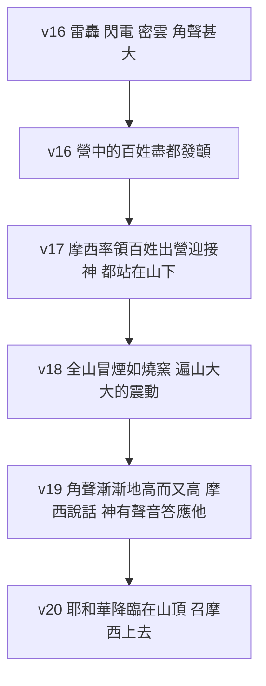

# 出埃及記 第19章

<!-- chapter-navigation:start -->
| [前一章](第18章.md) | [回目錄](全書目錄及綱要.md) | [下一章](第20章.md) |
| :--- | :---: | ---: |
<!-- chapter-navigation:end -->

1. [[以色列|以色列人]]出[[埃及]]地以後，滿了三個月的那一天，就來到[[西乃的曠野]]。
2. 他們離了[[利非訂]]，來到[[西乃的曠野]]，就在那裡的山下安營。
3. [[摩西]]到神那裡，[[耶和華]]從山上呼喚他說：你要這樣告訴雅各家，曉諭[[以色列|以色列人]]說：
4. 我向[[埃及]]人所行的事，你們都看見了，且看見我[[如鷹背在翅膀上|如鷹將你們背在翅膀上]]，帶來歸我。
5. 如今你們若實在聽從我的話，[[西乃之約|遵守我的約]]，就要在萬民中作[[屬我的子民]]，因為全地都是我的。
6. 你們要歸我作[[祭司的國度]]，為[[聖潔的國民]]。這些話你要告訴[[以色列|以色列人]]。
7. [[摩西]]去召了[[以色列的眾長老|民間的長老]]來，將[[耶和華]]所吩咐他的話都在他們面前陳明。
8. 百姓都同聲回答說：凡[[耶和華]]所說的，我們都要遵行。[[摩西]]就將百姓的話回覆耶和華。
9. [[耶和華]]對[[摩西]]說：我要在[[密雲]]中臨到你那裡，叫百姓在我與你說話的時候可以聽見，也可以永遠信你了。於是，摩西將百姓的話奏告耶和華。
10. [[耶和華]]又對[[摩西]]說：你往百姓那裡去，叫他們今天明天[[自潔]]，又叫他們洗衣服。
11. 到第三天要預備好了，因為第三天[[耶和華]]要在眾百姓眼前[[神的降臨|降臨]]在[[西乃山]]上。
12. 你要在山的四圍給百姓定[[山的界限|界限]]，說：你們當謹慎，不可上山去，也不可摸[[山的界限|山的邊界]]；凡摸這山的，必要治死他。
13. 不可用手摸他，必用石頭打死，或用箭射透；無論是人是牲畜，都不得活。到[[角聲]]拖長的時候，他們才可到山根來。
14. [[摩西]]下山往百姓那裡去，叫他們[[自潔]]，他們就洗衣服。
15. 他對百姓說：到第三天要預備好了。[[自潔|不可親近女人]]。
16. 到了第三天早晨，在山上有雷轟、閃電，和[[密雲]]，並且[[角聲]]甚大，營中的百姓盡都發顫。
17. [[摩西]]率領百姓出營迎接神，都站在山下。
18. [[西乃山|西乃全山]]冒煙，因為[[耶和華]][[神在火中降臨|在火中降於山上]]。山的煙氣上騰，如燒窯一般，遍山大大的震動。
19. [[角聲]]漸漸地高而又高，[[摩西]]就說話，神有聲音答應他。
20. [[神的降臨|耶和華降臨]]在[[西乃山]]頂上，耶和華召[[摩西]]上山頂，摩西就上去。
21. [[耶和華]]對[[摩西]]說：你下去囑咐百姓，[[不可親近|不可闖過來]]到我面前觀看，恐怕他們有多人死亡；
22. 又叫親近我的祭司[[自潔]]，恐怕我忽然出來擊殺他們。
23. [[摩西]]對[[耶和華]]說：百姓不能上[[西乃山]]，因為你已經囑咐我們說：要在山的四圍定[[山的界限|界限]]，叫山成聖。
24. [[耶和華]]對他說：下去吧，你要和[[亞倫]]一同上來；只是祭司和百姓[[不可親近|不可闖過來]]上到我面前，恐怕我忽然出來擊殺他們。
25. 於是[[摩西]]下到百姓那裡告訴他們。

---

## 本章知識節點

### 人物
- [[摩西]]
- [[亞倫]]
- [[以色列的眾長老]]

### 地點
- [[西乃山]]
- [[西乃的曠野]]
- [[神的山]]
- [[利非訂]]
- [[埃及]]

### 原文
- [[以色列]]

### 神學
- [[耶和華]]
- [[西乃之約]]
- [[如鷹背在翅膀上]]
- [[屬我的子民]]
- [[祭司的國度]]
- [[聖潔的國民]]
- [[自潔]]
- [[神的聖潔]]
- [[山的界限]]
- [[不可親近]]
- [[神的降臨]]
- [[密雲]]
- [[角聲]]
- [[神在火中降臨]]

### 事件
- [[以色列到達西乃山]]
- [[摩西上山見神]]
- [[神降臨西乃山]]

### 背景
- [[西乃山的地理]]
- [[五旬節與律法頒布]]
- [[宗主條約]]

### 解經爭議
- [[西乃山是不是活火山]]
- [[如鷹背在翅膀上是鷹還是兀鷲]]
- [[出19 的來源批判與擬人法之爭]]

### 互文
- [[來12：18-24 西乃山與錫安山]]
- [[彼前2：9 君尊的祭司]]
- [[啟1：6 國民與祭司]]
- [[申32：11-12 如鷹攪動巢窩]]
- [[林後3：18 看見主的榮光]]
- [[出19：8|出19：8 百姓的第一次應許]]
- [[出19：12-13|出19：12-13 山的界限與親近的等級]]

---

## 本章整理

CT 給本章的標題是「頒布律法的背景」，四段：以色列人來到西乃山下（v1-2）、神透過摩西曉諭以色列人要與他們立約（v3-8）、吩咐百姓預備好自己（v9-15）、神降臨西乃山（v16-25）。KC 指出這一章開啟的是一整段：「從出19:1 到民10:10 所記述的一切事件，都發生在他們如今所到之處」，而他們在此停留略少於一年。

### 一、第三個月的那一天（v1-2）

[[以色列到達西乃山|抵達的日期]]在來源之間並不一致。CT 說「滿了三個月」應當譯作「第三個月」，並推算他們是在猶太曆三月初一到達；GT《丁道爾聖經註釋》譯作「在第三個新月」，理由是「鑑於下半節開首『當日』兩字，這譯法似乎比直譯意思模糊的『三個月』為佳」；但 GT《中文聖經註釋》讀出的是另一個日子：「滿了三個月，是表明這是出埃及地以後的第四個月十五日。」BH 給的是公曆對照：第三個月即西彎月，相當於五月下旬或六月初。日期之所以要緊，是因為[[五旬節與律法頒布|猶太傳統認為律法是在五旬節頒布的]]——丁良才把這五十天逐日排了出來，從亞筆月十五日出埃及，到西彎月初六神傳下律法，剛好五十日。

[[西乃的曠野|「曠野」這個字容易誤導]]。GT《丁道爾聖經註釋》提醒：「慣常譯作『曠野』的字眼並不是指沙漠，而是無人煙的牧原。」至於安營的確切地點，GT《啟導本聖經腳註》說山腳「有一大平原，面積約10平方公里」；GT《舊約聖經背景註釋》指出傳統穆薩山北邊的拉哈平原「占地約四百畝」，「惟一問題是水源不足」；GT《聖經精讀本》另提出東南約五公里的示巴耶平原，理由是它同時滿足兩個條件：能容納兩百多萬人住一年多，而且「各個角度都可以看到山頂」。

[[西乃山|這座山]]究竟在哪裡，是本章最大的一個懸而未決。GT《舊約聖經背景註釋》說「學者提出的不同地點超過了十二個之多」。

| 方位 | 候選 | 主要理由 | 主張者 |
| --- | --- | --- | --- |
| 半島南部（傳統） | 穆薩山、塞巴珥山、卡塔林納山 | 主後四世紀已有傳統支持；山峰巍然獨立 | 《丁道爾聖經註釋》《舊約聖經背景註釋》 |
| 半島北部 | 哈拉爾山、加低斯附近 | 磐石出水、鵪鶉、葉忒羅的意見都在加低斯一帶發生 | 《中文聖經註釋》 |
| 亞喀巴灣以東 | 特布克附近 | 顯現的描寫顯示這山必是活火山；且應在米甸心臟地帶 | 挪士 |

GT《丁道爾聖經註釋》給反對後兩說最有力的理由，而它是行程表上的：「這看法使得出埃及記和民數記中的路程表，變得毫無意義……申命記一章2節亦明言從何烈山到加低斯有十一日的路程。」但它同時加了一句限制：「神學要點並沒有一個是和鑑定的準確性有關的。後世以色列人可能也不知道確實地點。」詳見 [[西乃山的地理]]。

### 二、鷹的翅膀與三重身分（v3-6）

[[摩西上山見神|摩西一安營就上山]]。CT 注意到雙方的急切：「摩西安營後就立刻上山，神也立刻從山上呼喚他，兩下似乎迫不及待地想要相見。」GT《中文聖經註釋》補上一層摩西自己不知道的事：「摩西熟悉這山，情切想向神交代他使命的完成，卻不知道這乃是他新使命的開端。」而 v3 的雙重稱呼不是修辭：同一份註釋指出「這種對以色列人的稱呼，是符合古代君王對寵愛臣民官式的稱呼」；KC 讀出的則是神的眼光：「祂看見他們的軟弱（雅各），也看見祂在他們身上所成就的（以色列）。」

[[如鷹背在翅膀上|「我如鷹將你們背在翅膀上」]]是立約的歷史序言。CT 把它分成三層：生活在高處、能力強大、背負雛鷹。KC 引 [[申32：11-12 如鷹攪動巢窩|申32:11-12]] 作解，並問了一個問題自答：「祂把他們帶到哪裡去？帶到祂自己那裡，帶到祂的面前，就在這山這裡。這是何等的看顧！」不過這隻鳥是什麼、這個動作是否真的存在，GT《舊約聖經背景註釋》有不同意見，見 [[如鷹背在翅膀上是鷹還是兀鷲]]。

v5-6 給了三個名分，[[西乃之約]] 的核心就在這裡。

| 身分 | 原文的分量 | 出處 |
| --- | --- | --- |
| [[屬我的子民]] | 「君王私有的『特殊珍寶』」；同一字在代上29:3譯作「我自己積蓄的」 | 《丁道爾聖經註釋》、CT |
| [[祭司的國度]] | 「這句話舊約沒再出現過」；重點不在王國而在「以色列有普世祭司的身分」 | 《丁道爾聖經註釋》 |
| [[聖潔的國民]] | 「聖」字最初「無疑只有『奉獻』給神的意思，在道德上並沒有什麼獨特的含義」 | 《丁道爾聖經註釋》 |

這三個名分是有條件的。GT《丁道爾聖經註釋》作了一個要緊的分辨：「『條件』只和『享受盟約』有關，因為神的盟約是無條件的賜予。」KC 說法相同：「祂不能把自己與人自己的意思相連。」而整段的形式借自當時的外交文書——GT《啟導本聖經腳註》指出「此約的文字和形式很象宗主與屬國訂立的條約」，GT《舊約聖經背景註釋》更找到具體的平行：赫人宗主在烏加列文獻中稱屬國之王為「珍貴財產」。但借形式不等於借內容，見 [[宗主條約]]。

### 三、「凡耶和華所說的，我們都要遵行」（v7-8）

摩西沒有直接對全會眾說話。GT《中文聖經註釋》把這條往返的路徑寫了出來：「摩西召了民間的長老，將一切的話和一切的規定，向他們講說。長老就轉述給百姓聽。百姓的回應再由長老轉述給摩西。」GT《舊約聖經背景註釋》指出[[以色列的眾長老|長老]]在此的正式身分是「代表百姓接受盟約的安排」。

百姓的回答是本章的轉折。KC 說：「他們的回答卻見證出他們對自己能力的高估。這顯出在過去這幾個月裡，他們還沒有認識自己悖逆的心。主卻知道。」丁良才注意到他們是在還不知道條件的情況下答應的；CT 的評語最重：「他們的答覆是誠摯的，然而卻是愚昧且瞎眼的。」GT《丁道爾聖經註釋》則替他們說了一句公道話：「說以色列滿口應承顯出人類典型的幼稚性格，並沒有不公之處……西門彼得也同樣矢口否認他會有不認主的可能。」

而 KC 指出這句應允之後，全書的語氣就變了：「本該成為與神相會之節期慶典的，卻成了與雷轟、閃電、驚惶、懼怕相連的事件。神與百姓之間有了距離。」

### 四、自潔三天與山的界限（v9-15）

[[密雲]]的用意有兩層。丁良才說：「神顯示威嚴，有兩層要意：（一）使百姓知道祂是何等可畏的；（二）使百姓十分信服摩西。」GT《中文聖經註釋》說得更直接——這是要確立摩西「在領受律法上的『中保』地位」。GT《丁道爾聖經註釋》另提出一個很具體的可能：「這烏雲亦可能是雷雨雲，若然，則聽見二字便可照字面解釋，形容他們所聽到的雷聲。」

[[自潔]]包括洗衣服與禁慾。CT 給洗衣服的理由很實際：「古人要朝見神時，需更換乾淨的衣裳，由於窮人沒有兩套外出的衣服可供更換，所以命令眾人洗衣服。」GT《中文聖經註釋》指出這個習慣比律法更早（創35:2）；GT《啟導本聖經腳註》講明 v15 的性質：「禁止男人與女子好合，不是因為好合為罪，乃是在禮儀上不潔，不適擔任聖職。」KC 把動機上的差別點了出來，這一句是全章最貼近讀者的：「以色列的行動出於怕受報應，我們卻可以出於對父的愛而行動。」

[[山的界限]]這一段的重點在「不可用手摸他」。GT《中文聖經註釋》解釋得最直白：「處死犯禁忌的人，不能用手摸、拳打、腳踼或刀殺，因為怕禁忌傳上人身，正如惹鬼上身一樣。所以要從遠處用石頭打死或用箭射透。」GT《丁道爾聖經註釋》從這裡推出一個習俗上的成因：這個概念加上以色列地到處是石頭，「可能是以色列罪犯通常用石頭處死的原因」。而山的聖潔只是暫時的——同一份註釋說：「山本身沒有什麼聖潔的本質，只是因神降臨而變為聖潔。」

### 五、第三天早晨（v16-20）

[[神降臨西乃山|這一幕]]的景象是不是自然現象，各家不一致。GT《串珠聖經註釋》把 v16 讀成「大風暴來臨的表徵」，卻說 v18「現象有如火山爆發，與16節所描述的不同」；GT《丁道爾聖經註釋》主張整段是「一幅描述大雷暴的『印象派』圖畫」；GT《中文聖經註釋》則說「我們相信這是神降臨的特殊景象和聲勢，而不是自然的現象」。至於火山說本身，CT 給了一句很短的反駁：「有解經家說西乃山曾經是活火山，但火山爆發時會燒毀一切」——而 [[神在火中降臨|荊棘被火燒著卻沒有燒毀]] 正是它的對照。完整的交鋒見 [[西乃山是不是活火山]]。

[[角聲]]在本章有兩個相反的作用：v13 的拖長角聲是解除禁令的信號，v16 的巨大角聲卻使百姓發顫。GT《舊約聖經背景註釋》描述了這樂器的限制與製法：它「能夠吹奏好幾個不同的音調，但卻不能奏出旋律」，是「把羊角在熱水中浸軟，然後扭曲壓扁造成的」。v19「角聲漸漸地高而又高」一句，GT《中文聖經註釋》說所有中文譯本都沒能譯出原義：「原文直譯是『角聲是在走動，而且極其強大』。意思乃在描寫百姓漸漸走近山邊。」

GT《中文聖經註釋》把 v17 讀成一場禮拜的開場：「神既是無形無象，他們怎樣可以迎接？答案是藉16節的聲音和景象，使眾人共同聚集在一起以禮拜神。」而 [[神的降臨|神在何處]] 這一點，GT《丁道爾聖經註釋》與《中文聖經註釋》正面相反：前者說「以色列從來沒有想像耶和華住在西乃山上，祂不過在此顯現而已」，後者註 v19 卻說「顯出神住在西乃山，摩西就對祂說話了」。

### 六、連祭司也不可（v21-25）

最後一段是摩西與神的一次意見不合。摩西回話說界限早已定好、不必再囑咐，丁良才指出 v24「下去吧」一句「略含責斥摩西的意思，因為他有替神作主的口氣」；KC 說得更簡潔：「摩西以為已經有足夠的防範，但主知道百姓的心，摩西必須去。」而 GT《丁道爾聖經註釋》認為百姓可能的動機並不高尚：「無聊的好奇心已足作為動機，他們未必是深切慕求親近神。」

v22 提到[[不可親近|「親近我的祭司」]]，但祭司制度要到第28-29章才設立。CT 給了兩個可能：「當時還未設立祭司，故本節的話可能是為日後留下規範；但也有可能指摩西為著當前的需要，曾指定一些長老之類的人，擔任獻祭的職責。」GT《丁道爾聖經註釋》最保留，認為所指的可能就是出18:12 在宗教事務上有分的長老。這類時序與重複的難處該怎麼處理，是本章第二個大爭論——GT《中文聖經註釋》用來源批判逐處拆解，GT《丁道爾聖經註釋》則說「這樣做是漠視五經多用擬人法，並且風格簡樸的特質」，見 [[出19 的來源批判與擬人法之爭]]。

v24「你要和[[亞倫]]一同上來」是聖經中第一次記亞倫與摩西同上西乃山。KC 把這兩個人一起讀成基督的圖畫：「摩西是祂的圖畫，作那位代表神向百姓說話的；亞倫是祂的圖畫，作那位代表百姓到神面前的。」而全章的最後一節收得極突兀，GT《丁道爾聖經註釋》注意到了：「摩西所說的話已經佚失，除非第二十章就是他說話的內容。」

[[神的聖潔|這一整章的距離感]]，丁良才把它與錫安山排成五組對照：兩山都是以色列國勢與宗教的樞紐；西乃山作舊約的標記，錫安山作新約的標記；神暫時降臨在西乃山，卻永遠住在錫安山；在西乃山上神大顯威嚴，在錫安山上神卻大施恩典；律法是從西乃山傳的，救恩是從錫安山降的。這正是 [[來12：18-24 西乃山與錫安山|希伯來書12章]] 所作的事。KC 把新約這一面的結論放在最後：「對我們這些神的兒女來說，親近祂不再是可怕的事。神的榮耀不再叫人懼怕，因為我們在耶穌基督的面上看見了它」（[[林後3：18 看見主的榮光|林後3:18]]）——而 v5-6 給[[以色列]]的那三個名分，[[彼前2：9 君尊的祭司|彼得]]與[[啟1：6 國民與祭司|約翰]]都原封不動地用在教會身上。

**參考資料**
https://www.ccbiblestudy.org/Old%20Testament/02Exo/02CT19.htm
https://www.ccbiblestudy.org/Old%20Testament/02Exo/02GT19.htm
https://www.kingcomments.com/en/bible-studies/Exo/19
https://biblehub.com/study/exodus/19.htm

<!-- chapter-navigation:start -->
| [前一章](第18章.md) | [回目錄](全書目錄及綱要.md) | [下一章](第20章.md) |
| :--- | :---: | ---: |
<!-- chapter-navigation:end -->
