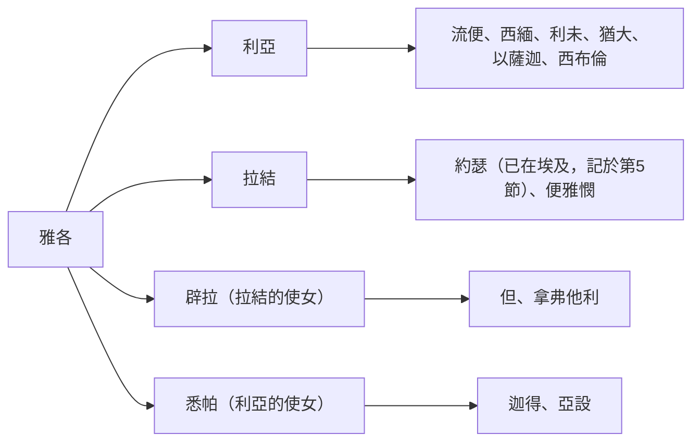
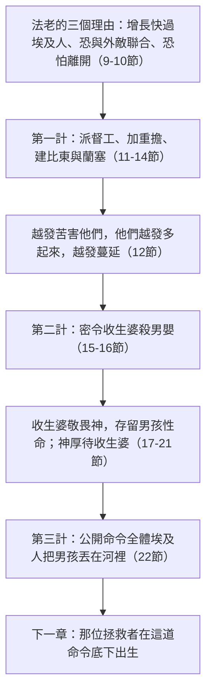

# 出埃及記 第1章

<!-- chapter-navigation:start -->
|  | [回目錄](../02%20出埃及記/全書目錄及綱要.md) | [下一章](../02%20出埃及記/第2章.md) |
| :--- | :---: | ---: |
<!-- chapter-navigation:end -->

1. [[以色列]]的眾子，各帶家眷，和[[雅各]]一同來到[[埃及]]。他們的名字記在下面。
2. 有[[流便]]、[[西緬]]、[[利未]]、[[猶大（雅各之子）|猶大]]、
3. [[以薩迦（價值）|以薩迦]]、[[西布倫（同住）|西布倫]]、[[便雅憫]]、
4. [[但（審判）|但]]、[[拿弗他利]]、[[迦得（萬幸）|迦得]]、[[亞設（有福）|亞設]]。
5. 凡從[[雅各家七十人與七十五人|雅各而生的，共有七十人]]。[[約瑟]]已經在[[埃及]]。
6. [[約瑟]]和他的弟兄，並那一代的人，都死了。
7. [[以色列|以色列人]][[生養眾多與治理|生養眾多]]，並且繁茂，極其強盛，滿了那地。
8. 有不認識[[約瑟]]的新王起來，治理[[埃及]]，
9. 對他的百姓說：看哪，這[[以色列]]民比我們還多，又比我們強盛。
10. 來吧，我們不如用巧計待他們，恐怕他們多起來，日後若遇什麼爭戰的事，就連合我們的仇敵攻擊我們，離開這地去了。
11. 於是[[埃及]]人派督工的轄制他們，加重擔苦害他們。他們為[[法老]]建造兩座[[積貨城制度|積貨城]]，就是[[比東]]和[[蘭塞]]。
12. 只是越發苦害他們，他們[[苦害中仍然增長|越發多起來，越發蔓延]]；[[埃及]]人就因[[以色列|以色列人]]愁煩。
13. [[埃及]]人嚴嚴地使[[以色列|以色列人]]做工，
14. 使他們因[[埃及的強迫勞役與製磚|做苦工]]覺得命苦；無論是和泥，是做磚，是做田間各樣的工，在一切的工上都嚴嚴地待他們。
15. 有[[希伯來人（族群稱呼）|希伯來]]的兩個[[古代收生婆|收生婆]]，一名[[施弗拉]]，一名[[普阿]]；[[埃及]]王對他們說：
16. 你們為[[希伯來人（族群稱呼）|希伯來]]婦人收生，看他們臨盆的時候，若是男孩，就把他殺了；若是女孩，就留他存活。
17. 但是收生婆[[敬畏神]]，[[順服神勝過君王命令|不照埃及王的吩咐行]]，竟[[神保守救贖計畫中的生命|存留男孩的性命]]。
18. [[埃及]]王召了收生婆來，說：你們為什麼做這事，存留男孩的性命呢？
19. 收生婆對[[法老]]說：因為[[希伯來人（族群稱呼）|希伯來]]婦人與[[埃及]]婦人不同；希伯來婦人本是健壯的（原文作活潑的），[[收生婆的回話是否說謊|收生婆還沒有到，他們已經生產了]]。
20. 神厚待收生婆。[[以色列|以色列人]]多起來，極其強盛。
21. 收生婆因為[[敬畏神]]，神便叫他們成立家室。
22. [[法老與希律殺害男嬰的對照|法老吩咐他的眾民]]說：[[以色列|以色列人]]所生的男孩，你們都要丟在[[「河」是否專指尼羅河|河裡]]；一切的女孩，你們要存留他的性命。

---

## 本章知識節點

### 人物
- [[施弗拉]]
- [[普阿]]
- [[法老]]

### 地點
- [[比東]]
- [[蘭塞]]
- [[尼羅河]]
- [[歌珊地]]

### 歷史
- [[積貨城制度]]
- [[埃及的強迫勞役與製磚]]
- [[許克所斯人（Hyksos）]]

### 文化
- [[希伯來人（族群稱呼）]]
- [[古代收生婆]]

### 神學
- [[苦害中仍然增長]]
- [[敬畏神]]
- [[順服神勝過君王命令]]
- [[神保守救贖計畫中的生命]]
- [[法老預表撒但]]
- [[十二支派起源]]

### 背景
- [[出埃及記書名的由來]]

### 互文
- [[亞伯拉罕後裔寄居受苦的預言]]
- [[法老與希律殺害男嬰的對照]]
- [[啟示錄12章古蛇撒但]]

### 解經爭議
- [[雅各家七十人與七十五人]]
- [[出埃及時期法老的身份]]
- [[「河」是否專指尼羅河]]
- [[收生婆的回話是否說謊]]

---

## 本章整理

> [!note] 這卷書的第一個字是「並且」
> 出埃及記在希伯來原文以「並且，這些是……的名字」（וְאֵלֶּה שְׁמוֹת，H428 搭配 H8034）作為開頭。CT 指出本書開頭的頭一個字是連接詞「並且（and）」，將第1至5節視為創世記46:8-27的綜述，「《創世記》可視為前書，《出埃及記》則可視為後書」。GT《丁道爾聖經註釋》同樣指出：這個連接詞「明證出埃及記不過是創世記故事的延續，和對列祖應許的成就，而不是另一本新書」。
>
> 希伯來文聖經按開頭的第一個詞組，稱全書為《名字》（Shemoth）；中文書名《出埃及記》則取材自希臘文《七十士譯本》的 Exodos（出來），概括了以色列人蒙拯救離開埃及的核心內容。
>
> CT 另指出一組鮮明的對照：創世記結束於約瑟的骸骨停在埃及（創50:26），出埃及記卻開始於以色列人在埃及生養眾多。父祖那一代雖已過去，神的應許卻永不落空。

### 經文大綱

1. 雅各家在埃及延續並增長（1-7節）
2. 新王以苦役壓制以色列人（8-14節）
3. 收生婆敬畏神，拒絕殺害男嬰（15-21節）
4. 法老把殺嬰命令擴大至全民（22節）

### 一、一份名單，一個數目（1-7節）

故事不是重新開始。1至5節重述創46:8-27 的名單，CT 指出排列自有規矩：「2至4節雅各眾子的名字，是按他們母親的位份記的，利亞和拉結之兒子的名字記在先（按著長幼的次序），婢女的兒子列在後（也是按著長幼的次序）」；本段只列十一個名字，因為[[約瑟]]另記在第5節，他所生的以法蓮和瑪拿西歸在[[雅各]]的名下（創48:16）。

這十一個名字，CT 的原文字義與 GT《中文聖經註釋》都逐個給了字源，BH 則多半接著講該支派後來的去向：

| 名字 | 生母 | 名字原義 | 來源另記 |
|---|---|---|---|
| 流便 | 利亞 | 「看哪！我生了一個兒子」 | CT：原是長子，因犯淫亂的罪而失去長子的名分（創35:22；49:3-4）。BH：長子的名分後來歸了約瑟的兒子（代上5:1-2） |
| 西緬 | 利亞 | 「神聽見」 | GT：曾與利未因妹妹受欺而報復殺人（創34:25），故後裔不興旺，並且散居在別支派受同化（創49:5-7）。BH：支派終被猶大吸收，摩西的祝福（申33）沒有提到西緬 |
| 利未 | 利亞 | 「聯合」；或作「這次我丈夫可要戀住我了」 | CT：摩西和亞倫從他而出，後來利未支派被分別出來作祭司事奉神（民3:5-10）。BH：沒有領土產業，卻得散在各地的城邑（民35:1-8），利未祭司職分是基督的預表（來4:14-16） |
| 猶大 | 利亞 | 「讚美」 | CT：主耶穌從他而出（太1:3、16）。BH：支派最顯赫，出了大衛與耶穌，應驗權杖不離猶大（創49:10），地業包括耶路撒冷 |
| 以薩迦 | 利亞 | 「賞報」或「僱價」（隨字根而異） | GT：五經除雅各的祝福（創49:14-15）與後裔名單（創46:13）外，沒有記載他的事跡。BH：地業在耶斯列谷，代上12:32 說以薩迦人通達時務 |
| 西布倫 | 利亞 | 「尊敬」「領袖」或「同住」 | GT：代上4至8章記各支派後裔時甚至沒有列出西布倫的後裔，「大概在編輯歷代志的時候，這個支派已經給其他支派所同化了」。BH：地近加利利海，賽9:1-2 把西布倫地與彌賽亞的降臨相連 |
| 便雅憫 | 拉結 | 「右手的兒子」；以色列人面向東方論方向，右手在南，故也可解「南方的兒子」 | GT：拉結難產，先起名便俄尼（苦難／厄運的兒子），雅各卻叫他便雅憫（創35:16-18）。BH：士20:16 記其族人是左手便利、甩石不差毫髮的勇士；保羅出於這支派（腓3:5） |
| 但 | 辟拉 | 「審判」，延伸為「伸冤」 | BH：支派後遷北部近地中海一帶，這位置使他們易陷偶像崇拜（士18） |
| 拿弗他利 | 辟拉 | 「格鬥者」或「相爭」 | BH：地業在加利利肥沃之區，日後應驗賽9:1-2 大光照在加利利 |
| 迦得 | 悉帕 | 「萬幸」 | GT：這也是一個幸運之神的名字，中文把它繙成「時運」（賽65:11）。BH：地在約但河東，常為戰線前沿，故須是強悍的戰士（代上12:8） |
| 亞設 | 悉帕 | 「有福的」 | BH：地在迦南北岸，盛產橄欖油，正應驗創49:20 |

至於[[雅各家七十人與七十五人|「凡從雅各而生的，共有七十人」]]，六份來源給的算法互不相同：

| 來源 | 七十／七十五是怎麼算的 |
|---|---|
| CT | 原文是「共有七十魂」：從迦南地下埃及的六十六人（創46:26），加上約瑟、他在埃及所生的兩個兒子，並雅各本人（創46:27）。徒7:14 的七十五人，是再加上瑪拿西的一兒一孫和以法蓮的二兒一孫（民26:29、36-37） |
| GT 丁良才《出埃及記註釋》 | 雅各和他的十二個兒子、一個女兒底拿、五十一個孫子、一個孫女西拉，與四個曾孫；其餘的女兒和孫女不在其內（申10:22） |
| GT《丁道爾聖經註釋》 | 「七十」可能是個概略整數，又可能是個有神聖象徵的數字；只要從總數扣除底拿也能準確得到這數目。希臘文譯本在創46 加上以法蓮和瑪拿西的五個兒子，構成徒7:14 的「七十五個人」 |
| GT《串珠聖經註釋》 | 徒7:14 把約瑟的三個孫和兩個曾孫都計算在內（民26:28-37） |
| GT《聖經精讀本》 | 這個「70」與創世記10章從挪亞三子擴展出來的民族數目相同（申32:8），象徵神完全的計畫 |
| BH | 七十在聖經數字中常象徵完全或神聖秩序，申10:22 也用這個數目強調以色列從小家族成為大國 |

第7節接著連用一串動詞，把這個小數目推向另一端。

第7節接著以連續四個動詞鋪陳以色列人的蓬勃繁衍：他們「生養」（פָּרוּ，H6509，多結果子）、「繁茂」（וַיִּשְׁרְצוּ，H8317，滋生繁茂／如群游湧流）、「多起來」（וַיִּרְבּוּ，H7235A，倍增擴展）、「極其強盛」（וַיַּעַצְמוּ，H6105A，強大有力），並且「極其」（בִּמְאֹד מְאֹד，H3966 連用兩次以加強語氣），使地都滿了他們（וַתִּמָּלֵא הָאָרֶץ，H4390 搭配 H776）。

> [!quote] 創世記祝福用語的呼應
> GT《丁道爾聖經註釋》指出，經文刻意重複創世記一章21至22節神起初創造的祝福動詞，將這種繁盛詮釋為神對造物應許的彰顯。GT《中文聖經註釋》把[[生養眾多與治理|生養眾多]]的三個層次分開：「生養眾多」指數量的多，「繁茂」包含質量的蔓延昌盛，「極其強盛」則形容體質的精壯。GT《聖經精讀本》進一步指出：經文連續使用四個增長動詞，體現出「以色列後裔驚人的壯大不是自然性的，而是神根據約所賜的祝福」（創12:2；46:3）。
>
> 增長的幅度，各家算法不一。CT：出埃及時步行的男人約有六十萬（出12:37；民1:46），「短短兩百多年期間，人數增加了一萬倍以上」。GT 丁良才則先把基數放大——除七十人外還有兒媳、孫媳與眾多僕婢，「同著雅各下埃及的人，不下一二千口」——再引統計：「一帶地方的人數，若沒有妨害，每二十五年就能加增一倍」，故二千多人在二百多年間長到二百餘萬「也不為奇」。KC 算的是總數：出埃及時單男丁約六十萬（出12:37；38:26），連婦孺約三百萬人。

「滿了那地」指哪裡，來源也分兩路。GT《中文聖經註釋》與《串珠聖經註釋》都指[[歌珊地|歌珊]]（創47:11）；GT《丁道爾聖經註釋》則說可能是歌珊，「亦有可能是自然的誇飾，指埃及全地」，後者「在統計學上雖然並不正確，卻生動地表達了埃及本土人的感受」。GT《每日研經叢書》講得更絕：「『滿了那地』一語必須理解為指歌珊。沒有絲毫證據證明以色列人與埃及的其他地區有關聯。」

### 二、新王：一次王朝更替（8-10節）

「有不認識約瑟的新王起來」——GT《串珠聖經註釋》先排除最表淺的讀法：「不一定表示新王未曾聽過約瑟這名字，可能指他不欣賞約瑟本人及他的工作和後代。」KC 讀出更深一層：那位使全埃及得活命、為那民族行了那麼多善事的人，竟被全然忘記了（徒7:18）。

多數來源把這個「不認識」放進[[許克所斯人（Hyksos）|一次王朝更替]]。CT：約瑟作宰相時「應是外來的許克索斯人(Hyksos)所建的王朝，後來於主前1550年被埃及本土人推翻，另建朝代」；GT《聖經精讀本》說得更直接——「不認識約瑟」意即新王「有意要否定，有閃族血統並與喜克索斯(Hyksos)王朝有著密切聯繫的約瑟的業績」。

> [!note] 這位法老是誰？經文沒有給名字
> GT《舊約背景註釋》不作判定：「由於埃及史料完全沒有提及以色列人在埃及定居、為奴、出離，這些法老的身分只能依靠記載中模糊的線索去揣測」——一般認為不是第一位許克所斯統治者，就是許克所斯人被驅逐後的第一位埃及本土統治者，兩者「最少有一百年（大約是主前1650年或1550年）」，最多可達兩百年。
>
> 華人註釋各有主張：CT 主雷米西斯第二，並說他的女兒就是摩西的養母；GT《啟導本聖經腳註》並列蘭塞二世（主前1290-1224年）、塞提一世（主前1303-1290年）與亞摩士，並認為亞摩士「此說較可靠」；GT《聖經精讀本》主第十八王朝第三任王圖特摩斯一世（主前1539-1514年）。逐條比較見「出埃及時期法老的身份」。
>
> GT《啟導本聖經腳註》推想經文沉默的理由：「新王是誰，很難確定。也許作者因他苦待過以色列民，不願給他留名。」對照之下，兩個收生婆卻留下了名字。

法老在9至10節說的話，CT 判為刻意誇大：「這以色列民比我們還多」「本句意指人數較多；這是言過其實。埃及人明顯是比以色列人佔優勢」；GT 丁良才同判為「過實的話」，說法老「要令臣僕服從自己的意思，故意誇張以色列人丁的興盛」。CT 把他要控制人口的理由歸為三項：增長的速率快過埃及人、恐怕他們與外敵聯合、恐怕他們離開；GT《聖經精讀本》另補一項地緣理由——以色列人「居住在國家的戰略要地歌珊，所以甚怕他們成為外族侵略的跳板」。

### 三、第一計：苦役、積貨城與磚（11-14節）

這一計不是憑空發明的。GT《舊約背景註釋》把它放回制度裡：「古代世界所從事的龐大建築工程所需的工時極多，故此徭役（強逼勞工）頗為常見。它是稅收形式之一……如果政府野心太大，本地人和戰俘不足應付其工作量之時，徭役的箭頭就會轉而針對無助之人。」GT 丁良才也說「埃及國原有強迫人民服苦役的惡風，當時他們就借這陋規加害於以色列人」，並指出以色列後來自己也走上同一條路——百姓埋怨所羅門（王上5:13，9:15，12:4），約雅敬也行了此等虐政（耶22:13）。

第11節埃及人派「督工的」（שָׂרֵי מִסִּים，H8269 搭配 H4522，服苦役的領班）加重擔苦害他們（苦害：עַנֹּתוֹ，字根 עָנָה H6031B），建造「積貨城」（עָרֵי מִסְכְּנוֹת，H5892B 搭配 H4543）[[比東]]（פִּתֹם，H6619）與[[蘭塞]]（רַעַמְסֵס，H7486H）。兩座城都在尼羅河三角洲東北、靠近以色列人所住的歌珊地。GT 華爾頓《出埃及記背景注釋》給比東的字源與遺址：「比東按考據是埃及語中的比亞頓（Pi(r)~Atum；意即『亞頓神〔Atum〕之地業』）。如今考證為位於開羅東北約六十哩，伊斯梅利亞運河旁的拉塔巴遺址。」同一段並提醒不要把[[積貨城制度|積貨城]]讀窄：「經文指出所建的是積貨城，並不表示這些城市單獨作儲備糧穀之用。積貨城是各區的地理和活動中心，可能也是省會。」GT《舊約背景註釋》記蘭塞即比東以北二十哩的達巴遺址，曾是許克所斯的首都亞華里斯，主前十三世紀由蘭塞二世重建為自己的首都；並記築城的奴工來自多族，「阿皮魯人（'Apiru，主前第二千年紀用這名字來形容離鄉背井的人）是其中之一」。

第13至14節埃及人「嚴嚴地」（בְּפָרֶךְ，H6531，苛刻嚴厲）使以色列人作工，使他們的性命「苦楚」（וַיְמָרְרוּ，字根 מָרַר H4843），在「和泥」（בְּחֹמֶר，H2563A，灰泥／黏土）、「做磚」（וּבִלְבֵנִים，H3843）與田間各樣苦工上受折磨。[[埃及的強迫勞役與製磚|和泥、做磚]]的工序，兩份來源合起來看得很完整：

| 環節 | GT《舊約背景註釋》 | GT 丁良才《出埃及記註釋》 |
|---|---|---|
| 材料 | 小組分工搬運和打散禾稈、搬泥和運水 | 「將土陰濕又加上割碎的草和成泥」 |
| 成形 | 用手或模子塑磚 | 「放在模內壓實，把餘剩的泥刮去」，模內灑乾灰使泥不黏模 |
| 乾燥 | 用日光曝曬數日，乾後運到建築地盤 | 「扣在場上曬乾」；因埃及雨水甚少，磚「不用過火」 |
| 規格 | 建築大屋的磚頭長度超過一呎，寬度是長度的一半，厚度約有六吋 | 為國家所做的磚「往往將法老的名字印在磚上為記號」 |

《舊約背景註釋》還引一部埃及作品作旁證：「古籍一致同意製磚工人做的是骯髒職業。一本名叫《行業的諷刺》（Satire on the Trades）的作品，描述一個無盡泥濘的難受生涯。」丁良才則在第13節記下督工的實況：埃及古碑的圖像「顯明督工的人如何用杖鞭打工人，天雖炎熱，所擔的苦擔雖重，督工的人還是從早到晚，嚴嚴地催逼他們加緊地做工，甚至有多人因力竭僕倒而死」。

「田間各樣的工」不只是農活。GT《聖經精讀本》說它「表示挖管道灌溉農田的重活」，並判定對作為牧民的以色列百姓強制要求這種作業，「不單是勞動上的剝削，更是抹殺民族精神的一種殖民政策」；GT《中文聖經註釋》從另一頭說同一件事——這些工作「與他們的信仰相違背，尤使他們覺得命苦」。

> [!quote] 巧計弄巧成拙
> 第12節記錄了神百姓在壓迫中的奇妙反轉：「越發苦害（יְעַנּוּ，字根 עָנָה H6031B）他們，他們[[苦害中仍然增長|越發多起來（יִרְבֶּה，字根 רָבָה H7235A），越發蔓延（יִפְרֹץ，字根 פָּרַץ H6555，衝破／擴展）]]」，埃及人就因以色列人「愁煩／懼怕」（וַיָּקֻצוּ，字根 קוּץ H6973，感到厭惡與戰兢）。
>
> 對於這項反常的增長，GT 丁良才指出：「這是反常的事，顯明是出於神特別的保護」，並舉使徒行傳的教會為例（徒8:1-8、11:19；腓1:12）。GT《中文聖經註釋》給的是生理層面的解釋：「做苦工使以色列人的身體益發強壯，生養更加眾多，在質在量都加增了威勢和聲勢。」CT 從結果反推：「可見神能廢棄聰明人的聰明」（林前1:19；詩33:10）。
>
> KC 把主詞換掉：法老「智慧」的行動並沒有達到他所期望的效果，「恰恰相反——苦害越重，這民就越發擴張。神在推行祂的計畫，並且是用法老的惡計來推行。有權柄的不是法老，乃是神。」他並指出這正是亞伯拉罕異象中「冒煙的爐」開始應驗（創15:12-21；參申4:20），也就是亞伯拉罕後裔寄居受苦的預言。
>
> 12節下半的埃及人反應，譯法有分歧。GT《每日研經叢書》認為和合本這一句的譯法「似乎不太正確，因為他們要滅絕以色列人或驅逐他們出境是輕而易舉的事」，主張改採新英語本的「覺得討厭」；GT《中文聖經註釋》則說原文直譯是「他們就在以色列人面前感到厭惡」，語氣裡「包含了憎惡痛恨而要設法滅之而後快的情態」。

### 四、第二計：兩個有名字的女人（15-21節）

法老改為直接下手，於是向希伯來[[古代收生婆|收生婆]]（מְיַלְּדֹת，字根 יָלַד H3205）下達密令。CT 指出人數對不上：「那一大片土地上那麼多的人口，僅有兩個收生婆助產，絕對不可能應付需要，故此她們兩位可能是指奉派監督收生婆工作的人」；GT 賈斯樂郝威《聖經難解經文詮釋手冊》從制度解釋——埃及社會的專門職業與同業工會都有領導者，法老是透過她們向整個收生婆群體下令。

經文特別記下兩位收生婆的名字：一位名叫「[[施弗拉]]」（שִׁפְרָה，H8236），另一位名叫「[[普阿]]」（פּוּעָה，H6326）。CT 的原文字義作施弗拉「美麗，佳美，秀麗的」、普阿「光芒四射，光輝，耀目的，芳香的」，BH 則譯為「美麗」或「明亮」與「燦爛」或「芳香」，並說這些名字「或反映她們的品格，或反映她們所受的敬重」。她們是[[希伯來人（族群稱呼）|希伯來人]]還是埃及人，GT 丁良才兩說並列，並記「猶太史家約色夫也說她們是埃及人」；GT《中文聖經註釋》則判定她們是希伯來人，理由是兩個名字「都是閃族語系的名字」。CT 把經文的記名與不記名並讀：==「聖經未記載法老的名字，卻記載這兩位收生婆的名字，可見人所看為卑微的，往往是神所看重的。」==

第16節法老吩咐她們看婦女臨盆坐在「石座／產架」（עַל־הָאָבְנָיִם，H70，字面為雙石盤／轉輪），若是男孩就殺了，若是女孩就讓她存活。CT 的背景註解說明：「原文直譯作『兩塊石頭』或『兩個圓形轉輪』。古代以色列婦女生產之時，蹲在（或跪在）兩塊石頭或兩塊磚頭上面。」KC 在腳註裡補一個字源連結：這個字與耶18:3 陶匠的「輪」（直譯「一對石盤」）是同一個字。GT《舊約背景註釋》並指出收生婆的職責遠不止接生，「她們還是受孕、娠妊、生產、育嬰，這整個過程的顧問」。

第17節「收生婆[[敬畏神]]（וַתִּירֶאןָ ... אֶת־הָאֱלֹהִים，H3372 搭配 H430），[[順服神勝過君王命令|不照埃及王的吩咐行]]，竟[[神保守救贖計畫中的生命|存留男孩的性命]]（וַתְּחַיֶּיןָ，字根 חָיָה H2421）」——GT《中文聖經註釋》說「竟」是一個很強烈的相反詞，「存留」原文是「使之存活」，含有「幫助男孩生存」的具體行動。

> [!quote] [[收生婆的回話是否說謊|收生婆說謊了嗎]]
> CT 最節制：「注意聖經並沒有表明這話是說謊或是事實，也沒有稱許她們的靈巧」，並說神厚待她們「是因為她們敬畏神……而不是因為她們說謊話欺騙法老」。GT 丁良才則直接判：「這話頭一句是真的，下兩句是過實的。」
>
> 第19節收生婆回答希伯來婦人「本是健壯的」（חָיוֹת，H2422，精力旺盛／活潑生機）。GT《中文聖經註釋》從字形給出另一種理解：希伯來文若調整讀音，字義亦可帶有「多產的」意味；而「初胎容易難產，多產以後就很順產」，因此收生婆還未趕到，孩子已經生下。
>
> GT 艾基斯《舊約聖經難題彙編》主張她們用的是「延遲抵達」的策略，那句話在字面上可以成立，只是沒有說出延遲是預先安排的；兩害相權，「她們正確地選了較低程度的惡」。GT 賈斯樂郝威從義務衝突立論：「保護無辜的生命比服從政府的義務更重要。」GT《靈修版聖經註釋》：「神不是因人撒謊而賜福，神賜福是因為她們救了許多無辜嬰孩的生命。」
>
> KC 拒絕這場思辨：「有人推測這些婦人是否可以使用『危難時的謊言』。這種推測是不必要的。經文清楚地說：神厚待收生婆。」他舉喇合為例（來11:31；雅2:25），並警告對自己不了解的處境中信徒的作為下判斷要極其小心。
>
> 經文自己給的理由只有一個，並且說了兩次：「因為她們敬畏神」（17、21節）。第21節「神便叫她們成立家室」（וַיַּעַשׂ לָהֶם בָּתִּים，H6213 搭配 H1004M）原文直譯是「祂給她們建造房屋／家室」，GT《中文聖經註釋》說其含義正如耶路撒冷聖經所譯——「他就賜給他們後裔」；並記古代好些地方做收生婆的多是自己不生育的人，GT《啟導本聖經腳註》同說「接生婦可能多由不育的女人擔任」。

### 五、第三計：河（22節）

第22節法老向全民下達公開殺嬰令（命令：וַיְצַו，字根 צָוָה H6680），吩咐將初生的男孩都丟在「河裡」（הַיְאֹרָה，H2975G，專指[[尼羅河]]），女孩則准許存活（תְּחַיּוּן，H2421）。至於[[「河」是否專指尼羅河|「河」]]，GT《丁道爾聖經註釋》說這個希伯來字「是個外來語。這字源自埃及語，所指的是至重要的河，亦即是尼羅河」；GT《中文聖經註釋》補上判別法：以色列人講「河」特別指幼發拉底，「但當埃及人講河的時候，必然是指尼羅河」，而歌珊地在三角洲一帶，所以這命令也包括[[尼羅河]]的支流在內。

> [!note] 為什麼是這條河？
> KC：「尼羅河象徵屬地、屬世的祝福。埃及一切的祝福都歸於尼羅河。」GT《每日研經叢書》指出尼羅河「是埃及最大神靈之一」，並讀出命令背後的算計：「這可厭的民族，竟敢不敬拜埃及生活與繁榮的根源，這是不容許的；於是，就讓那神靈自己決定他們的生死吧。人們不難找出手段和方法洗脫自己的惡行和兇殺罪而自稱無辜！」GT 丁良才推想兩個緣故：埃及人「以嬰孩為奉獻河神（或鱷魚神）的祭物」，以及「尼羅河中產鱷魚最多。丟下去的嬰孩屍體末經腐爛就被鱷魚吞了」。
>
> BH 讀出同一條河的翻轉：尼羅河是埃及生命的來源，如今成了死亡之地。CT 則記這道命令並未貫徹：「並沒有被普遍遵行，故多年後當摩西率領以色列人出埃及時，仍有六十萬男人」（出12:37）。

KC 與 GT《聖經精讀本》都把這道命令接到伯利恆：[[法老與希律殺害男嬰的對照|法老的命令令人想起希律殺害嬰孩]]（太2:16），而兩者背後是同一位——KC 引[[啟示錄12章古蛇撒但|那條大龍]]：「龍就站在那將要生產的婦人面前，等她生產之後，要吞吃她的孩子」（啟12:4b）。CT 沒有提希律，而是把男孩女孩讀成兩種信徒：「撒但想盡辦法要除滅靈性剛強的信徒（男孩所象徵的，參啟12:4-5）；至於靈性軟弱的信徒（女孩所象徵的），則以迷惑的手段來對付」，並在靈意註解裡直指[[法老預表撒但|埃及王法老預表這世界的王撒但]]（約12:31；弗2:2）；KC 用的是同一組稱呼：撒但是「這世界的神」（林後4:4）、「這世界的王」（約12:31）。

### 三計逐級升高，三次都落空

GT《聖經精讀本》把這三步排在一起：「①利用苦力抑制他們的生育；②命令接生婆殺害新生男孩；③全國性的公開滅絕新生男兒的政策」，並下一句判語——「即使法老為了使以色列人永久性地成為奴隸而採取了如此毒辣的手段，但神的計畫卻在這種政策當中順利地進行著。」

### 一家寄居者與一個帝國

GT《靈修版聖經註釋》把兩個群體的差距列得很清楚：希伯來人敬拜獨一真神，埃及人則拜許多假神；希伯來人是遊牧民族，埃及人卻有根深蒂固的文化；希伯來人以牧羊為業，埃及人卻是定居的、善於建築。以色列人住在埃及北部的歌珊，遠離埃及的文化中心，甚少與埃及人交往。GT《每日研經叢書》從埃及那一邊看同一件事：埃及統治者絕不願見到同化，「因為他們視埃及為出身不同的人種」（創43:32）。

### 關鍵神學點

1. 應許沒有死亡：父祖那一代都死了（6節），神的祝福卻在第7節爆發——創世記記述一家如何蒙保全，出埃及記記述這家如何成為約民並蒙拯救。
2. 壓迫升級三次，經文兩次（12、20節）反記「他們越發多起來」；GT《聖經精讀本》把在埃及的四百年讀成「神把雅各家族養育成以色列的時間，同時也是神訓練立約百姓的時間」。
3. 經文稱讚收生婆的核心不是話術，而是[[敬畏神]]並存留男孩的性命；CT 把判準寫成一句：「當人的吩咐違背神的心意時，順從神，不順從人，是應當的」（徒5:29）。
4. 法老的名字與出埃及的年代，各家說法不一（見「出埃及時期法老的身份」）；經文記下的是兩個收生婆的名字。

**參考資料**
https://biblehub.com/study/exodus/1.htm
https://www.kingcomments.com/en/bible-studies/Exo/1
https://www.ccbiblestudy.org/Old%20Testament/02Exo/02CT01.htm
https://www.ccbiblestudy.org/Old%20Testament/02Exo/02GT01.htm

<!-- appendix-links:start -->
## 附錄

### 相關地圖
- [[appendix/fhl_maps/maps/018|〈出圖一〉摩西的早年]]
<!-- appendix-links:end -->

<!-- chapter-navigation:start -->
|  | [回目錄](../02%20出埃及記/全書目錄及綱要.md) | [下一章](../02%20出埃及記/第2章.md) |
| :--- | :---: | ---: |
<!-- chapter-navigation:end -->
