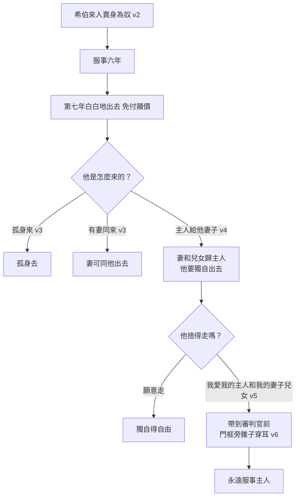
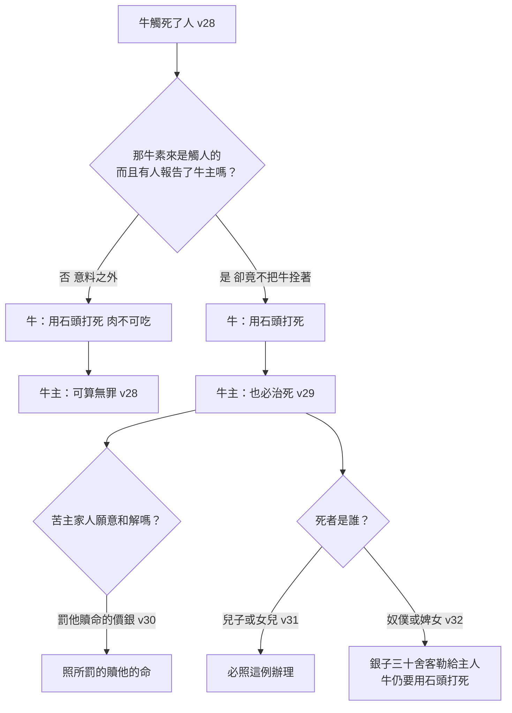

# 出埃及記 第21章

1. 你在百姓面前所要立的[[典章]]是這樣：
2. 你若買[[希伯來人]][[奴僕（ebed）|作奴僕]]，他必服事你六年；第七年[[自由（chophshi）|他可以自由]]，白白地出去。
3. 他若孤身來就可以孤身去；他若有妻，他的妻就可以同他出去。
4. 他主人若給他妻子，妻子給他生了兒子或女兒，妻子和兒女要歸主人，他要獨自出去。
5. 倘或[[奴僕（ebed）|奴僕]]明說：我愛我的主人和我的妻子兒女，不願意[[自由（chophshi）|自由]]出去。
6. 他的主人就要帶他到[[審判官（elohim）|審判官]]（審判官或作：神；下同）那裡，又要帶他到門前，[[穿耳的儀式|靠近門框]]，[[錐子穿耳|用錐子穿他的耳朵]]，他就[[永遠服事的奴僕|永遠服事主人]]。
7. 人若賣女兒作婢女，婢女不可像男僕那樣出去。
8. 主人選定他歸自己，若不喜歡他，就要許他贖身；主人既然用詭詐待他，就沒有權柄賣給外邦人。
9. 主人若選定他給自己的兒子，就當待他如同女兒。
10. 若另娶一個，那女子的吃食、衣服，並[[好合的事]]，仍不可減少。
11. 若不向他行這三樣，他就可以不用錢贖，白白地出去。
12. [[死刑的罪行|打人以致打死的]]，必要把他治死。
13. 人若不是[[埋伏|埋伏著殺人]]，乃是神交在他手中，我就設下一個地方，他可以往那裡逃跑。
14. 人若任意用詭計殺了他的鄰舍，就是[[古代近東祭壇庇護|逃到我的壇那裡]]，也當捉去把他治死。
15. 打父母的，必要把他治死。
16. [[拐帶人口]]，或是把人賣了，或是留在他手下，必要把他治死。
17. [[咒罵父母|咒罵父母的]]，必要把他治死。
18. 人若彼此相爭，這個用石頭或是拳頭打那個，尚且不至於死，不過躺臥在床，
19. [[傷害賠償的律例|若再能起來扶杖而出]]，那打他的可算無罪；但要將他耽誤的工夫用錢賠補，並要將他全然醫好。
20. 人若用棍子打[[奴僕（ebed）|奴僕]]或婢女，立時死在他的手下，他必要受刑。
21. 若過一兩天才死，就可以不受刑，[[出21：21「用錢買的」|因為是用錢買的]]。
22. 人若彼此爭鬥，[[傷害孕婦的律例|傷害有孕的婦人]]，[[出21：22與墮胎議題|甚至墜胎]]，隨後卻無別害，那傷害他的，總要按婦人的丈夫所要的，照審判官所斷的受罰。
23. 若有別害，就要以命償命，
24. [[以眼還眼|以眼還眼，以牙還牙，以手還手，以腳還腳]]，
25. [[以眼還眼的適用範圍|以烙還烙，以傷還傷，以打還打]]。
26. 人若打壞了他[[奴僕（ebed）|奴僕]]或是婢女的一隻眼，就要因他的眼放他去得以[[自由（chophshi）|自由]]。
27. 若打掉了他[[奴僕（ebed）|奴僕]]或是婢女的一個牙，就要因他的牙放他去得以[[自由（chophshi）|自由]]。
28. [[牛觸死人的律例|牛若觸死男人或是女人]]，總要用石頭打死那牛，卻不可吃他的肉；牛的主人可算無罪。
29. 倘若那牛素來是觸人的，有人報告了牛主，他竟不把牛拴著，以致把男人或是女人觸死，就要用石頭打死那牛，牛主也必治死。
30. 若罰他[[贖命的價銀]]，他必照所罰的贖他的命。
31. 牛無論觸了人的兒子或是女兒，必照這例辦理。
32. 牛若觸了[[奴僕（ebed）|奴僕]]或是婢女，必將銀子[[三十舍客勒]]給他們的主人，也要用石頭把牛打死。
33. 人若[[古代近東井的構造|敞著井口]]，或挖井不遮蓋，有牛或驢掉在裡頭，
34. 井主要拿錢賠還本主人，死牲畜要歸自己。
35. [[牛傷牛的律例|這人的牛若傷了那人的牛]]，以至於死，他們要賣了活牛，平分價值，也要平分死牛。
36. 人若知道這牛素來是觸人的，主人竟不把牛拴著，他必要以牛還牛，死牛要歸自己。

<!-- fhl-map-links:start -->
## 相關地圖

- [[appendix/fhl_maps/maps/009|〈創圖四〉亞伯拉罕的生平]]
- [[appendix/fhl_maps/maps/019|〈出圖二〉以色列人出埃及到西乃山]]
<!-- fhl-map-links:end -->

---

## 本章知識節點

### 神學
- [[典章]]
- [[約書]]
- [[永遠服事的奴僕]]
- [[謀殺與誤殺的區分]]
- [[死刑的罪行]]
- [[拐帶人口]]
- [[咒罵父母]]
- [[以眼還眼]]

### 人物
- [[希伯來人]]

### 事件
- [[希伯來奴僕的律例]]
- [[希伯來女僕的律例]]
- [[傷害賠償的律例]]
- [[傷害孕婦的律例]]
- [[牛觸死人的律例]]
- [[井口敞開的律例]]
- [[牛傷牛的律例]]

### 原文
- [[同態復仇法]]
- [[典章（mishpatim）]]
- [[奴僕（ebed）]]
- [[自由（chophshi）]]
- [[審判官（elohim）]]
- [[錐子穿耳]]
- [[好合的事]]
- [[埋伏]]
- [[贖命的價銀]]

### 背景
- [[穿耳的儀式]]
- [[古代近東奴隸制度]]
- [[立約書]]
- [[古代近東法典比較]]
- [[古代近東祭壇庇護]]
- [[古代近東井的構造]]

### 主題
- [[律法與公義]]
- [[人的尊嚴]]
- [[奴僕與自由]]
- [[基督為奴僕]]

### 解經爭議
- [[出21：22與墮胎議題]]
- [[以眼還眼的適用範圍]]
- [[奴隸制度與聖經]]
- [[出21：21「用錢買的」]]

### 互文
- [[創9：6|創9：6 流人血者]]
- [[民35：9-34|民35：9-34 逃城律例]]
- [[申19：1-13|申19：1-13 設立逃城]]
- [[書20：1-9|書20：1-9 逃城分配]]
- [[申15：12-18|申15：12-18 釋放希伯來奴僕]]
- [[利25：39-43|利25：39-43 同族奴僕條例]]
- [[利25：4|利25：4 安息年]]
- [[詩40：6|詩40：6 開通耳朵]]
- [[賽50：4-5|賽50：4-5 受教者之舌]]
- [[來10：5|來10：5 基督以身體為祭]]
- [[腓2：6-7|腓2：6-7 基督取奴僕形像]]
- [[太5：38-39|太5：38-39 不要與惡人作對]]
- [[太5：21-22|太5：21-22 不可殺人]]
- [[利24：19-20|利24：19-20 同態報復]]
- [[申19：21|申19：21 以眼還眼]]
- [[太26：15|太26：15 三十塊銀子]]
- [[亞11：12|亞11：12 三十舍客勒]]
- [[創37：28|創37：28 約瑟被賣]]
- [[林前6：19-20|林前6：19-20 重價買贖]]
- [[林前9：19|林前9：19 保羅作眾人奴僕]]
- [[弗6：1-3|弗6：1-3 孝敬父母]]
- [[弗6：9|弗6：9 主人待僕人]]
- [[羅13：1-7|羅13：1-7 順服掌權者]]
- [[撒上15：22|撒上15：22 聽命勝於獻祭]]
- [[王上1：50-53|王上1：50-53 抓住祭壇角]]
- [[王上2：28-32|王上2：28-32 約押抓住祭壇]]
- [[申24：7|申24：7 拐帶人口罪]]
- [[申21：18-21|申21：18-21 逆子治死]]
- [[創29：2-3|創29：2-3 井口石頭]]
- [[啟22：9|啟22：9 同作僕人]]
- [[彼前5：2|彼前5：2 牧養群羊]]
- [[加5：1|加5：1 基督釋放自由]]
- [[太7：12|太7：12 金律]]
- [[約13：34|約13：34 彼此相愛]]
- [[羅13：8|羅13：8 不可虧欠人]]
- [[創4：24|創4：24 拉麥報復]]
- [[路23：34|路23：34 父啊赦免他們]]
- [[西3：25|西3：25 偏待人之罰]]
- [[加6：8|加6：8 順著情慾收敗壞]]
- [[羅14：13|羅14：13 不放絆腳石]]
- [[林前8：8-9|林前8：8-9 自由與絆腳]]
- [[林前10：6,11|林前10：6,11 鑑戒與末世]]
- [[加3：28|加3：28 在基督裡合一]]
- [[加6：2|加6：2 互相擔當重擔]]
- [[可10：45|可10：45 人子作贖價]]
- [[路19：8|路19：8 撒該四倍賠還]]
- [[彼前4：10|彼前4：10 作好管家]]
- [[彼前5：8|彼前5：8 謹守警醒]]
- [[雅3：9|雅3：9 不可咒詛人]]
- [[彼前2：17|彼前2：17 敬畏神尊敬君王]]
- [[提前1：8-11|提前1：8-11 律法為不法者設]]
- [[何2：19|何2：19 以義聘妻]]
- [[何1：6,9|何1：6,9 羅路哈瑪與羅阿米]]
- [[何3：3-5|何3：3-5 贖回不忠之妻]]
- [[士2：14|士2：14 交在仇敵手中]]
- [[詩44：12|詩44：12 以民被賣]]
- [[賽50：1|賽50：1 因罪孽被賣]]
- [[代下12：8|代下12：8 作埃及的僕人]]
- [[路12：37|路12：37 主人束腰伺候]]
- [[亞13：5|亞13：5 牧人否認身分]]
- [[箴30：11-14|箴30：11-14 辱罵父母之世代]]
- [[伯31：13-15|伯31：13-15 主僕同受造]]
- [[利27：2-8|利27：2-8 許願贖價]]
- [[利20：9|利20：9 咒罵父母治死]]
- [[利24：10-20|利24：10-20 褻瀆與同態報復]]
- [[民35：31|民35：31 不可收贖價]]
- [[創1：27|創1：27 神的形像]]
- [[創9：5|創9：5 流血追討]]
- [[利7：27|利7：27 吃血剪除]]
- [[利19：2|利19：2 你們要聖潔]]
- [[利19：18|利19：18 愛人如己]]
- [[申16：18-20|申16：18-20 設立審判官]]
- [[申22：8|申22：8 建屋欄杆]]
- [[太5：17|太5：17 律法不廢去]]
- [[太23：23|太23：23 公義憐憫信實]]
- [[可2：17|可2：17 召罪人悔改]]
- [[太5：23-24|太5：23-24 獻祭前和好]]
- [[林後5：21|林後5：21 基督替我們成為罪]]
- [[加6：7|加6：7 人種什麼收什麼]]
- [[雅4：17|雅4：17 知善不行是罪]]
- [[彼前2：24|彼前2：24 基督擔當罪孽]]
- [[賽53：5|賽53：5 因祂鞭傷得醫治]]
- [[約壹3：15|約壹3：15 恨弟兄即殺人]]
- [[弗4：17-18|弗4：17-18 心地昏昧]]
- [[弗5：22-33|弗5：22-33 夫妻奧祕]]
- [[瑪2：14|瑪2：14 背約之罰]]
- [[提前5：8|提前5：8 不顧家人比不信更差]]
- [[太6：25-34|太6：25-34 不要憂慮]]
- [[耶31：33|耶31：33 律法刻在心上]]
- [[羅6：22|羅6：22 作神奴僕有成聖果子]]
- [[羅1：1|羅1：1 耶穌基督的僕人]]
- [[出20：13|出20：13 不可殺人]]
- [[出20：12|出20：12 當孝敬父母]]
- [[出20：15|出20：15 不可偷盜]]
- [[出34：7|出34：7 追討罪孽]]
- [[出22：3|出22：3 賊無力償則被賣]]
- [[出29：20|出29：20 祭司承接聖職]]
- [[撒下23：20|撒下23：20 比拿雅殺獅]]
- [[創37：24|創37：24 約瑟掉入坑中]]
- [[逃城|逃城 誤殺者庇護所]]
- [[三十舍客勒|三十舍客勒 奴僕身價]]

---

## 本章整理

第二十一章是[[約書|「立約書」]]（Book of the Covenant，出21-23章）的開端，記載神透過摩西向以色列人頒布的[[典章]]。[[典章（mishpatim）|典章的原文]]字義是「審判、公義、判決、量刑」，CT 說它「指據為審判的準則」；BH 也指出 mishpatim 常指判決或法律裁定。典章是律法的具體應用，以「若……則……」的判例法形式處理日常生活中各種情況，涵蓋奴僕制度、人身傷害、財產損失等範疇。與十誡的定言式法律不同，典章多為條件式法律，針對具體案例提供判決指引。

《精讀本》一句話點出這一大段的體質：「這段立約書的文體特徵是『若……可以……』式的。其內容特點是：①具有神性起源和權威；②強調了人類的尊嚴、追求萬民平等的思想。」KC 則從神的預知說起：「神既預知萬事，在前一章的律法之後，就在接下來的幾章中，藉著若干日常案例，賜下律法的應用。這顯示某些處境也被顧念到了——那些日常生活中會發生的事。」

> [!note] 一處要修正的說法：典章並非全是條件式
>
> 常見的講法是「與十誡的定言式不同，典章是條件式法律」。這句話要打個折。《丁道爾》讀12-17節時特別指出，這一組兩者都不是：「下一組的律法既非『絕對式』、也非『條件式』，而是屬於==介乎兩者之間的『分詞式』（participial）==，但比較接近前者；全部都以『必要把他治死』一句有力的希伯來語作結。」
>
> 所以本章其實橫跨三種文體——這也解釋了為什麼那四樣死罪讀起來語氣像十誡，而不像判例。

《丁道爾》另提出一個關於年代的猜想，並且誠實地承認無法證實：這些律法「有可能是遠在摩西以前，族長時代的遺訓：亞伯蘭亦稱為『希伯來人』（創十四13）。我們自然沒有早期『希伯來』法典或習俗的書面紀錄，所以==這看法是無法證實的==。」丁良才則從另一端提醒這些典章的臨時性：「二十一至二十三章的典章不是盡善盡美的，也不是十分完全的，乃是照以色列人當時所能守的（可十5）。因此神後來屢次增減，更正這些條例。」

> [!important] 為什麼第一條不是殺人，而是釋放奴僕？
>
> 這是 CT 讀本章時最大的驚訝：「照一般來說，殺了人該怎樣辦理是應當放在最前頭的，因為這算是在人的刑法裏最高的，再沒有比死刑更高的罪刑了。可是希奇得很，在神所傳下來的典章裏，這個死刑並不是擺在最前頭。==最前頭的卻是一個釋放奴僕的條例==。」
>
> 《丁道爾》給了答案：「納皮爾（Napier）強調盟約開首第一段就討論奴隸，至為適切。以色列本身亦曾是為奴的國度，只是得到耶和華大能作為的釋放。」丁良才說得更直白：「律法先論到奴僕，無非是要改良當時虐待奴僕的惡風，因為以色列人在埃及曾做過奴僕。」

### 一、[[希伯來奴僕的律例]]（v1-6）

[[希伯來人|希伯來男僕]]服役六年後，第七年可[[自由（chophshi）|白白地自由]]出去，此規定體現以色列人曾為奴得釋放的救贖經歷。若奴僕因愛主人與妻兒自願終身為奴，須在[[審判官（elohim）|審判官]]面前、門框前用[[錐子穿耳|錐子穿耳]]，作為永久歸屬的記號。

丁良才把為奴的來路整理得很清楚：希伯來人作奴僕有三個緣故，「或因他有債（利二十五39）；或因他偷盜（出二十二3）；或有父母賣他」。而[[古代近東奴隸制度|外邦人作奴僕]]則是「或被擄掠；或被賣出」。BH 補了一個關鍵的分辨：這裡的「買」==指的是契約協定，而不是對一個人的所有權==。

出去的時候帶不帶得走人，全看他是怎麼進來的：



這張圖的分岔點在第4節。丁良才一句話戳破了它：「本節的條例，必令好奴僕不願意獨自出去。」《中文聖經註釋》講得更直接：「通常，這是主人籠絡奴僕的方法之一。」所以第5節的「我愛我的主人」不是被逼出來的，卻也不是沒有代價的。CT 說：「『愛』是人甘願放棄自由的動機，愛使人樂意付出代價。」它另外留下一句很鋒利的話：==「人人都願意得自由，但少有人願意付自由的代價。」==

[[穿耳的儀式|穿耳這個動作]]要怎麼理解，各家有分歧。《舊約背景註釋》從空間讀：「入口是聖潔的地方，在法律上亦具有特別意義……用錐子刺透他的耳垂，直入門框，==象徵式地將奴隸與那地方連在一起==。」《中文聖經註釋》讀作「表示釘牢在這家中」，並認為耳洞是為了「佩帶屬於主人的名牌或記號」。《丁道爾》則坦白承認證據不足：「並沒有考古證據，證明穿耳本身表示為奴，此舉亦有可能代表順服（詩四十6）。」CT 站順服這一邊：「開通耳朵，含有『順服』之意。」

[[永遠服事的奴僕|「永遠」這個詞]]也有爭議。《丁道爾》說：「這是原文直譯，正確的意思該是『終生』。以色列人對於生命的看法，是實踐而非哲學的。」丁良才則記下：「猶太的注釋家解釋說，是到下次的禧年。」

> [!quote] 丁良才：這僕人有五層可作信徒的預表
>
> 「（一）愛他的主人；（二）不願意自由出去；（三）受了主人的印記；（四）永遠服侍主人；（五）有三種福氣：（1）凡事毫無掛慮；（2）所需用的，主人替他預備；（3）所當行的，主人給他指明。」
>
> CT 收了一段倪柝聲的話，把錐子讀得很痛：「錐子從屬靈的含意來說，是代表謙卑與受苦，將自我的生命完全降服。我們說奉獻自己，其實只是憑自己的肉體，只以自己的決志來求敬虔的生活……但是我們避免錐子來除去我們的力量，這錐子是以別人的手來對付我們，使我們一無所有，這樣神才是一切。」

### 二、[[基督為奴僕|開通的耳朵]]：KC 把三處經文接成一條線

此「永遠服事的奴僕」預表[[腓2：6-7|基督的順服]]——祂因愛父神與教會，甘心取了奴僕的形像，永遠服事。[[詩40：6|詩篇四十篇6節]]「你已開通我的耳朵」與此儀式相呼應，[[來10：5|希伯來書十章5節]]將其深化為「你曾給我預備了身體」。

KC 的讀法值得完整攤開，因為它把三處「開通耳朵」的經文對進了基督生平的三個時點：

```mermaid
timeline
  title KC：三處開通的耳朵，對應基督的三個時點
  詩篇40:6-7 : 我的耳朵你已經開通 : 指向祂進入世界 : 我來了 書上記載著我的事
  以賽亞50:4-5 : 主耶和華開通我的耳朵 : 指向祂行過世界 : 我並沒有違背 也沒有退後
  出埃及記21:6 : 用錐子穿他的耳朵 : 指向祂離開世界 : 生命的末了 甘心永遠作僕人
```

KC 解釋為什麼祂本可以不死：「祂本可以在完全的一生之後回到天上，不必死。然而==在祂完全的愛裡，祂甘心情願永遠作了奴僕==。愛是服事真正的源頭。」而第5節的三個對象，KC 逐一對進去：「我的主人」是祂的父；「我的妻子」是教會、新婦；「我的兒女」是個別信徒——KC 在這裡很小心地補了一句：「我們不是主耶穌的兒女，聖經從不這樣稱呼我們，我們是神的兒女。」

[[賽50：4-5|以賽亞50章]]的那一句 KC 引得完整：「主每早晨提醒，提醒我的耳朵，使我能聽，像受教者一樣。主耶和華開通我的耳朵；我並沒有違背，也沒有退後。」

> [!info] 為什麼七十士譯本把「耳朵」換成了「身體」？
>
> KC 注意到一個漂亮的翻譯轉折：詩篇40:7 希伯來原文直譯是「你為我挖通了耳朵」，七十士譯本卻譯作「你曾給我預備了身體」。「因為後者給出了真正的意思，這個譯法被聖靈引用在希伯來書十章。」
>
> KC 的解釋一句話說盡：「==開通的耳朵是人聽的憑藉，身體是意志被執行的憑藉==。」

### 三、[[希伯來女僕的律例]]（v7-11）

女僕的條例與男僕不同，因她多數會成為主人或其兒子的妻妾，條例保障她的飲食、衣服與婚姻權利，若主人不履行這三樣，她可白白出去。

「不可像男僕那樣出去」聽起來像是差別待遇，但幾家註釋一致讀成保護。CT 說：「由於單身女性，特別是服事六年之後年歲較大的女性，不容易在社會中奮鬥求生存，大多可能淪落為妓女和乞丐，為這緣故，這條律例或許有其必要。」《丁道爾》從主人的義務讀：「她不像男僕到時候便能自動離開，因為==主人兼丈夫對她還有未盡的責任==。」

主人的每一條退路都被堵住了：

| 主人的處置 | 律法的要求 | 來源的補充 |
| --- | --- | --- |
| 選定她歸自己，後來不喜歡（v8） | 就要許她贖身 | 「詭詐」一詞經常用作形容違反婚約（丁道爾） |
| 想把她賣掉（v8） | 沒有權柄賣給外邦人 | 只能賣給以色列人（精讀本）；原文亦可譯「陌生人」，故「外邦人」不是佳作（中文聖經註釋） |
| 選定給自己的兒子（v9） | 就當待她如同女兒 | 差不多可算是養女，與中國童養媳的舊習完全相同（丁道爾） |
| 另娶一個（v10） | 吃食、衣服、好合的事不可減少 | 這是保障女權的另一表示（中文聖經註釋） |
| 三樣都不行（v11） | 不用錢贖，白白地出去 | 虧負人的，沒有權利主張自己該享有的利益（CT） |

《丁道爾》讀完待她如同女兒這一條，下了一句很重的結論：「==這種對待奴隸的態度，可說是使奴隸制度變得有名無實==。」

[[好合的事]]這個譯名值得一提。原文字義是「夫妻的權利和義務」，《啟導本》讚它「中文譯為『好合』，既信且雅」。不過《舊約背景註釋》提醒這字舊約只在本節出現：「由於在很多古代近東文獻，都經常將『油』字放在這個位置，部分學者懷疑希伯來原文中的，可能也是某個隱晦的『油』字。」

《中文聖經註釋》是唯一替女方算細帳、指出這條例仍不夠的：「這對女方仍為喫大虧，第一是沒有辦法確證這三項是全部或其中之一不履行時……第二是她白白出去時，生活從何而來？沒有代價的出去，多數又是淪為妓女或乞丐。第三是給了奴僕作妻子的，假若奴僕在第七年自由出去時，她的處境又如何？」

### 四、[[死刑的罪行|殺人與傷人的律例]]（v12-27）

律法區分蓄意[[謀殺與誤殺的區分|謀殺與誤殺]]——蓄意殺人者即使[[古代近東祭壇庇護|逃到祭壇]]也必治死，誤殺者可[[逃城|逃往神設立的地方]]（後來的[[民35：9-34|逃城制度]]）。打父母、[[拐帶人口]]、[[咒罵父母]]均為死罪，反映家庭權威與人權的神聖性。

這四樣死罪不是散的，它們各自對著十誡的某一條：

| 罪行 | 對應誡命 | 各家的補充 |
| --- | --- | --- |
| 打人以致打死（v12） | 第六誡 不可殺人 | 一般規則照著向挪亞所宣告的辦理（KC，見 [[創9：6]]）；殺人者是進入了神的權利（KC） |
| 打父母（v15） | 第五誡 當孝敬父母 | 這是背叛神所給的權柄（KC）；打往往包含「殺」的意思，但本節大概只限於毆擊（丁道爾） |
| 拐帶人口（v16） | 第八誡 不可偷盜 | 一切偷盜形式中最壞的（KC）；保羅把「拐帶人口的」列在律法所為之設的人當中（KC） |
| 咒罵父母（v17） | 第五誡 當孝敬父母 | 不是行為上的冒犯，而是說出對父母不堪的話（KC）；丁良才：摩西律法只有兩樣言語上的死罪，褻瀆神與咒罵父母 |

《舊約背景註釋》對「咒罵」的譯法有保留：「學者研究卻顯示在此所犯的是==以輕藐的態度對待父母，不是咒罵==。」它並列出鄰邦的做法作對照：「蘇美法律准許將不認父母的兒子賣為奴隸，漢摩拉比法典規定切除毆打父親之兒子的手。」

[[埋伏|「不是埋伏著殺人」]]這句劃出了謀殺與誤殺的界線。「乃是神交在他手中」怎麼讀，是本章一個小小的神學結。《串珠》讀作天意：「意味那死者是應受刑罰的，他的死就像中國人所說是『出於天意』。」KC 則謹慎得多：「神容許它發生。這不表示神作成了它，而是容許了它。==萬事不在祂旨意之外，並不表示祂要為之負責==。」《舊約背景註釋》連石刑背後的算計也講明了：石刑是慣常的處死方法，「如此沒有一個人需要為罪犯的死亡負責，整個社群都有分於消滅罪惡」。

「以命償命，[[以眼還眼|以眼還眼，以牙還牙]]」的[[同態復仇法]]（lex talionis）不是鼓勵報復，而是限制報復的範圍——刑罰不得超過罪行本身，確保司法公正與比例原則。此原則適用於法官的判決，而非個人私仇。基督在登山寶訓中將此原則深化為愛與饒恕（[[太5：38-39]]）。

> [!question] [[以眼還眼的適用範圍|「以眼還眼」到底是給誰用的？]]
>
> 法蘭士（R. T. France）給了最簡潔的定調：「這樣說的用意不是去鼓勵復仇，而是通過法律的規定，==言明懲處不得重於罪行本身，以防止血仇的不斷升級==。」《丁道爾》把它放回歷史裡看：「它為制裁定下了嚴格的限制，無人再能報仇『七倍』（創四24）。」
>
> 挪士（Noth）劃了那條關鍵的線：「這是引導法官作出判決的司法原則，不能作為人際關係的方針。」《丁道爾》緊接著補上一句很有力的推論：「然而通俗的猶太教信奉的卻顯然是後者，不然基督也沒有必要棄絕這個普遍的解釋了（太五38、39）。」
>
> 丁良才則指出實務上未必照字面執行：「意思說，按傷的輕重罰錢，未必實實在在的以傷還傷，這刑罰是審判官所定，不能由各人私意而行，後來以色列人將這條例看錯了，以為是讓人隨便為自己報仇。」
>
> KC 把它推到十字架前：「若神照著『以命償命』的原則來看待祂兒子的死，祂早已抹除了這個世界。但正是在最大的罪行發生的那一刻，主耶穌禱告說：『父啊，赦免他們。』」

> [!question] [[出21：22與墮胎議題|第22節能不能拿來支持墮胎？]]——三種讀法並陳
>
> 這節是本章爭議最大的一節，來源給了三種不同的處理。
>
> **①認為經文被誤譯。** 賈斯樂郝威引 Cassuto 的譯法：「當人彼此爭鬥，他們無意中傷到了孕婦和胎兒時，而且胎兒出生後，沒有任何傷害——即婦女與嬰兒未死，那位傷害婦人的必須受懲罰。但是如果有任何傷害——如果婦女或嬰孩死了，他就要以命償命。」理由是希伯來文 yatsa 原意為「出生」，「在舊約，希伯來文常用以表示『活的出生』……它從未被用為墮胎」；而真正表「墮胎」的字 shakol 在此並未使用。結論是：「這段經文強調嚴禁墮胎，同時確認未出生的嬰兒其生命與成人的生命同等的重要。」
>
> **②認為經文的重點根本不在這裡。** 《丁道爾》：「支持墮胎的人有時引證本節，來證明未出生的嬰兒不算是人。==然而經文的重點並不在此，它主要是討論孕婦所受的傷害==。」但它立刻補上以色列人的態度：「希伯來人視殺害未出生的胎兒為極度野蠻的殘忍行徑，足以導致神的審判（王下十五16）。」
>
> **③直接判為致命傷害。** KC：「若造成致命的傷害，無論是對婦人或對孩子，都要施行死刑。我們在此看見，殺害未出生的生命——在我們的日子就是墮胎——被神判定為致命的傷害，必須施行死刑。」
>
> 《舊約背景註釋》則站開一步，指出本節在古代法典中的定位：「出埃及記律法的關鍵在於失去胎兒以外，母親有否受到進一步的傷害。罰款是按照丈夫的要求和審判官的宣判，其目的是賠償母親所受的傷害，而非胎兒的死亡。然而中亞述律法，則要為胎兒的死亡以命償命。」

[[出21：21「用錢買的」|第21節「因為是用錢買的」]]是另一處讀來刺耳的經文。《丁道爾》沒有迴避，而是要求把它跟26-27節綁在一起讀：「若是覺得這樣解釋對於主人仍是過於寬厚，便當將本節與26、27節的規限同看。主人打壞奴隸的一隻眼睛或一隻牙齒，==足以保證奴隸立刻得到自由==。」它接著給了[[奴隸制度與聖經|全章最重要的一句評語]]：「妥拉和保羅一樣，接受奴隸制度是古代社會無法避免的一部分，然而==這種新的人道主義終於為奴隸制度敲響了喪鐘==。」

《丁道爾》另指出第20節本身就是躍進：「本節將奴隸當作人來看待，==是古代思潮的一大躍進==。奴隸雖是主人的『財產』，主人也無權故意將他打死。」

### 五、[[牛觸死人的律例]]（v28-32）

牛觸死人須用石頭打死，肉不可吃（因擔負流血的罪）。若牛素來觸人且主人知情卻不拴住，牛主也必治死，但可以[[贖命的價銀]]替代。牛觸死奴僕的賠償為[[三十舍客勒]]銀子——這是奴僕的標準身價，後來成為[[太26：15|猶大賣主的價銀]]（[[亞11：12]]），以諷刺的方式指向基督以奴僕身價被賣。

《丁道爾》先解釋了為什麼律法只談牛：「這是指牛，因為以色列人豢養的牲口之中，==只有牛有殺人的能力==。馬是舶來的奢侈品。」

牛主的責任不是一刀切，而是一道階梯——關鍵只有一個問題：你知不知情。



肉為什麼不可吃，CT 給了三個並列的理由：「①那牛視作擔起觸死人的罪；②用石頭打死的牛，肉中有血，而人不可吃血；③==不讓牛的主人從死牛的肉收回金錢的損失==。」《丁道爾》同意第三點不是唯一理由：「和殺人犯一樣，這牛也擔起了流人血的罪。」

第30節的「贖命的價銀」在救恩論上很有份量。《丁道爾》提醒它在此要照字面讀：「贖價和贖命是後世神學救恩論中的重要字眼。兩個字在本節都當照字面意義理解，這人被判犯了過失殺人的罪，但卻不算謀殺。」並指出這是罕例：「這可能是希伯來律法中，只有本節和32節容許『血價』的理由（參民三十五31）。」

《丁道爾》讀第32節時注意到一個殘酷的細節：「死者若是自由人，他的家屬有權選擇是否接受『血價』；==死者若是奴隸，家人卻必須接受==。這是以色列中為奴的和自由身殘存的幾個分別之一。」但它立刻補上另一面：「然而死者不論是奴隸還是自由人，這牛已經負起了流血的罪，其肉絕不可吃。在以色列中奴隸依然是人，他的血和任何人的一樣，都能使殺他的擔起流血的罪。」丁良才讀出同一件事：「特要表明奴婢的性命和主人的性命一樣貴重。」

KC 用一句話把三十舍客勒接到新約：「第32節提到的數目，也正是神子取了奴僕形像時被估的價。」

### 六、[[井口敞開的律例|財產損失的律例]]（v33-36）

[[古代近東井的構造|井口敞開]]致牲畜死亡，井主須賠償；[[牛傷牛的律例|牛傷他人之牛致死]]，雙方平分損失。若牛主明知牛素來觸人卻不拴住，須以牛還牛全額賠償。這些條例體現個人責任與防範的原則——疏忽導致損害者須負責賠償。

《中文聖經註釋》從實地觀察解釋了為什麼中東的井需要蓋：「這是到中東旅行的人，看到和中國人的井最大的不同處。他們的井，都把井口做高，而且放上大石的。原因是他們大多數都牧畜有牲口，怕牲畜會掉進去。」《丁道爾》則對「井」的譯法有意見：「坑，更有可能是穀物或水的儲藏庫。」

牛傷牛為什麼不必打死那隻活牛？《中文聖經註釋》答得乾脆：「==死牛因為不是按神形像造的==，所以活牛不必打死，但要賣掉，價值由兩家平分。」

CT 從這條律例引出一段對為人師長者的話，是本章話中之光最沉的一句：「我們中間為父母的、為師長的、為領袖的、為朋友的，該當何等戰兢恐懼。不說我們有心陷害人、引誘人，就是我們的行為絆倒人，引導人走錯了路，==甚至我們疏忽，未能防患於未然，如同敞著井口，或挖井並不遮蓋，使人跌倒，神也要向我們討罪==。」KC 從同一處接到[[羅14：13|羅馬書14:13]]：「所以我們不可再彼此論斷，寧可定意誰也不給弟兄放下絆腳跌人之物。」

### 七、[[古代近東法典比較|以色列律法的獨特性]]

與古代近東法典（如漢摩拉比法典）相比，以色列律法更注重人道與公義。以色列律法將奴僕視為人而非純粹財產——主人打壞奴僕的眼或牙，奴僕即可自由。這些律法雖然接受古代社會制度的存在，但以人道精神為奴隸制度敲響了喪鐘。

逐條攤開來比，差距是具體的：

| 情境 | 古代近東法典 | 以色列律法 |
| --- | --- | --- |
| 債奴期限 | 漢摩拉比法典定為三年 | 六年，第七年白白出去（v2）；遇禧年更早 |
| 打壞奴僕的眼或骨 | 漢摩拉比法典第199條：只照奴價一半給償 | 因他的眼放他去得以自由（v26-27） |
| 牛觸死人 | 漢摩拉比法典第251條：牛主只須賠一點銀子 | 牛用石頭打死；牛主知情不拴者也必治死（v29） |
| 同態復仇 | 漢摩拉比法典第196-197條之後的法律因自由人／奴隸／貴族而有差別 | 自由人之間不因身分而有差別（v23-25）；奴僕不走這條路，改以釋放賠償（v26-27） |
| 傷孕婦致小產 | 賠償按婦女地位而定（漢摩拉比、中亞述） | 關鍵在母親有否進一步的傷害，非按身分（v22-23） |
| 逃亡的奴隸 | 通常須交還主人 | 不必交還主人 |
| 終身為奴 | 主人可決定 | 奴隸本人必須自願（v5-6） |

> [!note] 另一處要修正的說法：同態復仇法並非「適用於所有人」
>
> 常見的講法是「漢摩拉比按社會地位差別處罰，以色列的同態復仇法適用於所有人」。==前半對，後半要修==。
>
> 三份來源一致指出奴僕走的根本不是這條路。《精讀本》：「這種『同害報復法』適用于以色列自由人，==不適用於僕人==。」《中文聖經註釋》講得最清楚：「奴僕或婢女的身分低於主人，因此他們的身值==得不到以眼還眼、以牙還牙的賠償==。但可得到因這隻眼或這個牙而自由出去的機會。」
>
> 也就是說，26-27節不是同態復仇法的應用，而是它的替代方案。準確的說法應該是：以色列的同態復仇法在自由人之間不因身分而有差別（漢摩拉比則有），而奴僕受傷另循釋放的途徑賠償——而《中文聖經註釋》認為這條替代方案反而更進步：「這種賠償法，是古代中東任何民族的法律都沒有的。大多數的文獻都只提到賠償少許的銀錢而已。」

《舊約背景註釋》的總評很節制：「==以色列的奴隸法大致上比古代近東其他地方的人道==。」但它也誠實地留下另一面：「奴隸的地位不與一般人平等，若是傷害了自由人，他們所要受的刑罰比自由人傷害自由人重很多。」《精讀本》則從釋放的頻率下判斷：「古代任何一個法律中再也找不到這樣寬待奴僕的法規。這是由於希伯來民族曾經長時間成為了埃及人的奴隸，由於神的恩典使他們從束縛中獲得了自由。」

《丁道爾》最後補了一個規模上的提醒，免得我們把以色列想成羅馬：「以色列只有小規模的農村或家庭奴隸，不像羅馬帝國可怕的『奴隸圍場』。然而在摩西以後，所羅門王的採礦和建築工程卻可能達到類似的規模。」

KC 給全章下的結語，把這些看似瑣碎的判例收回到一個態度上：「大體而言，本章的教導是：我們必須警醒，不讓惡在我們裡面有機會顯露出來。若我們造成了任何傷害，就必須預備好賠償。==這是一種態度：我們不願意任何人因我們而受虧損==，無論是物質上或屬靈上。」

**參考資料**
https://www.ccbiblestudy.org/Old%20Testament/02Exo/02CT21.htm
https://www.ccbiblestudy.org/Old%20Testament/02Exo/02GT21.htm
https://www.kingcomments.com/en/bible-studies/Exo/21
https://biblehub.com/study/exodus/21.htm
