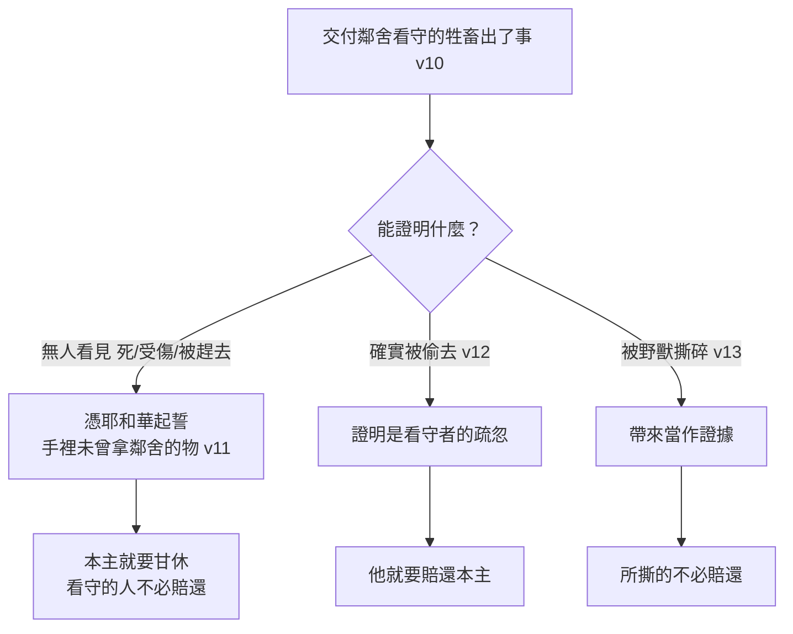

# 出埃及記 第22章

1. [[偷（ganab）|人若偷牛或羊]]，無論是宰了，是賣了，他就要[[賠償原則|以五牛賠一牛，四羊賠一羊]]。
2. 人若[[古代近東自衛權|遇見賊挖窟窿]]，把賊打了，以至於死，[[出22：2-3自衛殺人的界限|就不能為他有流血的罪]]。
3. [[出22：2-3自衛殺人的界限|若太陽已經出來，就為他有流血的罪]]。賊若被拿，[[賠償（shalem）|總要賠還]]。若他一無所有，[[偷竊賠償的律例|就要被賣，頂他所偷的物]]。
4. 若他所[[偷（ganab）|偷]]的，或牛，或驢，或羊，仍在他手下存活，[[古代近東偷竊賠償法|他就要加倍賠還]]。
5. 人若在田間或在葡萄園裡放牲畜，[[財物受損的律例|任憑牲畜上別人的田裡去吃]]，[[賠償與公義|就必拿自己田間上好的和葡萄園上好的賠還]]。
6. 若點火焚燒荊棘，以致將別人堆積的禾捆，站著的禾稼，或是田園，都燒盡了，那點火的必要賠還。
7. [[古代近東受託制度|人若將銀錢或家具]][[受託看管的律例|交付鄰舍看守]]，這物從那人的家被[[偷（ganab）|偷]]去，若把賊找到了，賊要加倍賠還；
8. 若找不到賊，[[審判官（elohim）|那家主必就近審判官]]，要看看他拿了原主的物件沒有。
9. 兩個人的案件，無論是為什麼過犯，或是為牛，為驢，為羊，為衣裳，或是為什麼失掉之物，有一人說：這是我的，兩造就要將案件稟告[[審判官（elohim）|審判官]]，審判官定誰有罪，誰就要加倍賠還。
10. 人若將驢，或牛，或羊，或別的牲畜，交付鄰舍看守，牲畜或死，或受傷，或被趕去，無人看見，
11. 那看守的人要憑著[[耶和華]]起誓，手裡未曾拿鄰舍的物，本主就要罷休，看守的人不必賠還。
12. 牲畜若從看守的那裡被[[偷（ganab）|偷]]去，他就要賠還本主；
13. 若被野獸撕碎，看守的要帶來當作證據，所撕的不必賠還。
14. [[借物賠償的律例|人若向鄰舍借什麼]]，所借的或受傷，或死，本主沒有同在一處，借的人總要賠還；
15. 若本主同在一處，他就不必賠還；若是雇的，也不必賠還，[[借物賠償的律例|本是為雇價來的]]。
16. [[引誘處女的律例|人若引誘沒有受聘的處女]]，與他行淫，[[聘禮（mohar）|他總要交出聘禮]]，娶他為妻。
17. 若女子的父親決不肯將女子給他，他就要[[古代近東聘禮制度|按處女的聘禮，交出錢來]]。
18. [[行邪術的女人（mekhashephah）|行邪術的女人]]，[[出22：18行邪術的死刑|不可容他存活]]。
19. [[古代近東人獸性行為|凡與獸淫合的]]，總要把他治死。
20. [[專一敬拜|祭祀別神，不單單祭祀耶和華的]]，[[滅絕（charam）|那人必要滅絕]]。
21. 不可虧負[[寄居的（ger）|寄居的]]，也不可欺壓他，[[保護弱勢|因為你們在埃及地也作過寄居的]]。
22. [[保護弱者的律例|不可苦待寡婦和孤兒]]；
23. 若是苦待他們一點，他們向我一哀求，[[神聽哀求|我總要聽他們的哀聲]]，
24. 並要發烈怒，用刀殺你們，使你們的妻子為寡婦，兒女為孤兒。
25. [[出22：25取利禁令的範圍|我民中有貧窮人與你同住]]，你若借錢給他，[[取利（neshek）|不可如放債的向他取利]]。
26. 你即或拿鄰舍的衣服[[當頭（`abot）|作當頭]]，[[古代近東當頭制度|必在日落以先歸還他]]；
27. 因他只有這一件當蓋頭，是他蓋身的衣服，若是沒有，他拿什麼睡覺呢？他哀求我，我就應允，[[恩惠|因為我是有恩惠的]]。
28. [[毀謗（qalal）|不可毀謗神]]；也不可毀謗你百姓的官長。
29. 你要從你莊稼中的穀和酒醡中滴出來的酒[[初熟果子|拿來獻上，不可遲延]]。[[頭生歸神|你要將頭生的兒子歸給我]]。
30. 你牛羊頭生的，也要這樣；[[出22：29-30頭生歸神的方式|七天當跟著母，第八天要歸給我]]。
31. [[聖潔（qodesh）|你們要在我面前為聖潔的人]]。因此，田間[[聖潔飲食|被野獸撕裂牲畜的肉，你們不可吃]]，[[古代近東飲食潔淨|要丟給狗吃]]。

<!-- fhl-map-links:start -->
## 相關地圖

- [[appendix/fhl_maps/maps/009|〈創圖四〉亞伯拉罕的生平]]
- [[appendix/fhl_maps/maps/019|〈出圖二〉以色列人出埃及到西乃山]]
<!-- fhl-map-links:end -->

---

## 本章知識節點

### 神學
- [[約書]]
- [[賠償原則]]
- [[聖潔]]
- [[初熟果子]]
- [[頭生歸神]]
- [[恩惠]]
- [[神聽哀求]]
- [[滅絕（herem）]]
- [[專一敬拜]]
- [[敬畏神]]

### 事件
- [[偷竊賠償的律例]]
- [[財物受損的律例]]
- [[受託看管的律例]]
- [[借物賠償的律例]]
- [[引誘處女的律例]]
- [[道德與宗教的律例]]
- [[保護弱者的律例]]
- [[禮儀的律例]]

### 原文
- [[偷（ganab）]]
- [[賠償（shalem）]]
- [[寄居的（ger）]]
- [[當頭（`abot）]]
- [[取利（neshek）]]
- [[毀謗（qalal）]]
- [[行邪術的女人（mekhashephah）]]
- [[滅絕（charam）]]
- [[聖潔（qodesh）]]
- [[聘禮（mohar）]]
- [[審判官（elohim）]]

### 背景
- [[古代近東偷竊賠償法]]
- [[古代近東自衛權]]
- [[古代近東受託制度]]
- [[古代近東聘禮制度]]
- [[古代近東行邪術]]
- [[古代近東人獸性行為]]
- [[古代近東放債取利]]
- [[古代近東當頭制度]]
- [[古代近東初熟果子奉獻]]
- [[古代近東頭生奉獻]]
- [[古代近東飲食潔淨]]
- [[古代近東社會弱勢群體]]

### 主題
- [[賠償與公義]]
- [[聖潔生活]]
- [[保護弱勢]]
- [[財產權]]
- [[聖潔飲食]]

### 解經爭議
- [[出22：2-3自衛殺人的界限]]
- [[出22：18行邪術的死刑]]
- [[出22：25取利禁令的範圍]]
- [[出22：29-30頭生歸神的方式]]

### 互文
- [[出20：15|出20：15 不可偷盜]]
- [[出20：12|出20：12 孝敬父母]]
- [[出20：3|出20：3 不可有別神]]
- [[出20：14|出20：14 不可姦淫]]
- [[利25：35-37|利25：35-37 不可向窮人取利]]
- [[申15：1-11|申15：1-11 豁免年借貸]]
- [[申22：28-29|申22：28-29 引誘處女聘禮]]
- [[申23：19-20|申23：19-20 取利禁令]]
- [[申24：10-13|申24：10-13 當頭歸還]]
- [[申10：18-19|申10：18-19 神為孤兒寡婦伸冤]]
- [[利19：18|利19：18 愛人如己]]
- [[利19：33-34|利19：33-34 不可欺壓寄居者]]
- [[利20：27|利20：27 行邪術治死]]
- [[利18：23|利18：23 不可與獸淫合]]
- [[利20：15-16|利20：15-16 與獸淫合治死]]
- [[利24：16|利24：16 褻瀆神名治死]]
- [[利22：27|利22：27 第八天歸神]]
- [[利11：44|利11：44 你們要聖潔]]
- [[利7：24|利7：24 不可吃死的走獸肉]]
- [[利17：15|利17：15 吃自死肉不潔]]
- [[創1：28|創1：28 生養眾多]]
- [[創3：19|創3：19 勞動命令]]
- [[創34：12|創34：12 示劍聘禮]]
- [[撒上18：25|撒上18：25 大衛聘禮]]
- [[撒上28：3,9|撒上28：3,9 掃羅交鬼]]
- [[王下9：22|王下9：22 耶洗別行邪術]]
- [[申18：10-12|申18：10-12 禁止邪術]]
- [[瑪3：5|瑪3：5 審判行邪術者]]
- [[詩68：5|詩68：5 神為孤兒寡婦伸冤]]
- [[詩146：9|詩146：9 神保護寄居者]]
- [[箴3：9|箴3：9 以初熟果子尊榮神]]
- [[箴6：31|箴6：31 賊七倍賠還]]
- [[箴28：8|箴28：8 厚利積蓄歸窮人]]
- [[結22：7|結22：7 欺壓孤兒寡婦]]
- [[結18：8,13,17|結18：8,13,17 不取利為義]]
- [[結22：12|結22：12 向鄰舍取利]]
- [[賽1：17,23|賽1：17,23 不為孤兒寡婦辯屈]]
- [[賽10：2|賽10：2 苦待寡婦孤兒]]
- [[耶5：28|耶5：28 不為寡婦孤兒伸冤]]
- [[耶7：5-6|耶7：5-6 不可欺壓寄居者]]
- [[耶22：3|耶22：3 不可虧負寄居者]]
- [[亞7：10|亞7：10 不可欺壓弱勢]]
- [[詩15：5|詩15：5 不放債取利]]
- [[詩94：6|詩94：6 惡人殺寡婦孤兒]]
- [[詩91：4|詩91：4 神為保護遮蔽]]
- [[詩34：17|詩34：17 義人呼求神聽]]
- [[詩119：105-106|詩119：105-106 神話為燈光]]
- [[申13：6-10|申13：6-10 引誘拜別神治死]]
- [[申12：31|申12：31 不可焚燒兒女獻祭]]
- [[申31：28-29|申31：28-29 神審判官長]]
- [[民18：15-16|民18：15-16 頭生贖銀]]
- [[民35：22-25|民35：22-25 逃城誤殺]]
- [[創31：39|創31：39 雅各看守牲畜]]
- [[創37：33|創37：33 約瑟染血衣裳]]
- [[摩3：12|摩3：12 牧人搶回羊腿]]
- [[路19：8|路19：8 撒該四倍賠還]]
- [[路16：10|路16：10 小事忠心]]
- [[路12：33|路12：33 變賣賙濟]]
- [[太22：37-40|太22：37-40 愛神愛人總綱]]
- [[太22：39|太22：39 愛人如己]]
- [[太25：35-40|太25：35-40 作在最小弟兄身上]]
- [[太6：9|太6：9 尊神名為聖]]
- [[太23：14|太23：14 法利賽人侵吞寡婦]]
- [[可12：40|可12：40 文士侵吞寡婦]]
- [[羅13：1-7|羅13：1-7 順服掌權者]]
- [[羅13：8|羅13：8 不可虧欠人]]
- [[約13：34|約13：34 彼此相愛]]
- [[來10：5|來10：5 基督以身體為祭]]
- [[申22：8|申22：8 不可遲延獻祭]]
- [[賽50：1|賽50：1 以色列因罪被賣]]
- [[太5：23-24|太5：23-24 獻祭前先和好]]
- [[太6：25-34|太6：25-34 不要憂慮衣食]]
- [[太7：12|太7：12 金律]]
- [[提前1：8-11|提前1：8-11 律法為不法者設]]
- [[提前5：8|提前5：8 照顧家人責任]]
- [[彼前5：2|彼前5：2 牧養群羊]]
- [[約壹3：15|約壹3：15 恨弟兄即殺人]]
- [[林前6：1-8|林前6：1-8 信徒爭訟]]
- [[林前4：7|林前4：7 領受之物]]
- [[林前7：23|林前7：23 重價買來]]
- [[林後2：7-8|林後2：7-8 挽回悔改者]]
- [[加6：10|加6：10 向眾人行善]]
- [[弗4：28|弗4：28 偷竊者親手做工]]
- [[西3：12|西3：12 穿上憐憫恩慈]]
- [[提前5：3-16|提前5：3-16 教會照顧寡婦]]
- [[提前6：20|提前6：20 守住所託付]]
- [[提後1：14|提後1：14 守住善道]]
- [[雅1：27|雅1：27 看顧孤兒寡婦]]
- [[雅2：5|雅2：5 神揀選貧窮人]]
- [[約壹3：17|約壹3：17 塞住憐憫心]]
- [[約8：1-11|約8：1-11 耶穌赦免淫婦]]
- [[約10：12|約10：12 雇工逃走]]
- [[徒19：19|徒19：19 焚燒邪術書]]
- [[徒23：4-5|徒23：4-5 保羅引用不可毀謗官長]]
- [[啟13：1,11|啟13：1,11 兩獸上來]]
- [[啟17：3,11-13|啟17：3,11-13 與獸行淫]]
- [[啟19：15|啟19：15 基督用刀審判]]
- [[來6：16|來6：16 起誓了結爭論]]
- [[西1：15|西1：15 基督為首生]]
- [[約3：16|約3：16 神賜獨生子]]
- [[彼前2：9|彼前2：9 聖潔國度]]
- [[出23：9|出23：9 不可欺壓寄居者]]
- [[出34：14|出34：14 不可祭祀別神]]
- [[出12：12-13|出12：12-13 長子被殺]]
- [[出13：2,15|出13：2,15 頭生歸神]]
- [[出21：2|出21：2 希伯來奴僕釋放]]
- [[出21：6|出21：6 審判官原文為神]]
- [[出21：12|出21：12 打人致死流血罪]]
- [[出21：20-21|出21：20-21 奴僕條例]]
- [[吾珥南模法典|吾珥南模法典 自衛殺賊]]
- [[利皮特-伊施他爾|利皮特-伊施他爾 租賃牲畜損傷]]
- [[赫人法律|赫人法律 禁止人獸性行為]]
- [[創2：2-3|創2：2-3 第七日安息]]
- [[創17：12|創17：12 第八日割禮]]
- [[利12：3|利12：3 第八日割禮]]
- [[申22：23-24|申22：23-24 已許配女子行淫]]
- [[申27：21|申27：21 與獸淫合受咒詛]]
- [[申14：29|申14：29 十分之一給弱勢]]
- [[申24：17|申24：17 不可屈枉孤兒寡婦]]
- [[申24：19-21|申24：19-21 留遺穗給弱勢]]
- [[申25：5-10|申25：5-10 兄終弟及]]
- [[申26：12-13|申26：12-13 第三年十分之一]]
- [[士1：16|士1：16 基尼人寄居]]
- [[撒下24：18-24|撒下24：18-24 亞勞拿寄居者]]
- [[撒下23：39|撒下23：39 烏利亞寄居者]]
- [[結12：5|結12：5 挖牆壁入屋]]
- [[耶2：34|耶2：34 正當殺人]]
- [[耶27：9|耶27：9 責備行邪術]]
- [[彌5：12|彌5：12 責備行邪術]]
- [[鴻3：4|鴻3：4 責備行邪術]]
- [[賽8：19|賽8：19 責備交鬼]]
- [[賽47：12-13|賽47：12-13 責備巴比倫邪術]]
- [[賽19：3|賽19：3 責備埃及邪術]]
- [[賽44：25|賽44：25 神使占卜癲狂]]
- [[結20：7|結20：7 以色列拜偶像]]
- [[徒13：10|徒13：10 保羅責備以呂馬]]
- [[加5：19-21|加5：19-21 邪術為情慾事]]
- [[猶1：8|猶1：8 毀謗在尊位者]]
- [[傳7：6|傳7：6 荊棘焚燒辟啪聲]]
- [[傳10：20|傳10：20 不可咒詛君王]]
- [[路6：30|路6：30 凡求就給]]
- [[路14：13|路14：13 請貧窮殘廢]]
- [[林前7：1|林前7：1 男不近女]]
- [[林前9：9|林前9：9 牛踹穀不籠嘴]]
- [[提前6：10|提前6：10 貪財萬惡之根]]
- [[門1：18-19|門1：18-19 保羅為阿尼西母賠償]]
- [[約10：11|約10：11 好牧人為羊捨命]]
- [[約10：12-13|約10：12-13 雇工逃走]]
- [[啟22：15|啟22：15 犬類在城外]]
- [[太15：26|太15：26 不可拿兒女餅丟狗]]
- [[腓3：2|腓3：2 防備犬類]]

---

## 本章整理

出埃及記第22章為[[約書]]典章的第二部分，延續第21章的案例式律法。CT 把它分為六段：[[偷竊賠償的律例|有關竊盜]]（1-4節）、[[財物受損的律例|有關財物受損]]（5-6節）、[[受託看管的律例|有關受託看管]]（7-15節）、[[引誘處女的律例|有關行淫和邪淫]]（16-20節）、[[保護弱者的律例|有關人權]]（21-27節）、[[禮儀的律例|有關各種禮儀]]（28-31節）。

《精讀本》點出這一大段的體質與前章一脈相承，並補上一個關鍵：==聖經中這種律例的根本精神是公義和慈悲==。KC 則把整章的重心收在一句話上：「大體而言，本章的教導是：我們必須警醒，不讓惡在我們裡面有機會顯露出來。」

### 一、[[偷竊賠償的律例]]（v1-4）

[[偷（ganab）|偷]]牛須[[賠償原則|五牛賠一牛]]，偷羊須四羊賠一羊。牛的賠償額高於羊，因牛能工作且價值較大（CT）。偷到的牛羊若仍存活在賊人手中，僅須加倍賠還（4節）；若已宰殺或變賣，則須四至五倍賠償（GT）。賊若無力賠償，須被賣為奴頂債（3節），與[[出21：2|希伯來奴僕條例]]銜接。

為什麼差這麼多？各家給的理由不完全一樣，攤開來看很有意思：

| 為什麼牛賠五、羊賠四 | 來源 |
| --- | --- |
| 牛的體型較大、價值較貴，偷牛者多半屬於專業盜竊；且牛主喪失工作機會 | CT |
| 偷牛的罪比偷羊大，無非是因為牛大，==顯明犯罪之人的膽量也大== | 丁良才 |
| 偷牛需要更大的膽子和周密的計畫，是更嚴重的罪——體現刑罰的輕重在於罪的性質 | 精讀本 |
| 馴養了的牛不但較有價值，==更是難以置換==；牛和馬一樣必須訓練多年 | 丁道爾 |

《丁道爾》還補了一個很生活化的類比：「東南亞的農戶如何視水牛為家庭的一分子，以色列人也是如何看重他們的牛。」

宰了賣了為什麼罰得更重？丁良才答得漂亮：==「他所作的顯明他在惡事上有恒心。」==《丁道爾》則從反面說：「牲口若是仍然留在他的手下，便證明竊案可能出於一時貪念。」

KC 從賠償條例讀出一個反轉，值得記住：==「偷竊不使人更富有，反使人更貧窮。不義之財意味著自己財產的失去。」==他接著把它推到屬靈層面：「每一個活著要得人榮耀的人，都是從那配得一切榮耀的神那裡偷取了那榮耀。」——而[[路19：8|撒該四倍賠還]]正是這條原則的新約實踐（KC、BH）。

> [!question] [[出22：2-3自衛殺人的界限|夜間殺賊無罪，白天殺賊有罪——界線在哪裡？]]
>
> 這條律例的關鍵不在時間，而在**你看不看得清楚**。
>
> CT 說：「在光天化日之下，可以認明盜賊的身分，沒有必要窮追猛打，故須負打死人的責任。」它並從中讀出神的著眼點：「『太陽已經出來』表示眼目可以看得清楚，不致失手打死人，如果再引起人命，必定是因為存心不良。由此可見，==神所在意的，乃是動機如何==。」
>
> 《中文聖經註釋》把夜間的處境講得最完整：「在黑夜，因為賊人的動機、人數、手持有利器否，都不明朗，而且擊打賊人的部位亦不能準確，何況賊人或者可能是仇家，他進來的目的或為仇殺。」
>
> KC 讀出的重點是另一面：「這條規則顯示==即使是賊的性命也不是可以隨意取去的==。我們不可出於報復而行。對罪行的判決必須由審判官來定。」
>
> 《丁道爾》給了一句總評：「以色列的律法富於憐憫，本節是極佳例子：==即使賊人也有權益==。」

> [!info] [[古代近東自衛權|鄰邦怎麼處理竊賊？]]
>
> 《舊約背景註釋》記了一個令人印象深刻的做法：漢摩拉比法典「加上一個象徵式的阻嚇竊盜措施：==把已處死的竊賊屍體，砌牆圍在他自己在受害人的泥磚牆壁上挖出來的洞中==」。
>
> 它並指出[[古代近東偷竊賠償法|以色列在刑度上反而從輕]]：漢摩拉比法典「偷竊廟宇和宮殿之物的人要判處死刑」，賊人如不繳交罰款「這條法律則指定要將他處死」；相較之下，「==出埃及記二十二3則從輕發落，賣這賊人為奴以賠償損失==」。

### 二、[[財物受損的律例]]（v5-6）

放牲畜吃別人田產須拿自己[[賠償與公義|上好的]]賠還（5節），點火焚燒荊棘致損須賠還（6節）。CT 指出賠償的價款必須超過對方的損失；丁良才補一句：「上好的——==不論牲畜所吃的好不好==。」

這兩節看似平行，其實一個是故意、一個是疏忽——KC 把這層分得很清楚：

| 節 | 情境 | KC 的判讀 |
| --- | --- | --- |
| v5 | 放牲畜吃別人田裡的東西 | ==這是蓄意==：偷別人地裡的果子餵自己的牲畜，好省下自己地裡的。「這裡是刻意讓別人吃虧，好叫自己不受損失」 |
| v6 | 點火燒荊棘卻沒控制住火勢 | ==這看來不是蓄意==：本意是燒荊棘，卻讓火燒成大火，燒了別人的禾稼 |

《丁道爾》從氣候解釋為什麼火這麼可怕：「以色列地屬於地中海氣候，夏天炎熱而乾旱，因此==以色列人談山火而色變==。」它並指出荊棘的用途：「荊棘叢可能有籬笆的功用，可以攔阻牛隻。」

KC 從第6節推出一個關於教會管教的應用，是本章最細膩的一段：火代表審判，荊棘是罪的結果，「若罪顯露出來，就必須被審判」。但——「教會中對罪的審判，就是管教的行動，==有可能被執行得過了頭==」。他接著說：「若有人悔改而管教沒有解除，那人就被不當地剝奪了教會的祝福。」引[[林後2：7-8|林後2:7-8]]：管教達到目的就當止住，免得那人「憂愁太過」，該給的賠償是「向他顯明堅定不移的愛」。

KC 對「性情急躁的人」的觀察，讀來很刺：「他們一遇見罪就立刻預備好要行動。那時候行動確實是好的。但因著他們急躁的性情，==他們有時候走得太遠，把整個人都定罪了==。這樣他們連麥子也和稗子一起毀掉。」

### 三、[[受託看管的律例]]（v7-15）

[[古代近東受託制度|受託保管財物]]被偷，賊人須加倍賠還（7節）；找不到賊時，受託人須就近[[審判官（elohim）|審判官]]起誓證明清白（8-9節）。看守牲畜若死或受傷，看守者憑[[耶和華]]起誓可免責（11節）；若被偷須賠還（12節）；若被野獸撕碎，帶證據可免責（13節）。借用牲畜死傷須賠還，本主同在或是雇的則不必（14-15節）。

古代沒有銀行，所以《啟導本》說：「在尚無銀行等金融機構的社會，一個人外出旅行，會把銀錢等托鄰人代為保管。」丁良才則列出兩個託管的緣故：「或因要出門；或因要作質。」

受託牲畜出事的三種結局，處理方式完全不同——差別在於**能不能證明**：

第11節有一個容易漏掉的細節，CT 特別點出：==在這些「社治律」（10-13節）中，只有這一次提及耶和華==——「表示祂是聽聞誓言者，發誓者必須真誠，否則犯妄稱耶和華之名的誡命。」

《丁道爾》把起誓的機制講得最透：「那人必須指著神的名肅然立誓，表明無辜。這樣做是與『神明裁判』同等，==原告必須接受==。被告若起假誓，他口所出的咒詛就要臨到自己頭上，必然受到充分的懲罰。這大概便是『神定誰有罪』的意思。」《中文聖經註釋》則補了一個很寫實的觀察：「事實上，==有罪的一方一提到去神壇發咒起誓，他可能已心驚了==。」

> [!note] 「就近審判官」的原文其實是「神」
>
> 這是本章一個反覆出現的譯名問題。8、9節和合本作「審判官」，但《中文聖經註釋》指出：「==這譯法與原文的意義不符。審判官的原文是神==。」《丁道爾》講得更硬：「就近神，和二十一章6節一樣，==必然是『到聖所』的意思==。」
>
> 《丁道爾》並由這個字推出一個關於年代的論證：由於本段（11節除外）用的是閃族語一般的「神」字（elohim）而非以色列特有的「耶和華」（YHWH），有人便覺得這律法是採自以色列的鄰邦。但它提出更有力的另一說：「這些律法和美索不達米亞的法律大致相同，顯示它在摩西之前便已存在。如此，這些律法便是==耶和華一名未曾啟示給摩西之前，以色列先祖的『習慣法』==。」

[[創31：39|雅各為拉班看守牲畜]]被野獸撕裂仍須賠償——《丁道爾》指這正是本段的對比：「雅各時代無疑也有類似的法則，==然而他卻控訴拉班，說他連這些也要索取==。」而[[摩3：12|阿摩司書3:12]]說明了帶屍骸的用意：「是要顯出牲口雖然不免被殺，==牧人卻依然機警==，及時阻止不被野獸吃掉。」

第15節「若是雇的」怎麼讀，有兩種說法。CT 讀作租金已含保險：「租金包括了意外事故的保險。」但《丁道爾》提出另一種可能：「『雇』字的原文通常是指雇工人，不是租來的東西；因此挪士等人將這句話譯成『==如果（使東西受損的）那人是雇工，損失便從工錢扣除==』。」它接著補了一句到今天仍然成立的觀察：「若然，本節便和聖經好幾處地方一樣，強調==雇工做事疏忽，不如主人謹慎==（參約十12）。這個一針見血的心理觀察，時至今日依然有效。」

KC 從借用推出一句話：「我們必須始終意識到，==我們所擁有的一切都是借來的==」——引[[林前4：7|林前4:7]]：「你有什麼不是領受的呢？」

### 四、[[道德與宗教的律例]]（v16-20）

[[引誘處女的律例|引誘未聘處女]]須交出[[聘禮（mohar）|聘禮]]娶她為妻（16-17節），父親有權拒絕，但男方仍須交錢。[[行邪術的女人（mekhashephah）|行邪術的女人]]不可容她存活（18節），與獸淫合者治死（19節），祭祀別神者必要[[滅絕（charam）|滅絕]]（20節），為[[出20：3|第一誡]]的應用。

《中文聖經註釋》注意到一個文體的轉折：16-17節仍是個案式的「人若……」，而==18-20節已改用普遍性的律例形式==。《丁道爾》則指出這三條的共同點：「在以色列人的眼中，==三樣基本上都是宗教罪行==：禁令的源頭，是神所啟示的本性。」

處女被引誘的條例為什麼列在財產律例之後？《丁道爾》說得直白：「本節列在盜竊的大標題下。==未出嫁的女子可說是父親的產業，將來可以換取聘禮==。」它接著解釋這條律法的機制：「本節所描述的，則是某人沒付聘禮便取去女子。他必定要付出聘禮，因為==他不付，就沒有人會付了==。」

《舊約背景註釋》把婚前性行為不當的三個理由列得很清楚：這樣做「①僭奪女子父親洽談婚約的權柄，②削減聘禮的金額，又③使丈夫無法肯定長子是否自己的骨肉」。KC 則從女子的處境說：「這女子失去了她的尊榮，因此將更難出嫁。」他並補了一句對父母權柄的提醒：「==一個普遍的功課是：安排婚姻時不可越過父母==。」

> [!question] [[出22：18行邪術的死刑|「不可容她存活」——今天還適用嗎？]]
>
> 這是本章最尖銳的解經爭議。蘇穎智從一個對照切入：[[徒19：19|徒19:19-20]] 記載保羅面對行邪術的人，「==並沒有宣判那些行邪術者死罪，反而將福音傳給他們，使他們得救==」，結果是「主的道大大興旺，而且得勝」。
>
> 他給了兩個理由解釋差別：「第一，==對象不同==。出廿二18-20針對的是『掛羊頭賣狗肉』的以色列人，明知故犯，罪加一等；但保羅所處的時代者均為外邦人，不認識神，不知者不罪。第二，==時代不同了==，應用上亦可能有差別。」
>
> 《丁道爾》的處理同樣謹慎，而且它明確地把中世紀的做法排除在外：「新約同樣譴責邪術（徒十三10，十九19），然而==中世紀的教會雖然處死靈媒和祝巫，新約卻沒有這個教訓==。」它給本條律法的定位是歷史性的：「我們可以假定出埃及記設立這準則，是要保全屬神的社群肇建之時，不受外來邪教的危害，並且向歷代的人證明神對巫術的憎惡。」
>
> 它並對現代提出一個尖銳的觀察：「今日西方世界宗教面臨衰微，==『法術』取而代之而風靡一時==。」以及一句神學上的判斷：「渴想知道將來的事，是沒有信心的表現；試圖控制將來就更不消提了。」
>
> 至於與獸淫合，《丁道爾》的態度是分開處理原則與人：「對於這種扭曲神自然律的行為，我們的態度當然不可與律法相違，==然而今日我們處理犯這種罪的人，卻應該是不同的方式==。」

KC 注意到 18-20 節的排列本身就在說話：占卜（18節）與拜偶像（20節）都源自邪術的世界，而中間夾著一條警告人不可與獸交合（19節）。他的推論很直接：==「神的百姓必須被警戒遠離這種令人作嘔的性交表現，這正表明他們做得出來。」==

《舊約背景註釋》指出邪術禁令的文體特徵：「聖經所有關乎法術的律法都是==定言式的命令==。禁令如此嚴峻，可能是因為它和迦南宗教有關，但亦可能不過因為==法術是對掌管萬有之神的挑戰==。」

### 五、[[保護弱者的律例]]（v21-27）

不可虧負[[寄居的（ger）|寄居的]]，因以色列人也曾在埃及作過寄居的（21節），體現[[保護弱勢]]原則。不可苦待寡婦和孤兒（22節），[[神聽哀求|神聽他們的哀求]]（23節），苦待者將受報應——妻子為寡婦、兒女為孤兒（24節）。借錢給窮人不可[[取利（neshek）|取利]]（25節），拿窮人外衣作[[當頭（`abot）|當頭]]須日落前歸還（26-27節）。

這一段的語氣和前面完全不同——《丁道爾》抓到了原因：「如挪士所言，本段的一個特點，是==全部誡命都是定言式而非條件式的==；換言之，這些都是以色列基本的律法，而不是律法的演繹。」它接著給出理由：「以色列必須關顧窮乏無助的人，==因為耶和華也關顧他們：這是祂的本性==。」

《串珠》把以色列不可虧待這些人的三個理由列得很整齊：

1. 他們知道和親身經歷過寄居者所受的欺壓（21節）；
2. 神的一種屬性就是祂的[[恩惠]]（27節），故選民必須以恩惠待人；
3. 他們曾與神立約（25節「我民」），而這種盟約的關係禁止他們壓逼別人。

KC 說得更直接：「因為以色列人曾在埃及作過寄居的，==他們必須能夠想像寄居在他們中間是什麼滋味==。這應當使他們對他們有恩慈。」他並把它翻譯成信徒的處境：「照樣，信徒必須對世上的人有憐憫，因為他們從前也屬於這世界。==一種高傲的態度，對著沉淪最深的人，不配一個信徒==。」他甚至先堵掉了一種誤讀：「這不是一個改善全球的社會方案……這是要反映神的恩典。」

《丁道爾》對 24 節的報應提出一個漂亮的觀察：「使你們的妻子為寡婦，是==神執行「同態復仇法」的結果==。在埃及地的經歷可以作為印證。埃及苦待神的長子以色列，故此埃及的長子被殺，埃及的婦女也因紅海的災難變為寡婦。」它下的結論很沉：==「社會沒有正義，便必然落在神的審判下。」==

> [!question] [[出22：25取利禁令的範圍|不可取利——這條禁令管到哪裡？]]
>
> 丁良才劃出三條界線：「這一條法律是==論以色列人，不是論外邦人==（申二十三20）。==也不是論到借款經商等事==（路十九23；太二十五27）。」
>
> 《舊約背景註釋》從社會結構解釋為什麼：這限制根據兩個原則，「①鄉村社會的農民必須互相倚賴才能生存，②==利息是城市商賈的現象==，農民有時不得不和他們買賣，他們卻不關心鄉村社會的需要」。所以禁令的目的是「保持以色列人人平等，以及避免鄉下人和城市人關係惡化」。
>
> 《丁道爾》則指出禁令背後的道德邏輯：「窮人陷於困境才會借貸，==借錢是幫助鄰舍，在鄰舍缺乏時還收取利息是不道德的==。」它並指出基督把標準推得更遠：「基督更進一步禁止我們在這種情況下，試圖收回本金（利息就更甭提了；路六34、35）。==向缺乏的弟兄免息貸款，如今成為了施贈==。」
>
> 它最後留下一句對今天的話：「不論怎樣執行其中的細節，這些偉大的屬靈原則在今日我們的『富裕社會』中依然有效。」

外衣為什麼非還不可？答案在第27節：「因他只有這一件當蓋頭。」《串珠》說明那是「一種闊大長方形的鬥蓬，是窮人在夜間當作氈用的」。《舊約背景註釋》補了一個考古證據：「亞弗內揚（Yavneh-Yam）挖掘到主前七世紀末的希伯來語銘刻，==記載了一個農工的申訴，說他的外衣被人無理奪取==。他請求法庭把權利、自由身分，和外衣歸還給他。」

《丁道爾》看出這條律法有一個近乎自我取消的效果：「外衣若要每晚歸還（在晚上是必須品，不是奢侈品），便只能不斷提醒人欠債的事實，==抵押的功用便大為消減了==。」——換句話說，這條律法讓抵押這件事在窮人身上幾乎行不通。

KC 對此的讀法很溫柔：「他的貧窮，以及隨之而來的赤身，==在神裡面激起恩典的感覺==。神要我們學習分擔祂的感覺。」

### 六、[[禮儀的律例]]（v28-31）

不可[[毀謗（qalal）|毀謗]]神與官長（28節），[[羅13：1-7|順服掌權者]]為其新約應用。獻上[[初熟果子]]不可遲延（29節），[[頭生歸神|頭生的兒子歸給神]]。要為[[聖潔（qodesh）|聖潔]]的人（31節），不可吃被野獸撕裂的肉，要丟給狗吃。

第28節有一段很有名的新約迴響：[[徒23：4-5|保羅在大祭司面前受審時所引的名句就是本節]]。KC 指出：「保羅在這點上弄錯了，必須道歉，==而他道歉的方式就是引用這一節==。」

「不可毀謗神」的「神」是不是又該譯作「審判官」？《丁道爾》承認兩種都有可能，但給了一個很有力的類比：「若因尊敬神而把咒罵父母定為死罪（出二十一17），同樣地，==咒詛神所設立的族長，也應當是嚴重的==。」它並誠實面對現代讀者的不適：「現代人或會覺得本節對掌權者是過分敬重了」——但立刻補上那條界線：「當然，這並不表示==我們不能為基督的緣故，拒絕遵行掌權者的命令==（參太二十二21）。」

CT 的話中之光提到一個沉重的歷史對照：羅馬書十三章1-2節「乃是新約訓言中最難實踐的一項，==正如德國基督徒在納粹時代被迫去接受的那樣==」。

> [!info] [[出22：29-30頭生歸神的方式|頭生的兒子要怎麼「歸給我」？]]
>
> 這一節讀來嚇人，但答案在別處。CT 說明：每一家的長子「在逾越節的晚上，原該與埃及地所有的長子被殺，卻因神的羔羊的血得蒙保守，故須分別為聖歸給神，==但毋須像牲畜一樣被殺獻上，可以改用贖金贖出來==」（[[民18：15-16|民18:15-16]]）。
>
> 《舊約背景註釋》把以色列的做法放回鄰邦的脈絡，對比就出來了：「當時的普遍信念是：若要保證豐饒，==頭生的牲畜和每家的長子都必須獻為祭物==。」而「[[古代近東頭生奉獻|以色列的信仰禁止殺人獻祭]]，奉上牲口代替嬰孩（參：創二十二），並且以利未人取代長子獻身事奉」。
>
> 至於牛羊為什麼要等到第八天，《舊約背景註釋》列了三個可能：「①與兒子在第八日受割禮（創十七12）對應；②==人道對待牲口的表示==；③試圖使獻祭與七日的創世循環相協調。」丁良才則從母畜著想：「要讓他吃母的奶，==大概是為母的好處==。」

第31節的禁令是[[聖潔飲食|飲食]]，理由卻是身分。《丁道爾》的推論很緊：「[[彼前2：9|在我面前為聖潔的人]]，全以色列都可算都有祭司地位（十九6）。==祭司吃腐肉而使自己不潔（因而玷污神），是不可想像的==。」

為什麼不可吃？丁良才給兩個緣故：「①是不潔的野獸撕裂的；②==這肉的血未必流盡==。」《中文聖經註釋》另加了一個很少見、卻極寫實的理由：「也怕外邦人會捉弄他們，==故意撕裂牲畜丟下，讓他們撿喫而違背神的吩咐==，以致惹動神的怒氣而除滅他們，則外邦人便不戰而得勝利了。」

KC 把「丟給狗吃」讀成一句尖銳的分界：==「聖潔的人不吃與暴力相連的食物。這樣的食物是給不潔淨的狗的，牠們對聖潔毫無感覺。」==他接著把它應用到今天：「信徒不該以那些明顯沾附著世界敗壞的東西為食糧。」

丁良才則留下一個細節，說明這條律法不是浪費食物：「本節不是禁止以色列人將這肉賣或送給外人（申十四21）。但本處若沒有外人，或是他們不願意吃這肉，就給以色列人指出除掉這肉的方法。」

CT 給全章的收束，落在一句很內在的話上：==「聖潔在乎內心，不在乎外表；在乎動機，不在乎動作。」==

**參考資料**
https://www.ccbiblestudy.org/Old%20Testament/02Exo/02CT22.htm — ccbiblestudy 註解（CT）
https://www.ccbiblestudy.org/Old%20Testament/02Exo/02GT22.htm — ccbiblestudy 拾穗（GT）
https://www.kingcomments.com/en/bible-studies/Exo/22 — KingComments（KC）
https://biblehub.com/study/exodus/22.htm — BibleHub Study（BH）
