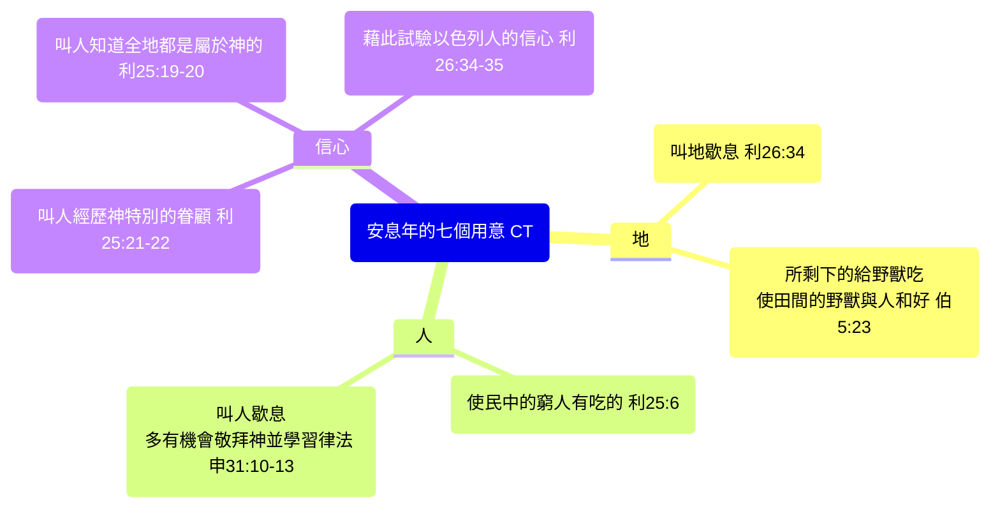
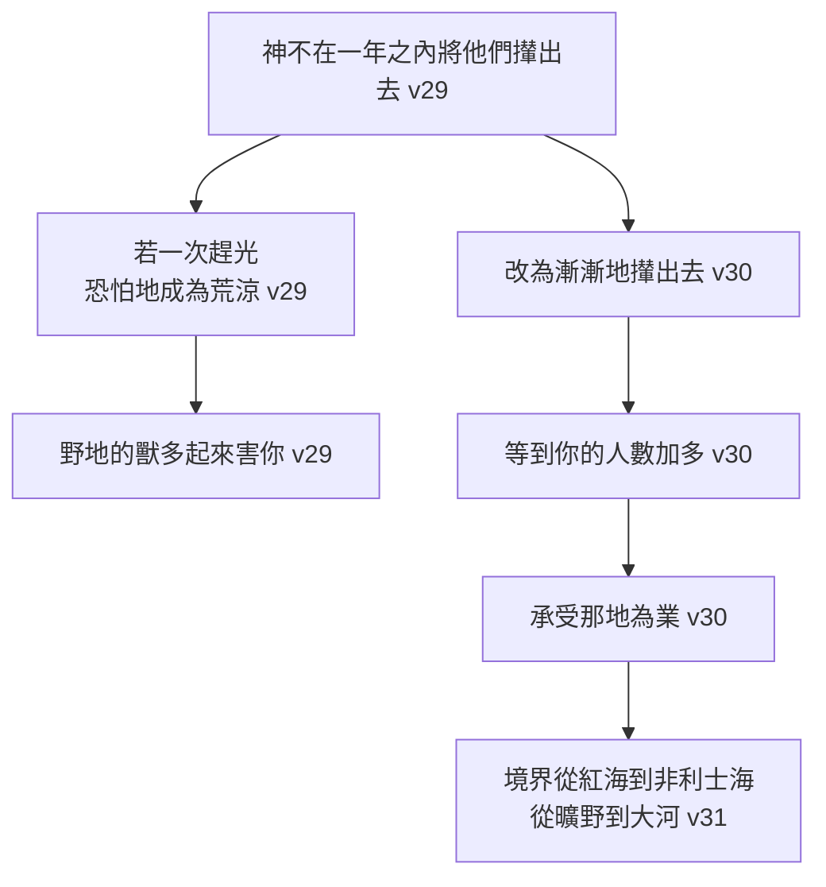

# 出埃及記 第23章

1. [[謠言（shema`）|不可隨夥佈散謠言]]；[[聯手（shathaph）|不可與惡人連手妄作見證]]。
2. [[隨眾（rab）|不可隨眾行惡]]；不可在爭訟的事上隨眾偏行，[[屈枉（natah）|作見證屈枉正直]]；
3. [[出23：2-3隨眾與偏護窮人|也不可在爭訟的事上偏護窮人]]。
4. [[出23：4-5愛仇敵律例|若遇見你仇敵的牛或驢失迷了路]]，總要牽回來交給他。
5. [[愛仇敵律例|若看見恨你人的驢壓臥在重馱之下]]，不可走開，[[愛鄰舍與仇敵|務要和驢主一同抬開重馱]]。
6. [[司法公義|不可在窮人爭訟的事上屈枉正直]]。
7. [[古代近東司法制度|當遠離虛假的事]]。不可殺無辜和有義的人，[[公義與真理|因我必不以惡人為義]]。
8. [[古代近東賄賂|不可受賄賂]]；因為賄賂能叫明眼人變瞎了，又能顛倒義人的話。
9. [[保護弱勢律例|不可欺壓]][[寄居的（ger）|寄居的]]；[[關懷弱勢|因為你們在埃及地作過寄居的]]，[[古代近東寄居者保護|知道寄居的心]]。
10. [[安息年|六年你要耕種田地]]，[[收藏（asaph）|收藏]]土產，
11. [[歇息（shamat）|只是第七年要叫地歇息]]，不耕不種，[[安息年律例|使你民中的窮人有吃的]]；他們所剩下的，[[古代近東安息年|野獸可以吃]]。你的葡萄園和橄欖園也要照樣辦理。
12. 六日你要做工，[[安息日|第七日要安息]]，[[安息日律例|使牛、驢可以歇息]]，[[古代近東安息日|並使你婢女的兒子和寄居的都可以舒暢]]。
13. 凡我對你們說的話，你們要謹守。[[出23：13不可提別神名|別神的名，你不可提]]，[[古代近東偶像崇拜|也不可從你口中傳說]]。
14. [[守節（chagag）|一年三次，你要向我守節]]。
15. [[除酵（matsah）|你要守除酵節]]，照我所吩咐你的，在亞筆月內所定的日期，吃無酵餅七天。[[三大節期律例|誰也不可空手朝見我]]，因為你是這月出了埃及。
16. [[古代近東三大節期|又要守收割節]]，所收的是你田間所種、[[初熟（bikkurim）|勞碌得來初熟之物]]。並在年底[[收藏（asaph）|收藏]]，[[收藏（asaph）|要守收藏節]]。
17. [[節期與紀念|一切的男丁要一年三次朝見主耶和華]]。
18. [[獻祭條例|不可將我祭牲的血和有酵的餅一同獻上]]；也不可將我節上祭牲的脂油留到早晨。
19. 地裡首先[[初熟（bikkurim）|初熟]]之物要送到耶和華─你神的殿。[[出23：19不可用山羊羔母奶煮山羊羔|不可用山羊羔母的奶煮山羊羔]]。
20. 看哪，[[出23：20-23使者身分|我差遣使者在你前面]]，[[神的引導與保護|在路上保護你]]，[[天使引導|領你到我所預備的地方去]]。
21. [[天使引導應許|他是奉我名來的]]；你們要在他面前謹慎，聽從他的話，[[惹（marah）|不可惹]]（惹或作：違背）他，因為他必不赦免你們的過犯。
22. 你若實在聽從他的話，照著我一切所說的去行，[[天使引導應許|我就向你的仇敵作仇敵]]，向你的敵人作敵人。
23. [[使者（mal'akh）|我的使者要在你前面行]]，領你到亞摩利人、赫人、比利洗人、迦南人、希未人、耶布斯人那裡去，[[剪除（kareth）|我必將他們剪除]]。
24. [[敬畏神與專一事奉|你不可跪拜他們的神]]，不可事奉他，也不可效法他們的行為，[[拆毀偶像律例|卻要把神像盡行拆毀]]，[[柱像（matsebah）|打碎他們的柱像]]。
25. [[專一事奉|你們要事奉耶和華─你們的神]]，[[神賜福應許|他必賜福與你的糧與你的水]]，也必從你們中間除去疾病。
26. 你境內必沒有墜胎的，不生產的。[[神賜福應許|我要使你滿了你年日的數目]]。
27. 凡你所到的地方，我要使那裡的眾民在你面前驚駭，擾亂，[[征服迦南應許|又要使你一切仇敵轉背逃跑]]。
28. [[黃蜂（tsirah）|我要打發黃蜂飛在你前面]]，把希未人、迦南人、赫人攆出去。
29. 我不在一年之內將他們從你面前攆出去，[[逐漸趕出|恐怕地成為荒涼]]，野地的獸多起來害你。
30. [[漸漸（me'at me'at）|我要漸漸地將他們從你面前攆出去]]，[[出23：27-30逐漸趕出|等到你的人數加多，承受那地為業]]。
31. [[漸進性征服|我要定你的境界]]，從紅海直到非利士海，又從曠野直到大河。我要將那地的居民交在你手中，你要將他們從你面前攆出去。
32. [[立約界限|不可和他們並他們的神立約]]。
33. [[立約禁令|他們不可住在你的地上]]，恐怕他們使你得罪我。你若事奉他們的神，[[網羅（moqesh）|這必成為你的網羅]]。

<!-- fhl-map-links:start -->
## 相關地圖

- [[appendix/fhl_maps/maps/009|〈創圖四〉亞伯拉罕的生平]]
- [[appendix/fhl_maps/maps/019|〈出圖二〉以色列人出埃及到西乃山]]
<!-- fhl-map-links:end -->

---

## 本章知識節點

### 神學
- [[司法公義]]
- [[安息年]]
- [[安息日]]
- [[三大節期]]
- [[天使引導]]
- [[專一事奉]]
- [[神賜福應許]]
- [[逐漸趕出]]
- [[立約界限]]

### 事件
- [[司法公正律例]]
- [[保護弱勢律例]]
- [[愛仇敵律例]]
- [[安息年律例]]
- [[安息日律例]]
- [[三大節期律例]]
- [[獻祭條例]]
- [[天使引導應許]]
- [[拆毀偶像律例]]
- [[征服迦南應許]]
- [[立約禁令]]

### 原文
- [[謠言（shema`）]]
- [[聯手（shathaph）]]
- [[寄居的（ger）]]
- [[隨眾（rab）]]
- [[屈枉（natah）]]
- [[歇息（shamat）]]
- [[安息（shabath）]]
- [[守節（chagag）]]
- [[除酵（matsah）]]
- [[初熟（bikkurim）]]
- [[收藏（asaph）]]
- [[使者（mal'akh）]]
- [[惹（marah）]]
- [[剪除（kareth）]]
- [[柱像（matsebah）]]
- [[黃蜂（tsirah）]]
- [[漸漸（me'at me'at）]]
- [[網羅（moqesh）]]

### 背景
- [[古代近東司法制度]]
- [[古代近東安息年]]
- [[古代近東三大節期]]
- [[古代近東立約]]
- [[古代近東寄居者保護]]
- [[古代近東安息日]]
- [[古代近東賄賂]]
- [[古代近東偶像崇拜]]

### 主題
- [[公義與真理]]
- [[愛鄰舍與仇敵]]
- [[關懷弱勢]]
- [[敬畏神與專一事奉]]
- [[神的引導與保護]]
- [[漸進性征服]]
- [[節期與紀念]]

### 解經爭議
- [[出23：2-3隨眾與偏護窮人]]
- [[出23：4-5愛仇敵律例]]
- [[出23：10-11安息年執行]]
- [[出23：13不可提別神名]]
- [[出23：19不可用山羊羔母奶煮山羊羔]]
- [[出23：20-23使者身分]]
- [[出23：27-30逐漸趕出]]
- [[出23：32-33立約禁令]]

### 互文
- [[出20：16|出20：16 第九誡不可作假見證]]
- [[出20：8-11|出20：8-11 第四誡安息日]]
- [[出22：21|出22：21 不可欺壓寄居的]]
- [[出22：25-27|出22：25-27 不可向窮人取利]]
- [[利19：15|利19：15 不可偏護窮人也不可重看有勢力的]]
- [[利19：16|利19：16 不可隨夥佈散謠言]]
- [[利25：1-7|利25：1-7 安息年地歇息]]
- [[利25：20-22|利25：20-22 第六年賜三倍收成]]
- [[申27：19|申27：19 屈枉寄居的孤兒寡婦受咒詛]]
- [[出20：3|出20：3 第一誡不可有別神]]
- [[申15：1-11|申15：1-11 豁免年與濟貧]]
- [[申16：18-20|申16：18-20 設立審判官秉公行義]]
- [[申24：17|申24：17 不可向寄居的孤兒屈枉正直]]
- [[申1：17|申1：17 審判不可看人面]]
- [[申10：17-19|申10：17-19 神不偏待人、愛寄居的]]
- [[申23：6|申23：6 不可與迦南人立約]]
- [[申7：1-2|申7：1-2 將迦南七族剪除]]
- [[申7：22|申7：22 漸漸趕出免得野獸增多]]
- [[書23：12-13|書23：12-13 不可與剩下國民交往]]
- [[詩1：1|詩1：1 不從惡人計謀]]
- [[詩82：3|詩82：3 為貧窮人伸冤]]
- [[箴6：16-19|箴6：16-19 耶和華恨惡作假見證的]]
- [[箴17：23|箴17：23 惡人收受賄賂顛倒公義]]
- [[箴24：23-25|箴24：23-25 審判不可看人面]]
- [[箴29：7|箴29：7 義人知道窮人的案件]]
- [[箴31：9|箴31：9 開口為窮人辯屈]]
- [[傳7：7|傳7：7 賄賂能叫智慧人變瞎]]
- [[賽1：17|賽1：17 學習行善、為孤兒伸冤、為寡婦辯屈]]
- [[賽5：23|賽5：23 收受賄賂顛倒義人]]
- [[彌3：9-11|彌3：9-11 審判官收賄賂、祭司教訓為利]]
- [[彌6：8|彌6：8 行公義、好憐憫、存謙卑心]]
- [[太5：44|太5：44 愛你們的仇敵]]
- [[太7：13-14|太7：13-14 窄門少人走、寬門多人走]]
- [[太12：36-37|太12：36-37 凡人所說的閒話必要供出來]]
- [[可14：56|可14：56 許多人作假見證告耶穌]]
- [[路6：35|路6：35 愛仇敵、善待恨你的人]]
- [[路10：30-33|路10：30-33 好撒瑪利亞人幫助仇敵]]
- [[路12：24|路12：24 神餵養烏鴉]]
- [[路23：13-25|路23：13-25 彼拉多殺無辜的耶穌]]
- [[約5：44|約5：44 貪人的榮耀過於神的榮耀]]
- [[約10：28-29|約10：28-29 羊不至永遠滅亡、無人能從手中奪去]]
- [[約14：6|約14：6 我就是道路真理生命]]
- [[徒4：19-20|徒4：19-20 聽從神不聽從人]]
- [[羅12：2|羅12：2 不要效法這世界]]
- [[羅12：20|羅12：20 仇敵餓了給他吃、渴了給他喝]]
- [[林前5：6-8|林前5：6-8 清除舊酵、守除酵節]]
- [[林前16：23|林前16：23 誰若不愛主、這人可詛咒]]
- [[弗4：25|弗4：25 棄絕謊言、各人與鄰舍說真話]]
- [[弗5：11|弗5：11 不要與暗昧無益的事有份、倒要責備]]
- [[腓2：4|腓2：4 各人不單顧自己的事、也顧別人的事]]
- [[西2：16-17|西2：16-17 節期新月安息日都是後事之影]]
- [[雅2：1-9|雅2：1-9 信奉主不可按外貌待人]]
- [[撒上8：3|撒上8：3 撒母耳兒子收受賄賂、屈枉正直]]
- [[撒上12：3|撒上12：3 撒母耳未收過賄賂]]
- [[王上21：12-13|王上21：12-13 耶洗別設謀殺拿伯、作假見證]]
- [[民35：9-34|民35：9-34 逃城條例]]
- [[書20：1-9|書20：1-9 設立逃城]]
- [[詩15：5|詩15：5 不放債取利、不受賄賂害無辜]]
- [[詩146：9|詩146：9 耶和華保護寄居的]]
- [[賽10：2|賽10：2 屈枉窮人、奪取貧民權利]]
- [[耶5：28|耶5：28 不為孤兒伸冤、不為寡婦辯屈]]
- [[耶7：5-6|耶7：5-6 不可欺壓寄居孤兒寡婦]]
- [[耶22：3|耶22：3 不可虧負寄居孤兒寡婦]]
- [[結22：7|結22：7 在你中間欺壓寄居的、虧負孤兒寡婦]]
- [[結22：12|結22：12 收受賄賂流人血]]
- [[亞7：10|亞7：10 不可欺壓寡婦孤兒寄居貧窮人]]
- [[瑪3：5|瑪3：5 我必臨近審判、作見證警戒行邪術欺壓寡婦孤兒寄居的]]
- [[太23：23|太23：23 律法上較重的是公義憐憫信實]]
- [[羅13：1-7|羅13：1-7 掌權者是神的差役]]
- [[加5：1|加5：1 基督釋放了我們叫我們得自由]]
- [[加6：2|加6：2 你們各人的重擔要互相擔當]]
- [[腓2：6-7|腓2：6-7 基督取奴僕形像]]
- [[西1：15|西1：15 愛子是不能看見之神的像]]
- [[提前1：8-11|提前1：8-11 律法是為不法之人設的]]
- [[提前5：8|提前5：8 不顧自己家人比不信的人更不好]]
- [[來4：9-10|來4：9-10 另有一安息日給神的子民]]
- [[來10：5|來10：5 基督來到世上說神不喜悅祭物禮物、預備身體]]
- [[雅1：27|雅1：27 看顧孤兒寡婦為清潔虔誠]]
- [[雅4：17|雅4：17 人知道行善卻不去行就是罪]]
- [[彼前2：9|彼前2：9 你們是被揀選的族類、有君尊的祭司]]
- [[彼前5：2|彼前5：2 務要牧養神的群羊]]
- [[約壹3：17|約壹3：17 看見弟兄窮乏卻塞住憐憫心]]
- [[啟19：15|啟19：15 基督用鐵杖轄管、踹神烈怒的酒醡]]
- [[啟22：15|啟22：15 好說謊話的在城外]]

---

## 本章整理

第二十三章是[[司法公正律例|典章]]的最後一部分，前半（1-19節）收束約書的律例，後半（20-33節）轉為神帶領以色列進迦南的約定。CT 的分段是：有關民事案件的律例（1-9節）、有關[[安息年律例|安息年]]的律例（10-13節）、有關[[三大節期律例|節期]]的律例（14-19節），然後是【帶領以色列民進迦南的約定】（20-33節）。

### 一、[[司法公正律例|司法公正]]（v1-9）

本章開篇確立司法公正的核心原則：不可[[謠言（shema`）|隨夥佈散謠言]]（1節）、不可[[聯手（shathaph）|與惡人聯手妄作見證]]（1節）、不可[[隨眾（rab）|隨眾行惡]]（2節）、不可在爭訟中隨眾偏行[[屈枉（natah）|屈枉正直]]（2節）、不可偏護窮人（3節）、不可[[司法公義|屈枉窮人的案件]]（6節）、[[古代近東司法制度|當遠離虛假事]]（7節）、不可殺無辜有義的人（7節）、不可[[古代近東賄賂|受賄賂]]（8節）、不可[[保護弱勢律例|欺壓寄居的]]（9節）。這些律例將[[公義與真理|「公義」]]具體化為具體的司法操作規範，保護弱勢群體（窮人、寄居者）免受司法系統的濫用。

> [!important] 這一段其實不是律例，是勸告
>
> 《中文聖經註釋》點出一個容易漏掉的體裁差異：「這段經文，==嚴格來說並不是律例，而是勸告人要維護正義==。」《啟導本》給了理由：「這些都非法例，只屬訓誡，==因未訂明刑罰==。」
>
> 《丁道爾》則描述它的形式：「以定言式律法為骨幹，其中加插『申命式』部分，為理由和動機作出解釋……本段在這方面和『十言』很有相像之處。」

1-9節不是一團散沙——《中文聖經註釋》指出它其實是**對兩種不同的人說的**，而兩種人的試探恰好相反：

| 節 | 對象 | 試探是什麼 |
| --- | --- | --- |
| v1-3 | 陪審員與見證人 | 人云亦云隨夥亂講、與惡人勾結作假見證；以及==憐貧==——「陪審員很容易憐貧」 |
| v6-9 | 法官或城門口審判的長老 | ==看富貴人的情面和「錢面」==而屈枉窮人；收受賄賂；欺壓寄居的 |

所以第3節（不可偏護窮人）與第6節（不可屈枉窮人）不是矛盾，而是分別對著兩種人的兩種偏差。CT 也點出兩節的重心不同：「那裡所強調的是『作見證』，而本節所強調的是『秉公判斷』。」

> [!question] [[出23：2-3隨眾與偏護窮人|第3節該不該改成「有勢力的人」？]]
>
> 這是本章一個漂亮的經文鑑別學爭論。《啟導本》報告了修訂派的主張：「有許多人把『窮人』（dal）解為『有勢力的人』（gadol）」，理由是袒護有勢力的人才是真正的試探，而且不改的話第6節就重複了。
>
> 但《丁道爾》拒絕了這個修訂，理由很銳利：「這做法其實是==忽略了更微妙的試探：不以為有財有勢便永遠是對的，反以為他們永遠是錯的==。這是現代社會實際的危機，以色列相信人人平等，這危機也必定同樣實在，==兩種態度都為公正嚴明所不容==。」
>
> CT 也是這樣讀的，並且把它接到今天：「今天在西方的社會上，似乎貧窮人比一般受薪階級更有影響力，不勞而獲的福利，有時竟勝過勤勞自食其力的人們。」它並留下一句可以當座右銘的話：==「貧窮不是公義的證據，財富與地位也不是。」==

「隨眾行惡」這一條，各家的話都很重。CT 的一句最短：==「眾人的聲音，並不就是神的聲音。群眾常常是盲目的。」==《精讀本》：「真理不在於數目的多少，而在於是否根據神的公義。所以為了神公義的真理，==有時我們要甘心忍受作孤獨的少數人==。」丁良才則列出人為什麼難以敵眾的三個原因：「願意隨眾，是人的常情」、「眾人的迫脅、譏誚和藐視是難忍的」、「眾人所行的事似乎未必是惡」——第三個最陰險。CT 收了一句 Lloyd Garrison 的話作結：==「與神站在一邊的，即或是個人，也是多數。」==

KC 讀這一段時直接對準了現代政治：「大多數人所要的，就被立為規範。==那正是民主的本質==。神不要祂百姓中的人有分於此。」他並列出他認為因此被扭曲的具體項目。

「不可受賄賂」為什麼致命？經文自己給了答案：==賄賂能叫明眼人變瞎了==。《舊約背景註釋》記下鄰邦的做法作對照：漢摩拉比法典「對於擅改已經封緘之判決的法官……剝奪其職位」，而漢摩拉比的王室書函「也提及過處罰一個收受賄賂的官員」。《丁道爾》則指出以色列自己的失敗案例：==「撒母耳的兒子也在這件事上失敗」==（[[撒上8：3]]）。

第7節「不可殺無辜和有義的人」丁良才讀得最深：「就是殺犯人，也要小心，若有疑惑，==寧可讓神罰他==，因為神必不以惡人為義，若殺無辜和有義的人，自己就成了惡人。」《中文聖經註釋》把它接到現代：「這是執法人另一個須緊記的勸告，==且也是今天有許多國家廢除死刑的原因==。」而《精讀本》舉的例子最刺：[[路23：13-25|「耶穌基督也被喪失良心的審判官彼拉多判處了死刑」]]。

KC 從第7節「我必不以惡人為義」推出一個十字架的轉折：==「基督的十字架給這句宣告帶來了一個無法想像、前所未有的翻轉。」==凡承認自己在聖潔公義的神面前有罪、認罪並接受基督為救主的人，就被稱義了。

### 二、[[愛仇敵律例]]（v4-5）

獨特的道德要求：遇見[[出23：4-5愛仇敵律例|仇敵的牛驢失迷]]要牽回（4節）、看見恨你人的驢壓臥重擔要[[愛鄰舍與仇敵|幫助抬開]]（5節）。這超越了單純的法律禁止，積極要求主動關懷敵人，成為舊約倫理的高峰。

> [!note] 一處要修正的說法：這不是「預表」新約愛仇敵，它本身就是
>
> 常見的講法是本段「預表新約『愛你們的仇敵』（太5:44）」。==「預表」這個詞用得太弱了==。
>
> 《精讀本》講得斬釘截鐵：「這種對仇敵的愛體現了摩西律法與外邦人的法律不同，具有神性起源。==『愛仇敵』（路6:35）不是新約的教訓，在舊約早已有此教訓==。」
>
> 《丁道爾》的說法同樣：「本節==實際關心敵人的利益==，和馬太福音五章44節『愛你的仇敵』只有一線之差。」——是「只有一線之差」，不是遙遠的預表。

「仇敵」是誰？《丁道爾》從上下文定位：「依照上下文來看，仇敵相信是指==『打官司的對方』==。」《精讀本》同：「指由於法庭上的爭鬥，而持有個人情緒和敵對心理的人。」CT 則補上第二義：「對自己不友善的熟人。」

丁良才注意到本節其實有兩重本份：「不可走開——因為有兩樣本份當盡：（一）對於驢子；（二）對於仇敵。」CT 把驢子那一重展開得很動人：「有話說：『惡憎及笠，愛屋及烏』……==這種情感的轉移，實在全沒有道理。神的教導，剛好相反。對那陷在困苦中無辜的牲畜，總要愛護==。」

KC 讀得很實際：「要把仇敵所失落、你所拾得的東西還給他，這需要一個好的心思。」而對第5節：「冷漠不配一個蒙召去顯明神是誰的人。==神對我們的難處也沒有冷漠過==。」

### 三、[[安息年]]與[[安息日律例|安息日]]（v10-13）

第七年地[[歇息（shamat）|歇息]]，供給窮人與野獸（10-11節）；第七日[[安息（shabath）|安息]]，使牛驢僕婢寄居者都得舒暢（12節）。安息年體現神對土地主權的宣告與對[[關懷弱勢|弱勢]]的供應。第13節總結：謹守神的話、[[出23：13不可提別神名|不可提別神名]]。

> [!note] 另一處要修正的說法：安息日的理由不是「延伸」，是**不同**
>
> 常見的講法是「安息日則將創造秩序（出20:8-11）延伸為社會人道關懷」。但來源說的不是延伸，而是==理由根本換了一個==。
>
> 《中文聖經註釋》：「這律例說明要守安息日的原因，==卻不是誡命中所說的是紀念神創造之工的安息聖日==（二十8-11），乃是使牛、驢可以歇息，並使你婢女的兒子和寄居的都可以舒暢。這是為人道的原因。」
>
> 《丁道爾》講得最簡潔：==「命令和十誡相同，理由卻有分別。」==它並補上一個很重要的觀察：得舒暢的這些人「大概沒有宗教上的責任」——換句話說，安息日的好處==及於那些不必守它的人==。

CT 把安息年的七個用意完整列了出來，這是本章最豐富的一份清單：

值得注意的是《丁道爾》的謹慎：它指出==聖經只為休耕年提供了一個理由：使窮人有吃的==，此後野獸也可以吃。休耕確實能使土地肥沃，「但使田肥沃卻不是以色列奉行休耕的理由（初時遵守摩西律法的人，恐怕也不知道這規例有其價值）」。它給的定位是：「在宗教的層面上，==休耕和守安息日同樣是以色列實踐信心，倚靠神供應所需的表現==。」

「野獸可以吃」這一句，《丁道爾》讀出一個神學的高度：「這不是原始人的禁忌，而是極具神學思想的作為。==以色列信仰的傲人之處在於，是神救護人民牲畜（詩三十六6），又每日餵養百獸==。」

> [!question] [[出23：10-11安息年執行|安息年真的執行過嗎？那年地主吃什麼？]]
>
> 《中文聖經註釋》直接處理這兩個問題。**吃什麼**：利25:20-22 給了答案——「是神神奇的使第六年的出產有三倍，==而不是六年耕種中的積存==。」
>
> **有沒有執行**：答案是沒有。「從利26:34-35 可以看出，祭典說明==他們之所以會被擄到外邦，使地荒涼，是因為他們未守安息年之例的緣故==。所以在被擄回國之後，便強制執行此例（見尼十31）。」丁良才也說：「從以色列人出埃及起到被擄到巴比倫的時候止，==他們往往輕忽這事==。」
>
> 《丁道爾》補上一個驚人的推算：「後世先知視==被擄七十年，為四百九十年之久忽略安息的懲罰==（從最初入侵迦南起算）。」
>
> 《舊約背景註釋》則提出一個務實的可能：「以色列的農夫==可能是每年休耕田地的七分之一==，而不是全年不耕種整片田地。」

第13節「別神的名，你不可提」怎麼讀？CT 指出一個明顯的張力：「別處聖經常提到偶像假神的名字如：巴力、亞斯他錄、亞舍拉等。」所以它給了兩個限定：「①不可如同提到真神的名那樣的心情，==將假神和真神相提並論==；②不可傳講假神的任何作為和神奇現象，==以免為牠們作宣傳==。」丁良才補了同樣的但書：「摩西和後來的先知並寫聖書的人有時提起別神的名，為要警誡責備以色列人，或是記載他們的歷史。」

《舊約背景註釋》給了這條禁令的實務背景：「[[古代近東偶像崇拜|古代近東的普遍習俗]]，是在獻祭或進行日常事務如犁地或建屋等時，==提說神祇的名號，藉以求福==。」KC 則把門檻壓得更低：==「對別神的興趣，從稱呼牠們的名字就已經開始了。」==

### 四、[[三大節期]]（v14-19）

一年三次[[守節（chagag）|朝見神]]：[[除酵（matsah）|除酵節]]（亞筆月，紀念出埃及）、收割節（[[初熟（bikkurim）|初熟之物]]）、[[收藏（asaph）|收藏節]]（年底收藏）。[[節期與紀念|男丁一年三次朝見主耶和華]]（17節）。[[獻祭條例|獻祭條例]]：不可將祭血與有酵餅同獻、不可留脂油到早晨、初熟之物送到神殿、[[出23：19不可用山羊羔母奶煮山羊羔|不可用山羊羔母奶煮山羊羔]]（18-19節）。節期將農業週期轉化為救贖歷史的紀念。

三個節期各有幾個名字，很容易混淆，攤開來看就清楚了：

| 節期 | 別名 | 時間 | 內容 | CT 的靈意 |
| --- | --- | --- | --- | --- |
| 除酵節 | 逾越節（含頭一天） | 亞筆月14-21日；陽曆三、四月 | 吃無酵餅七天；紀念出埃及 | 蒙主救恩之後要過聖潔的生活 |
| 收割節 | 七七節、五旬節、初熟節 | 離無酵節第五十天；陽曆五、六月 | 獻田間初熟之物 | 基督是信徒生命的供應，使屬靈生命成長成熟 |
| 收藏節 | 住棚節（猶太人最大的節期） | 年底；陽曆九、十月 | 收藏農作物 | 成熟的基督徒將被收藏在神的國度裡；預表千年國度 |

《中文聖經註釋》從節期的名字讀出一個地理來源的線索，很有意思：本段「不叫逾越節而稱為除酵節，不叫住棚節而稱為收藏節，==是因北方人大概與出埃及住曠野無甚關聯==」。它並指出本段（14-19節）與34:18-26 幾乎是同樣的事，主要差別是：「本段經文出於北方農業社會……而卅四18-26是屬於南方。==南方重牧畜，故此提到頭生的牲畜==。」

CT 注意到一個信心的試驗藏在時間裡：==「三次的守節都是在收割的時刻。在這樣的時候來過節，乃是一個信心的操練，也是一個人揀選神的試驗。收割的事要緊呢？還是守節要緊呢？」==

「誰也不可空手朝見我」——丁良才用了一個很生動的類比：「【比方】==朝覲君王==，這話是神親自吩咐的，神要人存感恩的心。」CT 則收了一句英文的雙關：「Thanksgiving: to be truly thanksgiving, first thanks, then giving!」——並補一句：==「沒有行動的感恩不是感恩。」==

這些節期真的年年守嗎？《丁道爾》很誠實：「即使是三個節期中最重要的一個（逾越節），王國時期也很清楚，==只有間中或小規模的慶典==（王下二十三22）。被擄歸回後，這些節期才毫無疑問是定期舉行。」但它立刻堵住一個推論：「這當然==不表示在此以前，這規例並不存在==。」

第18節為什麼血不能配有酵的餅？CT 的推理很緊：血是為著贖罪，而[[林前5：6-8|酵在聖經裡表徵罪和邪惡的教訓]]，「兩種彼此性質相反的東西，不可一同獻上」。它並用一句話收束：==「有血的地方就沒有罪，有罪的地方就沒有血。」==KC 問得更直接：「主耶穌所作的工，正是為了除去罪，==怎麼還能有任何屬罪的東西存在其中呢？==」

脂油為什麼不可留到早晨？KC 讀出一個「不可過期」的意思：脂油說到獻祭的能力，「不可留到次晨表示==它不可變得『過時』==。我們必須一再地被那能力所折服——那使主耶穌把自己獻給神的能力。==那是愛的能力==。」CT 從生活面讀：「神喜歡新的，那我們的生活就要更新。」

> [!question] [[出23：19不可用山羊羔母奶煮山羊羔|為什麼突然冒出一條煮山羊羔的禁令？]]
>
> 這條律法看起來像是掉錯了地方。CT 給二意：「①==以母奶煮其子，有殘忍之嫌==；②此乃迦南人異教徒祭祀習俗，為真神所不喜。」並讀出靈意：「『山羊羔母的奶』表徵生命的供應……表示==不可以浪費生命的供應，死亡與生命的供應不能並存==。」它並把它推到牧養上：「我們應該用神的話去餵養小羊，==而不是用神的話去對付、殺死神羊群中任何小羊==。」
>
> KC 先坦白承認這看起來突兀：「不可用母羊的奶煮山羊羔的訓示，==看起來像是一段掉了的經文，但那當然只是表象==。」他的解法與 CT 的靈意一致：「奶是用來餵養、使小羊活著的，==不是用來把牠連於死亡的==。用奶來連於山羊羔的死，是違反自然的。」
>
> 他接著推出一個關於律法本質的結論：「神賜下祂的訓示，是要人靠著它們活：『人若遵行就必因此活著』（利18:5）。==那本該帶來生命的誡命，結果卻帶來死亡（羅7:10），不是誡命的錯，是人自己的錯==。」

### 五、[[天使引導應許|使者引導]]與[[征服迦南應許|征服應許]]（v20-31）

神差遣[[使者（mal'akh）|使者]]（奉神名而來）在前[[神的引導與保護|引導、保護]]、[[天使引導|領到預備之地]]（20-21節）。聽從使者話，不可[[惹（marah）|惹祂]]，神就向仇敵作仇敵（22節）。使者領到迦南諸族，神必[[剪除（kareth）|剪除]]他們（23節）。不可[[敬畏神與專一事奉|跪拜事奉迦南神]]、不可效法其行為、要[[拆毀偶像律例|拆毀神像]]打碎[[柱像（matsebah）|柱像]]（24節）。[[專一事奉|事奉神]]必[[神賜福應許|賜福糧水]]、除去疾病、無墜胎不生產、滿足年日（25-26節）。神使敵人驚駭逃跑、打發[[黃蜂（tsirah）|黃蜂]]趕出迦南人（27-28節）。[[逐漸趕出|漸漸趕出]]，免得地荒涼野獸增多，直到人數加多承受地業（29-30節）。[[漸進性征服|境界從紅海到非利士海]]、從曠野到大河（31節）。

> [!important] [[出23：20-23使者身分|這位「使者」是誰？]]
>
> 各家一致認為這不是普通天使。CT：「『使者』應當==不是指一般的天使==，而是指神所特別差遣、負有特殊任務的『立約的使者』（參瑪三1），==表徵那將要來的基督，故實際上可視為神自己==。」
>
> KC 給了兩條經文內的證據，論證很緊：
>
> **①「我的名在他裡面」**——「這句話清楚表明『我的使者』就是主耶穌。主耶穌在舊約中的顯現，就是說在祂成為人之前，是以使者的樣式，==通常被稱為『耶和華的使者』==。」
>
> **②「他必不赦免你們的過犯」**——「這是關於主耶穌的，從提到『赦免』也看得出來。==赦免或不赦免，是神獨有的權利，而主耶穌就是神==。」
>
> CT 對第21節「奉我名」的解釋也走到同一處：「『奉我名』意指在神的名裡，==而神的名即指神的實際，故祂就是神自己==。」

第22節「我就向你的仇敵作仇敵」，CT 有一個很漂亮的翻轉：「其實換句話說，==不是神要作我們仇敵的仇敵，而是我們要作神敵人的敵人==。」它並指出這應驗了創12:3 對亞伯拉罕的應許。CT 收的邁爾一段話把這層關係說盡：「我們與神和好，就會有新的仇敵。恨神的，必也恨我們。憎恨主人的，也必敵對他的僕人。但是==我們與神是合一的，祂的仇敵就是我們的，我們的仇敵，他必對付==。」

> [!note] 「我必將他們剪除」——但事實上沒有
>
> 這是本章一個必須誠實面對的落差。CT 在第23節就先說明了：「『剪除』意指殲滅淨盡，==但實際上後來以色列人並沒有將他們趕盡殺絕==，因此，這裡的意思是將他們『瓦解』，使他們不再擁有獨立的主權。」
>
> 到了第28節它講得更直白：「這裡以三族人代表迦南七族，意指神會清空迦南地的原住民，讓聽從神話的以色列人能夠輕鬆的佔領迦南地。==然而，事實是他們並沒有完全聽從神的話，所以這些應許也就沒有成就==。」
>
> 這正是第22節那個條件句的重量所在：「==你若實在聽從祂的話==，照著我一切所說的去行」——應許是有前提的。

25-26節的賜福該怎麼讀？CT 兩處都作了節制的處理，值得記住：「『除去疾病』==應不是指不再患病，而是指除去不必要的疾病==，亦即減少患病。」以及：「本句也應不是指全然沒有流產和不育，乃是說==因著神的特別保護，這類意外的情形必會顯著減少==。」

> [!question] [[出23：27-30逐漸趕出|神為什麼不一次趕出去？]]
>
> 這是本章最有智慧的一段，而經文自己給了理由——這是一條完整的因果鏈：

KC 把這條因果鏈的邏輯講得最清楚：「祂不快快地作，而是漸漸地作。==那是祂的智慧==。若祂快快地作，百姓就永遠無法一次耕作整片地區。那樣它就會成為荒場。==他們若一步一步地得那地，就能安穩地耕作。他們的工作就能跟上他們人數的增長==。」

他接著把它翻譯成屬靈的成長，這一段很值得慢慢讀：「認識神的心思也是漸漸發生的。==神不會突然開啟我們的悟性，讓我們一次就知道全部的真理==。得著屬靈的福分是一個過程，它跟得上我們屬靈的成長。我們若認識了真理的一部分，就必須先把它實行出來。然後主才給我們看見它新的一面……==這常常發生在我們從生活中除去某樣東西之後——某個罪、某個錯誤的習慣，那些攔阻我們成長的東西==。」

CT 從神的作為讀出同一個功課：「神解決問題不一定是即時的，==延遲並非意味祂真的不採取行動==。神未把以色列人的仇敵即時趕走，祂要以色列人繼續與祂同心，堅持到底，最後成功必然會逐步來到。」

「黃蜂」是什麼？CT 讀作象徵：「『黃蜂』在此==表徵超自然的災禍==，令人不勝其擾，亟思逃避，因此自動集體遷移到別地，或者在原地被消滅。」

第31節的境界，CT 定位得很具體：「東自紅海（或稱蘆海）的亞卡巴灣，西至地中海沿岸；南從亞拉伯曠野，北達幼發拉底大河。」

### 六、[[立約禁令]]（v32-33）

不可[[立約界限|與迦南人及其神立約]]（32節）。[[古代近東立約|他們不可住在境內]]，恐使你得罪神；事奉他們的神必成為你的[[網羅（moqesh）|網羅]]（33節）。立約界限劃清了聖潔與妥協的分界。

CT 注意到「和他們的神立約」這句話在邏輯上的怪異，並給了解法：「==偶像假神不可能與人立約==，因此和『他們的神立約』意味著==單方面發咒起誓，承諾以異教徒所拜的假神為神==。」

為什麼連住都不可以？CT 的理由很實際：「恐怕異教徒的信仰、習俗、思想觀念、行為作法等，會對以色列人產生不良的影響。」它並補了一句人人都懂的話：「人很容易受生活習俗所感染，所謂==『近朱者赤，近墨者黑』==。」

KC 給全章、也給整卷約書下的結語，落在一個很小卻很硬的字上：「==對這條誡命掉以輕心，就會變成他們的網羅==。我們也不可在生活中給世界和它的偶像留地步。」他並指出約翰壹書結尾的呼籲在這個脈絡下格外有意思：「小子們哪，==你們要自守，遠避偶像==。」

**參考資料**
https://www.ccbiblestudy.org/Old%20Testament/02Exo/02CT23.htm — ccbiblestudy 註解（CT）
https://www.ccbiblestudy.org/Old%20Testament/02Exo/02GT23.htm — ccbiblestudy 拾穗（GT）
https://www.kingcomments.com/en/bible-studies/Exo/23 — KingComments（KC）
https://biblehub.com/study/exodus/23.htm — BibleHub Study（BH）
