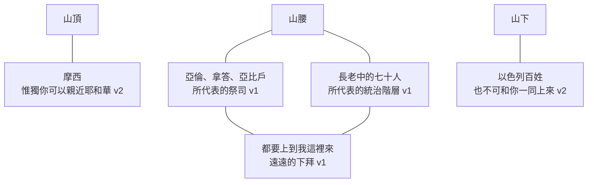
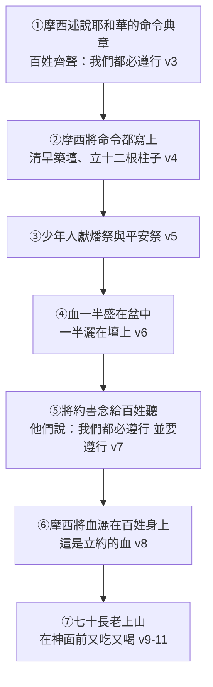

# 出埃及記 第24章

1. 耶和華對[[摩西]]說：你和[[亞倫]]、[[拿答]]、[[亞比戶]]，並以色列長老中的七十人，都要上到我這裡來，[[遠遠下拜|遠遠的下拜]]。
2. [[親近（qarab）|惟獨你可以親近耶和華]]；[[中保|他們卻不可親近]]；百姓也不可和你一同上來。
3. [[摩西]]下山，[[立約儀式|將耶和華的命令典章都述說與百姓聽]]。眾百姓齊聲說：耶和華所吩咐的，[[遵行（asah）|我們都必遵行]]。
4. [[摩西]][[寫上（kathab）|將耶和華的命令都寫上]]。清早起來，在[[山腳|山下]]築一座壇，[[十二根柱子|按以色列十二支派立十二根柱子]]，
5. 又打發以色列人中的少年人[[燔祭（olah）|去獻燔祭]]，[[平安祭（shelamim）|又向耶和華獻牛為平安祭]]。
6. [[摩西]][[灑（zaraq）|將血一半盛在盆中，一半灑在壇上]]；
7. [[約書（sefer habberith）|又將約書念給百姓聽]]。他們說：耶和華所吩咐的，[[遵行（asah）|我們都必遵行]]。
8. [[摩西]]將血[[灑（zaraq）|灑]]在百姓身上，說：你看！[[立約之血|這是立約的血]]，[[西乃之約|是耶和華按這一切話與你們立約的憑據]]。
9. [[摩西]]、[[亞倫]]、[[拿答]]、[[亞比戶]]，並以色列長老中的七十人，[[長老上山見神|都上了山]]。
10. [[看見神|他們看見以色列的神]]，[[神的榮耀|他腳下彷彿有平鋪的藍寶石]]，如同天色明淨。
11. 他的手不加害在以色列的尊者身上。[[看見神|他們觀看神]]；他們又吃又喝。
12. 耶和華對[[摩西]]說：你上山到我這裡來，住在這裡，[[摩西上山領石版|我要將石版並我所寫的律法和誡命賜給你]]，使你可以教訓百姓。
13. [[摩西]]和他的幫手[[約書亞]]起來，上了神的山。
14. [[摩西]]對長老說：你們在這裡等著，等到我們再回來，有[[亞倫]]、[[戶珥]]與你們同在。凡有爭訟的，都可以就近他們去。
15. [[摩西]]上山，[[雲彩（anan）|有雲彩把山遮蓋]]。
16. [[榮耀（kabod）|耶和華的榮耀停於]][[西乃山]]；[[雲彩（anan）|雲彩]]遮蓋山六天，第七天他從雲中召[[摩西]]。
17. 耶和華的[[榮耀（kabod）|榮耀]]在山頂上，在以色列人眼前，[[烈火（esh okelah）|形狀如烈火]]。
18. [[摩西]]進入雲中上山，[[四十晝夜|在山上四十晝夜]]。

<!-- fhl-map-links:start -->
## 相關地圖

- [[appendix/fhl_maps/maps/009|〈創圖四〉亞伯拉罕的生平]]
- [[appendix/fhl_maps/maps/019|〈出圖二〉以色列人出埃及到西乃山]]
<!-- fhl-map-links:end -->

---

## 本章知識節點

### 神學
- [[西乃之約]]
- [[立約之血]]
- [[神的榮耀]]
- [[中保]]
- [[遠遠下拜]]
- [[看見神]]
- [[四十晝夜]]

### 事件
- [[立約儀式]]
- [[長老上山見神]]
- [[摩西上山領石版]]
- [[十二根柱子]]

### 原文
- [[親近（qarab）]]
- [[下拜（shachah）]]
- [[寫上（kathab）]]
- [[燔祭（olah）]]
- [[平安祭（shelamim）]]
- [[灑（zaraq）]]
- [[約書（sefer habberith）]]
- [[遵行（asah）]]
- [[榮耀（kabod）]]
- [[雲彩（anan）]]
- [[烈火（esh okelah）]]

### 互文
- [[出19：8|出19：8 百姓未聞先諾必遵行]]
- [[出19：12-13|出19：12-13 山的界限不可摸山邊]]
- [[出20：21|出20：21 摩西挨近神所在的幽暗]]
- [[出24：12|出24：12 石版與神所寫的律法誡命]]
- [[來9：18-22|來9：18-22 若不流血罪就不得赦免]]
- [[來9：19|來9：19 摩西也把血灑在約書上]]
- [[來12：24|來12：24 所灑的血比亞伯的血所說更美]]
- [[彼前1：2|彼前1：2 蒙耶穌基督血所灑的]]
- [[來3：1-6|來3：1-6 摩西為僕人基督為兒子]]
- [[來10：19-20|來10：19-20 藉耶穌的血坦然進入至聖所]]
- [[太26：28|太26：28 這是我立約的血為多人流出]]
- [[路22：20|路22：20 這杯是用我血所立的新約]]
- [[林前11：25|林前11：25 這杯是用我的血所立的新約]]
- [[結1：26-27|結1：26-27 寶座彷彿藍寶石的形狀]]
- [[申9：9-11|申9：9-11 摩西四十晝夜不吃不喝]]
- [[申10：1-5|申10：1-5 石版上僅寫十條誡命]]
- [[王上18：31|王上18：31 以利亞取十二塊石頭築壇]]

---

## 本章整理

第二十四章是[[西乃之約]]的成交場面——前面幾章是條款，這一章是簽字。KC 一句話定了位：本段接續[[出20：21|出20:21]]，「中間的部分顯明摩西從耶和華所領受的內容」。CT 給本章的標題是【與神的三種關係】，分三層：祭司和七十長老在山腰遠遠的觀看並敬拜神（1、9-11節）、百姓在山下獻祭並聽律法的教訓（2下-8節）、[[摩西]]在山頂上親近並面見神（2上、12-18節）。

> [!important] 「上山」是本章的關鍵字——它出現了七次
>
> CT 與《串珠》都注意到這件事。《串珠》講得最完整：「『上山』是本章一個重要字彙，共出現七次之多（1, 2, 9, 12, 13, 15, 18）。作者描述他們==逐步上進，每次都到達一個更高的地方==，而最後則以摩西一人達到山頂為故事之高峰。」
>
> CT 從中讀出一句可以自問的話：==「基督徒的天路歷程，可從『上山』的程度窺知。」==

### 一、四個等級的距離（v1-2）

[[遠遠下拜|「遠遠的下拜」]]的原文意思是「保持距離」。誰能走到哪裡，本章一開頭就劃得清清楚楚——CT 把它整理成四個等級：

丁良才用聖幕的結構把這四個等級對了過去，一比就懂：「【比方】（一）大祭司，（二）祭司，（三）百姓。（一）至聖所，（二）聖所，（三）外院。」

KC 指出這個距離不是偶然，而是舊約的體質：==「這距離正是舊約中耶和華與祂百姓之間關係的特徵。」==而他立刻補上新約的翻轉：「對新約的教會而言，這距離不再存在了。希伯來書詳細地顯明，新約的信徒可以坦然無懼地進入聖所。」——並指出這是怎麼成為可能的：「藉著基督和祂的工作。」

CT 讀同一件事，把它讀成一句感恩：「『遠遠的下拜』說出我們本來的地位，因著墮落在罪惡中，無法親近神，只能遠遠的下拜，==但感謝主，如今障礙已除==，可以坦然無懼地來到施恩的寶座前」（[[來10：19-20|來10:19-20]]）。

> [!question] [[中保|為什麼「惟獨」摩西可以親近？]]
>
> CT 的答案是預表：「摩西：==預表耶穌基督，祂是更美之約的中保、屬天的大祭司==。」它接著把這句話推到底：「基督是神的愛子，原來唯獨祂可以親近父神，但自從祂在十字架上完成了救贖大工，通神之路已經開啟，==我們蒙恩的新約眾信徒都可以親近神==。」
>
> 《精讀本》同：「能夠活著到達耶和華臨在的山頂的人，只有摩西。==這裡的摩西象徵著人類的大祭司基督==」（[[來3：1-6|來3:1-6]]）。
>
> 但 CT 沒有把這變成廉價的特權，它補了一句責任：「得以親近神，一面是我們的特權，==另一面卻有我們當盡的責任——自己分別為聖==，因為神要在親近祂的人中顯為聖。」

### 二、[[立約儀式]]（v3-8）

《精讀本》把整場儀式的五個步驟拆得最清楚，這是本章的骨架：

[[遵行（asah）|「我們都必遵行」]]這句話，百姓在本章說了兩次（3、7節）。KC 把它連到[[出19：8|出19:8]]，算出這是**第三次**——而且他讀出一層很沉的東西：

| 次 | 何時說的 | KC 的觀察 |
| --- | --- | --- |
| 第一次（19:8） | 在還沒聽見耶和華要什麼之前 | 他們==還沒聽見==就這樣說 |
| 第二次（24:3） | 聽完了命令典章之後 | 聽了，==還是說同樣的話== |
| 第三次（24:7） | 約書念完之後 | 說得==比第3節更強==——不只說「要行」，還加上「並要遵行（聽從）」 |

KC 對這三次的評語很不留情，卻也很準：==「不幸的是，他們對自己毫無認識。他們將要藉著耶和華的典章得著這認識——那將顯明他們多麼無法履行自己的承諾。」==

這也正是 KC 讀第4節築壇的角度：「這就好像摩西意識到，==百姓永遠無法成就他們所應許的，他們只能在祭物的基礎上才得以站在神面前==。」

[[寫上（kathab）|「摩西將耶和華的命令都寫上」]]寫的是什麼？CT 劃得很清楚：「指寫在書上，==並不是石版上==，那是神用指頭寫的。」《中文聖經註釋》同：「這裡的寫上只包含約書，而不包含刻在石版上的誡命。」

> [!info] 為什麼「寫下來」這個動作本身就有份量？
>
> 《舊約背景註釋》給了古代近東的脈絡：「錄之於文字==不獨是作為交易的備忘，更代表條約或盟約的建立==（如本節），==付諸筆墨的行動本身已足啟動協議的條款==。」
>
> 它並記下當時識字的實況：埃及的象形文字和美索不達米亞的楔形文字都是複雜的音節系統，「因此絕大多數的人都是文盲，需要專業性的文書代寫代讀」。而全世界最古老的字母文字，正是「在==西乃半島的塞拉比特卡丁==挖掘到，來自主前第二千年紀中期的例證」——「全世界所有字母都是源自這個文字系統」。
>
> KC 從神學面讀同一個動作：「一旦有了一群被贖的百姓，一群神為自己分別出來的百姓，==祂就把祂對他們的心思記在成文的話語裡==。每個人都能知道神要什麼。祂不改變的話可以一再被查考。」

[[十二根柱子]]是做什麼用的？CT：「是為著紀念和見證，它們代表以色列十二支派，==他們全體都是與神立約的見證人==。」《中文聖經註釋》把這層見證拆成縱橫兩面，很漂亮：「不但在縱的方面，見證神與他們十二支派立約的證據，也在==橫的方面，標誌他們之間彼此立約同為神子民==……在這橫的方面來說，便有中國人之金蘭結義的含意。」

《丁道爾》注意到一個防迷信的細節，觀察很銳：「血禮的血是==灑在百姓身上，不是灑在代表他們的石柱上==（8節），證明了柱子不過是象徵，迷信成分並不存在。」

為什麼是[[燔祭（olah）|少年人]]獻祭？因為此時還沒有祭司。CT：「此時尚未有祭司，故由摩西自己擔任祭司的職任，而由少年人幫助摩西獻祭。」《丁道爾》從實用面補了一個很接地氣的理由：「選擇少年人擔任這些工作純粹是基於實用的理由，和法術無關，==身體不是強壯靈活，便無法將牛綁在石壇之上==。」KC 則猜他們是長子：「他讓少年人，可能是頭生的，獻上燔祭和平安祭。這工作後來由祭司和利未人接手，他們取代了長子的地位。」

《舊約背景註釋》解釋了為什麼[[平安祭（shelamim）|平安祭]]特別適合立約：「立約儀式獻這種祭十分適宜，==因為它是為參與者分享而設的==。完全燒在壇上的只是祭牲的一部分，餘下的部分用來設宴，==來締結人神之間的條約協定==。」

> [!important] [[立約之血|血的兩半：一半給神，一半給人]]
>
> 這是本章最核心的動作。CT 講得最簡潔：「盛在盆中的血是為全體以色列人，灑在壇上的血是為神，==神人雙方以血作立約的憑證==。」
>
> 它並讀出一層很動人的東西：「感謝神！神雖然瞭解我們人沒有履約的能力，==卻願意使自己受約的約束，所以一半的血是灑在壇上為著神的==。」
>
> 《每日研經叢書》一句話收束：「血分灑在代表耶威的壇與百姓之間，這樣==表示他們在聖約裏的合一==。」
>
> 《舊約背景註釋》解釋為什麼血要倒回壇上：「==血是生命力的精華，是以屬創造萬物的神所有==。因此之故，從祭牲收集來的血差不多一定是倒回壇上。這樣做可以提醒百姓生命神聖，和誰是生命的賜與者。」
>
> **而灑在百姓身上是罕見的。**《舊約背景註釋》：「把獻祭的血灑在百姓身上並不常見，==除本節以外只在亞倫和他兒子的膏立儀式中出現==（利八）。這個象徵性的行動建立特殊的關係，認定百姓為屬神之人。」

這血是什麼意思？各家的讀法差異很大，值得並陳。

《丁道爾》最誠實地承認證據不足：「這裡沒有解釋立約儀式的用意，它可能表示神和百姓從此成為『血親』……血禮可能表示：若果違反盟約的協定，便是將死亡招到自己頭上；==但也沒有證據支持==。這種流血雖然亦可能象徵捨棄生命，卻==似乎和赦罪無關==。」

**KC 的讀法最尖銳，而且和一般的理解相反**：他認為這血是一個**威脅**。「血是神對百姓一再應許要遵行祂話語的回應。血是傾倒至死的生命。==這正是以色列若違背耶和華的話所要臨到的。這血構成一個威脅==。」他接著把它與新約的血對照：「這血與新約的血形成對比。==從那血流出的是和好、赦免與祝福==。我們新約的信徒，是被那血所灑的（[[彼前1：2|彼前1:2]]、[[來12：24|來12:24]]）。」

**《精讀本》讀出雙面**：「一半的血象徵在公義的神面前的人類的死亡，而另一半則象徵著在神的慈愛裡人類的重生。」

**《中文聖經註釋》讀得最正面**：「祭牲的血，有代贖罪惡的含義，所以蒙灑血的人，==罪得赦免了==……灑血使罪得赦的人，已經得成聖潔，因此與神立約的人，也要在生活上分別為聖。」

KC 另指出一個本章沒寫、卻確實發生了的細節：「[[來9：19|按我們在希伯來書9章所讀的]]，==約書也被灑了血==，只是這裡沒有提到。」他並解釋為什麼書也要灑：「灑在書上顯明==死是一切的根基==。因此連整個律法的體系，也不是不用血就設立的。」

《丁道爾》給第8節下了一句很有份量的話：「立約的血。這句話在最後晚餐的莊重場面中再次出現（[[太26：28|太26:28]]）。==十架上的基督不但（和摩西一樣）是盟約的中保，更是立約的犧牲==。」

### 三、[[長老上山見神]]（v9-11）

> [!question] [[看見神|「他們看見以色列的神」——但聖經說人看見神就不能活？]]
>
> 這是本章最大的解經難題。CT 直接承認衝突：「這句話直接與聖經中『人不能看見神』的話（33:20）相抵觸」，並給出三個解法：「①他們所看見的是==神的榮耀==；②三一神中具有人形像的==子神==；③他們==僅看見神腳下的部份==。」
>
> 《中文聖經註釋》提出一個文本上的證據支持第三解，很有意思：「原來==七十士譯本卻在這句話後面仍有『所站的地方』之字句==。也許七十士譯本並不是擅加，乃是依據較古的抄本。」它並推想當時的實況：「當這些人上山去『遠遠的下拜』時，==他們頭也不敢抬起==，就只能看到以色列的神所站的地方了。」
>
> 賈斯樂郝威給的解答走同一條路：「人看見神並非看到神真正的『本質實體』（essence of God），而是看到==『神的榮耀』==。」他並提醒一個常被忽略的前提：「==首先須瞭解的是神邀請他們上來的==（出24:1）。」
>
> **KC 的讀法另闢蹊徑，很值得記**：他認為關鍵在「腳下」。「摩西、以及後來的以西結所看見的，==不是祂恩典的榮耀，而是祂聖潔的榮耀==……摩西和其他人所看見的，是與==祂的腳==相連的，那說到==祂在聖潔中所行的路==。」而在那路中顯出的，是「如同天色明淨」——「祂所行的，==使那看不見的居所變成看得見的==。」

[[神的榮耀|藍寶石]]是什麼？CT：「『藍寶石』是神寶座的形像」（[[結1：26-27|結1:26-27]]）。《中文聖經註釋》補了一個考古細節：「按考古學家的考證，以色列人出埃及時代，==在塞浦路斯島已有這種天然的藍寶石==，而埃及則已有加工雕琢的藍寶石了。」

「他們又吃又喝」——這一句在本章的位置很關鍵。CT 讀作立約的歡喜：「乃形容立約之後的歡喜快樂情景」，並指這「預表新約主的晚餐」（[[路22：20]]、[[林前11：25]]）。《丁道爾》從獻祭的實務解釋，冷靜而有說服力：「祭筵也是任何牽涉到平安祭之崇拜儀式自然而然的一部分。==不然祭肉怎麼處理呢？==」

KC 的讀法最溫暖：「神沒有向這一群人發出吞滅的火，反倒讓他們一面吃喝一面觀看這景象，==這是西乃的黑暗與威脅之中，一道恩典的光==。祂彷彿收斂了祂全部威嚴的榮耀，把大部分遮藏起來。」

CT 從「觀看神」與「又吃又喝」並存，排出一個很實際的階梯：「一面觀看神，另一面又吃又喝；一面敬畏地瞻仰神，另一面敬虔地過日常的生活，==這是信徒最理想的屬靈境界==。其次，將觀看神和吃喝分開，將屬靈生活和屬世生活分開，只顧敬拜而不顧正常的生活。==最壞的，不觀看神只顧吃喝==。」

丁良才留下一句很沉的提醒，把這場高峰體驗拉回現實：「拿答亞比戶雖是這樣蒙恩，==後來卻仍被神燒滅==，那七十位長老也都死在曠野，==這也是我們眾人的警誡==。」他並點出他們憑什麼能與神來往：「這些長老==因著所獻的祭（不是因看守律法）==才能和神來往。」

《丁道爾》另注意到一個文本可靠性的旁證，論證很妙：拿答和亞比戶後來受審判身亡，「他們在此出現==更加證實了本段傳統的可靠性，因為誰也不會將他們的名字，加插在這麼重要事件的記錄中==」。

### 四、[[摩西上山領石版]]（v12-18）

神召摩西上山[[榮耀（kabod）|領受石版]]（[[出24：12|12節]]），[[申10：1-5|石版上所寫的僅有十條誡命]]。摩西帶[[約書亞]]上去，[[雲彩（anan）|雲彩]]遮蓋[[西乃山]]六天，第七天神從雲中召他，摩西進入雲中，在山上[[四十晝夜]]。

第12節的「住在這裡」值得注意。KC 讀出一個停留的重量：「摩西可以說==不是只來探訪，而是搬去與耶和華同住==。」但他立刻補上另一面：「即使他回來了，他在靈裡仍與耶和華同在。==他從與祂的關係中生活、行事==。」

約書亞為什麼跟著上去？KC 給了一個關於栽培的觀察：「繼出17章之後，這裡是第二次提到約書亞，又是與摩西連在一起。==他可以得著更靠近耶和華的經歷==。其他人必須留下。」

摩西不在時怎麼辦？KC 注意到他沒有丟下百姓：「在他缺席期間，==摩西沒有把百姓丟給命運==。他安排了代理人。」——那正是[[亞倫]]和[[戶珥]]，出17章一同在山上扶持摩西雙手的那兩位。

> [!important] 六天的等候——這是本章最容易被跳過的一段
>
> 雲彩遮蓋山六天，第七天神才召摩西。這六天神什麼也沒說。
>
> CT 讀出它的用意：「『六天』的時間想必是要讓摩西==分別為聖、安靜等候，預備好自己迎見神==。」它並指出這是一場考驗：「『六天』之久，沒有動靜，==考驗摩西的信心、順服、謙卑和忍耐==，通過這個考驗，才能看見神的顯現。」
>
> KC 的對照最有力：「==他沒有像後來的掃羅那樣失去耐性==，掃羅也必須等候，卻不耐煩地行動，因而失去了他的王位。」

第17節的[[烈火（esh okelah）|「形狀如烈火」]]是本章結尾一個很重的反差。CT：「以色列人所看見的，是神的榮耀顯現在山頂上，形狀好像烈火，==因為我們的神乃是烈火==。」

但 KC 指出：同一個榮耀，摩西是進去的，以色列人卻只看見火。他把這個差別講得很透，也很扎人：

==「摩西所進入的那榮耀，對以色列人而言卻似乎是吞滅的火。這裡我們看見與我們所處的時代最大的不同。==凡已被稱為配得神同在的人，在那裡必感到自在。==凡以為自己能靠著律法討神喜悅的人，一想到神的同在就總是戰兢恐懼==。」

[[四十晝夜]]是什麼意思？CT：「在聖經中象徵神的試煉」，並讀出一個對照：「摩西在『雲裡』表徵聖靈裡，他靠著聖靈勝過了考驗；==以色列人在山下，勝不過考驗而拜了金牛犢==（參32:4）。」——這一句正好把本章接到了下一章，全卷最黑暗的轉折就在山下等著。

KC 給本章的收束落在摩西進雲之後：「第七天耶和華召他。摩西就進入雲中；==他進入神的榮耀==，在那裡住了四十晝夜。在那段時間裡，他從神那裡得聽、得見美好的事，==為著神要住在祂百姓中間==。」——這也正是接下來出25-31章的內容。

**參考資料**
https://biblehub.com/study/exodus/24.htm
https://www.ccbiblestudy.org/Old%20Testament/02Exo/02CT24.htm
https://www.ccbiblestudy.org/Old%20Testament/02Exo/02GT24.htm
https://www.kingcomments.com/en/bible-studies/Exo/24
