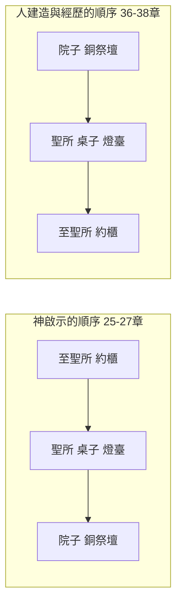

# 出埃及記 第25章

1. 耶和華曉諭[[摩西]]說：
2. 你告訴以色列人當為我送[[禮物（terumah）|禮物]]來；凡[[甘心樂意的奉獻|甘心樂意]]的，你們就可以收下歸我。
3. 所要收的[[禮物（terumah）|禮物]]：就是金、銀、銅，
4. 藍色、紫色、朱紅色線，細麻，山羊毛，
5. 染紅的公羊皮，海狗皮，[[皂莢木（atzei shittim）|皂莢木]]，
6. 點燈的油並做膏油和香的香料，
7. 紅瑪瑙與別樣的寶石，可以鑲嵌在以弗得和胸牌上。
8. 又當為我造聖所，使我可以住在他們中間。
9. 製造帳幕和其中的一切器具都要照我所指示你的樣式。
10. 要用[[皂莢木（atzei shittim）|皂莢木]]做一櫃，長二肘半，寬一肘半，高一肘半。
11. 要裡外包上精金，四圍鑲上金牙邊。
12. 也要鑄四個金環，安在櫃的四腳上；這邊兩環，那邊兩環。
13. 要用[[皂莢木（atzei shittim）|皂莢木]]做兩根槓，用金包裹。
14. 要把槓穿在櫃旁的環內，以便抬櫃。
15. 這槓要常在櫃的環內，不可抽出來。
16. 必將我所要賜給你的[[法版（edut）|法版]]放在櫃裡。
17. 要用精金做[[施恩座]]（施恩：或作蔽罪；下同），長二肘半，寬一肘半。
18. 要用金子錘出兩個[[基路伯（施恩座）|基路伯]]來，安在[[施恩座]]的兩頭。
19. 這頭做一個[[基路伯（施恩座）|基路伯]]，那頭做一個基路伯，[[基路伯（施恩座）|二基路伯]]要接連一塊，在[[施恩座]]的兩頭。
20. [[基路伯（施恩座）|二基路伯]]要高張翅膀，遮掩[[施恩座]]。基路伯要臉對臉，朝著施恩座。
21. 要將[[施恩座]]安在櫃的上邊，又將我所要賜給你的[[法版（edut）|法版]]放在櫃裡。
22. 我要在那裡與你相會，又要從[[約櫃|法櫃]][[施恩座]]上[[基路伯（施恩座）|二基路伯]]中間，和你說我所要吩咐你傳給以色列人的一切事。
23. 要用[[皂莢木（atzei shittim）|皂莢木]]做一張桌子，長二肘，寬一肘，高一肘半。
24. 要包上精金，四圍鑲上金牙邊。
25. 桌子的四圍各做一掌寬的橫梁，橫梁上鑲著金牙邊。
26. 要做四個金環，安在桌子的四角上，就是桌子四腳上的四角。
27. 安環子的地方要挨近橫梁，可以穿槓抬桌子。
28. 要用[[皂莢木（atzei shittim）|皂莢木]]做兩根槓，用金包裹，以便抬桌子。
29. 要做桌子上的盤子、調羹，並奠酒的爵和瓶；這都要用精金製作。
30. 又要在桌子上，在我面前，常擺陳設餅。
31. 要用精金做一個[[金燈臺|燈臺]]。燈臺的座和幹與杯、球、花，都要接連一塊錘出來。
32. [[金燈臺|燈臺]]兩旁要杈出六個枝子：這旁三個，那旁三個。
33. 這旁每枝上有三個杯，形狀像杏花，有球，有花；那旁每枝上也有三個杯，形狀像杏花，有球，有花。從[[金燈臺|燈臺]]杈出來的六個枝子都是如此。
34. [[金燈臺|燈臺]]上有四個杯，形狀像杏花，有球，有花。
35. [[金燈臺|燈臺]]每兩個枝子以下有球與枝子接連一塊。燈臺出的六個枝子都是如此。
36. 球和枝子要接連一塊，都是一塊精金錘出來的。
37. 要做[[金燈臺|燈臺]]的七個燈盞。祭司要點這燈，使燈光對照。
38. [[金燈臺|燈臺]]的蠟剪和蠟花盤也是要精金的。
39. 做[[金燈臺|燈臺]]和這一切的器具要用精金一他連得。
40. 要謹慎做這些物件，都要照著在山上指示你的樣式。

<!-- fhl-map-links:start -->
## 相關地圖

- [[appendix/fhl_maps/maps/009|〈創圖四〉亞伯拉罕的生平]]
- [[appendix/fhl_maps/maps/019|〈出圖二〉以色列人出埃及到西乃山]]
<!-- fhl-map-links:end -->

---

## 本章知識節點

### 神學
- [[神住在人間]]
- [[山上的樣式]]
- [[天上事的形狀和影像（來8：5）]]
- [[頭一層帳幕作現今的表樣（來9：8-9）]]
- [[天上真帳幕的祭物（來9：11-12）]]
- [[天上真聖所（來9：23-24）]]
- [[挽回祭（羅3：25）]]
- [[耶穌以身體為殿（約2：19-21）]]
- [[世界的光（約8：12）]]
- [[七個金燈臺的奧祕（啟1：20）]]
- [[精金之城（啟21：18）]]
- [[四活物的形象（結1：5-11）]]
- [[金燈臺與聖靈（亞4：1-6）]]

### 物品豫表
- [[會幕材料的豫表]]
- [[約櫃]]
- [[施恩座]]
- [[基路伯（施恩座）]]
- [[陳設餅桌子]]
- [[金燈臺]]
- [[聖殿中的基路伯（王上6：23-28）]]

### 原文
- [[皂莢木（atzei shittim）]]
- [[禮物（terumah）]]
- [[法版（edut）]]

### 實踐
- [[甘心樂意的奉獻]]
- [[甘心樂意的奉獻（林後9：7）]]
- [[不可摸約櫃（撒下6：6-7）]]

---

## 本章整理

出埃及記第二十五章開啟了神在西乃山上對摩西關於建造會幕的詳細指示。丁良才點出一個很少人注意的比例：==聖書用兩章記載創造天地和其中的萬物，卻用十一章記載製造會幕的事==（25-31、35-40章）。

KC 為整段開宗明義定了位：[[天上事的形狀和影像（來8：5）|會幕不是神真正的居所，而是代表它]]。他並列出聖經中神**真正**的三個居所：**天**（王上8:39）、**主耶穌**（約1:14，「住」原文直譯是「支搭帳幕」）、**教會**（弗2:22）。而會幕是曠野中的一頂帳棚——「這可以應用在地上的教會，聖靈住在其中」。

KC 對 25-31 章這一整篇講論的結構分析很清楚：這篇講論「被『耶和華說』或『耶和華曉諭』穿插了**七次**」，可分四部分——25-27章是**器具**（神在基督裡向人的啟示）、28-29章是**祭司職分**（人得以親近神的憑藉）、30章是**人憑什麼親近神**、31章是**神指派誰來建造**。

### 一、建造會幕的材料與奉獻原則（v1-9）

神首先吩咐摩西要以色列人「當為我送[[禮物（terumah）|禮物]]來」，並強調「凡[[甘心樂意的奉獻|甘心樂意的]]，你們就可以收下歸我」（v2）。CT指出，這裡的奉獻原則必須是自願而非被逼的，神悅納出於內心驅策的奉獻，這預表了新約中[[甘心樂意的奉獻（林後9：7）|「捐得樂意的人是神所喜愛的」]]之教導。GT進一步說明，這些材料多是以色列人出埃及時向埃及人索取的財物。

《丁道爾》把原文的力道譯了出來，很生動：「希伯來文生動地描述：每個==『其心驅使他許願』==的人；==這人熱心得無法自制==。」

《丁道爾》並從這幾節提煉出三個原則，說它們「歷久常新」：**①給神的奉獻必須是自願而非被逼的**；**②神的目標和意向就是住在祂子民中間**（8節），這是建築帳幕的核心理由；**③執行神大計的關鍵在於順服**（9節）——而它指出「三十五至四十章一再強調這最後的一點」。

> [!note] 兩處要修正的說法
>
> **①「照山上的樣式」出現的次數：是四次，不是七次。**
>
> 常見的講法是「CT總結這句話在聖經中出現七次」。CT 的原文是：「神在出埃及記中，==曾四次告訴摩西==，在他建造會幕時，一定要『完全照著在山上指示你的樣式』（==出25:9、40；26:30；27:8==）。」
>
> 「七次」很可能是把 KC 講的**另一件事**混了進來——KC 說的是 25-31 章這篇講論「被『耶和華說』或『耶和華曉諭』==穿插了七次==」。那是「耶和華曉諭摩西說」的次數，與「照山上的樣式」無關。==兩個數字、兩件事，不能相加也不能互換。==
>
> **②古代近東的材料背景不是 KC 說的，是《舊約背景註釋》。**
>
> 常見的講法是「KC 也從物質特性指出，這些貴重金屬與布料在古代近東象徵王權與神聖，而皂莢木因其耐用與抗腐特性，成為曠野中建造聖具的理想材料」。==KC 完全沒有說這些==——KC 的七類講的全是預表（金屬=神的所是、布料=基督為人的榮耀、皮=十字架的工作……）。
>
> 古代近東那一層是《舊約背景註釋》的：「金、銀和青銅是王國時代之前以色列人可用的金屬和合金中，最重要的幾個，==它們是貿易的貨幣==」；「皂莢木：這是西乃半島出產的一種沙漠樹木，==木質極硬，宜於製造聖幕及其陳設==」。

材料的七大類，三家從三個完全不同的角度讀——攤開來對照，這一章的層次才出得來：

| 材料 | KC：這七類各說什麼 | CT：靈意註解 | 《舊約背景註釋》／《丁道爾》：實務背景 |
| --- | --- | --- | --- |
| 金、銀、銅（v3） | **金屬**——說到神的所是與本性 | 金＝神的性情與榮耀；銀＝救贖；銅＝審判 | 德萊維的原則：==越接近神，用的金屬就越珍貴==；死海以南的亞拉巴有豐富銅礦，西乃半島出產金子（丁道爾） |
| 藍、紫、朱紅色線，細麻，山羊毛（v4） | **布料**——說到主耶穌為人在地上的榮耀 | 藍＝屬天；紫＝君尊；朱紅＝流血犧牲；細麻＝聖潔；山羊毛＝人的罪 | 顏色「由最珍貴最貴重者開始，遞減列出」；染料多為舶來品（背景註釋）。「朱紅」直譯是「紅蟲」，指==胭脂蟲==，英文 crimson 由其阿拉伯語 kirmiz 而來（丁道爾） |
| 染紅的公羊皮、海狗皮（v5） | **皮**——同說主耶穌為人，但更specifically連於十字架的工作 | 公羊皮＝流血的救贖；海狗皮＝外表無佳形美容卻經得起風吹雨打 | 「海狗」可能是==儒艮或海豚==，紅海都有出產（背景註釋） |
| 皂莢木（v5） | **木**——說到主耶穌完全的人性 | 表徵堅固的人性，「像根出於乾地」 | 西乃半島出產的沙漠樹木，==木質極硬==；「其樹出土上截不高，下截入土有三十至七十呎不等。此木不易朽爛，又不沉重」（中文聖經註釋） |
| 點燈的油（v6） | **油**——代表聖靈 | 表徵聖靈 | 指橄欖油（CT） |
| 膏油和香的香料（v6） | **香料**——代表主耶穌內在的、屬個人的榮美 | 香＝禱告；香料＝基督馨香之氣 | — |
| 紅瑪瑙與寶石（v7） | **寶石**——說到神的榮美，反映在個別信徒身上 | 表徵經過聖靈變化更新後的信徒各樣不同性格表現 | — |

《丁道爾》另從材料的來源推出一個年代線索，很有意思：「儘管海厄特不同意這見解：==本節不提鐵器，很可能也證明了本段是早期的作品==。」它並替遊牧民族的財力辯護：「遊牧民族居於帳棚並不表示他們沒有財寶。==看看現時近東帳幕中珍奇的地毯==，就可得到證明。」

《中文聖經註釋》對顏色的昂貴程度講得最具體：這三種顏色的線「在當時==比金銀銅還要值錢==，因為是要從深海獲取貝殼類生物來作染料的。中文所用的藍色，是一種紫羅蘭藍，為最貴重的顏色。==因為其染料價值，非千萬富豪無法支付==。」

神吩咐建造這一切的核心目的記載於第八節：「又當為我造聖所，[[神住在人間|使我可以住在他們中間]]。」CT強調，神的目標和意向就是住在祂子民中間，這是建築帳幕的核心理由。會幕是神住在人間的雛形，最終應驗於基督道成肉身「住在」我們中間（約1:14），並延續到[[耶穌以身體為殿（約2：19-21）|教會作為神的居所]]。

CT 為「住」這個字補了一個很漂亮的觀察，把整部聖經串起來了：「本節的『住』字，原文是 shekinah。==在伊甸園裡，耶和華只是『行走』；亞伯拉罕也是與神『同行』。神一直沒有『住在』人間。==神要以色列人建造會幕，是要與人同住。基督來世界是住在人間。教會是神的居所。」

第九節則強調建造必須「[[山上的樣式|照我所指示你的樣式]]」，CT與GT一致指出，這表明**神的事工源於神的啟示**，且**神的一切事工要按照神的方法執行**。BH說明這模式是[[天上事的形狀和影像（來8：5）|天上事物的形狀和影像]]。

> [!question] 丁良才：有十一件事，聖經根本沒寫——而這是故意的
>
> 這是本章最值得記住的一段觀察。丁良才列出會幕記載中==聖書上沒有記明==的十一件事：「①約櫃各板的厚薄；②施恩座的厚薄；③基路伯的詳情；④桌子的厚薄；⑤燈檯的大小；⑥豎板的厚薄；⑦門的厚薄；⑧基路伯幔子的掛法；⑨公羊皮蓋的大小；⑩海狗皮的大小；⑪銅祭壇板子的厚薄等。」
>
> 他的結論很銳利：「所以==現在沒有人能完完全全的造成會幕==，這無非是出於神的旨意，==免得後人按式另造會幕==，說是完全照著神在山上指示摩西的樣式造的，==甚至在教會裡有分門結黨迷惑人的事==。」
>
> ——換句話說，那些「缺漏」不是抄本壞了，是防呆設計。

### 二、至聖所的核心：[[約櫃|法櫃]]與[[施恩座]]（v10-22）

神的啟示從至聖所最隱密、最核心的法櫃開始。KC 一句話點出這個順序的意義：==「它對人最隱藏，對神卻最寶貴。」==

但**啟示的順序和建造的順序是相反的**——CT 抓到了這個對稱，這是全段最漂亮的結構觀察：

CT 的話：「==神的啟示先是從至聖所開始，自約櫃至銅祭壇。但當他們建造時就先從外面開始==（出36-38章），==從人的經歷開始：罪人進入會幕，最先見到的是銅祭壇==。這與五祭的次序相同。」丁良才則把 25-31 章整段讀成一趟往返：「25:1-27:19==由裡往外==，從神顯現的地方到罪人所站的地方；27:20-31:18==由外往裡==，從罪人所站地方到神所住的地方。」

法櫃要用[[皂莢木（atzei shittim）|皂莢木]]製作，裡外包上精金（v10-11）。CT指出，皂莢木表徵基督堅固的人性，精金表徵基督的神性，兩者結合預表耶穌基督的神人二性。KC 說得更整齊：約櫃連同施恩座代表兩重真理——「①關乎主耶穌位格的真理：==祂在一個位格裡是神（精金）也是人（木）==；②主耶穌工作的真理，就是施恩座所說的。」

CT 對「裡外包上精金」的讀法很細：「裡面，人不見；外面，人皆見。==表徵神性彰顯於人性中==。」

尺寸是長二肘半、寬一肘半、高一肘半。CT 換算給了公制：「==一肘約合45公分==，故約櫃的尺寸約為長一百十三公分，寬與高均為六十八公分。」它並讀出數字的意義：「尺寸由五和三的半數所組成，而『五』表徵人向神負責，『三』表徵三一神的表現。」

法櫃的四腳安上金環，穿入包金的皂莢木槓，且槓要常在環內不可抽出來（v12-15）。CT 給了一個很實務的解釋：「大多數解經家認為==應當安在兩短頭而非兩長邊==，這樣，才可以穿杠抬櫃向前直行，==無須迴旋==。」它並注意到一個力學細節：「金環安在櫃的四腳上，使抬櫃時，==櫃高過人==……==上重下輕：支點在底部的約櫃不易抬，壓力大==。」

KC 指出誰能抬：「約櫃必須由利未人抬。==對約櫃的照管託付給神所指派的人==。在我們的時代，那意味著所有的信徒。==新約的教會裡不存在一個特別的階級==。」

法櫃內要放置神所賜的[[法版（edut）|法版]]（v16）。KC 的讀法把它接到基督身上：「這代表主耶穌說：==『你的律法在我心裡』==（詩40:8）。祂的心願就是遵行神的旨意。」

施恩座用精金製作，尺寸與法櫃相同，其上有兩個用金子錘出的[[基路伯（施恩座）|基路伯]]，高張翅膀遮掩施恩座，臉對臉朝著施恩座（v17-20）。CT說明「施恩座」原文有「遮蓋」之意，表徵聖潔的神樂意赦免遮蓋人的罪。

> [!important] [[挽回祭（羅3：25）|為什麼血要灑在施恩座上？]]——KC 把這個邏輯講得最緊
>
> 「施恩座遮蓋著裡面有律法的約櫃。==律法定人的罪==。施恩座上有兩個基路伯，與施恩座是一整塊。基路伯守護神的聖潔，==是祂審判的執行者==（創3:24）。
>
> ==因此血要灑在施恩座上。那血彷彿在說：神聖潔公義的要求已經被滿足了。==審判已經執行，但它是執行在一個無辜的祭物身上，==好叫有罪的可以得赦免而不受刑罰==。」
>
> 神應許要在施恩座上二基路伯中間與摩西相會並說話（v22）。KC：「神坐在基路伯之上為王。==這是神與百姓相會的地方，這不該使我們驚訝==。神在祂的兒子和祂所成就的工作上，得著了完全的喜悅。」——那正是[[挽回祭（羅3：25）|羅3:25]]所說的「神設立耶穌作挽回祭」，而「挽回祭」這個字就是施恩座。

CT 對第22節的總結同樣有力：這表明==人必須滿足神公義的要求，才能憑神的恩典朝見神==——神與人交通和啟示皆基於公義與恩典的原則。

### 三、聖所的器具：[[陳設餅桌子]]與[[金燈臺]]（v23-40）

聖所內的陳設餅桌子同樣用皂莢木包精金製作，四圍有金牙邊與橫樑，並配有金環與包金木槓以便抬運（v23-28）。桌上常擺陳設餅（v30），BH指出這十二個餅代表以色列十二支派；CT進一步指明陳設餅預表基督是生命的糧（約6:35）。

KC 對桌子的讀法有一個很細膩的層次，是本段最值得記的：

**①十二個餅是誰？**「桌上的十二個餅代表神的百姓——十二支派。==擺著陳設餅的桌子給出這樣的圖畫：神的百姓被主耶穌獻給神，作祂的食物==。神看見祂的百姓這樣與祂的兒子相連時，就歡喜。」

**②為什麼桌子比約櫃小？**「==神兒女的交通，是比約櫃所及的圈子更小的一個圈子==。約櫃作為主耶穌的表號，及於所有的人。==每個人都被邀請來==。桌子代表那些==已經來了的==人，是神可以與之相交的人。」

**③為什麼桌子和約櫃一樣高？**「==罪人和信徒，都只能藉著並在主耶穌裡來到神面前==。」

**④為什麼桌子也有槓？**「那意味著我們在世上的旅程中必須帶著兩樣東西：①關乎基督和祂工作的真理，呈現在約櫃裡；②與神相交的真理。」

CT 從尺寸讀出同一件事：桌子「長二肘寬一肘（平方）表徵基督供應的生命完美且完整，==高一肘半與法櫃同高==，表徵這生命能滿足神公義的要求」。

金燈臺用一他連得精金錘出，有中央主幹與兩旁各三個枝子，裝飾有杏花形狀的杯、球、花（v31-36）。CT指出金燈臺預表基督與教會，教會在暗世中為主發光照耀。

> [!question] 為什麼燈臺只記重量、不記尺寸？
>
> 這是全章一個很容易滑過去的細節，KC 卻從中讀出一句很美的話：
>
> 「燈臺沒有提到尺寸，==提到的卻是重量==。==我們無法測量主耶穌的榮耀，但它可以在我們心裡被稱量==。」

KC 對燈臺的讀法環環相扣：燈臺托著七盞燈，正如[[七個金燈臺的奧祕（啟1：20）|啟1:20]]的主耶穌托著七個教會——「燈臺發光，那也是眾地方教會的任務。==教會只能在與那托著它的那一位相連中發光==。」而光先落在哪裡？「==燈臺的光首先落在燈臺自己身上==。在聖所裡我們得以越來越多地看見主耶穌是誰。光也落在桌子上，就是眾聖徒的交通。」

枝子與主幹的關係也是同一個道理：「燈臺的枝子從主幹出來，與它成為一體。==教會照樣是藉著主耶穌的工作被造成的，並與祂成為一體==。枝子上的裝飾說到主耶穌工作的果子。」

BH說明杏花是春天最早開花的植物，象徵復活的生命與神的看顧；七個燈盞表徵教會在地上完滿彰顯發光的見證。附屬的蠟剪與蠟花盤也是精金所製（v38），CT指出這表徵接受神的修剪以維持明亮。KC 讀器具的用途：「這些器具是為了讓光明亮地照耀。==主耶穌用各樣的方法叫屬祂的人放出明亮的光==。最重要的，祂賜下聖靈來教導祂的教會認識祂的榮耀。」——並引出那句警告：「不要銷滅聖靈的感動。」

最後，神再次嚴囑「要謹慎做這些物件，都要照著在山上指示你的樣式」（v40）。

### 四、跨章脈絡與預表整理

出埃及記二十五章不僅是建造會幕的工程藍圖，更是神救贖計畫的屬天預表。本章確立了[[山上的樣式]]原則，表明地上的會幕是[[天上事的形狀和影像（來8：5）|「天上事的形狀和影像」]]。從材料到器具，無一不指向基督的位格與工作：皂莢木與精金預表基督的神人二性；施恩座預表基督成為我們的[[挽回祭（羅3：25）|挽回祭]]；陳設餅預表基督為生命之糧；金燈臺預表基督為[[世界的光（約8：12）|世界的光]]，並延伸至教會作為[[七個金燈臺的奧祕（啟1：20）|七個金燈臺的奧祕]]。

會幕作為神住在人中間的雛形，最終應驗於[[耶穌以身體為殿（約2：19-21）|耶穌以身體為殿]]，並在永世中應驗於「神的帳幕在人間」的新耶路撒冷——那座[[精金之城（啟21：18）|精金之城]]。這些新約的印證，充分顯示舊約會幕的器具與條例，實為[[頭一層帳幕作現今的表樣（來9：8-9）|「頭一層帳幕作現今的一個表樣」]]，引導信徒藉著[[天上真帳幕的祭物（來9：11-12）|基督的血]]進入[[天上真聖所（來9：23-24）|「天上真聖所」]]。

KC 給整章的收束，落在一個很個人的要求上：「所有這些材料都必須用來造一座『聖所』，好叫耶和華可以住在祂百姓中間。==若我們的心願是主耶穌能與祂的百姓、就是教會同住，我們就會把我們全部的生命和所擁有的一切都給祂==。」

**參考資料**
https://biblehub.com/study/exodus/25.htm
https://www.ccbiblestudy.org/Old%20Testament/02Exo/02CT25.htm
https://www.ccbiblestudy.org/Old%20Testament/02Exo/02GT25.htm
https://www.kingcomments.com/en/bible-studies/Exo/25
