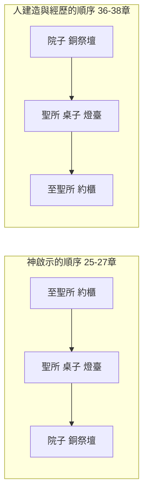

# 出埃及記 第25章

<!-- chapter-navigation:start -->
| [前一章](../02%20出埃及記/第24章.md) | [回目錄](../02%20出埃及記/全書目錄及綱要.md) | [下一章](../02%20出埃及記/第26章.md) |
| :--- | :---: | ---: |
<!-- chapter-navigation:end -->

1. 耶和華曉諭[[摩西]]說：
2. 你告訴以色列人當為我送[[禮物]]來；凡[[甘心樂意的奉獻|甘心樂意]]的，你們就可以收下歸我。
3. 所要收的[[禮物]]：就是金、銀、銅，
4. [[藍色、紫色、朱紅色線|藍色、紫色、朱紅色線]]，[[撚的細麻|細麻]]，山羊毛，
5. 染紅的公羊皮，[[海狗皮頂蓋|海狗皮]]，[[皂莢木]]，
6. 點燈的油並做膏油和香的香料，
7. [[紅瑪瑙（紀念石）|紅瑪瑙]]與別樣的寶石，可以鑲嵌在[[以弗得]]和[[胸牌（決斷胸牌）|胸牌]]上。
8. 又當為我造[[聖所]]，使我可以[[神住在人間|住在他們中間]]。
9. 製造[[會幕（帳幕整體）|帳幕]]和其中的一切器具都要照我[[山上的樣式|所指示你的樣式]]。
10. 要用[[皂莢木]]做一櫃，長二肘半，寬一肘半，高一肘半。
11. 要裡外包上[[精金]]，四圍鑲上金牙邊。
12. 也要鑄四個金環，安在櫃的四腳上；這邊兩環，那邊兩環。
13. 要用[[皂莢木]]做兩根槓，用金包裹。
14. 要把槓穿在櫃旁的環內，以便抬櫃。
15. 這槓要常在櫃的環內，不可抽出來。
16. 必將我所要賜給你的[[法版]]放在櫃裡。
17. 要用精金做[[施恩座]]（施恩：或作蔽罪；下同），長二肘半，寬一肘半。
18. 要用金子錘出兩個[[基路伯（施恩座）|基路伯]]來，安在[[施恩座]]的兩頭。
19. 這頭做一個[[基路伯（施恩座）|基路伯]]，那頭做一個基路伯，[[基路伯（施恩座）|二基路伯]]要接連一塊，在[[施恩座]]的兩頭。
20. [[基路伯（施恩座）|二基路伯]]要高張翅膀，遮掩[[施恩座]]。基路伯要臉對臉，朝著施恩座。
21. 要將[[施恩座]]安在櫃的上邊，又將我所要賜給你的[[法版]]放在櫃裡。
22. 我要在那裡與你相會，又要從[[約櫃|法櫃]][[施恩座]]上[[二基路伯中間說話的聲音（施恩座微聲）|二基路伯中間]]，和你說我所要吩咐你傳給以色列人的一切事。
23. 要用[[皂莢木]]做一張桌子，長二肘，寬一肘，高一肘半。
24. 要包上精金，四圍鑲上金牙邊。
25. 桌子的四圍各做一掌寬的橫梁，橫梁上鑲著金牙邊。
26. 要做四個金環，安在桌子的四角上，就是桌子四腳上的四角。
27. 安環子的地方要挨近橫梁，可以穿槓抬桌子。
28. 要用[[皂莢木]]做兩根槓，用金包裹，以便抬桌子。
29. 要做桌子上的盤子、調羹，並[[奠酒]]的爵和瓶；這都要用精金製作。
30. 又要在桌子上，在我面前，常擺[[陳設餅十二個餅預表以色列十二支派|陳設餅]]。
31. 要用精金做一個[[金燈臺|燈臺]]。燈臺的座和幹與杯、球、花，都要接連一塊[[銀號製作工藝（錘出法）|錘出來]]。
32. [[金燈臺|燈臺]]兩旁要杈出六個枝子：這旁三個，那旁三個。
33. 這旁每枝上有三個杯，形狀像[[杏花杯球花（燈臺裝飾）|杏花]]，有球，有花；那旁每枝上也有三個杯，形狀像杏花，有球，有花。從[[金燈臺|燈臺]]杈出來的六個枝子都是如此。
34. [[金燈臺|燈臺]]上有四個杯，形狀像杏花，有球，有花。
35. [[金燈臺|燈臺]]每兩個枝子以下有球與枝子接連一塊。燈臺出的六個枝子都是如此。
36. 球和枝子要接連一塊，都是一塊精金錘出來的。
37. 要做[[金燈臺|燈臺]]的七個燈盞。祭司要點這燈，使燈光對照。
38. [[金燈臺|燈臺]]的蠟剪和蠟花盤也是要精金的。
39. 做[[金燈臺|燈臺]]和這一切的器具要用[[一他連得精金（燈臺用金量）|精金一他連得]]。
40. 要謹慎做這些物件，都要照著在山上指示你的樣式。

---

## 本章知識節點

### 神學
- [[神住在人間]]
- [[山上的樣式]]
- [[天上事的形狀和影像（來8：5）]]
- [[頭一層帳幕作現今的表樣（來9：8-9）]]
- [[天上真帳幕的祭物（來9：11-12）]]
- [[天上真聖所（來9：23-24）]]
- [[挽回祭（羅3：25）]]
- [[耶穌以身體為殿（約2：19-21）]]
- [[世界的光（約8：12）]]
- [[七個金燈臺的奧祕（啟1：20）]]
- [[精金之城（啟21：18）]]
- [[四活物的形象（結1：5-11）]]
- [[金燈臺與聖靈（亞4：1-6）]]
- [[基路伯與火劍]]

### 物品豫表
- [[會幕材料的豫表]]
- [[約櫃]]
- [[施恩座]]
- [[基路伯（施恩座）]]
- [[二基路伯中間說話的聲音（施恩座微聲）]]
- [[陳設餅桌子]]
- [[陳設餅十二個餅預表以色列十二支派]]
- [[金燈臺]]
- [[以弗得]]
- [[胸牌（決斷胸牌）]]
- [[聖殿中的基路伯（王上6：23-28）]]

### 材料與工藝
- [[精金]]
- [[藍色、紫色、朱紅色線]]
- [[撚的細麻]]
- [[海狗皮頂蓋]]
- [[紅瑪瑙（紀念石）]]
- [[一他連得精金（燈臺用金量）]]
- [[杏花杯球花（燈臺裝飾）]]
- [[銀號製作工藝（錘出法）]]

### 地點與建築
- [[會幕（帳幕整體）]]
- [[聖所]]
- [[至聖所]]

### 原文
- [[皂莢木]]
- [[禮物]]
- [[法版]]
- [[舍吉拿（shekinah）]]

### 文化背景
- [[提多拱門的浮雕]]
- [[奠酒]]

### 實踐
- [[甘心樂意的奉獻]]
- [[甘心樂意的奉獻（林後9：7）]]
- [[不可摸約櫃（撒下6：6-7）]]

### 互文
- [[約1：14|約1：14 道成肉身住在我們中間（會幕預表）]]
- [[約6：31-35 耶穌是生命的糧|約6：31-35 陳設餅預表生命的糧]]

---

## 本章整理

出埃及記第二十五章開啟了神在[[西乃山]]上對摩西關於建造會幕的詳細指示。丁良才點出一個很少人注意的比例：==聖書用兩章記載創造天地和其中的萬物，卻用十一章記載製造會幕的事==（25-31、35-40章）。

KC 為整段開宗明義定了位：[[天上事的形狀和影像（來8：5）|會幕不是神真正的居所，而是代表它]]。他並列出聖經中神**真正**的三個居所：**天**（王上8:39）、**主耶穌**（約1:14，「住」原文直譯是「支搭帳幕」）、**教會**（弗2:22）。而會幕是曠野中的一頂帳棚——「這可以應用在地上的教會，聖靈住在其中」。

KC 對 25-31 章這一整篇講論的結構分析很清楚：這篇講論「被『耶和華說』或『耶和華曉諭』穿插了**七次**」，可分四部分——25-27章是**器具**（神在基督裡向人的啟示）、28-29章是**祭司職分**（人得以親近神的憑藉）、30章是**人憑什麼親近神**、31章是**神指派誰來建造**。

### 一、建造會幕的材料與奉獻原則（v1-9）

神首先吩咐摩西要以色列人「當為我送[[禮物]]來」，並強調「凡[[甘心樂意的奉獻|甘心樂意的]]，你們就可以收下歸我」（v2）。CT指出，這裡的奉獻原則必須是自願而非被逼的，神悅納出於內心驅策的奉獻，這預表了新約中[[甘心樂意的奉獻（林後9：7）|「捐得樂意的人是神所喜愛的」]]之教導。GT進一步說明，這些材料多是以色列人出埃及時向埃及人索取的財物。

《丁道爾》把原文的力道譯了出來，很生動：「希伯來文生動地描述：每個==『其心驅使他許願』==的人；==這人熱心得無法自制==。」

《丁道爾》並從這幾節提煉出三個原則，說它們「歷久常新」：**①給神的奉獻必須是自願而非被逼的**；**②神的目標和意向就是住在祂子民中間**（8節），這是建築帳幕的核心理由；**③執行神大計的關鍵在於順服**（9節）——而它指出「三十五至四十章一再強調這最後的一點」。

> [!note] 「照山上的樣式」到底出現幾次？CT 給了兩個數字，各有各的範圍
>
> CT 在**第9節**說：「神在出埃及記中，==曾四次告訴摩西==，在他建造會幕時，一定要『完全照著在山上指示你的樣式』（==出25:9、40；26:30；27:8==）。」
>
> CT 在**第40節**又說：「『都要照著在山上指示你的樣式』；這句話在聖經裡==一共提過七次==（==出25:9、40；26:30；27:8；民8:4；徒7:44；來8:5==）。」
>
> 兩個數字並不衝突：==四次是「出埃及記之內」，七次是「全本聖經」==——後者比前者多出民8:4、徒7:44、來8:5 三處。
>
> 另有一個容易混進來的「七次」是 KC 講的：25-31章這篇講論「被『耶和華說』或『耶和華曉諭』==穿插了七次==」。那數的是**神開口說話的次數**，與「照山上的樣式」無關。

材料的七大類，三家從三個完全不同的角度讀——攤開來對照，這一章的層次才出得來：

| 材料 | KC：這七類各說什麼 | CT：靈意註解 | 《舊約背景註釋》／《丁道爾》：實務背景 |
| --- | --- | --- | --- |
| 金、銀、銅（v3） | **金屬**——說到神的所是與本性 | 金＝神的性情與榮耀；銀＝救贖；銅＝審判 | 德萊維的原則：==越接近神，用的金屬就越珍貴==；死海以南的亞拉巴有豐富銅礦，西乃半島出產金子（丁道爾） |
| 藍、紫、朱紅色線，細麻，山羊毛（v4） | **布料**——說到主耶穌為人在地上的榮耀 | 藍＝屬天；紫＝君尊；朱紅＝流血犧牲；細麻＝聖潔；山羊毛＝人的罪 | 顏色「由最珍貴最貴重者開始，遞減列出」；染料多為舶來品（背景註釋）。「朱紅」直譯是「紅蟲」，指==胭脂蟲==，英文 crimson 由其阿拉伯語 kirmiz 而來（丁道爾） |
| 染紅的公羊皮、海狗皮（v5） | **皮**——同說主耶穌為人，但更特別地連於十字架的工作 | 公羊皮＝流血的救贖；海狗皮＝外表無佳形美容卻經得起風吹雨打 | 「海狗」可能是==儒艮或海豚==，紅海都有出產（背景註釋） |
| 皂莢木（v5） | **木**——說到主耶穌完全的人性 | 表徵堅固的人性，「像根出於乾地」 | 西乃半島出產的沙漠樹木，==木質極硬==；「其樹出土上截不高，下截入土有三十至七十呎不等。此木不易朽爛，又不沉重」（中文聖經註釋） |
| 點燈的油（v6） | **油**——代表聖靈 | 表徵聖靈 | 指橄欖油（CT） |
| 膏油和香的香料（v6） | **香料**——代表主耶穌內在的、屬個人的榮美 | 香＝禱告；香料＝基督馨香之氣 | — |
| 紅瑪瑙與寶石（v7） | **寶石**——說到神的榮美，反映在個別信徒身上 | 表徵經過聖靈變化更新後的信徒各樣不同性格表現 | — |

《丁道爾》另從材料的來源推出一個年代線索，很有意思：「儘管海厄特不同意這見解：==本節不提鐵器，很可能也證明了本段是早期的作品==。」它並替遊牧民族的財力辯護：「遊牧民族居於帳棚並不表示他們沒有財寶。==看看現時近東帳幕中珍奇的地毯==，就可得到證明。」

《中文聖經註釋》對顏色的昂貴程度講得最具體：這三種顏色的線「在當時==比金銀銅還要值錢==，因為是要從深海獲取貝殼類生物來作染料的。中文所用的藍色，是一種紫羅蘭藍，為最貴重的顏色。==因為其染料價值，非千萬富豪無法支付==。」

BH 則從另一個角度讀同一份清單——把每樣材料都往基督身上收：金代表純潔與神性；銀「常與救贖相連」（出30:11-16），指向那位被三十塊銀錢賣了的主（太26:15）；銅以堅韌耐久著稱，用於祭壇等物，象徵審判與擔當。它並注意到山羊毛的雙重意義：山羊毛用作會幕的罩棚，提供耐久與遮蔽，而山羊又是贖罪日的贖罪祭牲——「==象徵罪的除去==」。至於[[撚的細麻|細麻]]，BH 指出啟19:8 把細麻解作「==聖徒所行的義==」，把材料與屬靈的潔淨直接接上；[[海狗皮頂蓋|海狗皮]]（BH 譯作「上等皮革」，並註明這個詞有時譯作「獾皮」或「海豚皮」，==究竟是哪種動物並不確定==）用作會幕最外層的遮蓋，抵擋風雨。

神吩咐建造這一切的核心目的記載於第八節：「又當為我造[[聖所]]，[[神住在人間|使我可以住在他們中間]]。」CT強調，神的目標和意向就是住在祂子民中間，這是建築帳幕的核心理由。會幕是神住在人間的雛形，最終應驗於基督道成肉身「住在」我們中間（約1:14），並延續到[[耶穌以身體為殿（約2：19-21）|教會作為神的居所]]。

CT 為「住」這個字補了一個很漂亮的觀察，把整部聖經串起來了：「本節的『住』字，原文是 [[舍吉拿（shekinah）|shekinah]]。==在伊甸園裡，耶和華只是『行走』；亞伯拉罕也是與神『同行』。神一直沒有『住在』人間。==神要以色列人建造會幕，是要與人同住。基督來世界是住在人間。教會是神的居所。」GT《每日研經叢書》從另一頭把同一條線接起來：「[[會幕（帳幕整體）|帳幕]]希伯來字是 mishkan『住處』之意。==這字與後來希伯來文說神住在人中間的榮耀的 Shekhinah，來自同一詞根==。」

> [!info] 《舊約背景註釋》：古代近東的「聖殿」是什麼——不是禮拜堂，是住處
>
> 這一段替第八節提供了一個很不一樣的參照系：
>
> 「==聖殿不是供人集體敬拜的建築物，而是容讓神在百姓中間居住的地方==。它必須保持聖潔純淨，以求神繼續恩准祂的同在。==祭司存在的目的，是要維持地方的純淨，以及防止閒雜人等進出。==
>
> 發明聖殿的用意，==不是要有可供獻祭的地方。反之，好幾個祭所以存在，都是為了維持聖殿而設的==。其中最須保存的，是神的臨在。」
>
> GT《聖經精讀本》從另一面補了一句必要的限定：「為我造聖所」==並不是指神只臨在於聖所==，而是聖所作為神臨在的場所被神認可——因為無所不在的神不可能只限於某一個特定的場所（參王上8:27 所羅門的禱告、徒7:48 司提反的見證、徒17:24 保羅的信仰告白）。

第九節則強調建造必須「[[山上的樣式|照我所指示你的樣式]]」，CT與GT一致指出，這表明**神的事工源於神的啟示**，且**神的一切事工要按照神的方法執行**。BH說明這模式是[[天上事的形狀和影像（來8：5）|天上事物的形狀和影像]]（來8:5），並指出「樣式」的具體性凸顯了神的聖潔與秩序，要求人絲毫不差地照著祂的指示。GT《丁道爾》則把「樣式」讀成「幾乎可說是『建築師的模型』」，並舉了一個很遠的旁證：拉加什人古迪亞（主前三千年）宣稱他夢見一座廟宇的模型，後來一絲不苟地加以建造。

> [!question] 丁良才：有十一件事，聖經根本沒寫——而這是故意的
>
> 這是本章最值得記住的一段觀察。丁良才列出會幕記載中==聖書上沒有記明==的十一件事：「①約櫃各板的厚薄；②施恩座的厚薄；③基路伯的詳情；④桌子的厚薄；⑤燈檯的大小；⑥豎板的厚薄；⑦門的厚薄；⑧基路伯幔子的掛法；⑨公羊皮蓋的大小；⑩海狗皮的大小；⑪銅祭壇板子的厚薄等。」
>
> 他的結論很銳利：「所以==現在沒有人能完完全全的造成會幕==，這無非是出於神的旨意，==免得後人按式另造會幕==，說是完全照著神在山上指示摩西的樣式造的，==甚至在教會裡有分門結黨迷惑人的事==。」
>
> ——換句話說，那些「缺漏」不是抄本壞了，是防呆設計。

### 二、[[至聖所]]的核心：[[約櫃|法櫃]]與[[施恩座]]（v10-22）

神的啟示從至聖所最隱密、最核心的法櫃開始。GT 引丁良才點出會幕器皿的分布：==至聖所內只有一件器皿，就是約櫃==；聖所中有三件——桌子、燈臺、香壇；外院有兩件——銅祭壇、洗濯盆。KC 一句話點出這個順序的意義：==「它對人最隱藏，對神卻最寶貴。」==

但**啟示的順序和建造的順序是相反的**——CT 抓到了這個對稱，這是全段最漂亮的結構觀察：

```mermaid
flowchart LR
  subgraph 神啟示的順序 25-27章
    A1["至聖所 約櫃"] --> A2["聖所 桌子 燈臺"] --> A3["院子 銅祭壇"]
  end
  subgraph 人建造與經歷的順序 36-38章
    B1["院子 銅祭壇"] --> B2["聖所 桌子 燈臺"] --> B3["至聖所 約櫃"]
  end
```

CT 的話：「==神的啟示先是從至聖所開始，自約櫃至銅祭壇。但當他們建造時就先從外面開始==（出36-38章），==從人的經歷開始：罪人進入會幕，最先見到的是銅祭壇==。這與五祭的次序相同。」丁良才則把 25-31 章整段讀成一趟往返：「25:1-27:19==由裡往外==，從神顯現的地方到罪人所站的地方；27:20-31:18==由外往裡==，從罪人所站地方到神所住的地方。」

法櫃要用[[皂莢木]]製作，裡外包上精金（v10-11）。CT指出，皂莢木表徵基督堅固的人性，精金表徵基督的神性，兩者結合預表耶穌基督的神人二性。KC 說得更整齊：約櫃連同施恩座代表兩重真理——「①關乎主耶穌位格的真理：==祂在一個位格裡是神（精金）也是人（木）==；②主耶穌工作的真理，就是施恩座所說的。」

CT 對「裡外包上精金」的讀法很細：「裡面，人不見；外面，人皆見。==表徵神性彰顯於人性中==。」

尺寸是長二肘半、寬一肘半、高一肘半。CT 換算給了公制：「==一肘約合45公分==，故約櫃的尺寸約為長一百十三公分，寬與高均為六十八公分。」它並讀出數字的意義：「尺寸由五和三的半數所組成，而『五』表徵人向神負責，『三』表徵三一神的表現。」

法櫃的四腳安上金環，穿入包金的皂莢木槓，且槓要常在環內不可抽出來（v12-15）。CT 給了一個很實務的解釋：「大多數解經家認為==應當安在兩短頭而非兩長邊==，這樣，才可以穿杠抬櫃向前直行，==無須迴旋==。」它並注意到一個力學細節：「金環安在櫃的四腳上，使抬櫃時，==櫃高過人==……==上重下輕：支點在底部的約櫃不易抬，壓力大==。」

KC 指出誰能抬：「約櫃必須由利未人抬。==對約櫃的照管託付給神所指派的人==。在我們的時代，那意味著所有的信徒。==新約的教會裡不存在一個特別的階級==。」而槓「常在環內不可抽出」的用意，GT 引丁良才說得最直白：「這無非是叫人的手[[不可摸約櫃（撒下6：6-7）|不摸著約櫃]]（參撒下6:6-7）」——並指出陳設餅的桌子、金香壇、銅祭壇的槓都**沒有**這條吩咐，「因為這些物件沒有約櫃那樣至聖，所以可讓人摸」。

> [!info] 《舊約背景註釋》：約櫃的形制在埃及有現成的對照物
>
> 「約櫃的主要功用是儲藏石版，以及作為神寶座的『腳凳』，為神和以色列人之間，提供實質的聯繫。==將需要起誓立定的重要文件（如：國際條約）安置在神明腳下，是埃及很普遍的慣例==。《亡經》甚至提到神明親手寫上程式的金屬磚塊，安置在這神明的腳下。故此==腳凳／安置處合而為一，是有案可稽的埃及慣例==。
>
> 埃及人在慶典時把神像放在輕便的小艇中遊行。按照當代的繪畫，==這些小艇是大小與約櫃相仿的箱子，用槓搬運，並於其上或兩旁飾以充任守衛的活物==。法老圖坦卡門的墓中，也挖掘到一個附有環子（作扛抬之用），大小相若的箱子。」
>
> GT《丁道爾》另提醒一件容易混淆的事：「櫃」的希伯來語英文傳統譯作 ark，「==其實譯作 chest『箱子』更佳==」——挪亞「方舟」和摩西「約櫃」雖然英文同樣翻作 ark，==在原文中卻是兩個不同的字==。

法櫃內要放置神所賜的[[法版]]（v16）。KC 的讀法把它接到基督身上：「這代表主耶穌說：==『你的律法在我心裡』==（詩40:8）。祂的心願就是遵行神的旨意。」

施恩座用精金製作，尺寸與法櫃相同，其上有兩個用金子錘出的[[基路伯（施恩座）|基路伯]]，高張翅膀遮掩施恩座，臉對臉朝著施恩座（v17-20）。CT說明「施恩座」原文有「遮蓋」之意，表徵聖潔的神樂意赦免遮蓋人的罪。

> [!important] [[挽回祭（羅3：25）|為什麼血要灑在施恩座上？]]——KC 把這個邏輯講得最緊
>
> 「施恩座遮蓋著裡面有律法的約櫃。==律法定人的罪==。施恩座上有兩個基路伯，與施恩座是一整塊。基路伯守護神的聖潔，==是祂審判的執行者==（創3:24）。
>
> ==因此血要灑在施恩座上。那血彷彿在說：神聖潔公義的要求已經被滿足了。==審判已經執行，但它是執行在一個無辜的祭物身上，==好叫有罪的可以得赦免而不受刑罰==。」
>
> 神應許要在施恩座上二基路伯中間與摩西相會並說話（v22）。KC：「神坐在基路伯之上為王。==這是神與百姓相會的地方，這不該使我們驚訝==。神在祂的兒子和祂所成就的工作上，得著了完全的喜悅。」——那正是[[挽回祭（羅3：25）|羅3:25]]所說的「神設立耶穌作挽回祭」，而「挽回祭」這個字就是施恩座。

CT 對第22節的總結同樣有力：這表明==人必須滿足神公義的要求，才能憑神的恩典朝見神==——神與人交通和啟示皆基於公義與恩典的原則。

### 三、聖所的器具：[[陳設餅桌子]]與[[金燈臺]]（v23-40）

聖所內的陳設餅桌子同樣用皂莢木包精金製作，四圍有金牙邊與橫樑，並配有金環與包金木槓以便抬運（v23-28）。桌上常擺陳設餅（v30），BH指出這十二個餅代表以色列十二支派；CT進一步指明陳設餅預表基督是生命的糧（約6:35）。

KC 對桌子的讀法有一個很細膩的層次，是本段最值得記的：

**①十二個餅是誰？**「桌上的十二個餅代表神的百姓——十二支派。==擺著陳設餅的桌子給出這樣的圖畫：神的百姓被主耶穌獻給神，作祂的食物==。神看見祂的百姓這樣與祂的兒子相連時，就歡喜。」

**②為什麼桌子比約櫃小？**「==神兒女的交通，是比約櫃所及的圈子更小的一個圈子==。約櫃作為主耶穌的表號，及於所有的人。==每個人都被邀請來==。桌子代表那些==已經來了的==人，是神可以與之相交的人。」

**③為什麼桌子和約櫃一樣高？**「==罪人和信徒，都只能藉著並在主耶穌裡來到神面前==。」

**④為什麼桌子也有槓？**「那意味著我們在世上的旅程中必須帶著兩樣東西：①關乎基督和祂工作的真理，呈現在約櫃裡；②與神相交的真理。」

CT 從尺寸讀出同一件事：桌子「長二肘寬一肘（平方）表徵基督供應的生命完美且完整，==高一肘半與法櫃同高==，表徵這生命能滿足神公義的要求」。

> [!tip] 這張桌子長什麼樣子？[[提多拱門的浮雕|提多拱門上有一幅]]
>
> GT《丁道爾》指出，出埃及記好幾個用來形容製造桌子的術語都十分罕見，意思難以確定——所以羅馬提多拱門上的浮雕「==包括了這張桌子（此外還有金燈臺），是一件幸事==」。雕刻中的桌子雖然來自希律的聖殿，但參照本章的形容，「==它還是依照了出埃及記的模式==」。
>
> 浮雕上看得到的細節：「桌上放著幾個金杯，可能是作盛香之用，又可能是在壇腳[[奠酒]]的爵（29節）；==桌旁又靠著幾支祭司的號筒==」；而「照提多拱門的圖畫來看，這桌子似乎和今日的桌子一樣，==有支桿和爪式腳==」。

桌上的器皿也全用精金：CT 逐件說明——『盤子』是為放陳設餅之用；『調羹』指淺杯或淺碟，是為放淨乳香（利24:7）之用；『爵』指有尖嘴的大口高杯，是為[[奠酒]]時倒酒之用；『瓶』是為盛酒之用的酒壺。GT《中文聖經註釋》在這裡提了一句翻譯上的意見：和合本的「調羹」==可能是用中國文化背景而錯估了原文==，原文直譯是「小盤子」或任何凹形的盛載器。

金燈臺用[[一他連得精金（燈臺用金量）|一他連得精金]]錘出，有中央主幹與兩旁各三個枝子，裝飾有[[杏花杯球花（燈臺裝飾）|杏花形狀的杯、球、花]]（v31-36）。CT指出金燈臺預表基督與教會，教會在暗世中為主發光照耀。CT 也把各部件講清楚了：「座」指固定燈臺的最下層基座，「幹」指豎立在中央的主枝，「杯」指杏花狀圓杯，「球」指花形杯底部的花萼，「花」指花形杯上雕塑的花瓣。

> [!question] 為什麼燈臺只記重量、不記尺寸？
>
> 這是全章一個很容易滑過去的細節，KC 卻從中讀出一句很美的話：
>
> 「燈臺沒有提到尺寸，==提到的卻是重量==。==我們無法測量主耶穌的榮耀，但它可以在我們心裡被稱量==。」

KC 對燈臺的讀法環環相扣：燈臺托著七盞燈，正如[[七個金燈臺的奧祕（啟1：20）|啟1:20]]的主耶穌托著七個教會——「燈臺發光，那也是眾地方教會的任務。==教會只能在與那托著它的那一位相連中發光==。」而光先落在哪裡？「==燈臺的光首先落在燈臺自己身上==。在聖所裡我們得以越來越多地看見主耶穌是誰。光也落在桌子上，就是眾聖徒的交通。」

枝子與主幹的關係也是同一個道理：「燈臺的枝子從主幹出來，與它成為一體。==教會照樣是藉著主耶穌的工作被造成的，並與祂成為一體==。枝子上的裝飾說到主耶穌工作的果子。」

BH說明杏花是以色列最早開花的樹，象徵復活的生命與神的看顧，並把它連到耶1:11-12 神以杏樹枝表明「我要看守我的話，使得成就」；GT《聖經精讀本》給了字義的一層：「杏花」一詞的希伯來文是「==叫醒的人==」或「==堅守的人==」的意思，對希伯來人來說象徵復活、希望、覺醒與保護。GT《丁道爾》把它接到亞倫開花結果的杏木杖（民17:8），但也加了一句自我節制的提醒：「==這不過是臆測而已，我們必須謹慎從事==。」七個燈盞表徵教會在地上完滿彰顯發光的見證。附屬的蠟剪與蠟花盤也是精金所製（v38），CT指出這表徵接受神的修剪以維持明亮。

> [!question] 一他連得到底是多重？各家給的數字不一樣
>
> | 出處 | 換算 |
> | --- | --- |
> | CT | 「一他連得==約合三十四公斤重==」 |
> | GT／丁良才 | 「一他連得==約有九十六磅==」 |
> | GT／《中文聖經註釋》 | 「一他連得為==七十五磅==，合==卅四點二七二公斤==」 |
> | GT／《聖經精讀本》 | 「相當於==3000舍客勒==的重量，約 34kg 左右」 |
> | BH | 一他連得約 ==75 磅或 34 公斤== |
>
> 五個出處中有四個落在 34 公斤上下（約七十五磅），丁良才的「九十六磅」是唯一的例外。
>
> GT《中文聖經註釋》由這個重量推出一個歷史判斷：「==不但是價值的問題，也是重量的問題==，均不是曠野飄流的以色列人負擔得了的。==所以學者多認為這聖幕是住居迦南後的產品==，而不是曠野中那簡單的會幕。」

KC 讀蠟剪與蠟花盤這類器具的用途：「這些器具是為了讓光明亮地照耀。==主耶穌用各樣的方法叫屬祂的人放出明亮的光==。最重要的，祂賜下聖靈來教導祂的教會認識祂的榮耀。」——並引出那句警告：「不要銷滅聖靈的感動。」

最後，神再次嚴囑「要謹慎做這些物件，都要照著在山上指示你的樣式」（v40）。

### 四、跨章脈絡與預表整理

出埃及記二十五章不僅是建造會幕的工程藍圖，更是神救贖計畫的屬天預表。本章確立了[[山上的樣式]]原則，表明地上的會幕是[[天上事的形狀和影像（來8：5）|「天上事的形狀和影像」]]。從材料到器具，無一不指向基督的位格與工作：皂莢木與精金預表基督的神人二性；施恩座預表基督成為我們的[[挽回祭（羅3：25）|挽回祭]]；陳設餅預表基督為生命之糧；金燈臺預表基督為[[世界的光（約8：12）|世界的光]]，並延伸至教會作為[[七個金燈臺的奧祕（啟1：20）|七個金燈臺的奧祕]]。

會幕作為神住在人中間的雛形，最終應驗於[[耶穌以身體為殿（約2：19-21）|耶穌以身體為殿]]，並在永世中應驗於「神的帳幕在人間」的新耶路撒冷——那座[[精金之城（啟21：18）|精金之城]]。這些新約的印證，充分顯示舊約會幕的器具與條例，實為[[頭一層帳幕作現今的表樣（來9：8-9）|「頭一層帳幕作現今的一個表樣」]]，引導信徒藉著[[天上真帳幕的祭物（來9：11-12）|基督的血]]進入[[天上真聖所（來9：23-24）|「天上真聖所」]]。

KC 給整章的收束，落在一個很個人的要求上：「所有這些材料都必須用來造一座『聖所』，好叫耶和華可以住在祂百姓中間。==若我們的心願是主耶穌能與祂的百姓、就是教會同住，我們就會把我們全部的生命和所擁有的一切都給祂==。」

**參考資料**
https://biblehub.com/study/exodus/25.htm
https://www.ccbiblestudy.org/Old%20Testament/02Exo/02CT25.htm
https://www.ccbiblestudy.org/Old%20Testament/02Exo/02GT25.htm
https://www.kingcomments.com/en/bible-studies/Exo/25

<!-- appendix-links:start -->
## 附錄

### 相關地圖
- [[appendix/fhl_maps/maps/009|〈創圖四〉亞伯拉罕的生平]]
- [[appendix/fhl_maps/maps/019|〈出圖二〉以色列人出埃及到西乃山]]
<!-- appendix-links:end -->

<!-- chapter-navigation:start -->
| [前一章](../02%20出埃及記/第24章.md) | [回目錄](../02%20出埃及記/全書目錄及綱要.md) | [下一章](../02%20出埃及記/第26章.md) |
| :--- | :---: | ---: |
<!-- chapter-navigation:end -->
