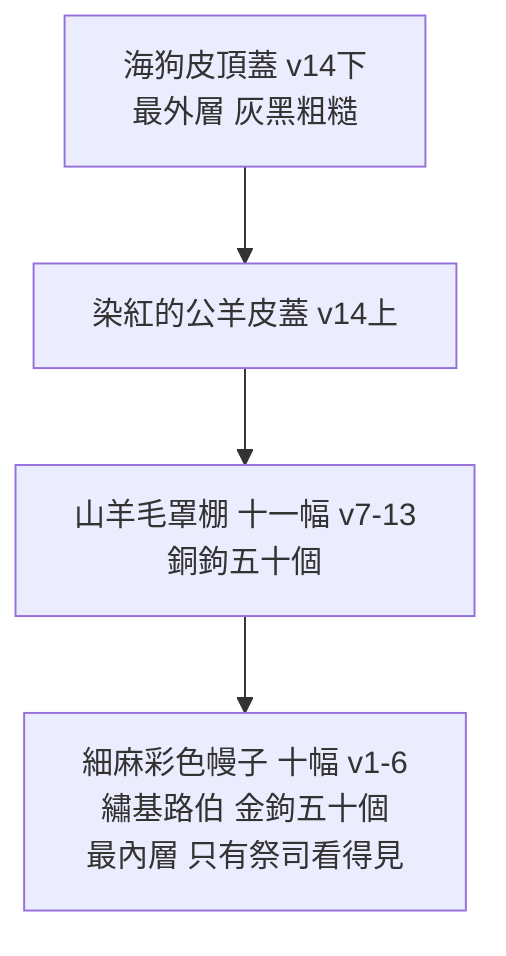

# 出埃及記 第26章

1. 你要用[[十幅幔子（內層幕幔）|十幅幔子]]做帳幕。這些幔子要用[[撚的細麻]]和[[藍色、紫色、朱紅色線（tekhelet, argaman, tola'at shani）|藍色、紫色、朱紅色線]]製造，並用巧匠的手工繡上[[基路伯（施恩座）|基路伯]]。
2. 每幅幔子要長二十八肘，寬四肘，幔子都要一樣的尺寸。
3. 這五幅幔子要幅幅相連；那五幅幔子也要幅幅相連。
4. 在這相連的幔子末幅邊上要做[[藍色鈕扣（lula'ot tekhelet）|藍色的鈕扣]]；在那相連的幔子末幅邊上也要照樣做。
5. 要在這相連的幔子上做[[藍色鈕扣（lula'ot tekhelet）|五十個鈕扣]]；在那相連的幔子上也做五十個鈕扣，都要兩兩相對。
6. 又要做[[五十個金鉤（vavei zahav）|五十個金鉤]]，用鉤使幔子相連，這才成了一個帳幕。
7. 你要用山羊毛織[[十一幅山羊毛幔子（罩棚）|十一幅幔子]]，作為帳幕以上的[[十一幅山羊毛幔子（罩棚）|罩棚]]。
8. 每幅幔子要長三十肘，寬四肘；[[十一幅山羊毛幔子（罩棚）|十一幅幔子]]都要一樣的尺寸。
9. 要把五幅幔子連成一幅，又把六幅幔子連成一幅，這第六幅幔子要在[[十一幅山羊毛幔子（罩棚）|罩棚]]的前面摺上去。
10. 在這相連的幔子末幅邊上要做五十個鈕扣；在那相連的幔子末幅邊上也做五十個鈕扣。
11. 又要做[[五十個銅鉤]]，鉤在鈕扣中，使[[十一幅山羊毛幔子（罩棚）|罩棚]]連成一個。
12. [[十一幅山羊毛幔子（罩棚）|罩棚]]的幔子所餘那垂下來的半幅幔子，要垂在帳幕的後頭。
13. [[十一幅山羊毛幔子（罩棚）|罩棚]]的幔子所餘長的，這邊一肘，那邊一肘，要垂在帳幕的兩旁，遮蓋帳幕。
14. 又要用[[染紅的公羊皮蓋子|染紅的公羊皮]]做[[染紅的公羊皮蓋子|罩棚的蓋]]；再用[[海狗皮頂蓋|海狗皮]]做一層[[海狗皮頂蓋|罩棚上的頂蓋]]。
15. 你要用[[皂莢木（atzei shittim）|皂莢木]]做[[皂莢木豎板|帳幕的豎板]]。
16. 每塊要長十肘，寬一肘半；
17. 每塊必有兩榫相對。帳幕一切的[[皂莢木豎板|板]]都要這樣做。
18. [[聖所|帳幕的南面]]要做[[皂莢木豎板|板]]二十塊。
19. 在這二十塊[[皂莢木豎板|板]]底下要做四十個[[銀座（帶卯的銀座）|帶卯的銀座]]，兩卯接這塊板上的兩榫，兩卯接那塊板上的兩榫。
20. 帳幕第二面，就是北面，也要做[[皂莢木豎板|板]]二十塊
21. 和[[銀座（帶卯的銀座）|帶卯的銀座]]四十個；這[[皂莢木豎板|板]]底下有兩卯，那板底下也有兩卯。
22. 帳幕的後面，就是西面，要做[[皂莢木豎板|板]]六塊。
23. 帳幕後面的[[拐角板（雙板）|拐角]]要做[[皂莢木豎板|板]]兩塊。
24. [[皂莢木豎板|板]]的下半截要雙的，上半截要整的，直頂到第一個環子；兩塊都要這樣做兩個[[拐角板（雙板）|拐角]]。
25. 必有八塊[[皂莢木豎板|板]]和十六個[[銀座（帶卯的銀座）|帶卯的銀座]]；這板底下有兩卯，那板底下也有兩卯。
26. 你要用[[皂莢木（atzei shittim）|皂莢木]]做[[閂（橫閂）|閂]]：為帳幕這面的板做五閂，
27. 為帳幕那面的板做五[[閂（橫閂）|閂]]，又為帳幕後面的板做五閂。
28. 板腰間的[[閂（橫閂）|中閂]]要從這一頭通到那一頭。
29. 板要用[[金子（包金）|金子]]包裹，又要做板上的金環套[[閂（橫閂）|閂]]；閂也要用金子包裹。
30. 要照著[[山上的樣式|在山上指示你的樣式]]立起帳幕。
31. 你要用[[藍色、紫色、朱紅色線（tekhelet, argaman, tola'at shani）|藍色、紫色、朱紅色線]]，和[[撚的細麻]]織幔子，以巧匠的手工繡上[[基路伯（施恩座）|基路伯]]。
32. 要把幔子掛在四根[[金子（包金）|包金]]的[[皂莢木（atzei shittim）|皂莢木]][[四根包金柱子（內幔柱）|柱子]]上，柱子上當有金鉤，柱子安在四個帶卯的銀座上。
33. 要使幔子垂在鉤子下，把[[約櫃|法櫃]]抬進[[至聖所|幔子內]]；這幔子要將[[聖所]]和[[至聖所]][[內幔（隔聖所至聖所的幔子）|隔開]]。
34. 又要把[[施恩座]]安在[[至聖所]]內的[[約櫃|法櫃]]上，
35. 把[[陳設餅桌子|桌子]]安在幔子外[[聖所|帳幕的北面]]；把[[金燈臺|燈臺]]安在[[聖所|帳幕的南面]]，彼此相對。
36. 你要拿[[藍色、紫色、朱紅色線（tekhelet, argaman, tola'at shani）|藍色、紫色、朱紅色線]]，和[[撚的細麻]]，用繡花的手工織帳幕的[[帳幕門簾|門簾]]。
37. 要用[[皂莢木（atzei shittim）|皂莢木]]為[[帳幕門簾|簾子]]做[[五根包金柱子（門簾柱）|五根柱子]]，用[[金子（包金）|金子]]包裹。柱子上當有金鉤；又要為柱子用[[銅]]鑄造五個帶卯的座。

<!-- fhl-map-links:start -->
## 相關地圖

- [[appendix/fhl_maps/maps/009|〈創圖四〉亞伯拉罕的生平]]
- [[appendix/fhl_maps/maps/019|〈出圖二〉以色列人出埃及到西乃山]]
<!-- fhl-map-links:end -->

---

## 本章知識節點

### 神學
- [[山上的樣式]]
- [[會幕（帳幕整體）]]
- [[聖所]]
- [[至聖所]]
- [[神的同在]]

### 原文
- [[皂莢木（atzei shittim）]]
- [[藍色、紫色、朱紅色線（tekhelet, argaman, tola'at shani）]]

### 結構
- [[十幅幔子（內層幕幔）]]
- [[藍色鈕扣（lula'ot tekhelet）]]
- [[五十個金鉤（vavei zahav）]]
- [[十一幅山羊毛幔子（罩棚）]]
- [[五十個銅鉤]]
- [[染紅的公羊皮蓋子]]
- [[海狗皮頂蓋]]
- [[皂莢木豎板]]
- [[銀座（帶卯的銀座）]]
- [[閂（橫閂）]]
- [[拐角板（雙板）]]
- [[內幔（隔聖所至聖所的幔子）]]
- [[四根包金柱子（內幔柱）]]
- [[帳幕門簾]]
- [[五根包金柱子（門簾柱）]]

### 材質
- [[金子（包金）]]
- [[銅]]

---

## 本章整理

本章詳細記載[[會幕（帳幕整體）|會幕本體]]的建造規格。KC 點出神描述的順序本身就在說話：==神從遮蓋聖所的東西開始講，而且先講的是從外面看最看不見的那一層==——「只有祭司在聖所裡，藉著燈臺的光，才看得見那些彩色的幔子。」

### 一、四層遮蓋：由內而外，越裡面越華美

會幕不是一層布，是四層——而**越靠外越樸素、越靠內越華美**。這個反轉是全章的骨架：

| 層 | 材料 | KC 的讀法 | CT 的靈意 |
| --- | --- | --- | --- |
| 第一層（最內） | 撚的細麻＋藍、紫、朱紅色線，繡[[基路伯（施恩座）]] | 這一層==就叫作「帳幕」==，是神真正的居所；是基督與教會的美麗圖畫 | 十＝人的完全；幔子＝耶穌人性的美麗；帳幕＝道成肉身、在地上行走的耶穌 |
| 第二層 | 山羊毛（見 [[十一幅山羊毛幔子（罩棚）]]） | ==先知的衣服也是山羊毛==；山羊又是贖罪祭最典型的牲畜——==說到與罪完全分別== | 山羊毛＝為贖罪而被剪除；罩棚＝耶穌為代替人而成為罪 |
| 第三層 | [[染紅的公羊皮蓋子]] | 公羊==是祭司承接聖職的祭==，說到對神的獻上 | 流血的救贖 |
| 第四層（最外） | [[海狗皮頂蓋]] | 不好看，==卻經得起風吹雨打==；曠野的髒污一點也透不進來 | 外表無佳形美容 |

> [!note] 一處要修正的說法：山羊毛那一層，KC 講的不是「堅固防護」
>
> 常見的講法是「KC認為，山羊毛罩棚與內層細麻幔子的材質差異，表明了外層的堅固防護與內層的華美尊貴，而銅鉤相對於金鉤，也反映了越往外層材質越具實用與堅固的特性」。
>
> ==這段話 KC 沒有說，CT 也沒有說。==兩家講的都是**贖罪**，不是工程學：
>
> KC：「先知的衣服也是山羊毛。先知在百姓偏離時向他們說話，==他們自己卻不參與在這偏離裡。他們是為神分別出來的==……山羊也是那用作贖罪祭最典型的牲畜。==山羊毛的幔子說到與罪完全的分別==。」
>
> CT：「山羊毛表徵==為贖罪而被剪除==」；銅鉤也不是「實用堅固」——「==銅表審判==，五十個銅鉤表徵==擔當人的罪而被神審判==」。
>
> 把贖罪讀成防水，是把這一層最重的意思拿掉了。（順帶一提，「越接近神用的金屬就越珍貴」那句是德萊維的原則，經《丁道爾》在出25 引用，不是 KC 的。）

> [!important] KC 最漂亮的一筆：內層幔子的四種材料＝四卷福音書
>
> 這是舊版整個漏掉、卻是 KC 讀本章最核心的一段。那四樣東西不是四種顏色，是**四個角度看同一位基督**：
>
> | 材料 | KC：這說到主耶穌的哪一面 | 對應的福音書 |
> | --- | --- | --- |
> | 撚的細麻 | 在潔淨與純全中的==有力的服事== | **馬可**——把祂表現為真正的僕人 |
> | 藍色 | 提醒我們祂是==從天上來的人== | **約翰** |
> | 紫色 | 顯出祂作==人子==的榮耀 | **路加** |
> | 朱紅色 | 顯出祂作==彌賽亞==在地上的榮耀 | **馬太** |
>
> 這個讀法在本章還有回聲：內幔掛在**四根**柱子上——KC：「幔子所掛的四根柱子可以應用在四卷福音書上。在其中我們看見主耶穌『肉體的日子』」。而門簾掛在**五根**柱子上——五說到責任，KC 對到「新約書信的五位作者：保羅、雅各、彼得、約翰、猶大」。

十幅幔子分為兩組，每組五幅相連，每幅長二十八肘、寬四肘，尺寸完全一致。KC 對數字的讀法：「==五這個數字表示責任==。我們每隻手有五根指頭，每隻腳有五根趾頭。==十表示雙重的責任==——我們對神有責任，我們對周圍的人也有責任。律法有十條誡命，有規範與神關係的，也有規範與人關係的。」CT 從尺寸讀出同一個方向：「二十八乃四乘七，四表受造物，七表屬地的完全；合起來表徵==耶穌人性的完全==。」

在相連的幔子末幅邊上要做[[藍色鈕扣（lula'ot tekhelet）|藍色的鈕扣]]，兩組各做五十個，且要兩兩相對；接著要用[[五十個金鉤（vavei zahav）|五十個金鉤]]使幔子相連，「這才成了一個帳幕」。KC 指出這裡有一個很要緊的命名：==「這美麗的遮蓋在這裡被稱為『帳幕』。這正是神的居所。」==CT 讀金鉤：「金表神性；五十個金鉤表徵==神性的能力促成完美的聯結==。」

KC 從鈕扣與金鉤讀出一個很生活化的應用：「連接幔子的鉤和鈕扣，有時被比作彼此的問安。==從一個教會到另一個教會、從一個信徒到另一個信徒所發出與致上的問安，是彼此之間所存在之聯結的實際表達==。我們在新約好幾封書信的末了都找得到這些問安。」

山羊毛罩棚每幅長三十肘、寬四肘，比內層稍長，以便完全覆蓋內層；十一幅分兩組（五幅與六幅），第六幅要在罩棚的前面摺上去。所餘垂下來的半幅要垂在帳幕的後頭，兩邊各餘一肘垂在兩旁遮蓋帳幕。CT 讀十一這個數字：「十一乃六加五，表徵==以人（六）的身分負起責任==」；讀三十肘：「三十乃六乘五，表徵==耶穌完美的人性，使祂能承擔受造物的罪責==」；讀那摺上去的第六幅：「表徵==祂的隱藏（不為人知的部分）==」。

最外層的海狗皮，KC 直接接到以賽亞：「對世界而言，主耶穌沒有佳形美容。對不信而言，祂沒有一樣是可羨慕的」——「他在耶和華面前生長如嫩芽，像根出於乾地。他無佳形美容；我們看見他的時候，也無美貌使我們羨慕他。」他接著把這句話轉到教會身上，很扎人：==「教會在世界眼中也沒有吸引力。你得先在其中，才看得見它的美。」==

### 二、[[皂莢木豎板|豎板]]與[[銀座（帶卯的銀座）|銀座]]（v15-25）

要用[[皂莢木（atzei shittim）|皂莢木]]做帳幕的豎板，每塊板長十肘、寬一肘半，每塊板必有兩榫相對，插入[[銀座（帶卯的銀座）|帶卯的銀座]]中。南面與北面各有二十塊板、四十個銀座；西面（後面）做六塊板，後面的[[拐角板（雙板）|拐角]]做兩塊板，共八塊板、十六個銀座。

KC 對豎板的讀法是本章最個人的一段：==「每一塊板代表一個信徒。他是人（木），但在基督裡（金）在神面前『得蒙悅納』。所有的板合起來構成帳幕。所有的信徒合起來構成永生神的教會。」==

> [!important] KC：兩個銀座，是信心的兩個根基
>
> 為什麼每塊板底下要有**兩個**銀座，而不是一個或三個？KC 給的答案很扎實：
>
> 「板直立在兩個銀座上。==銀說到為與神和好所付的代價==（彼前1:18-19）。信徒是被羔羊的寶血所贖的。他們知道兩件事——==就是那兩個座==——是他們信心的根基。信這兩件事給信徒得保守的確據：
>
> ==①神『因我們的過犯把主耶穌交付了』；②祂『因我們稱義把祂復活了』==（羅4:25）。
>
> ==在那確據裡，他們在神面前站立得穩。==」

尺寸都一樣，這件事 KC 也讀出意思：「所有的板尺寸相等。==作為信徒，在神面前沒有分別==，每一個信徒都在那蒙愛者裡被悅納。」但他立刻補上另一面：「在教會於地上的運作中，信徒之間是有分別的。==每個信徒有他自己獨特的位置==。」——而拐角板正是這樣一種特殊位置：「拐角的板是用來把兩邊固定在一起的。==有些信徒特別地照顧信徒之間的合一。他們扶持全體==。」

### 三、[[閂（橫閂）|閂]]、[[內幔（隔聖所至聖所的幔子）|內幔]]與[[帳幕門簾|門簾]]（v26-37）

三面各做五閂，板腰間的中閂要從這一頭通到那一頭；板要用[[金子（包金）|金子]]包裹，做金環套閂，閂也用金子包裹。

> [!question] 五根閂裡，為什麼有一根是看不見的？
>
> 這是本章最容易滑過去、也最有份量的一個細節。第28節說「板腰間的中閂要從這一頭通到那一頭」——它是穿在板**裡面**的，所以從外面看不見。
>
> KC 把這根閂讀成基督自己：「那四根**看得見**的閂使全體妥善地聯絡在一起。這可以應用在主耶穌為建造教會所賜的恩賜上，就是『有使徒，有先知，有傳福音的，有牧師和教師』（弗4:11）。
>
> ==第五根閂穿過那些板，因此是看不見的。在這裡我們可以看見主耶穌——祂作元首在天上得了榮耀，是我們看不見的，卻把上述的恩賜賜給祂在地上的教會。==」

KC 從板與板相連推出一句話：「所有這些板都彼此相連。==信徒不是彼此分開的==。他們同屬一體，構成一個合一。==自己一個人作信徒，不是神的心意==。」他並誠實面對現況：「可惜信徒如今不再像那些板一樣肩並肩地站著。信徒中間有了分裂與隔離。==然而在信徒的聚集中，仍然可能經歷神兒女的合一。==」

內幔要用藍色、紫色、朱紅色線和撚的細麻織成，繡上基路伯，掛在[[四根包金柱子（內幔柱）|四根包金的皂莢木柱子]]上，柱子上有金鉤，安在四個帶卯的銀座上。這幔子將[[聖所]]和[[至聖所]]隔開。

> [!important] [[至聖所|幔子是什麼？]]——KC：那是祂的肉身
>
> 「幔子構成聖所與至聖所之間的分隔。它的顏色和裡面那十幅幔子相同，必須掛在四根柱子上。像遮蓋的幔子一樣，==上面也有基路伯。幔子後面是約櫃，神的寶座。基路伯把守通往寶座的路==。除了摩西和大祭司一年一次以外，沒有人可以進去。
>
> ==在希伯來書10章我們讀到，這幔子是主耶穌『身體』的圖畫（來10:20），就是祂的位格，就是祂在地上行走的樣子。當祂死的時候，幔子裂開，通往神的路就敞開了。==」

在幔子外的聖所中，桌子安在北面，燈臺安在南面，彼此相對。

最後，帳幕的門簾要用藍色、紫色、朱紅色線和撚的細麻繡花製作，用[[五根包金柱子（門簾柱）|五根包金的皂莢木柱子]]，柱子上有金鉤，用[[銅]]鑄造五個帶卯的座。

KC 指出門簾與內幔有一個關鍵差異，而這差異正是重點：==「這幅簾子上沒有基路伯。」==——內幔上的基路伯是把守、是攔阻；門簾沒有，因為「祭司經由這幅簾子進入聖所。==在他們進去之前，這幅簾子彷彿提醒他們主耶穌的榮美==。」

座的材質也在說話：內幔柱用**銀**座（救贖），門簾柱用**銅**座（審判）——這區分了入口與至聖所之間的界線。

### 四、跨章脈絡與預表整理

本章的會幕結構不僅是舊約的禮儀規範，更是新約救恩的具體藍圖。最外層的海狗皮頂蓋樸素無華，對應基督無佳形美容的外表；內層的細麻幔子繡著基路伯，對應基督內在的神性與榮耀——而 KC 指出，那四種材料正是四卷福音書從四個角度所看見的同一位基督。

會幕完全按照[[山上的樣式]]建造（v30），這不僅是對摩西的吩咐，更是希伯來書所揭示的天上真帳幕的影像。帳幕的銀座根基預表基督的救贖，包金的木板與閂預表信徒在基督裡被包裹與連結，成為[[神的同在|聖靈居住的所在]]。將聖所與至聖所隔開的內幔，在基督斷氣時裂為兩半——通往神面前的道路，因著基督的流血救贖而完全敞開。

KC 給本章的收束，落在一個很具體的條件上：唯有分別於世界（林後6:17）與屬世的宗教（來13:13），單單圍繞基督聚集，「祂若是中心，並藉著祂的話和靈有引導和權柄，我們就可以知道，==照著祂的應許，祂就在其中==：『因為無論在哪裡，有兩三個人奉我的名聚會，那裡就有我在他們中間。』」

**參考資料**
https://biblehub.com/study/exodus/26.htm
https://www.ccbiblestudy.org/Old%20Testament/02Exo/02CT26.htm
https://www.ccbiblestudy.org/Old%20Testament/02Exo/02GT26.htm
https://www.kingcomments.com/en/bible-studies/Exo/26
