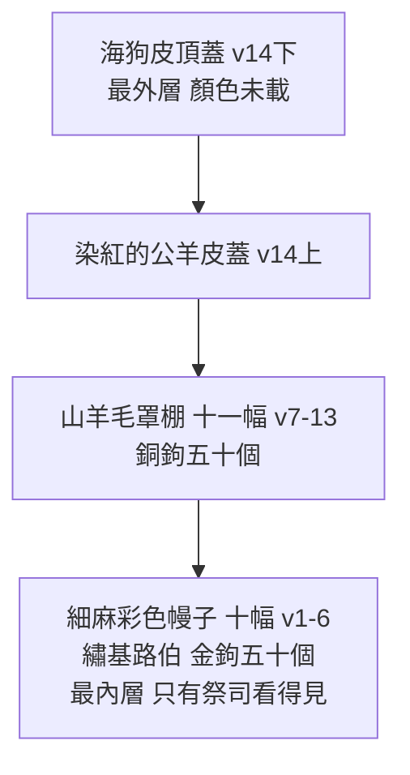

# 出埃及記 第26章

<!-- chapter-navigation:start -->
| [前一章](../02%20出埃及記/第25章.md) | [回目錄](../02%20出埃及記/全書目錄及綱要.md) | [下一章](../02%20出埃及記/第27章.md) |
| :--- | :---: | ---: |
<!-- chapter-navigation:end -->

1. 你要用[[十幅幔子（內層幕幔）|十幅幔子]]做帳幕。這些幔子要用[[撚的細麻]]和[[藍色、紫色、朱紅色線]]製造，並用巧匠的手工繡上[[基路伯（施恩座）|基路伯]]。
2. 每幅幔子要長二十八肘，寬四肘，幔子都要一樣的尺寸。
3. 這五幅幔子要幅幅相連；那五幅幔子也要幅幅相連。
4. 在這相連的幔子末幅邊上要做[[藍色鈕扣|藍色的鈕扣]]；在那相連的幔子末幅邊上也要照樣做。
5. 要在這相連的幔子上做[[藍色鈕扣|五十個鈕扣]]；在那相連的幔子上也做五十個鈕扣，都要兩兩相對。
6. 又要做[[五十個金鉤]]，用鉤使幔子相連，這才成了一個帳幕。
7. 你要用山羊毛織[[十一幅山羊毛幔子（罩棚）|十一幅幔子]]，作為帳幕以上的[[十一幅山羊毛幔子（罩棚）|罩棚]]。
8. 每幅幔子要長三十肘，寬四肘；[[十一幅山羊毛幔子（罩棚）|十一幅幔子]]都要一樣的尺寸。
9. 要把五幅幔子連成一幅，又把六幅幔子連成一幅，這第六幅幔子要在[[十一幅山羊毛幔子（罩棚）|罩棚]]的前面摺上去。
10. 在這相連的幔子末幅邊上要做五十個鈕扣；在那相連的幔子末幅邊上也做五十個鈕扣。
11. 又要做[[五十個銅鉤]]，鉤在鈕扣中，使[[十一幅山羊毛幔子（罩棚）|罩棚]]連成一個。
12. [[十一幅山羊毛幔子（罩棚）|罩棚]]的幔子所餘那垂下來的半幅幔子，要垂在帳幕的後頭。
13. [[十一幅山羊毛幔子（罩棚）|罩棚]]的幔子所餘長的，這邊一肘，那邊一肘，要垂在帳幕的兩旁，遮蓋帳幕。
14. 又要用[[染紅的公羊皮蓋子|染紅的公羊皮]]做[[染紅的公羊皮蓋子|罩棚的蓋]]；再用[[海狗皮頂蓋|海狗皮]]做一層[[海狗皮頂蓋|罩棚上的頂蓋]]。
15. 你要用[[皂莢木]]做[[皂莢木豎板|帳幕的豎板]]。
16. 每塊要長十肘，寬一肘半；
17. 每塊必有兩榫相對。帳幕一切的[[皂莢木豎板|板]]都要這樣做。
18. [[聖所|帳幕的南面]]要做[[皂莢木豎板|板]]二十塊。
19. 在這二十塊[[皂莢木豎板|板]]底下要做四十個[[銀座（帶卯的銀座）|帶卯的銀座]]，兩卯接這塊板上的兩榫，兩卯接那塊板上的兩榫。
20. 帳幕第二面，就是北面，也要做[[皂莢木豎板|板]]二十塊
21. 和[[銀座（帶卯的銀座）|帶卯的銀座]]四十個；這[[皂莢木豎板|板]]底下有兩卯，那板底下也有兩卯。
22. 帳幕的後面，就是西面，要做[[皂莢木豎板|板]]六塊。
23. 帳幕後面的[[拐角板（雙板）|拐角]]要做[[皂莢木豎板|板]]兩塊。
24. [[皂莢木豎板|板]]的下半截要雙的，上半截要整的，直頂到第一個環子；兩塊都要這樣做兩個[[拐角板（雙板）|拐角]]。
25. 必有八塊[[皂莢木豎板|板]]和十六個[[銀座（帶卯的銀座）|帶卯的銀座]]；這板底下有兩卯，那板底下也有兩卯。
26. 你要用[[皂莢木]]做[[閂（橫閂）|閂]]：為帳幕這面的板做五閂，
27. 為帳幕那面的板做五[[閂（橫閂）|閂]]，又為帳幕後面的板做五閂。
28. 板腰間的[[閂（橫閂）|中閂]]要從這一頭通到那一頭。
29. 板要用[[金子（包金）|金子]]包裹，又要做板上的金環套[[閂（橫閂）|閂]]；閂也要用金子包裹。
30. 要照著[[山上的樣式|在山上指示你的樣式]]立起帳幕。
31. 你要用[[藍色、紫色、朱紅色線]]，和[[撚的細麻]]織幔子，以巧匠的手工繡上[[基路伯（施恩座）|基路伯]]。
32. 要把幔子掛在四根[[金子（包金）|包金]]的[[皂莢木]][[四根包金柱子（內幔柱）|柱子]]上，柱子上當有金鉤，柱子安在四個帶卯的銀座上。
33. 要使幔子垂在鉤子下，把[[約櫃|法櫃]]抬進[[至聖所|幔子內]]；這幔子要將[[聖所]]和[[至聖所]][[內幔（隔聖所至聖所的幔子）|隔開]]。
34. 又要把[[施恩座]]安在[[至聖所]]內的[[約櫃|法櫃]]上，
35. 把[[陳設餅桌子|桌子]]安在幔子外[[聖所|帳幕的北面]]；把[[金燈臺|燈臺]]安在[[聖所|帳幕的南面]]，彼此相對。
36. 你要拿[[藍色、紫色、朱紅色線]]，和[[撚的細麻]]，用繡花的手工織帳幕的[[帳幕門簾|門簾]]。
37. 要用[[皂莢木]]為[[帳幕門簾|簾子]]做[[五根包金柱子（門簾柱）|五根柱子]]，用[[金子（包金）|金子]]包裹。柱子上當有金鉤；又要為柱子用[[銅]]鑄造五個帶卯的座。

---

## 本章知識節點

### 神學
- [[山上的樣式]]
- [[會幕（帳幕整體）]]
- [[聖所]]
- [[至聖所]]
- [[神的同在]]
- [[神住在幽暗中]]
- [[會幕材料的豫表]]

### 原文
- [[皂莢木]]
- [[藍色、紫色、朱紅色線]]
- [[撚的細麻]]

### 結構
- [[十幅幔子（內層幕幔）]]
- [[藍色鈕扣]]
- [[五十個金鉤]]
- [[十一幅山羊毛幔子（罩棚）]]
- [[五十個銅鉤]]
- [[染紅的公羊皮蓋子]]
- [[海狗皮頂蓋]]
- [[皂莢木豎板]]
- [[銀座（帶卯的銀座）]]
- [[閂（橫閂）]]
- [[板上的金環（套閂）]]
- [[拐角板（雙板）]]
- [[內幔（隔聖所至聖所的幔子）]]
- [[四根包金柱子（內幔柱）]]
- [[帳幕門簾]]
- [[五根包金柱子（門簾柱）]]

### 材質
- [[金子（包金）]]
- [[銅]]
- [[銀子]]

### 器具與位置
- [[約櫃]]
- [[施恩座]]
- [[陳設餅桌子]]
- [[金燈臺]]
- [[基路伯（施恩座）]]

### 文化背景
- [[兩榫相對（榫卯接合）]]
- [[面東定向的左右方位]]

### 解經爭議
- [[豎板是木板還是骨架]]
- [[會幕樣式的兩個解法]]

### 互文
- [[來10：19-20|來10：19-20 幔子就是基督的身體]]
- [[基督是門（約10：7）|約10：7 我就是門]]
- [[聖殿中的基路伯（王上6：23-28）|王上6：23-28 所羅門聖殿的基路伯]]

---

## 本章整理

本章是[[會幕（帳幕整體）|會幕本體]]的規格書：幔子與罩棚（v1-14）、豎板與銀座（v15-30）、內幔與門簾（v31-37）。神描述的順序本身就在說話——KC 指出，==神從遮蓋聖所的東西開始講，而且先講的是從外面看最看不見的那一層==：「只有祭司在聖所裡，藉著燈臺的光，才看得見那些彩色的幔子。」

不過經文只給文字、不給圖。GT《啟導本》把這個限制講得很坦白：「本章和以後數章所記會幕構造及陳設、服裝等，因實物早已無存，僅憑文字描寫殊難知道確切形狀及細節」，甚至「會幕的頂是平的抑或象我國民房的尖頂，未有說明」。本章兩個最大的爭議——罩棚是不是另成一層、豎板是木板還是骨架——都是從這個缺口長出來的。

### 一、四層遮蓋：由內而外，越裡面越華美（v1-14）

會幕不是一層布，是四層——而**越靠外越樸素、越靠內越華美**。這個反轉是全章的骨架：

```mermaid
flowchart TD
  D["海狗皮頂蓋 v14下<br/>最外層 顏色未載"] --> C["染紅的公羊皮蓋 v14上"]
  C --> B["山羊毛罩棚 十一幅 v7-13<br/>銅鉤五十個"]
  B --> A["細麻彩色幔子 十幅 v1-6<br/>繡基路伯 金鉤五十個<br/>最內層 只有祭司看得見"]
```

| 層 | 材料 | KC 的讀法 | CT 的靈意 |
| --- | --- | --- | --- |
| 第一層（最內） | 撚的細麻＋藍、紫、朱紅色線，繡基路伯 | 這一層==就叫作「帳幕」==，是神真正的居所；是基督與教會的美麗圖畫 | 十＝人的完全；幔子＝耶穌人性的美麗；帳幕＝道成肉身、在地上行走的耶穌 |
| 第二層 | 山羊毛 | ==先知的衣服也是山羊毛==；山羊又是贖罪祭最典型的牲畜——==說到與罪完全分別== | 山羊毛＝為贖罪而被剪除；罩棚＝耶穌為代替人而成為罪 |
| 第三層 | 染紅的公羊皮 | 公羊==是祭司承接聖職的祭==，說到對神的獻上 | 為人擔罪而流血捨命 |
| 第四層（最外） | 海狗皮 | 不好看，==卻經得起風吹雨打==；曠野的髒污一點也透不進來 | 外表無佳形美容，卻堅固耐苦 |

> [!important] KC 最漂亮的一筆：內層幔子的四種材料＝四卷福音書
>
> 這是 KC 讀本章最核心的一段。那四樣東西不是四種顏色，是**四個角度看同一位基督**：
>
> | 材料 | KC：這說到主耶穌的哪一面 | 對應的福音書 |
> | --- | --- | --- |
> | 撚的細麻 | 在潔淨與純全中的==有力的服事== | **馬可**——把祂表現為真正的僕人 |
> | 藍色 | 提醒我們祂是==從天上來的人== | **約翰** |
> | 紫色 | 顯出祂作==人子==的榮耀 | **路加** |
> | 朱紅色 | 顯出祂作==彌賽亞==在地上的榮耀 | **馬太** |
>
> 這個讀法在本章還有回聲：內幔掛在**四根**柱子上——KC：「幔子所掛的四根柱子可以應用在四卷福音書上。在其中我們看見主耶穌『肉體的日子』（來5:7）。」而門簾掛在**五根**柱子上——五說到責任，KC 對到「新約書信的五位作者：保羅、雅各、彼得、約翰、猶大」。

內層十幅幔子（יְרִיעֹת，yeri'oth，H3407 幔子／幕簾）用撚的細麻（שֵׁשׁ מָשְׁזָר，H8336/H7806）與三色線，並以「巧匠的手工」（מַעֲשֵׂה חֹשֵׁב，chosev，H2803，指熟練工藝／巧思設計）繡上基路伯。十幅幔子分為兩組，每組五幅相連，每幅長二十八肘、寬四肘，尺寸完全一致。KC 對數字的讀法：「==五這個數字表示責任==。我們每隻手有五根指頭，每隻腳有五根趾頭。==十表示雙重的責任==——我們對神有責任，我們對周圍的人也有責任。律法有十條誡命，有規範與神關係的，也有規範與人關係的。」CT 從尺寸讀出同一個方向：「二十八乃四乘七，四表受造物，七表屬地的完全；合起來表徵==耶穌人性的完全==。」GT 引丁良才則把同一組數字換算成空間：「長二十八肘，就是帳幕頂棚的十肘，兩邊各九肘」；「十幅幔子共寬四十肘，就是聖所二十肘，至聖所十肘，西面又垂下十肘」。

在相連的幔子末幅邊上要做[[藍色鈕扣|藍色的鈕扣]]（לֻלְאֹת，lula'oth，H3924 扣眼／環套），兩組各做五十個，且要兩兩相對；接著要用[[五十個金鉤]]（קַרְסֵי זָהָב，qerasim，H7165 扣鉤）使幔子相連，「這才成了一個帳幕」（וְהָיָה הַמִּשְׁכָּן אֶחָד，H4908/H259）。KC 指出這裡有一個很要緊的命名：==「這美麗的遮蓋在這裡被稱為『帳幕』。這正是神的居所。」==CT 讀金鉤：「金表神性；五十個金鉤表徵==神性的能力促成完美的聯結==。」KC 從鈕扣與金鉤讀出一個很生活化的應用：「連接幔子的鉤和鈕扣，有時被比作彼此的問安。==從一個教會到另一個教會、從一個信徒到另一個信徒所發出與致上的問安，是彼此之間所存在之聯結的實際表達==。我們在新約好幾封書信的末了都找得到這些問安。」

山羊毛罩棚（יְרִיעֹת עִזִּים לְאֹהֶל，H3407/H5795/H168）每幅長三十肘、寬四肘，比內層稍長，以便完全覆蓋內層；十一幅分兩組（五幅與六幅），第六幅要在罩棚的前面摺上去，所餘垂下來的半幅垂在帳幕後頭，兩邊各餘一肘垂在兩旁。CT 把總帳算出來：罩棚三十肘乘四十四肘，比幕幔的二十八肘乘四十肘「長度多兩肘，總寬度多四肘」，因此「在三個方向都蓋住幕幔」。CT 讀十一這個數字：「十一乃六加五，表徵==以人（六）的身分負起責任==」；讀三十肘：「三十乃六乘五，表徵==耶穌完美的人性，使祂能承擔受造物的罪責==」；讀那摺上去的第六幅：「表徵==祂的隱藏（不為人知的部分）==」。

罩棚改用五十個[[五十個銅鉤|銅鉤]]（קַרְסֵי נְחֹשֶׁת，H7165/H5178）連結。罩棚為什麼改用**銅**鉤？GT《中文聖經註釋》給的是實務理由：這些鉤扣「裏面已為帳幔所遮，使人看不見，而外層則仍有兩重的外罩，所以也看不見。故此就不須用貴重的金屬，如金或銀來製作」。CT 給的是靈意理由：「==銅表審判==，五十個銅鉤表徵==擔當人的罪而被神審判==。」兩條理由並不互相取消。其外再加[[染紅的公羊皮蓋子|染紅的公羊皮蓋]]（מִכְסֵה עֹרֹת אֵילִם מְאָדָּמִים，H4372/H352/H119），最外層再覆上[[海狗皮頂蓋|頂蓋]] תְּחָשִׁים（H8476）。這個材料的具體身分並不確定；STEP 資料本身的譯法也有差異，相關譯本與註釋有「海狗皮」「海豚皮」「獾皮」「上等皮革」等理解。

最外層的頂蓋，CT 在此留下本章最扎人的一段話中之光：「會幕的最頂層由於是用海狗皮蓋的，所以從外表來看，會幕顯得很簡陋。但是進入會幕門之後，展現在人們眼前的是精金包裹的牆……==即就像會幕重視的不是外表，而是裡面一樣，教會也要重視裡面的華美。==」KC 從同一點接到以賽亞：「他無佳形美容；我們看見他的時候，也無美貌使我們羨慕他」，然後把這句話轉到教會身上：==「教會在世界眼中也沒有吸引力。你得先在其中，才看得見它的美。」==

> [!question] 這四層到底是怎麼疊的？——丁良才並列兩案，並舉七層證據
>
> 經文沒有給立體圖，於是有兩種復原方案：**第一解法**是帳幕（細麻幔）之上另有罩棚；**第二解法**是幔子與蓋子都直接蓋在豎板上。GT 引丁良才主張第一解法，理由七層——
>
> 1. 「聖書上說帳幕以上有罩棚（出26:7）」
> 2. 兩層幔子兩層蓋子若都蓋在豎板上，「就難免不從中段沉下」
> 3. 「雨水下到上面，也就無法流下去，必定聚存在會幕上」
> 4. 按第二解法「人就只能看見帳幕幔子的四分之一，山羊毛幔子和山羊皮蓋卻是全然看不見了」
> 5. 按第二解法山羊毛幔子三邊要垂下八九肘，與本章 9、12、13 節的半幅與一肘不合
> 6. 按第二解法「會幕上就用不著繩子橛子，但出35:18節說會幕上也有繩子橛子」
> 7. 按第二解法「在會幕裡就沒有祭司可住的地方」，但利8:33、撒上3:23 說祭司能住在會幕裡
>
> 丁良才在14節另記一種折衷讀法：帳幕兩層（細麻幔＋海狗皮蓋）、罩棚兩層（山羊毛幔＋染紅公羊皮蓋），這樣「這些幔子和蓋子各有特別的用處，也都能一一叫人看見」。GT《丁道爾》則對「第三甚至第四層皮帳」存疑：「這似乎是太重而且多餘了。」

### 二、豎板、銀座與閂：一座能拆能立的建築（v15-30）

要用[[皂莢木]]做帳幕的[[皂莢木豎板|豎板]]（קְרָשִׁים עֲצֵי שִׁטִּים עֹמְדִים，qerashim H7175 木板；omedim H5975 豎立），每塊長十肘、寬一肘半。經文把板底的兩個榫頭稱作「兩隻手」（שְׁתֵּי יָדוֹת，H3027），並說兩者要彼此接合（מְשֻׁלָּבֹת，H7947）。「兩榫相對」的希伯來說法很有畫面，字面像是「一個對著她的姊妹」（אִשָּׁה אֶל־אֲחֹתָהּ），意思就是兩者彼此相對、配合，插入[[銀座（帶卯的銀座）|帶卯的銀座]]（אַדְנֵי־כֶסֶף，H134/H3701）。南北兩面各二十塊板、四十個銀座；西面六塊板，後面的[[拐角板（雙板）|拐角]]另加兩塊，共八塊板、十六個銀座。CT 統計全數：「南北西三面共有四十八塊版，九十六個銀座。」

> [!note] 這些「板」是木板還是框架？——四來源分成兩派，理由都很實際
>
> **框架派**：CT 記「有些解經家認為豎板並非實心木板，而是空心框架，==固可看見幔子上的基路伯==，也因此比較輕，容易搬動」；GT《串珠》同持此說；GT《丁道爾》主張連譯名都該改成「骨架」或「支架」（RSV 依照甘迺迪的譯法），「骨架用皂莢木的圓杆造成（根據約瑟夫的記載，粗三英吋）」；GT《每日研經叢書》給兩個理由：「一部分是根據==硬板重量，大約是每塊一噸==；而另一方面則是根據這些板會遮住那美麗的細麻布的帳幕。」
>
> **厚板派**：GT 引丁良才從原文用字反推：「本處的『板』字和結27:6節的『艙板』兩個字的原文既是一樣，大概就是指著厚板說的，有注釋家想是==厚半肘==」；GT《中文聖經註釋》則由重量推到年代：「這樣厚重長笨的木板，==亦不會是在曠野飄流的以色列人的聖幕，乃是住居迦南後很少遷動的聖幕==。」
>
> 爭的其實是兩件事：**帳幕搬不搬得動**，以及**會幕最華美的那一層看不看得見**。

板是怎麼立起來的？靠的不是釘子，是榫卯——GT《中文聖經註釋》：「榫這是古代沒有釘子前的建築最常用的方式。榫頭或榫子，就是指木板中凸出的部分；榫眼是凹入的部分。凸凹相接合，便稱為對榫。」GT《精讀本》補上英譯的線索：「英語聖經中譯成突起（projection, NIV, TEV）。」CT 則解「相對」為公母凹凸的配對，並強調「豎板的尺寸和兩榫位置都要相同，如此，眾豎板可以緊密接合在一起」。

[[銀子|銀]]座是這一切的地基，而它的分量是可以量的。GT 引丁良才：「聖書上沒有提到這些銀座的樣式，只說每座用一他連得銀子（出38:27）。一他連得約九十六磅」；GT《串珠》換算為「約三十公斤（六十四磅），==這個重量足夠使豎板穩定下來==」。

> [!important] KC：兩個銀座，是信心的兩個根基
>
> 為什麼每塊板底下要有**兩個**銀座，而不是一個或三個？KC 給的答案很扎實：
>
> 「板直立在兩個銀座上。==銀說到為與神和好所付的代價==（彼前1:18-19）。信徒是被羔羊的寶血所贖的。他們知道兩件事——==就是那兩個座==——是他們信心的根基：
>
> ==①神『因我們的過犯把主耶穌交付了』；②祂『因我們稱義把祂復活了』==（羅4:25）。
>
> ==在那確據裡，他們在神面前站立得穩。==」

板要用[[金子（包金）|金子]]包裹，做板上的金環套[[閂（橫閂）|橫閂]]（בְּרִיחִם，berichim，H1280），閂也用金子包裹；三面各做五閂，板腰間的中閂（הַבְּרִיחַ הַתִּיכֹן，tikhon H8484）要穿過（מַבְרִחַ，mavriach，H1272）各板，從這一頭通到那一頭。GT《中文聖經註釋》把全部閂數清點出來：「八條十五肘長、四條五肘長、兩條三十肘長和一條十肘長的閂，合共十五條，都要用金包裹，加上那些闊面的豎板也要用金包裹，==所要用的精金，真是無法計數！==」

> [!question] 五根閂裡，為什麼有一根是看不見的？
>
> 第28節說「板腰間的中閂要從這一頭通到那一頭」——它是穿在板**裡面**的，所以從外面看不見。
>
> KC 把這根閂讀成基督自己：「那四根**看得見**的閂使全體妥善地聯絡在一起。這可以應用在主耶穌為建造教會所賜的恩賜上，就是『有使徒，有先知，有傳福音的，有牧師和教師』（弗4:11）。
>
> ==第五根閂穿過那些板，因此是看不見的。在這裡我們可以看見主耶穌——祂作元首在天上得了榮耀，是我們看不見的，卻把上述的恩賜賜給祂在地上的教會。==」
>
> 這根閂也是本章的技術難題。CT 算過：若一根通到底，「總長達十三公尺半，不但在製作和搬運上有難處，且在實際使用上也有難處」，所以他判斷「比較合理的應當是每閂分成長度相同的數段」。GT 引丁良才則列出「中閂穿在板內」這個讀法的兩種難處：三十肘長「難以穿通二十塊木板」，而且「既是被金包裹，若穿在板內，就難免不磨掉包閂的金子」。

KC 從板與板相連推出一句話：「所有這些板都彼此相連。==信徒不是彼此分開的==。他們同屬一體，構成一個合一。==自己一個人作信徒，不是神的心意==。」他並誠實面對現況：「可惜信徒如今不再像那些板一樣肩並肩地站著。信徒中間有了分裂與隔離。==然而在信徒的聚集中，仍然可能經歷神兒女的合一。==」

板的三面配置，還牽出一件容易被略過的事：[[面東定向的左右方位|會幕的方位是以人面朝東為準定下來的]]。CT 註明「『南面』指帳幕入口的左邊」、「帳幕的前面……就是東面，朝日出的方向」；GT 引丁良才：「以色列人面向日出的地方，就以右邊為南面……本句暗指帳幕必是坐西向東」；GT《中文聖經註釋》把整套語言講完：「在以色列人討論方向時，必以聖幕或聖殿的門為定位。幕門是開向東方的。面向東方時，稱右邊為南方，左邊為北方，後面為西方」，並記下一個至今沒有答案的原文問題——第18節的「南面」用了兩個字，「頭一個是 negebah（向曠野），第二個是 teymanah（向右）」，兩個都指南，「但為甚麼要重複地用兩個字？就至今仍無令人滿意的解答」。

這一大段以「要照著在[[山上的樣式|山上指示你的樣式]]立起帳幕」（v30）作結。GT 引丁良才給了一個很樸素的理由：「無論神解得怎樣詳細，總有些地方人不能領會，所以神警教摩西，要留心在山上所指示他的樣式，十分照樣去做，==俗語說，百聞不如一見==。」

### 三、內幔、門簾與聖所的陳設（v31-37）

[[內幔（隔聖所至聖所的幔子）|內幔]]（פָּרֹכֶת，parokheth，H6532 隔斷幔／內幔）要用[[藍色、紫色、朱紅色線]]和[[撚的細麻]]織成，用巧匠的手工繡上[[基路伯（施恩座）|基路伯]]，掛在[[四根包金柱子（內幔柱）|四根包金的皂莢木柱子]]上，柱子安在四個帶卯的銀座上；這幔子要將[[聖所]]（הַקֹּדֶשׁ，H6944）和[[至聖所]]（קֹדֶשׁ הַקֳּדָשִׁים，H6944，字面為聖中之聖）隔開，[[約櫃|法櫃]]抬進幔子內，[[施恩座]]安在法櫃上。

> [!important] [[來10：19-20|幔子是什麼？]]——KC：那是祂的肉身
>
> 「幔子構成聖所與至聖所之間的分隔。它的顏色和裡面那十幅幔子相同，必須掛在四根柱子上。像遮蓋的幔子一樣，==上面也有基路伯。幔子後面是約櫃，神的寶座。基路伯把守通往寶座的路==。除了摩西和大祭司一年一次以外，沒有人可以進去。
>
> ==在希伯來書10章我們讀到，這幔子是主耶穌『身體』的圖畫（來10:20），就是祂的位格，就是祂在地上行走的樣子。當祂死的時候，幔子裂開，通往神的路就敞開了。==」
>
> CT 的話中之光落在同一處，卻多說了一句：「主如果不死，幔子便不會裂開」；「從前大祭司只能一年一次進到神面前，而我們現在可以隨時來到神面前」。

基路伯繡在幔子上這件事，還被 GT 引丁良才拿來當作**幔子掛法**的證據：這幔子必是垂在豎板的裡面，因為「這幔子若垂在豎板之外，人就看不見那些基路伯了」；而「在所羅門的聖殿（代下3:7；王上6:29）和以西結的聖殿裡，四面的牆上既然都有能看見的基路伯（結41:18-20），大概摩西的會幕也就是如此」——[[聖殿中的基路伯（王上6：23-28）|會幕與聖殿在這一點上是相通的]]。丁良才並把兩處至聖所並排量了一次：「會幕的至聖所，長寬高各十肘，所羅門聖殿的至聖所，長寬高各二十肘（正大八倍）。」

> [!note] 幔子造出來的不只是分隔，還有黑暗
>
> GT《中文聖經註釋》把加蓋與造幔子的另一個目的直接寫出來：三層罩棚「可使將來放置法櫃的地方幽暗，==因為神是住在幽暗中的==（出20:21；申4:11；王上8:12）」；造內幔同樣是「為使神可以住在幽暗之中」。
>
> GT《丁道爾》描寫了這道黑暗實際的樣子：帳幕「密不通風，除了金燈臺的燈光和祭司揭開帳門進出時放進來的短暫光線以外，亦十分幽暗。==燈臺在『聖所』，幔子後面的至聖所則經常一片漆黑==。可是和外面沙漠刺眼的光熱相比，==帳內的幽暗和清涼卻令人暢快==（詩17:8）。自西乃山以降，幽暗一直是神合適的象徵（王上8:12）。」
>
> 本章的光線因此有一個方向：外面是沙漠的強光，門簾之內是燈臺的一點光，內幔之後完全無光——==越靠近神，人自己能看見的越少。==

在幔子外的聖所中，[[陳設餅桌子|桌子]]安在北面，[[金燈臺|燈臺]]安在南面，彼此相對。CT 讀這組對照：桌子「表徵基督是生命的糧（約6:51）」，燈檯「表徵基督是生命的光（約8:12）」，而「彼此相對」則「表徵生命的糧和光，彼此互增效用」。GT 引丁良才則從位置讀出分量：燈檯安在南邊、與桌子相對，「就占了尊貴的地位」。

最後是帳幕門口的[[帳幕門簾|門簾]]（מָסָךְ，masakh，H4541 遮蔽簾／門簾），用同樣的三色線與細麻，以「繡花的手工」（מַעֲשֵׂה רֹקֵם，roqem，H7551 刺繡工）織成——CT 指出這是織法上的差別：「幔子是織成密實的布幔，而門簾是刺繡成有細縫的簾子。」它掛在[[五根包金柱子（門簾柱）|五根包金的皂莢木柱子]]上，柱子上有金鉤，用[[銅]]鑄造五個帶卯的座。

KC 指出門簾與內幔的關鍵差異，而這差異正是重點：==「這幅簾子上沒有基路伯。」==——內幔上的基路伯是把守、是攔阻；門簾沒有，因為「祭司經由這幅簾子進入聖所。==在他們進去之前，這幅簾子彷彿提醒他們主耶穌的榮美==」。GT 引丁良才在同一點上說得更遠：[[基督是門（約10：7）|門簾表示主耶穌]]，「因著這門，人能得著五樣大恩：（一）與神相交（指著陳設餅的桌子）；（二）得神的光照（指著燈檯）；（三）能作有功效的祈禱（指著香壇）；（四）得意外的平安；（五）得以親近神（靠近施恩座）」；而「==門上沒有門閂，沒有基路伯==，叫凡願意進去的人沒有什麼攔阻」。

### 四、材質的階梯：從銅到銀到金

把本章的[[會幕材料的豫表|材料]]按位置排一次，會看見一道很清楚的階梯：

| 位置 | 材質 | CT 的靈意 | 出處 |
| --- | --- | --- | --- |
| 罩棚的鉤子（外） | 銅 | 審判 | v11 |
| 門簾柱的座（入口） | 銅 | 經歷審判的煉淨 | v37 |
| 豎板與內幔柱的座（根基） | 銀 | 以救贖為根基 | v19, 21, 25, 32 |
| 板、閂、金環、柱子（內） | 金 | 神性 | v6, 29, 32, 37 |

人從東面進來，先碰到的是銅；站得穩靠的是銀；越往裡走，金就越多。而 CT 讀「木包金」時把這道階梯收在信徒身上：「板要用金子包裹……表徵眾信徒無論其服事的崗位如何，都是==人性包上神性==，又在神性裡連結為一。」KC 說的是同一件事：「每一塊板代表一個信徒。他是人（木），但在基督裡（金）在神面前『得蒙悅納』。」

三色線也在本章出現了三次——幕幔、內幔、門簾。GT 引丁良才把整卷書的分佈一併數過：「內幔、門簾、院門的簾子、以弗得、胸牌、外袍底邊上的石榴，都是這些才作成的，出埃及記提到三色線共二十五次，==這三色線的次序常是一樣==。」

本章最後落在一個很具體的條件上。KC 給的收束是：唯有分別於世界（林後6:17）與屬世的宗教（來13:13），單單圍繞基督聚集，「祂若是中心，並藉著祂的話和靈有引導和權柄，我們就可以知道，==照著祂的應許，祂就在其中==：『因為無論在哪裡，有兩三個人奉我的名聚會，那裡就有我在他們中間。』」而整章的規格，都在「要照著在山上指示你的樣式立起帳幕」這一句底下——神同在的樣子，不是人設計出來的。

**參考資料**
https://biblehub.com/study/exodus/26.htm
https://www.ccbiblestudy.org/Old%20Testament/02Exo/02CT26.htm
https://www.ccbiblestudy.org/Old%20Testament/02Exo/02GT26.htm
https://www.kingcomments.com/en/bible-studies/Exo/26

<!-- appendix-links:start -->
## 附錄

### 相關地圖
- [[appendix/fhl_maps/maps/009|〈創圖四〉亞伯拉罕的生平]]
- [[appendix/fhl_maps/maps/019|〈出圖二〉以色列人出埃及到西乃山]]
<!-- appendix-links:end -->

<!-- chapter-navigation:start -->
| [前一章](../02%20出埃及記/第25章.md) | [回目錄](../02%20出埃及記/全書目錄及綱要.md) | [下一章](../02%20出埃及記/第27章.md) |
| :--- | :---: | ---: |
<!-- chapter-navigation:end -->
