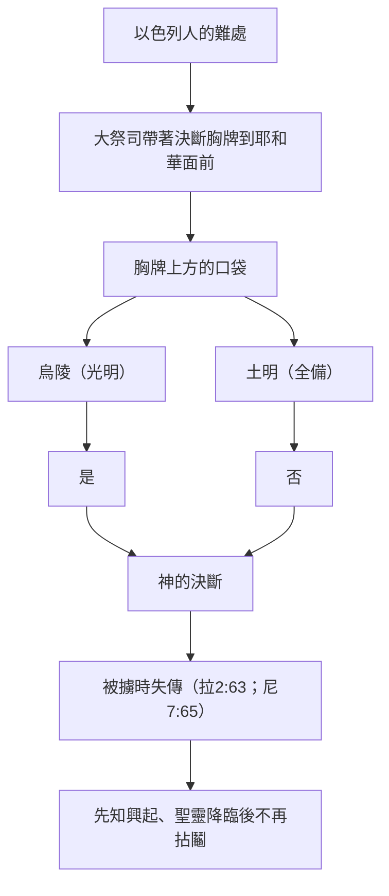

# 出埃及記 第28章

<!-- chapter-navigation:start -->
| [前一章](../02%20出埃及記/第27章.md) | [回目錄](../02%20出埃及記/全書目錄及綱要.md) | [下一章](../02%20出埃及記/第29章.md) |
| :--- | :---: | ---: |
<!-- chapter-navigation:end -->

1. 你要從以色列人中，使你的哥哥[[亞倫]]和他的兒子[[亞倫的祭司譜系|拿答]]、[[亞倫的祭司譜系|亞比戶]]、[[亞倫的祭司譜系|以利亞撒]]、[[亞倫的祭司譜系|以他瑪]]一同就近你，給我供祭司的職分。
2. 你要給你哥哥亞倫做聖衣為榮耀，為華美。
3. 又要吩咐一切[[聖靈膏抹（約壹2：20,27）|心中有智慧]]的，就是我用[[聖靈膏抹（約壹2：20,27）|智慧的靈]]所充滿的，給[[亞倫]]做衣服，使他[[山上的樣式|分別為聖]]，可以給我供祭司的職分。
4. 所要做的就是胸牌、以弗得、外袍、雜色的內袍、冠冕、腰帶，使你哥哥[[亞倫]]和他兒子穿這聖服，可以給我供祭司的職分。
5. 要用[[金線]]和[[藍色、紫色、朱紅色線]]，並細麻去做。
6. 他們要拿[[金線]]和[[藍色、紫色、朱紅色線]]，並[[撚的細麻]]，用巧匠的手工做[[以弗得]]。
7. [[以弗得]]當有兩條[[以弗得|肩帶]]，接上兩頭，使他相連。
8. 其上巧工織的帶子，要和[[以弗得]]一樣的做法，用以束上，與以弗得接連一塊，要用[[金線]]和[[藍色、紫色、朱紅色線]]，並[[撚的細麻]]做成。
9. 要取兩塊紅瑪瑙，在上面刻以色列兒子的名字：
10. 六個名字在這塊寶石上，六個名字在那塊寶石上，都照他們生來的次序。
11. 要用刻寶石的手工，彷彿刻圖書，按著以色列兒子的名字，刻這兩塊寶石，要鑲在金槽上。
12. 要將這兩塊寶石安在[[以弗得]]的兩條[[以弗得|肩帶]]上，為以色列人做[[紅瑪瑙（紀念石）|紀念石]]。亞倫要在兩肩上擔他們的名字，在耶和華面前作為紀念。
13. 要用金子做二槽，
14. 又拿[[精金]]，用擰工彷彿擰繩子，做兩條鍊子，把這擰成的鍊子搭在二槽上。
15. 你要用巧匠的手工做一個決斷的[[胸牌（決斷胸牌）|胸牌]]。要和以弗得一樣的做法：用[[金線]]和[[藍色、紫色、朱紅色線]]，並[[撚的細麻]]做成。
16. 這[[胸牌（決斷胸牌）|胸牌]]要四方的，疊為兩層，長一虎口，寬一虎口。
17. 要在上面鑲[[十二寶石（胸牌寶石）|寶石]]四行：第一行是[[十二寶石（胸牌寶石）|紅寶石]]、[[十二寶石（胸牌寶石）|紅璧璽]]、[[十二寶石（胸牌寶石）|紅玉]]；
18. 第二行是[[十二寶石（胸牌寶石）|綠寶石]]、[[十二寶石（胸牌寶石）|藍寶石]]、[[十二寶石（胸牌寶石）|金鋼石]]；
19. 第三行是[[十二寶石（胸牌寶石）|紫瑪瑙]]、[[十二寶石（胸牌寶石）|白瑪瑙]]、[[十二寶石（胸牌寶石）|紫晶]]；
20. 第四行是[[十二寶石（胸牌寶石）|水蒼玉]]、紅瑪瑙、[[十二寶石（胸牌寶石）|碧玉]]。這都要鑲在金槽中。
21. 這些[[十二寶石（胸牌寶石）|寶石]]都要按著以色列十二個兒子的名字，彷彿刻圖書，刻十二個支派的名字。
22. 要在[[胸牌（決斷胸牌）|胸牌]]上用[[精金]]擰成如繩的鍊子。
23. 在[[胸牌（決斷胸牌）|胸牌]]上也要做兩個金環，安在胸牌的兩頭。
24. 要把那兩條擰成的金鍊子，穿過[[胸牌（決斷胸牌）|胸牌]]兩頭的環子。
25. 又要把鍊子的那兩頭接在兩槽上，安在以弗得前面肩帶上。
26. 要做兩個金環，安在[[胸牌（決斷胸牌）|胸牌]]的兩頭，在以弗得裡面的邊上。
27. 又要做兩個金環，安在以弗得前面兩條肩帶的下邊，挨近相接之處，在以弗得巧工織的帶子以上。
28. 要用藍細帶子把[[胸牌（決斷胸牌）|胸牌]]的環子與以弗得的環子繫住，使胸牌貼在以弗得巧工織的帶子上，不可與以弗得離縫。
29. 亞倫[[聖所|進聖所]]的時候，要將[[胸牌（決斷胸牌）|決斷胸牌]]，就是刻著以色列兒子名字的，帶在胸前，在[[至聖所|耶和華面前]]常作紀念。
30. 又要將[[烏陵和土明|烏陵]]和[[烏陵和土明|土明]]放在決斷的[[胸牌（決斷胸牌）|胸牌]]裡；亞倫進到[[至聖所|耶和華面前]]的時候，要帶在胸前，在耶和華面前常將以色列人的決斷牌帶在胸前。
31. 你要做[[外袍（以弗得的外袍）|以弗得的外袍]]，顏色全是藍的。
32. 袍上要為頭留一領口，口的周圍織出領邊來，彷彿鎧甲的領口，免得破裂。
33. 袍子周圍底邊上要用[[藍色、紫色、朱紅色線]]做[[外袍（以弗得的外袍）|石榴]]。在袍子周圍的石榴中間要有[[外袍（以弗得的外袍）|金鈴鐺]]：
34. 一個[[外袍（以弗得的外袍）|金鈴鐺]]一個[[外袍（以弗得的外袍）|石榴]]，一個金鈴鐺一個石榴，在袍子周圍的底邊上。
35. 亞倫供職的時候要穿這袍子。他[[聖所|進聖所]]到[[至聖所|耶和華面前]]，以及出來的時候，袍上的響聲必被聽見，使他不至於死亡。
36. 你要用[[精金]]做一面牌，在上面按刻圖書之法刻著[[牌子（冠冕牌）|歸耶和華為聖]]。
37. 要用一條藍細帶子將牌繫在[[冠冕（裹頭巾）|冠冕]]的前面。
38. 這牌必在亞倫的額上，亞倫要擔當干犯聖物條例的罪孽；這聖物是以色列人在一切的聖禮物上所分別為聖的。這牌要常在他的額上，使他們可以在耶和華面前蒙悅納。
39. 要用雜色細麻線織內袍，用細麻布做[[冠冕（裹頭巾）|冠冕]]，又用繡花的手工做[[腰帶（繡花腰帶）|腰帶]]。
40. 你要為[[亞倫的祭司譜系|亞倫的兒子]]做內袍、[[腰帶（繡花腰帶）|腰帶]]、[[冠冕（裹頭巾）|裹頭巾]]，為榮耀，為華美。
41. 要把這些給你的哥哥[[亞倫]]和他的兒子穿戴，又要膏他們，將他們[[山上的樣式|分別為聖]]，好給我供祭司的職分。
42. 要給他們做[[褲子（細麻布褲子）|細麻布褲子]]，[[褲子（細麻布褲子）|遮掩下體]]；褲子當從腰達到大腿。
43. [[亞倫]]和他兒子進入[[會幕（帳幕整體）|會幕]]，或就近壇，在[[聖所]]供職的時候必穿上，免得擔罪而死。這要為亞倫和他的後裔作永遠的定例。

---

## 本章知識節點

### 人物
- [[亞倫]]
- [[亞倫的祭司譜系]]

### 原文
- [[以弗得]]
- [[胸牌（決斷胸牌）]]
- [[烏陵和土明]]
- [[牌子（冠冕牌）]]
- [[冠冕（裹頭巾）]]
- [[紅瑪瑙（紀念石）]]
- [[金線]]
- [[撚的細麻]]
- [[鈴鐺與石榴（大祭司袍子）]]

### 主題
- [[聖衣（祭司聖服）]]
- [[為榮耀為華美（聖衣的目的）]]
- [[外袍（以弗得的外袍）]]
- [[內袍（雜色內袍）]]
- [[腰帶（繡花腰帶）]]
- [[褲子（細麻布褲子）]]
- [[十二寶石（胸牌寶石）]]
- [[藍色、紫色、朱紅色線]]
- [[精金]]
- [[會幕（帳幕整體）]]

### 地點
- [[聖所]]
- [[至聖所]]

### 神學
- [[山上的樣式]]
- [[承接聖職（分別為聖）]]
- [[擔當干犯聖所與祭司職任的罪孽]]
- [[蒙靈充滿的智慧恩賜（比撒列、亞何利亞伯）]]

### 背景
- [[古代近東的祭司]]
- [[古代近東的神諭機制]]

### 解經爭議
- [[祭司聖衣的件數之爭]]

### 互文
- [[大祭司基督（來4：14-15）|來4：14-15 我們有一位已經升入高天的大祭司]]
- [[烏陵土明與神引導（來5：1-4）|來5：1-4 大祭司是奉派替人辦理屬神的事]]
- [[信徒作祭司（彼前2：5,9）|彼前2：5,9 被建造成靈宮、作聖潔的祭司]]
- [[披戴基督（羅13：14）|羅13：14 總要披戴主耶穌基督]]
- [[聖靈膏抹（約壹2：20,27）|約壹2：20,27 你們從那聖者受了恩膏]]
- [[義行的細麻（啟19：8）|啟19：8 細麻衣就是聖徒所行的義]]
- [[基督作智慧（林前1：30）|林前1：30 基督成了我們的智慧]]

---

## 本章整理

出25-27 造完了房子與器具，出27:20-21 交代了聖所裡唯一的光，接著經文忽然轉向人。KC 用一句話把出25-30 這一整段的走向排了出來，本章的位置也就清楚了：「在出埃及記25-27 我們看見神如何走向有罪的人。在出埃及記30 我們看見有罪的人如何能親近神。在出埃及記28-29 我們看見人能親近神的那條路，而那條路只有一個：藉著祭司。」GT《中文聖經註釋》從需求面說同一件事：「聖幕安排好了，就必須有專人在聖幕中作事奉……為要使在聖幕中及後期在聖殿中事奉的人有所識別，特別是對他們尊貴的地位和等級有所分別，就須有不同的袍服。」GT《精讀本》則把本章看成插敘：「神一直啟示有關會幕制度，但是講到燈檯的事情（27:21），他便加上了有關亞倫和他兒子的事工。可以說這是有關會幕制度中的一個小插曲。即使是小插曲，由於祭司在會幕獻祭制度中是必需的人物，所以也具有非常重要的意義。」前三章造的是房子，本章造的是能走進去的人。

### 一、誰可以親近神：揀選、智慧與聖衣的目的（v1-5）

神吩咐把[[亞倫]]和他四個兒子[[亞倫的祭司譜系|拿答、亞比戶、以利亞撒、以他瑪]]從以色列人中分別出來。CT 為「祭司」下了定義，並列出職責的全幅：「『祭司』指在會幕中代表神的百姓，向神獻祭事奉神的人；其職責有：(1)接納並檢查祭物；(2)向神獻祭；(3)料理會幕中的日常事務；(4)教導百姓認識律法；(5)查驗潔與不潔；(6)施行審判；(7)為百姓祝福；(8)吹號集合或爭戰。」GT《啟導本》把重心再往上壓一層：「大祭司最重要的工作，是一年一次的贖罪日那天進入至聖所為全民贖罪（利十六章）。」

這套制度並非憑空出現。GT《舊約背景註釋》用一整則背景說明[[古代近東的祭司]]的普遍形態：「祭司是古代近東所有文化共有的發展。沒有專人擔任祭司職務的只有貝督因部落。」他們幼年即入廟受教，地位往往世襲，而權柄的來源很實際——「他們是文盲的社會中極少數識字的人，因此眾人倚靠他們記錄重要事件，和解釋這些事件與神明旨意的關係。這就是占卜。占卜和祭禮儀式，是祭司勢力和權柄的主要根源。」階層由大祭司、中等祭司、樂師到廟役，而大祭司「的勢力有時堪與君王匹敵」；GT《中文聖經註釋》補上迦南一帶的情形：「迦南地和古代其他中東地區相類，祭司的職分常是和君王連在一起的（參看創十四17～20麥基洗德的職分）。」以色列的祭司在外形上與周邊共用一套語彙，分別卻落在幾個硬條件上——同一份背景註釋在〈祭司的職任〉一則指出，他們「有只許他們穿著的特殊服飾」，卻「不得擁有土地，也不能擔任非祭司的職務」，並且「需要持守比別人更高的順服標準，若是不能盡責或不為百姓作好榜樣，就會迅速受到制裁」。

KC 在這裡下了一個很硬、卻很要緊的分辨：「不是每個人都可以就這樣親近。神自己揀選百姓中的哪些人可以這樣做（來5:4）……不是所有的百姓都是祭司，雖然神曾說：『你們要歸我作祭司的國度』（出19:6）。」他隨即堵住一個誤用——「這對基督教有一個清楚的應用。並不是說在基督教裡有一類人被神特別呼召作祭司。那是羅馬天主教會嚴重的錯誤之一。對教會的信徒而言，有一個共同的祭司職分，他們是『聖潔的祭司』（彼前2:5）。應用是：只有那些真的親近神的人，才在運用這祭司職分。許多信徒沒有使用這特權。」

做衣服的人也有門檻。v3 說要吩咐「一切心中有智慧的，就是我用智慧的靈所充滿的」——這是出埃及記首次出現[[蒙靈充滿的智慧恩賜（比撒列、亞何利亞伯）|智慧的靈充滿]]的說法，比出31 點名比撒列還早。GT《精讀本》把這句話的份量講開：「『智慧的靈』指聖靈（賽11:2；路4:17,18）。在舊約時代，神的聖靈只賜於那些作神的工作的特殊的人，即王、先知、士師、祭司。到了新約時代，聖靈降臨在每一位基督徒身上。」GT《中文聖經註釋》講得更直接：做聖衣的人「必須是一切心中有智慧的，而這智慧，乃是神用智慧的靈所充滿的，才有資格來做」。KC 從同一句讀出一句很個人的話：「對我們而言，衣服表達這人是誰……在亞倫的衣服裡我們看見主耶穌的榮美被反映出來。我們若心中有智慧，就會在祂裡面越來越多地發現榮美。」

至於[[聖衣（祭司聖服）|聖衣]]為什麼要做，經文只給了一句話，而這句話在本章出現兩次（v2 對大祭司、v40 對眾祭司）：[[為榮耀為華美（聖衣的目的）|為榮耀，為華美]]。CT 給的原文字義是「榮耀」為「榮耀，富足，尊榮」、「華美」為「榮美，燦爛，榮耀」，並解作「(1)『為榮耀』，代表神聖的彰顯；(2)『為華美』，代表人性的美麗」。GT《丁道爾》提醒這句話的份量正在於它是唯一的說明：「大綱十分清楚：這些衣服是聖的──即從其他事物中分別出來──並且為榮耀、為華美（2節）是其製造的目標。除此以外，聖經再無解釋個別衣物含義之處。」BH 補上一個限定：這榮耀不是祭司本有的，而是神所賜下的，象徵神所給的認可與權柄。CT〔話中之光〕把同一點翻成受者的角度：「不是你優待了神，乃是神優待了你；在祂有限的工作裏也給你有分。乃是神把尊榮給你，把華美給你。」

> [!note] 本章的排列次序不是穿衣的次序
>
> GT《串珠》：「這裡提到聖衣的各部，不是按穿衣的次序（參29:5-7），而是按其重要性編排。」
> GT《啟導本》把兩份次序並排：「亞倫穿聖衣的次序，是由內而外（出29:5-9）。神吩咐為亞倫製作聖衣的次序卻是由外而內（出28章）。」

聖衣的材料與帳幕相同——[[金線]]、[[藍色、紫色、朱紅色線|藍色、紫色、朱紅色線]]與[[撚的細麻|細麻]]。KC 認為這件事本身就在說話：「這把亞倫祭司的事奉，緊緊連於聖所裡的事奉，就是神的居所。」GT《精讀本》為五種顏色各給一個對應：「金色象徵榮耀和尊貴、藍色象徵著慈悲和慈愛、紫色象徵著權威和威嚴、朱紅色象徵著贖罪、細麻即白色象徵著純潔和純真。」BH 則從物料本身說：細麻代表潔淨與公義，在古代近東是與貴族和祭司事奉相連的高級布料，而它的透氣性在該地區的炎熱氣候中也很實用。

### 二、以弗得：肩上的兩塊紅瑪瑙（v6-14）

[[以弗得]]是六件裡最具識別性的一件，用金線與三色線並撚的細麻以巧匠的手工織成，兩條肩帶上各鑲一塊[[紅瑪瑙（紀念石）|紅瑪瑙]]，按生來的次序刻著以色列十二個兒子的名字。它到底長什麼樣子，各家並不一致，而 GT《丁道爾》坦承這是一團疑雲：「我們連以弗得究竟相當於現代的背心還是（彷彿蘇格蘭男子所穿的）短裙也不曉得，可見這疑團是何等的大」，並指出「大部分現代學者基於撒母耳記下六章14節對大衛的形容，認為譯作『短裙』比『背心』好」。GT《舊約背景註釋》另給一個來歷上的推測：「聖經提到它後來與偶像和拜祭假神拉上關係（士十七5，八24～27），顯出以弗得可能是從美索不達米亞社會引進的──或者原是祭司服飾，又或者是偶像所穿的衣物。」

肩上這兩塊石頭是本章第一個「擔」的動作。GT 引丁良才註「擔他們的名字」：「表明大祭司或獻祭，或祈禱，都是代表十二支派的全體」，並用兩個身體部位把全章的結構點了出來——肩「是具能力的地方（申三十三27）」，胸「是具慈愛的地方」。BH 從古代近東的象徵語彙印證了同一點：肩膀通常代表力量與責任。KC 把它讀成一幅畫：「在大祭司肩上的寶石裡，我們在圖畫中看見主耶穌如何把神所有的百姓、神所有的兒女、所有從神生的人，扛在祂的肩上，帶到耶和華面前作紀念。祂的力量，就是肩膀所說的，在我們走曠野的路程中扶持我們。」

> [!important] 一個肩膀扛創造，兩個肩膀扛祂的百姓
>
> KC 讀本章最精妙的一筆，關鍵在**單數與複數**：
>
> 「基督把屬祂的人扛在祂的肩膀上（複數）。祂也把那失而復得的羊扛在祂的肩膀上，複數（路15:5）。祂把創造的政權擔在祂的肩頭上，單數——照著聖經原文就是如此（賽9:6）。一個肩膀就足夠祂扛起整個創造，而祂卻用兩個肩膀來扛祂自己的人。」

### 三、決斷胸牌、十二寶石與烏陵土明（v15-30）

[[胸牌（決斷胸牌）|決斷的胸牌]]要與以弗得同樣做法，四方、疊為兩層，鑲著四行共[[十二寶石（胸牌寶石）|十二塊寶石]]，每塊代表一個支派，並用[[精金]]的鍊子與金環和以弗得緊緊相連。CT 在寶石清單上留了一條考古式的註記：第二行的「金鋼石」不宜按今日的鑽石理解，因為「當時尚無金鋼石diamond的切割方法」。GT《中文聖經註釋》則從「疊為兩層」推出胸牌的構造：這說明胸牌上方「是開口而成一小袋的。目的是在置放這用為決斷之用的烏陵和土明」。

肩與胸的對比，是本章的樞紐。KC 講得最清楚：「放在肩上的石頭，刻的是兩組各六個支派的名字。那更強調神百姓的整體。在胸牌上，每一個支派各有一個位置。因此每一個個別的信徒，在主耶穌的心裡都有他自己的位置。」——肩膀扛的是「全體」，心懷的是「每一個」；力量在肩，愛在心，這正好接上丁良才那組「肩是能力、胸是慈愛」的對讀。KC 再把每塊寶石讀成每一個人：「每一個信徒都是一塊獨特的寶石，有他自己的榮美與光輝……祂也按名認識屬祂的每一個人，那也意味著他們是祂的產業。」

[[烏陵和土明]]放在胸牌的袋子裡。它是什麼、怎麼用，各家都在推測，而 CT 直接承認推測的極限：「『烏陵和土明』可能是兩塊小玉石，用來顯示神的旨意，前者字義光明，後者字義全備，它們在被擄時便已失蹤，至於如何藉烏陵和土明來明白神的旨意，聖經並沒有明確的記載，解經家們雖有各種推測，但不足採信。」GT 收了最完整的一組推測：《中文聖經註釋》以七十士譯本、武加大譯本與耶路撒冷聖經對撒上14:41-42 的譯法重建其用法——「若果是我和我兒子約拿單犯罪……就給個烏陵；若果是你百姓以色列犯罪，就給個土明」；《每日研經叢書》給了一個更機械的復原：「有的人把它按『拈鬮』作字面解釋，便以為是兩塊完全一樣的石頭……如果二者不相同，便沒有答案。」GT 引丁良才記其終局：「以色列人被擄到巴比倫的時候，大概烏陵土明就失了（拉2:63；尼7:65）。」

這個做法放回[[古代近東的神諭機制]]裡就不孤立了。GT《舊約背景註釋》指出，以是非題求問神明是當時廣為人知的作法，並舉了三項比對：巴比倫的塔米圖（tamitu）文獻保存了大量神諭性問題的答案；美索不達米亞有石子占卜（psephomancy），「廣泛使用肯定和否定的石頭（大概是鮮明和烏黑的石塊）」；亞述文獻更具體提到條紋大理岩，同一顏色的石塊要連續抽出三次才算確認。同一則註釋同時劃出界線：烏陵和土明「並不像其他占卜方法，具有不良的意味」，而且聖經談非以色列人的崇拜與儀式時，從未提及它。它的來歷也留了一個線索：「聖經沒有提到烏陵和土明的『製造』，暗示在此之前，烏陵和土明已經在使用之中。」

GT《丁道爾》為這條線收了尾，也說明了它為何消失：「隨著以色列先知活動的興起，這種『機械式』尋求帶領的需要亦相對而消減。聖靈降臨後（徒2章），新約時代再無『拈鬮』的案例並不偶然，因為從那時開始，神直接帶領祂的子民。」CT 的靈意讀法落在同一點：「烏陵和土明表徵聖靈在基督徒心中，使人明白神的旨意。」KC 則把它接回胸牌所在的位置——那顆心：「在個人與集體的難處上，我們可以轉向主耶穌。祂所提出的決斷，是從祂的心裡出來的。我們若想到這一點，就會接受那些決斷——也包括我們認為不愉快的那些——當作祂愛的憑據。」

### 四、外袍、鈴鐺與石榴：聽得見的事奉（v31-35）

[[外袍（以弗得的外袍）|以弗得的外袍]]「顏色全是藍的」。GT《丁道爾》在譯名上作了更正：「『藍的』譯作『藍紫色』（英：violet）更佳。」KC 則從顏色讀出來歷：藍是天的顏色——「主耶穌是那從天上來的人」（林前15:47）。第32節花了一整節交代一個領口，KC 從中讀出全章最重的一句：「領口是這樣做的，使它不能撕裂。這指明沒有什麼能廢掉這大祭司的工作。主耶穌是大祭司，是照著無窮之生命的大能；祂『是長久不更換的』（來7:16、24）。」

底邊上是[[鈴鐺與石榴（大祭司袍子）|一個金鈴鐺一個石榴]]的交錯。石榴的象徵在 BH 有直接的說明：石榴在古代近東與豐盛、多產相連，在祭司衣物的脈絡裡象徵結果與祝福。金鈴鐺的用意則眾說紛紜，GT《精讀本》把四種解釋一次列了出來，並自己選了一個：

| 解釋 | 內容 | 《精讀本》的評斷 |
| --- | --- | --- |
| ① | 大祭司宣佈並解釋律法 | — |
| ② | 通過鈴聲進行有旋律的讚美 | — |
| ③ | 體現祭司的權威（古代近東一般王穿著帶鈴的衣服） | — |
| ④ | 保持敬虔的行為與嚴肅的心態，以鈴聲警誡謹慎 | 「從祭司服與祭祀有關的意義上，第4種解釋更加恰當」 |

另一組來源不談象徵，只談功能，而且都指向同一件事——外面的人聽不見裡面的事，只聽得見鈴鐺。CT：「『袍上的響聲』指大祭司走動時袍上金鈴鐺所發出的響聲，這響聲是為著讓會幕外面的人確認大祭司並未突然倒地死亡。」GT《中文聖經註釋》講得更具體：大祭司在進入至聖所時「不斷的擺動外袍，使金鈴鐺作響，叫外面不可進入至聖所的人知道他仍然活」。KC 則抓住另一個細節——響聲是在「進去」的時候被聽見的：「一個神聖的見證被發出（鈴鐺），並且有果子歸給神（石榴）……祂在天上行使祂的大祭司職分，結果卻在地上被感覺到……聲音是在進入聖所時被聽見的。主耶穌進入天堂之後，聖靈就來到地上作見證並組成教會。聖靈的降臨伴隨著『一陣大風吹過的響聲』（徒2:2）。當主耶穌再出來的時候，那將是為著以色列。」

### 五、金牌、冠冕與眾祭司的衣物（v36-43）

[[牌子（冠冕牌）|精金的牌子]]上刻著「歸耶和華為聖」，用一條藍細帶子繫在[[冠冕（裹頭巾）|冠冕]]前面。冠冕的形制，GT 引丁良才轉述了猶太拉比的說法：「大祭司的冠冕是一塊麻布，長十六肘，這麻布像一種頭巾，被卷在大祭司的頭上」；GT《丁道爾》另引《他勒目》說祭司用的布料有八英碼長。CT 給的是質料與外觀：「『冠冕』指頭巾式禮冠，是用純白的細麻布做成的。」BH 則注意到位置本身有意義：在古代近東，額頭常與身分和使命相連，金牌戴在額上，等於把「歸耶和華為聖」放在最顯眼、最具代表性的地方。

金牌處理的是一件比軟弱更麻煩的事。經文說[[擔當干犯聖所與祭司職任的罪孽|亞倫要擔當干犯聖物條例的罪孽]]——連以色列人分別為聖的禮物本身都帶著過犯，需要有人替它們擔起來，「使他們可以在耶和華面前蒙悅納」。KC：「百姓中不只有軟弱，就是百姓需要大祭司的力量與愛的地方。也有罪。有鑑於此，他額上有一面精金的牌子……主耶穌作大祭司，確保一切黏附在百姓行為上的罪孽，都在神面前被除去。祂是聖的，藉著祂並在祂裡面，祂的百姓成聖。」

接下來是[[內袍（雜色內袍）|雜色的內袍]]、[[腰帶（繡花腰帶）|繡花的腰帶]]與眾祭司的裹頭巾。GT 引丁良才在這裡點出一個容易被中文譯名抹平的分別：「眾祭司的裹頭巾和大祭司的冠冕不同，因為原文的字不同。」他同時堅持「為榮耀，為華美」對兩者一視同仁：「神不但以大祭司的華衣為榮耀，為華美（2），也以眾祭司的白衣為榮耀為華美」，並把眾祭司那身白細麻讀成一套完整的聖潔：「眾祭司的細麻衣表明他們必須聖潔和大祭司一樣。白細麻褲子顯明肉體須聖潔，白細麻裹頭巾顯明思想須聖潔……白細麻腰帶顯明一切舉止動靜都要聖潔。」KC 讀冠冕則落在順服上：「『裹頭巾』作為頭的遮蓋，說到順服（林前11:2-16）……白細麻說到祂作為人的完全」，而那件百姓看不見的內袍，「可以應用在主耶穌行使祂大祭司職分時的感覺上。祂不是站在祂百姓之上來對付他們，而是深深地牽涉其中。祂與祂的百姓一同經歷一切（賽63:9）。」

最後是細麻布褲子。GT《丁道爾》說它「可算是今日的『內褲』」，並指出這條規定有一個具體的對象：「鑑於其他宗教有赤身獻祭的禮儀，這規定和二十章26節（祭壇不可以有臺階）大概都是對這禮儀的反應」；GT《舊約背景註釋》把那個對象點名了：「美索不達米亞很多祭司都赤裸供職，在以色列這是嚴禁的。」而 v41 又加上一道手續——穿戴之外還要受膏，把他們[[承接聖職（分別為聖）|分別為聖]]。CT 在這裡給了一個原文上的細節：「『將他們』按原文是『充滿雙手』，意即奉獻自己，將身體獻上，當作活祭。」BH 則把整套程序前後排開：分別為聖包含洗、穿、膏、獻祭，細節要到出29 才展開；而 v43 的「免得擔罪而死」不是修辭，拿答、亞比戶與烏撒的下場都證明了這一點。

### 六、聖衣算幾件？一個未決的分歧

看似只是統計，實則牽涉「聖衣」的定義。v4 點名的是六件，但 v36 的金牌與 v42 的褲子另外交代，於是[[祭司聖衣的件數之爭|各家算出來的數字並不一樣]]：

| 來源 | 眾祭司 | 大祭司 | 褲子算不算 |
| --- | --- | --- | --- |
| GT 引丁良才 | 四件：褲子、內袍、大帶、裹頭巾 | 另加四件：外袍、以弗得、胸牌、金牌（另有大贖罪日的細麻衣） | 算 |
| GT《精讀本》 | 三件：內袍、頭巾、腰帶 | 七件：胸牌、以弗得、外袍、內袍、金牌、冠冕、腰帶 | 不算 |
| CT | — | — | 不算 |

差額只在褲子一件，而兩邊各有經文支點。《精讀本》用受膏來畫界線：「這些都是膏油（41節；29:4-9）分別為聖的，但這是沒有受膏的普通衣服」，因此把褲子讀成「遮掩下體的衣服。即與亞當墮落之後，為了掩蓋自己的裸體而穿的衣服一樣」；CT 站在同一邊，說得更短：「『細麻布褲子』並非祭司的聖衣制服，目的是為著遮掩下體。」丁良才則用供職必備來畫，把褲子與內袍、大帶、裹頭巾同列——而 v43「在聖所供職的時候必穿上，免得擔罪而死」正好支持這一邊，CT 自己註明這裡的「必穿上」是「必須穿上全副聖衣（參40～42節）」。同一份註解在兩節之間站到了兩邊，可見經文確實沒有把界線畫死。KC 不作統計，只說眾祭司的衣服「比大祭司的有限。它們和亞倫平常的衣服一樣」。

### 七、跨章脈絡與預表整理

把本章放回[[會幕（帳幕整體）|帳幕]]的次序裡，逐層加限制的路線就出來了：出26 用內幔隔出[[至聖所]]的界線，出27 交代[[聖所]]終年只有燈臺的光，出28 則規定唯一能進去的那個人要穿成什麼樣子——而且不穿就會死。[[山上的樣式|照樣式而造]]這條原則在本章沒有靠一句重複的話維持，是靠細密度維持的：肩帶怎麼接、金環安在哪、藍細帶子怎麼繫、領口要織邊「免得破裂」，交代到不留餘地。GT《丁道爾》同時提醒了一件重要的事——聖經只說明衣服是「聖的」與「為榮耀、為華美」，個別衣物的含義並沒有解釋；本章各家的靈意讀法因此都是建立在這一句之上的推衍，而樣式本身則是被規定死的。

聖衣的每一件都被讀成基督的一個面向：以弗得肩上的寶石是把全體扛在肩上，胸牌上的寶石是把每一個懷在心裡；外袍的藍色說祂的根源，那不能撕裂的領口說祂的職分不能被廢；金鈴鐺的響聲從升天一路響到再來；金牌上的「歸耶和華為聖」顯明祂以聖潔遮蓋百姓聖物上的過犯；而那件看不見的內袍，說的是祂與我們一同經歷了一切。CT 把亞倫的兒子讀成新約的祭司體系，經文的走向也支持這個方向：同一句「為榮耀，為華美」既給了大祭司，也給了穿白細麻的眾祭司。KC 收在同一點上：「給亞倫兒子的衣服比大祭司的有限……但這些衣服同樣給他們『為榮耀，為華美』（v2、40）。我們可以像主耶穌一樣完全地，作為祭司站在神面前。祂就是我們的完全。只有在祂裡面，我們才蒙神喜悅。沒有祂，我們赤裸的肉體、我們的赤身就顯露出來。」

於是本章對讀者的要求就落在兩件事上：[[披戴基督（羅13：14）|披戴基督]]，並在[[聖靈膏抹（約壹2：20,27）|聖靈的膏抹]]下事奉。KC 給本章的收束把方向擺正了：亞倫和他兒子的承接聖職要到下一章才詳述，「這裡所強調的是祭司的事奉是在神面前舉行的。大祭司是『奉派替人辦理屬神的事』——他是替人設立的，但那是在屬神的事上（來5:1）。」

**參考資料**
https://biblehub.com/study/exodus/28.htm
https://www.ccbiblestudy.org/Old%20Testament/02Exo/02CT28.htm
https://www.ccbiblestudy.org/Old%20Testament/02Exo/02GT28.htm
https://www.kingcomments.com/en/bible-studies/Exo/28

<!-- chapter-navigation:start -->
| [前一章](../02%20出埃及記/第27章.md) | [回目錄](../02%20出埃及記/全書目錄及綱要.md) | [下一章](../02%20出埃及記/第29章.md) |
| :--- | :---: | ---: |
<!-- chapter-navigation:end -->
