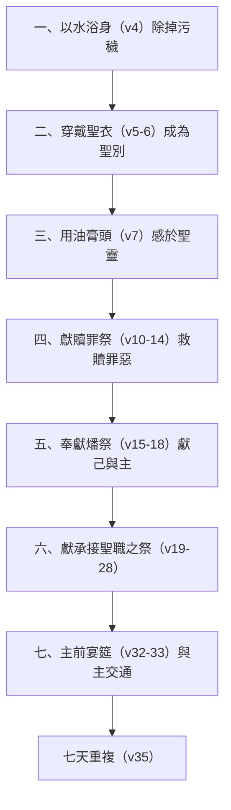

# 出埃及記 第29章

<!-- chapter-navigation:start -->
| [前一章](../02%20出埃及記/第28章.md) | [回目錄](../02%20出埃及記/全書目錄及綱要.md) | [下一章](../02%20出埃及記/第30章.md) |
| :--- | :---: | ---: |
<!-- chapter-navigation:end -->

1. 你使[[亞倫和他兒子（祭司）|亞倫和他兒子]][[承接聖職（分別為聖）|成聖]]，給我供祭司的職分，要如此行：取一隻[[贖罪祭|公牛]]犢，兩隻無殘疾的[[燔祭|公綿羊]]，
2. [[無酵餅]]和調油的無酵餅，與抹油的無酵[[無酵餅|薄餅]]；這都要用細麥麵做成。
3. 這餅要裝在一個[[無酵餅|筐子]]裡，連筐子帶來，又把[[贖罪祭|公牛]]和兩隻公綿羊牽來。
4. 要使[[亞倫和他兒子（祭司）|亞倫和他兒子]]到[[會幕門口]]來，[[洗身（水洗）|用水洗身]]。
5. 要給[[亞倫和他兒子（祭司）|亞倫]]穿上[[聖衣（祭司聖服）|內袍]]和[[聖衣（祭司聖服）|以弗得]]的[[聖衣（祭司聖服）|外袍]]，並以弗得，又帶上[[聖衣（祭司聖服）|胸牌]]，束上以弗得巧工織的帶子。
6. 把[[聖衣（祭司聖服）|冠冕]]戴在他頭上，將聖冠加在冠冕上，
7. 就把[[聖靈膏抹（約壹2：20,27）|膏]]油倒在他頭上[[聖膏油|膏他]]。
8. 要叫他的兒子來，給他們穿上[[聖衣（祭司聖服）|內袍]]。
9. 給[[亞倫和他兒子（祭司）|亞倫和他兒子]]束上[[聖衣（祭司聖服）|腰帶]]，包上[[聖衣（祭司聖服）|裹頭巾]]，他們就憑[[亞倫和他兒子（祭司）|永遠的定例]]得了祭司的職任。又要將亞倫和他兒子[[承接聖職（分別為聖）|分別為聖]]。
10. 你要把[[贖罪祭|公牛]]牽到會幕前，[[亞倫和他兒子（祭司）|亞倫和他兒子]]要[[按手]]在公牛的頭上。
11. 你要在[[神與人相會（耶和華面前）|耶和華面前]]，在[[會幕門口]]，宰這[[贖罪祭|公牛]]。
12. 要取些[[贖罪祭|公牛]]的血，用指頭抹在[[銅壇（燔祭壇）|壇]]的四角上，把血都倒在壇腳那裡。
13. 要把一切蓋臟的[[脂油]]與肝上的[[脂油|網子]]，並兩個腰子和腰子上的脂油，都燒在[[銅壇（燔祭壇）|壇]]上。
14. 只是[[贖罪祭|公牛]]的皮、肉、糞都要用火燒在[[營外焚燒|營外]]。這牛是[[贖罪祭]]。
15. 你要牽一隻[[燔祭|公綿羊]]來，[[亞倫和他兒子（祭司）|亞倫和他兒子]]要[[按手]]在這羊的頭上。
16. 要宰這羊，把血灑在[[銅壇（燔祭壇）|壇]]的周圍。
17. 要把羊切成塊子，洗淨五臟和腿，連塊子帶頭，都放在一處。
18. 要把全羊燒在[[銅壇（燔祭壇）|壇]]上，是給耶和華獻的[[燔祭]]，是獻給耶和華為[[燔祭|馨香的火祭]]。
19. 你要將那一隻[[燔祭|公綿羊]]牽來，[[亞倫和他兒子（祭司）|亞倫和他兒子]]要[[按手]]在羊的頭上。
20. 你要宰這羊，取點血抹在[[亞倫和他兒子（祭司）|亞倫]]的[[血抹右耳垂與手腳大拇指|右耳垂]]上和[[亞倫和他兒子（祭司）|他兒子]]的右耳垂上，又抹在他們右手的[[血抹右耳垂與手腳大拇指|大拇指]]上和右腳的大拇指上；並要把血灑在[[銅壇（燔祭壇）|壇]]的四圍。
21. 你要取點[[聖靈膏抹（約壹2：20,27）|膏]]油和[[銅壇（燔祭壇）|壇]]上的血，彈在[[亞倫和他兒子（祭司）|亞倫]]和他的衣服上，並[[亞倫和他兒子（祭司）|他兒子]]和他兒子的衣服上，他們和他們的衣服就一同[[承接聖職（分別為聖）|成聖]]。
22. 你要取這羊的[[脂油]]和[[脂油|肥尾巴]]，並蓋臟的脂油與肝上的[[脂油|網子]]，兩個腰子和腰子上的脂油並右腿（這是承接聖職所獻的羊）。
23. 再從[[神與人相會（耶和華面前）|耶和華面前]]裝[[無酵餅]]的[[無酵餅|筐子]]中取一個餅，一個調油的餅和一個[[無酵餅|薄餅]]，
24. 都放在[[亞倫和他兒子（祭司）|亞倫]]的手上和[[亞倫和他兒子（祭司）|他兒子]]的手上，作為[[搖祭]]，在[[神與人相會（耶和華面前）|耶和華面前]][[搖祭|搖一搖]]。
25. 要從他們手中接過來，燒在[[神與人相會（耶和華面前）|耶和華面前]][[銅壇（燔祭壇）|壇]]上的[[燔祭]]上，是獻給耶和華為[[燔祭|馨香的火祭]]。
26. 你要取[[亞倫和他兒子（祭司）|亞倫]]承接聖職所獻公羊的胸，作為[[搖祭]]，在[[神與人相會（耶和華面前）|耶和華面前]][[搖祭|搖一搖]]，這就可以作你的分。
27. 那[[搖祭]]的胸和[[舉祭]]的腿，就是承接聖職所搖的、所舉的，是歸[[亞倫和他兒子（祭司）|亞倫和他兒子]]的。這些你都要成為聖，
28. 作[[亞倫和他兒子（祭司）|亞倫]]和他子孫從以色列人中永遠所得的分，因為是[[舉祭]]。這要從以色列人的[[平安祭]]中，作為獻給耶和華的舉祭。
29. [[亞倫和他兒子（祭司）|亞倫]]的[[聖衣（祭司聖服）|聖衣]]要留給他的子孫，可以穿著受[[聖靈膏抹（約壹2：20,27）|膏]]，又穿著[[承接聖職（分別為聖）|承接聖職]]。
30. 他的子孫接續他當祭司的，每逢進會幕在[[聖所]]供職的時候，要穿七天。
31. 你要將承接聖職所獻公羊的肉煮在聖處。
32. [[亞倫和他兒子（祭司）|亞倫和他兒子]]要在[[會幕門口]]吃這羊的肉和筐內的餅。
33. 他們吃那些贖罪之物，好[[承接聖職（分別為聖）|承接聖職]]，使他們[[承接聖職（分別為聖）|成聖]]；只是外人不可吃，因為這是聖物。
34. 那承接聖職所獻的肉或餅，若有一點留到早晨，就要用火燒了，不可吃這物，因為是聖物。
35. 你要這樣照我一切所[[山上的樣式|吩咐]]的，向[[亞倫和他兒子（祭司）|亞倫和他兒子]]行[[承接聖職（分別為聖）|承接聖職]]的禮七天。
36. 每天要獻[[贖罪祭|公牛]]一隻為[[贖罪祭]]。你潔淨[[銅壇（燔祭壇）|壇]]的時候，壇就潔淨了；且要用膏抹壇，使壇成聖。
37. 要潔淨[[銅壇（燔祭壇）|壇]]七天，使壇成聖，壇就[[壇成為至聖與挨著壇的都成為聖|成為至聖]]。凡[[壇成為至聖與挨著壇的都成為聖|挨著壇]]的都成為聖。
38. 你每天所要獻在[[銅壇（燔祭壇）|壇]]上的就是兩隻一歲的羊羔；
39. [[每日獻祭（常獻燔祭）|早晨]]要獻這一隻，[[每日獻祭（常獻燔祭）|黃昏]]的時候要獻那一隻。
40. 和這一隻羊羔同獻的，要用細麵伊法十分之一與搗成的油一欣四分之一調和，又用酒一欣四分之一作為[[奠酒|奠祭]]。
41. 那一隻羊羔要在[[每日獻祭（常獻燔祭）|黃昏]]的時候獻上，[[山上的樣式|照著]][[每日獻祭（常獻燔祭）|早晨]]的[[素祭（minchah）|素祭]]和[[奠酒|奠祭]]的禮辦理，作為獻給耶和華[[燔祭|馨香的火祭]]。
42. 這要在[[神與人相會（耶和華面前）|耶和華面前]]、[[會幕門口]]，作你們世世代代[[每日獻祭（常獻燔祭）|常獻的燔祭]]。我要在那裡與你們[[神與人相會（耶和華面前）|相會]]，和你們[[神與人相會（耶和華面前）|說話]]。
43. 我要在那裡與以色列人[[神與人相會（耶和華面前）|相會]]，[[會幕（帳幕整體）|會幕]]就要因我的[[神的榮耀|榮耀]]成為聖。
44. 我要使[[會幕（帳幕整體）|會幕]]和[[銅壇（燔祭壇）|壇]]成聖，也要使[[亞倫和他兒子（祭司）|亞倫和他的兒子]]成聖，給我供祭司的職分。
45. 我要住在以色列人中間，作他們的神。
46. 他們必知道我是耶和華─他們的神，是將他們從埃及地領出來的，為要住在他們中間。我是耶和華─他們的神。

---

## 本章知識節點

### 人物
- [[亞倫和他兒子（祭司）]]
- [[摩西]]

### 原文
- [[聖膏油]]
- [[按手]]
- [[搖祭]]
- [[舉祭]]
- [[素祭（minchah）]]
- [[無酵餅]]
- [[脂油]]

### 主題
- [[聖衣（祭司聖服）]]
- [[會幕（帳幕整體）]]
- [[銅壇（燔祭壇）]]
- [[營外焚燒]]
- [[摩西代行祭司職分]]
- [[血抹右耳垂與手腳大拇指]]

### 地點
- [[會幕門口]]
- [[聖所]]

### 文化
- [[奠酒]]

### 神學
- [[承接聖職（分別為聖）]]
- [[洗身（水洗）]]
- [[贖罪]]
- [[贖罪祭]]
- [[基督作贖罪祭]]
- [[燔祭]]
- [[平安祭]]
- [[每日獻祭（常獻燔祭）]]
- [[神與人相會（耶和華面前）]]
- [[神的榮耀]]
- [[神的同在]]
- [[山上的樣式]]

### 解經爭議
- [[壇成為至聖與挨著壇的都成為聖]]

### 互文
- [[贖價（基督作贖價）（來9：22）|來9：22 若不流血罪就不得赦免]]
- [[信徒作祭司（彼前2：5,9）|彼前2：5,9 被建造成靈宮、作聖潔的祭司]]
- [[披戴基督（羅13：14）|羅13：14 總要披戴主耶穌基督]]
- [[聖靈膏抹（約壹2：20,27）|約壹2：20,27 你們從那聖者受了恩膏]]
- [[義行的細麻（啟19：8）|啟19：8 細麻衣就是聖徒所行的義]]
- [[基督作智慧（林前1：30）|林前1：30 基督成了我們的智慧]]

---

## 本章整理

出25-28 交代了房子、器具與衣服，本章交代人怎麼被放進去。KC 用一句話點出它與前章的關係，也點出它為什麼非有不可：「作祭司是一回事，盡祭司的職事是另一回事。」出28 的[[聖衣（祭司聖服）|聖衣]]不夠，「還必須有一個承接聖職」。GT《精讀本》從全卷的時間軸提醒一件事：本章寫的是條例，「真正的委任儀式是在建立了會幕（40:17），而且制定祭司制度之後（利1-7章）才執行的（利8:1-36）。這是出埃及一年後的事情」；GT《中文聖經註釋》也指出「這一章聖經，仍然是繼續摩西在山上領受神的吩咐，但在出埃及記中卻找不到敘述執行此吩咐的記載。在利未記第八、九兩章，才找到摩西按這在山上的吩咐，膏立亞倫和他的兒子為祭司。」

GT 引丁良才把整場典禮列成一份清單，本章的結構也就一目了然：

### 一、預備：祭物、三種餅與洗身（v1-4）

神先交代要備的東西：一隻公牛犢、兩隻無殘疾的公綿羊，以及細麥麵做的[[無酵餅]]、調油的無酵餅、抹油的無酵薄餅。「無殘疾」不是形容詞而是條件——GT《精讀本》說它「直譯就是『完全』的意思」，理由是「所有的祭物最終象徵著，為了人類的罪被釘死在十字架上的無罪（彼前2:22）的耶穌基督」；BH 也指出這規定「指向獻祭必須完全，預表那無瑕疵的神的羔羊（彼前1:19）」。GT 引丁良才則從神的一面說：「神不能悅納有殘疾的祭物（瑪1:6-14），祂只要上好的（利22:19-25）。」

三種餅為什麼要用細麥麵，GT《舊約背景註釋》從農業社會的角度解釋：「用來分別聖幕、祭壇、祭司為聖的物品，都是神所賜給百姓之土地豐饒的代表。用來製造無酵餅和薄餅的必須是最上等的麵粉，才能作為務農維生之百姓當獻的祭物。」小麥與橄欖油都是古以色列的主要商品作物，把兩者調和獻上「就是承認每年賜予豐饒的神」。不過同一份註釋也沒有把話說滿：「提供無酵餅、調油無酵餅、抹油無酵薄餅的含義已不可考，它可能代表當時常見的糕餅，又可能是特別為祭儀而設的物品。」CT 的靈意讀法則逐樣對應：無酵指不含罪惡的酵，「調油」指混合橄欖油、油代表聖靈，「薄餅」一碰即碎「代表感覺靈敏並非遲鈍」。

接著是[[洗身（水洗）|用水洗身]]。這一步洗到什麼程度、在哪裡洗，各家並不一致：GT《舊約背景註釋》主張全身浸入——「分別為聖典禮規定他們務須全身浸入水中。洗身後只需在執行職務之前洗手洗腳就可以了」；GT《中文聖經註釋》認為地點就是洗濯盆，「因為洗濯盆是擺在帳幕與銅祭壇之中間的」，並強調「這洗身是一種神聖禮儀的洗，是一種潔淨儀式，而不是普通的洗澡」；GT《串珠》則指出經文其實沒有交代地點：「表明他們要洗淨全身，但在那裡洗則沒有指明；會幕的院子裡有洗濯盆，但只作洗手洗腳之用。」至於它指向什麼，GT《丁道爾》一句話收尾：洗濯盆「就是為此事以及其他潔淨禮儀而造。這是基督教洗禮的先驅（多三5；弗五26）」。KC 把次序講得最要緊：「在我們能看見主耶穌的工作以先，我們首先需要用水洗淨。水代表神的話在它潔淨的能力上（弗5:26）」，並引林前6:11——洗淨在成聖之前。

### 二、穿戴與受膏：大祭司與眾祭司的分別（v5-9）

穿衣的次序與出28 製作的次序相反。CT 指出：「這些聖衣的穿著順序是由裡而外：內袍、外袍、以弗得、胸牌、帶子，與出28章所記述的製作順序剛好相反。」CT 另注意到一個缺項：「這裡沒有提到褲子（參28:42），它不屬於聖衣，大概是在用水洗身時就已穿上。」GT 引丁良才拿利8:7-9 的九步次序來對照，並指出本章「沒有提到第二第七層，又顛倒第五六層」——也就是說本章給的並非完整的穿戴流程，而是重點式的列舉。父子之間的差別在此也很明顯：GT《舊約背景註釋》說亞倫的兒子「在父親手下作為次一等的祭司，祭服沒有亞倫的那麼華麗……服飾雖使他們有別於其他以色列人，分別為聖的典禮卻沒有這麼繁複」。

[[聖膏油]]倒在亞倫頭上這一步，GT 引丁良才拆成三層意義：「（一）尊榮，以色列人以橄欖樹為眾樹之首（士九8-9）；（二）恒忍（橄欖油能保存食物不壞）；（三）事主，以色列人以聖油分別人為聖」，並指出以色列中受膏者分三等：先知、祭司、君王。GT《丁道爾》補上一條歷史線：「在王國時代初期，聖靈恩賜往往隨膏立而賜下（撒上十6），故此，後來可能成為屬靈恩賜的象徵。後來『神所膏立的』和『神所揀選的』幾乎成為同義詞（詩八十九3）。」但誰受膏，經文之間有張力——GT《舊約背景註釋》直接點出：「按照本段和利未記八12，只有大祭司分別為聖就職時，才需要在頭上倒油膏立。然而在出埃及記三十30和四十15，亞倫父子卻一同受膏。」

> [!important] 亞倫受膏在說到血以先
>
> 第7節膏油倒在亞倫頭上，而血要到第10節以後才出現。KC 認為這個次序本身就是分別：
>
> 「雖然亞倫和他的兒子一同被穿上衣服，大祭司卻有一個特別的位置。他得著特別的衣服，並且是在說到血以先就受膏抹。這也正是我們作祭司與主耶穌之間的分別。主耶穌也是在祂成就十字架的工作以先，就受了聖靈的膏抹（徒10:38；太3:16）。而我們是在祂的血流出、並接受了福音之後，才受膏，就是領受了聖靈（弗1:13）。」
>
> KC 另注意到一個細節：「眾子看見亞倫怎樣受膏」——「因此我們必須先對主耶穌作大祭司有些認識，才能照著神的定意來運用我們的祭司職分。」

「將亞倫和他兒子分別為聖」這句話的原文字面是「使手充滿」。CT 說明它與35節的「[[承接聖職（分別為聖）|承接聖職]]」同字，「表示祭司被分別出來，今後兩手專一的作服事神的工作」；GT《精讀本》從實務面解：「即把要獻給神的祭物在祭司手上放滿，使他能夠履行祭司的職責」。這個說法有外證，也有其限度——GT《丁道爾》指出這詞「是閃族文化的專用術語（在馬里文獻中已有出現），大概取自『將職位所有權益授與某人』。然而這字在本節大概沒有這個含義；將之譯作『使他就職』（NEB 作 install）比『授任』（RSV 作 ordain）為佳」；GT《串珠》則坦承：「這句話背後所反映的古代授職儀式，現已失傳。」

### 三、贖罪祭：公牛與營外的火（v10-14）

三隻祭牲每一隻在被宰以前都要[[按手]]。各家對這個動作的解釋高度一致：GT《串珠》說「代表認同，祭牲之死相等於獻祭者之死」，GT《丁道爾》說「按手代表認同，是贖罪祭的通例，清楚表示：祭牲之死被認可為與獻祭者死亡相同」，而 GT 引丁良才把它拆成四層：「（一）祭司的罪歸於公牛；（二）公牛的義（或作無辜）歸於祭司；（三）公牛代替祭司死；（四）祭司代替公牛活。」GT《舊約背景註釋》另補上一個實務環節：按手之前「祭司都必須檢查牠是否合格。檢查過後，祭司就要執行象徵認可的儀式……為牲畜的死亡和犧牲的目標而負責」。

[[贖罪祭]]為什麼要排在最前面，GT《中文聖經註釋》講出理由：「祭司也是人，人就有罪。因此，要分別祭司為聖以事奉神，就必先為他獻贖罪祭。」而祭牲的規格本身就在說話——同一則註釋註明公牛犢是「祭牲中最大的」。血有兩個去處，各有其意：抹在[[銅壇（燔祭壇）|壇]]的四角「是表明壇因此潔淨，神就臨在壇上」，倒在壇腳則是「贖罪祭中，惟一將血倒在壇腳的。表示受職者的潔淨」；GT《舊約背景註釋》從結構上說同一件事：「必須用贖罪祭的血從根基（底座）開始淨化，它才能完全聖潔。」CT 的靈意讀法落在同一處：血倒在壇腳表示「流血的功效成了救恩的根基」。

[[脂油]]與皮肉糞的分開處理，是本段最有神學重量的一筆。GT《精讀本》解釋[[營外焚燒]]的理由：以色列的營「是神臨在的場所，不能使其被玷污，所以把擔當人類罪行的祭物，在營外火燒。這象徵了日後耶穌基督將背負人類的罪，釘死在耶路撒冷城外（來13:11-13）」；CT 從兩處火的差別讀出兩重意義：「前者成為馨香之氣蒙神的悅納……後者是審判的火，預表基督為我們受苦。這樣，我們也當出到營外，就了祂去，忍受祂所受的凌辱（來13:13）。」KC 則抓住那個例外：「贖罪祭的一切都必須在營外燒掉，作為神所憎惡的。贖罪祭的脂油卻不是神所憎惡的。那要在壇上」——即使在最黑的祭裡，仍有一部分是直接歸神的。

### 四、燔祭：全然焚燒與馨香（v15-18）

第一隻公綿羊全然燒在壇上作[[燔祭]]。它與贖罪祭的差別不在動作而在方向：GT《中文聖經註釋》指出「獻贖罪祭時，奉獻祭牲的人按手，是為認罪。但在此獻感恩的燔祭時，按手是舒誠，是向神感恩。因此祭牲的肉並不為罪所污染」；KC 說得更直接：「藉著把自己與贖罪祭認同，祭司的不配，就彷彿轉到了贖罪祭身上。在燔祭裡卻是反過來：燔祭的尊貴與馨香，就彷彿轉到了祭司身上。」一個把不配送出去，一個把配得帶回來，而兩者靠的是同一個按手的動作。

|  | 贖罪祭（v10-14） | 燔祭（v15-18） | 承接聖職之祭（v19-28） |
| --- | --- | --- | --- |
| 祭牲 | 公牛犢 | 第一隻公綿羊 | 第二隻公綿羊 |
| 按手的方向 | 罪轉到祭牲 | 馨香轉到祭司 | 認同祂的獻上 |
| 血 | 抹壇四角、倒壇腳 | 灑壇的周圍 | 抹耳、手、腳，灑壇四圍，彈在衣服上 |
| 燒 | 脂油上壇、皮肉糞在營外 | 全羊上壇 | 脂油、肥尾巴、右腿與餅上壇 |
| 剩下的部分 | 無（全數毀滅） | 無（全然焚燒） | 胸與腿歸祭司，肉與餅在會幕門口吃 |

「馨香的火祭」是本章反覆出現的一個詞。GT《串珠》給的是本義：「本描述燒烤祭肉時所產生的撲鼻香味，後用來形容祭物為神所悅納」；GT《舊約背景註釋》則把它放進古代近東的對照裡——祭物的香氣也能吸引美索不達米亞的神祇（如洪水故事《吉加墨斯史詩》），「然而這些神祇卻必須倚賴這些食物維生。按照以色列的傳統，『馨香的火祭』一語表示祭物獻得合宜，能夠討神喜歡（見：創八21）……足以蒙神悅納，並且得蒙悅納──但不是作為祂的食物──的犧牲。」同一份註釋也說明全然焚燒的份量：「牧民十分珍惜牲口的肉，然而作為豐饒象徵的牛羊都必須完全燒滅，這個對神的犧牲才算全面。」CT 從「切成塊子」讀出事奉者的一面：「表徵破碎自己，任何信徒若要事奉神，便須接受十字架的破碎。」

### 五、承接聖職之祭：血抹耳手腳、搖祭與舉祭（v19-28）

第二隻公綿羊是[[平安祭|承接聖職所獻的羊]]，KC 說它是「平安祭的一種特別形式。平安祭是交通的祭」。它與前兩隻最大的不同，是血不只上壇——[[血抹右耳垂與手腳大拇指|要先抹在人身上]]。三個部位的對應各家一致：CT 逐一列出耳「聽從神的話」、手「為神作工」、腳「為神行走道路」；GT 引丁良才最短：「『右耳』——聽主的話。『右手』——做主的工。『右腳』——行主的道」；GT《舊約背景註釋》把它與壇的血禮並列：「血怎樣令祭壇合神所用，亦同樣可以用來選派祭司的各樣器官：聽神的話、用手獻祭、用腳領人崇拜。」GT《丁道爾》另從殘缺的角度提供旁證：「失去手拇指和腳拇趾是無能和無用的代表（士一6），將之獻給神，就是將全副精力獻上的意思」，並把耳垂連到「耳號」——「似乎是永久為奴者自甘順服的記號」。GT《中文聖經註釋》則指出同一套動作也用在大痲瘋得潔淨的禮上（利14:14-17），只是在祭司身上另有分別為聖的意義。

接著血與[[聖靈膏抹（約壹2：20,27）|膏油]]一同彈在人和衣服上。GT《中文聖經註釋》認為 21 節是整場典禮的頂點，並反駁一種來源批判的說法：「有些學者把這第21節認作是後人加筆，那是錯誤的。因為這實際是整個授職禮的高峰。」血與油的分工，GT 引丁良才一句話說完：「這血表明贖罪的意思，膏油表明成聖的意思」。KC 從應用面收在同一處：「作為祭司的全部外在行為，都必須與那血的價值相符」，而油則是能力——「唯有藉著聖靈的能力，真正的祭司事奉才是可能的、才是神所喜悅的」。

[[搖祭]]與[[舉祭]]的動作，CT 分得最清楚：「『搖祭』指呈平面前後搖動；『舉祭』指呈垂直上下抬放。」GT《串珠》補上方向：祭品「不是向兩邊搖動，而是向著祭壇一前一後揮搖，象徵祭品先獻給神，然後才歸祭司所用」。不過 GT《舊約背景註釋》對「搖」這個譯法提出異議：那一大堆祭物「很可能只是抬起，沒有真的搖動。如此聖物才不致失去平衡，甚或掉在地上。因此經文的用語譯作『抬祭』（與『舉祭』有別）更為妥當」，並舉埃及浮雕為旁證；至於姿態的意義，同一則註釋讀為「象徵一切祭物都是源自神，屬乎神的」。而 KC 讀的是被搖的東西本身：胸與腿。「我們可以讚嘆祂的愛——胸所說的就是這個，因為心在那裡；我們可以看見祂的能力——腿所說的就是這個。胸與腿是給亞倫和他兒子的。作為祭司，我們特別可以默想主耶穌的愛與能力。」

> [!important] 為他們 → 在他們身上 → 藉著他們
>
> KC 用三個介係詞把承接聖職的骨架排出來：
>
> 「首先，有事情為他們發生了：祭牲為他們被宰殺。然後，有事情在他們身上發生了：他們被血分別為聖，被油膏抹。現在，必須有事情藉著他們發生：他們必須獻上搖祭與舉祭。」
>
> 前兩步祭司是受者，第三步才是行動者——而搖祭正是祭司頭一次主動獻上的東西。GT 引丁良才描述了那一刻的實際動作：摩西「將自己的手放在亞倫和他兒子的手下，將他們的手前後平搖，親自使他們行祭司所應行的頭一件事」。

### 六、祭司當得的分、七天與潔淨壇（v29-37）

祭肉與餅要在聖處煮、在[[會幕門口]]吃，外人不可吃，也不可留到早晨。GT《舊約背景註釋》從祭司的生計解釋這條規定的必要：「由於祭司只許負責宗教事務，又不能擁有土地，他們維生所需，惟靠壇前祭物的一部分」，而剩下的必須毀滅，是「以避免聖物受到濫用」。「外人」是誰，GT《中文聖經註釋》承認不好界定：這字「可有『仇敵』、『陌生人』或『野蠻人』等含義……頗難了解」，耶路撒冷聖經譯作「平信徒」，現代中文譯本則技巧地避開，譯為「只有祭司可吃」。KC 讀「吃」這個動作：「這樣，祭物就成了他們自己的一部分。對我們而言，吃在屬靈上意味著：當我們帶著渴望認識祂的飢餓來讀神的話時，我們就被那食物塑造。」

聖衣要留給子孫，接續的人在[[聖所]]供職時要穿七天（v29-30）。GT《舊約背景註釋》舉出這條款實際被執行的一次：「亞倫去世時摩西脫去他身上一切聖服，然後在為期七日的儀式中，轉授給他兒子以利亞撒穿上（民20:22-29）。」七天的意義，GT《精讀本》讀為完全：「連續7天進行委任祭司儀式，表明神要他們徹底地贖罪、完全地奉獻和事奉神。」

最後一段把成聖的對象從人轉到壇。壇之所以需要贖罪，是因為它是人手所造——GT《串珠》說壇「是出於人手所造，故最初被視為『不潔』」，GT《丁道爾》也說「不像二十章24、25節指定的石壇或土壇，用的是天然材料」。而 [[壇成為至聖與挨著壇的都成為聖|「凡挨著壇的都成為聖」]]這句話怎麼讀，各家分成兩路：GT《串珠》認為它「暗示『成聖』這本質可藉接觸而感染到」，GT《舊約背景註釋》同意並補上反面的顧慮——「防止不潔的人或物觸摸祭壇也十分重要，免得其聖潔遭受損失或污染」；GT 引丁良才卻譯成資格要求：「都必須成為聖，意思說，凡不聖凜的都不可挨近壇。」一邊說聖潔會外溢，一邊說聖潔是門檻，而經文兩邊都給了支點。

### 七、每日常獻的祭與神的同住（v38-46）

從38節起，CT 指出經文換了主題：「不再是祭司承接聖職的禮儀，而是祭司日常獻祭的規定。」[[每日獻祭（常獻燔祭）|每天早晚各一隻一歲的羊羔]]，配[[素祭（minchah）|細麵調油的素祭]]與[[奠酒|酒的奠祭]]。GT《舊約背景註釋》給出它的專名：這兩隻羊羔「稱為塔米德〔tamid〕，即『常獻』的祭」，而它的作用是「對百姓象徵神一直與他們同在，和他們有經常遵守盟約的責任。祭物不斷流向祭壇，更能維持壇的聖潔」。GT《丁道爾》指出它後來的份量：「每日常獻的祭後來視為律法的中心，即使在緊急狀態時被逼中斷，也是聳人聽聞的禍事（但八11）」，並算了一筆帳——「單是常獻的祭，每年便需要羊羔七百頭」；同一則註釋還把它連到一個熟悉的場景：「路加福音二章8節的牧羊人，大概也是致力於供應聖殿獻祭的羊羔。」而素祭與奠祭為何非有不可，GT《串珠》說得最白：「獻與神的燔祭若要完全，必須包括一個家庭平常進餐時的各種要素（肉、面和酒）。」

KC 把每日獻祭的理由講得很重：「神要祂的百姓每天記得，祂能與他們同住，只在一個不斷的祭的基礎上……百姓若忘了那祭對神的價值，就忘了自己作為神子民存在的理由。那時就有人的地位了，人就開始自以為重要，偏離神。」

本章最後四節是神親自的宣告。相會的地點被釘在壇前，CT 指出這是廣義的說法：「神乃是在會幕中的至聖所之內，法櫃上的施恩座上二基路伯中間與人相會」才是狹義；GT《中文聖經註釋》另抓到一個譯文細節：「和你們說話 原文只用單數的你，指和摩西說話，而不是和眾以色列人說話。」至於「會幕就要因我的[[神的榮耀|榮耀]]成為聖」，同一則註釋把因果講明白：「聖幕和壇的材料雖屬珍貴，仍然是世間的物質，為人手所造。它們之所以成聖，並非因本身的華麗或貴重，乃因神的臨在。」而末了那句宣告，GT《丁道爾》讀為全段的頂點：「本段以一句有力的聲明作結，說明神的心意是要住在祂子民中間。實際上本節直截了當地指出，這就是神起初將他們從埃及拯救出來的宗旨……因此本節就是以上經文的總綱和巔峰。」

出25:8 說「當為我造聖所，使我可以住在他們中間」，出29:45 說「我要住在以色列人中間」——中間隔著五章的規格、器具、聖衣與承接聖職，目的自始至終沒有變。KC 給的收束把整段接了起來：「神在祂裡面看見祂的百姓，也看見祂祭物的價值。這就是神能夠、也願意與祂百姓同住、與他們相會、與他們聚集的根基……為此，祂把他們從罪的奴役中拯救出來。」出埃及的目的，到這裡才把話說完：不是為了離開埃及，是為了神可以住下來。

**參考資料**
https://biblehub.com/study/exodus/29.htm
https://www.ccbiblestudy.org/Old%20Testament/02Exo/02CT29.htm
https://www.ccbiblestudy.org/Old%20Testament/02Exo/02GT29.htm
https://www.kingcomments.com/en/bible-studies/Exo/29

<!-- chapter-navigation:start -->
| [前一章](../02%20出埃及記/第28章.md) | [回目錄](../02%20出埃及記/全書目錄及綱要.md) | [下一章](../02%20出埃及記/第30章.md) |
| :--- | :---: | ---: |
<!-- chapter-navigation:end -->
