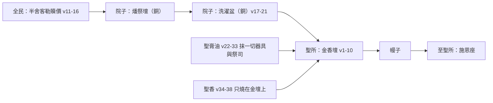

# 出埃及記 第30章

<!-- chapter-navigation:start -->
| [前一章](../02%20出埃及記/第29章.md) | [回目錄](../02%20出埃及記/全書目錄及綱要.md) | [下一章](../02%20出埃及記/第31章.md) |
| :--- | :---: | ---: |
<!-- chapter-navigation:end -->

1. 你要用[[皂莢木]]做一座[[金香壇（香壇）|燒香的壇]]。
2. 這[[金香壇（香壇）|壇]]要四方的，長一肘，寬一肘，高二肘；[[壇的四角（香壇）|壇的四角]]要與壇接連一塊。
3. 要用[[精金]]把[[金香壇（香壇）|壇]]的上面與壇的四圍，並[[壇的四角（香壇）|壇的四角]]包裹；又要在壇的四圍鑲上金牙邊。
4. 要做兩個[[精金|金]]環安在牙子邊以下，在[[金香壇（香壇）|壇]]的兩旁，兩根橫撐上，作為穿槓的用處，以便抬壇。
5. 要用[[皂莢木]]做槓，用[[精金|金]]包裹。
6. 要把[[金香壇（香壇）|壇]]放在法櫃前的幔子外，對著法櫃上的施恩座，就是我要與你相會的地方。
7. [[亞倫和他兒子（祭司）|亞倫]]在[[金香壇（香壇）|壇]]上要燒馨香料做的香；每早晨他收拾燈的時候，要燒這香。
8. 黃昏點燈的時候，他要在耶和華面前燒這香，作為世世代代[[基督代禱（來7：25）|常燒的香]]。
9. 在這[[金香壇（香壇）|壇]]上不可奉上[[異樣的香與香壇的禁令|異樣的香]]，不可獻燔祭、素祭，也不可澆上奠祭。
10. [[亞倫和他兒子（祭司）|亞倫]]一年一次要在[[金香壇（香壇）|壇]]的[[壇的四角（香壇）|角]]上行贖罪之禮。他一年一次要用贖罪祭牲的血在壇上行贖罪之禮，作為世世代代的定例。這壇在耶和華面前為至聖。
11. 耶和華曉諭摩西說：
12. 你要按以色列人被數的，計算總數，你數的時候，他們各人要為自己的生命把贖價奉給耶和華，免得數的時候在他們中間有災殃。
13. 凡過去歸那些被數之人的，每人要按聖所的平，拿銀子半舍客勒；這半舍客勒是奉給耶和華的禮物（一舍客勒是二十季拉）。
14. 凡過去歸那些被數的人，從二十歲以外的，要將這禮物奉給耶和華。
15. 他們為贖生命將禮物奉給耶和華，富足的不可多出，貧窮的也不可少出，各人要出半舍客勒。
16. 你要從以色列人收這[[半舍客勒（贖罪銀）|贖罪銀]]，作為[[會幕（帳幕整體）|會幕]]的使用，可以在耶和華面前為以色列人作紀念，贖生命。
17. 耶和華曉諭摩西說：
18. 你要用[[銅]]做[[洗濯盆（銅盆）|洗濯盆和盆座]]，以便洗濯。要將盆放在[[會幕（帳幕整體）|會幕]]和壇的中間，在盆裡盛水。
19. [[亞倫和他兒子（祭司）|亞倫和他的兒子]]要在這[[洗濯盆（銅盆）|盆]]裡洗手洗腳。
20. 他們進[[會幕（帳幕整體）|會幕]]，或是就近壇前供職給耶和華獻火祭的時候，必用水[[話語潔淨（弗5：26）|洗濯]]，免得死亡。
21. 他們洗手洗腳就免得死亡。這要作[[亞倫和他兒子（祭司）|亞倫]]和他後裔世世代代永遠的定例。
22. 耶和華曉諭摩西說：
23. 你要取上品的[[香料乳香沒藥貿易|香料]]，就是流質的[[聖膏油|沒藥]]五百舍客勒，香[[聖膏油|肉桂]]一半，就是二百五十舍客勒，[[聖膏油|菖蒲]]二百五十舍客勒，
24. [[聖膏油|桂皮]]五百舍客勒，都按著聖所的平，又取[[聖膏油|橄欖油]]一欣，
25. 按做香之法調和做成聖膏油。
26. 要用這膏油抹[[會幕（帳幕整體）|會幕]]和法櫃，
27. 桌子與桌子的一切器具，燈臺和燈臺的器具，並香壇、
28. 燔祭壇，和壇的一切器具，[[洗濯盆（銅盆）|洗濯盆和盆座]]。
29. 要使這些物成為聖，好成為至聖；凡[[壇成為至聖與挨著壇的都成為聖|挨著]]的都成為聖。
30. 要膏[[亞倫和他兒子（祭司）|亞倫和他的兒子]]，使他們成為聖，可以給我供[[亞倫和他兒子（祭司）|祭司]]的職分。
31. 你要對以色列人說：這油，我要世世代代以為聖膏油。
32. 不可倒在別人的身上，也不可按這調和之法做與此相似的。這膏油是聖的，你們也要以為聖。
33. 凡調和與此相似的，或將這膏膏在別人身上的，這人要從民中[[剪除]]。
34. 耶和華[[山上的樣式|吩咐]]摩西說：你要取馨香的[[香料乳香沒藥貿易|香料]]，就是[[聖香（清淨聖潔的香）|拿他弗]]、[[聖香（清淨聖潔的香）|施喜列]]、[[聖香（清淨聖潔的香）|喜利比拿]]；這馨香的香料和淨[[聖香（清淨聖潔的香）|乳香]]各樣要一般大的分量。
35. 你要用這些加上[[立約的鹽|鹽]]，按做香之法做成[[聖香（清淨聖潔的香）|清淨聖潔的香]]。
36. 這香要取點[[搗細香料遮掩施恩座|搗得極細]]，放在[[會幕（帳幕整體）|會幕]]內、法櫃前，我要在那裡與你相會。你們要以這香為至聖。
37. 你們不可按這調和之法為自己做香；要以這香為聖，歸耶和華。
38. 凡做香和這香一樣，為要聞香味的，這人要從民中[[剪除]]。

---

## 本章知識節點

### 人物
- [[亞倫和他兒子（祭司）]]

### 原文
- [[皂莢木]]
- [[聖膏油]]
- [[聖香（清淨聖潔的香）]]
- [[舍客勒]]
- [[剪除]]
- [[半舍客勒（贖罪銀）]]

### 主題
- [[金香壇（香壇）]]
- [[壇的四角（香壇）]]
- [[洗濯盆（銅盆）]]
- [[精金]]
- [[銅]]
- [[會幕（帳幕整體）]]
- [[立約的鹽]]
- [[凡火]]
- [[搗細香料遮掩施恩座]]
- [[異樣的香與香壇的禁令]]

### 地點
- [[聖所]]

### 文化
- [[香料乳香沒藥貿易]]

### 事件
- [[數點民數]]

### 歷史
- [[大贖罪日（Yom Kippur）條例]]

### 背景
- [[古代近東的人口統計]]

### 神學
- [[山上的樣式]]
- [[神的同在]]

### 解經爭議
- [[壇成為至聖與挨著壇的都成為聖]]
- [[香壇的位置與歸屬之爭]]

### 互文
- [[基督代禱（來7：25）|來7：25 祂長遠活著替他們祈求]]
- [[聖徒禱告如香（啟5：8, 8：3-4）|啟5：8, 8：3-4 香就是眾聖徒的祈禱]]
- [[贖價（基督作贖價）|可10：45 人子來要捨命作多人的贖價]]
- [[話語潔淨（弗5：26）|弗5：26 用水藉著道把教會洗淨]]
- [[聖靈膏抹（約壹2：20,27）|約壹2：20,27 你們從那聖者受了恩膏]]

---

## 本章整理

KC 用一句話定位本章在出25-31 裡的角色：這一章「顯明作祭司親近神所需要的器物」。但本章的體例與前幾章不同——GT《丁道爾》認為它應視為附記：「本段討論幾個個別的事務，相互之間難以看出有什麼關聯……因此最好是將本段視為附記，討論互不相干的問題。這些題目有些是前面缺口的補充（如：香壇），有些則為前面視為當然的事物提供解釋（如：膏油、香、洗濯盆）。」GT《串珠》的判斷相同：「這些指示彼此之間沒有直接關係；它們主要是補充以上幾章引述過而未有詳細記載的指示。」GT《精讀本》則把本章的結構列了出來：香壇（1-10節）、洗濯盆（17-21節）、製聖膏（22-33節），中間夾著生命贖價（11-16節），末了是聖香（34-38節）。

散開來看它們互不相干，合起來看卻是一條進門的次序——院子裡先被贖、被洗，才進得了包金的聖所：

### 一、香壇：材料、位置與晨昏的香（v1-8）

金香壇（מִזְבַּח מִקְטַר קְטֹרֶת，mizbach miqtar qetoreth，H4196/H4729/H7004）用[[皂莢木]]做、外包[[精金]]，長寬各一肘、高二肘，四角與壇接連一塊，四圍鑲金牙邊（זֵר זָהָב，zer zahav，H2213/H2091）——CT 說明牙邊的用途很實際：「意指又要在壇的四圍上方鑲嵌牙齒狀金邊，用意在防止壇上的物件滑落。」GT《精讀本》換算成公制是長寬各45公分、高90公分。它的外形並不獨特：GT《丁道爾》指出「燒香的壇，合乎古代世界常見的大小和樣式。香壇的形狀類似半截的小壁柱，四面有小型的角」。名字則有兩個——GT《中文聖經註釋》：「這壇有時被稱為香壇（參看路1:11），有時亦稱為金壇（見王上7:48）。」

[[金香壇（香壇）|香壇]]的位置是本章第一個要點：放在法櫃前的幔子外，正對施恩座。GT《中文聖經註釋》描述它在[[聖所]]裡的相對位置：「這金香壇是放在聖所靠幔子的正中位置，與聖所中的其他兩器物鼎足三立：陳設餅桌在其左，金燈臺在其右。這就表明金香壇比其他兩器物有更重要的地位。」不過它究竟該算誰的器具，[[香壇的位置與歸屬之爭|各家並不一致]]：GT《啟導本》主張香壇「隔著幔子，對正至聖所內的施恩座，因此可算作至聖所的物品（來9:3-4）」；GT《丁道爾》卻明確判低這個讀法：「來9:4說，香壇在幔子後面、約櫃旁邊，可能性較低。」GT《舊約背景註釋》另給了它一個雙重角色：這陳設「一方面代表神的臨在，另一方面又能保護人，在人的眼前隱蔽這臨在」。

> [!important] 兩座壇：一座給所有人，一座只給已經得救的人
>
> KC 指出金香壇是「第二座壇」，而它與[[銅|銅壇]]的每一處差異都在說話：
>
> | | 燔祭壇（銅壇） | 金香壇 |
> | --- | --- | --- |
> | 位置 | 院子裡 | 聖所裡，就在幔子前 |
> | 材質 | 銅——「說到神的公義」 | 金——「說到神的榮耀」 |
> | 尺寸 | 較大（長寬各五肘） | 較小（長寬各一肘） |
> | 為誰 | 「為著所有人：人人都可以在主耶穌工作的基礎上得救」 | 「只為那些已經得救的、可以作祭司帶著敬拜親近神的人」 |
>
> KC：「香壇的尺寸比燔祭壇小。」——尺寸的差別在他讀來不是工程問題，是兩份名單的大小。

亞倫每早晨收拾燈的時候要燒香，黃昏點燈的時候也要燒，「作為世世代代常燒的香」（קְטֹרֶת תָּמִיד，qetoreth tamid，H7004/H8548）。GT《中文聖經註釋》指出這在以色列宗教生活中的份量：燒香「是象徵祈禱獻陳在神之前（參看詩141:2；啟8:3-4）」，而「從賽1:13的敘述看來，以色列人的燒香，差不多是和獻祭有同等的地位和具同等的重要價值了」。GT《舊約背景註釋》則提醒燒香同時有非常實際的一面：「祭肉在壇上燃燒氣味難聞，燒香可以把它蓋過。用香煙來薰聖所有驅蟲的作用，又能使聖幕籠罩在神祕中，代表神的臨在，或使人不能眼見神的臨在。另一個可能，是滾滾煙霧象徵百姓的祈禱升到神面前。」

香與燈綁在一起這件事，CT 與 KC 讀出同一個方向。CT 的話中之光問得很直白：「為什麼說燒香必定要在點燈的時候呢？簡單的說，人必須要活在光中才能有事奉，或者說生命必須是明亮的，然後事奉才有實際。」KC 說得更硬：「敬拜神需要屬天的光。我們必須知道祂要我們怎樣敬拜祂（約4:24）。不可有出於我們自己的、出於我們自己想法的東西。神要從我們口中聽見祂在祂兒子身上所看見的。」而槓則指出這事奉的處境——KC：「槓指明這是一項在曠野中進行的事奉。我們的腳仍在地上，靈裡卻可以進入聖所。」

### 二、三道禁令與一年一次的贖罪（v9-10）

第9節一句話給了[[異樣的香與香壇的禁令|三道禁令]]：不可奉上異樣的香（קְטֹרֶת זָרָה，qetoreth zarah，zar H2114 外來的／未經授權的）、不可獻燔祭素祭、不可澆上奠祭。CT 說明「異樣的香」的所指：「指不嚴格遵守配製的材料和方法所做的香」；GT《中文聖經註釋》註明現代中文譯本把它譯為「違禁的香」；GT《精讀本》把界線畫在功能上：「香壇只能用來燒香，像獻燔祭、素祭、澆奠祭，這種儀式是應該在外面的燔祭壇上進行。」這條禁令在正典裡有一個配對——GT《啟導本》並列出來：「聖經中有兩條關乎敬拜的禁令：1.不可燒『異樣的香』（三十9）；2.不可獻『[[凡火]]』（利十1）。」CT 的話中之光把兩者分別解為「不可隨著自己的情慾禱告」與「應當在靈裡火熱，不可出自天然的熱心」。

第10節則規定亞倫一年一次要在[[壇的四角（香壇）|壇的四角]]上用贖罪祭牲的血行贖罪之禮（כִּפֶּר... עַל־קַרְנֹתָיו אַחַת בַּשָּׁנָה，kipper H3722）。「一年一次」指的是[[大贖罪日（Yom Kippur）條例|七月十日的贖罪日]]（利16:29-30；23:27）。GT《舊約背景註釋》描述當日的動作：「大祭司當日要進到聖幕裡面，在金壇上燒香。當日特獻之祭的血也要點在香壇角上，使這個至聖的壇和流通其上的香，與全國之罪有潔淨的需要相連。」GT《丁道爾》更指出這一節在批判學上的份量：「本節極之重要，因為它在不經意間提到贖罪日的禮儀，此外贖罪日只在利未記（利23:27）出現，以致不少學者視之為後期發明的新節日。」而香壇為何也需要血，GT《精讀本》講得最直接：「雖然香壇是每天給神燒香的器具，但不能說其本身已神聖化了。即在聖所裡使用的所有器具，應該先用血來潔淨它，之後才能在神面前使用。」CT 由此把禱告的能力放回十字架上：「表徵眾聖徒祈禱的能力，不是靠自己的熱心和力量，而是靠基督十字架的煉淨。」

### 三、數點人口與半舍客勒的贖價（v11-16）

[[數點民數|數點人口]]為什麼會招災殃，經文沒有解釋，而 GT《舊約背景註釋》用[[古代近東的人口統計|一整則背景]]補上了：「早至主前二五○○年的埃卜拉版片，人口統計已經為古代近東政府提供實際的用處。百姓不能領會其中的益處，因為它能導致加稅和徵召壯丁作充軍或強逼勞工之用。從這個角度看，難怪普遍信念視人口統計為不吉利或冒犯神的根源。美索不達米亞的馬里文獻（主前十八世紀）描述有人逃入深山，來避免被數點。」GT《串珠》的說法相同：這條規定「反映一個古代的思想，就是懼怕人口統計……可能古人認為只有神自己才應知道人口的總數」。

被數點的人要向耶和華交出「生命的贖價」（כֹּפֶר נַפְשׁוֹ，kofer naphsho，H3724/H5315），按聖所的舍客勒各出[[半舍客勒（贖罪銀）|半舍客勒]]（מַחֲצִית הַשֶּׁקֶל，machatsith ha-sheqel，H4276/H8255），富足的不多出、貧窮的不少出，作為「贖罪銀」（כֶּסֶף הַכִּפֻּרִים，H3725），作為以色列人的紀念（זִכָּרוֹן，H2146）。CT 換算了金額：按[[舍客勒|聖所的平]]每一舍客勒約十一點五公克，半舍客勒約六公克；GT《丁道爾》指出正是這個「不高」使它成為象徵：「例定的贖價數額不高，並且貧富一律，可見其象徵性的本質。」它後來也走進了新約——同一則註釋：「『半舍客勒』後來成了每年一次的殿稅（太17:24的『丁稅』）」，而被擄歸回後「鑑於當時的經濟壓力，尼希米只能以三分之一舍客勒為足」。

> [!question] 為什麼數點人數要交贖價？
>
> KC 把這條例的邏輯講得最清楚：「與數點相關的這項奉獻，顯出祭司的事奉是為誰而作的：一群被贖的百姓。在數點的時候，每一個人都親自來到神面前。這意味著審判，因為人是罪人。但那審判越過了那些已經有人為他付了代價的人。」
>
> 他並分辨這裡不是血：「這不是關乎血，而是關乎銀子。血說到和好。銀子是付上的，用以承認神對每一個人所擁有的權利，這裡尤其是與聖所有關的權利。」
>
> 貧富一律半舍客勒，KC 讀出的是神不偏待人：「窮人和富人付一樣的數目。神不按外貌待人（徒10:34；伯34:19）。」而大衛數點百姓招來刑罰，他指出病根：「原因是他想為自己知道百姓的力量。他忘了那表達承認神對祂百姓之權利的贖價（代上21:1-28）。」
>
> GT《丁道爾》從律法面看同一件事，語氣更保留：「大衛時代發生的事故顯示人口調查被視為危險政策（撒下24）。但這條規例既然存在，以上看法又似乎沒有什麼理由，除非大衛是故意不理本節的規定。」

CT 把這筆銀子的兩重意義分開：「（1）作紀念，即感念神賞賜生命之恩；（2）[[贖價（基督作贖價）|贖生命]]：遮蓋與生俱來的罪過。」而錢的用途各家略有出入：CT 說它「僅能用於會幕相關的事上」，GT《串珠》講得更窄——「收贖罪銀的作用不是為了建築會幕，而是供應[[會幕（帳幕整體）|會幕]]平時的需用（尼10:32）」，GT《啟導本》則認為本章這一次「可能只是預先作的一次統計，為了收集贖銀來建造會幕（出38:25-27）」。

### 四、銅洗濯盆：每日的洗手洗腳（v17-21）

[[洗濯盆（銅盆）|銅洗濯盆和盆座]]（כִּיּוֹר נְחֹשֶׁת וְכַנּוֹ נְחֹשֶׁת，kiyor H3595 / kanno H3653）用[[銅]]做，放在會幕和壇的中間，祭司進會幕或就近壇前必洗手洗腳，「免得死亡」（וְלֹא יָמֻתוּ，H4191）。經文沒給尺寸，GT《中文聖經註釋》因此拿所羅門聖殿作對照——那裡的銅盆每個可容一千八百公升，另有可容九萬公升的銅海，「這個規模較小的聖幕，其銅洗濯盆和盆座，相信不會有所羅門聖殿的銅海銅盆那麼宏偉」；GT《丁道爾》的判斷相同：「洗濯盆恐怕不大，如果只預期亞倫和他四個兒子使用，也當是足夠了。」材質上另有一個譯名問題，同一則註釋指出：「雖然一般英譯本作『青銅』（銅錫合金），要譯法一貫最好還是譯『銅』，因為青銅和紫銅（純銅）在希伯來文是同一個字。」

洗的範圍很小——只洗手腳，而且是每天。GT《舊約背景註釋》講出實務上的理由：祭司「藉此在獻祭前從手上洗去外界的不潔，並且潔淨腳部，免得從街上帶來塵土和泥污」，而且「這盆子不是特別節日才用得上的器皿，而是每日都要用到的」。CT 從盆的形狀讀出另一層：「『盆』是圓的，希伯來原文有『圓』的意思，如圓鏡在反照。一面照，一面洗。」而「免得死亡」這句警告，CT 限定得很準：「這並不是說，不潔淨又要滅亡。這裡是說到事奉的事。他們不洗淨，身體要死。」

> [!important] KC：信徒的四種潔淨——洗濯盆只是其中一種
>
> KC 先劃出範圍：「這裡的潔淨不是罪人得潔淨。在洗濯盆裡只洗手和腳，罪人卻是要全身被洗。那已經在祭司身上發生過了（出29:4）。這裡講的是每日的潔淨，是因為我們行走世界而天天被玷污。」
>
> | | 什麼污穢 | 怎麼潔淨 |
> | --- | --- | --- |
> | ① | 生活中所犯的罪——最壞的一種 | 贖罪祭（利4）：認那罪，並再次看見主耶穌必須為那罪死 |
> | ② | 與死接觸——走過世界時所見所聞玷污心思 | 民19 的除污穢的水：「藉著讀神的話我們就潔淨了」 |
> | ③ | 進聖所作祭司事奉前 | 洗濯盆：在神話語的光中自省 |
> | ④ | 與父並與子更高的交通 | 舊約沒有這幅圖畫——約13 主耶穌親自作的 |
>
> 而盆沒有尺寸這件事，KC 讀為一個應許：「洗濯盆沒有給尺寸。這指明神潔淨的能力與忍耐是沒有限量的。」

CT 把壇與盆的分工收成一句：「祭壇是贖我們的罪；洗濯盆是洗去我們的污穢，成為聖潔。我們不只在地位上成聖，更要在生活上成聖。」這正是[[話語潔淨（弗5：26）|弗5:26]]「用水藉著道把教會洗淨」的舊約底稿。

### 五、聖膏油：配方、用途與兩道禁令（v22-33）

[[聖膏油]]（שֶׁמֶן מִשְׁחַת־קֹדֶשׁ，H8081/H4888/H6944）按「調香作膏之法」（מִרְקַחַת מַעֲשֵׂה רֹקֵחַ，H4842/H7543）調製，內含四樣香料——流質的沒藥五百舍客勒（מָר־דְּרוֹר，H4753/H1865）、香肉桂二百五十（קִנְּמָן־בֶּשֶׂם，H7076/H1314）、菖蒲二百五十（קְנֵה־בֹשֶׂם，H7070/H1314）、桂皮五百（קִדָּה，H6916）與橄欖油一欣——都是[[香料乳香沒藥貿易|進口貨]]。嚴禁倒在別人身上或私自仿製，違者從民中[[剪除]]（וְנִכְרַת מֵעַמָּיו，karath H3772）。GT《舊約背景註釋》點出產地與商道：「這些香料有些來自阿拉伯南部（沒藥）、印度和斯里蘭卡（肉桂），有些則經固有的海陸商道從遠方（耶6:20曾經提及，和合本作『菖蒲』的香蔗）運來。」GT《丁道爾》的說法相同，並補上一句提醒：古人化妝（斯2:12）、歡宴（詩23:5）、醫藥（路10:34）都愛用香油，「所以聖經有必要禁止這膏油作一般或凡俗的用途」。至於怎麼做，GT《中文聖經註釋》承認「這作香之法是怎樣的，聖經並無交代。但一般學者均多同意是屬埃及人的製香料方法」；GT《舊約背景註釋》則描述了大致的工序：「把香料浸在水中煮沸，然後調油儲存，變陳到香氣滲透整個調劑為止。膏油是由專業的匠人製造，以保持其獨特性。」

橄欖油「一欣」到底多少，各家的換算彼此並不一致——CT 作三點七公升，GT《精讀本》作3.67 公升，GT《串珠》作「大約相等於六公升」，GT《中文聖經註釋》作七點五公升，BH 作約3.5 公升。差距近一倍，源頭是欣的實際容量至今沒有定論。

膏油的用途分兩步：先抹物（會幕、法櫃、桌子、燈臺、香壇、燔祭壇、洗濯盆與一切器具），再膏人（[[亞倫和他兒子（祭司）|亞倫和他的兒子]]）。KC 由此推出一條事奉的原則：「會幕一切器皿和用具，都只有在受膏之後才被使用。在事奉神的事上，惟有出於聖靈工作的才有價值。」而 v29「凡挨著的都成為聖」再次引出[[壇成為至聖與挨著壇的都成為聖|那個老問題]]：GT《丁道爾》在此給了最強的支持——「這樣做有傳遞『聖潔』的果效……本節描述的情形與出埃及記十九章12節一樣，『聖潔』藉觸摸傳達，摸著的人必須死亡（祭司除外）。撒母耳記下六章7節烏撒的故事就是這原則的實例」；CT 則把範圍限在事奉的人身上：「意指靠近並使用或搬運神聖器物的祭司和利未人都成為聖。」

兩道禁令劃出的界線很硬：不可倒在別人身上、不可仿製，違者從民中[[剪除]]。CT 讀為「不信的罪人與聖靈無分無關」與「不可假冒聖靈的工作」；KC 說得更具體：「有些人沒有從神來的生命，卻能給人一個他們在事奉神的印象。事奉神的事上也可能有些成分看起來受了膏，其實沒有。」[[聖靈膏抹（約壹2：20,27）|約壹2:20,27]] 的「恩膏」因此在本章有了配方、範圍與邊界。

### 六、聖香：四樣香料、鹽與至聖（v34-38）

[[聖香（清淨聖潔的香）|聖香]]（קְטֹרֶת סַמִּים，H7004）由四樣香料等分配製；原文還特別說要「加鹽調和」（מְמֻלָּח，H4414），並搗得極細。三種音譯香料究竟對應哪種植物或材料，至今仍有爭議。GT 引李道生《舊約聖經問題總解》逐一比對譯本：

| 和合本 | 英文 | 其他譯法與說明 |
| --- | --- | --- |
| 拿他弗 | Stacte | 呂振中譯本作蘇合香；「此物是一種沒藥油」 |
| 施喜列 | Qnycha | 「紅海中一種軟體物，乃指著一種大海螺說的。其甲被燒的時候，就發出嗆鼻的香味」；文理譯本作螺盒香，呂振中譯本作鳳凰螺鰓蓋 |
| 喜利比拿 | Galbanum | 「即楓脂香，系一種膠液所成，形成滴珠，小而圓，呈棕黃色，味苦」；產于波斯，呂振中譯本名松柏香 |

考證的極限，GT《中文聖經註釋》講得很坦白：關於拿他弗，「筆者在以色列訪問過好些猶太學者，他們也只能說是一種香料，大概產自非洲而已」。而 GT《丁道爾》記下一次真的複製實驗：「克諾貝爾曾經嘗試按照配方複製，發現這香『濃烈、清爽、極之好聞』。幸而香料性質難以確定，才稍微減低了這實驗的嚴重性，因為對猶太人來說，這種嘗試的結局是死亡。」

加[[立約的鹽|鹽]]的用意各家分兩路。GT《丁道爾》偏實用：「即加上氯化鈉，或許能夠助長燃燒。這樣做亦可能因為食鹽有防腐功效」；GT《中文聖經註釋》兩面都取：「加鹽亦有實用的意義，因可易燒，且發白煙」，同時指出民18:19 與代下13:5 的「鹽約」即「永不朽壞或廢壞」的約。CT 讀為「鹽能防腐，表徵基督保守的能力」。

至於[[搗細香料遮掩施恩座|「搗得極細」放在法櫃前]]，GT《中文聖經註釋》指出這批香不只燒在金壇上，也「為摩西和其後的大祭司與神相會之處，即至聖所中法櫃前撒散之用」，理由同樣兼具敬虔與衛生：至聖所內無燈無光，「灑在施恩座上的牲血日久會發臭引來蚊蠅，極需這聖香予以調和並驅除蚊蚋蒼蠅」。GT《丁道爾》另注意到一個級別上的分別：「戴維斯指出膏油雖『聖』（31節），香卻稱為『至聖』（36節），理由是它更為接近象徵耶和華臨在的約櫃。」

> [!important] KC：膏油是為著事奉的，香卻是直接為著神的
>
> KC 把兩樣東西的方向分開：「膏油是為著事奉的，香卻是直接為著神的。它是加在祭物上的價值。主耶穌的祭物之所以那樣蒙神喜悅，正因為是祂帶來的。祂位格的榮耀使那祭物完全蒙悅納。」
>
> 四樣香料「一般大的分量」，他讀出的是均衡：「祂身上的一切都完全均衡——『各樣』要『一般大的分量』。祂在需要愛的地方顯出完全的愛，在需要聖潔的地方顯出完全的聖潔。神要我們向祂題起這事。」
>
> 而香要「搗得極細」，他接到林前13:12：「我們只能一分一分地看祂。我們的知識是有限的……惟有神看見一切部分在完美的連貫裡：除了父，沒有人知道子（太11:27）。但我們可以享受它。我們若把這香獻給神，若把祂兒子的完全告訴祂，我們自己也聞到那榮美的香氣。」
>
> 至於私製的禁令，KC 舉的例子是烏西雅王：他違背耶和華明令要燒香，「額上就發出大痲瘋，被趕出殿去（代下26:16-21）。在事奉神的事上作贗品，就是把祂的權利與心意撇在一邊。祂不能讓這事不受懲罰。」

### 七、跨章脈絡：三樣補充與親近神的次序

本章補上的三樣東西——香壇、洗濯盆、膏油與香——在敘述上是附記，在功能上卻是會幕每天要用的。GT《舊約背景註釋》注意到洗濯盆的位置很能說明這一點：它「要等到將祭司分別為聖的就職典禮完成後，才加在聖幕用具總目上」——因為它不是典禮用的器皿，是日用的。整卷的次序因此在本章才補完：出25-27 造房子與器具，出28 造衣服，出29 造能穿衣服的人，出30 交代這一切要靠什麼天天運轉。

而本章給「親近神」排出的次序是可以逐步走的：先在院子被贖（半舍客勒）、被洗（洗濯盆），再進聖所燒香（金香壇），而全部器具與人都要先受膏（聖膏油）才算數。CT 把最後一步收在一句話上：「事奉是美事，但事奉也需要經過血的潔淨。也就是說，在事奉裏不能有任何的攙雜。」

三處禁令也構成本章的另一條線：不可燒異樣的香（v9）、不可仿製膏油（v32-33）、不可仿製聖香（v37-38），後兩處的刑罰都是「從民中剪除」。神在本章規定的不只是形狀與分量，還有氣味——連味道都不許人自己調。[[神的同在|而祂應許相會的地方]]仍是那一處：香壇正對施恩座（v6），搗細的香撒在法櫃前（v36），「我要在那裡與你相會」。[[基督代禱（來7：25）|來7:25]] 說基督「長遠活著，替他們祈求」，[[聖徒禱告如香（啟5：8, 8：3-4）|啟5:8]] 說金爐裡的香「就是眾聖徒的祈禱」——兩者在本章都有具體的座標：一個在壇的位置上，一個在香的配方裡。而 GT《丁道爾》提醒了一件事：新約教會完全沒有燒香的記載，「因為對猶太人來說，在聖殿以外燒香是不可想像的」——舊約的香停在聖殿，新約的香則已經是禱告本身。

**參考資料**
https://biblehub.com/study/exodus/30.htm
https://www.ccbiblestudy.org/Old%20Testament/02Exo/02CT30.htm
https://www.ccbiblestudy.org/Old%20Testament/02Exo/02GT30.htm
https://www.kingcomments.com/en/bible-studies/Exo/30

<!-- appendix-links:start -->
## 附錄

### 相關地圖
- [[appendix/fhl_maps/maps/009|〈創圖四〉亞伯拉罕的生平]]
- [[appendix/fhl_maps/maps/019|〈出圖二〉以色列人出埃及到西乃山]]
<!-- appendix-links:end -->

<!-- chapter-navigation:start -->
| [前一章](../02%20出埃及記/第29章.md) | [回目錄](../02%20出埃及記/全書目錄及綱要.md) | [下一章](../02%20出埃及記/第31章.md) |
| :--- | :---: | ---: |
<!-- chapter-navigation:end -->
