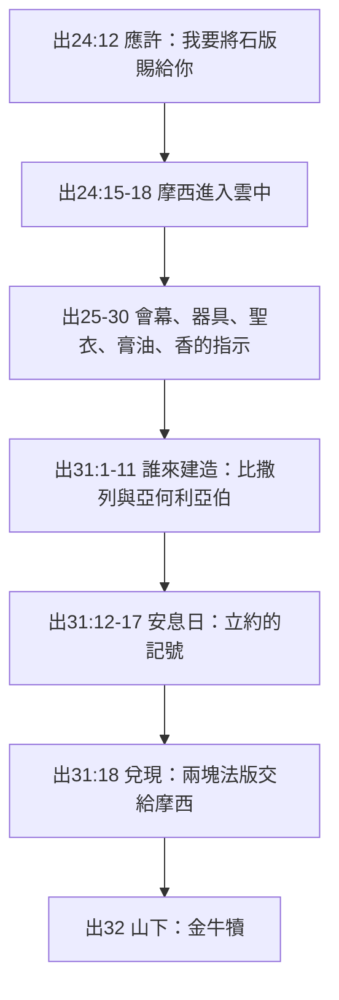

# 出埃及記 第31章

<!-- chapter-navigation:start -->
| [前一章](../02%20出埃及記/第30章.md) | [回目錄](../02%20出埃及記/全書目錄及綱要.md) | [下一章](../02%20出埃及記/第32章.md) |
| :--- | :---: | ---: |
<!-- chapter-navigation:end -->

1. 耶和華曉諭摩西說：
2. 看哪，[[猶大支派]]中，[[戶珥]]的孫子、[[烏利]]的兒子[[比撒列（Bezalel）|比撒列]]，我已經提他的名召他。
3. 我也[[蒙靈充滿的智慧恩賜（比撒列、亞何利亞伯）|以我的靈充滿了他]]，使他有智慧，有聰明，有知識，能做各樣的工，
4. 能想出巧工，用金、銀、銅製造各物，
5. 又能刻寶石，可以鑲嵌，能雕刻木頭，能做各樣的工。
6. 我分派[[但支派]]中、亞希撒抹的兒子[[亞何利亞伯（Oholiab）|亞何利亞伯]]與他同工。凡心裡有智慧的，我[[蒙靈充滿的智慧恩賜（比撒列、亞何利亞伯）|更使他們有智慧]]，能做我一切所吩咐的，
7. 就是會幕和法櫃，並其上的施恩座，與會幕中一切的器具，
8. 桌子和桌子的器具，精金的燈臺和燈臺的一切器具並香壇，
9. 燔祭壇和壇的一切器具，並洗濯盆與盆座，
10. 精工做的禮服，和祭司亞倫並他兒子用以供祭司職分的聖衣，
11. 膏油和為聖所用馨香的香料。他們都要照我一切所吩咐的去做。
12. 耶和華曉諭摩西說：
13. 你要吩咐以色列人說：你們務要守我的[[安息日]]；因為這是你我之間世世代代的證據，使你們知道我─耶和華是叫你們[[分別為聖|成為聖]]的。
14. 所以你們要[[當記念安息日守為聖日|守安息日]]，以為聖日。凡干犯這日的，必要把他[[從民中剪除的含義|治死]]；凡在這日做工的，必從民中[[剪除]]。
15. 六日要做工，但第七日是[[安息日|安息聖日]]，是向耶和華守為聖的。凡在安息日做工的，必要把他[[從民中剪除的含義|治死]]。
16. 故此，以色列人要世世代代[[當記念安息日守為聖日|守安息日]]為永遠的約。
17. 這是我和以色列人永遠的證據；因為六日之內耶和華造天地，第七日便安息舒暢。
18. 耶和華在[[西乃山]]和摩西說完了話，就把兩塊[[法版]]交給他，是神用[[神的指頭（路11：20）|指頭]]寫的石版。

---

## 本章知識節點

### 人物
- [[比撒列（Bezalel）]]
- [[亞何利亞伯（Oholiab）]]
- [[戶珥]]
- [[烏利]]
- [[猶大支派]]
- [[但支派]]

### 原文
- [[法版]]
- [[剪除]]

### 主題
- [[割禮作為立約記號]]
- [[安息日與會幕工程的關係]]

### 文化
- [[石版]]

### 事件
- [[摩西上山領石版]]
- [[曠野安息日撿柴事件與神明告處決]]

### 地點
- [[西乃山]]

### 背景
- [[古代近東安息日]]

### 神學
- [[安息日]]
- [[當記念安息日守為聖日]]
- [[分別為聖]]
- [[蒙靈充滿的智慧恩賜（比撒列、亞何利亞伯）]]

### 解經爭議
- [[從民中剪除的含義]]
- [[主日與安息日的關係之爭]]

### 互文
- [[神的指頭（路11：20）|路11：20 我若靠著神的指頭趕鬼]]
- [[石版的應許（出24：12）|出24：12 我要將石版並我所寫的律法賜給你]]
- [[希伯來書4章神的安息|來4：9-10 必有安息為神的子民存留]]

---

## 本章整理

神已經把祂的居所該是什麼樣子告訴了摩西，本章回答最後一個問題。KC 說得很直接：「現在祂宣告誰可以建造會幕。」而答案不是「有心的人都可以」——「這些不能只是一些心血來潮的人。神親自指定他們。祂知道祂百姓中每一個成員的資質，那是祂在他們出生時就給的。但光有資質也不夠，還必須祂把祂的靈與所需的智慧加在他們天然的資質上。」

本章的結構，GT《精讀本》分得最清楚：命令比撒列與亞何利亞伯建造會幕（1-11節）、再次強調遵守安息日並使之立約化（12-17節）、神親寫十誡交給摩西（18節）；而這是摩西在西乃山四十晝夜所領受的啟示中「最後一個部分」。

### 一、誰可以建造：神提名的揀選（v1-2）

神點名的是猶大支派中戶珥的孫子、烏利的兒子[[比撒列（Bezalel）|比撒列]]。CT 說明經文為何要附上父祖：「通常聖經中同名不同人的情形相當普遍，因此在提到某一位特定的人時，往往附帶提到他的父親和祖父是誰，以避免發生混淆而感到困惑。」而這三個名字在正典裡是連著的——GT《丁道爾》引德萊維指出，戶珥、烏利、比撒列都出現在代上2:20 [[猶大支派]]迦勒家族的族譜中（同名當然不一定同人）。

[[戶珥]]是誰，GT《中文聖經註釋》承認查不清：「這位戶珥，是否即十七10和廿四14所提及的，與亞倫一同為摩西之左右手者，已無可考證。」但同一則註釋注意到一件有意思的事：戶珥、烏利、比撒列三個名字都出現在被擄回國的名單中（尼3:9；拉10:24；拉10:30），「表示是當時代一般的人名」。GT《丁道爾》更把這一點提升為經文可靠性的論據：「這兩位巧匠的名字留存至今，是傳統得到保存的極佳案例……這兩個名字似乎沒理由偽作，因為兩者都沒在別處出現（出三十五的平行經文除外）；所以它的真實性不值得懷疑。即使是戴維斯等不認為本段經文來自摩西的學者，也覺得有必要將他們鑑定為所羅門聖殿以前，製造大衛時代會幕的匠人（代上15:1）。」

> [!important] 兩串名字，兩種角色
>
> KC 把每一個名字的字義都讀了出來，而讀出的是事奉的兩種位置。
>
> **比撒列這一串，講的是「怎麼事奉」**：
>
> | 名字 | 字義 | KC 的讀法 |
> | --- | --- | --- |
> | 比撒列 | 在神的蔭下 | 「事奉只能在倚靠神中進行，不能靠自己的力量或己見。影子不是那人自己，而是指向那位投下影子的人。要緊的不是僕人，而是神。」 |
> | 烏利之子 | 受光照 | 「這工作需要聖靈的光照」 |
> | 戶珥之孫 | 純潔 | 「在事奉中一切都必須合乎神的聖潔與純潔。人的東西、罪的東西，一點都不可黏在上面」 |
> | 猶大支派 | 讚美神的人 | — |
>
> **[[亞何利亞伯（Oholiab）|亞何利亞伯]]這一串，講的是「為誰事奉」**：
>
> | 名字 | 字義 | KC 的讀法 |
> | --- | --- | --- |
> | 亞何利亞伯 | 父親的帳幕 | 「他清楚知道自己的任務」 |
> | 亞希撒抹之子 | 扶持的弟兄 | 「他知道自己是為別人存在的，在這裡就是為比撒列」 |
> | [[但支派]] | — | 「這是最黑暗的一個支派，但在祂的恩典裡，神也使用出於那支派的人……神的恩典大過我們的出身。」 |
>
> 而幫手是誰找的？KC：「他不必自己去找。神顧到了這事。祂知道誰適合他」——「神照樣把每一個肢體擺在身體上，好叫肢體可以彼此服事。沒有一個肢體能單獨運作。肢體彼此需要，但功用是神定的（林前12:11）。」

字義各家略有出入，值得並陳：比撒列，GT《中文聖經註釋》作「在神的蔭下」或「神的保護」，GT《丁道爾》作「在伊勒的蔭下」（參詩91:1），並註明「伊勒」（El）是摩西蒙神啟示之前以色列對神的常用稱號之一。亞何利亞伯，GT《中文聖經註釋》作「父親的帳棚」，但指出「在七十士譯本的切音譯法，卻成了『父親的神』的含義」；GT《丁道爾》譯作「我的帳幕（避難所）是父神」，並引海厄特說「這名特別貼切，因為亞何利亞伯是神帳幕的匠人」。

### 二、以我的靈充滿了他：智慧、聰明、知識（v3-6）

「我也以我的靈充滿了他，使他有智慧，有聰明，有知識，能做各樣的工。」三個詞不是同義反覆——CT 分得很細：「『智慧』偏重於對事物的創見；『聰明』偏重於對事物的領悟；『知識』指對事物學習和經歷的累積。」BH 另指出一個聖經史上的第一：比撒列是聖經中第一個被記載為「被神的靈充滿」以完成特定任務的人。

[[蒙靈充滿的智慧恩賜（比撒列、亞何利亞伯）|這句話]]在舊約聖靈觀裡的位置，GT《丁道爾》講得最完整：「舊約時代初期所有的技巧、能力、和傑出之處，都直截了當地歸功於『神的靈』，正確地視神為一切智慧的根源。舊約進一步的啟示顯明這靈為『聖』，在不否定以上真理的前提下，逐漸指出祂有道德和屬靈上的屬性」，並引海厄特把舊約的聖靈稱為「神發出的能力」。GT《啟導本》則把它連到藝術本身：「聖靈賜給比撒列一種特有的恩賜，不只有技巧，而且得到藝術工作者必須有的智慧和感性。藝術天賦也是神的恩賜（雅1:17）。那位『使天有妝飾』的神（伯26:13），創造人的時候，賦予他愛真善美的能力，這種本能和人類其他本能一樣，因犯罪而受到汙損。」

值得注意的是這智慧可以增長。GT《中文聖經註釋》指出：希伯來文的「智慧」「一方面是天賦的本能，另一方面也包含應付環境和行事為人等的種種計謀和方法，因此這智慧是可以增長的（參看路2:52）」——這正是 v6「凡心裡有智慧的，我更使他們有智慧」的意思；也因此比撒列與亞何利亞伯不只自己做，還要教導同工（出35:34）。GT 引丁良才把整個團隊看成一體：「有著名的工頭（如比撒列和亞何利亞伯）也有無名的工人（如與他們同工的眾人），這兩等人都缺一不可的。」

匠人蒙神明加添專長，在古代近東並非以色列獨有。GT《舊約背景註釋》舉了一個對照：「參與聖工的匠人蒙神明添加專長的案例，還有製造西帕爾（Sippar）祭儀神像的專家，得到伊亞神引導的記載（主前九世紀）。」差別在於，以色列的匠人所造的不是神像，而是神所指定的居所。

### 三、要造的清單：從會幕到香料（v7-11）

v7-11 把出25-30 的內容濃縮成一份清單：會幕、法櫃與施恩座、桌子與器具、精金的燈臺與器具、香壇、燔祭壇與器具、洗濯盆與盆座、精工做的禮服與聖衣、膏油與馨香的香料。CT 把它分成三層：會幕本身、法櫃與施恩座、會幕中一切器具（由裡至外）。GT《中文聖經註釋》指出這份清單的功能是回指與前瞻：「這話是包含在廿五至三十章中，神所吩咐或曉諭摩西要做的有關聖幕和其中一切的器具，以及祭司的聖衣，他們都要照著去做。卅五至四十章，就是他們照做的記載。」GT 引丁良才另把 v10 的「禮服」與「聖衣」拆成三種：「（一）大祭司的華美衣服（出28:6-38）；（二）大祭司的細麻聖衣（利16:4；出28:39）；（三）眾祭司的細麻衣服（出28:40、42）。」分工上，同一位註釋者說得很清楚：「比撒列是工頭也監管製造金器，銀器，銅器等事，亞何利亞伯專一經管織布繡花的事（出35:35，38:23）。」

KC 把這份清單讀成一份恩賜對照表——被派去造什麼，說明對什麼有特別的看見：

| 造什麼 | KC：那代表哪一種人 |
| --- | --- |
| 會幕 | 對神的教會與教會的聚集有特別看見的人 |
| 法櫃 | 對主耶穌的位格有特別看見的人 |
| 施恩座 | 對和好有很深領會的人 |
| 桌子與器具 | 要確保信徒間的相交能被維持、成為神所喜悅之食物的人 |
| 燈臺 | 對屬天福分有大量看見、能把它告訴弟兄的人 |
| 金香壇 | 對基督的榮美有很多看見的人 |
| 燔祭壇 | 明白主耶穌十架的工作對神意味著什麼的人 |
| 洗濯盆 | 認真看待自己成聖的人 |
| 祭司聖衣 | 知道自己是祭司、並且真的在盡祭司職事的人 |
| 膏油 | 凡事願意被聖靈引導的人 |
| 香 | 知道什麼是禱告的人 |

> [!quote] KC 記下的一個中國家庭教會的例子
>
> 「中國的一位弟兄曾告訴我一個很好的實際應用。他認識三位家庭教會的領袖，他們幫助過許多家庭教會。三位都有一個從會幕來的綽號。宋尚節弟兄被稱為『祭壇』，因為他為福音燃燒。王明道弟兄被稱為『洗濯盆』，因為他在講道中著重聖潔與潔淨。李常受弟兄被稱為『聖所』，因為他把聖經認識得那樣透。」
>
> KC 接著說：「照樣我們也可以認識一些弟兄姊妹，他們在所作的事奉上，藉著他們作工的方式，叫我們想起會幕的某些方面。事實上，我們每個人都該有某種特徵。」但他隨即堵住比較：「這樣我們就彼此補足，而不宣稱我們所能作的比別人所作的更重要。」

### 四、安息日：立約的記號（v12-13）

工程交派完了，神接著講的卻是停工。這個編排本身就是解釋的重點。GT《串珠》把兩者讀成一體兩面：「會幕的設立應驗了約的應許：『我要住在你們中間』，而安息日也是這約的實在證據……所以守安息日和建造會幕是一個事實的兩面：安息日使以色列民知道神使他們成聖（31:13），同樣，神在會幕中與人相會也達到這目標（29:43）。」GT《丁道爾》引海厄特給的是另一個角度：「將安息日命令加插於此的目的，可能是提醒他們，即使在建築會幕之時，守安息日依然是不可或缺的。」GT《舊約背景註釋》說得最直接：「即使是聖幕的工程，也必須七日停止一日，向創造萬物的神表示尊重。」而摩西後來確實這樣傳達了——GT 引丁良才：「連會幕上的工程也不可在安息日做，因此摩西吩咐百姓的時侯，就先用這話警誡他們（出35:1-3）。」

[[安息日]]在此被立為「證據」（記號）。GT《舊約背景註釋》把它與[[割禮作為立約記號|割禮]]並列：「割禮是個人參與盟約的記號。同樣，以色列集體參與盟約的記號就是守安息日。它和割禮一樣，是每一代都必須奉行的責任」，並指出兩者的差別：「守安息日和割禮的分別，則在於前者不是只做一次，而是必須恆常保持，並且定期藉行動表彰。」GT 引丁良才把三個記號排成一條線：虹是神與挪亞立約的證據（創9:8-17）、割禮是神與亞伯拉罕立約的證據（創17:9-14）、安息日是神與以色列立約的證據。而[[分別為聖|成聖的主詞]]是神自己——CT 指出 v13「使你們知道我耶和華是叫你們成為聖的」，守安息日是百姓對這分別的認識與回應。

這種制度在閃族世界並非孤例，意義卻獨特。GT《丁道爾》：「安息日和割禮一樣，其他閃族地區似乎也有奉行（起碼被視為不宜買賣的『凶日』）；然而照我們所知，只有在[[古代近東安息日|以色列]]才有獨特的宗教意義。」

### 五、六日與第七日：治死與剪除（v14-17）

出20:8-11 的第四誡只吩咐守，本章加上了刑罰。GT 引丁良才點出這個差別：「在二十8節神曾吩咐百姓守安息日，在本章就給他們定了不守安息日的刑罰」；GT《串珠》也說「此處加上這法律是要強調安息日的重要性」。這使[[當記念安息日守為聖日|第四誡]]在本章有了執行力。

「必要把他治死」與「必[[剪除|從民中剪除]]」是什麼關係，各家不同。CT 讀為平行同義：「這兩個子句乃是平行同義子句；做工即指干犯，從民中剪除即指治死。」GT 引丁良才卻[[從民中剪除的含義|明確區分]]：「剪除——就是從選民中被棄絕，使他與盟約無份，凡被治死的也是被剪除，凡被剪除的未必都被治死」；GT《精讀本》站在丁良才一邊：剪除「不僅指以色列百姓肉體上的死亡，而且指從神的祝福中被剪除的意思」。

這條律法在正典裡有一次實際執行。三份材料都指向同一處：GT《中文聖經註釋》「民十五32～36亦記述一個在安息日撿柴，而被帶到營外用石頭打死的[[曠野安息日撿柴事件與神明告處決|事例]]」；GT 引丁良才「過了不久，以色列人就將一個不守安息日的人治死了」；GT《丁道爾》則把這條線一路拉到新約與兩約之間：「約翰福音五章16～18節亦提到基督幾乎因這罪名被殺……到了馬加比時代，安息日是信仰是否正統的試金石，有人甚至因此殉道。在新約時期更成了難以擔當的擔子（可2:23-27）。」同一則註釋並指出被擄的教訓：「後世猶太人追溯被擄的原因，相信不守安息日是因素之一（尼13:17、18），因此，尼希米歸回後嚴厲執行。」

v17 給的理由回到創造：「因為六日之內耶和華造天地，第七日便安息舒暢。」GT 引丁良才提醒這個「安息」不是疲乏：「神安息不是因為乏倦（賽40:28），乃是因為造物的工程完畢了」；GT《精讀本》的說法相同：「指神的創造事工結束之後，看著那些被造的非常滿意的意思（創1:31）」；BH 也指出「神被『舒暢』是擬人的說法，傳達的是創造的完全與滿足」。而這個安息望向什麼，[[希伯來書4章神的安息|GT《丁道爾》]]接到來4:10：「信徒憑信心休止『工作』（工作可瞭解為試圖賺取救恩），進到屬靈安息和內心的平安之中，這種平安只有自知已經蒙神悅納稱義之人才能享用。」CT 的說法相同：這是「那真安息的表樣，要屬祂的人藉著守安息日，被提醒將另有安息日的安息為神的子民存留（參來4:9）」。

至於新約信徒與安息日的關係，各家並不一致。CT 視主日為對應的替代：「守安息日是神和以色列人團體立約的證據……同樣的，守主日是神和教會立新約的證據」；GT《丁道爾》卻明確切斷：「基督徒的『主日』（啟1:10）和安息日並沒有直接關聯……如今信徒一切的時間都已屬神，並不限於七日之中的一日」；GT《中文聖經註釋》居中——主日「並不是新安息日」，並引羅14:5-10 提醒「亦不可論斷或輕看那些堅持要守某一日子的人」。

### 六、兩塊法版：山上的話說完了（v18）

「耶和華在[[西乃山]]和摩西說完了話，就把兩塊[[法版]]交給他，是[[神的指頭（路11：20）|神用指頭寫的]][[石版]]。」這一節同時做兩件事：兌現[[石版的應許（出24：12）|出24:12 的應許]]，並為出25-31 的整段啟示收尾。GT《舊約背景註釋》指出敘事線在此接回：本節「顯示它是接續在二十四章18節中斷的敘述。本節更表示在敘述中加插有關聖幕的建築和祭司分別為聖的材料，至此告一段落，敘事回復到西乃山所發生的事件」；[[摩西上山領石版|GT《中文聖經註釋》]]也說：「現在，這些話都說完了。」

「法版」的原文是「見證」——GT《舊約背景註釋》註明它是「見證櫃」（法櫃）一名的由來。石版本身值得注意的地方，GT 引丁良才列了四點：「（一）是石頭的，所以能耐久長存（參太5:18）；（二）是神親自寫的，故此是十分要緊的；（三）是兩塊的，記載人對於神並對於人的本份；（四）是兩面寫的（出32:15）。」CT 另排除一種常見的說法：兩塊版不是「一式兩份」由立約雙方各持一份，「因為神不需要法版作證據，所以兩塊法版都交給了摩西」。

「神用指頭寫」是擬人的說法。GT 引賈斯樂郝威處理得最完整：「神實在是沒有手指的。『神用指頭』這只是象徵的意思（figure of speech），表示神直接與十誡的頒佈有關……這稱為擬人說法（anthropomorphism）」，並列出同型的表達：膀臂（申7:19）、翅膀（詩91:4）、眼（來4:13）。GT《啟導本》指出出8:19「神的手段」原文即作「神的指頭」；GT《丁道爾》把兩約串起來：「出埃及記八章19節用同樣的喻象形容埃及的災難，路加福音十一章20節則用以形容基督的事工」，並下結論：「這句話有力地肯定了神是來源和始因，我們不必拘泥字面的意思。」

### 七、跨章脈絡：七次講論與山下的金牛犢

KC 在本章收束了一條從出25 就開始的線：出25-31 這一整篇講論被「耶和華曉諭摩西說」穿插了七次，而「第七次、也是最後一次」引出的正是安息日——一週的第七日。七次講論，第七次講第七日。他並指出安息日望向哪裡：「這日子前瞻千年國度的安息。神一切的工作、以及一切為祂而作的，都歸結在那裡」；而神自己為什麼要守：「神在完成祂創造的工作之後，親自定了那日……神要祂的百姓與祂一同有分於此。那是極大的恩典。」

法版的性質也在正典中被再次確認。GT《每日研經叢書》指出，第二次的版是摩西親自鑿的，誡命卻仍由神親自寫上（出34:1）——「首先，它加強了那種認為十誡是聖約的根基之見解，而聖約之書只是權威的注釋一般。其次，它強調它們不可變與不能變的性質。正因為這樣，在耶利米書卅一章卅一至卅四節並未暗示新約將會有一部新妥拉，只是它表現的性質改變了（結36:26-27；耶31:33）。」

而本章最後一句與下一章的距離，KC 讀出的是全卷最沉的一個對照：「石版向我們陳明百姓的責任。這責任與神的心意形成尖銳的對比，就是祂與摩西所談論的那心意。」而更重的是那句補充：「當祂把石版交出去的時候，祂知道百姓在山腳下正在做什麼。下一章給出這事的細節。」山上是七次講論、是會幕的藍圖、是「我要住在他們中間」；山下已經在鑄金牛犢。神在完全知情的情況下，仍然把石版交了出去。

**參考資料**
https://biblehub.com/study/exodus/31.htm
https://www.ccbiblestudy.org/Old%20Testament/02Exo/02CT31.htm
https://www.ccbiblestudy.org/Old%20Testament/02Exo/02GT31.htm
https://www.kingcomments.com/en/bible-studies/Exo/31

<!-- chapter-navigation:start -->
| [前一章](../02%20出埃及記/第30章.md) | [回目錄](../02%20出埃及記/全書目錄及綱要.md) | [下一章](../02%20出埃及記/第32章.md) |
| :--- | :---: | ---: |
<!-- chapter-navigation:end -->
