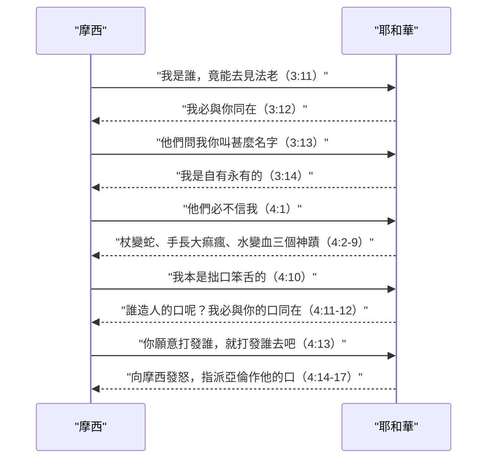
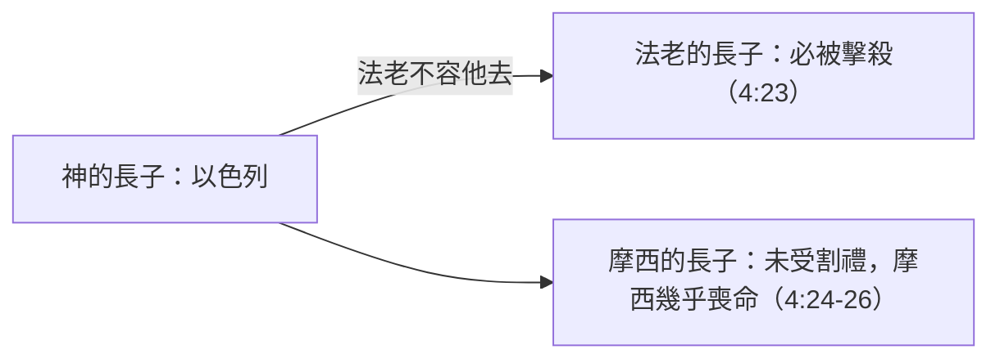
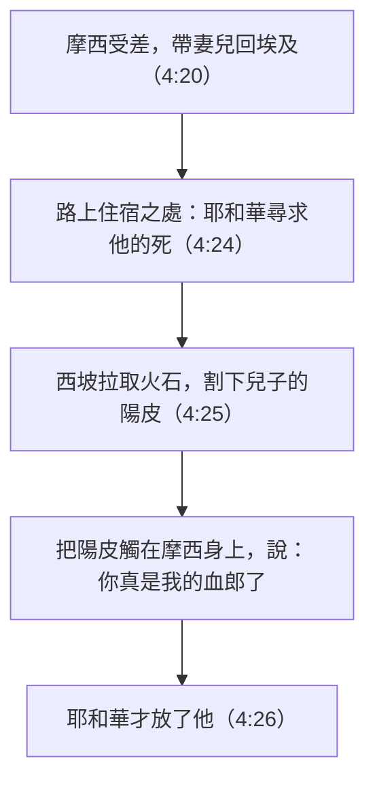

# 出埃及記 第4章

<!-- chapter-navigation:start -->
| [前一章](../02%20出埃及記/第3章.md) | [回目錄](../02%20出埃及記/全書目錄及綱要.md) | [下一章](../02%20出埃及記/第5章.md) |
| :--- | :---: | ---: |
<!-- chapter-navigation:end -->

1. [[摩西]]回答說：他們必不信我，也不聽我的話，必說：[[耶和華的話臨到|耶和華]]並沒有向你顯現。
2. [[耶和華的話臨到|耶和華]]對[[摩西]]說：你手裡是什麼？他說：是[[杖]]。
3. [[耶和華的話臨到|耶和華]]說：丟在地上。他一丟下去，就變作[[杖變蛇的神蹟|蛇]]；[[摩西]]便跑開。
4. [[耶和華的話臨到|耶和華]]對[[摩西]]說：伸出手來，拿住他的尾巴，他必在你手中仍變為[[杖]]；
5. 如此好叫他們信[[耶和華的話臨到|耶和華]]─他們祖宗的神，就是[[亞伯拉罕]]的神，[[以撒]]的神，[[雅各]]的神，是向你顯現了。
6. [[耶和華的話臨到|耶和華]]又對他說：把手放在懷裡。他就把手放在懷裡，及至抽出來，不料，手長了大痲瘋，有雪那樣白。
7. [[耶和華的話臨到|耶和華]]說：再把手放在懷裡。他就再把手放在懷裡，及至從懷裡抽出來，不料，手已經復原，與周身的肉一樣；
8. 又說：倘或他們不聽你的話，也不信頭一個[[神蹟（miraculous signs）|神蹟]]，他們必信第二個神蹟。
9. 這兩個[[神蹟（miraculous signs）|神蹟]]若都不信，也不聽你的話，你就從[[尼羅河|河]]裡取些水，倒在旱地上，你從河裡取的水必在旱地上變作血。
10. [[摩西]]對[[耶和華的話臨到|耶和華]]說：主啊，我素日不是能言的人，就是從你對僕人說話以後，也是這樣。我本是[[拙口笨舌]]的。
11. [[耶和華的話臨到|耶和華]]對他說：誰造人的口呢？誰使人口啞、耳聾、目明、眼瞎呢？豈不是我─耶和華嗎？
12. 現在去吧，我必賜你口才，指教你所當說的話。
13. [[摩西]]說：主啊，你願意打發誰，就打發誰去吧！
14. [[耶和華的話臨到|耶和華]]向[[摩西]]發怒說：不是有你的哥哥利未人[[亞倫]]嗎？我知道他是能言的；現在他出來迎接你，他一見你，心裡就歡喜。
15. 你要將當說的話傳給他；我也要賜你和他口才，又要指教你們所當行的事。
16. 他要替你對百姓說話；你要以他當作口，他要以你當作神。
17. 你手裡要拿這[[杖]]，好行[[神蹟（miraculous signs）|神蹟]]。
18. 於是，[[摩西]]回到他岳父[[葉忒羅]]那裡，對他說：求你容我回去見我在[[埃及]]的弟兄，看他們還在不在。葉忒羅對摩西說：你可以平平安安地去吧！
19. [[耶和華的話臨到|耶和華]]在[[米甸地|米甸]]對[[摩西]]說：你要回[[埃及]]去，因為尋索你命的人都死了。
20. [[摩西]]就帶著妻子和兩個兒子，叫他們騎上驢，回[[埃及]]地去。摩西手裡拿著神的[[杖]]。
21. [[耶和華的話臨到|耶和華]]對[[摩西]]說：你回到[[埃及]]的時候，要留意將我指示你的一切奇事行在[[法老]]面前。但我要使（或作：任憑；下同）[[法老的心剛硬|他的心剛硬]]，他必不容百姓去。
22. 你要對[[法老]]說：[[耶和華的話臨到|耶和華]]這樣說：[[以色列是我的兒子我的長子|以色列是我的兒子，我的長子]]。
23. 我對你說過：容我的兒子去，好事奉我。你還是不肯容他去。看哪，我要殺你的長子。
24. [[摩西]]在路上住宿的地方，[[耶和華的話臨到|耶和華]]遇見他，[[耶和華想要殺摩西（24節）|想要殺他]]。
25. [[西坡拉]]就拿一塊[[火石刀|火石]]，[[血郎的含義|割下他兒子的陽皮，丟在摩西腳前，說：你真是我的血郎了]]。
26. 這樣，[[耶和華的話臨到|耶和華]]才放了他。[[西坡拉]]說：[[血郎的含義|你因割禮就是血郎了]]。
27. [[耶和華的話臨到|耶和華]]對[[亞倫]]說：你往曠野去迎接[[摩西]]。他就去，在[[神的山]]遇見摩西，和他親嘴。
28. [[摩西]]將[[耶和華的話臨到|耶和華]]打發他所說的言語和囑咐他所行的[[神蹟（miraculous signs）|神蹟]]都告訴了[[亞倫]]。
29. [[摩西]]、[[亞倫]]就去招聚[[以色列的眾長老]]。
30. [[亞倫]]將[[耶和華的話臨到|耶和華]]對[[摩西]]所說的一切話述說了一遍，又在百姓眼前行了那些[[神蹟（miraculous signs）|神蹟]]，
31. 百姓就信了。以色列人聽見[[耶和華的話臨到|耶和華]]眷顧他們，鑒察他們的困苦，就低頭下拜。

---

## 本章知識節點

### 神學
- [[杖]]
- [[杖變蛇的神蹟]]
- [[手長大痲瘋的神蹟]]
- [[水變血的神蹟]]
- [[神蹟（miraculous signs）]]
- [[以色列是我的兒子我的長子]]
- [[法老的心剛硬]]
- [[神對人的呼召]]
- [[神的權柄與能力]]
- [[割禮之約]]
- [[耶和華的話臨到]]

### 解經爭議
- [[耶和華想要殺摩西（24節）]]
- [[血郎的含義]]

### 原文
- [[拙口笨舌]]

### 文化
- [[火石刀]]

### 主題
- [[先知]]
- [[長子名分]]

### 人物
- [[亞倫]]
- [[西坡拉]]

### 地點
- [[尼羅河]]
- [[神的山]]

---

## 本章整理

第1節是全章的關鍵句，而關鍵中的關鍵是一個「信」字（GT《中文聖經註釋》）。摩西怕百姓不信，全章卻結束在第31節的「百姓就信了」——中間的一切，都是神在拆毀他的每一個推辭。

### 經文大綱

1. 三個神蹟回應「他們必不信我」（1-9節）
2. 「我拙口笨舌」與神的回答（10-12節）
3. 從推辭到拒絕；亞倫作摩西的口（13-17節）
4. 辭別岳父、返回埃及與臨行的指示（18-23節）
5. 路上的割禮事件（24-26節）
6. 與亞倫相遇、招聚長老、百姓相信（27-31節）

### 一、三個神蹟（v1-9）

「他們必不信我」——GT《中文聖經註釋》說這不只是託辭，「也是現實」：一個殺過人、被法老追查而逃亡在外的人回到埃及，有甚麼把握可以招聚長老？GT 丁良才《出埃及記註釋》列出兩個理由：在埃及的以色列人不認識摩西（他幼年在王宮，後來又在曠野寄居四十年），而神在這幾百年中也沒有向以色列人顯現。GT《聖經精讀本》看得更深一層：摩西始終沒有忘記四十年前同胞那句「誰立你作我們的首領和審判官呢」（2:14）。

KC 的答案很鋒利：==摩西必須學會，他的使命不取決於別人怎樣接待他——「使命從來不倚靠接受的人，只倚靠差遣的那一位。」== 這正是[[神對人的呼召]]在本章的基調：神沒有回答「他們會信的」，而是給他可以印證差遣的[[神蹟（miraculous signs）|記號]]。

> [!quote] 「你手裡是甚麼？」
> KC：神為第一個神蹟所作的，是要他注意自己手中已經有的——「對主而言，要緊的是我們有甚麼，不是我們沒有甚麼」（參約6:9-13；王下4:2-7）。
>
> CT 的原文觀察很美：「[[杖]]」（matteh）出自動詞「伸出、延長」——我們的信心乃是向神「伸出」手來支取，將神的能力「延伸」到我們身上。
>
> GT 丁良才列出神用小物成大事的一串：羊角（書6）、空瓶（士7）、甩石機弦（撒上17）、水（約2）、餅魚（太14）。

三個神蹟各自針對甚麼，GT《舊約背景註釋》給出最貼近經文的解讀：

| 神蹟 | 直接的意義 |
|---|---|
| [[杖變蛇的神蹟]]（2-5節） | 杖在埃及是權柄的象徵，蛇是法老的代表——「稱為烏拉厄斯（uraeus）的蛇像是他冠冕上最突出的一部分」。第一個表記的意思是：法老和他的權柄，完全在神的掌管之下 |
| [[手長大痲瘋的神蹟]]（6-8節） | 這病在聖經中加諸人身，「一貫是對僭妄的處罰」（民12:1-12；王下5:22-27；代下26:16-21）——在此表示神有意處罰法老；它也使人不潔、被驅離神的面前 |
| [[水變血的神蹟]]（9節） | 「完全仰賴尼羅河水的埃及，其興衰是在神的掌管之下。它也是神要降災禍的先聲」 |

「他一丟下去，就變作蛇；摩西便跑開」——GT《中文聖經註釋》指出原文的「蛇」特指有毒的蛇，而毒蛇也是埃及人當作神靈敬拜的生物之一。第4節神吩咐「拿住牠的尾巴」，CT 說原文的「拿住」含有戰戰兢兢、小心翼翼地疾手捉住的意思；BH 則點出這動作違反本能：「抓蛇的尾巴是危險的，因為這樣蛇頭仍可自由反咬。」CT 的〔話中之光〕由此讀出一條原則：與魔鬼周旋之道不是「跑開」，而是「伸出手來拿住牠的尾巴」（雅4:7）。

第三個神蹟與前兩個不同。CT 提醒一個常被忽略的事實：摩西當時在何烈山與神說話，所以水變血並未當場施行，也沒有像前兩個那樣還原（沒有叫血變回水）；GT《串珠聖經註釋》說得更直接——「將尼羅河的水變為血是不能不斷重複施行的，它一發生就會產生災害」。BH 指出取水的地點本身就是宣戰：「神吩咐摩西從[[尼羅河]]取水，是直接向與這條河相關的埃及神明挑戰，例如尼羅河之神哈庇。」

> [!note] 這裡的預表，經文說到哪裡為止？
> 各家在三個神蹟上作了不少屬靈引申——KC 說杖代表亞當失去、又在基督裡歸還的權柄（西2:15；太28:18），手上的大痲瘋代表顯在行為上的罪、心裡的痲瘋代表隱藏的罪（可7:21-23），尼羅河代表世界沒有神時仍享有的自然祝福，人若拒絕前兩個神蹟的信息，祝福就變為咒詛；CT 則歸納為「勝過撒但的能力／勝過肉體的能力／勝過世界的能力」。
>
> 這些都是預表與應用。經文自己給的理由只有一個，並且說了兩次：「如此好叫他們信耶和華——他們祖宗的神……是向你顯現了」（5節）、「他們必信第二個神蹟」（8節）。CT 補上一句要緊的分辨：這裡是說好叫他們信「神」，並不是叫他們相信「摩西」。

### 二、我拙口笨舌（v10-12）

「我本是[[拙口笨舌]]的」——CT 的直譯是「我的口舌很沉重，不易搬動」，GT《中文聖經註釋》作「重口重舌」，並稱這是摩西推託的最後一擊，也是最重的一擊。但這裡有一個張力：CT 特別指出摩西原是「說話行事都有才能」的人（徒7:22）。GT《聖經精讀本》的判斷是：這不是口吃，也不是純粹的謙卑——他可能認為要說服法老、帶領百姓，非有雄辯之才不可；BH 則說在古埃及的文化處境中「口才是備受看重的」，而摩西「對自己的評估顯出他缺乏自信」。

> [!quote] 神沒有消除他的弱點
> 「誰造人的口呢？誰使人口啞、耳聾、目明、眼瞎呢？豈不是我——耶和華嗎？」CT 指出這句的原文力道是「豈不是我就是那我是的嗎？」（呼應3:14）——意即「你需要口才，我就是你的口才」。
>
> 「我必賜你口才」原文是「我必與你的口同在」。GT《中文聖經註釋》讀出那個加重語氣的「我」：從今以後，你摩西的口，就是我的口；而第12節的「現在去吧」是命令式，等於神說「住嘴！去吧！不要再嚕囌了」。
>
> KC 把它連到保羅：神信息的果效不在乎人的口才（林前2:1、4；林後10:10）——「我的能力是在人的軟弱上顯得完全……我甚麼時候軟弱，甚麼時候就剛強了」（林後12:9-10）。他並指出一件事：基督教裡的人容易被優美的詩班、動人的音樂、精彩的講章打動，但那不能使人悔改，使人悔改的只有神的話與聖靈的工作。

### 三、從推辭到拒絕（v13-17）

GT 丁良才把摩西的推辭數成五次，橫跨兩章；本章記的是後面三次。神對每一次的回應都不相同：

> [!note] 這一次不是推辭，是拒絕
> KC 講得最直白：摩西的第五個異議已經不能再算是異議了——「這是拒絕。拒絕不是謙卑。這已經不是軟弱，而是不肯順服。一味遷就自己的軟弱，結局就是不信。」他還指出一個諷刺：摩西口裡稱神為「主」（Adonai，意即至高者、統帥），卻不照祂所說的行，這等於否認祂的權柄（參徒10:14；路6:46）。
>
> GT《中文聖經註釋》把原文的言外之意翻出來：「主啊，願你差遣你手中要差遣的人吧！」——言下之意就是：我摩西是不在你手中的。CT 則說得溫和些：這是推托之辭，背後的動機出於對神的不信任。

「耶和華向摩西發怒」——但 CT 指出神在怒中仍有憐憫：祂沒有收回使命，而是把[[亞倫]]給了他。至於這是不是好事，各家的讀法明顯分歧：

| 來源 | 對亞倫加入的評價 |
|---|---|
| GT 丁良才 | 「摩西既不願意獨自占神為他所預備最尊的地位，神就讓亞倫分享他的榮耀」 |
| KC | 神「藉著給他一個同伴——他的哥哥亞倫——奪去了他使命的尊榮。在這件事上，這不是加強，而是削弱」，並說這一點從後來的歷史就看得出來 |
| GT《聖經精讀本》 | 摩西「從獨立的領袖，變成了協助的領袖」 |

「你要以他當作口，他要以你當作神」——GT《啟導本聖經腳註》以7:1為最好的註釋：「我使你在法老面前代替神，你的哥哥亞倫是替你說話的」，並補一句實情：亞倫後來很少代摩西說話，都是摩西自己代神說話。GT《串珠聖經註釋》則把這組關係讀成[[先知]]職分的原型：摩西與亞倫的關係就像神與先知的關係，神把祂的話語放入先知口內；GT《丁道爾聖經註釋》另指出第15節「指教」一詞與 to^ra^「妥拉」同字根，「妥拉」意為「教訓」，後來成為摩西律法的名稱。

### 四、回埃及（v18-23）

摩西向[[葉忒羅]]辭行時沒有提神的顯現，只說要回去看弟兄的死活。GT《中文聖經註釋》推想他這樣做的原因「大概是不要他為此擔憂」，並由此反駁所謂「基尼說」——以為摩西所敬拜的神是從岳父那裡學來的，這說法不能成立。KC 則拿雅各作對比：雅各當年是不告而別的（創31:20），摩西卻求岳父允准，得了「你可以平平安安地去吧」。

「摩西手裡拿著神的[[杖]]」——KC 說它不再是摩西的杖，而是神要使用的杖；CT 也說杖本身沒有權柄，乃是神將祂的權柄賜給他。BH 另注意到一家人騎驢上路的畫面：「驢是古代近東常見的馱獸」，而「以驢代步顯出摩西一家的清寒，與埃及的財富權勢成對比」。

> [!note] [[法老的心剛硬|「我要使他的心剛硬」——法老還要負責嗎？]]
> 這是全卷最重的神學難題之一，各家的處理值得完整並陳。
>
> 第一，經文自己的用字並不單一。CT 指出原文有三個不同的字：

| 原文 | 意思 | 出處 |
|---|---|---|
| chazaq | 堅定不移，不肯改變態度 | 4:21；7:13、22；8:19；9:12、35；10:20、27；11:10；14:4、8、17 |
| qashah | 剛硬，無情 | 7:3、14；8:15、32；9:7、34；13:15 |
| kabed | 沉重，麻木不仁 | 10:1；13:15 |

> [!note] 各家怎麼處理這個難題
> GT《舊約背景註釋》：這個主題在以下十章重複出現凡二十次，「有時是法老自硬其心，有時則是神使他心硬」。
>
> 次序很要緊。KC、賈斯樂郝威《聖經難解經文詮釋手冊》、丁良才與《啟導本》一致指出：法老先自己硬心（7:13、14、22；8:15、19、32；9:7、34-35），神才使他的心剛硬（9:12；10:1、20、27；11:10；14:4、8、17）。賈斯樂的表列很清楚：神不是「剛開始」而是「後來」，不是「直接」而是「間接」，不是「違反其自由意志」而是「經由他的自由意志」，不是「針對他們的原因」而是「針對他們的結果」。
>
> 和合本的小字「或作：任憑」不是可有可無的。丁良才列了六種解法，其中第四點特別有價值：希伯來人常把「容許」說成「使」，如1:17「存留男孩的性命」原文作「使男孩活著」。他也給了那個著名的比喻：「比如一個太陽，曬蠟就越曬越輕，曬泥便越曬越硬……這分別不在太陽，乃在乎物質。」KC 用同一個比喻作結：這不表示法老沒有別的選擇，耶和華並沒有行不義，法老要為自己的行為完全負責。
>
> GT《每日研經叢書》另從希伯來人的觀念提醒：他們以「心」代表整個靈魂（知、情、意），所以「心剛硬」不一定指鐵石心腸，而是一種頑梗——「當我們考慮他所受的教養和相信他是神的時候，法老有這缺點是意中之事了」。

「[[以色列是我的兒子我的長子]]」是舊約唯一稱以色列人為神長子的經文（GT《啟導本聖經腳註》；何11:1稱以色列為「兒子」，耶31:9稱以法蓮為「長子」）。CT 列出古時[[長子名分|長子]]的四項特權：得父親的祝福、得作一家之主、得雙份的產業、得作全家祭司之尊榮；BH 也說在古代近東「長子享有特權也擔負責任，通常得雙份的產業，並作家中的領袖」。GT《聖經精讀本》點出這句話當時的鋒芒：埃及的法老自稱「太陽神的兒子」，接下來記述的就是耶和華與法老所拜之神的決戰。

GT《舊約背景註釋》看出全段是圍著「長子」鋪排的——三個長子，三重危難：

並且第23節揭示了目的：「容我的兒子去，好事奉我」——不是單純的解放，是為了讓兒子事奉父親。KC 指出這名稱首先應驗在基督身上（太2:15），而神要祂的兒子事奉祂（瑪3:17）。

### 五、路上的割禮（v24-26）

> [!note] [[耶和華想要殺摩西（24節）|這三節是出埃及記最難解的經文之一]]
> 困難首先在文本本身：GT《中文聖經註釋》指出24-26節原文完全沒有出現「摩西」這個名字（連「摩西在路上」的「摩西」也是中文譯本加的），幾個代名詞「他」究竟指誰不能全然確定；七十士譯本把「耶和華」譯作「神的使者」，因此也有人主張這是試驗，如創22章神試驗亞伯拉罕。但同一份注釋按原文判斷：「想要殺他」直譯是「尋求他的死」，用的是有意尋找的字，所以這確實是一件非常重大的事件。
>
> 各家共同的理解：摩西沒有給兒子行割禮，違背了[[割禮之約|神與亞伯拉罕所立的約]]（創17:9-14——不受割禮的「必從民中剪除」）。至於為什麼會漏掉，GT《靈修版聖經註釋》說他前四十年在埃及王宮、後四十年在米甸曠野，對神的律法可能不太熟悉，加上妻子是米甸人，可能反對；KC 也說可能原是外邦人的[[西坡拉]]不明白其必要性；CT 的背景註解則說得更具體：「很可能因為西坡拉的反對而沒有給他兒子行割禮。」
>
> 責任在誰？KC 說得很重：耶和華想要殺的是作為一家之頭的摩西，「而不是西坡拉」——這顯示神不能容忍祂所要使用的人身上有任何不對的地方，即使摩西正要去執行祂的命令；「他的家是他首要的責任」（提前3:1、4-5）。
>
> 神真的要殺他嗎？賈斯樂：「很明顯的，如果神想殺摩西，神將輕而易舉的作到」——神如此舉動是要摩西順從。GT《舊約背景註釋》另提一個角度：19節已明言埃及沒有人要殺摩西，「但摩西在神面前依然有流人血的罪」，而米甸正是他尋求庇護的地方；同一份注釋列出雅各（創31-32）與巴蘭（民22）的平行——神確實贊同那趟旅程，只是在放行之前，有事必須先行處理。
>
> 受割禮的是哪一個兒子，各家也不一致：KC 與艾基斯《舊約聖經難題彙編》認為是長子革舜，GT《聖經精讀本》則判斷是次子以利以謝。

事件的因果鏈很短，卻步步相扣：

> [!quote] [[血郎的含義|「血郎」是甚麼意思？]]
> GT《丁道爾聖經註釋》最誠實：「這話原來的背景和確實意義已不可考」，並引戴維斯：本段的要點是「割禮的必要性」，而非「何時」或「向何人」施行。
>
> 各家的推測：CT 說「血郎」原文是「血的新郎」——她欣然歡樂地宣告，丈夫藉血脫離了被神擊殺的危機（並連到逾越節塗血救全家，12:21-23）；KC 讀出不情願的語氣：她雖然不願意，仍作了這流血的舉動來救丈夫，就這樣把他當作新郎「換」了回來；GT《中文聖經註釋》從婚俗解釋：埃及人與阿拉伯人都有在結婚前行割禮的習俗，男人在割禮期間被稱為「血郎」；GT《舊約背景註釋》引近年研究：割禮在很多文化中「是由男子的岳家執行，並且能夠將家庭的保護延伸」，若米甸也有此習俗，這作法就是把摩西在米甸所受的庇護延伸過來。GT 李道生另指出「郎」與創19:12、14的「女婿」同字，呂振中譯作「出血新郎」，英文聖經作 A Bloody Husband。
>
> 「丟在摩西腳前」——GT《中文聖經註釋》與 BH 都指「腳」很可能是生殖器的婉轉說法，「丟」也可譯作「觸」或「轉移」；至於「他的腳前」的「他」是摩西還是兒子，GT《串珠聖經註釋》直言「我們不能肯定」。

西坡拉手裡那塊[[火石刀|火石]]也不是隨便的東西。GT《舊約背景註釋》說即使在金屬工具普遍應用之後，以色列和埃及仍然使用火石碎片施行割禮（書5:2），「這些碎片十分鋒利，並且隨處可得，是這種古老儀式的傳統用具」；GT《丁道爾聖經註釋》給的理由更接近禮儀邏輯：石刀「可能因為是未受人手污染的天然物體，更合神的使用」，正如耶和華的祭壇必須用沒鑿過的粗石建成（出20:25）。GT《中文聖經註釋》由這個細節判斷這段記載古遠可靠——當時還沒有銅鐵的刀。

### 六、百姓就信了（v27-31）

[[亞倫]]在[[神的山]]（即何烈山）迎接摩西，「和他親嘴」。CT 指出這裡的「曠野」不是埃及邊界的曠野，而是深入西乃半島需數日路程的曠野——亞倫這趟迎接「必須在曠野中辛苦跋涉數日之久，若沒有確切的信念，實難成行」。BH 說在古代近東文化中，親嘴「是家人與摯友之間常見的問候，象徵情誼與和好」；KC 則把這場相遇讀作信徒相聚的樣式：相會的地點是神的山，談話的內容是神的話語與祂的作為。

「亞倫……又在百姓眼前行了那些神蹟」——這一句要留意分工：CT 與 GT《中文聖經註釋》都指出獲授權行神蹟的是摩西，亞倫只是作摩西的口（4:14-16），30節是「長話短說」的寫法。至於[[以色列的眾長老]]，GT《舊約背景註釋》說明他們的身分：「本節的長老是以色列宗族的領袖。長老通常組成執政議會，負責鄉村或社群的領導工作。眾長老在此接受摩西的角色和使命，承認他具有神的權柄。」

> [!quote] 第1節的憂懼，在第31節完全反轉
> 「百姓就信了。」摩西最怕的事沒有發生。並且他們不只是相信，還「聽見耶和華眷顧他們，鑒察他們的困苦，就低頭下拜」——回應是敬拜；BH 說俯伏「是敬拜的身體動作，表明謙卑與承認神的主權」。
>
> GT《中文聖經註釋》把這三重表白數出來：他們接受了亞伯拉罕、以撒、雅各的神為他們的神；他們接受摩西是神所差遣的；從今以後，他們要在那位眷顧他們的耶和華旗幟下，一同與法老爭戰——「這就是出埃及的意義。」

### 關鍵神學點

1. 使命不倚靠接受的人，只倚靠差遣的那一位（KC）：摩西的憂懼是現實的，但神的回答不是「他們會信的」，而是給他印證的記號。
2. [[神的權柄與能力]]：三個神蹟指向同一件事——法老的權柄、法老的健康、法老的尼羅河，全都在神的掌管之下。
3. 神不消除弱點，祂與弱點同在：「我必與你的口同在」——拙口笨舌的人，正是神所揀選的。
4. [[法老的心剛硬]]：法老先自己硬心，神才確認並加劇他的剛硬。同一個太陽，曬蠟則融，曬泥則硬。
5. 出埃及不是單純的解放，而是「容我的兒子去，好事奉我」。
6. 領袖必須先管好自己的家（KC，提前3:4-5）：神差他去救一個民族之前，先在路上處理他自己家中未行的割禮。

**參考資料**
https://biblehub.com/study/exodus/4.htm
https://www.kingcomments.com/en/bible-studies/Exo/4
https://www.ccbiblestudy.org/Old%20Testament/02Exo/02CT04.htm
https://www.ccbiblestudy.org/Old%20Testament/02Exo/02GT04.htm

<!-- appendix-links:start -->
## 附錄

### 相關地圖
- [[appendix/fhl_maps/maps/018|〈出圖一〉摩西的早年]]
<!-- appendix-links:end -->

<!-- chapter-navigation:start -->
| [前一章](../02%20出埃及記/第3章.md) | [回目錄](../02%20出埃及記/全書目錄及綱要.md) | [下一章](../02%20出埃及記/第5章.md) |
| :--- | :---: | ---: |
<!-- chapter-navigation:end -->
