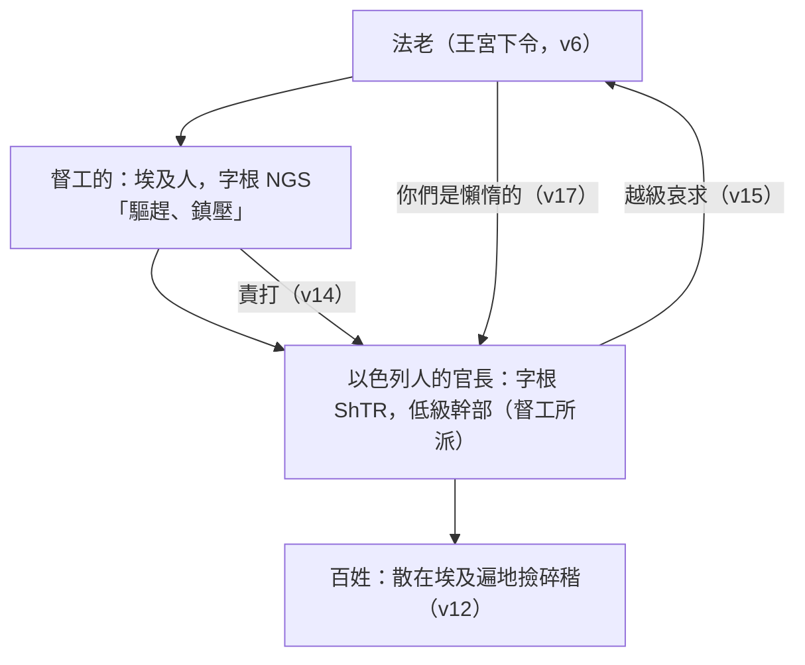

# 出埃及記 第5章

<!-- chapter-navigation:start -->
| [前一章](第4章.md) | [回目錄](全書目錄及綱要.md) | [下一章](第6章.md) |
| :--- | :---: | ---: |
<!-- chapter-navigation:end -->

1. 後來[[摩西]]、[[亞倫]]去對[[法老]]說：[[耶和華的話臨到|耶和華]]─[[以色列]]的神這樣說：[[容我的百姓去]]，在[[曠野]]向我[[在曠野向神守節|守節]]。
2. [[法老]]說：[[耶和華是誰]]，使我聽他的話，容[[以色列|以色列人]]去呢？我不認識耶和華，也不容以色列人去！
3. 他們說：[[希伯來人的神|希伯來人的神遇見了我們]]。求你容我們往[[曠野]]去，走[[三天的路程]]，祭祀[[耶和華的話臨到|耶和華]]─我們的神，免得他用瘟疫、刀兵攻擊我們。
4. [[埃及]]王對他們說：[[摩西]]、[[亞倫]]！你們為什麼叫百姓[[勞碌|曠工]]呢？你們去擔你們的[[擔子]]吧！
5. 又說：看哪，這地的[[以色列|以色列人]]如今眾多，你們竟叫他們歇下[[擔子]]！
6. 當天，[[法老]]吩咐[[督工的]]和[[以色列人的官長|官長]]說：
7. 你們不可照常把[[草與磚|草給百姓做磚]]，叫他們自己去撿草。
8. 他們素常[[草與磚|做磚的數目]]，你們仍舊向他們要，一點不可減少；因為他們是懶惰的，所以呼求說：[[容我的百姓去|容我們去祭祀我們的神]]。
9. 你們要把更重的工夫加在這些人身上，叫他們[[勞碌]]，不聽[[法老預表撒但|虛謊的言語]]。
10. [[督工的]]和[[以色列人的官長|官長]]出來對百姓說：[[法老]]這樣說：我不給你們草。
11. 你們自己在哪裡能找[[草與磚|草]]，就往那裡去找吧！但你們的工一點不可減少。
12. 於是百姓散在[[埃及]]遍地，撿碎秸當作[[草與磚|草]]。
13. [[督工的]]催著說：你們一天當完一天的工，與先前有[[草與磚|草]]一樣。
14. [[法老]][[督工的]]，責打他所派[[以色列人的官長]]，說：你們昨天今天為什麼沒有照向來的數目[[草與磚|做磚]]、完你們的工作呢？
15. [[以色列人的官長]]就來哀求[[法老]]說：為什麼這樣待你的僕人？
16. [[督工的]]不把[[草與磚|草]]給僕人，並且對我們說：[[草與磚|做磚]]吧！看哪，你僕人挨了打，[[其實是你百姓的錯（16節）|其實是你百姓的錯]]。
17. 但[[法老]]說：你們是懶惰的！你們是懶惰的！所以說：[[容我的百姓去|容我們去祭祀耶和華]]。
18. 現在你們去做工吧！[[草與磚|草]]是不給你們的，[[草與磚|磚]]卻要如數交納。
19. [[以色列人的官長]]聽說你們每天[[草與磚|做磚]]的工作一點不可減少，就知道是遭遇禍患了。
20. 他們離了[[法老]]出來，正遇見[[摩西]]、[[亞倫]]站在對面，
21. 就向他們說：願[[耶和華的話臨到|耶和華]]鑒察你們，施行判斷；因你們使我們在[[法老]]和他臣僕面前有了臭名，把刀遞在他們手中殺我們。
22. [[摩西]]回到[[耶和華的話臨到|耶和華]]那裡，說：主啊，你為什麼[[神的拯救延遲|苦待這百姓]]呢？為什麼打發我去呢？
23. 自從我去見[[法老]]，奉你的名說話，他就苦待這百姓，你一點也沒有[[神的拯救延遲|拯救他們]]。

---

## 本章知識節點

### 神學
- [[容我的百姓去]]
- [[耶和華是誰]]
- [[希伯來人的神]]
- [[在曠野向神守節]]
- [[三天的路程]]
- [[草與磚]]
- [[擔子]]
- [[勞碌]]
- [[法老預表撒但]]
- [[神的拯救延遲]]
- [[耶和華的話臨到]]

### 解經爭議
- [[三天的路程是欺騙嗎]]
- [[其實是你百姓的錯（16節）]]
- [[出埃及時期法老的身份]]

### 人物
- [[督工的]]
- [[以色列人的官長]]

### 地點
- [[曠野]]
- [[比東]]

---

## 本章整理

GT《中文聖經註釋》為全章下了最好的註腳：「如果只讀第五章，我們會對摩西所領導的以色列人與法老的鬥爭，感到烏天黑地。的確，黎明前必定是最黑暗的時候。」==本章由信心的高峰（4:31「百姓就信了」）直落到摩西的哀訴（5:23「你一點也沒有拯救他們」）。==

### 經文大綱

1. 摩西和亞倫向法老提出請求（1-3節）
2. 法老加重苦待以色列人（4-9節）
3. 以色列人到處找草料（10-14節）
4. 官長向法老申訴無效（15-19節）
5. 官長轉向摩西亞倫抱怨（20-21節）
6. 摩西向神禱告（22-23節）

### 一、第一次見法老（v1-3）

「耶和華以色列的神這樣說」是先知宣告的標準格式——GT《中文聖經註釋》說這是「我們在先知書上所熟知的字句」，《串珠聖經註釋》也說摩西「用先知慣用的口吻向法老說話」。GT 丁良才《出埃及記註釋》指出「以色列的神」是聖經裡第一次用這名稱（來11:16），KC 同樣說這個神的名「在此第一次在聖經中與祂的百姓連在一起被提起」。丁良才另記下他們求見的地點：摩西和亞倫是到瑣安城去的（詩78:12），俗名他呢城，就是埃及當時的京城。

> [!quote] 「[[容我的百姓去]]」是命令，不是請求
> KC：他們是站在法老面前作神的大使，「這不是一個請求，而是一道命令：讓我的百姓去」。「我的百姓」——法老對他們毫無權利。
>
> 神將七次這樣吩咐法老：5:1、7:16、8:1、8:20、9:1、9:13、10:3（KC 說會被告知七次，丁良才列出那七處）。
>
> GT《聖經精讀本》：這是摩西宣佈民族解放的宣告——其屬靈意義是神的百姓從撒但和死亡的手中得自由，而這自由藉基督完全成就（賽29:18；35:5-6；路7:22）。

「在曠野向我[[在曠野向神守節|守節]]」——GT《中文聖經註釋》指出原文的「守節」並不是甚麼節期，「乃是『朝聖』的用字」；《串珠》同說「意思是朝拜或朝聖，目的是獻祭與神」；《啟導本聖經腳註》則說「守節」（hag）「指去到聖所朝拜神，向祂獻祭」。為什麼非得離開[[埃及]]不可？CT 的背景註解與《啟導本》給的是最實際的理由：以色列人所獻的祭牲中，有埃及人尊為聖物、不准人殺的牲畜（8:26——若在埃及人面前行此事，會遭石頭打死）。GT《舊約背景註釋》補上一層文化背景：古代的節期通常要特別在聖地舉行，「因此需要朝聖旅程」。

> [!note] 「[[耶和華是誰]]」——這不是一個問題
> 「耶和華是誰，使我聽他的話，容以色列人去呢？我不認識耶和華，也不容以色列人去！」
>
> 各家一致指出這是蔑視，不是求知。《啟導本》：「他所以問，不是希望知道『耶和華是誰』，而是輕蔑與不屑。」《串珠》：「這是法老藐視的答覆，並不是他心裡的問題。」CT：「法老並非孤陋寡聞、未曾聽聞過耶和華……他乃是有恃無恐，認為埃及人的神大過以色列人的神。」
>
> KC 說得最重：「『耶和華是誰？』這句話完全顯明了他的性情。他對神毫無敬意……對他而言，耶和華並不存在。這是驕傲的頂峰。」肉體不服神（羅8:7）。BH 也說在埃及的多神信仰裡耶和華對法老是陌生的，這句話「顯出法老屬靈的盲目與傲慢」。
>
> 但這句話會被神親自回答。《串珠》：「後來神在埃及表彰其大能的時候，法老便漸漸認識耶和華是誰」（8:19；9:27）——「使人深深知道『祂是耶和華』」正是5-11章的主題。

> [!question] [[出埃及時期法老的身份|這位法老究竟是誰？]]
> GT《聖經精讀本》主張是圖特摩斯三世之後的阿孟和蒂二世（主前1448-1424年），當時年僅二十至二十二歲；賈斯樂郝威《聖經難解經文詮釋手冊》從王上6:1推算（出埃及後480年是所羅門第四年，約主前967年）得出主前1447年，法老是亞門諾菲斯二世（Amenhotep II）；而現代學者一般主張出埃及在主前1270-1260年間，法老是拉美西斯二世。
>
> 兩派相差可達兩百年。賈斯樂另引 Velikovsky-Courville 修訂法，主張埃及王朝年代多算了六百年，據此法老應是東（Thom），並以1:11的[[比東]]（Pithom，「東的居所」）為佐證——同一個地名，在出1的華爾頓《出埃及記背景注釋》卻解作埃及語的比亞頓，意即「亞頓神之地業」。經文本身從頭到尾沒有給這位法老名字。

第3節摩西改口稱「[[希伯來人的神]]」——KC 說「希伯來的意思是『從另一邊來的人』，也就是來自埃及以外的另一個國家」，CT 的原文字義同樣作「過河的人，來自遠處的人」；丁良才指出這是埃及人對他們的叫法。同時加上「[[三天的路程]]」與「免得他用瘟疫、刀兵攻擊我們」的說明，GT《中文聖經註釋》讀出這是訴諸情理的說服：若不容他們去，他們遭瘟疫刀兵，法老也就喪失了勞工——「從長遠來看，從大處想，法老應當為自己的利益的緣故，准許他們出去」。

> [!note] [[三天的路程是欺騙嗎|「三天的路程」是不是騙術？]]
> KC 給的答覆很值得留意：「摩西和亞倫沒有提到在曠野守節之後要繼續前往應許之地。這不是欺騙。一旦從埃及被拯救出來，人就永不再回去。曠野不是拯救的目標，那是我們所經過的地方。」
>
> GT《每日研經叢書》從地理上處理：「『三天的路程』並不意指西乃山離埃及邊境不過是三天的行程。這是一個含糊的說法，而且因為曠野起自邊境哨崗，它便極其清楚地指埃及的勢力之外。」同一份注釋也說：「我們不能說法老立即領悟這請求的完全意指，但毫無疑問，他對以色列百姓的任何合法的要求，都會根據埃及的基本利益而加以拒絕的。」
>
> 並且經文自己已經預告了結局（3:19）：神早就知道法老不會答應。

### 二、當天就下令（v4-9）

「你們去擔你們的[[擔子]]吧」——GT《中文聖經註釋》指出「這擔子的原文與一11的重擔是同一個字」，並注意到那個「你們」：它「似乎表達摩西亞倫也要這樣工作」。CT 的〔話中之光〕對第6節的「當天」有一句很刺人的話：「『當天』表示法老作事並不拖延。有一位屬靈的前輩說：魔鬼有一樣長處，就是牠作事殷勤，決不敷衍塞責。」

> [!quote] 第5節原文其實沒有「以色列」
> GT《中文聖經註釋》：原文是「這地的人」，和合本的「以色列」是原文沒有的。這個詞的意思要看說話者的神情與語氣：平和地說是「本地人」；欣羨地說是「地主、當地領導人」；但若說得不客氣或輕蔑，那就是「農人、沒受教育的人、賤民」——「按現有經文來看，當年法老對摩西和眾長老說話時，必定是不客氣和輕蔑的語調」，因此這句話可能應譯作「看哪，如今賤民這樣眾多」。GT《丁道爾聖經註釋》同：在被擄歸回之人的口中，這也是對「非以色列人」的鄙稱（拉4:4）。

法老的壓迫是有層級的，而每一層都把壓力往下推：



> [!note] 「[[督工的]]」與「[[以色列人的官長]]」不是同一批人
> GT《中文聖經註釋》把原文分得很清楚：督工的是埃及人，原文出自字根 NGS「驅趕、鎮壓」，與1:11的「督工」（指官員、高官）並不是同一個字——「用字已證明當時比從前的欺壓，已經厲害得多了」；官長則是以色列人，原文字根 ShTR 指低級幹部（現代中文譯本作「領班」），是由督工的所指派的（14、15、19節）。
>
> BH 補上這個結構的效果：工頭多半是被指派管理自己同胞的以色列人，這種階層「在以色列人中造成分裂」，使他們被迫參與對自己人的壓迫。

法老的新命令有三層：

| 命令 | 內容 | 效果 |
|---|---|---|
| 不再供應草（7節） | 「叫他們自己去撿草」 | [[草與磚]]：草是泥磚的黏結劑——GT《舊約背景註釋》：「沒有足夠的草料，或者使用品質不佳的碎草，磚塊就不易形成。隨著破裂比率的增高，規定的數額就難以達到」 |
| 磚數不減（8節） | 「一點不可減少」 | GT《中文聖經註釋》：「這是無理的欺壓，是比前更甚的高壓。可是，數量既不能減，質量便必定下降」 |
| 加重工夫（9節） | 「叫他們[[勞碌]]，不聽虛謊的言語」 | 目的明確：讓百姓忙到無暇思想神的話（見 [[法老預表撒但]]） |

> [!quote] 「虛謊的言語」——把真理反轉
> GT《丁道爾聖經註釋》與《串珠》：「虛謊的言語」大概是指神救贖以色列的應許；亞倫曾把這消息帶給以色列（4:30），法老起碼會間接聽聞。
>
> KC：「這裡我們也看見撒但如何作工。他總是扭曲神的真理，把它反轉」——他「不守真理，因他心裡沒有真理。他說謊是出於自己」（約8:44）。
>
> GT 丁良才點出這一招針對的是甚麼：以色列人先前或者還有點閒工夫（4:30-31就顯明他們有工夫聚會、討論他們的事），「法老想出這種毒法，使他們沒有一點休息的空兒」。CT 的〔話中之光〕轉得極貼近今日：「這個世界想讓我們信徒拚命工作，藉以阻止我們聚會、親近敬拜神」，而「這世界的人看我們基督徒，認為我們把時間用在聚會、敬拜神，是懶惰的，是在浪費時間」。

### 三、撿碎稭當作草（v10-14）

「於是百姓散在埃及遍地，撿碎稭當作草」——丁良才說得最細：「草」原文是指割碎與糠皮摻合的草，埃及人用來餵牲畜；「碎稭是田間遺下的，又少又難拾取，草本是從禾場得來的，又多又容易收取」。GT《丁道爾聖經註釋》從原文的修辭讀出輕蔑：「碎稭」（qas）是參差、粗劣的材料，不宜作為正常之「草」的代用品，並且它與同源動詞「撿」重疊使用，「強調輕蔑的態度」。GT《聖經精讀本》補上勞動的實況：埃及收割是割掉上面的穀子、留下秸稈，在有限的田地裡收取，還要把它切成細細的碎末，「是一件非常費時間的苦工」。BH 也說碎稭「是收割後留下的殘梗，遠不如草有效」。

這道命令在實務上的後果，GT《中文聖經註釋》引了一份考證：數量既不能減，質量便必定下降——這是任斯（C. F. Nims）於一九五○年在《聖經考古學家》專刊第十三卷所發表的考證所證明的情況；GT《舊約背景註釋》也說埃及文獻中的數額往往沒有說明工人的數目和容許的時間，「只知數額經常都無法達到」。

CT 的靈訓在此轉得很利落：神是要我們「聚集」，撒但是叫我們「分散」；「撿碎稭當作草」是以「次好的」代替「上好的」，但主所作的總是「上好的」（約2:10）。而挨打的是誰？CT 說在這世界擔任官長的，「表面上看似地位崇高，其實是『夾心餅乾』——上頭交付的任務必須完成，下頭卻難處重重，真是兩面不是人」。丁良才則把督工的所作的三件事列出來——宣佈王命（10-11節）、催逼百姓（13節）、責打官長（14節）——並與第1章的收生婆對照：「他們和收生婆的行為正是相反」（1:15-20），因為「敬畏神的軟弱人往往勝於不信其神的剛強人」（林後12:9；林前1:27）。

### 四、越級申訴（v15-19）

GT《中文聖經註釋》指出這一幕的歷史真實性：要越過督工的直接向法老哀求，「這在古代似乎是無可能的。但奴隸向法老直接求告的事實，卻在古代的埃及有紀錄可查」（第十九王朝時期）——「這也和中國的『告御狀』相類」；《啟導本聖經腳註》也記下同一條史料。官長此行本來抱著另一種期待：同一份注釋推想，他們以為法老未必那麼不合情理，「而是督工的加鹽加醋，又不給草，作磚的數目卻要每天照交」，甚至可能是督工的私賣了草料。

> [!quote] [[其實是你百姓的錯（16節）|第16節末句，原文其實譯不出來]]
> GT《中文聖經註釋》詳述這一節末句的原文只有兩個詞：「頭一個詞的直譯是『妳犯罪』（陰性的妳），第二個詞直譯乃『你的民』（陽性的你）。這是無論如何也解釋不了的。」
> - 《耶路撒冷聖經》乾脆放棄翻譯，以「……」代替——表示官長的話還沒說完，法老就打斷了他們（第17節）。
> - 七十士譯本、敘利亞譯本把陰性改成陽性，藉以指明是法老。
> - 現代中文譯本作「這是你們埃及人的過錯」，《中文聖經註釋》認為這「可能較接近原作者所要表達的本意」。
>
> 還有一個語感上的細節：以色列人在法老面前只敢自稱「你的僕人」，不敢自稱「你的民」——因為他們是「國奴」，而不是國民。
>
> 這個「話沒說完就被打斷」的讀法，正好解釋了第17節法老那句重複兩次的暴怒：「你們是懶惰的！你們是懶惰的！」——《中文聖經註釋》：這重複語「不單顯示出當時法老說話的神情，也表明他看這事的嚴重性，以及暴露了法老的無理」。

「就知道是遭遇禍患了」（19節）——CT 把這個「知道」的兩層意思說清楚了：他們知道不是埃及督工的無理要求，其實是法老自己的諭令；而法老之所以下此諭令，乃因摩西和亞倫向法老提出了在曠野祭拜神的訴求。禍患的源頭，就這樣一層層追溯到摩西身上。

### 五、他們埋怨摩西（v20-21）

[[摩西]]和[[亞倫]]站在對面等候——CT 推測：很可能他們非常關心官長進宮申訴的結果，所以等在宮外。「願[[耶和華的話臨到|耶和華]]鑒察你們，施行判斷」——GT《中文聖經註釋》指出和合本的語氣不夠原文凌厲：原文的「鑒察」是有先見之明的看見，「判斷」也可以譯成「懲罰」，實際上是「神已看見你們所作的，祂必懲罰你們！」《串珠》另指出這是「無辜受害者禱告時常用的語句」。

> [!note] 神的僕人被自己人埋怨
> 丁良才的〔要訓〕排得很整齊：神的僕人不但被仇敵藐視（4-8節），也是受同人的埋怨（21節）；信徒所遇見的，往往似乎與神所應許的相反（4:30-31對照5:21）。他還加了一句非常銳利的觀察：「教會中的人遭逼迫，也往往不怪逼迫他的人，反倒怪牧師不立時幫助他們。」
>
> KC：主的僕人必須把這件事算在內——他們會被誤解、被控告，甚至被責備所淹沒；「摩西和亞倫似乎默默地轉身離去，去作在這處境中唯一正確的事：轉向神」。
>
> BH 也解釋了官長那句話的份量：說他們成了法老面前的「臭名」，在重視榮辱的古代近東是極重的話，意思是「徹底失去了體面與尊重」。

### 六、你一點也沒有拯救他們（v22-23）

「摩西回到耶和華那裡」——不是回到何烈山。GT《中文聖經註釋》：神既應許與他同在（3:12），「則摩西無論有任何困難，他隨時都可以回到神那裏，藉禱告與祂交通」。

摩西的哀訴是兩個「為什麼」加一句斷語：「主啊，你為什麼苦待這百姓呢？為什麼打發我去呢？……你一點也沒有拯救他們。」末句原文是雙同字的強調——「論拯救，你一點也沒有拯救你的百姓」；BH 也指出「苦待」的原文（ra'ah）常指災禍或惡事。各家對這番話的評價並不一致：

| 來源 | 怎麼看摩西這番話 |
|---|---|
| KC | 「他的聲音裡有不信」——摩西的眼目不再定睛於耶和華，而是注視百姓；「僕人不該看他的工場，應當看他的差遣者」 |
| GT《聖經精讀本》 | 「這句話不是出於氣忿」，而是人不能理解神的計畫時誰都會發出的哀求（詩74:1；89:46）；哈巴谷問過同樣的問題（哈1:13-17），得到的答覆是「雖然遲延，還要等候」（哈2:3） |
| CT | 「信靠神的人，碰到外面現實生活中的難處，反而會逼他們回到神面前，更多仰望神」；並說「與其向人哀求（15節），不如向神求告」 |
| GT 丁良才 | 「後來的以色列人若要捏造本書的事，必定不寫這兩節的話」 |

《精讀本》另提醒一件要緊的事：神對法老的這種壓制早已預言過（3:19；4:21）——摩西遇到的不是神沒料到的事。

> [!note] 為什麼神要讓[[神的拯救延遲|拯救延遲]]？
> KC 對本章最深的一段解讀值得完整讀：「百姓必須先發現，他們沒有能力作成自己的拯救。罪人也是一樣，他必須學會他是在肉體中、在撒但的權下。神容許這事發生，是要試驗祂百姓的信心，並使他們習慣祂行事的方式；祂也容許這事發生，好在撒但已經建立權柄的地方，顯出祂能力的榮耀啟示。」
>
> 「一個人若要經歷神所賜的救恩，必須先來到他愁苦的最低點……若法老立刻就放他們走，他們要感謝的是法老——那麼神的榮耀在哪裡呢？」
>
> KC 把它連到羅馬書第7章：福音起初看似（並且確實是！）好消息，卻使人發現罪在裡面的權勢——正如法老加重擔子；惟有當人喊出「我真是苦啊！誰能救我脫離這取死的身體呢？」（羅7:24），他才在他該在的地方，因為緊接著就是「感謝神，靠著我們的主耶穌基督」（羅7:25）。他並用主耶穌作對比：當祂在那些行了許多異能的城裡不見悔改時，祂沒有沮喪——祂讚美父（太11:20、25），「祂不看成功，也不看反對，只看父」。

從請求到哀訴，全章的落差可以一眼看完：

```mermaid
timeline
    title 第5章：一天之內的落差
    "4:31 百姓就信了" : "低頭下拜"
    "5:1-3 第一次見法老" : "容我的百姓去" : "求你容我們走三天的路程"
    "5:2 法老的回答" : "耶和華是誰" : "我不認識耶和華"
    "5:6-9 當天下令" : "不給草" : "磚數不減" : "加重工夫"
    "5:14-19 官長挨打、申訴無效" : "你們是懶惰的"
    "5:20-21 官長埋怨摩西" : "願耶和華鑒察你們"
    "5:22-23 摩西向神哀訴" : "你一點也沒有拯救他們"
```

本章結束在最深的黑暗裡。但 GT《中文聖經註釋》提醒：「惟有在讀到本大段的末了（6:1），才給我們看到與法老鬥爭的一線曙光。」

### 關鍵神學點

1. [[容我的百姓去]]：這是命令不是請求，將重複七次。「我的百姓」——法老對他們毫無權利。
2. [[耶和華是誰]]：法老的蔑視之問，將由神親自用十災回答（8:19；9:27）。5-11章的主題正是「使人深深知道祂是耶和華」。
3. [[在曠野向神守節]]／[[三天的路程]]：出埃及的目的不是脫離勞役，而是敬拜——並且這敬拜必須在埃及以外。
4. [[法老預表撒但]]：法老稱神的應許為「虛謊的言語」，並用[[勞碌]]使百姓無暇聽神的話（約8:44；10:10）。
5. [[神的拯救延遲]]：順服神的結果，一開始往往是更大的苦難。神容許人走到絕境，是要他知道拯救全然出於神，不出於自己，也不出於法老的開恩。
6. 僕人當看差遣者，不看工場（KC）：摩西的失望，出於他把眼目從神轉到了百姓的反應上。

**參考資料**
https://biblehub.com/study/exodus/5.htm
https://www.kingcomments.com/en/bible-studies/Exo/5
https://www.ccbiblestudy.org/Old%20Testament/02Exo/02CT05.htm
https://www.ccbiblestudy.org/Old%20Testament/02Exo/02GT05.htm

<!-- chapter-navigation:start -->
| [前一章](第4章.md) | [回目錄](全書目錄及綱要.md) | [下一章](第6章.md) |
| :--- | :---: | ---: |
<!-- chapter-navigation:end -->
