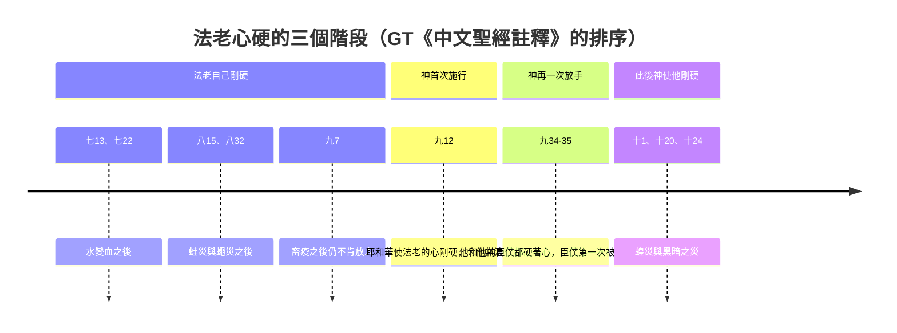
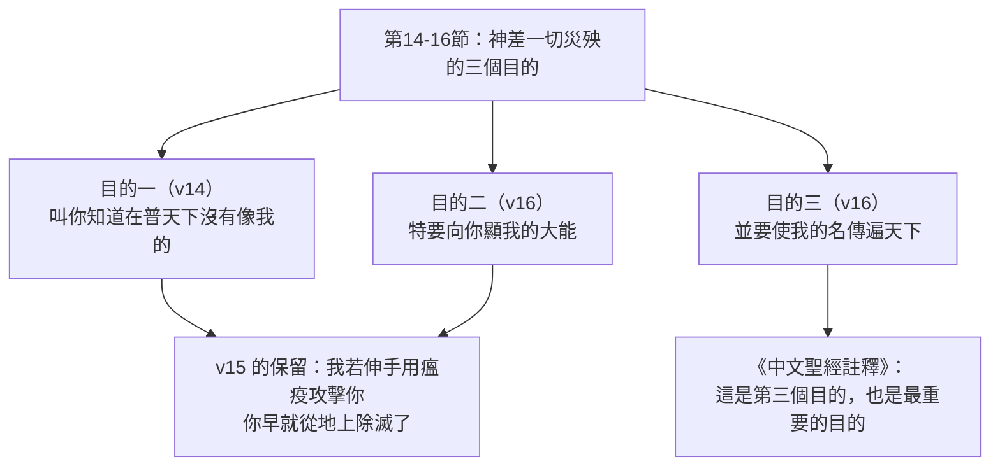
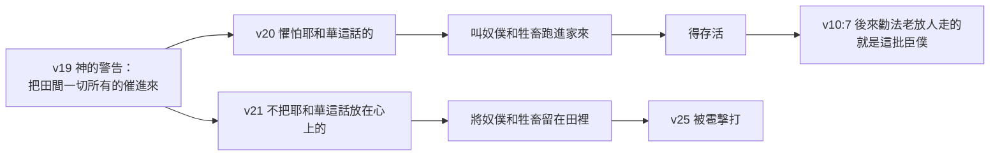

# 出埃及記 第9章

<!-- chapter-navigation:start -->
| [前一章](第8章.md) | [回目錄](全書目錄及綱要.md) | [下一章](第10章.md) |
| :--- | :---: | ---: |
<!-- chapter-navigation:end -->

1. [[耶和華]]吩咐[[摩西]]說：你進去見[[法老]]，對他說：[[希伯來人的神|耶和華─希伯來人的神]]這樣說：容我的百姓去，好事奉我。
2. 你若不肯容他們去，仍舊強留他們，
3. [[耶和華的手]]加在你[[田間]]的牲畜上，就是在馬、驢、[[駱駝成為家畜|駱駝]]、牛群、羊群上，必有[[第五災：重重的瘟疫|重重的瘟疫]]。
4. [[分別歌珊地|耶和華要分別以色列的牲畜和埃及的牲畜]]，凡屬[[以色列|以色列人]]的，一樣都不死。
5. [[耶和華]]就定了時候，說：[[明天：神留給悔改的空檔|明天]]耶和華必在此地行這事。
6. 第二天，[[耶和華]]就行這事。[[埃及]]的牲畜幾乎都死了，只是[[以色列|以色列人]]的牲畜，一個都沒有死。
7. [[法老]]打發人去看，誰知[[以色列|以色列人]]的牲畜連一個都沒有死。法老的心卻是固執，不容百姓去。
8. [[耶和華]]吩咐[[摩西]]、[[亞倫]]說：你們取[[爐灰的出處|幾捧爐灰]]，摩西要在[[法老]]面前向天揚起來。
9. 這灰要在[[埃及]]全地變作塵土，在人身上和牲畜身上成了[[起泡的瘡]]。
10. [[摩西]]、[[亞倫]]取了[[磚窯|爐灰]]，站在[[法老]]面前。摩西向天揚起來，就在人身上和牲畜身上成了[[起泡的瘡]]。
11. 行法術的在[[摩西]]面前站立不住，因為在他們身上和一切[[埃及]]人身上都有這瘡。
12. [[耶和華使法老的心剛硬]]，不聽他們，正如耶和華對[[摩西]]所說的。
13. 耶和華對[[摩西]]說：你清早起來，站在[[法老]]面前，對他說：[[希伯來人的神|耶和華─希伯來人的神]]這樣說：容我的百姓去，好事奉我。
14. 因為這一次我要叫[[普天下沒有像我的|一切的災殃]]臨到你和你臣僕並你百姓的身上，[[普天下沒有像我的|叫你知道在普天下沒有像我的]]。
15. 我若伸手用瘟疫攻擊你和你的百姓，你早就從地上除滅了。
16. 其實，我叫你存立，是特要向你[[神大能與名的傳遍|顯我的大能]]，並要[[神大能與名的傳遍|使我的名傳遍天下]]。
17. 你還向我的百姓自高，不容他們去嗎？
18. [[明天：神留給悔改的空檔|到明天約在這時候]]，我必叫重大的冰雹降下，自從[[埃及]]開國以來，沒有這樣的冰雹。
19. 現在你要打發人把你的牲畜和你[[田間]]一切所有的催進來；凡在田間不收回家的，無論是人是牲畜，冰雹必降在他們身上，他們就必死。
20. [[法老]]的臣僕中，[[敬畏耶和華的話|懼怕耶和華這話]]的，便叫他的奴僕和牲畜跑進家來。
21. 但那[[敬畏耶和華的話|不把耶和華這話放在心上]]的，就將他的奴僕和牲畜留在田裡。
22. [[耶和華]]對[[摩西]]說：你向天伸杖，使[[埃及]]遍地的人身上和牲畜身上，並[[田間]]各樣菜蔬上，都有冰雹。
23. [[摩西]]向天伸杖，[[耶和華]]就[[雷轟即神的聲音|打雷]]下雹，有火閃到地上；耶和華下雹在[[埃及]]地上。
24. 那時，雹與火攙雜，甚是厲害，自從[[埃及]]成國以來，遍地沒有這樣的。
25. 在[[埃及]]遍地，雹擊打了[[田間]]所有的人和牲畜，並一切的菜蔬，又打壞田間一切的樹木。
26. 惟獨[[分別歌珊地|以色列人所住的歌珊地沒有冰雹]]。
27. [[法老]]打發人召[[摩西]]、[[亞倫]]來，對他們說：[[法老的認罪|這一次我犯了罪了]]。[[公義與邪惡的對立|耶和華是公義的；我和我的百姓是邪惡的]]。
28. 這[[雷轟即神的聲音|雷轟]]和冰雹已經夠了。請你們求[[耶和華]]，我就容你們去，不再留住你們。
29. [[摩西]]對他說：我一出城，就要向[[耶和華]]舉手禱告；雷必止住，也不再有冰雹，[[全地都是屬耶和華的|叫你知道全地都是屬耶和華的]]。
30. 至於你和你的臣僕，我知道你們還是不懼怕[[耶和華]]神。
31. （那時，[[埃及的祭司服飾（亞麻）|麻]]和大麥被雹擊打；因為大麥已經吐穗，麻也開了花。
32. 只是小麥和粗麥沒有被擊打，因為[[出埃及時序（一月底二月初）|還沒有長成]]。）
33. [[摩西]]離了[[法老]]出城，向[[耶和華]]舉手[[摩西的代求|禱告]]；雷和雹就止住，雨也不再澆在地上了。
34. [[法老第三次轉硬|法老見雨和雹與雷止住，就越發犯罪]]；他和他的臣僕都硬著心。
35. [[法老]]的心剛硬，不容[[以色列|以色列人]]去，正如[[耶和華]]藉著[[摩西]]所說的。

---

## 本章知識節點

### 人物
- [[摩西]]
- [[亞倫]]
- [[法老]]
- [[雅尼和佯庇]]

### 地點
- [[埃及]]
- [[歌珊地]]
- [[田間]]

### 歷史
- [[十災]]
- [[第五災：畜疫之災]]
- [[第六災：瘡災]]
- [[第七災：雹災]]
- [[法老第三次轉硬]]

### 神學
- [[耶和華]]
- [[希伯來人的神]]
- [[耶和華的話臨到]]
- [[耶和華的手]]
- [[第五災：重重的瘟疫]]
- [[分別歌珊地]]
- [[耶和華使法老的心剛硬]]
- [[普天下沒有像我的]]
- [[神大能與名的傳遍]]
- [[敬畏耶和華的話]]
- [[明天：神留給悔改的空檔]]
- [[雷轟即神的聲音]]
- [[法老的認罪]]
- [[公義與邪惡的對立]]
- [[全地都是屬耶和華的]]
- [[摩西的代求]]

### 原文
- [[以色列]]
- [[希伯來（Hebrew）]]
- [[起泡的瘡]]
- [[炭疽（anthrax）]]

### 文化
- [[磚窯]]
- [[哈妥爾（Hathor）]]
- [[亞皮斯（Apis）]]
- [[埃及的醫治之神]]
- [[埃及的天候之神]]
- [[駱駝成為家畜]]
- [[埃及的祭司服飾（亞麻）]]
- [[出埃及時序（一月底二月初）]]

### 解經爭議
- [[埃及的牲畜「幾乎」都死了]]
- [[爐灰的出處]]

### 互文
- [[羅馬書 9-17（神興起法老）|羅9:17 保羅引用「我叫你存立」立神主權]]
- [[撒母耳記上 15-24（掃羅認罪）|撒上15:24 掃羅口認罪而行未改]]
- [[路加福音 15-18（浪子認罪）|路15:18 浪子的認罪與法老的分別]]
- [[約伯記 38-22-23（神所存留的冰雹）|伯38:22-23 冰雹是神為爭戰之日所存留的]]
- [[啟示錄 16-21（末世大冰雹）|啟16:21 末世第七碗的大冰雹]]

---

## 本章整理

本章一次收了三災，而且是災序性質轉變的一章。CT 把轉折說得最清楚：「前面的四災不過是叫埃及人的身心受到攪擾與痛苦而已，但從這災開始，是叫他們的財產蒙受損失，並且損失慘重。」到了第七災，連性命也保不住——GT 丁良才數點雹災的特異時說，這是==十災中頭一個使人喪命的大災==。本章同時出現三個第一次：第12節第一次是神使法老的心剛硬，第20節第一次有埃及人懼怕耶和華的話，第27節第一次法老說「我犯了罪了」。

### 一、畜疫之災（v1-7）

第1節的開場白是[[希伯來人的神|耶和華─希伯來人的神]]，這個稱號本身就是一份說明書。[[希伯來（Hebrew）|「希伯來」的字義是「過河的人，來自遠方的人」]]，CT 據此列出四層意思：神帶領他們從大河那邊過來，為要叫他們從拜偶像的人中間分別出來；祂是他們所拜的神；祂寶愛並照顧他們；祂的名就是耶和華。KC 把同一個字讀成一種處境：「一個希伯來人是地上的客旅，因為他屬於另一個國度。」

災的施行方式在本章開頭就與前四災不同。第3節說「[[耶和華的手]]加在你[[田間]]的牲畜上」——GT《中文聖經註釋》指出「全舊約有二百多次用手來表達神的權能和力量」，並注意到這裡改用第三人稱，「而其他地方都用『我』」，因為這段話是由摩西的口說出來的。第6節則連摩西的口都不必了：「第二天，耶和華就行這事」——同一份註釋說這是「神自己施行神蹟，未經摩西或亞倫之手」。

這一擊落在埃及最實在的家當上。[[第五災：重重的瘟疫|「重重的瘟疫」]]是什麼病，各家推測一致而保留：CT 說「許多聖經學者認為可能是[[炭疽（anthrax）|炭疽(anthrax)病]]」，GT《舊約聖經背景註釋》說「這畜疫經常被鑑定為炭疽。這種尼羅河沖下來的細菌，魚、蛙，和蒼蠅都被它所感染」，GT《丁道爾》補上它為何在此時發作：「田野到處堆滿青蛙的腐屍，又有蒼蠅傳播病菌，這種病症很可能發生，後果也十分可怕。」但 GT《中文聖經註釋》把話打住：「這瘟疫究竟是甚麼疫症，我們無法了解……我們應注意的是，這是神的手所作的。」

損失的分量三家都算過。GT《聖經精讀本》從原文入手：「譯成牲畜一詞的希伯來語是『擁有』、『財產』的意思」，因此牲畜大量死亡「不僅給經濟帶來了極大的損失，而且也給農業和運輸業帶來了致命的打擊」。GT《每日研經叢書》說「這災的意思是對於許多較少財產的埃及人是破產了」。BH 則逐項點出第3節那份清單為何要列得這麼細——馬用於戰車、驢用於運輸、駱駝用於貿易、牛羊供應食物與衣料，沒有一個層面碰不到。清單裡的[[駱駝成為家畜|駱駝]]另有一段年代學上的討論：GT《中文聖經註釋》指出「駱駝成為家畜，則是主前十二世紀以後由米甸人首先馴服的事」，GT《丁道爾》則保留得多，說「駱駝要到基甸的時代，才廣泛受人馴養，但早時也間或有人使用」。

牲畜之死同時是一場宗教清算。CT 的靈訓要義一句話點明本災「對付埃及的牛神」，GT《舊約聖經背景註釋》給出名字：「埃及愛神[[哈妥爾（Hathor）|哈妥爾（Hathor）]]以母牛的形式出現，而代表[[亞皮斯（Apis）|亞皮斯（Apis）]]的聖牛，更備受尊崇到死後要受薰屍處理，有自己的石棺，在墓城（necropolis）中安葬的地步。」GT《丁道爾》還注意到一層反諷：「在討論過『以動物為祭極受埃及人厭惡』（8:26）之後發生此事，真是諷刺。」而 GT《聖經精讀本》下的結論最直接：「被埃及人視為賜給力量和生命的黃牛等牲畜在瘟疫中死亡的事件證明了它們根本不是神。」

> [!question] [[埃及的牲畜「幾乎」都死了|第6節說牲畜都死了，第19-25節卻還有牲畜]]
> GT《中文聖經註釋》先把文本問題點清楚：「這裡的『幾乎』有旁點，說明是和合本譯者所加的——原文卻是『埃及的牲畜都死了』。」四家給出四條解法：
> - **GT 丁良才**列出三種可能：「或是囫圇話」、「或是單指田間的牲畜」、「或是埃及人後來向以色列人又購買了牲畜」。
> - **GT 賈斯樂郝威**〈命題15〉取第二解：「畜疫之災所傷害的是田間的牲畜（出九3），牲畜在畜舍（stalls）裡的將不受到瘟疫的傷害。」
> - **GT《丁道爾》**同取此說，並補一個生活細節：「如今某些季節，仍有把牲口關在棚內的習慣。」
> - **GT《丁道爾》**在第25節又把它提到讀法的層次：「所有。這話也必須從修辭而非數學的角度理解。」
>
> 最後這一條是全卷讀「所有／都」時的通則。

第7節法老派人去看，查證屬實，心卻更硬。CT 的話中之光只給八個字：「明知故犯，頑冥不化。」

### 二、瘡災（v8-12）

這一災和第三災一樣，事前沒有預告。而它唯一的媒介是一把灰——[[爐灰的出處|那把灰從哪裡來]]，四家給的答案不同，象徵也就跟著不同。

KC 讀為磚窯，並由此讀出一句很重的話：「直到那時，埃及對以色列而言一直是一座壓迫的火爐。臨到埃及的這災，其根源正是他們對神百姓的虐待。」GT《舊約聖經背景註釋》卻直接否掉這條線：「埃及的磚通常是曬乾而非窯燒的。本節所說的爐子規模頗大，因此可能是焚燒死畜屍骸之處」——若取這一說，第六災就直接接在第五災的畜屍之上。GT《丁道爾》從字義切入，主張最貼切的翻譯是「煤煙」（soot），「即飄在風中極細的『塵』」。GT《中文聖經註釋》則以第9節反駁煤煙說：「前節既說了可『捧』的，而這節所用的灰，又實在是一種固體物」，並指出這個[[磚窯|「爐」]]字「多數用在為燒窯的窯」。

四說之上有一條各家都同意的線索：揚灰這個動作本身是埃及人的除災儀式。GT《舊約聖經背景註釋》說「埃及人有時用散灰作為遏止瘟疫的法術儀式」，GT 丁良才說「埃及人有時獻人為祭，又取這祭的灰向天揚起來，特要免災」。CT 於是下了結論：「向天揚灰，原是埃及人的一種迷信作法，用意在免受災害。但此次反而叫他們身上生瘡潰爛，為要破除他們的迷信。」==除災的動作成了降災的手段。==

[[起泡的瘡]]是什麼病，材料同樣豐富。GT《丁道爾》建議換個譯法：「『瘡』翻作『紅腫之處』更佳……紅腫之處接而發出各種的『膿頭』或『潰瘍』」，並列出舊解與新解——舊日解經家相信這是「尼羅河疥瘡」（Nilescab），傳染性的痱子則是另一個可能。GT《聖經精讀本》從原文的字義補上感受：這個字有「被火燒」、「開始熱」、「沸騰」之意，是「黑色發熱並帶有難忍的痛癢，慢慢變成膿皰的一種皮膚病」。GT《中文聖經註釋》則指出這病在當地本有專名：「在埃及生瘡本是常事，故有『埃及瘡』（申28:27）的病名，正如『香港腳』是特產於香港的濕氣疹一樣。」而 CT 的靈訓要義說本災「對付[[埃及的醫治之神|埃及的醫治之神]]」，BH 據此點名 Imhotep 與 Sekhmet，說這是「對埃及掌健康與醫藥之神祇的直接挑戰，顯出它們的無能」。KC 另從埃及人自己的價值觀補上一層羞辱：「對於特別注重外表的埃及人，這是可怕的羞辱——身體的潔淨與美麗，是他們宗教的一部分。」

第11節是術士這一方的終局。「站立不住」怎麼解，兩種讀法都有人主張：GT《中文聖經註釋》兩者兼取——「一方面也表達敵不過摩西了，另方面也是寫實的說，他們疼痛非常，坐立難耐」，並引一句俗諺「泥菩薩過江，自身難保」；GT《每日研經叢書》則覺得字面讀法牽強：「因為瘡是在他們腳上；比較更大可能的乃是意指他們放棄爭了，因為他們不能再反抗下去了。」無論哪一種，結局一樣：KC 把名字接上去——[[雅尼和佯庇|行法術的雅尼和佯庇]]身上也長出了瘡，印證了保羅所說的「他們的愚昧必在眾人面前顯露出來，像那二人一樣」（提後3:9）。CT 的話中之光轉得漂亮：「屬靈爭戰的祕訣乃是『站立得住』（弗6:13）——誰剛強站住，誰就是得勝者。」

第12節是全卷的一道分水嶺。[[耶和華使法老的心剛硬]]——GT《丁道爾》引戴維斯把分際講得最準：「聖經雖然說過神要使法老的心剛硬（4:21），災難真正發生後，用這措辭還是第一次。前面一貫的立場都是從另一方面看：法老硬著心。」——「本節的寓意是，神使自己硬著心的人心硬。」KC 說得最沉：「法老多次不肯讓自己的心軟化，這一次已經不可能了……神使人剛硬，只發生在人已經徹底拒絕神的見證、再沒有理由相信他會悔改之後。」GT《聖經精讀本》守住同一條界線：「無論是誰，神都不會把他們的心變得剛硬……只是頑固的人類，把自己弄得剛硬而已。」

丁良才數出法老自己硬心的五個表現：不聽神的吩咐、不怕神的威權、不理術士的見證（8:19）、不從臣僕的諫勸（10:7）、不顧自己的應許（9:28）——「所以神就任憑他。」他的比方很傳神：「鬧鐘本是為警醒人早起；人若屢次聽見鐘響卻不起來，後來養成了懶惰的惡習慣，雖然聽見，也如同沒聽見一樣。」

### 三、雹災前的神學引言（v13-21）

第13節「你清早起來」不是隨手一筆。CT 指出這是[[十災|十災結構]]的標記：「第一至第九災可分成三組，每組的首災，即第一（7:15）、第四（8:20）和第七災（9:13），神都吩咐摩西清早起來去見法老。」而第七災前特別加了一段說明——GT《丁道爾》：「這災可能因為是第七個的緣故，前面有一段神學的引言。」這是十災中神最完整地說明「祂為什麼這樣做」的一次，GT《中文聖經註釋》把三個目的依序排出來：

[[普天下沒有像我的|「叫你知道在普天下沒有像我的」]]涵蓋的不只是雹災。GT《中文聖經註釋》指出「這一切的災殃不是指雹災這一次，乃是指在災禍開始以來的這段期間內的各種災禍」；CT 也說「一切的災殃」原文是複數詞，「這一次」宜譯作「今後」或「從此次開始的一連串災殃」。而第16節是本章最重的一句，也最容易被讀歪。[[神大能與名的傳遍|「我叫你存立」]]的原文，GT《丁道爾》校準得很準：「這個希伯來動詞的意思是『維持你的性命』，而非『叫你興起』（『創造你』）。本節在此的重點和保羅在羅馬書九章16～18節所強調的，同樣是神的耐性和恆忍——若果不然，神早已降災將他們滅絕了。」

[[羅馬書 9-17（神興起法老）|保羅在羅9:17 引用了這一節]]，KC 因此特別處理「興起」可能引起的誤會：「這是否意味著神使他為此目的而生？絕不是。『興起』的意思是，神這樣治理法老一生的歷史，以致法老顯出他心裡對神究竟是什麼。」GT 丁良才有一段極精采的反證推想：「假若神使法老生在寒微的家中，法老那為己、驕傲、殘忍、固執的心，也必發現，不過與埃及國和以色列人沒有關係……這樣看來，神並沒有使法老驕傲自大，藉這機會好勝過他——神不過是因著法老的驕傲自大，顯出自己的大能，傳揚自己的尊名就是了。」GT《丁道爾》再推出一個更廣的結論：「所有災難都是出於憐憫，不是出於審判——因為每個災禍都給予法老悔改的機會。」而「我的名傳遍天下」確實應驗了：BH 指出喇合（書2:9-11）與基遍人（書9:9）都提到他們聽見了埃及所發生的事。

第17節神問「你還向我的百姓自高」，GT《丁道爾》指出這是個罕見的字：「字根有『堆起攻城的土堆』（即『築壘』）之義，因此譯作『蓄意阻撓』似乎更佳。」

第18節的預告又一次[[明天：神留給悔改的空檔|留下一天]]。GT《中文聖經註釋》說明這一天的性質：「神總是給人予悔改的機會，因為祂說話的時間，和定了的時候之間，總是有空檔的」，並把時數算了出來——「留待明天約在這時候，讓法老有廿四小時的機會可思想悔改，若不悔改，也有機會預作防護。」GT《啟導本》也說神「給了法老一個時間，這就是『明天』（5節），讓他考慮，也給埃及百姓中敬畏神的有時間把牲畜從田間趕回屋內」。

而這一天真的有人用了。第19-21節是十災中一個安靜卻極重要的轉折：KC 說「這是我們第一次讀到埃及人中間有[[敬畏耶和華的話|敬畏耶和華]]的」。分野只在一件事——

GT《中文聖經註釋》指出這裡的用字：「原文懼怕和敬畏是同一個字。今日的人也和當年一樣：聽了神的話，有的人敬畏，有的人不把這話放在心上。」GT《丁道爾》把它推成通則：「法老和他的臣子首次有機會藉著對神的信心和順服避免災難。任何『福音』傳講之時，有人把握機會，有人則否——這是不變的真理。」KC 把同一條路接到啟14:6-7 那位傳永遠福音的天使所喊的「應當敬畏神，將榮耀歸給祂」，並說「對主所說的話存敬畏、承認祂的權利，正是人得救的途徑」。GT《串珠》則指出這批人後來還有下文：「不久，作者會再一次提及那些懼怕神的埃及人，他們試圖說服法老屈服（10:7）。」

### 四、雹災的施行與法老的認罪（v22-35）

雹在埃及本就罕見。GT《啟導本》說「這現象在埃及十分罕見」，丁良才說「原來在埃及雨水甚少，所以這災的勢派越發令人可怕」，GT《丁道爾》引海厄特說「埃及雹災遠比巴勒斯坦罕有；若然，這就更是神蹟了」。BH 指出雷與雹落在掌天候的[[埃及的天候之神|埃及神祇]]的管轄範圍上——天空女神 Nut 與風暴之神 Set；CT 的靈訓要義則只給分類：本災「對付埃及的天候神」。

第23節的「打雷」有一層原文的意思。[[雷轟即神的聲音|「雷轟」直譯是「神的聲音」]]——GT《聖經精讀本》：「打雷：字面意思『聲音』。這是指『神的聲音』，是神審判的吼聲的意思。」GT《串珠》在第28節接下去說：「其實在舊約裡，雷轟往往象徵神的聲音；法老也似乎體驗到：神在說話當中執行審判了。」GT《丁道爾》先給一個語法上的保留，再把結論推到最強：「依照閃族慣用語法，應當譯作『極大的雷聲』……所以惟獨在本節，這句話當以最完整的意義，解作『神說出審判』。」前六災神都沒有出聲，第七災才加上雷。

KC 把冰雹放進聖經的大圖畫：神從冰雹的倉庫降下祂為「打仗和爭戰的日子」所存留的那一份（[[約伯記 38-22-23（神所存留的冰雹）|伯38:22-23]]），「而那日子已經為埃及來到了」；末後的世界也要被[[啟示錄 16-21（末世大冰雹）|大冰雹]]擊打（啟16:21），但信徒必蒙保守脫離那將要臨到普天下的試煉（啟3:10）。

第26節[[分別歌珊地|惟獨歌珊地沒有冰雹]]。GT《丁道爾》給了一個地理上的解釋，並且立刻說明它為何不足以取代神蹟：「狹窄的尼羅河河谷兩面都是炎熱的沙漠和山丘，形成一條漏斗形的風道。雷暴若是沿著這風道移動，氣流截然不同的東部地區沒有受到蹂躪，便十分合理。」——「即使如此，以色列也正確地認知這是神拯救自己子民、而非特殊地理現象的結果。」

第27節法老第一次說「我犯了罪了」。各家的評價分歧，而分歧本身就是重點。GT《中文聖經註釋》給它一個相對正面的評價：「法老雖是仍然作自我的防護，而不願完全的投降神，亦已承認神的大能和公義，比他在蛙災（8:8）和蠅災（8:28）中所表現的，進步得多了。」GT《丁道爾》從法庭用語切入：「他所說的是司法的用辭——耶和華是清白的，法老和他子民則罪名成立」，並把這一節接到新約最重要的一個詞上：「我們對聖經用語『稱義』的理解，主要來自這個舊約背景：我們雖然有罪，神卻『宣判我們無罪』。」GT 收錄的一則佚名註釋把[[公義與邪惡的對立|第27節]]整句直譯出來：「我犯罪，耶和華是站在對的一邊，我和我的百姓卻站在不對的一邊。」

> [!important] [[法老的認罪|同一句「我犯了罪」，KC 判得最重]]
> 「這是頭一次他承認自己犯了罪。但這是一個只從他行為的後果生出來的認罪——完全沒有自我審判可言。這和[[撒母耳記上 15-24（掃羅認罪）|掃羅]]（撒上15:24）與猶大（太27:4）所說的『我犯了罪』是一樣的。這種悔改在神面前毫無價值；它不是憂傷痛悔之心的悔改。所以法老死在紅海，掃羅和猶大自殺。」
>
> 而真悔改長什麼樣子？KC：「與[[路加福音 15-18（浪子認罪）|大衛和浪子]]我們聽到同樣的話（撒下12:13；路15:18），但差別是巨大的——他們有『依著神的意思憂愁，就生出沒有後悔的懊悔來，以致得救』（林後7:10）。」
>
> GT 丁良才注意到「**這一次**」三個字：「顯明法老還沒有把先前的罪從心裡悔改了，只想躲避當時的災難。」他的比方很刺人：「賊在被重打的時候，滿口認罪悔改。」

第29節[[摩西的代求|摩西應允代求]]，卻先把話說在前頭：「至於你和你的臣僕，我知道你們還是不懼怕耶和華神。」GT《丁道爾》稱之為「聖經『神學寫實主義』的例子：摩西不相信法老會遵守諾言，但仍應承他的請求，好使他無可推諉」。KC 把它化成一個功課：「這給我們一個榜樣：要為那些我們幾乎不抱指望會降服於主的人禱告。」而禱告的目的不在災本身——摩西說「叫你知道[[全地都是屬耶和華的]]」。GT《聖經精讀本》說明這句話為何是重擊：「作為大國的王法老一直認為自己是『神的兒子』，摩西的這句話對他是極大的打擊。」KC 另把摩西與以利亞並列：「像以利亞一樣，摩西也用禱告的能力開了天、又關了天」（雅5:17-18）。

第31-32節的括號是全卷最有價值的細節之一。[[出埃及時序（一月底二月初）|它同時做了三件事]]：標定雹災的季節、解釋下一災還有什麼可吃、並且以它未經雕琢的樸實反過來證明記載的可靠——GT《丁道爾》：「這是口述傳統的生動細節……這種沒有雕琢的細節，保證是出自可靠的傳統。」

| 作物 | 第31-32節的狀態 | 收割期 | 結果 |
|---|---|---|---|
| 麻 | 開了花 | 一、二月間 | 被雹擊打 |
| 大麥 | 已經吐穗 | 二、三月間（CT） | 被雹擊打 |
| 小麥 | 還沒有長成 | 三、四月間（CT） | 逃過雹災，留給第八災的蝗蟲（10:5、15） |
| 粗麥 | 還沒有長成 | 三、四月間（CT） | 逃過雹災，留給第八災的蝗蟲（10:5、15） |

各家推算的月份相近但不完全一致：GT《聖經精讀本》說大麥發芽與麻花盛開「大概都在1月末到2月初」，GT《中文聖經註釋》說「大概是發生在陽曆一月間」，GT《丁道爾》說「證明了雹災最遲在一月發生」，而 BH 把大麥成熟定在「二月或三月」，因此把這場災放在初春。麻被打壞不是小事——丁良才指出「埃及人種麻最多，他們以麻衣為上服，所以埃及國的[[埃及的祭司服飾（亞麻）|祭司們全穿麻衣]]」，CT 則說明為何這一擊是致命的：「麥穗和麻的花一旦受損，整個作物的培植就白費工夫，原株不能再吐穗開花了。」KC 從這兩節讀出的不是曆法而是一條原則：「已經從地裡長出來的滅亡了，仍藏在土裡的卻得存留，日後才長出來。」

第34節雷雹一止，[[法老第三次轉硬|法老就越發犯罪]]——繼8:15、8:32 之後第三次收回承諾，而且這一次臣僕被一併點名。GT《中文聖經註釋》說得最冷：「這是獨裁者和其爪牙必有的現象。」CT 的話中之光收成兩句：「偏見與傲慢，固執與野蠻，均為失敗及毀滅的前奏」、「眼見情勢趨緩，便忘記先前所說的話，沒有遠見的人，容易改變心意。」

> [!example]- 丁良才數過法老失敗的九個緣故
> 它幾乎是全卷前半的總結：
>
> 不信神（5:2）／迷信術士／只怕受苦，不怕神（8:8、25；9:27；10:16）／認罪不改（9:27）／不成全自己的應許（8:8-15、28-32；9:28-35）／妄想雙方退讓和解（8:25-28；10:8-11、24）／不把神的威嚴放在心上（7:23）／硬著自己的心／不聽臣僕的勸諫。

### 三災各自對付的埃及神明

CT 的靈訓要義為本章三災各定了一個對手，GT 與 BH 則補上名字：

| 災 | CT 定的對手 | 名字（GT／BH） | 逆轉 |
|---|---|---|---|
| 五、畜疫（v1-7） | 埃及的牛神 | 母牛女神哈妥爾、聖牛亞皮斯（GT《舊約背景註釋》、BH） | 拜為神的牲畜，成了財產的損失 |
| 六、瘡災（v8-12） | 埃及的醫治之神 | Imhotep、Sekhmet（BH） | 除災的儀式反成降災的手段，連術士也自身難保 |
| 七、雹災（v13-35） | 埃及的天候神 | 天空女神 Nut、風暴之神 Set（BH） | 極少下雹的埃及，遭遇有史以來最重的冰雹 |

### 分別的三重見證

本章三次示明屬神的人從災中被分別出來，一次比一次貼近身體：第五災是[[以色列|以色列人]]的牲畜「一樣都不死」（v4），連法老派人查驗也「連一個都沒有死」（v7）；第六災瘡長在「一切[[埃及]]人身上」，CT 指出摩西、[[亞倫]]和一切以色列人都例外；第七災則是「惟獨以色列人所住的[[歌珊地]]沒有冰雹」（v26）。GT 丁良才指出這條分界線是從第四災才劃下的：「以色列人在第一二三災上受了些影響……自第四災以後，神就把他們和埃及人分別出來。」牲畜得保全另有一個實際的用處——CT：「神為著保守以色列的牲畜，以便將來在曠野中短期內仍有祭牲和百姓的肉類食物。」KC 則從這裡讀出兩種人對財物的不同用法：以色列人把牲畜用來事奉[[耶和華]]、特別是獻祭，埃及人卻把一切都用在自己身上。

而本章最後留下的，是一組從歸屬走向主權的宣告：從第1節的「[[希伯來人的神]]」，到第14節的「在普天下沒有像我的」，到第29節的「全地都是屬耶和華的」——[[摩西]]對著那位自稱「神的兒子」的[[法老]]，把神的名一步一步推到他管不到的地方。

**參考資料**
https://www.ccbiblestudy.org/Old%20Testament/02Exodus/09CT01.htm
https://www.ccbiblestudy.org/Old%20Testament/02Exodus/09GT01.htm
https://www.kingcomments.com/en/bible-studies/Exo/9
https://biblehub.com/study/exodus/9.htm

<!-- chapter-navigation:start -->
| [前一章](第8章.md) | [回目錄](全書目錄及綱要.md) | [下一章](第10章.md) |
| :--- | :---: | ---: |
<!-- chapter-navigation:end -->
