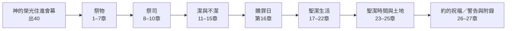
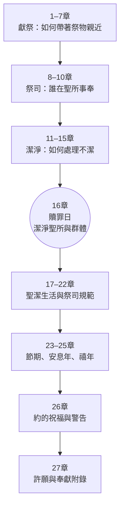
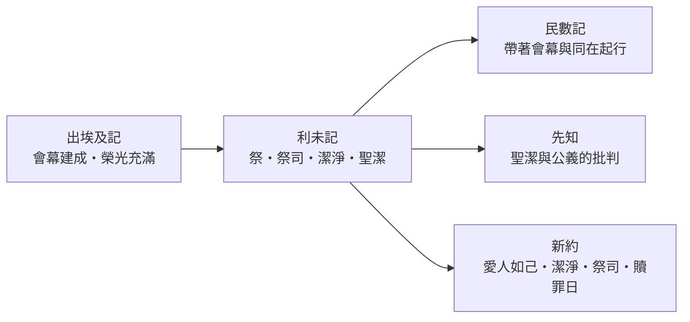

<!-- book-introduction-navigation:start -->
| [[03 利未記/全書目錄及綱要|全書目錄及綱要]] | [[03 利未記/第1章|開始讀第1章]] |
| :--- | ---: |
<!-- book-introduction-navigation:end -->

---

# 利未記

*神住在百姓中間之後・如何親近聖潔的神*

《利未記》常讓現代讀者覺得陌生，因為祭物、血、祭司、潔淨、節期與各種生活條例佔了大量篇幅。但它其實緊接《出埃及記》的最後一幕：會幕建成，神的榮光住在百姓中間。新的問題於是出現——一位聖潔的神住在營中，普通而且會犯罪的人要怎樣親近祂，又怎樣把「屬神」落實到敬拜、身體、家庭、土地、時間與社會生活？

<!-- sources: CT00, GT00, KC0, BH, BIBLEPROJECT -->

---

## 一覽

| 項目 | 資料 |
| --- | --- |
| 位置 | 摩西五經第三卷；故事停留在西乃會幕旁 |
| 章數 | 27 章 |
| 希伯來書名 | וַיִּקְרָא（Vayiqra，「祂呼叫／耶和華呼叫」），取自卷首 |
| 希臘／通行書名 | Leviticus，意指與利未／祭司事奉相關 |
| 傳統作者歸屬 | 摩西 |
| 傳統時間框架 | 會幕建立後到民數記起行前，約一個月；地點在西乃 |
| 全書核心 | 親近神、贖罪、祭司、潔淨與聖潔生活 |
| 結構中心 | 第16章贖罪日是全書重要樞紐 |

<!-- sources: CT00, GT00, KC0, BH, BIBLEPROJECT, ENTER_THE_BIBLE, YALE -->

---

## 書名與位置

希伯來書名取自第一節的 **וַיִּקְרָא（Vayiqra，「祂呼叫」）**：耶和華從會幕中呼叫摩西。這個開場很重要，因為《出埃及記》剛以榮光充滿會幕結束；《利未記》則從「住在會幕中的神開始說話」接續故事。

「利未記」這個通行名稱來自希臘文傳統，指向利未／祭司相關的事奉。不過全書並不只寫給祭司；許多條例直接面向全體以色列人，核心問題是整個群體怎樣在神的聖潔同在中生活。

> [!note] 它不是突然插進五經的一本宗教手冊
> 故事位置非常具體：**出埃及記40章會幕建成 → 利未記在會幕旁領受教導 → 民數記1章仍在西乃，之後才起行。**

<!-- sources: CT00, GT00, KC0, BH, BIBLEPROJECT -->

---

## 作者、成書與背景

按傳統理解，《利未記》是摩西五經第三卷，內容是耶和華在西乃會幕中曉諭摩西，再由摩西傳給亞倫、祭司與以色列百姓。CT00、KingComments 與 BibleHub 都沿用摩西作者傳統。若按敘事內部時間，利未記位在會幕建立後、以色列離開西乃前，時間跨度很短。

現代研究通常把《利未記》放在五經祭司傳統與聖潔傳統的長期形成中理解。Enter the Bible 指出，書中材料可能保存較早的祭司與社群傳統，但許多學者把最後編整放在巴比倫被擄或其後；這種看法試圖解釋本書對聖所、祭司、潔淨、土地與群體秩序的高度關注。

本書的文化背景也需要和現代生活拉開距離。祭牲、血禮、潔淨分類與祭司制度都屬於古代以色列的敬拜世界，與古代近東其他文化有可比較之處；但不能因為有相似儀式，就忽略以色列文本把這些制度放在「耶和華與以色列之約」中的特殊意義。

| 要分開看的問題 | 本卷導論的處理 |
| --- | --- |
| 故事時間 | 會幕已建成、以色列尚未離開西乃；敘事跨度約一個月。 |
| 傳統作者歸屬 | 摩西；以「耶和華曉諭摩西」的反覆公式呈現神的教導。 |
| 現代成書研究 | 常置於祭司／聖潔傳統的長期形成與編整中；最終編輯年代有不同模型。 |
| 社會與宗教背景 | 古代以色列會幕、祭司、祭祀、潔淨與土地／群體生活。 |

> [!important] 「潔淨／不潔淨」不等於「好人／壞人」
> 利未記的潔淨分類包含儀式與身體狀態，不能一律當成道德罪。閱讀時要區分 **罪、禮儀不潔、祭司資格、聖所界線** 等不同概念。

<!-- sources: CT00, GT00, KC0, BH, ENTER_THE_BIBLE, YALE -->

---

## 主旨：聖潔的神如何與祂的百姓同住

《利未記》的基本張力可以這樣理解：神已經住在營中，但神是聖潔的；以色列人卻會犯罪，也會進入各種不潔狀態。若沒有界線、潔淨與贖罪，神的同在對人不是只有安慰，也可能帶來危險。因此本書建立一整套「如何親近、如何潔淨、如何恢復」的秩序。

1–7章從祭物開始，8–10章建立祭司職分，11–15章處理潔與不潔，第16章贖罪日則像全書的樞紐：不只是個人，需要潔淨的還包括祭壇、聖所與整個群體。17章以後，焦點更明顯從「進到聖所」擴展到「把聖潔活在日常生活」——飲食、性倫理、鄰舍、公義、祭司、節期、土地與經濟安排都被放進屬神生活的範圍。

因此利未記的核心不是單純「很多禁令」，而是：**神願意住在百姓中間；親近祂需要贖罪與潔淨；屬於祂的人也要在生活中反映祂的聖潔。**

> [!summary] 從聖所往外看
> 前半卷較集中在 **如何靠近神**；後半卷則把焦點擴到 **既然屬神，整個生活如何成為聖潔**。

<!-- sources: CT00, GT00, KC0, BH, BIBLEPROJECT, ENTER_THE_BIBLE, YALE -->

---

## 本書的重要性與特色

《利未記》提供了後續聖經理解祭司、祭、血、贖罪、潔淨、聖潔、節期與禧年的基本語彙。沒有這些背景，讀到先知書對虛假敬拜的批判、福音書中的潔淨爭議，或《希伯來書》對祭司與贖罪日的討論，都容易失去原本的脈絡。

本書也把聖潔從「宗教儀式」推到日常倫理。利未記19章把敬畏父母、安息日、不可偷盜、不可欺壓工人、照顧窮人與寄居者、愛人如己放在同一個「你們要聖潔」框架中，顯示敬拜與社會生活不是兩個世界。

**第16章形成明顯中心**  
獻祭、祭司與潔淨問題在贖罪日集中處理；之後全書轉向整個百姓與土地如何活出聖潔。

**「聖潔」不是只屬於祭司**  
祭司有更嚴格的規範，但「你們要聖潔」面向整個以色列群體。

**聖潔涉及空間、時間與關係**  
會幕是聖潔空間；安息日與節期是聖潔時間；家庭、鄰舍、窮人、土地與經濟則把聖潔帶進關係。

**祭不能全都壓成同一個公式**  
利未記中的祭祀處理親近、感恩、罪、潔淨與恢復關係等不同功能，閱讀時要看清楚各種祭的語境。

<!-- sources: CT00, GT00, KC0, BH, BIBLEPROJECT, ENTER_THE_BIBLE, YALE -->

---

## 全書結構

最容易掌握《利未記》的方式，是看見第16章贖罪日位在中間。前面逐步處理祭物、祭司與潔淨；後面則把聖潔推向百姓生活、祭司資格、節期、土地與約。這使整卷書不像零散法條，而像從會幕中心向外擴張的一套聖潔秩序。

| 範圍 | 段落 | 內容重點 |
| --- | --- | --- |
| 1–7章 | 獻祭條例 | 燔祭、素祭、平安祭、贖罪祭、贖愆祭及祭司執行細則。 |
| 8–10章 | 祭司承接聖職 | 亞倫與眾子受膏、首次事奉，以及拿答、亞比戶事件的警戒。 |
| 11–15章 | 潔淨條例 | 食物、產後、皮膚病與排出物等潔／不潔狀態及恢復程序。 |
| 16章 | 贖罪日 | 一年一次潔淨至聖所、會幕、祭壇、祭司與全體百姓，是全書樞紐。 |
| 17–22章 | 聖潔生活 | 血、性倫理、鄰舍、公義、祭司與祭物資格；聖潔進入日常生活。 |
| 23–25章 | 聖潔的時間與土地 | 節期、安息年、禧年與土地／經濟秩序。 |
| 26–27章 | 約的結果與附錄 | 順服與悖逆的祝福／警告，以及許願奉獻相關規定。 |

<!-- sources: CT00, GT00, BH, BIBLEPROJECT, ENTER_THE_BIBLE, YALE -->

---

## 鑰節、鑰字與核心主題

《利未記》反覆出現「我是耶和華」、「聖潔」、「贖罪」、「潔淨」等語彙。這些詞把本書不同類型的律法串在一起：規則之所以重要，不只是維持宗教秩序，而是因為以色列住在神的同在中，而且是被神分別出來的百姓。

| 經文 | 在全書中的位置 |
| --- | --- |
| 利11:44–45 | 「你們要聖潔，因為我是聖潔的」；聖潔建立在神自己的身份上。 |
| 利16章 | 贖罪日；全書祭祀、潔淨與聖所問題的中心。 |
| 利17:11 | 生命在血中，血在祭壇上承擔贖罪功能，是理解祭祀的重要經文。 |
| 利19:2 | 「你們要聖潔」直接對全會眾說，聖潔不是祭司專利。 |
| 利19:18 | 「愛人如己」把聖潔與鄰舍倫理連起來，後來也被耶穌引用。 |
| 利25章 | 安息年與禧年把聖潔延伸到土地、債務、自由與經濟關係。 |

**鑰字／重複線索：** 聖潔、潔淨／不潔淨、贖罪、血、祭／供物、祭司、我是耶和華

- **親近與界線**：神願意百姓親近，但親近聖潔之神不能把聖所當成普通空間。
- **贖罪與潔淨**：罪與不潔會破壞人、群體與聖所的秩序；祭祀與潔淨儀式處理不同類型的失序。
- **聖潔生活**：聖潔不只關乎祭壇，也關乎身體、飲食、性倫理、鄰舍、公義、時間與土地。
- **記念神的拯救**：本書多次以「我是把你們從埃及領出來的耶和華」作為生活規範的根據。

<!-- sources: CT00, GT00, KC0, BH, BIBLEPROJECT, ENTER_THE_BIBLE, YALE -->

---

## 與前後書卷及整本聖經的關係

《利未記》最直接的前文是《出埃及記》25–40章。會幕建好、神的榮光住進去之後，利未記回答「百姓如何在這個同在旁生活」。到了《民數記》，百姓才真正拔營起行；因此三卷可以連成一條線：**建造神的居所 → 學習在神面前成為聖潔 → 帶著神的同在上路。**

先知書經常使用利未記的聖潔與約語言，卻也批判只做祭祀而沒有公義的敬拜。新約則大量回到利未記：耶穌引用「愛人如己」；福音書處理潔淨、痲瘋與祭司問題；《希伯來書》更以祭司、祭牲、血、會幕與贖罪日來說明基督。

因此閱讀利未記時既不能把所有制度直接搬到今天，也不能把它當成已經沒有價值的古代法規。它提供的是後續聖經理解「神的聖潔、人的親近、贖罪與成聖」的重要背景。

<!-- sources: CT00, GT00, KC0, BH, BIBLEPROJECT, ENTER_THE_BIBLE, YALE -->

---

> [!info]- 本頁來源與方法
>
> 本頁以 **CT00 的書卷提要節奏作為編排參考**；CT00、GT00、KC0、BH 是四套既有註釋來源，BibleProject、Enter the Bible、Yale 屬補強層，不加入四家共識票數。
>
> - **CT00**｜[CCBibleStudy 利未記提要](https://www.ccbiblestudy.org/Old%20Testament/03Lev/03CT00.htm)
> - **GT00**｜[CCBibleStudy 利未記導論拾穗](https://www.ccbiblestudy.org/Old%20Testament/03Lev/03GT00.htm)
> - **KC0**｜[KingComments — Leviticus Introduction](https://www.kingcomments.com/en/bible-studies/Lev/0)
> - **BH**｜[BibleHub — Leviticus Summary and Study Bible](https://biblehub.com/leviticus/)
> - **BIBLEPROJECT**｜[BibleProject — Book of Leviticus Guide](https://bibleproject.com/guides/book-of-leviticus/)
> - **ENTER_THE_BIBLE**｜[Enter the Bible — Leviticus](https://enterthebible.org/courses/leviticus/)
> - **YALE**｜[Yale Bible Study — Leviticus, Numbers, and Deuteronomy](https://yalebiblestudy.org/courses/leviticus-numbers-and-deuteronomy/)
>
> GT00 是多家導論與研讀資料的合輯，使用其中個別觀點時必須保留子來源；BibleHub 即使整合多種底層資料，在本專案仍只算一個 BH 來源維度。作者、年代、祭祀背景與潔淨概念若有分歧，本文按不同問題層次並列。

---

<!-- book-introduction-navigation:start -->
| [[03 利未記/全書目錄及綱要|全書目錄及綱要]] | [[03 利未記/第1章|開始讀第1章]] |
| :--- | ---: |
<!-- book-introduction-navigation:end -->
