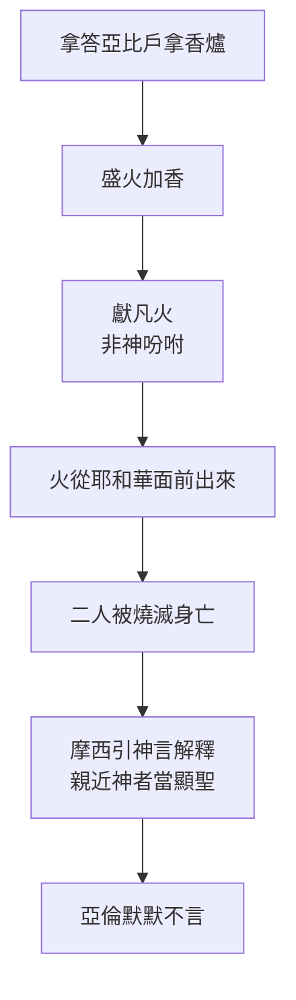
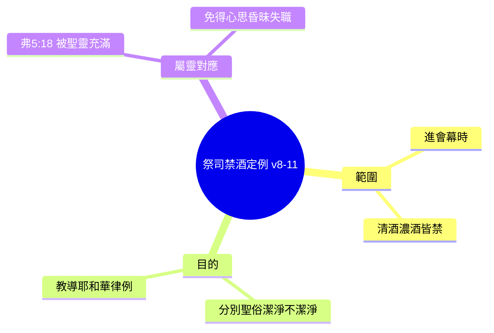
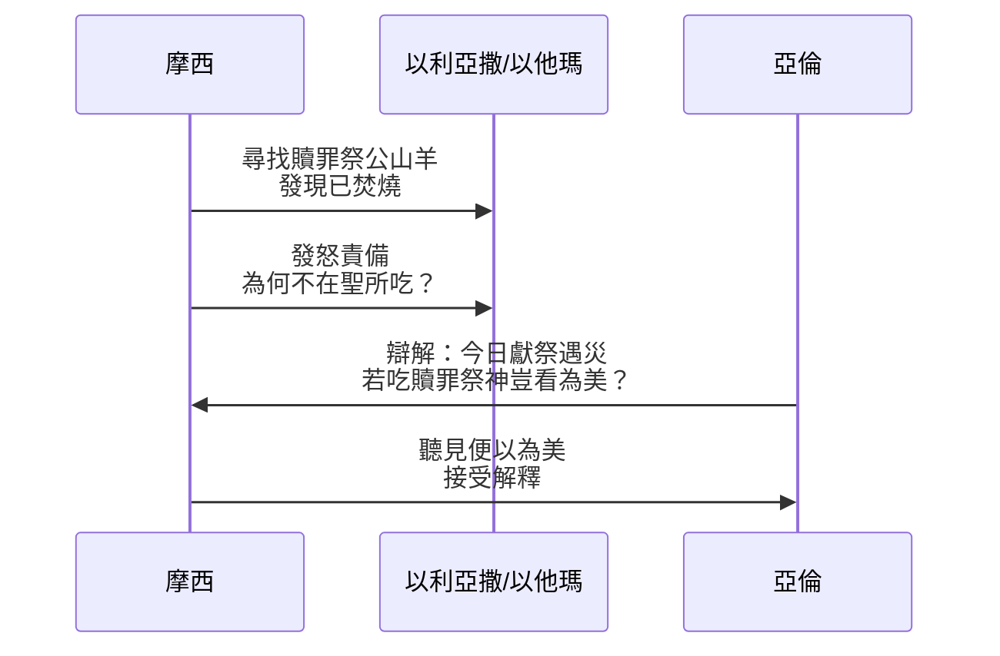

# 利未記 第10章

1. [[亞倫的祭司譜系|亞倫的兒子]][[拿答]]、[[亞比戶]]各拿自己的香爐，盛上火，加上香，在耶和華面前獻上[[凡火]]，是耶和華沒有吩咐他們的，
2. 就有火從耶和華面前出來，把他們燒滅，他們就死在耶和華面前。
3. 於是[[摩西]]對[[亞倫]]說：這就是耶和華所說：我在[[親近（qarab）|親近]]我的人中要顯為聖；在眾民面前，我要得榮耀。亞倫就默默不言。
4. [[摩西]]召了[[亞倫]]叔父烏薛的兒子[[米沙利和以利撒反|米沙利]]、[[米沙利和以利撒反|以利撒反]]來，對他們說：上前來，把你們的親屬從聖所前抬到營外。
5. 於是二人上前來，把他們穿著袍子抬到營外，是照[[摩西]]所吩咐的。
6. [[摩西]]對[[亞倫]]和他兒子[[以利亞撒]]、[[以他瑪]]說：不可蓬頭散髮，也不可撕裂衣裳，免得你們死亡，又免得耶和華向會眾發怒；只要你們的弟兄以色列全家為耶和華所發的火哀哭。
7. 你們也不可出會幕的門，恐怕你們死亡，因為耶和華的[[膏油（聖膏油）|膏油]]在你們的身上。他們就照[[摩西]]的話行了。
8. 耶和華曉諭[[亞倫]]說：
9. 你和你兒子進會幕的時候，清酒、濃酒都不可喝，免得你們死亡；這要作你們世世代代永遠的定例。
10. 使你們可以將聖的、俗的，潔淨的、不潔淨的，分別出來；
11. 又使你們可以將耶和華藉[[摩西]]曉諭以色列人的一切律例教訓他們。
12. [[摩西]]對[[亞倫]]和他剩下的兒子[[以利亞撒]]、[[以他瑪]]說：你們獻給耶和華火祭中所剩的[[素祭（minchah）|素祭]]，要在壇旁不帶酵而吃，因為是至聖的。
13. 你們要在聖處吃；因為在獻給耶和華的火祭中，這是你的分和你兒子的分；所吩咐我的本是這樣。
14. 所搖的胸，所舉的腿，你們要在潔淨地方吃。你和你的兒女都要同吃；因為這些是從以色列人[[平安祭（shelamim）|平安祭]]中給你，當你的分和你兒子的分。
15. 所舉的腿，所搖的胸，他們要與火祭的脂油一同帶來當[[搖祭（tenufah）|搖祭]]，在耶和華面前搖一搖；這要歸你和你兒子，當作永得的分，都是照耶和華所吩咐的。
16. 當下[[摩西]]急切地尋找作[[贖罪祭]]的公山羊，誰知已經焚燒了，便向[[亞倫]]剩下的兒子[[以利亞撒]]、[[以他瑪]]發怒，說：
17. 這[[贖罪祭]]既是至聖的，主又給了你們，為要你們擔當會眾的罪孽，在耶和華面前為他們贖罪，你們為何沒有在聖所吃呢？
18. 看哪，這祭牲的血並沒有拿到聖所裡去，你們本當照我所吩咐的，在聖所裡吃這祭肉。
19. [[亞倫]]對[[摩西]]說：今天他們在耶和華面前獻上[[贖罪祭]]和[[燔祭（olah）|燔祭]]，我又遇見這樣的災，若今天吃了贖罪祭，耶和華豈能看為美呢？
20. [[摩西]]聽見這話，便以為美。

---

## 本章知識節點

### 人物
- [[亞倫]]
- [[拿答]]
- [[亞比戶]]
- [[以利亞撒]]
- [[以他瑪]]
- [[摩西]]
- [[亞倫的祭司譜系]]
- [[米沙利和以利撒反]]

### 主題
- [[凡火]]
- [[祭司不可為死人哀哭（居喪條例）]]
- [[祭司禁酒的定例]]
- [[至聖的供物（聖與至聖之分）]]

### 神學
- [[聖俗潔淨不潔淨的分別]]
- [[贖罪祭]]

### 原文
- [[親近（qarab）]]
- [[膏油（聖膏油）]]
- [[素祭（minchah）]]
- [[平安祭（shelamim）]]
- [[搖祭（tenufah）]]
- [[燔祭（olah）]]

### 互文
- [[利10：3|利10：3 親近神者顯聖]]

---

## 本章整理

### 拿答亞比戶獻凡火與神的審判（v1-3）

利未記 10 章開啟了祭司供職第八天的悲劇。[[亞倫]] 的長子 [[拿答]] 和次子 [[亞比戶]] 「各拿自己的香爐，盛上火，加上香，在耶和華面前獻上凡火，是耶和華沒有吩咐他們的」（v1）。「[[凡火]]」指非從[[燔祭（olah）|燔祭壇]]取來的火（參民數記16:46），也可能暗示他們擅自決定燒香時間、地點，甚至酒後亂性（v9 禁酒令緊接其後）。CT 指出：「錯的是不遵神的命令擅自獻上凡火」；GT《啟導本》列舉六項觸犯條例：火源不聖、僭奪大祭司職權、時間逾越、酒後失態、儀式模倣異教、香料不合規定。KC 則強調：「他們所作的不是神所禁止的，而是神沒有吩咐的——引入屬肉體、自創的敬拜元素」。

火從耶和華面前出來燒滅二人（v2），身體衣物卻未燒毀（v5），顯示是超自然審判之火。摩西隨即引用神的話解釋：「我在親近我的人中要顯為聖；在眾民面前，我要得榮耀」（v3，參 [[利10：3]]）。「親近」原文 *qarab* 指祭司靠近神的特權（參 [[親近（qarab）]]），特權越大、責任越重（路 12:48）。[[亞倫]] 「默默不言」，CT 解為「接受神的管教，不敢表達哀戚」；GT《舊約聖經背景註釋》指出「他不是震驚得啞口無言，而是決意遵守在職祭司不得哀哭的規定」。

### 屍體處理與祭司哀悼禁令（v4-7）

摩西召喚亞倫堂叔 [[米沙利和以利撒反]] 把屍體穿著祭司袍子抬到營外（v4-5），免得聖所被死屍污染。GT《舊約背景註釋》說明：「照顧死者是親人責任，但亞倫兒子仍在供職，故召遠房親戚執行」。隨後摩西嚴令亞倫與倖存兒子 [[以利亞撒]]、[[以他瑪]]：「不可蓬頭散髮，也不可撕裂衣裳……不可出會幕的門」（v6-7），因為「耶和華的[[膏油（聖膏油）|膏油]]在你們身上」（v7）。CT 解經：「祭司是會眾代表，若得罪神必連累全會眾」；KC 指出「膏油象徵分別為聖，打斷供職即貶低神同在的重要性」。百姓可以哀哭，但祭司必須守住身分——這不是無情，而是「事奉神比骨肉之情更優先」（CT 靈訓）。

| 禁令對象 | 禁止行為 | 理由 | 來源 |
|----------|----------|------|------|
| 亞倫、以利亞撒、以他瑪 | 蓬頭散髮、撕裂衣裳、出會幕門 | 免得死亡、免得耶和華向會眾發怒、膏油在身上 | v6-7 |
| 以色列全家 | 可為耶和華所發的火哀哭 | 表達對神審判的敬畏 | v6 |

### 祭司禁酒條例與聖俗分別職責（v8-11）

神「曉諭[[亞倫]]」（v8），KC 注意到這是利未記極少數神直接對亞倫說話，顯示「雖兒子犯罪，神仍視亞倫為大祭司」。核心條例：「進會幕時，清酒、濃酒都不可喝……免得你們死亡」（v9），作「世世代代永遠的定例」。目的有二：(1)「使你們可以將聖的、俗的，潔淨的、不潔淨的，分別出來」（v10，參 [[聖俗潔淨不潔淨的分別]]）；(2)「將耶和華藉摩西曉諭以色列人的一切律例教訓他們」（v11）。CT 靈意註解：「不要醉酒，乃要被聖靈充滿（弗 5:18）」。GT《啟導本》補充古代近東背景：「在近東，適於人飲的食水缺乏，須用酒滲入水中來消毒，醉酒實難避免」，故須立嚴格定例。祭司的教導職責在瑪 2:7 重申：「祭司的嘴唇當存知識，人當從他口中尋求律法」。

### 祭司應得之分與贖罪祭處理爭議（v12-20）

摩西吩咐亞倫與兩個兒子吃剩下的 [[素祭（minchah）]]：「在壇旁不帶酵而吃，因為是至聖的」（v12-13）。[[平安祭（shelamim）]] 的 [[搖祭（tenufah）]] 胸和舉祭腿可在「潔淨地方」由祭司全家食用（v14-15），CT 靈意：「在神同在裡享用基督，取用復活的愛（搖胸）與升天的大能（舉腿）」。然而摩西尋找為會眾贖罪的公山羊，發現已被焚燒（v16），向以利亞撒、以他瑪發怒（v17-18）。亞倫辯解：「今天獻上贖罪祭燔祭，我又遇見這樣的災，若吃了贖罪祭，耶和華豈能看為美呢？」（v19）。摩西聽罷「便以為美」（v20）。

這段引發解經爭議：CT 認為亞倫兒子「因家中有罪不敢吃，按指定罪獻祭條例焚燒」；KC 則說「血未進聖所，按例祭司當在聖所吃，他們卻焚燒了，屬職守疏忽」。GT《啟導本》綜合：「亞倫因劇變無心茶飯，兒子或因父未吃、或恐殃及自己，情有可原，摩西接受解釋」。BH 強調「祭司吃贖罪祭象徵擔當會眾罪孽（v17），亞倫拒吃反映對神聖潔的敬畏與自我不配感」。

### 跨章脈絡：祭司聖職的建立與試煉

利未記 8-10 章構成完整單元：8 章按立禮（七日）、9 章首次獻祭（第八日神火納祭）、10 章祭司犯罪與條例補充。三章反覆出現「照耶和華吩咐摩西的」（8:4,9,13,17,21,29；9:6,7,10,21；10:7,13,15），強調順服是聖職核心。拿答亞比戶之死成為「親近神者當顯聖」的負面教材，也引出祭司禁酒、哀悼限制、飲食條例等永久定例。KC 總結：「人總是幾乎立即敗壞神所賜的美善——亞當、挪亞、王權、教會皆然」。新約對應：五旬節聖靈降火（徒 2:3）納基督獻祭；亞拿尼亞撒非喇獻「凡火」（私心）被擊殺（徒 5:1-11），呼應「神是烈火」（來 12:29）。GT《丁良才利未記註釋》指出「現在的信徒也是親近神的祭司」（彼前2:9），當戰兢謹守，分別聖俗，以聖靈而非肉體事奉。

**參考資料**
https://www.ccbiblestudy.org/Old%20Testament/03Lev/03CT10.htm
https://www.ccbiblestudy.org/Old%20Testament/03Lev/03GT10.htm
https://www.kingcomments.com/en/bible-studies/Lev/10
https://biblehub.com/study/leviticus/10.htm
