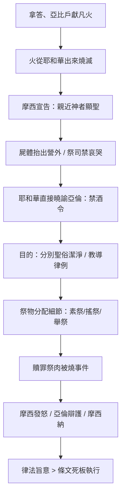

# 利未記 第10章

1. 亞倫的兒子[[拿答、亞比戶]]各拿自己的香爐，盛上火，加上香，在耶和華面前獻上[[凡火（陌生的火）|凡火]]，是[[凡火（陌生的火）|耶和華沒有吩咐他們的]]，
2. 就[[火從耶和華面前出來|有火從耶和華面前出來]]，把他們[[火從耶和華面前出來燒滅他們|燒滅]]，他們就[[火從耶和華面前出來燒滅他們|死在耶和華面前]]。
3. 於是[[摩西]]對亞倫說：這就是耶和華所說：我[[在親近我的人中要顯為聖]]；在眾民面前，[[在親近我的人中要顯為聖|我要得榮耀]]。亞倫就[[在親近我的人中要顯為聖|默默不言]]。
4. [[摩西]]召了亞倫叔父[[米沙利、以利撒反|烏薛的兒子]][[米沙利、以利撒反]]來，對他們說：上前來，把你們的親屬從聖所前[[營外|抬到營外]]。
5. 於是二人上前來，把他們穿著袍子[[營外|抬到營外]]，是照[[摩西]]所吩咐的。
6. [[摩西]]對[[亞倫和他兒子（祭司）|亞倫和他兒子]][[以利亞撒、以他瑪]]說：不可蓬頭散髮，也不可撕裂衣裳，免得你們死亡，又免得耶和華向會眾發怒；只要你們的弟兄以色列全家為耶和華所發的火哀哭。
7. 你們也不可出[[會幕（帳幕整體）|會幕]]的門，恐怕你們死亡，因為[[耶和華的膏油（shemen mishchat YHWH）|耶和華的膏油]]在你們的身上。他們就照[[摩西]]的話行了。
8. 耶和華曉諭亞倫說：
9. 你和你兒子進[[會幕（帳幕整體）|會幕]]的時候，[[祭司不可喝酒|清酒、濃酒都不可喝]]，免得你們死亡；這要作你們[[永遠的定例|世世代代永遠的定例]]。
10. 使你們可以將聖的、俗的，潔淨的、不潔淨的，分別出來；
11. 又使你們可以將耶和華藉[[摩西]]曉諭以色列人的一切律例教訓他們。
12. [[摩西]]對亞倫和他剩下的兒子[[以利亞撒、以他瑪]]說：你們獻給耶和華火祭中所剩的[[素祭（minchah）|素祭]]，要在壇旁不帶酵而吃，因為是[[至聖|至聖的]]。
13. 你們要在聖處吃；因為在獻給耶和華的火祭中，這是你的分和你兒子的分；所吩咐我的本是這樣。
14. 所搖的胸，所舉的腿，你們要在[[潔淨處|潔淨地方]]吃。你和你的兒女都要同吃；因為這些是從以色列人平安祭中給你，當你的分和你兒子的分。
15. 所舉的腿，所搖的胸，他們要與火祭的脂油一同帶來當[[搖祭（tenufah）|搖祭]]，在耶和華面前搖一搖；這要歸你和你兒子，當作[[永遠的定例|永得的分]]，都是照耶和華所吩咐的。
16. 當下[[摩西]]急切地尋找作[[贖罪祭]]的公山羊，誰知已經焚燒了，便向亞倫剩下的兒子[[以利亞撒、以他瑪]]發怒，說：
17. 這[[贖罪祭]]既是[[至聖|至聖的]]，主又給了你們，為要你們[[摩西因贖罪祭肉被燒而發怒|擔當會眾的罪孽]]，在耶和華面前為他們贖罪，你們為何沒有在聖所吃呢？
18. 看哪，這祭牲的血並沒有拿到聖所裡去，你們本當照我所吩咐的，在聖所裡吃這祭肉。
19. 亞倫對[[摩西]]說：今天他們在耶和華面前獻上[[贖罪祭]]和[[燔祭（olah）|燔祭]]，[[亞倫解釋今日獻贖罪祭燔祭仍遭禍|我又遇見這樣的災]]，[[耶和華豈看為美呢|若今天吃了贖罪祭，耶和華豈能看為美呢]]？
20. [[摩西]]聽見這話，[[摩西聽了便以為美|便以為美]]。

---

## 本章知識節點

### 神學
- [[在親近我的人中要顯為聖]]
- [[聖俗]]
- [[潔淨不潔淨]]
- [[教導律例]]
- [[永遠的定例]]

### 儀式與制度
- [[凡火（陌生的火）]]
- [[祭司不可喝酒]]
- [[贖罪祭]]
- [[燔祭（olah）]]
- [[素祭（minchah）]]
- [[搖祭（tenufah）]]
- [[舉祭（terumah）]]
- [[至聖]]
- [[潔淨處]]

### 人物
- [[拿答、亞比戶]]
- [[亞倫和他兒子（祭司）]]
- [[摩西]]
- [[以利亞撒、以他瑪]]
- [[米沙利、以利撒反]]
- [[烏薛]]

### 地點與物件
- [[會幕（帳幕整體）]]
- [[營外]]
- [[耶和華的膏油（shemen mishchat YHWH）]]
- [[酒和濃酒（yayin veshekar）]]

### 事件與判例
- [[火從耶和華面前出來燒滅他們]]
- [[摩西因贖罪祭肉被燒而發怒]]
- [[亞倫解釋今日獻贖罪祭燔祭仍遭禍]]
- [[摩西聽了便以為美]]
- [[耶和華豈看為美呢]]

---

## 本章整理

### 奈答、亞比戶獻凡火與神的審判（v1-3）
亞倫的長子[[拿答、亞比戶|拿答、亞比戶]]各拿香爐，盛火加香，在耶和華面前獻上[[凡火（陌生的火）|凡火]]，這是耶和華**沒有吩咐**他們的。火從耶和華面前出來，把他們燒滅，他們就死在耶和華面前。摩西隨即對亞倫說：「這就是耶和華所說：『我在親近我的人中要顯為聖；在眾民面前，我要得榮耀。』」亞倫就默默不言。這段敘事確立了[[在親近我的人中要顯為聖|聖潔的非妥協性]]：祭司職分的親近權柄，必須嚴格遵循神的規定，任何自作主張的「創新」都屬於褻瀆聖物，招致瞬間的審判。[[火從耶和華面前出來燒滅他們|火從耶和華面前出來]]不僅是刑罰，更是神榮耀的顯現，劃定了[[聖俗|聖與俗]]的不可逾越界線。

### 屍體處理與祭司哀哭禁令（v4-7）
摩西召來亞倫叔父[[烏薛|烏薛]]的兒子[[米沙利、以利撒反|米沙利、以利撒反]]，將兩具屍體穿著袍子抬到[[營外|營外]]。隨後摩西向亞倫和剩下的兒子[[以利亞撒、以他瑪|以利亞撒、以他瑪]]下達嚴令：不可蓬頭散髮、不可撕裂衣裳（傳統哀悼儀式），也不可出[[會幕（帳幕整體）|會幕]]的門，否則必死，因為[[耶和華的膏油（shemen mishchat YHWH）|耶和華的膏油]]在他們身上。全會眾卻可以為耶和華所發的火哀哭。這反映祭司的分別為聖地位高於個人情感與家庭倫理；膏油象徵獻身於聖職的永久印記，使祭司成為「行走的聖所」，不可因喪禮污穢而中斷事奉。

### 祭司禁酒令與教導職責（v8-11）
耶和華**直接曉諭亞倫**（罕見不透過摩西），頒布[[永遠的定例|永遠的定例]]：亞倫和兒子進會幕時，[[酒和濃酒（yayin veshekar）|清酒、濃酒都不可喝]]，免得死亡。目的有二：(1) 使你們可以將[[聖俗|聖的、俗的]]、[[潔淨不潔淨|潔淨的、不潔淨的]]分別出來；(2) 使你們可以將耶和華藉摩西曉諭以色列人的一切[[教導律例|律例教訓他們]]。酒精會模糊屬靈辨別力，祭司若醉酒便無法執行核心職能——「分別」與「教導」。這條律例將祭司職任的認知層面（辨別聖俗潔淨）與教導層面（傳遞律法）綁定，奠定利未記後續潔淨律法的執行基礎。

### 祭物分配細節：素祭、搖祭、舉祭（v12-15）
摩西指示亞倫、以利亞撒、以他瑪處理剩餘祭物：(1) [[素祭（minchah）|素祭]]的餘分要在壇旁不帶酵而吃，因為是[[至聖|至聖]]；(2) [[搖祭（tenufah）|所搖的胸]]、[[舉祭（terumah）|所舉的腿]]要在[[潔淨處|潔淨地方]]吃，連兒女同吃，作為永得的分。這段重申第 6-7 章規定，強調祭司家庭在聖職中的共同參與權，也顯示祭物分配有嚴格空間層級：至聖物只能在聖所區（壇旁），較低聖度的搖祭舉祭可在潔淨處食用。

### 贖罪祭肉被燒：摩西怒、亞倫辯、摩西納（v16-20）
摩西尋找[[贖罪祭|贖罪祭]]的公山羊，發現已被焚燒，便向以利亞撒、以他瑪發怒：贖罪祭是[[至聖|至聖]]，主給你們擔當會眾罪孽、在耶和華面前贖罪，為何沒在聖所吃呢？亞倫回應：「今天他們在耶和華面前獻上贖罪祭和[[燔祭（olah）|燔祭]]，我又遇見這樣的災，若今天吃了贖罪祭，耶和華豈能看為美呢？」摩西聽見，便以為美。這場對話揭示祭儀律法的**靈活邊界**：儀式細節（吃贖罪祭肉）服務於贖罪功能，當祭司因直系親屬慘死而處於極度哀痛與儀式張力中，強行進食反而褻瀆聖物。亞倫的辯護基於「神看內心」的神學直覺，摩西的接納則顯示領袖權柄對屬靈分辨的尊重。

### 跨章脈絡：聖職聖潔與領袖責任
本章以悲劇開啟，以律例頒布與智慧判例收尾，構成利未記「聖潔法典」的關鍵轉折。[[拿答、亞比戶|拿答、亞比戶]]之死警告：親近神非憑熱忱乃憑真理；[[祭司不可喝酒|禁酒令]]與教導職責確立祭司為「聖俗分別」的守門人；贖罪祭判例則示範律法的旨意高於條文。新約《希伯來書》以此為背景，對比基督作大祭司「能體恤我們的軟弱」，卻「無一不像我們一樣受過試探，只是沒有犯罪」（來 4:15），完成了利未祭司體系指向卻無法完全實現的聖潔標準。

**參考資料**
https://biblehub.com/study/leviticus/10.htm
https://www.ccbiblestudy.org/Old%20Testament/03Lev/03CT10.htm
https://www.ccbiblestudy.org/Old%20Testament/03Lev/03GT10.htm
https://www.kingcomments.com/en/bible-studies/Lev/10
