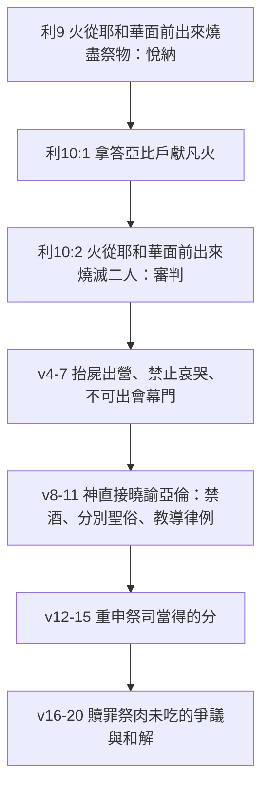

# 利未記 第10章

<!-- chapter-navigation:start -->
| [前一章](../03%20利未記/第9章.md) | [回目錄](../03%20利未記/全書目錄及綱要.md) | [下一章](../03%20利未記/第11章.md) |
| :--- | :---: | ---: |
<!-- chapter-navigation:end -->

1. [[亞倫的祭司譜系|亞倫的兒子]][[拿答]]、[[亞比戶]]各拿自己的[[香爐]]，盛上火，加上香，在耶和華面前獻上[[凡火]]，是耶和華沒有吩咐他們的，
2. 就有火從耶和華面前出來，把他們燒滅，他們就死在耶和華面前。
3. 於是[[摩西]]對[[亞倫]]說：這就是耶和華所說：我在[[親近]]我的人中要顯為聖；在眾民面前，我要得榮耀。亞倫就默默不言。
4. [[摩西]]召了[[亞倫]]叔父烏薛的兒子[[米沙利和以利撒反|米沙利]]、[[米沙利和以利撒反|以利撒反]]來，對他們說：上前來，把你們的親屬從聖所前抬到營外。
5. 於是二人上前來，把他們穿著袍子抬到營外，是照[[摩西]]所吩咐的。
6. [[摩西]]對[[亞倫]]和他兒子[[以利亞撒]]、[[以他瑪]]說：不可蓬頭散髮，也不可撕裂衣裳，免得你們死亡，又免得耶和華向會眾發怒；只要你們的弟兄以色列全家為耶和華所發的火哀哭。
7. 你們也不可出會幕的門，恐怕你們死亡，因為耶和華的膏油在你們的身上。他們就照[[摩西]]的話行了。
8. 耶和華曉諭[[亞倫]]說：
9. 你和你兒子進會幕的時候，清酒、濃酒都不可喝，免得你們死亡；這要作你們世世代代永遠的定例。
10. 使你們可以將聖的、俗的，潔淨的、不潔淨的，分別出來；
11. 又使你們可以將耶和華藉[[摩西]]曉諭以色列人的一切律例教訓他們。
12. [[摩西]]對[[亞倫]]和他剩下的兒子[[以利亞撒]]、[[以他瑪]]說：你們獻給耶和華火祭中所剩的[[素祭（minchah）|素祭]]，要在壇旁不帶酵而吃，因為是至聖的。
13. 你們要在聖處吃；因為在獻給耶和華的火祭中，這是你的分和你兒子的分；所吩咐我的本是這樣。
14. 所搖的胸，所舉的腿，你們要在潔淨地方吃。你和你的兒女都要同吃；因為這些是從以色列人[[平安祭]]中給你，當你的分和你兒子的分。
15. 所舉的腿，所搖的胸，他們要與火祭的脂油一同帶來當[[搖祭]]，在耶和華面前搖一搖；這要歸你和你兒子，當作永得的分，都是照耶和華所吩咐的。
16. 當下[[摩西]]急切地尋找作[[贖罪祭]]的公山羊，誰知已經焚燒了，便向[[亞倫]]剩下的兒子[[以利亞撒]]、[[以他瑪]]發怒，說：
17. 這[[贖罪祭]]既是至聖的，主又給了你們，為要你們擔當會眾的罪孽，在耶和華面前為他們贖罪，你們為何沒有在聖所吃呢？
18. 看哪，這祭牲的血並沒有拿到聖所裡去，你們本當照我所吩咐的，在聖所裡吃這祭肉。
19. [[亞倫]]對[[摩西]]說：今天他們在耶和華面前獻上[[贖罪祭]]和[[燔祭]]，我又遇見這樣的災，若今天吃了贖罪祭，耶和華豈能看為美呢？
20. [[摩西]]聽見這話，便以為美。

---

## 本章知識節點

### 人物
- [[亞倫]]
- [[拿答]]
- [[亞比戶]]
- [[以利亞撒]]
- [[以他瑪]]
- [[摩西]]
- [[亞倫的祭司譜系]]
- [[米沙利和以利撒反]]

### 主題
- [[凡火]]
- [[祭司不可為死人哀哭（居喪條例）]]
- [[祭司禁酒的定例]]
- [[至聖的供物（聖與至聖之分）]]
- [[壇火常燒不熄滅]]
- [[銅壇（燔祭壇）]]

### 神學
- [[聖俗潔淨不潔淨的分別]]
- [[贖罪祭]]
- [[平安祭]]
- [[燔祭]]

### 原文
- [[親近]]
- [[聖膏油]]
- [[素祭（minchah）]]
- [[搖祭]]

### 文化
- [[香爐]]

### 歷史
- [[補行逾越節]]

### 互文
- [[利10：3|利10：3 親近神的人中要顯為聖]]

---

## 本章整理

### 獻上一把神沒有吩咐的火（v1-3）

上一章結尾，火從耶和華面前出來燒盡壇上的祭物，全會眾歡呼俯伏。第十章開頭，同一句話再出現一次——「有火從耶和華面前出來」——這一次燒死的是[[亞倫]]的兩個兒子。

事情的經過只有一節：[[拿答]]和[[亞比戶]]「各拿自己的[[香爐]]，盛上火，加上香，在耶和華面前獻上[[凡火]]，是耶和華沒有吩咐他們的」（v1）。問題出在火的來源。GT 引丁良才說得直接：「這火不是從燔祭壇上得的，大概是從會幕院中，祭司作飯的地方所取來的凡火」；CT 則把兩種火的分別講清楚：「『凡火』指祭壇以外任何地方取來的火；而祭壇上的聖火來自神自己（參九24），其後早晚添柴，不可熄滅（參六12）」——也就是說，該用的火就在旁邊的[[銅壇（燔祭壇）|燔祭壇]]上燒著（見[[壇火常燒不熄滅]]），他們卻另外去取。STEP語言資料可以確認「凡」這個字的分量：原文 אֵשׁ זָרָה 的 זָרָה 是 זוּר（H2114A，詞典義「be a stranger」）的分詞，CT 給的〔原文字義〕也是「疏離，陌生的」。

==KC 把這件事的性質講得最準：他們犯的不是禁令。== 「拿答和亞比戶的錯不在於他們做了神所禁止的事，而在於他們做了神沒有吩咐他們做的事。他們並沒有違反任何一條特定的誡命，而是照自己認為合適的方式行事。」按世界的標準，他們並沒有背叛神——他們想要事奉神，只是用了與神所指示不同的方式。

**他們到底在哪裡燒香？各家沒有共識，而不同的地點對應不同的罪。** GT 引丁良才把三種可能一一列出，每一種都附上錯在哪裡：

| 假設的地點 | 丁良才列出的錯處 |
| --- | --- |
| 在會幕前燒香（類似可拉黨） | 兩個錯：不當用凡火、不當妄逞己意 |
| 要進聖所燒香 | 三個錯：神只要祭司早晚燒香、不當用凡火、不當妄逞自己的意思燒香 |
| 要進至聖所燒香 | 三個錯：正月不是在至聖所燒香的時候、在至聖所燒香是大祭司一人的本分、不當用凡火 |

GT 收的《舊約聖經問題總解》也照樣列出同樣三種看法。至於他們為什麼要這樣做，丁良才另外給了三個推測：一是「他們因為得了這尊榮的地位，便生傲慢的心」，二是「他們飲酒過多」，三是「他們的情感受了過分的衝動」。GT《啟導本》則不分地點，直接列出六項可能觸犯的條例：火源、僭奪大祭司職責、時間、醉酒、儀式近於異教、香的配方與香爐本身。

> [!note] 還有一種比較同情的讀法
> GT《舊約聖經背景註釋》給的動機完全不同：「亞倫二子認為需要香煙來防止百姓直接看見神的榮耀（見十六3），所以便從別的地方（凡火）取炭應用。」按這個讀法，他們不是傲慢也不是醉酒，而是眼看祭壇「燒著烈火，難以走近」，情急之下就近取火——錯仍是錯，動機卻是護衛而非僭越。

火燒死了他們，卻沒有燒毀衣服和身體（v5）。丁良才由此判斷「顯明這不是尋常的火」，並整理出全書的三種火：「有三樣的火：（一）聖火（九24），（二）凡火（十1），（三）罰火（十2）。」他還注意到報應的形式：「拿答和亞比戶因火犯了罪，神也是用火罰了他們」——與哈曼被掛在自己預備的木架上、控告但以理的人自己被扔進獅子坑是同一種寫法。

摩西當場引神的話解釋：「我在[[親近]]我的人中要顯為聖；在眾民面前，我要得榮耀」（v3，全節見[[利10：3]]）。STEP語言資料顯示，這裡的「親近我的人」用的是形容詞 קָרֹב（H7138，詞典義「near」），而不是v4「上前來」的動詞 קָרַב；「顯為聖」（אֶקָּדֵשׁ）與「得榮耀」（אֶכָּבֵד）則都是第一人稱單數的 Niphal 形——神說的是「我要在他們身上被顯為聖、被得著榮耀」。

「[[亞倫]]就默默不言。」對這句話，各家的解釋不完全一樣。CT 讀為情緒：「意指不敢出聲表達哀戚之意。」GT《舊約聖經背景註釋》則明說不是情緒：「舉哀的慣例是要大聲慟哭，亞倫的沉默與之相對。他不是震驚得啞口無言，而是決意遵守在職祭司不得哀哭的規定。」KC 讀為順服：「亞倫保持沉默。這是一個很說明問題的反應。神的介入沒有在他裡面引起任何抗拒。他用沉默承認，這件事沒有什麼可辯解的。」

### 屍體、哀哭，與一條不准跨出的門檻（v4-7）

摩西召了[[米沙利和以利撒反]]把屍體抬到營外。丁良才點出他們的身分：烏薛是亞倫父親暗蘭的兄弟，所以這兩人是拿答、亞比戶的堂叔。GT《舊約聖經背景註釋》說明為什麼要找到這麼遠的親屬：「照顧死者是親人的重要責任之一。這時死者的弟弟仍在獻祭，不能抽身。故此需要召來遠房親戚執行當盡的義務。」

這件差事有代價。GT《聖經精讀本》追出了後果：兩人「因移動、觸摸拿答和亞比戶的屍體，成為不潔的人」，而觸摸死屍的不潔要持續七天，「他們因此不能參加那年正月14日的逾越節」——為了他們和其他類似情況，才特別制定了一個月後第十四日補過逾越節的法則（見[[補行逾越節]]）。一場葬禮的處理，在民數記留下了一條長久的定例。

對亞倫和剩下的[[以利亞撒]]、[[以他瑪]]，摩西下的是禁令（見[[祭司不可為死人哀哭（居喪條例）]]）：不可蓬頭散髮、不可撕裂衣裳、不可出會幕的門，「因為耶和華的[[聖膏油|膏油]]在你們的身上」（v7）。GT《舊約聖經背景註釋》解釋膏油為什麼構成理由：「膏油一旦開始了這個過程，將之打斷就是貶低了聖所之聖潔和神之臨在的重要性。」KC 則提醒這不等於要人無情：「這並不表示我們被呼召要變得麻木。百姓可以哀哭。」

### 神親自對亞倫說話：不可喝酒，要會分辨（v8-11）

v8 有一個容易被讀過去的細節：這一次神不是曉諭摩西，而是直接曉諭亞倫。GT《串珠聖經註釋》指出這件事的稀有：「利未記只有在此處記載神直接向亞倫啟示，表明雖然他的兒子犯了大罪，神仍然視他為大祭司，為神與人之間的中保。」丁良才讀出同樣的用意——這樣做「一面是要安慰亞倫，一面也是要在百姓面前，使他得尊榮，叫百姓重看祭司的職分」。

條例本身是[[祭司禁酒的定例]]：進會幕時清酒濃酒都不可喝，作世世代代永遠的定例（v9）。禁令的理由寫在下一節：要能「將聖的、俗的，潔淨的、不潔淨的，分別出來」（v10，見[[聖俗潔淨不潔淨的分別]]），並要把律例教訓百姓（v11）。丁良才把兩者的因果講明：「本節顯明酒能使人的腦子混亂，甚至不分善惡及可行與不可行的。」GT《啟導本》另補上一個現實背景：「在近東，適於人飲的食水缺乏，須用酒滲入水中來消毒，醉酒實難避免」，所以這條禁令並不是無的放矢。

> [!info] 「聖／俗／潔淨／不潔淨」是四個字，不是兩對同義詞
> STEP語言資料列出這四個詞各有專字：קֹדֶשׁ（H6944G，聖）、חֹל（H2455，詞典義「common」，俗）、טָמֵא（H2931，不潔淨）、טָהוֹר（H2889，詞典義「pure」，潔淨），動詞「分別出來」是 בָּדַל（H914）的 Hiphil。GT《舊約聖經背景註釋》說明這四個詞怎麼組合成一套制度：聖物全都是潔淨的，而非聖物（俗物）則有些潔淨、有些不潔；祭司的職責就是維持兩者之間的分別，其方法稱為「聖潔範圍」——以至聖所為中心，向外一圈一圈是潔淨程度各有不同的聖潔地帶。

### 該吃的沒有吃（v12-20）

後半章回到祭司的口糧。摩西吩咐把所剩的[[素祭（minchah）|素祭]]在壇旁不帶酵而吃（v12-13），[[平安祭]]中[[搖祭|所搖]]的胸與所舉的腿則可以在潔淨地方由全家同吃（v14-15）。丁良才點出兩者的差別：平安祭的分「是聖的卻不是至聖的，所以他家中一切的人，或男、或女，都可以吃」，而素祭、[[贖罪祭]]與贖愆祭的肉「只有亞倫子孫中的男丁可以在聖處吃」（見[[至聖的供物（聖與至聖之分）]]）。

接著出事。摩西「急切地尋找作贖罪祭的公山羊，誰知已經焚燒了」（v16），就向[[以利亞撒]]、[[以他瑪]]發怒。STEP語言資料在這裡看得見中文譯不出的語氣：v16 的「急切地尋找」原文是 דָּרַשׁ（H1875）不定詞絕對式加完成式，同一個字重複兩次；v18 摩西說「你們本當……吃這祭肉」，原文同樣是 אָכַל（H398）的重複強調結構——CT 的〔原文字義〕分別註為「急切地尋找（原文雙同字）」與「本當（原文無此字）」，指的就是這兩處。

亞倫的回答是全章唯一一次有人對摩西提出異議：「今天他們在耶和華面前獻上贖罪祭和燔祭，我又遇見這樣的災，若今天吃了贖罪祭，耶和華豈能看為美呢？」（v19）摩西聽見，「便以為美」（v20）。

各家對亞倫父子為什麼沒吃，說法不同：

| 來源 | 為什麼沒吃 |
| --- | --- |
| GT 丁良才 | 「祭司又因自己家中有罪不敢吃，就按著為會眾指定之罪獻祭的條例將肉焚燒了」 |
| GT《啟導本》 | 「這是職守的疏忽，也觸犯了規例」，但亞倫剛逢劇變沒有心情，兩子或因父未吃、或恐殃及自己，「都屬情有可原」 |
| GT《利未記雷氏研讀本》 | 「由於這兩個兒子的死，他和他其餘的兒子都感到自己不配」 |
| KC | 長子與幼子的失敗不同型：「長子們是按自己的意思行事。亞倫和其餘的兒子卻不是這樣；他們是出於軟弱。」所以摩西接受了他們的解釋 |
| GT《舊約聖經背景註釋》 | 引米格倫的說法：贖罪祭有吸收不潔的功能，兩子陳屍聖所「可能大增贖罪祭所吸收的不潔，使祭肉對祭司有致命的作用」——亞倫的話反映的是恐懼和謹慎 |

丁良才另外注意到一件敘事上的事：摩西責備的是兩個兒子而不是亞倫，「或者是因為他們有管理吃祭肉的責任」；而整段記載本身讓他下了一個判斷——「本段顯明利未記的真實，人若虛造本書，就萬難捏造這事。」

### 一章書的兩端：沒有吩咐與照著吩咐

這一章從「是耶和華沒有吩咐他們的」（v1）開始，到「都是照耶和華所吩咐的」（v15）與「照我所吩咐的」（v18）結束。STEP語言資料顯示這幾處用的是同一個動詞 צָוָה（H6680）：v1 是它的否定式，v13 是 Pual 形的「所吩咐我的」，v18 是 Piel 第一人稱的「我所吩咐的」。整章的骨架就架在這個字的正反兩面上。

```mermaid
flowchart TD
    A["利9 火從耶和華面前出來燒盡祭物：悅納"] --> B["利10:1 拿答亞比戶獻凡火"]
    B --> C["利10:2 火從耶和華面前出來燒滅二人：審判"]
    C --> D["v4-7 抬屍出營、禁止哀哭、不可出會幕門"]
    D --> E["v8-11 神直接曉諭亞倫：禁酒、分別聖俗、教導律例"]
    E --> F["v12-15 重申祭司當得的分"]
    F --> G["v16-20 贖罪祭肉未吃的爭議與和解"]
```

KC 把這一章放進一個更長的模式裡：人幾乎總是在神賜下美善之後立刻把它敗壞——亞當在受造的園子裡如此，挪亞在潔淨過的地上如此，後來的君王制度如此，教會也如此。丁良才則從另一端收束：拿答和亞比戶原有「四樣特別的利益」——是大祭司的兒子、住在聖處、所供的是聖職、神的榮耀為他們顯現——正因為得的多，要的也多。CT 收在同一句主的話上：「多給誰，就向誰多取；多託誰，就向誰多要」（路十二48）。

**參考資料**
https://www.ccbiblestudy.org/Old%20Testament/03Lev/03CT10.htm
https://www.ccbiblestudy.org/Old%20Testament/03Lev/03GT10.htm
https://www.kingcomments.com/en/bible-studies/Lev/10
https://biblehub.com/study/leviticus/10.htm
https://github.com/STEPBible/STEPBible-Data

<!-- chapter-navigation:start -->
| [前一章](../03%20利未記/第9章.md) | [回目錄](../03%20利未記/全書目錄及綱要.md) | [下一章](../03%20利未記/第11章.md) |
| :--- | :---: | ---: |
<!-- chapter-navigation:end -->
