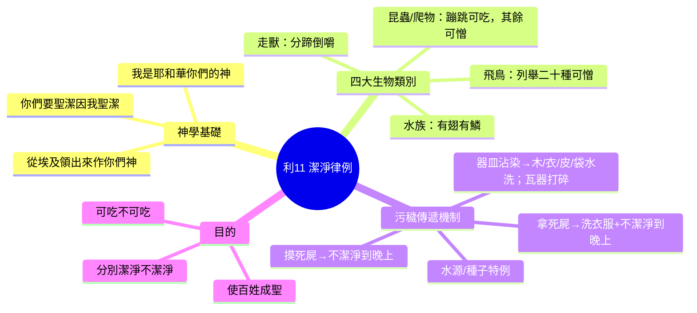
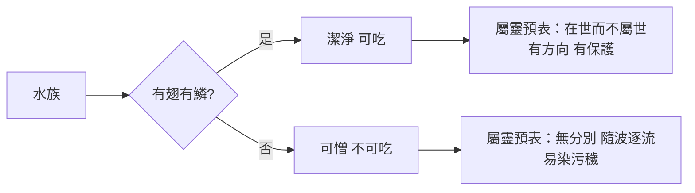
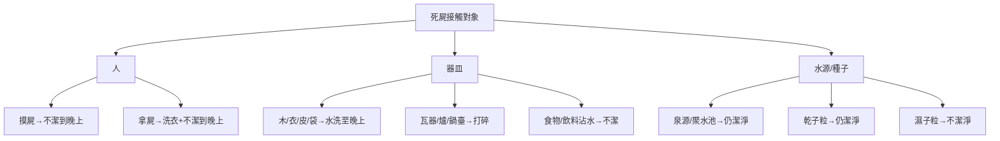
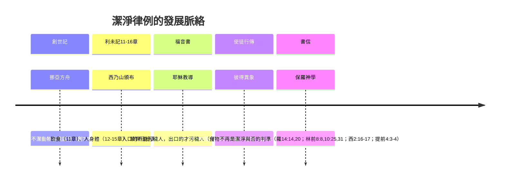

# 利未記 第11章

1. 耶和華對[[摩西]]、亞倫說：
2. 你們曉諭以色列人說，在地上一切走獸中可吃的乃是這些：
3. 凡[[分蹄倒嚼（潔淨走獸的判準）|蹄分兩瓣]]、[[分蹄倒嚼（潔淨走獸的判準）|倒嚼]]的走獸，你們都可以吃。
4. 但那[[分蹄倒嚼（潔淨走獸的判準）|倒嚼]]或分蹄之中不可吃的乃是：駱駝─因為倒嚼不分蹄，就與你們不潔淨；
5. [[沙番（shaphan）|沙番]]─因為[[分蹄倒嚼（潔淨走獸的判準）|倒嚼]]不分蹄，就與你們不潔淨；
6. 兔子─因為[[分蹄倒嚼（潔淨走獸的判準）|倒嚼]]不分蹄，就與你們不潔淨；
7. [[豬與異教祭祀的關聯|豬]]─因為[[分蹄倒嚼（潔淨走獸的判準）|蹄分兩瓣]]，卻不[[分蹄倒嚼（潔淨走獸的判準）|倒嚼]]，就與你們不潔淨。
8. 這些獸的肉，你們不可吃；死的，你們不可摸，都與你們不潔淨。
9. 水中可吃的乃是這些：凡在水裡、海裡、河裡、[[有翅有鱗（潔淨水族的判準）|有翅有鱗]]的，都可以吃。
10. 凡在海裡、河裡，並一切水裡游動的活物，[[有翅有鱗（潔淨水族的判準）|無翅無鱗]]的，你們都當以為可憎。
11. 這些[[有翅有鱗（潔淨水族的判準）|無翅無鱗]]、以為可憎的，你們不可吃他的肉；死的也當以為可憎。
12. 凡水裡[[有翅有鱗（潔淨水族的判準）|無翅無鱗]]的，你們都當以為可憎。
13. [[不潔淨雀鳥（二十種可憎飛禽）|雀鳥]]中你們當以為可憎、不可吃的乃是：鵰、狗頭鵰、紅頭鵰、
14. 鷂鷹、小鷹與其類；
15. [[潔淨與不潔淨|烏鴉]]與其類；
16. 鴕鳥、夜鷹、魚鷹、鷹與其類；
17. 鴞鳥、鸕鶿、貓頭鷹、
18. 角鴟、鵜鶘、禿鵰、
19. 鸛、鷺鷥與其類；戴鵀與蝙蝠。
20. 凡有翅膀用四足爬行的物，你們都當以為可憎。
21. 只是有翅膀用四足爬行的物中，有足有腿，在地上蹦跳的，你們還可以吃。
22. 其中有[[蹦跳的蝗蟲類（潔淨昆蟲）|蝗蟲]]、螞蚱、蟋蟀與其類；蚱蜢與其類；這些你們都可以吃。
23. 但是有翅膀有四足的爬物，你們都當以為可憎。
24. 這些都能使你們不潔淨。凡摸了死的，必不潔淨到晚上。
25. 凡拿了死的，必不潔淨到晚上，並要洗衣服。
26. 凡走獸分蹄不成兩瓣、也不[[分蹄倒嚼（潔淨走獸的判準）|倒嚼]]的，是與你們不潔淨；凡摸了的就不潔淨。
27. 凡四足的走獸，用掌行走的，是與你們不潔淨；摸其屍的，必不潔淨到晚上。
28. 拿其屍的，必不潔淨到晚上，並要洗衣服。這些是與你們不潔淨的。
29. [[地上爬物（八種不潔爬蟲）|地上爬物]]與你們不潔淨的乃是這些：鼬鼠、鼫鼠、蜥蜴與其類；
30. 壁虎、龍子、守宮、蛇醫、蝘蜓。
31. 這些爬物都是與你們不潔淨的。在他死了以後，凡摸了的，必不潔淨到晚上。
32. 其中死了的，掉在什麼東西上，這東西就不潔淨，無論是木器、衣服、皮子、口袋，不拘是做什麼工用的器皿，須要放在水中，必不潔淨到晚上，到晚上才潔淨了。
33. 若有死了掉在瓦器裡的，其中不拘有什麼，就不潔淨，你們要把這瓦器打破了。
34. 其中一切可吃的食物，沾水的就不潔淨，並且那樣器皿中一切可喝的，也必不潔淨。
35. 其中已死的，若有一點掉在什麼物件上，那物件就不潔淨，不拘是爐子，是鍋臺，就要打碎，都不潔淨，也必與你們不潔淨。
36. 但是泉源或是聚水的池子仍是潔淨；惟挨了那死的，就不潔淨。
37. 若是死的，有一點掉在要種的子粒上，子粒仍是潔淨；
38. 若水已經澆在子粒上，那死的有一點掉在上頭，這子粒就與你們不潔淨。
39. 你們可吃的走獸若是死了，有人摸他，必不潔淨到晚上；
40. 有人吃那死了的走獸，必不潔淨到晚上，並要洗衣服；拿了死走獸的，必不潔淨到晚上，並要洗衣服。
41. 凡地上的爬物是可憎的，都不可吃。
42. 凡用肚子行走的和用四足行走的，或是有許多足的，就是一切爬在地上的，你們都不可吃，因為是可憎的。
43. 你們不可因什麼爬物使自己成為可憎的，也不可因這些使自己不潔淨，以致染了[[污穢]]。
44. 我是耶和華─你們的神；所以你們要成為聖潔，因為我是聖潔的。你們也不可在地上的爬物[[污穢]]自己。
45. 我是把你們從埃及地領出來的耶和華，要作你們的神；所以你們要聖潔，因為我是聖潔的。
46. 這是走獸、飛鳥，和水中游動的活物，並地上爬物的條例。
47. 要把潔淨的和不潔淨的，可吃的與不可吃的活物，都分別出來。

---

## 本章知識節點

### 神學
- [[聖潔生活]]
- [[聖潔飲食]]
- [[潔淨與不潔淨]]
- [[污穢]]

### 主題
- [[不潔淨雀鳥（二十種可憎飛禽）]]
- [[分蹄倒嚼（潔淨走獸的判準）]]
- [[地上爬物（八種不潔爬蟲）]]
- [[有翅有鱗（潔淨水族的判準）]]
- [[蹦跳的蝗蟲類（潔淨昆蟲）]]

### 人物
- [[摩西]]
- [[亞倫和他兒子（祭司）]]

### 背景
- [[潔淨與不潔淨的早期區分]]
- [[豬與異教祭祀的關聯]]

### 原文
- [[沙番（shaphan）]]

### 解經爭議
- [[瓦器打碎銅器擦淨]]

---

## 本章整理

### 概論與神學基礎（v1-2, 44-47）

利未記第 11 章是「潔淨與不潔淨律例」的開篇，神同時對摩西、亞倫說話（v1），顯示這些條例不僅關乎祭司職分，更關乎全體會眾的日常生活（CT、GT）。本章結構清晰：先按生物棲息域劃分四大類——走獸（v2-8）、水族（v9-12）、飛鳥（v13-19）、昆蟲與爬物（v20-23, 29-30, 41-43）；再論接觸屍體的污穢傳遞（v24-40）；最後以「我是耶和華你們的神，你們要聖潔，因為我是聖潔的」（v44-45）作為神學總綱，並以 v46-47 總結條例目的：「要把潔淨的和不潔淨的、可吃的與不可吃的活物都分別出來」。

> [!quote] 核心神學聲明（CT、KC、BH）
> 「我是把你們從埃及地領出來的耶和華，要作你們的神；所以你們要聖潔，因為我是聖潔的」（v45）。這句話在利未記重複出現（11:44-45; 19:2; 20:7,26; 21:8），是全書倫理動力的錨點：聖潔不只是儀式分別，更是因救贖關係而活出的屬神性格。

**新約視角的轉折**：耶穌宣告「入口的不能污穢人」（可 7:18-19），彼得異象見「神所潔淨的，你不可當作俗物」（徒 10:15），保羅斷言「食物不能叫神看中我們」（林前 8:8）、「不再受不可拿不可嘗不可摸的規條轄制」（西 2:20-21）。但彼得前書仍引用本章呼召：「你們也要在一切所行的事上聖潔」（彼前 1:15-16）。**飲食律例的字句雖廢，其背後「分別為聖、效法神聖潔」的原則卻永存**（GT《靈修版聖經注釋》）。

---

### 走獸的潔淨與不潔淨（v3-8）

神設立 **「分蹄倒嚼」** 雙重判準（v3）：蹄完全分為兩瓣、且反芻的走獸纔可吃。這雙重標準在屬靈預表上被廣泛解讀：分蹄表徵「行動有分別、腳步穩固」，倒嚼表徵「反覆思想神話語、消化吸收屬靈養分」（路 2:19；詩 1:2）——**二者缺一不可**（CT、KC）。

四種「只符合單一條件」的動物被列為反面教材（v4-7）：

| 動物 | 符合條件 | 缺失條件 | 屬靈預表（CT、KC） |
|------|----------|----------|-------------------|
| 駱駝 | 倒嚼 | 不分蹄 | 「能說不能行」（太 23:3） |
| 沙番 | 倒嚼 | 不分蹄 | 「吸收一切不分真假」（詩 119:128） |
| 兔子 | 倒嚼 | 不分蹄 | 同上（外表像反芻實非真反芻） |
| 豬 | 分蹄 | 不倒嚼 | 「有敬虔外貌卻背棄敬虔實意」（提後 3:5） |

> [!note] 關於 [[沙番（shaphan）]] 與兔子「倒嚼」的科學爭議
> 現代生物學證實二者非真反芻動物（無四胃），但牠們咀嚼動作極似反芻（兔子有「再食行為」refection）。聖經依「眾目所見的現象」立法，而非現代分類學標準（GT《舊約背景註釋》《艾基斯難題彙編》）。這提醒我們：律例的授受對象是古代以色列平民，判準必須簡單可辨。

**[[豬與異教祭祀的關聯|豬與異教祭祀的關聯]]**：舊約聖經背景註釋記載，赫人某些儀式必須獻豬為祭給冥界神祇，豬在美索不達米亞也是獻給鬼魔的祭物，埃及色特神尤其以豬為聖，而以豬為祭物的例證主要來自希臘和羅馬，獻祭對象大都是冥界神祇（GT《舊約背景註釋》）。以賽亞書 65:4、66:3,17 更將吃豬肉與拜偶像、拜死人連結。神禁止豬肉，除衛生考量外，更具「斷絕異教文化滲透」的神學意義。

v8 進一步規定：這些不潔走獸的肉不可吃，**死屍連摸也不可摸**——「死的，你們不可摸，都與你們不潔淨」。死亡是罪的工價（羅 6:23），接觸死屍即預表接觸屬靈死亡的影響力（林前 5:11；約貳 9-11）。

---

### 水族的潔淨與不潔淨（v9-12）

水族判準極簡單：**「[[有翅有鱗（潔淨水族的判準）|有翅有鱗]]」纔可吃**（v9）。「翅」即魚鰭，賦予游動方向與逆流能力；「鱗」提供保護屏障，隔絕水中污穢（CT、KC）。這雙重特徵預表信徒在世俗洪流中：「有翅」——靠信心得自由、不隨波逐流；「有鱗」——持守聖潔、不被世界玷污（林後 6:17；帖前 4:4）。

無翅無鱗者（鰻、鱔、蝦、蟹、貝類、鯨豚等）一律列為「可憎」（v10-12）。「可憎」一詞在本章專用於水族、飛鳥、爬物（v10-13,20,23,41-42），語氣比走獸的「不潔淨」更重，顯示神對「屬地、屬水、無分別」生命型態的厭惡。

---

### 飛鳥與昆蟲的潔淨與不潔淨（v13-23）

本章**不列舉可吃飛鳥**，反而列出 **二十種「可憎不可吃」的飛鳥**（v13-19），大多屬猛禽、食腐鳥、夜行鳥、水邊覓食鳥。CT、KC 歸納其屬靈特徵四點：
1. **殘忍掠奪**——以弱小生命為食（鷹、鵰、烏鴉）；
2. **孤獨陰暗**——棲息荒涼、夜間活動（鴞、鴟、蝙蝠）；
3. **吃不潔之物**——以屍體、污穢為食（禿鷲、鸛、鷺）；
4. **兩面派**——蝙蝠「似鳥非鳥、似鼠非鼠」，預表假冒偽善、最終離道反教（啟 3:9；提後 3:4）。

> [!quote] 蝙蝠的屬靈警示（CT）
> 「蝙蝠像鳥而非鳥，像鼠而非鼠的『兩面派』……神也討厭教會中那些兩面派的『蝙蝠』；又加上蝙蝠又是在黑暗之夜才出來活動的，牠們不行在光明中。」

昆蟲部分（v20-23）以「四足爬行」為基準，但 **「有足有腿、在地上蹦跳者」例外可吃**（v21-22）：[[蹦跳的蝗蟲類（潔淨昆蟲）|蝗蟲、螞蚱、蟋蟀、蚱蜢]]。這四類後腿發達，能脫離地面跳躍，預表「雖活在地上，卻能超越屬地纏累，過屬天生活」（約 17:14-17；西 3:2）。其餘爬行昆蟲（蒼蠅、螞蟻、甲蟲等）一律「可憎」（v23）。

| 類別 | 判準 | 可吃代表 | 不可吃代表 | 屬靈意義 |
|------|------|----------|------------|----------|
| 飛鳥 | 列舉法（20種可憎） | 鴿子、鵪鶉（隱含） | 鷹、烏鴉、鴞、蝙蝠等 | 拒絕掠奪、陰暗、污穢、兩面派的生命型態 |
| 昆蟲 | 四足爬行為基準，蹦跳者例外 | 蝗蟲、蚱蜢、蟋蟀、螞蚱 | 蒼蠅、螞蟻、甲蟲等 | 蹦跳＝脫離地的纏累；爬行＝貼地而行、隨從肉體 |

---

### 接觸屍體的污穢傳遞與處理（v24-40）

本段建立 **「死屍傳染不潔」的機制**，分三層對象：

1. **人**（v24-28, 39-40）：摸不潔走獸/爬物屍體 → 不潔淨到晚上；拿屍體 → 洗衣服 + 不潔淨到晚上。連可吃走獸若非按例宰殺而自死，摸其屍、吃其肉、拿其屍同樣不潔淨（v39-40）。「晚上」在猶太曆法是新一天的開始，預表「經過洗滌與等待，得著新的開始」（CT、KC）。

2. **器皿**（v32-35）：
   - 木器、衣服、皮子、口袋等**可水洗者** → 放入水中至晚上潔淨（v32）；
   - 瓦器（未施釉）、**爐子、鍋臺**等**多孔吸污者** → 必須打碎（v33,35）；
   - 食物、飲料沾水者 → 一律不潔淨（v34）。

   > [!important] [[瓦器打碎銅器擦淨|瓦器打碎]]的預表（CT、KC）
   > 「瓦器表徵肉體；人的肉體須被破碎」（林後 4:7）。木器表徵人性，衣服/皮子/口袋表徵外在行為——**人性與行為須被道中的水洗滌**（弗 5:26），但舊造肉體（瓦器）唯有破碎重塑。

3. **水源與種子**（v36-38）：
   - 泉源、聚水池 → **流動/大量水不因死屍不潔**（v36），預表「聖靈活水的充滿超越污穢」（約 7:38-39）；
   - 乾子粒 → 掉死屍仍潔淨（v37），因種子落土腐爛發芽，生命力勝過死亡；
   - 濕子粒 → 掉死屍即不潔淨（v38），因水使污穢滲透，預表「受洗/領受真理後更當逃避污穢」（提後 2:22）。

---

### 爬物的全面禁止與聖潔呼召（v41-45）

v41-43 將「地上一切爬物」一律定為「可憎、不可吃」：用肚子行（蛇）、四足行（蜥蜴）、多足行（蜈蚣、蠍子）。這些生物「貼地而行」，與創 3:14 蛇被咒詛「用肚子行走」呼應，預表 **「以地為家、心懷屬地事」的生命**（腓 3:19；西 3:2）。神嚴詞禁止：「你們不可因這些爬物使自己成為可憎、不潔淨、染了污穢」（v43）。

v44-45 給出 **根本理由**：
> 「我是耶和華你們的神；所以你們要成為聖潔，因為我是聖潔的。你們也不可在地上的爬物污穢自己。我是把你們從埃及地領出來的耶和華，要作你們的神；所以你們要聖潔，因為我是聖潔的。」

這雙重宣告（創造/立約主權 + 救贖/拯救恩典）構成聖潔的雙重動力：**神是誰、神做了什麼，決定祂子民當成何樣人**（CT、KC、BH）。

---

### 跨章脈絡：從飲食律例到新約的屬靈實踐

利未記 11-15 章統稱「潔淨律例」：11 章論生物，12-15 章論人身體、衣物、房屋，16 章為贖罪日總潔淨（GT《串珠聖經註釋》）。丁良才《利未記註釋》指出，這些條例既已藉十字架撤去，信徒不再受其字句約束，理由有四：入口的不能污穢人（可七15、18-19）、食物不能叫神看中我們（林前八8）、禮節上的潔與不潔是已經撤去了（羅十四14、20；可七18-19；林前十25；提前四3-4；徒十14-15）、人不可因飲食論斷我們（西二16-17）。他接著強調，這些條例雖不能約束我們，內中的精義卻仍大有益處：遵守的猶太人較少生疾病、較為長壽；神所喜悅的聖潔不單與靈魂有關，也與肉體有關，因肉體是靈魂辦事的機關，又是借基督寶血救贖的，所以人或吃或喝都要為榮耀神而行（林前十31）；違犯衛生的飲食便是犯罪，因信徒是重價買來的，應在身子上榮耀神（林前六20）；而這條例本身也證明摩西的律法出於神——摩西雖有埃及人的一切學問（徒七22），所傳律法卻在好些事上與埃及條例相反，且摩西年間並無人知道動物身上有寄生蟲和傳染疾病的黴菌，可見這條例不是出於摩西或別人。

> [!quote] 彼得對本章的引用
> 「那召你們的既是聖潔，你們在一切所行的事上也要聖潔，因為經上記著說：『你們要聖潔，因為我是聖潔的』」（彼前 1:15-16，引利未記十一44-45等處為據）。

**今日應用**（綜合 CT、GT、KC、BH）：KC 指出，吃是將某物納入內心、使其成為自己的一部分；CT 則說「吃含有接觸身外之物、接受到裡面、消化調和為一、變作生活能力而活」的意思——我們被吸引不吃代表屬靈惡行的動物，也被鼓勵吃代表聖潔與屬靈生命的食物。分蹄倒嚼、有翅有鱗、蹦跳離地，都指向「在世卻不屬世」的分別原則（約 17:14-17）；地上爬物、貼地而行則是「以地為家、追求屬地事物」的警戒（腓 3:18-19；西 3:2）。

---

> [!example]- 本章關鍵詞彙速查
> - **[[分蹄倒嚼（潔淨走獸的判準）|分蹄倒嚼]]**：走獸潔淨雙重判準（v3）
> - **[[有翅有鱗（潔淨水族的判準）|有翅有鱗]]**：水族潔淨雙重判準（v9）
> - **[[蹦跳的蝗蟲類（潔淨昆蟲）|蹦跳昆蟲]]**：蝗蟲、蚱蜢、蟋蟀、螞蚱（v22）
> - **[[地上爬物（八種不潔爬蟲）|八種爬物]]**：鼬鼠、鼫鼠、蜥蜴、壁虎、龍子、守宮、蛇醫、蝘蜓（v29-30）
> - **[[不潔淨雀鳥（二十種可憎飛禽）|二十種可憎飛禽]]**：鵰、狗頭鵰、紅頭鵰、鷂鷹、小鷹、烏鴉、鴕鳥、夜鷹、魚鷹、鷹、鴞鳥、鸕鷀、貓頭鷹、角鴟、鵜鶘、禿鵰、鸛、鷺鷥、戴鵀、蝙蝠（v13-19）
> - **[[瓦器打碎銅器擦淨|瓦器打碎]]**：多孔吸污器皿唯一處理方式（v33,35）
> - **泉源仍潔淨**：活水不受死屍污染（v36）
> - **乾子粒/濕子粒**：生命力與滲透性的對比（v37-38）

**參考資料**
https://www.ccbiblestudy.org/Old%20Testament/03Lev/03CT11.htm
https://www.ccbiblestudy.org/Old%20Testament/03Lev/03GT11.htm
https://www.kingcomments.com/en/bible-studies/Lev/11
https://biblehub.com/study/leviticus/11.htm
